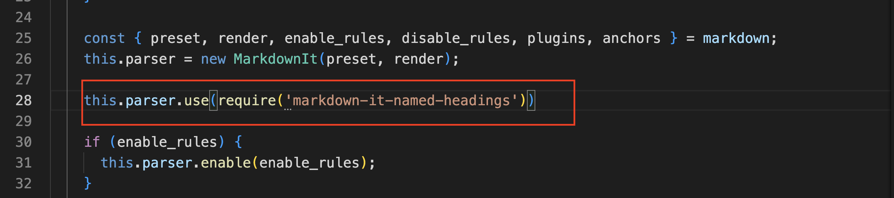

# Hi～👀

这里是Eddie的博客

## 注意事项

- 在新设备上clone仓库下来之后要执行一次`npm install`命令将所有博客需要的依赖下载下来。
  
- NodeJs的版本不能太高，有一些博客需要的依赖在高版本的NodeJs中被弃用了，可以安装一个[NVM](https://github.com/nvm-sh/nvm/blob/master/README.md)来管理node的版本。

## issue

### 文章目录无法跳转的问题

  打开浏览器的开发者模式，toc-link并没有生成，所以没有办法实现跳转，解决办法：

  安装插件：

  ```shell
  npm install markdown-it-named-headings --save
  ```

  然后进入项目的根目录，修改根目录下 `node_modules\hexo-renderer-markdown-it\lib\renderer.js` 文件，在 `renderer.js` 中添加一行以使用此插件：

  ```js
  parser.use(require('markdown-it-named-headings'))
  ```

  

