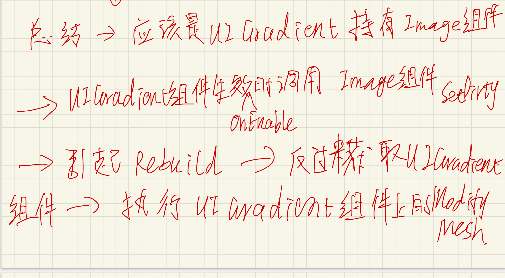

# 粒子缩放的问题

在某些分辨率下粒子的缩放没有受CanvasScaler的影响

# CanvasScaler的作用机制

# 先缩放再设置位置和先设置位置再缩放的区别有区别么


# 对多个Pass的理解

我最近在学习屏幕后处理相关的知识 其中提到了Graphics.Blit方法，其中的参数是srcTexture destTexture material shaderPass 按照我目前对Shader的理解 Shader是要附给一个材质 然后这个材质要附到一个模型上 然后模型会表现出Shader里的某些效果 但是RenderTexture应该不是模型吧？那为什么可以对RenderTexture使用Shader呢？ 

你的问题触及了Unity中渲染流程的一个重要概念。确实，通常情况下，Shader是附加到材质上的，而材质则应用于模型上，以此来控制模型的渲染方式。然而，在屏幕后处理和其他高级渲染技术中，Shader的使用方式与传统的模型渲染有所不同。

### `Graphics.Blit` 和 Shader

`Graphics.Blit`是Unity中用于将一个纹理（Texture或RenderTexture）的内容复制到另一个RenderTexture并且可以通过Shader对这个过程进行控制的方法。这个方法常用于屏幕后处理，因为它允许你在渲染的最后阶段修改整个渲染结果，实现各种视觉效果，如模糊、色彩校正、辉光等。

### 为什么可以对`RenderTexture`使用Shader

- **渲染到纹理**：在使用`Graphics.Blit`时，Shader实际上是作用于一个全屏四边形（或叫全屏Quad）上的。这个四边形覆盖了整个屏幕（或目标RenderTexture的尺寸），Shader根据输入的源纹理（`srcTexture`）和提供的材质（`material`）来处理图像，并将结果渲染到目标RenderTexture（`destTexture`）上。这个过程并不需要传统意义上的3D模型。

- **屏幕空间的渲染**：在后处理过程中，我们通常在屏幕空间进行操作，这意味着Shader处理的是二维图像数据而非三维场景。因此，`RenderTexture`可以被视为一个画布，Shader则根据其算法改变这个画布上的像素，实现各种图像效果。

- **Shader的灵活性**：Shader编程非常灵活，它不仅可以用于计算3D模型的表面属性（如光照、纹理映射等），还可以用于直接处理图像数据。这使得Shader成为实现复杂图像处理算法的理想工具，尤其是在GPU提供的并行计算能力下。

### 实际应用

在屏幕后处理中，`Graphics.Blit`配合自定义Shader可以实现多种复杂的效果。例如，一个简单的反色Shader可能会这样工作：对于输入的每一个像素，它计算出反色值，然后输出到目标RenderTexture。这个过程不涉及任何3D模型，而是直接在图像数据上进行操作。

总的来说，`RenderTexture`和Shader的结合打开了Unity渲染技术的新领域，使得开发者能够实现丰富的视觉效果和图像处理功能，这些在传统的基于模型的渲染流程中是难以实现的。

那么我还有关于可以指定ShaderPass的疑问，比如下面这一段实现高斯模糊效果的Shader
Shader "Unity Shader Book/Chapter 12/GaussianBlur"
{
	Properties {
		_MainTex ("Base (RGB)", 2D) = "white" {}
		_BlurSize ("Blur Size", Float) = 1.0
	}
    SubShader
    {
        CGINCLUDE

        #include "UnityCG.cginc"
        
        sampler2D _MainTex;
        half4 _MainTex_TexelSize;
        float _BlurSize;

        struct v2f
        {
            float4 pos : SV_POSITION;
            half2 uv[5] : TEXCOORD0;
        };

        v2f vertexBlurVertical(appdata_img v)
        {
			v2f o;
			o.pos = UnityObjectToClipPos(v.vertex);
			
			half2 uv = v.texcoord;
			
			o.uv[0] = uv;
			o.uv[1] = uv + float2(0.0, _MainTex_TexelSize.y * 1.0) * _BlurSize;
			o.uv[2] = uv - float2(0.0, _MainTex_TexelSize.y * 1.0) * _BlurSize;
			o.uv[3] = uv + float2(0.0, _MainTex_TexelSize.y * 2.0) * _BlurSize;
			o.uv[4] = uv - float2(0.0, _MainTex_TexelSize.y * 2.0) * _BlurSize;
					 
			return o;
        }

        v2f vertexBlurHorizontal(appdata_img v)
        {
           	v2f o;
			o.pos = UnityObjectToClipPos(v.vertex);
			
			half2 uv = v.texcoord;
			
			o.uv[0] = uv;
			o.uv[1] = uv + float2(_MainTex_TexelSize.x * 1.0, 0.0) * _BlurSize;
			o.uv[2] = uv - float2(_MainTex_TexelSize.x * 1.0, 0.0) * _BlurSize;
			o.uv[3] = uv + float2(_MainTex_TexelSize.x * 2.0, 0.0) * _BlurSize;
			o.uv[4] = uv - float2(_MainTex_TexelSize.x * 2.0, 0.0) * _BlurSize;

            return o;
        }

        fixed4 fragBlur(v2f i) : SV_Target{
            float weight[3] = {0.4026, 0.2442, 0.0545};

            fixed3 sum = tex2D(_MainTex, i.uv[0]).rgb * weight[0];

            for(int it = 1; it < 3; it++)
            {
                sum += tex2D(_MainTex, i.uv[it*2 - 1]).rgb * weight[it];
                sum += tex2D(_MainTex, i.uv[it*2]).rgb * weight[it];
            }

            return fixed4(sum, 1.0);
        }

        
        ENDCG
        
        ZTest Always
        Cull Off
        ZWrite Off
        
        Pass
        {
            Name "GAUSSIAN_BLUR_VERTICAL"
            
            CGPROGRAM

            #pragma vertex vertexBlurVertical
            #pragma fragment fragBlur
            
            ENDCG
        }

        Pass
        {
            Name "GAUSSIAN_BLUR_HORIZONTAL"
            
            CGPROGRAM

            #pragma vertex vertexBlurHorizontal
            #pragma fragment fragBlur
            
            ENDCG
        }        

    }
    
    Fallback "Diffuse"
}


我的代码部分的调用如下：
using UnityEngine;
using System.Collections;

public class GaussianBlur : PostEffectsBase {

	public Shader gaussianBlurShader;
	private Material gaussianBlurMaterial = null;

	public Material material {  
		get {
			gaussianBlurMaterial = CheckShaderAndCreateMaterial(gaussianBlurShader, gaussianBlurMaterial);
			return gaussianBlurMaterial;
		}  
	}

	// Blur iterations - larger number means more blur.
	[Range(0, 4)]
	public int iterations = 3;
	
	// Blur spread for each iteration - larger value means more blur
	[Range(0.2f, 3.0f)]
	public float blurSpread = 0.6f;
	
	[Range(1, 8)]
	public int downSample = 2;
	
	void OnRenderImage (RenderTexture src, RenderTexture dest) {
		if (material != null) {
			int rtW = src.width/downSample;
			int rtH = src.height/downSample;

			RenderTexture buffer0 = RenderTexture.GetTemporary(rtW, rtH, 0);
			buffer0.filterMode = FilterMode.Bilinear;

			Graphics.Blit(src, buffer0);

			for (int i = 0; i < iterations; i++) {
				material.SetFloat("_BlurSize", 1.0f + i * blurSpread);

				RenderTexture buffer1 = RenderTexture.GetTemporary(rtW, rtH, 0);

				// Render the vertical pass
				Graphics.Blit(buffer0, buffer1, material, 0);

				RenderTexture.ReleaseTemporary(buffer0);
				buffer0 = buffer1;
				buffer1 = RenderTexture.GetTemporary(rtW, rtH, 0);

				// Render the horizontal pass
				Graphics.Blit(buffer0, buffer1, material, 1);

				RenderTexture.ReleaseTemporary(buffer0);
				buffer0 = buffer1;
			}

			Graphics.Blit(buffer0, dest);
			RenderTexture.ReleaseTemporary(buffer0);
		} else {
			Graphics.Blit(src, dest);
		}
	}
}

我的第一个问题是：OnRenderImage是每一帧都调用的，但按照我的理解 ONRenderImage在CPU端执行 而Shader效果的实现是在GPU端进行，CPU中执行OnRenderImage中Graphics.Blit方法时是不会立刻生效的对吗？它更像是缓存了一个命令，当CPU端所有的指令都执行完了之后，进入GPU执行的阶段，GPU会获取到CPU执行阶段提供的指令，在某一时刻，请留意我这里说的某一时刻，这是我的第二个问题，执行CPU的这一指令对吗？
第二个问题是：一个SubShader中含有两个Pass，其中每一个Pass都包括一个完整的从顶点着色器到片元着色器的处理，那么对这个一个SubShader中含有两个Pass的情况，是不是说明挂载有这个Shader的模型会被GPU计算渲染两次？而且这两次其实是没有依赖关系的，也就是说先处理Pass1还是先处理Pass2对最终的渲染效果没有影响对吗？


你的问题非常好，涵盖了Unity渲染流程中的关键步骤和概念。让我们一一解答：

### 第一个问题：`OnRenderImage` 和 GPU 执行时机

你的理解是正确的。`OnRenderImage`确实是在CPU端调用的，它是Unity渲染流程中的一个回调方法，用于处理渲染图像（通常在渲染到屏幕之前）。当你在`OnRenderImage`中调用`Graphics.Blit`时，你实际上是在创建一个命令，告诉GPU：“请按照这个材质（和它的Shader）处理这个纹理，然后输出到另一个纹理上。”

这些命令会被Unity渲染引擎收集起来，然后在适当的时候一起发送给GPU。GPU收到这些命令后，会按照指令执行渲染操作。这个过程确实不是立即发生的，而是在CPU端的所有渲染相关命令都提交给GPU之后，GPU才开始执行这些命令。这意味着，`Graphics.Blit`调用发生时，并不会立即执行Shader效果，而是稍后在GPU的渲染队列中执行。

### 第二个问题：SubShader中的Pass执行顺序

在Shader编写中，一个SubShader可以包含多个Pass，这些Pass定义了一系列的渲染操作。每个Pass都会执行一次完整的渲染流程，从顶点着色器到片元着色器。

对于你的高斯模糊Shader例子，它包含两个Pass：一个垂直模糊Pass和一个水平模糊Pass。这两个Pass在逻辑上是有顺序的，先执行垂直模糊，再执行水平模糊，以生成最终的模糊效果。这个顺序是由你的C#脚本中的`Graphics.Blit`调用顺序控制的，而不是Shader内部的Pass顺序。所以，即使Shader中先定义了垂直模糊Pass，然后是水平模糊Pass，实际的执行顺序是由你在`OnRenderImage`中的调用顺序决定的。

当你在`OnRenderImage`中先用`material`和`0`（代表第一个Pass，即垂直模糊）调用`Graphics.Blit`，然后再用`material`和`1`（代表第二个Pass，即水平模糊）调用`Graphics.Blit`时，你就定义了处理顺序：先垂直模糊，再水平模糊。这两个Pass是顺序依赖的，因为水平模糊是在垂直模糊的结果上进行的。

总结来说，虽然Shader中的Pass看似是并行定义的，但实际执行顺序和依赖关系是由外部调用（如`OnRenderImage`中的`Graphics.Blit`调用顺序）控制的。对于需要多步处理的效果（如高斯模糊），正确的Pass执行顺序对于达到预期的视觉效果至关重要。

那么如果我不在OnRenderImage中进行顺序的调用，只是把这个Shader挂到某一个模型上，它的两个Pass的执行顺序是怎样的呢？


当你将包含多个Pass的Shader直接应用到模型上时，Shader中的Pass将按照它们在Shader文件中定义的顺序执行。Unity渲染引擎会自动按照这个顺序来渲染每个Pass。这意味着，如果你的Shader文件中首先定义了"GAUSSIAN_BLUR_VERTICAL" Pass，紧接着定义了"GAUSSIAN_BLUR_HORIZONTAL" Pass，那么当这个Shader被应用到模型上时，Unity就会首先渲染垂直模糊Pass，然后是水平模糊Pass。

### Pass的执行顺序和影响

在这种情况下，每个Pass的执行都是基于前一个Pass的输出结果。这意味着：

1. **第一个Pass（垂直模糊）**：将首先执行，它会接收原始模型的纹理（或者是前一个渲染阶段的输出），并应用垂直模糊效果。这个Pass的输出将成为下一个Pass的输入。

2. **第二个Pass（水平模糊）**：接着执行，它会接收第一个Pass的输出，并在此基础上应用水平模糊效果。这样，最终的渲染结果是先经过垂直模糊，再经过水平模糊的纹理。

### 注意点

- **依赖关系**：在这种情况下，两个Pass之间存在明确的依赖关系，即第二个Pass依赖于第一个Pass的输出。这与在`OnRenderImage`中通过`Graphics.Blit`显式控制执行顺序的情况相似。

- **用途限制**：值得注意的是，这种将Shader直接应用到模型上的方法并不适用于所有类型的后处理效果。对于某些效果，如屏幕空间的后处理效果（包括高斯模糊），通常需要在全屏Quad上执行，而不是模型的表面。因此，直接将这种Shader应用到模型上可能不会产生预期的视觉效果，因为它们是为处理整个屏幕图像而设计的。

- **渲染队列**：Shader中的Pass执行顺序也受到渲染队列设置的影响。Shader语言允许你指定渲染队列（通过`Queue`标签），这可以用来控制Shader的渲染顺序（相对于其他Shader）。不过，对于Shader内部的Pass顺序，它们总是按照在文件中出现的顺序执行。

总的来说，当Shader直接应用于模型时，其内部的Pass将按照它们在Shader文件中的定义顺序执行。这种执行方式适用于那些设计为直接在模型上产生效果的Shader，但可能不适用于需要在屏幕空间执行的后处理效果。

反正不管怎么说 如果我不干预Pass的执行顺序，让它们默认顺序执行， 我把两个Pass的位置对掉对最终显示的渲染结果是没有影响的吧？ 不只是这个高斯模糊的Shader 任何其他的Shader 是不是都是这样的？

对于你提到的高斯模糊Shader，以及一般情况下的Shader，如果不明确控制Pass的执行顺序，让它们按照在Shader文件中定义的顺序执行，那么改变Pass的位置确实会影响最终的渲染结果。这是因为在多数情况下，Shader中的不同Pass之间是有依赖关系的，特别是在处理像高斯模糊这样需要多步骤处理的效果时。

### 高斯模糊Shader的特例

在你的高斯模糊Shader例子中，Pass的执行顺序对最终效果至关重要：

- 如果首先执行"GAUSSIAN_BLUR_HORIZONTAL"（水平模糊）Pass，然后执行"GAUSSIAN_BLUR_VERTICAL"（垂直模糊）Pass，这会先对图像进行水平方向上的模糊，然后再进行垂直方向上的模糊。

- 如果你将这两个Pass的位置对调，首先执行垂直模糊，然后是水平模糊，这改变了模糊处理的顺序。虽然最终效果仍然是图像被模糊，但由于模糊是在不同方向上分别进行的，改变顺序可能会导致视觉上的细微差异。

### 通用Shader的情况

对于其他Shader，是否可以无视Pass的顺序，这完全取决于这些Pass之间的依赖关系以及它们是如何设计的。

- **无依赖的Pass**：如果一个Shader中的多个Pass之间没有明确的依赖关系（即，每个Pass的输出不作为另一个Pass的输入），那么改变这些Pass的顺序可能不会影响最终的渲染结果。

- **有依赖的Pass**：对于那些Pass之间有明确依赖关系的Shader（例如，第二个Pass需要使用第一个Pass的输出），改变Pass的顺序会影响最终的渲染结果。

### 结论

因此，不能一概而论地说改变Pass的顺序对所有Shader都没有影响。你需要根据每个Shader的具体设计和Pass之间的依赖关系来判断。对于高斯模糊这样的效果，由于其处理流程的特性（先垂直后水平或先水平后垂直），改变Pass的顺序确实会影响到最终的渲染效果。在设计Shader时，理解和正确处理Pass之间的依赖关系是非常重要的。

也就是说 如果不使用RenderTexture就不会造成Pass之间的依赖对吧？那么Pass的顺序就不重要了对吧？

是的，如果在Shader中的不同Pass之间没有使用RenderTexture（或类似机制）来传递数据，那么这些Pass之间就可以认为是没有直接的依赖关系。在这种情况下，每个Pass都是独立于其他Pass的，只是按顺序执行，而不是基于前一个Pass的输出作为输入。这意味着，如果没有数据依赖，改变Pass的顺序理论上不会影响最终的渲染结果。

然而，即使在不使用RenderTexture的情况下，Pass的顺序有时仍然重要，原因包括：

1. **状态依赖**：某些渲染状态设置（如混合模式、深度测试等）可能在连续的Pass之间产生影响。例如，如果第一个Pass启用了深度写入，而第二个Pass假设深度写入是禁用的，这种状态的变化需要注意。

2. **性能优化**：即使不考虑直接的数据依赖，某些Pass的顺序可能出于性能优化的考虑。例如，可能先执行开销较小的Pass来早期丢弃某些像素，从而减少后续Pass的计算量。

3. **逻辑依赖**：在某些特定的渲染流程中，即使没有直接的数据传递，Pass的逻辑执行顺序也可能对最终效果有影响。比如，在实现某些特效时，可能需要先渲染背景，再渲染前景，即使它们之间没有数据依赖。

### 结论

总的来说，如果Shader中的Pass之间没有通过RenderTexture（或其他机制）直接传递数据，它们之间就没有直接的依赖关系，从而Pass的顺序在大多数情况下对最终效果的影响不大。但是，仍然需要考虑渲染状态、性能优化以及特定逻辑顺序等因素。在设计Shader时，理解和规划每个Pass的作用和顺序是非常重要的，即使它们之间没有直接的数据依赖。
比如我们在渲染透明物体的时候也会用到两个Pass，先渲染背面，然后在渲染前面。如果我们更改了渲染前后的顺序，那么深度信息可以会发生变化，导致最终的渲染效果不正确。


最后一个问题，当我的场景中有多个Shader的时候，以及某些Shader中有多个Pass的时候，我是怎么确定zhexieShader的执行顺序的？


当场景中使用了多个Shader，并且某些Shader包含多个Pass时，确定这些Shader（及其Pass）的执行顺序变得复杂但至关重要。这个执行顺序是通过多种机制和策略来管理的，包括渲染队列、透明度处理、以及手动控制。

### 渲染队列

大多数渲染引擎（如Unity）使用**渲染队列**来管理Shader的执行顺序。渲染队列是一个排序机制，用于决定哪个物体（及其Shader）先渲染，哪个后渲染。Shader通常会被分配到特定的队列中（例如，在Unity中，有Background、Geometry、AlphaTest、Transparent等队列），这个分配可以基于Shader的透明度、是否需要深度测试等因素。

- **不透明物体**：通常先渲染，因为它们不需要复杂的混合操作。这些物体的Shader通常被放在“Geometry”队列。
- **半透明物体**：通常后渲染，因为透明度需要混合，并且正确的混合需要知道背后的像素。这些物体的Shader通常被放在“Transparent”队列。

### Shader中的Pass顺序

在单个Shader中，Pass的顺序通常是由Shader的编写者明确指定的。在Shader代码中，Pass会按照它们被列出的顺序执行。这意味着，Shader的作者需要根据需要的效果来安排Pass的顺序。

### 手动控制和优化

在某些情况下，开发者可能需要更细致地控制渲染顺序，这时就需要一些额外的手段：

- **标签和排序层**：在许多引擎中，你可以为物体分配标签或将它们放在不同的排序层中。这些机制可以帮助引擎决定渲染顺序。
- **脚本控制**：在某些引擎中，你可以使用脚本在运行时动态调整物体的渲染顺序或修改它们的渲染队列。
- **深度和透明度管理**：对于需要特殊处理的场景（如复杂的透明度效果），可能需要手动调整深度缓冲和透明度排序策略，以确保正确的渲染效果。

### 结论

确定多个Shader及其Pass的执行顺序是一个由渲染队列、Shader设计和可能的手动控制共同决定的过程。理解并有效利用这些机制对于实现预期的渲染效果和优化渲染性能至关重要。在实际开发中，通常需要根据具体的项目需求和渲染引擎的特性来制定最合适的策略。


# UIGradient组件解读




# CanvasScaler的理解


https://blog.lujun.co/2019/08/27/unity_canvas_components/


遇到 `System.IO.DirectoryNotFoundException` 错误表明尝试访问的目录路径中的某部分不存在。这个问题通常发生在尝试创建文件或目录、读取文件、或者执行其他需要访问文件系统的操作时。针对这个问题，有几个可能的解决方案：

### 1. 确认路径的正确性
首先，确认你尝试访问的路径是正确的。检查路径中的每一部分，确保没有拼写错误或者路径错误。路径应该完全匹配到你想要访问的位置。

### 2. 确认目录结构存在
在尝试创建文件之前，确保文件所在的目录结构已经存在。如果目录结构中的任何部分不存在，尝试创建文件时就会引发 `DirectoryNotFoundException`。

### 3. 创建缺失的目录
如果你的应用程序需要在特定的目录中创建文件，但那些目录可能不存在，你应该首先检查这些目录是否存在，如果不存在，则创建它们。可以使用以下代码段来实现这一点：

```csharp
string directoryPath = @"/Users/mac/Desktop/TetrisBlock/TetrisBlock-Unity/Assets/FontProcessLog/RedundantFontInfo";
string filePath = Path.Combine(directoryPath, "SFUIDisplay-Bold.txt");

// 确保目录存在
if (!Directory.Exists(directoryPath))
{
    Directory.CreateDirectory(directoryPath);
}

// 现在可以安全地创建文件了
File.WriteAllText(filePath, "Your content here");
```

这段代码首先检查目标目录是否存在，如果不存在，则使用 `Directory.CreateDirectory` 方法创建它。这样可以确保在尝试写入文件之前，文件的目标目录已经存在，从而避免 `DirectoryNotFoundException`。

### 4. 使用绝对路径而非相对路径
确保你使用的是绝对路径而非相对路径，因为相对路径可能会因为当前工作目录的不同而导致路径解析错误。在你的例子中，你已经使用了绝对路径，这是一个好的做法。

### 5. 检查权限问题
确保你的应用程序或者你的用户账户有权限访问指定的路径。在某些情况下，权限限制可能会导致无法访问路径。

按照这些步骤操作，应该能够解决你遇到的 `System.IO.DirectoryNotFoundException` 问题。

**Path File Directory配合使用**

AssetDataBase接口使用遇到的坑

AssetDatabase.Refresh
AssetDatabase.Refresh方法用于刷新Unity编辑器的资产数据库。这个方法会同步磁盘和Unity编辑器之间的资产状态，包括添加、删除、修改文件等。如果你在Unity编辑器外部（比如在文件浏览器中或通过脚本）对项目中的文件进行了更改，使用AssetDatabase.Refresh可以让Unity编辑器识别这些更改。

AssetDatabase.SaveAssets
AssetDatabase.SaveAssets方法用于将所有未保存的资产更改持久化到磁盘。这包括对预制体、场景、材质等任何在编辑器中做出的更改。如果你在脚本中修改了任何资产（比如更改了一个材质的颜色，或者添加了一个新的游戏对象到一个预制体中），并且想要确保这些更改被保存，就需要调用这个方法。

1. 脚本中修改完资源里面的属性的时候，调用一次AssetDataBase.Save() 必须要在AssetDataBase.Load()方法之间调用，不然修改就白做了
2. File接口相关的操作Directory相关的操作后必须后面跟一个AssetDataBase.Refresh调用
3. GetComponentsInChildren方法中要一个参数，这个参数的作用是是否包括处于非激活状态的节点，默认是false