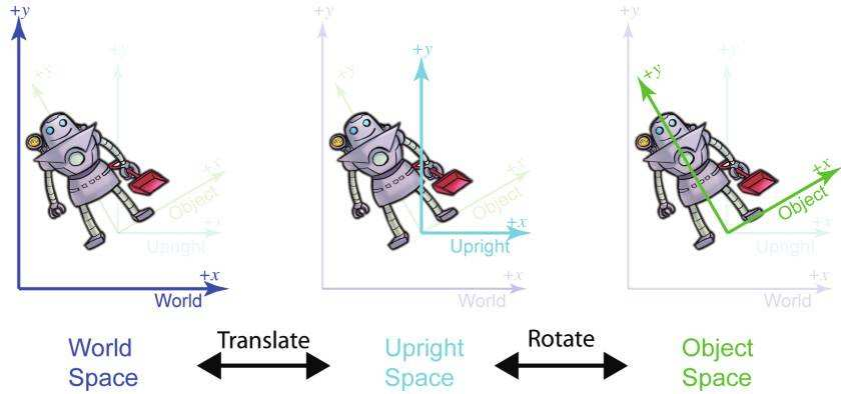

本篇博客是笔者结合《UnityShader入门精要》和《3D数学基础——图形和游戏开发》两本书对Shader所需要的数学知识的整理。

在《3D数学基础——图形和游戏开发》第三章中，作者介绍了坐标空间的知识，
第三章中有三个很有意思的知识点：直立空间、变换坐标空间的两种视角：绝对视角和局部视角、从矢量的角度进行坐标变换

书中对世界空间的描述笔者在此有必要提及：The **world coordinate system** is a special coordinate system that establishes the "global" reference frame for all other coordinate system to be specified. In other words, we can express the position of other coordinate spaces in terms of the world coordinate space, but we cannot express the world coordinate space in terms of any larger, outer coordinate space.

世界坐标空间是我们关心的“最大”空间，因此，我们可以认为使用世界坐标空间表示的物体位置就是绝对位置。

书中提供了一个有趣的视角来描述各个坐标系，那就是把坐标系也当作被放入世界空间中的一个物体，这帮助笔者更好地理解了各个坐标系的转换过程。笔者会在**变换坐标空间的两种视角：绝对视角和局部视角**部分进行阐述。

# 变换坐标空间的两种视角：绝对视角和局部视角

直立空间是本书引入的一个坐标空间，我们先来看一下没有直立空间时一个物体的坐标从对象空间转换到世界空间的过程

我们想象一下将一个坐标系模样的物体放在这个物体的中心点位置，我们要做的，就是把这个坐标系物体从物体的中心点位置移动到世界空间的中心点位置(坐标系的坐标轴和原点都与放在世界空间中心位置的坐标系物体的坐标轴和原点完全重合)。

首先，我们需要把这个坐标系物体平移到世界空间的坐标系物体原点的位置，然后围绕世界空间坐标系物体的原点进行旋转就可以了。在这种视角下观察，仿佛是坐标系自己在移动，而物体是没有移动的，也就是说我们的视角是锁定在物体上的，这种视角也被称为绝对视角。

另一种视角：坐标系不动，物体在动，这种视角下我们是锁定在坐标系上的。想象一下，最一开始的时候，世界坐标系的这个物体的中心位置（也就是对象空间坐标系的位置是重合的），然后神奇的来的，我们假设物体现在所在的位置就是世界的中心，而且现在对象空间的坐标系就和世界坐标系完全重合，我们现在要做的是——通过移动整个世界，让整个世界的原点移动到这个位置，我们假设世界的原点不在他该在的地方。在这种视角下，我们要先平移再旋转。

# 直立空间(Upright Space)

在从对象空间变换到世界空间或者从世界空间变换到对象空间的过程中

# 从矢量的角度进行坐标变换

从一个点的角度看，就是从一种坐标系的对该点的表示转换到另一个坐标系中对该点的表示，

如果已知一个坐标系A的基矢量在另外一个坐标系B中的基矢量的表示，那么知坐标系B中的点的表示，可以
同样的前提，如果已知坐标系A中的点的表示，同样可以用这一组基矢量的对应关系转换成坐标系B中的点的表示

