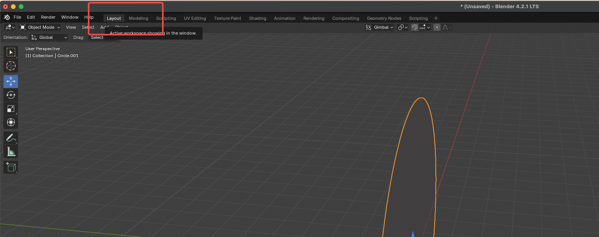

# Blender中常用的快捷键

`Shift + A` 在场景中快速添加一些组件
`Shift + Z` 切换Viewport类型 比如是线框、着色等
`鼠标右键` 取消之前触发的命令
`G` 移动选中的物体

# 在Blender中制作一个圆形的实心平面

Shift + A 创建一个Circle的Mesh,这是发现即便是在着色视口下,Circle仍然只有一个线框,这是因为这些顶点没有构成一个三角形,需要设置这个Circle的填充属性

另外这个模型是创建在XY平面上的,而在Bubble游戏中,该模型是要被放在XZ平面上的,现在Modeling视口下将圆绕X轴旋转90度,然后再导出,注意不能在Layout视口下旋转,旋转出来的模型不会在XZ平面上的,Modeling是调整模型的顶点位置, 
注意需要在Blender中将模型x旋转轴设置为90,在Unity中倒入进来的x转轴才是0,需要搞清楚原因

