# 写在最前面

今天是2023年3月31号，时间过的好快，感觉在公司的每一天都很充实，能够学到很多新的东西，本来开Bubble开发日志这个博客系列的初衷是想记录每一周都实现了哪些需求，但是几周过去发现我要做的需求都十分地零碎，一篇博客要是都记录这些零碎的点了那就很难成体系，而每一个零碎的点又不足以单独为它开博客记录，所以这个系列其实出生即死亡了，但是今天我决定重启这个系列了喔！我决定在这个系列中记录我对于Bubble模块实现的理解，比如今天我要记录的就是：以独角兽活动为例，如何打开一个Page？这是设计架构层面的东西，所以也是比较通用而且含金量比较高喔，那就直接跳到[开始](#1)的地方吧！

# 背景

今天是2023年3月9号，我入职的第五天，经过了四天的测试熟悉项目，宇哥终于带我开始接手项目开发了！！！

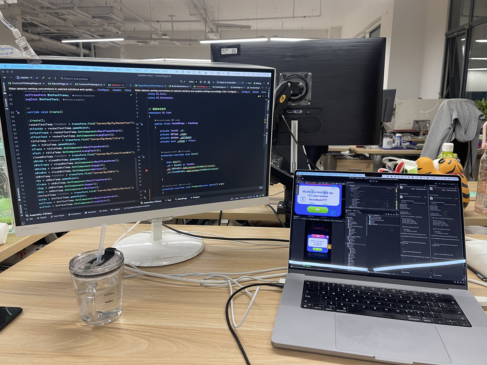

自己动手写了第一个可以运行的弹窗逻辑，下面记录一下整个流程

# 点击按钮出发弹窗的开发记录

先实现一个最简单的逻辑：点击一个按钮，弹出一个弹窗，弹窗上有一个关闭按钮和一个OK按钮，两个按钮的功能都是关闭当前弹窗。


首先先创建一个弹窗UI的Prefab，Prefab的结构是有讲究的：

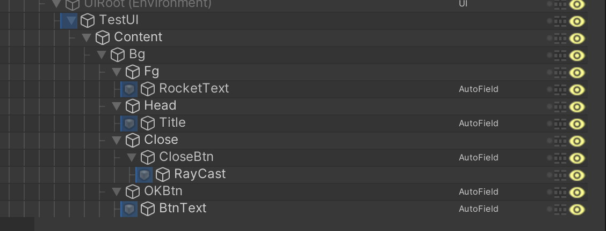

这里记录一个问题，图片拉伸的九宫格如何设置？

# <span id = "1">以独角兽活动为例——细说如何打开一个Page</span>

在Bubble这样一个，窗口非常非常多的项目中，想要打开一个窗口还是非常麻烦的，因为这不只是独角兽这一个活动的窗口这么简单，我们更要考虑的是如何合理地去管理这一类窗口。所以在代码中就会有各种的继承、委托、事件.....那么这一次我就以独角兽活动为例看一看，我们是如何打开一个Page的。

第一步，我们要先确定有哪些脚本参与了打开Page的过程，下面放出的代码都不全，我们只关注如何打开一个Page的代码。

在Bubble项目中，有很多的UI，为了便于管理我们创建了一个`UIManager`来统一管理我们的UI：

```C#
public class UIManager : AbstratcUIManager{
  public static UIManager Instance{ get; private set;}
}
```

因为我们的项目和公司其他项目是用的同一套底层架构，所以我们在UIManager的底层还会在封装一层`AbstractUIManager`:

```C#
public abstract class AbstractUIManager : MonoBehaviour{
	public bool OpenPage(UIType uiType, params object[] args){
		return OpenPage(uiType, UIPolicy.Default, args);
	}
	
	public bool OpenPage(UIType uiType, UIPolicy policy, params object[] args)
  {
      if (!_infos.TryGetValue((int) uiType, out var info))
      {
          D.Error("[UIManager] Info is null");
          return false;
      }

      if (policy == UIPolicy.None)
      {
          D.Error($"[UIManager] UI policy is none, {uiType.ToString()}");
          return false;
      }

      var page = GetPage(info, false);
      if (page.IsOpening && policy != UIPolicy.Queue)
      {
          D.Error($"[UIManager] Page is opening, {uiType.ToString()}");
          return false;
      }

      if (policy == UIPolicy.Default)
      {
          AddPageInOrder(info.Layer, page);
          page.OnOpen(args);
          return true;
      }

      if (policy == UIPolicy.Queue)
      {
          _pageQueues.Enqueue(page);
          _infoQueues.Enqueue(info);
          _pageArgs.Enqueue(args);
          TryOpenQueueNode();
      }

      return true;
  }
}

```

在我们的Bubble中，所有的Page都继承自`BasePage`：

```C#
public abstract class BasePage : MonoBehaviour{
  public void OnOpen(params object[] args){
    IsOpening = true;
    try{
      Prepare(args);
      Show(IsShowAnim);
      AddEvent();
    }
  }
  
  protected virtual void Prepare(params object[] args){
    IsShowAnim = true;
    Popup = Popup.Up;
    Disappear = PopupType.up;
  }
}
```

找到`GameLevelPage`这个脚本中的`OnUnicornBtnClicked`方法，我们先不管这个方法中各种判断UnicornRace是否开启的判断条件，只看打开Page的入口，也就是我打断点的这几个地方：

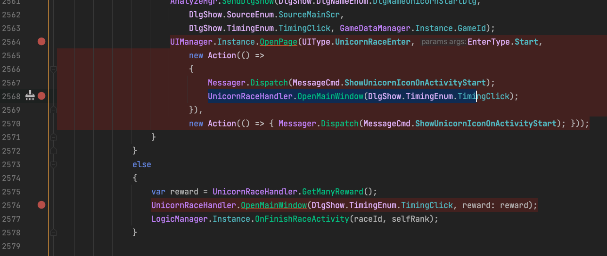

这段代码中有一个`OpenMainWindow`方法，还有一个`OpenPage`的方法，`OpenMainWindow`打开的是Unicorn的主界面，在`OpenMainWindow`方法里面调用了`OpenPage`，而直接调用的`OpenPage`打开的是Unicorn的Start弹窗。

触发了`OpenMainWindow`之后，调用`OpenPage`方法打开`UnicornRaceMain`：

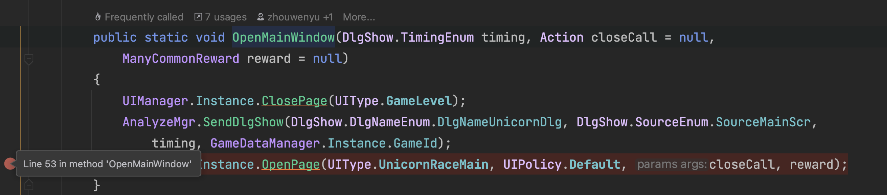

查看OpenPage方法的实现，可以看到代码跳到了`AbstractUIManager`中`OpenPage`中去了

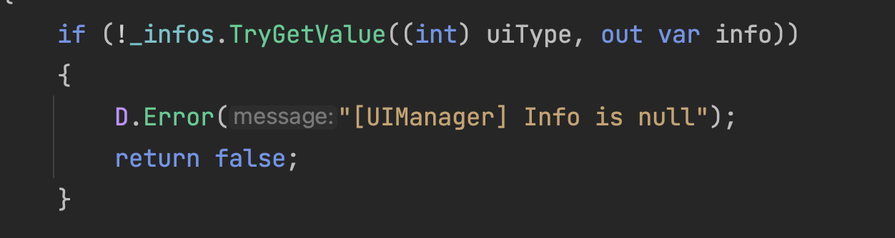

上面这一行代码很重要，`_infos`参数是一个字典，`TryGetValue`方法会根据传入的`uiType`（Key值），将对应的`Value`给到`info`变量传出来，

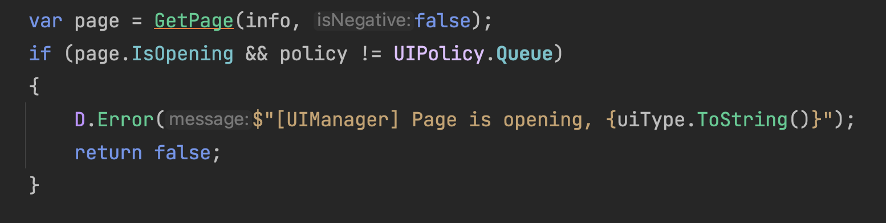

我们来看一下`info`参数中都包含有哪些数据

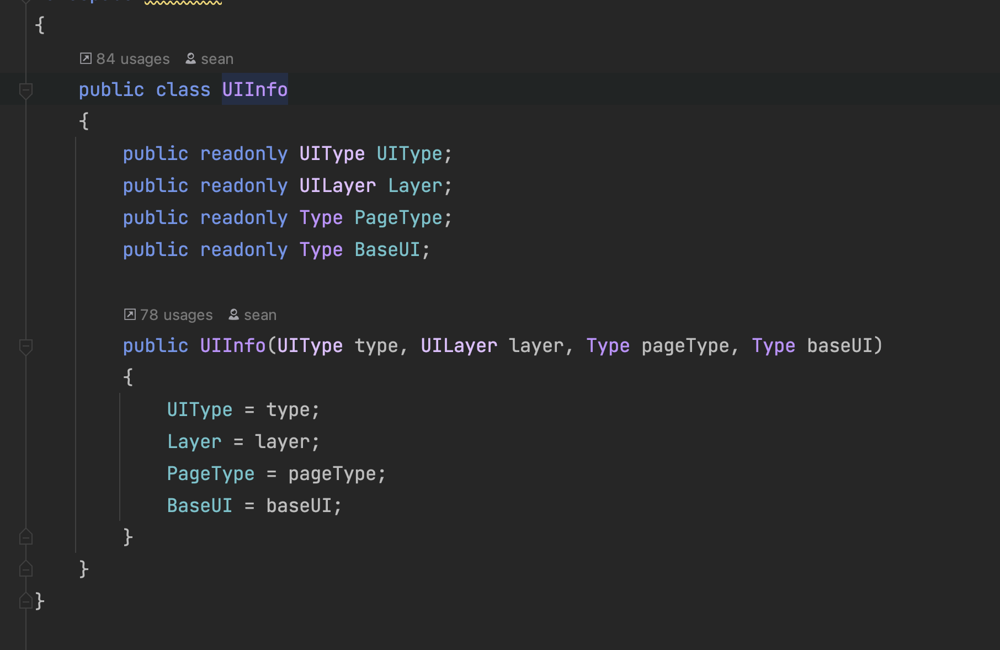

再来看看GetPage方法的具体实现：

```C#
 protected BasePage GetPage(UIInfo info, bool isNegative)
        {
            if (_pages.TryGetValue((int) info.UIType, out var page))
            {
                return page;
            }

            if (isNegative)
            {
                D.Warn($"[UIManager] Page not created, {info.UIType.ToString()}");
                return null;
            }

            if (!_uiLayers.TryGetValue((int) info.Layer, out var parent))
            {
                AddLayer(info.Layer);
                parent = _uiLayers[(int) info.Layer];
            }

            var assetPath = GetAssetPath(info.BaseUI.Name);
            var go = Load<GameObject>(assetPath, parent);
#if UNITY_EDITOR
            go.name = info.UIType + "UI";
#endif
            if (!UIDefine.Settings.IsStaticMode)
            {
                var ui = go.AddComponent(info.BaseUI) as BaseUI;
                ui.Create();
            }

            page = go.AddComponent(info.PageType) as BasePage;
            page.OnCreate(this, info.UIType);
            _pages.Add((int) info.UIType, page);
            _pageList.Add(page);
            return page;
        }
```

GetPage的实现原理就是通过我们传入的`info`参数中的`UIType`，将它作为Key值，找到字典中存储的对应的Value，这个字典的Value的类型是BasePage类型的。（PS：这种数据类型的转换好奇妙  ` page = go.AddComponent(info.PageType) as BasePage;`，通过as转，会不会造成数据丢失？可以调研一下）

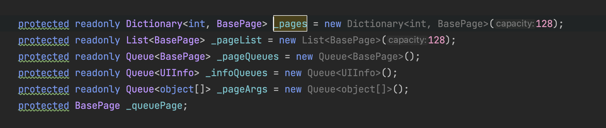

紧接着将`info`变量传入`GetPage`方法中，我们就得到了是page的身份，因为我们这里是子类调用了父类的方法，如果想在父类中获取到调用父类方法的子类身份的话，我们必须要告诉父类我们的身份，那么`info`参数就是我们子类的一个身份标识，帮助父类辨识。

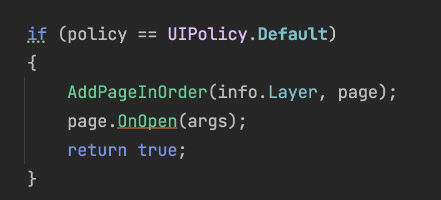

下面我们要执行`page.OnOpen`了，注意这里面有参数`args`。这个参数是在调用`OpenPage`的时候就传进来了

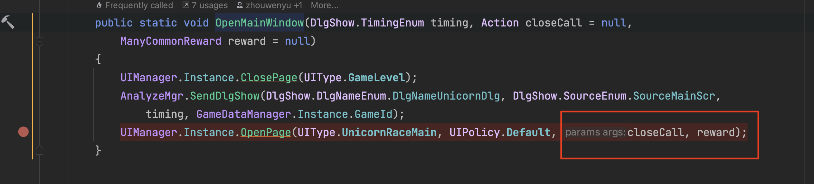

查看OnOpen的实现，我们又跳转到了`BasePage`中，在这里我们捋一下，我们执行`page.OnOpen`是在`AbstractUIManager`中执行的，我们在`AbstractUIManager`中获得了`Unicorn`的身份，现在我们由`AbstractUIManager`跳到了`BasePage`中，而`page`变量是在` page = go.AddComponent(info.PageType) as BasePage;`时被赋值，我现在还不太清楚as的用法，但是page的类型确实是`UnicornRaceMain`了，所以再调用OnOpen的时候就能够向OnOpen表明自己的身份，也就可以调用到OnOpen中UnicornRace的Prepare和AddEvent了。

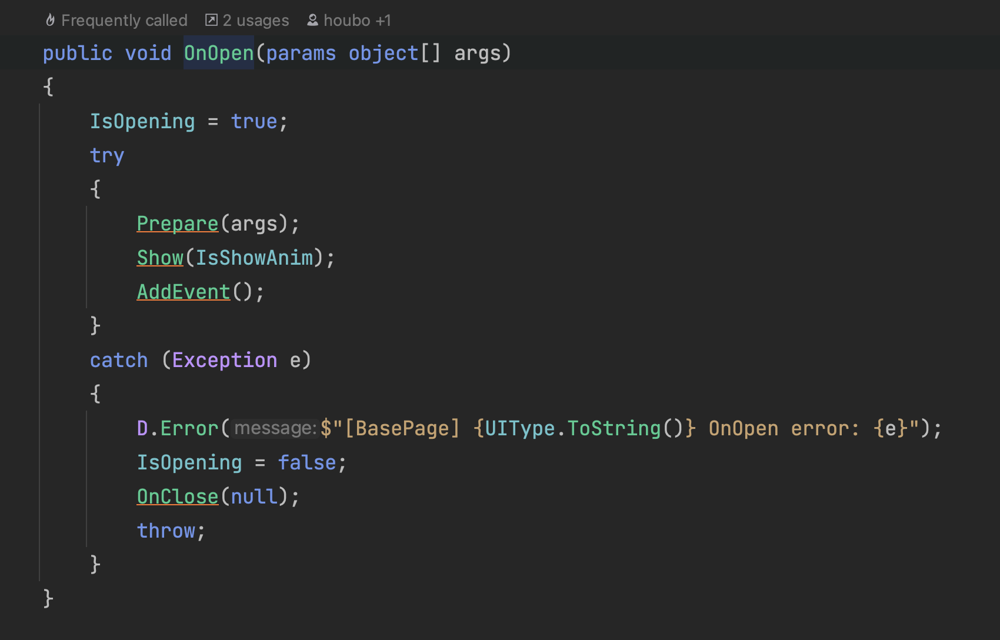

上面我把整个过程陈述了一边，但感觉还是很乱，所以我尝试一下画了一下流程图，个人感觉还是比较清晰的：

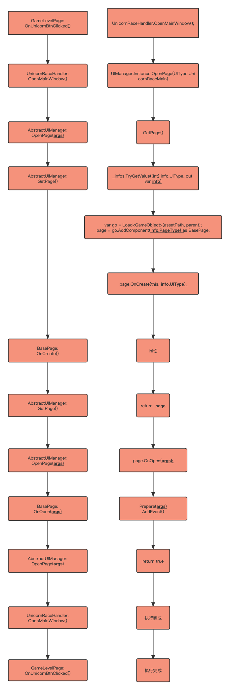

搞清楚一个Page如何被打开，一是需要搞清楚整个流程，二是要搞清楚整个过程中有哪些重要的数据参与，整个过程中重要的数据有：`UIType.UnicornRaceMain`

然后在下面这个环节，根据传入的uiType找到对应的`info`：

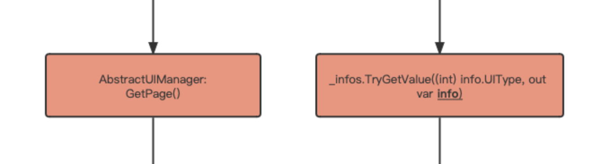

_infos是一个字典，它的数据来自哪里？在哪里被初始化的？

答：在`UIManager`的`LoadInfo`中使用`AddInfo`方法进行赋值。

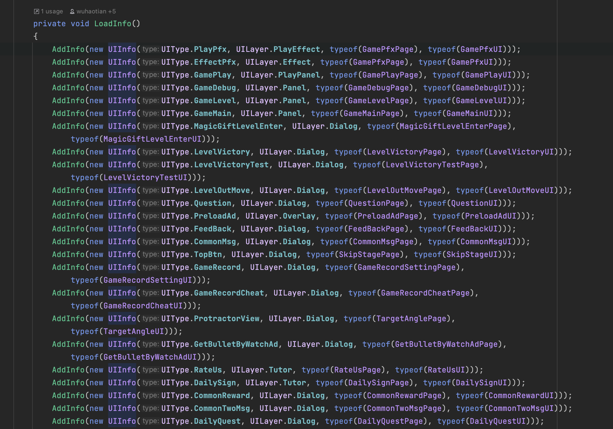

找到对应的info后，我们就确定了我们page的身份，就可以调用对应的初始化的方法。

除此之外还有一个args参数，它从OpenPage方法一开始调用的时候就被传入了，一直到对应Page的Prepare方法才被使用，这个参数是一个可变长的数组，数组的长度依每一个Page的特定需求而定，有`params`关键字，需要先调研一下而且并不是打开Page从流程上来看的关键，所以先放一放。

# 子类父类中的重写和virtual之间的联系

在刚才的梳理过程中，我们遇到了好多子类父类，比如BasePage和GamePage，而且里面有这样一个实现：

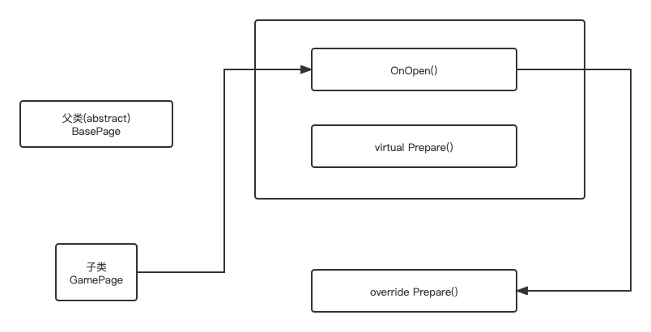

BasePage中的OnOpen方法调用了Prepare方法：

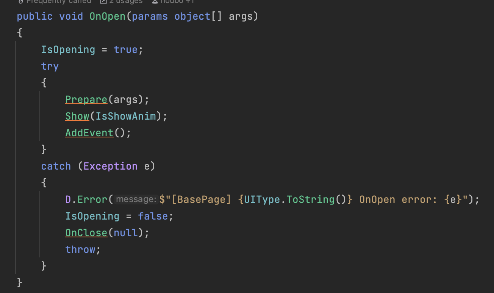

现在的场景是：子类(GamePage)的实例调用了父类的OnOpen方法，在执行Prepare的时候，它能够自动去执行子类实例中的Prepare的方法，这是为什么？

## 关于重写(override)的再次理解 

在[之前的博客](http://soincredible777.com.cn/posts/cd96d12/)中有过一次对重写的介绍，不过当时的理解不深，这里再次进行探讨。

本次探讨的点主要在于关键字`virtual`在整个重写过程中的作用，或者说我们想要重写一个方法，需要父类中的基方法具有什么特点？

直接给答案：重写的基方法必须是virtual、abstract或者override的。override之所以能重写，是因为基类中的override肯定也是对基类的基类进行的重写，由于继承可传递，所以也可以对基类中的override方法进行重写。

ok，那现在我们明确了，我们想要重写父类的方法，不一定非要`virtual`关键字的参与，还可以使用`override`。那么具体使用哪个可以看我们的实际的业务需求。

那么为什么，我们调用父类的Prepare，它能够自动地去调用子类的Prepare方法？

看了一下网上的回答：设计模式中通用的场景，将子类实例作为父类实例使用的时候就有区分了。这是一个多态问题。

来看一个例子，看代码：

```C#
using System;

class Base
{
    public void Print()
    {
        Console.WriteLine("Base");
    }
}

class AAA : Base
{
    public void Print()
    {
        Console.WriteLine("AAA");
    }
}

class Program
{
    static void Main(string[] args)
    {
        Base b = new Base();
        b.Print();
        AAA a = new AAA();
        a.Print();
    }
}
```

运行一下，似乎没有任何问题，别急，继续看，现在我改了，我让变量b指向子类AAA的实例a，再打印一下：

```C#
AAA a = new AAA();
b = a;
b.Print();
a.Print();
```

出错了！`b.print()`打印的竟然还是基类的方法，现在就出现矛盾了，那我们要解决这个矛盾，就必须引入“多态”的概念，即`virtual`和`override`的语法。

多态可以保证：一个对象实际是什么，就调用实际应有的方法，而不会因为变量是基类而调到基类去。

所以virtual和abstract还是有区别的，abstract是没有多态的概念的，因为抽象方法没有实现，是不能够被调用的。

这部分可以结合[这篇博客](http://soincredible777.com.cn/posts/133a9667/)中Father类和Child类的部分来看。

**里氏转换：**

- 子类可以赋值给父类
- 如果父类中装的是子类对象，那么可以将这个父类强转为子对象
- 子类对象可以调用父类中的成员，但是父类对象永远只能调用自己的成员

# C#中as的用法

在上述过程中，我们遇到了一行代码：

```C#
page = go.AddComponent(info.PageType) as BasePage; 
```

这行代码有两个知识点：`as`和`AddComponnet`，先说as：它与强制类型转换是一样的，但是永远不会抛出异常，即如果转换不成功，会返回null。

我们看一下AddComponent的源码：

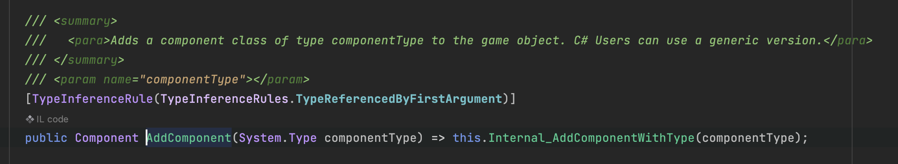

首先我们得搞明白，为什么这行代码要这么写：

为什么后面要加`as BasePage`，AddComponent方法最后的返回类型是根据括号中传入的参数来定的，我们编写代码的时候显然还不能确定传入的参数是什么，但是我们可以确定这是一个Page类型的参数，而且这些Page共有的基类就是BasePage。

也就是说：即使我们不写BasePage，代码在逻辑上是能跑通的，只是我们编译器现在不能确定Add Component方法的返回类型，报错了，那么AddComponent方法是会返回对应的Page类型，在这个例子中就是UnicornRaceMain这个Page类型。

然后我的下一个疑问是，我在这里使用as将所有的数据类型都转成了BasePage，为什么它在运行起来后还是能找到对应的Page呢，我们上面又温习了一遍多态，其实就有答案了，首先我们已经拿到了Page正确的类型了，但是我们是用一个父类的变量(BasePage)指向或者说存储了这个Page，因为有多态的存在，我们在调用含有virtual关键字的方法时就会自然而然地去调用Page真正的方法，而不会调用到基类的方法中去。

看一下下面的代码：

```C#
using System;

class Base
{
    public virtual void Print()
    {
        Console.WriteLine("Base");
    }

    public void Hellp()
    {
        Console.WriteLine("Hello!");
    }
}

class AAA : Base
{
    public override void Print()
    {
        Console.WriteLine("AAA");
    }
}

class Program
{
    static void Main(string[] args)
    {
        AAA a = new AAA();
        var x = a as Base;
        x.Print();
    }
}
```

运行的结果是x会打印子类的方法。

# 对于Unity中Add Component()方法的理解

其实这一小节没啥好写的，只是在梳理的过程中突然发现，AddComponnet方法就是实例化的过程，我们在Unity中找到UnicornRaceUI这个Prefab，可以看到它上面的组件是没有UnicornRaceMainPage这个脚本的，就是说UnicornRaceMainPage在Unity中表现为一个组件，而添加组件的过程就是将这个脚本实例化的过程；这个过程更加的高级和抽象，但是我从中确实隐约体会到面向对象编程的优势了。

再举一个Unity中的例子，就是button组件，按照委托中的发布者和接受者的身份，代入一下，我们可以将button理解为事件的发布者，而点击button后出发的函数就是接受者，其实这个逻辑是比较简单的，只是触发的时机是鼠标点到了button，就会执行函数，而我们如果用纯代码的手段是很难描述鼠标点到button这个动作的，我想这可能就是游戏引擎的便利，它将一些可视化就是看起来很容易触发的事件都给你封装好了，而你只需要关心事件触发后我们要执行哪些方法就可以了。

# 关于字典的一些问题

我们如果定义一个value类型为BasePage的字典dict，现在我们想要向这个字典中添加BasePage的子类，比如UnicornRaceMainPage，可以么？

答：是可以的，看代码：

```C#
using System;

class Base
{
    public int a;

    public virtual void Print()
    {
        Console.WriteLine("Base");
    }

    public void Hellp()
    {
        Console.WriteLine("Hello!");
    }
}

class AAA : Base
{
    public override void Print()
    {
        Console.WriteLine("AAA");
    }
}


class Program
{
    static void Main(string[] args)
    {
        Dictionary<int, Base> dict = new Dictionary<int, Base>(12);
        Base b = new Base();
        AAA a = new AAA();
        dict.Add(1, a);
        dict.Add(2, b);
        foreach (var x in dict.Keys)
        {
            dict.TryGetValue(x, out var value);
            Console.WriteLine("我是:" + value.GetType().Name);
        }
    }
}
```

在上面的代码中，我们使用GetType方法获得了数据的类型，我们常用的另外一个获取数据类型的方法是`typeof`，它们二者的区别如下：

- GetType()方法继承自object，C#中任何对象都具有GetType()方法
- typeof(x)中的x必须是具体的类名、类型名称，不可以是变量名称；

个人感觉GetType的适用面更广，直接都用`GetType`就完事儿了！

不过，我们使用GetType必须在有**实例**的前提下，才能用，但是typeof的话就不需要了。
