新的一周又开始了喔，上周我们梳理了，在不考虑数据的情况下，打开一个页面的流程，接下来我们继续梳理，一个活动的数据它从哪里来，又到哪里去？在页面打开的过程中它又是如何传递的？

# 还是以独角兽活动为例，从头到尾的活动数据如何创建和被传递

今天好困啊啊，昨天晚上睡不着，爬起来打游戏打到五点多，上午到了公司整个人都是空灵的状态，中午睡了一觉后好多了，下午要继续好好工作好好看代码喔😯

进入正题，我们需要的活动数据都是来自一张张Excel表中，表中有我们活动的编号、活动的开启和结束时间以及活动的轮次等等一些信息，从我们Unity开发的身份出发，我们其实是不关心我要如何取到这些表里的数据，我们更应该关心的是，有一个方法可以让我们很方便地获取到活动的信息，我该怎么去用获取到的数据完成业务功能。

当然这里还是稍微提一下我们获取表中数据的原理：有一个Excel转换工具（用Java写的）将我们的表生成为一个byte二进制文件，在项目中有一个名叫`Config`的脚本，这个脚本里面定义了一个`ConfnormalCDActivity`的类，类里面有一个静态的`Data`字典，我们活动的数据就存放在这个字典中，我们不必关心表里的数据是如何被放到Data字典中去的，我们只要使用这个类中的`Get`方法获取到Data中的数据就可以了。

好！现在我们确认了数据的来源，那我们来看一下活动数据是如何在整个程序中流通的吧！这个过程极其地复杂，不是我一天两天也不是一篇两篇博客就能搞清楚的东西，我现在能做的只能是从上层一点一点往下看底层的实现，看到哪算哪吧。😂

上一篇Bubble开发日志中通过流程图的方式呈现Page打开的过程，我感觉效果很好，所以本篇开发日志中也会使用流程图来梳理整个过程，只不过一开始先要听我磕磕巴巴地口述一遍整个过程。

在整个程序跑起来之前，我们定义的一些static的成员已经被初始化了，在本例中：

一切的起点都是在`Launcher`脚本中的`GameManager.Instance.SetUp()`，进入SetUp()方法，我们要看的代码就是图中我打断点的四行代码：

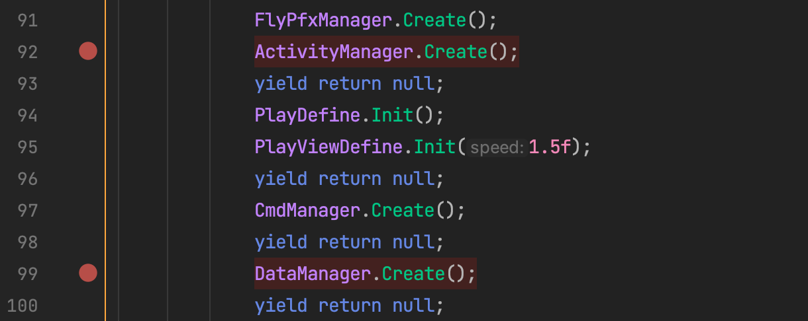

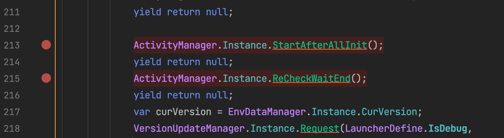

`ActivityManager.Create()`

这是程序一开始的时候创建的众多Manager的其中一个，~~这里并不涉及数据层的东西~~~~，只是将Manager们都实例化。~~

~~戳啦！在这里涉及到初始化的问题，我们点进去看看代码：~~

又戳啦，这里只是注册了一个事件啊，而不是去运行OnUpdate这个方法，所以这一步还是不会涉及到数据的赋值的过程，但是OnUpdate方法里面的代码还是要看的，后面要留意是什么时候会出发这个事件

其中Messager.Add(MessageCmd.OnUpdate,OnUpdate)是在GameManager脚本的Update中触发的事件：每次执行Update的时候就会向事件中心发送OnUpdate的事件然后触发OnUpdate方法，但是Update方法是在SetUp方法执行完成后才会执行的，所以我们关注的这个流程中并不会涉及OnUpdate中的方法，至少目前不会。

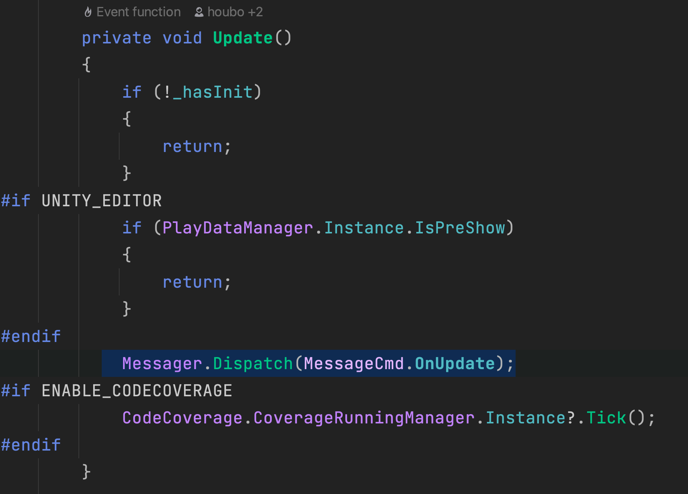

`ActivityManager`

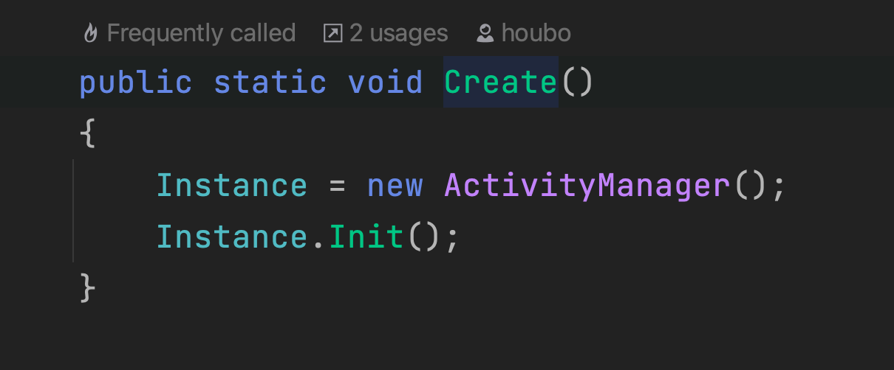

`ActivityManager`脚本看到这就可以了，后面的脚本在一开始并不会执行。

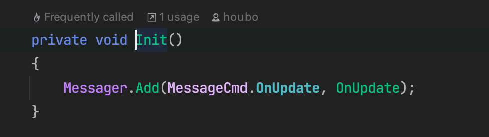

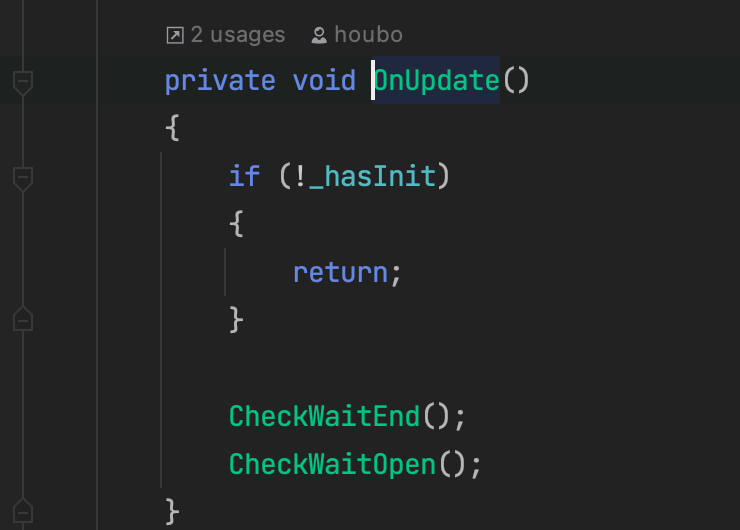

`CheckWaitEnd`

```C#
 private void CheckWaitEnd()
        {
            if (ActivityDataManager.Instance.WaitEnd.Count <= 0)
            {
                return;
            }

            _endTimer -= Time.deltaTime;
            if (_endTimer > 0)
            {
                return;
            }

            var dataMgr = ActivityDataManager.Instance;
            var waitEnd = dataMgr.WaitEnd.Peek();
            if (_tempWaitEnd == null || waitEnd != _tempWaitEnd)
            {
                _tempWaitEnd = waitEnd;
                if (_tempWaitEnd.State == ActivityState.End)
                {
                    dataMgr.DequeueWaitEnd();
                    return;
                }
            }

            var mode = ActivityDefine.GetActivityMode(_tempWaitEnd.Type);
            var endTime = _tempWaitEnd.EndTime;
            if (endTime < DateTime.Now.TotalOfSeconds())
            {
                NextState(_tempWaitEnd);
                _tempWaitEnd = null;
            }
            else
            {
                var sec = endTime - DateTime.Now.TotalOfSeconds();
                if (sec > 3600f && _endTimerLevel < 5)
                {
                    _endTimer = 3600f;
                    _endTimerLevel = 5;
                }
                else if (sec > 1800f && _endTimerLevel < 4)
                {
                    _endTimer = 1800f;
                    _endTimerLevel = 4;
                }
                else if (sec > 600f && _endTimerLevel < 3)
                {
                    _endTimer = 600f;
                    _endTimerLevel = 3;
                }
                else if (sec > 60f && _endTimerLevel < 2)
                {
                    _endTimer = 60f;
                    _endTimerLevel = 2;
                }
                else if (sec > 10f && _endTimerLevel < 1)
                {
                    _endTimer = 10f;
                    _endTimerLevel = 1;
                }
                else
                {
                    _endTimer = 1f;
                    _endTimerLevel = 0;
                }
            }
        }
```

`NextState`

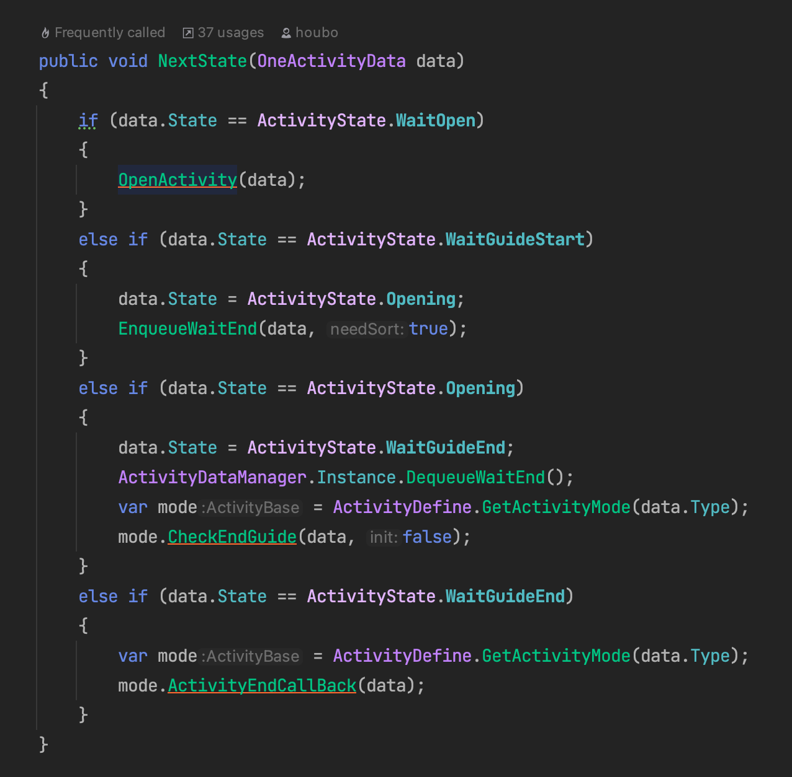

`CheckWaitOpen`

```C#
  private void CheckWaitOpen()
        {
            if (ActivityDataManager.Instance.WaitOpen.Count <= 0)
            {
                return;
            }

            _startTimer -= Time.deltaTime;
            if (_startTimer > 0)
            {
                return;
            }

            var dataMgr = ActivityDataManager.Instance;
            var open = dataMgr.WaitOpen.Peek();
            if (_tempWaitOpen == null || open != _tempWaitOpen)
            {
                _tempWaitOpen = open;
                if (_tempWaitOpen.State == ActivityState.End)
                {
                    dataMgr.DequeueWaitOpen();
                    return;
                }
            }

            var mode = ActivityDefine.GetActivityMode(_tempWaitOpen.Type);
            var startTime = _tempWaitOpen.StartTime;
            if (startTime < DateTime.Now.TotalOfSeconds())
            {
                OpenActivity(_tempWaitOpen);
                _tempWaitOpen = null;
            }
            else
            {
                var sec = startTime - DateTime.Now.TotalOfSeconds();
                if (sec > 3600f && _startTimerLevel < 5)
                {
                    _startTimer = 3600f;
                    _startTimerLevel = 5;
                }
                else if (sec > 1800f && _startTimerLevel < 4)
                {
                    _startTimer = 1800f;
                    _startTimerLevel = 4;
                }
                else if (sec > 600f && _startTimerLevel < 3)
                {
                    _startTimer = 600f;
                    _startTimerLevel = 3;
                }
                else if (sec > 60f && _startTimerLevel < 2)
                {
                    _startTimer = 60f;
                    _startTimerLevel = 2;
                }
                else if (sec > 10f && _startTimerLevel < 1)
                {
                    _startTimer = 10f;
                    _startTimerLevel = 1;
                }
                else
                {
                    _startTimer = 1f;
                    _startTimerLevel = 0;
                }
            }
        }
```

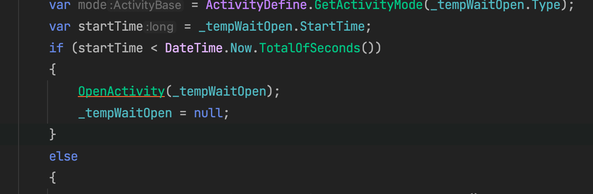

`OpenActivity()`

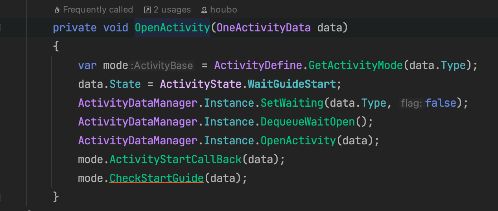

目前暂不是很清楚上面这个方法是干什么的，但是在它们的方法中都调用了`OpenActivity`的方法，这个方法中又用到了我们熟悉的多态，`mode`变量是一个Base类型的，但是根据`GetActivityMode`返回的类型不同，实现不同的多态，然后是`mode.ActivityStartCallBack`方法：

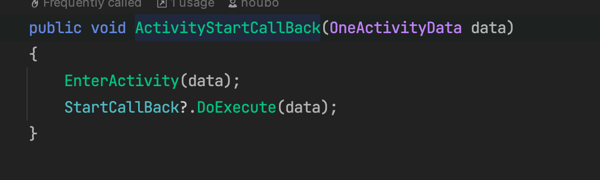

这个方法会根据`mode`的类型不同执行不同的方法，我们以独角兽为例：

```C#
        public override void EnterActivity(OneActivityData data)
        {
            D.Info($"[RaceActivity]: 竞速活动开启， {data.Id}, {data.TableId}");
            var act = ActivityDataManager.Instance;
            if (act.GetSimpleActivity(data.Type) == null)
            {
                var skin = 0;
                foreach (var pair in ConfRaceSkin.Data.Values)
                {
                    var startTime = DateTime.Parse(pair.StartTime).TotalOfSeconds();
                    var endTime = DateTime.Parse(pair.EndTime).TotalOfSeconds();
                    if (data.StartTime >= startTime && data.StartTime <= endTime)
                    {
                        skin = pair.Skin;
                        break;
                    }
                }

                act.SetSimpleActivity(data.Type, data);
                var total = AnalyzeDataManager.Instance.TotalCount - AnalyzeDataManager.Instance.PlayCountDay;
                UnicornRaceDataManager.Instance.ResetOnStart(total,
                    StoreRoot.Inst.Common.LiveDays - 1);
                UnicornRaceDataManager.Instance.SetRaceSkin(skin);
                UnicornRaceDataManager.Instance.OpenActivity();
                UnicornRaceDataManager.Instance.SetState(RaceState.WaitOpen);
            }
            else
            {
                UnicornRaceDataManager.Instance.OpenActivity();
                if (UnicornRaceDataManager.Instance.State == RaceState.End)
                {
                    var total = AnalyzeDataManager.Instance.TotalCount - AnalyzeDataManager.Instance.PlayCountDay;
                    UnicornRaceDataManager.Instance.TurnOpen(total,
                        StoreRoot.Inst.Common.LiveDays - 1);
                }
            }

            if (data.State == ActivityState.Opening && !UnicornRaceDataManager.Instance.HasOperateRaceEnterDlg)
            {
                GuideManager.Instance.CheckRaceActivity(data);
            }

            Messager.Dispatch(MessageCmd.ActivityStart, data.Type);
        }
```


到这，

`DataManager.Create()`

各种的数据管理器都会在这里创建，包括我们的ActivityDataManager：

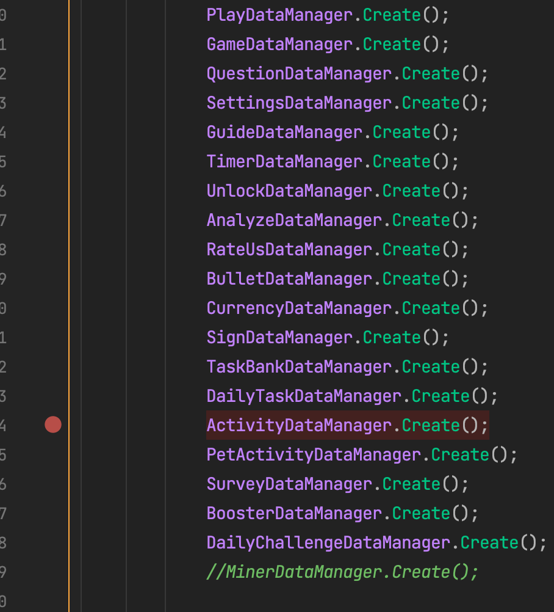

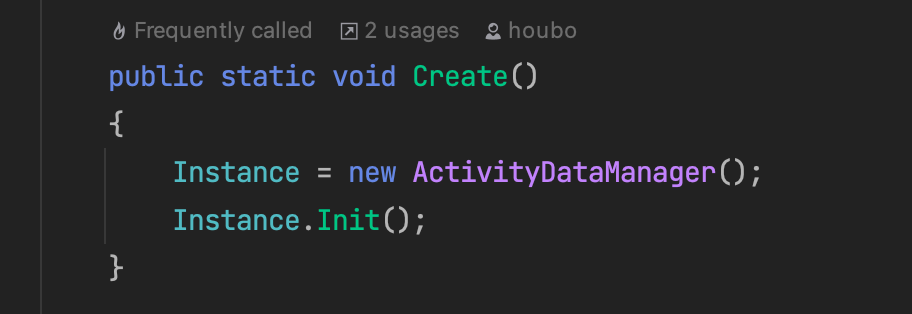

这里我们实例化了ActivityDataManager，一个实例ActivityDataManager中含有的成员如下：

然后我们接着看一下`Init`方法：

```C#
var temp = new Dictionary<int, List<TempActivityData>>(8);
foreach (var pair in ConfNormalCDActivity.Data)
{
    if (!temp.ContainsKey(pair.Value.Type))
    {
        temp.Add(pair.Value.Type, new List<TempActivityData>(32));
    }

    if (!DateTime.TryParse(pair.Value.StartTime, out var time))
    {
        continue;
    }

    temp[pair.Value.Type].Add(new TempActivityData()
    {
        Id = pair.Value.ID,
        startTime = time.TotalOfSeconds(),
    });
}

ActivityCheck = new Dictionary<int, List<int>>(temp.Count);
foreach (var pair in temp)
{
    pair.Value.Sort((x, y) => x.startTime.CompareTo(y.startTime));
    ActivityCheck.Add(pair.Key, new List<int>(pair.Value.Count));
    foreach (var data in pair.Value)
    {
        ActivityCheck[pair.Key].Add(data.Id);
    }
}

WaitOpen = new Queue<OneActivityData>(2);
WaitEnd = new Queue<OneActivityData>(1);
Waiting = new List<bool>((int) ActivityType.Length);
for (var i = ActivityType.FeedPet; i < ActivityType.Length; i++)
{
    Waiting.Add(false);
}

AllActivityData = new Dictionary<ActivityType, Dictionary<int, OneActivityData>>(1);

if (SimpleActivityData == null)
{
    SimpleActivityData = new Dictionary<ActivityType, OneActivityData>(2);
}

if (SimpleActivityUnlockState == null)
{
    SimpleActivityUnlockState = new Dictionary<ActivityType, UnlockState>(2);
}

if (ActivityLastDay == null)
{
    ActivityLastDay = new Dictionary<ActivityType, int>(2);
}

foreach (var pair in SimpleActivityData)
{
    AddListener(pair.Value);
}
```

我们已经需要使用`ConfNormalCDActivity.Data`中的数据了，我们先使用一个临时的temp字典来存储一个Key值为int类型，value为TempActivityData类型的字典，Temp Activity是一个结构体，里面包含有`id`和`startTime`两个属性。

我先遍历整个Data，确保将所有活动的Key都添加到这个临时的temp字典中去。那么temp就成为了一个存有活动的type位Key值每一个Key值对应着的是一个type的活动列表，因为活动是周期开启的嘛，所以肯定是一个列表。那么最后整个temp字典的结构就是下面这样：

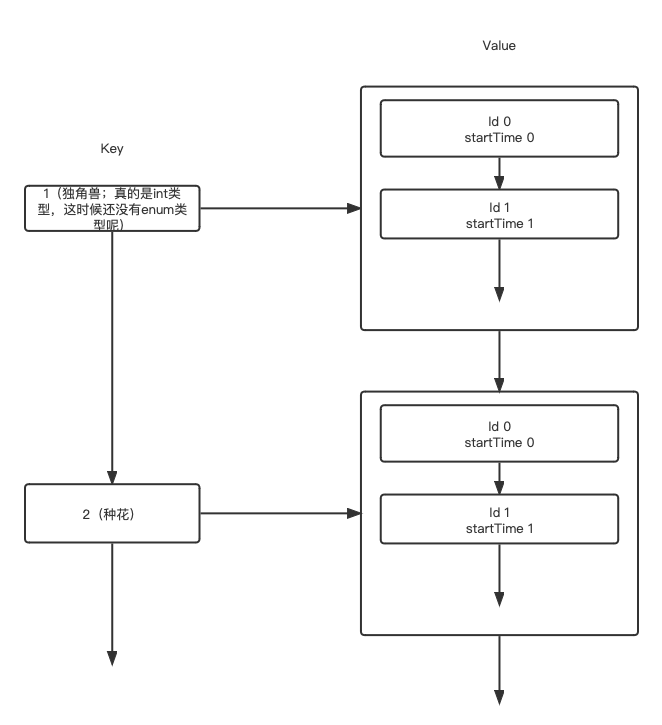

紧接着我们创建了一个`ActivityCheck`的字典，这个字典的Key值是int类型，Value是一个int类型的List；

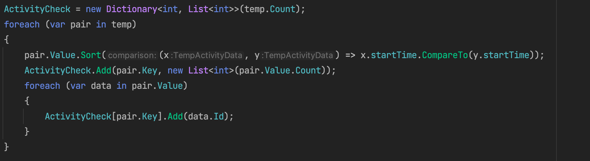

这段代码是为了确保每一个Key值对应的List是按照时间的先后顺序排列的，排好序之后，将List的id加入到`ActivityCheck`字典中，这个字典的作用是为了更方便地获取每一个活动它们的id的list。

下面初始化了三个队列：

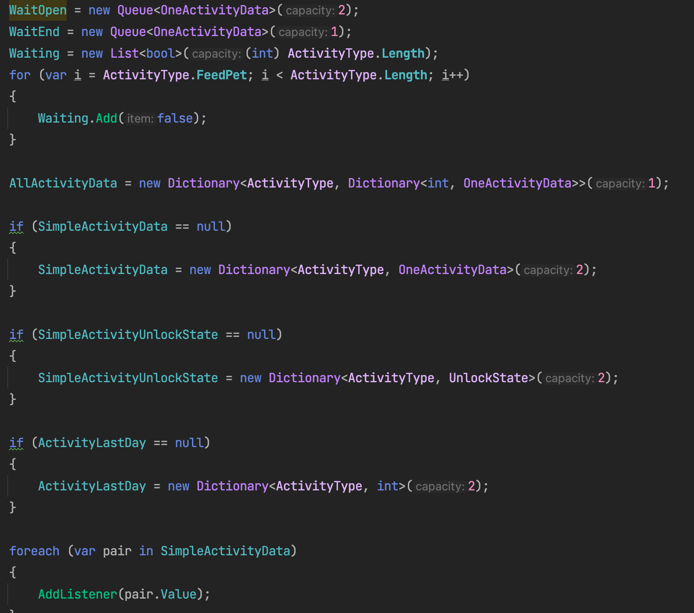

 这三个队列代表了活动的三种状态，这个稍后会提，那么到这`DataManager`的代码也走完了。

`ActivityManager.Instance.StartafterAllInit()`

```C#
public void StartAfterAllInit()
        {
            foreach (var act in ActivityDefine.Activities)
            {
                act.AddListener();
            }

            AfterListener();

            foreach (var data in ActivityDataManager.Instance.WaitEnd)
            {
                ActivityDefine.Activities[(int) data.Type].EnterActivity(data);
            }

            var list = new List<OneActivityData>(2);
            for (int i = 0; i < ActivityDefine.Activities.Count; i++)
            {
                var act = ActivityDefine.Activities[i];
                var data = act.FindWait();
                if (data != null)
                {
                    list.Add(data);
                }
            }

            list.Sort(delegate(OneActivityData data, OneActivityData activityData)
            {
                var start1 = data.StartTime;
                var start2 = activityData.StartTime;
                return start1.CompareTo(start2);
            });

            for (int i = 0; i < list.Count; i++)
            {
                EnqueueWaitOpen(list[i], false);
                ActivityDataManager.Instance.SetWaiting(list[i].Type, true);
            }

            _hasInit = true;
        }

```

这段代码以上来就用到了我们静态生成的Activity列表，然后给每个活动的实例添加上listener，对于独角兽活动来说这一步没有影响，然后是`AfterListener`方法

```C#
   public void AfterListener()
        {
            var list = new List<OneActivityData>(2);
            var listStart = new List<OneActivityData>(1);
            var listEnd = new List<OneActivityData>(1);
            var now = DateTime.Now.TotalOfSeconds();
            foreach (var pair in ActivityDataManager.Instance.AllActivityData)
            {
                foreach (var p in pair.Value)
                {
                    var mode = ActivityDefine.GetActivityMode(p.Value.Type);
                    if (mode != null && !mode.CanOpen())
                    {
                        listEnd.Add(p.Value);
                        continue;
                    }

                    if (p.Value.State == ActivityState.Opening)
                    {
                        list.Add(p.Value);
                    }
                    else if (p.Value.State == ActivityState.WaitGuideStart)
                    {
                        listStart.Add(p.Value);
                    }
                    else if (p.Value.State == ActivityState.WaitGuideEnd)
                    {
                        listEnd.Add(p.Value);
                    }
                }
            }

            list.Sort(delegate(OneActivityData data, OneActivityData activityData)
            {
                var end1 = data.EndTime;
                var end2 = activityData.EndTime;
                return end1.CompareTo(end2);
            });

            for (int i = 0; i < list.Count; i++)
            {
                EnqueueWaitEnd(list[i], false);
            }

            foreach (var data in listStart)
            {
                if (data.EndTime <= now || data.StartTime > now || !IsDataValid(data))
                {
                    ActivityDataManager.Instance.DeleteActivity(data.Type);
                    ActivityDataManager.Instance.RemoveSimpleActivity(data.Type);
                    continue;
                }

                var mode = ActivityDefine.GetActivityMode(data.Type);
                mode.EnterActivity(data);
                mode.CheckStartGuide(data);
            }

            foreach (var data in listEnd)
            {
                var mode = ActivityDefine.GetActivityMode(data.Type);
                if (mode.CanOpen())
                {
                    mode.CheckEndGuide(data, true);
                }
                else
                {
                    data.State = ActivityState.WaitGuideEnd;
                    NextState(data);
                }
            }
        }

```

这段代码的作用就是在添加完Listener之后，

`ActivityManager.Instance.ReCheckWaitEnd()`

# 2023.04.17更新

好久没更新博客了喔，这段时间过分偷懒了，因为这段时间Bubble的数据并不乐观，大家想要通过回退版本的方式寻找原因，所以我没有什么事做，每天在工位上狠狠的摸鱼耍手机，但是这周重新振作起来喔！😯

这段时间一直在梳理独角兽的东西（梳理半月有余了。。。。）一直停滞不前，因为困难重重啊，经常会陷入这行代码为什么这么写？这个函数在哪里调用？等等问题，然后当我搞明白这个问题之后再回过头来梳理独角兽的时候，已经忘记梳理到哪一个环节了😂

所以我们就直接抛弃代码吧！我们现在的身份是一个产品的同学，或者是一个策划的同学，我们现在要设计独角兽这样一个活动，我需要先在逻辑和流程上明确独角兽的过程，然后将流程同步给开发的同学。

看表格：

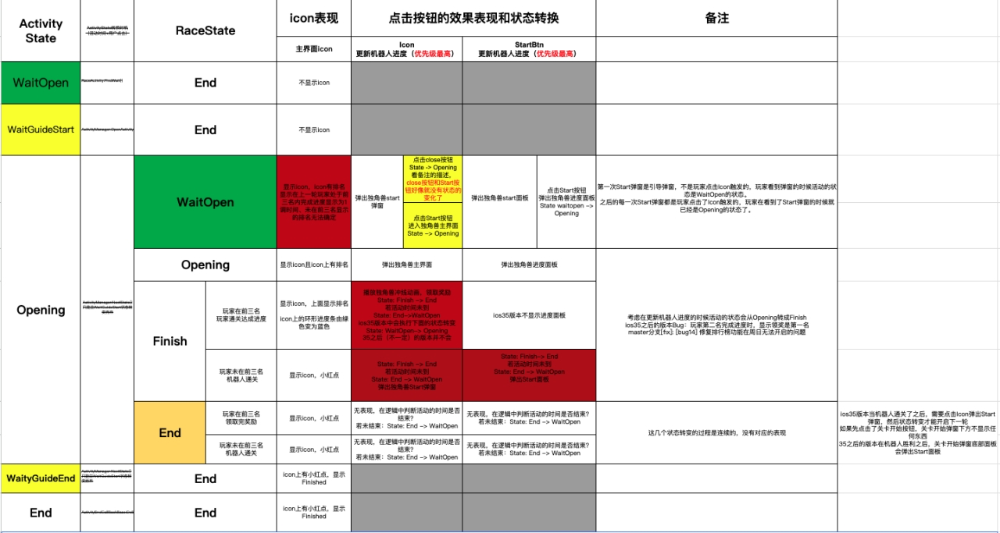

这个表格里面就包括了独角兽活动的所有状态了，以及每种状态如何转变的等等。

在这里放一个Google云盘的[链接](https://docs.google.com/spreadsheets/d/1BFLnkiqFejvttM5vonINf3BgpBuXItb1/edit#gid=2028417854)

下面这个流程图更直观的展示了各种状态之间是如何转变的以及状态转变的触发条件是什么。

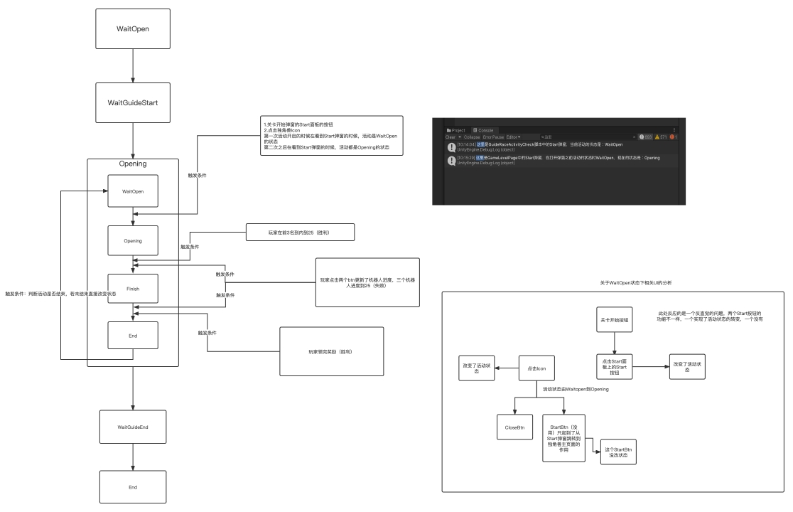

关于独角兽活动的梳理就先告一段落吧🥲补充知识，不断进步

我们项目的Launcher脚本是一切开始的地方，它里面的Start方法的返回类型是IEnumerator类型的，我其实现在是Get不到为什么要这样写，为什么可以这样写的，就先在这里挖一个坑吧。

https://answers.unity.com/questions/754968/can-monobehaviorstart-return-an-ienumerator-hint-y.html


