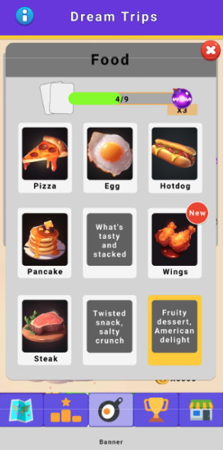

# 概要

- 核心UI组件的理解与使用
- 锚点的理解与使用
- 界面拼接流程完整记录

# 前言

这是我实习以第一次独立负责整个页面的表现部分的开发，整个过程中踩过很多坑，也有很多小设计，是十分值得记录的一次开发日志。

# 拼接一个简单的界面

在开发中经常会有这种情况：程序这边只有一个需求，比如开发一个页面，该需求需要美术的支持，而美术除了要支持程序，还有自己单独的三个需求。如果美术经过评估后认为，支援程序的需求优先级低于美术单独的需求，那么美术将会优先完成自己单独部分的需求，而延后支援程序。如果程序无所作为，只是干等着美术的话，会导致开发效率极其低下，因此，程序具备拼界面的能力，即设计界面的能力是很有必要的。在实际开发中，拼界面的职责分工并不是那么明确，一般美术和程序谁的任务少谁来负责就可以了，因为开发的最终阶段美术和程序会联调开发，所以无论是谁做了拼接界面的前置工作，另一方都能在联调的阶段同步到拼接界面的具体信息，不必担心信息缺失的问题。在整个过程中，程序要与美术及时地沟通，这样一能同步进度，二能避免做不熟练、无用的工作，从专业角度上讲，设计界面本身是美术的专长，如果美术提前完成了任务，他们就能够从程序手中接过设计界面的任务从而让程序专注于开发，同时也避免了程序在设计界面时因不熟练会犯的各种错误。专门的事情交给专门的人来做效率肯定会更高。

那么我已经和美术互相确认了排期，很显然我的工作少一点，所以我将会负责界面的拼接工作。

按照我个人的习惯是喜欢先把界面拼出来再进行代码开发，于是本文将先记录拼界面的过程。

对于一个新人来说，在拼接界面的过程中也可以学到很多UnityUI组件的知识。

## UI组件拆解

在开始真正拆解UI组成之前，我想先介绍一下在Unity中Hierarchy中物体的组织关系的本质，

在设计UI的时候我们经常会用到Panel的概念， 一个UI上面可能会有很多Panel，一个用户体验良好的界面往往都会有标题、显示主题区域、按钮等等部分组成，我们作为UI的设计者为了将这些区域区分开往往就会给每个模块添加一个底板，来凸显模块和模块之间的独立关系。这是很合理的设计，它让我们UI的层级结构更加合理，下面拼接界面的过程我们将会尝试运用Panel的模块概念，将整个界面合理规整拆解。

我们知道，Unity中的Hierarchy窗口中每一个游戏物体都可以被称为节点`node`，我们可以在每个节点上面挂在各种组件。上一段中提到了Panel。我们会将Panel作为每一个模块的根节点，有的Panel需要一个背景板，我们就会在该Panel上添加Image组件来充当整个Panel的背景板。如果不需要背景板那么就不会给这个Panel添加Image组件。



那么下面我们就按照上面的拆解思路，但是要注意，以上的原则只是基本原则，在实际开发中总会有一些需求没有办法完全套用我们既定的准则，因此在开发中一定要懂得灵活多变，结合上方图片分析一下单相册页面中基本的节点构成：

整个页面可以分成三个部分 标题部分、进度条部分和物品展示部分，下面对每个部分进行更详细地拆解：

标题部分：标题的底板、标题文字、关闭按钮

拆分完成后我们就可以在Unity中按照它们的所属关系来进行，界面的拼接了。

由于一些界面的结构具有相似性，我们可以在Unity中参照已有的界面进行拼接，为了方便对照，我们可以创建一个新的场景`StitchUI`，然后将现有的界面的Prefab拖拽到场景中，然后创建创建两个Inspector窗口进行一对一地参照，为了防止在点击的时候Inspector窗口跟着一起变化，我们需要将一个Inspector窗口锁定。

首先是一个根节点，该节点管理整个页面下所有的节点，在该节点上我们需要挂载有以下的组件：Canvas

Canvas是Unity UI系统中的一个核心组件。它是所有UI游戏对象（比如：文本、图像、按钮等）的容器，为UI元素提供呈现和定位支持。在场景中创建UI元素时，会自动将其放置在Canvas下作为子对象。Canvas有以下几种渲染模式：

- Screen Space - Overlay：在屏幕上叠加显示UI，不随相机移动而改变位置。
- Screen Space - Camera： UI依附于相机，场景中的3D物体可能遮挡住UI。
- World Space：将UI放到3D场景中，可以像场景內的物体一样进行旋转、缩放和定位。

在嵌套Canvas的情况下，当一个Prefab中的根节点上含有Canvas组件，并且这个Canvas处于预览模式的是欧，我们会看到Pixel 

CanvasRenderer是Unity中的一个组件，用于渲染UI元素，例如文本、图片和其他由UGUI（Unity Graphic User Interface）系统创建的可视对象。它负责处理Mesh、材质和颜色信息，并将交给GPU进行最终渲染。

每个需要再屏幕上呈现的UI元素上都会有一个Canvas Renderer组件，确保它们在Canvas中正确显示。当一些属性发生变化的时候，比如尺寸、颜色或材质，Canvas Renderer也会更新这些变化以保持UI元素的正确显示。


Graphic Raycaster：

Graphic Raycaster负责处理UI上的射线投射，使Button、Slider等交互控件能够检测用户的点击或触摸时间。当Canvas创建时，Graphic Raycaster组件会默认添加在同一游戏对象上。对于不同类型的Canvas渲染模式，需要注意以下不同点：

- 对于Screen Space渲染模式的Canvas（包括Overlay 和 Camera），使用Graphic Raycaster即可实现UI交互
- 对于World Space渲染模式的Canvas，Graphix Raycaster将与Physics.Raycast或Physics2D.Raycast一起处理射线投射。此时需要确保你的相机有一个正确配置的Physics Raycaster（3D场景）或者Physics 2D Raycaster（2D场景）组件。

Graphic Raycaster在Canvas组件下，它负责处理Canvas内所有UI元素的射线投射事件。射线投射是用于确定玩家在发布输入事件（例如点击、拖动等）时是否与特定UI元素进行交互的一种技术。所以，从Canvas发出的射线投射实际上就是从玩家提供的输入信息（例如点击）产生并针对Canvas内UI元素的一系列检测操作。

与Graphic Raycaster组件紧密相关的是Raycast Target

​	

Canvas Scaler是Unity系统中的一个组件，用于控制和调整Canvas的缩放和适配。它主要用于处理不同屏幕分辨率和设备尺寸时间UI元素布局和显示问题。

Canvas Scaler提供以下三种缩放模式：

1. Constant Pixel Size（恒定像素大小）：无论屏幕分辨率如何变化，UI元素始终保持想通过的像素大小。在不同分辨率和设备上，UI元素可能显示得过大或过小。
2. Scale With Screen Size（跟怒屏幕大小缩放）：随着屏幕分辨率的变化，UI元素按照比例进行缩放。可以设置参考分辨率、匹配模式以及在宽度和高度之间调整权重来优化界面的显示。
3. Constant Physical Size（恒定物理大小）：使UI元素保持固定的物理尺寸，在基于物理尺寸（例如英寸、厘米）的设备上表现一致。需要设备支持实际DPI信息。

Physics.Raycast和Physics2D.Raycast都是Unity中用于检测射线是否与场景中的物体相交的方法。然而，它们分别适用于不同类型的场景和碰撞器：

1. Physics.Raycast：此方法用于3D场景，只与3D碰撞器（例如：BoxCollider、SphereCollider、CapsuleCollider等）进行互动。使用三维向量（Vector3）定义射线的起点及方向，可以检测射线与3D碰撞器之间的碰撞信息。

   ```C#
   using UnityEngine;
   
   public class RaycastExample : MonoBehaviour
   {
       public float raycastDistance = 100f;
   
       void Update()
       {
           RaycastHit hit;
           if (Physics.Raycast(transform.position, transform.forward, out hit, raycastDistance))
           {
               Debug.Log("Hit Object: " + hit.collider.gameObject.name);
           }
       }
   }
   ```

2. Physics.Raycast：针对2D场景和碰撞器设计，这个方法仅与2D碰撞器（如：BoxCollider、CircleCollider2D等）互动。射线的起点和方向由二维向量（Vector2）定义。在此模式下，可以检测到射线与2D碰撞器之间的碰撞信息。

   ```C#
   using UnityEngine;
   
   public class Raycast2DExample : MonoBehaviour
   {
       private Camera mainCamera;
   
       void Start()
       {
           mainCamera = Camera.main;
       }
   
       void Update()
       {
           if (Input.GetMouseButtonDown(0))
           {
               // 将鼠标的屏幕坐标转换为世界坐标
               Vector3 mouseWorldPosition = mainCamera.ScreenToWorldPoint(Input.mousePosition);
   
               // 发射 2D 射线（只考虑 x 和 y 坐标）
               RaycastHit2D hit = Physics2D.Raycast(new Vector2(mouseWorldPosition.x, mouseWorldPosition.y), Vector2.zero);
   
               // 检查是否击中目标
               if (hit.collider != null && hit.collider.CompareTag("MyTarget"))
               {
                   Debug.Log("MyTarget hit!");
               }
           }
       }
   }
   ```

Unity2D项目和3D项目有什么不同？

在创建项目的时候Unity会要求我们选择2D或者3D模版，但是这并不意味着我们要被完全限制在所选模板的类型上。实际上，在一个所谓的2D项目中，我们仍和可以使用3D功能和元素来开发3D游戏。

创建2D项目主要只是设置了一些默认参数和工作环境，使其对2D开发更友好，例如：

- 场景中的相机投影默认为正交（Orthographic）
- 默认导入资源时，纹理类型可能设置为Spirite
- 依赖于2DCollider和Rigidbody2D的物理系统

在创建UI Canvas的时候，Unity会自动创建一个名为Event System的游戏对象。这个对象包含两个核心组件：EventSystem和Standalone Input Module（或者Touch Input Module，取决于输入设备类型）ps： 对于新版本的Unity（2019.1之后），对于触摸屏输入处理已经整合到Standalone Input Module中。因此，在这些Unity版本中，Touch Input module（Deprecated）已经不再需要。


整理完上面这些概念就可以去整理锚点的概念。


标题部分： 

Single AlbumDlgUI

- Content

- 单相册界面Panel：

  - 界面的标题Panel
    - 标题文本


  - 关闭按钮Panel
    - 关闭按钮


  - 顶部进度条部分Panel ： 不需要背景
    - 左侧 照片     ：不要背景
      - 照片                                                                                                                                                                                                                                                                                                                                                                                                                                                                                                                                                                                                                                                                                                                                                              
    - 中间进度条Panel
      - 进度槽
      - 进度条
      - 进度条数字 10/30

    - 右侧奖励 Panel 不需要背景
      - 奖励内容
      - 奖励数量


  - Item展示Panel

    - 单个Item Panel ： 边框 分为普通跟稀有 + button组件
      - ItemName
      - ItemImage
      - RedDot
      - ItemCount
      - LockedCover
      - Riddle

- 放大展示Item Panel ： Image是黑遮罩

  - Item展示Panel中单个Item的复制


踩到的坑：

1. float的用法
2. Unity Engine.Random.range中的数据必须是const的，


## 实际拼接

1. 根节点
   1. 根节点的作用很重要，一方面它需要


# 编写驱动表现的脚本

首先创建脚本，要遵循规范，将相同功能的脚本放在同一个文件夹下，并且要放在同一个namespace下，今天跟浩天学到了一个小TIPS，在Rider中相应的文件夹下创建脚本，Rider会自动给该脚本添加对应的命名空间。

基本方案：

我们会创建一个名为SingleAlbumDlgPage的脚本，它将会和单相册界面这个UI紧密绑定，并且负责处理该界面中的数据驱动表现的部分。

# 编写Debug工具

因为现在我的单相册界面需要依托于相册的主界面存在，而相册主界面还没开始开发，所以目前只能使用Debug工具对单相册界面进行调试。


- 获取新的照片
- 测试获取多个照片时候的效果
- 

