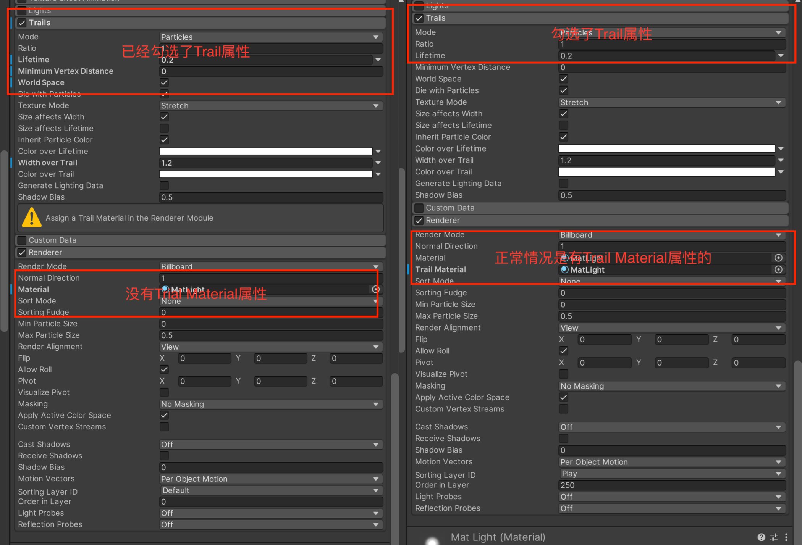
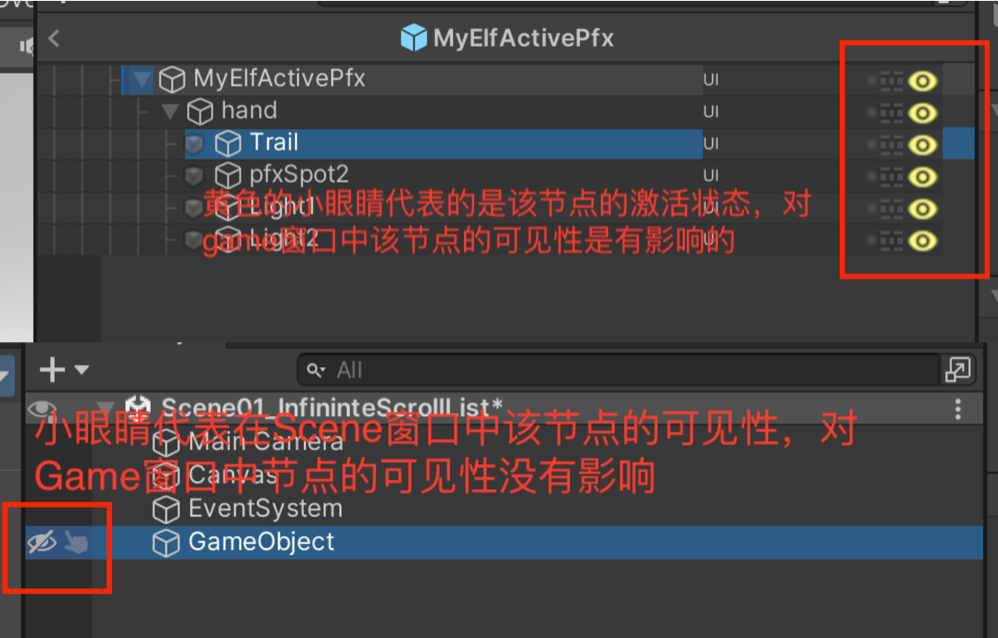

以设计随机精灵为案例，目的有如下几点：

# 熟悉Unity中的UI组件

## CanvasRender

在Unity中对于一个UI组件有canvas render和没有canvas render有什么区别？

# 熟悉Unity中的ParticleSystem

## Bug

描述：Unity的版本是`201.3.14f1`，在Prefab中创建了一个空节点，该节点挂载在了一个具有`Rect Transform`组件的父节点下面，所以自动创建的组件是`Rect Transform`组件，将`RectTransform`组件删除，`RectTransform`会变成`Transform`组件，然后给该节点添加`Particle System`组件，勾选`Trail`属性，`Trail`属性下会提示`Assign a Material in Renderer`，但是在`Renderer`属性中没有`Trail Material`属性。（Bug触发原因已经找到）~~暂不清楚为何会出现这种Bug，个人猜测有可能是在`Prefab`中编辑`Particle System`的属性就会导致该Bug。~~

解决方法：直接删除挂载该`Particle System`组件的节点，重新创建一个空的节点，再次添加`Particle System`组件，勾选`Trail`属性，可以解决问题。

## Bug触发原因

挂载Particle System组件的节点的激活状态`isActive`被设置为了`false`。在节点的激活状态为`false`的状态下对该节点上挂载的`Particle System`组件进行编辑的时候就会出现Bug。`bubble`的Unity项目中使用了一个Hierarchy窗口节点管理与查看的插件（下图），其中黄色的小眼睛代表的是该节点的激活状态，而在不使用该插件的Hierarchy窗口中的白色的小眼睛代表的是节点的可见性。

# 熟悉DOTween插件

# 熟悉PFX系统，了解当运动动画的起始点和重点距离很近的时候，如何处理才能让动画比较好看
