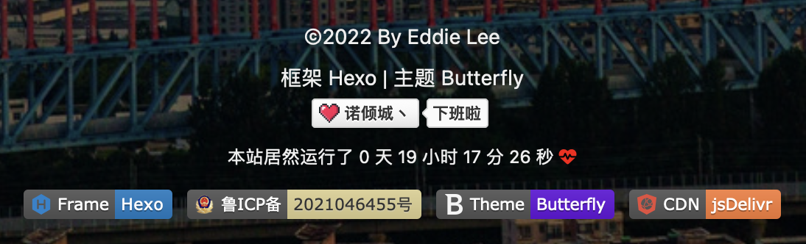
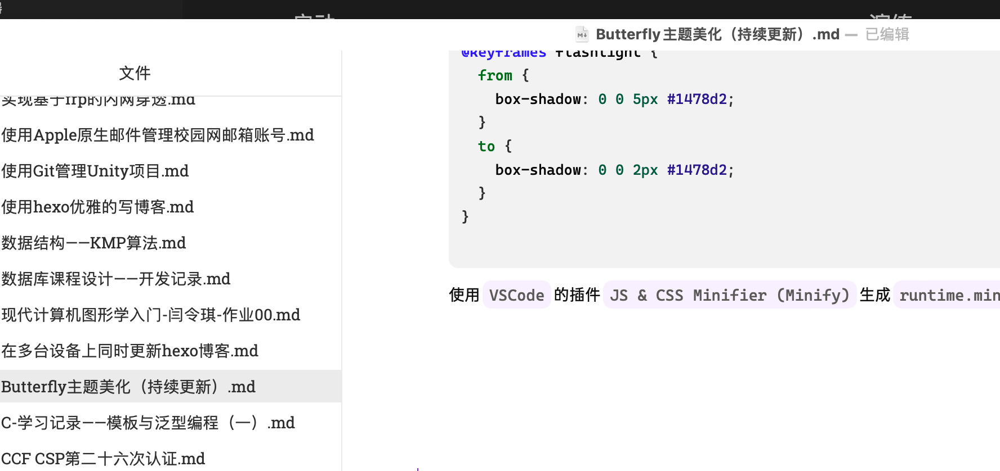

# 写在前面的碎碎念

今天是2022年的10月10号，


# 为什么要换主题

NexT主题有些问题，在Safari中没有办法显示网站的图标，这点我忍了好久，忍无可忍

其次NexT主题还是不够新潮


# 主题美化

1. 给网站页脚添加徽标和计时器

   像这样：

   

   徽标我们在很多GitHub项目的主页中也会看到，比如：

   

   [推荐一个徽标生成网站](https://shields.io/)，但是比较可以的是徽标的label部分底色修改不了。不过我们可以自定义图标，步骤如下：

   1.找到合适的图片，尽量不要太大，背景透明，然后存储png格式。

   2.找个在线转base64图片的网站，推荐[这个在线生成Base64的网站](https://tool.chinaz.com/tools/imgtobase),把制作好的图片转为base64链接。

   3.把base64链接作为logo填进徽标链接，比如这样：

    ```url
   https://img.shields.io/badge/诺倾城丶-下班啦-d021d6?style=&logo=<生成的base64编码>
    ```
   
   将上面生成的链接使用Chrome浏览器打开，用Safari打开有时会抽风显示不出来。将打开的页面下载下来，下载下来的是一个<code>svg</code>文件，将这个文件放到<code>/img</code>目录下，方便索引。

   在<code>Terminal</code>中安装依赖：
   
   ```shell
   npm install hexo-butterfly-footer-beautify --save
   ```

   在<code>_config.butterfly.yml</code>中添加：
   
   ```yaml
   footer_beautify:
     enable:
       timer: true # 计时器开关
       bdage: true # 徽标开关
     priority: 5 #过滤器优先权
     enable_page: all # 应用页面
     exclude: #屏蔽页面
       # - /posts/
       # - /about/
     layout: # 挂载容器类型
       type: id
       name: footer-wrap
       index: 0
     # 计时器部分配置项
     runtime_js:  /js/runtime/runtime.min.js
     runtime_css: /css/runtime/runtime.min.css
     # 徽标部分配置项
     swiperpara: 4 #若非0，则开启轮播功能，每行徽标个数
     bdageitem:
       - link: https://hexo.io/ #徽标指向网站链接
         shields: https://img.shields.io/badge/Frame-Hexo-blue?style=flat&logo=hexo #徽标API
         message: 博客框架为Hexo_v5.4.0 #徽标提示语
       - link: https://beian.miit.gov.cn/#/Integrated/index
         shields: /img/备案.svg
         message: 本站已在鲁进行备案
       - link: https://butterfly.js.org/
         shields: https://img.shields.io/badge/Theme-Butterfly-6513df?style=flat&logo=bitdefender
         message: 主题版本Butterfly_v3.8.2
       - link: https://www.jsdelivr.com/
         shields: https://img.shields.io/badge/CDN-jsDelivr-orange?style=flat&logo=jsDelivr
         message: 本站使用JsDelivr为静态资源提供CDN加速
       - link: https://vercel.com/
         shields: https://img.shields.io/badge/Hosted-Vercel-brightgreen?style=flat&logo=Vercel
         message: 本站采用双线部署，默认线路托管于Vercel
       - link: https://vercel.com/
         shields: https://img.shields.io/badge/Hosted-Coding-0cedbe?style=flat&logo=Codio
         message: 本站采用双线部署，联通线路托管于Coding
       - link: https://github.com/
         shields: https://img.shields.io/badge/Source-Github-d021d6?style=flat&logo=GitHub
         message: 本站项目由Github托管
       - link: http://creativecommons.org/licenses/by-nc-sa/4.0/
         shields: https://img.shields.io/badge/Copyright-BY--NC--SA%204.0-d42328?style=flat&logo=Claris
         message: 本站采用知识共享署名-非商业性使用-相同方式共享4.0国际许可协议进行许可
       
     swiper_css: https://unpkg.zhimg.com/hexo-butterfly-swiper/lib/swiper.min.css
     swiper_js: https://unpkg.zhimg.com/hexo-butterfly-swiper/lib/swiper.min.js
     swiperbdage_init_js: https://unpkg.zhimg.com/hexo-butterfly-footer-beautify/lib/swiperbdage_init.min.js
   # see https://akilar.top/posts/8e1264d1/
   ```
   
   计时器部分的两个文件：在博客根目录下的<code>source</code>文件夹下新建<code>/runtime/runtime.css</code>和<code>js/runtime/runtime.js</code>文件，填入以下内容：
   
   ```javascript
   /* runtime.js */
   var now = new Date();
   function createtime() {
     var t = new Date("10/10/2022 00:00:00");
     now.setTime(now.getTime() + 250);
     var e = (now - t) / 1e3 / 60 / 60 / 24,
       a = Math.floor(e),
       n = (now - t) / 1e3 / 60 / 60 - 24 * a,
       r = Math.floor(n);
     1 == String(r).length && (r = "0" + r);
     var s = (now - t) / 1e3 / 60 - 1440 * a - 60 * r,
       i = Math.floor(s);
     1 == String(i).length && (i = "0" + i);
     var o = (now - t) / 1e3 - 86400 * a - 3600 * r - 60 * i,
       l = Math.round(o);
     1 == String(l).length && (l = "0" + l);
     let g = "";
     (g =
       r < 18 && r >= 9
         ? `<span class='textTip'> <br> 本站居然运行了 ${a} 天</span><span id='runtime'> ${r} 小时 ${i} 分 ${l} 秒 </span> <i class='fas fa-heartbeat' style='color:red'></i>`
         : `<span class='textTip'> <br> 本站居然运行了 ${a} 天</span><span id='runtime'> ${r} 小时 ${i} 分 ${l} 秒 </span> <i class='fas fa-heartbeat' style='color:red'></i>`),
       document.getElementById("workboard") &&
         (document.getElementById("workboard").innerHTML = g);
   }
   setInterval(() => {
     createtime();
   }, 250);
   
   ```
   
   ```css
   /* runtime.css */
   div#runtime {
     width: 180px;
     margin: auto;
     color: #fff;
     padding-inline: 5px;
     border-radius: 10px;
     background-color: rgba(0, 0, 0, 0.7);
   }
   #workboard {
     font-size: 12px;
   }
   [data-theme="dark"] div#runtime {
     color: #28b4c8;
     box-shadow: 0 0 5px rgba(28, 69, 218, 0.71);
     animation: flashlight 1s linear infinite alternate;
   }
   #ghbdages .github-badge img {
     height: 20px;
   }
   @-moz-keyframes flashlight {
     from {
       box-shadow: 0 0 5px #1478d2;
     }
     to {
       box-shadow: 0 0 2px #1478d2;
     }
   }
   @-webkit-keyframes flashlight {
     from {
       box-shadow: 0 0 5px #1478d2;
     }
     to {
       box-shadow: 0 0 2px #1478d2;
     }
   }
   @-o-keyframes flashlight {
     from {
       box-shadow: 0 0 5px #1478d2;
     }
     to {
       box-shadow: 0 0 2px #1478d2;
     }
   }
   @keyframes flashlight {
     from {
       box-shadow: 0 0 5px #1478d2;
     }
     to {
       box-shadow: 0 0 2px #1478d2;
     }
   }
   
   ```
   
   使用<code>VSCode</code>的插件<code>JS & CSS Minifier (Minify)</code>生成<code>runtime.min.css</code>和<code>runtime.min.js</code>文件。
   
   

  

   


