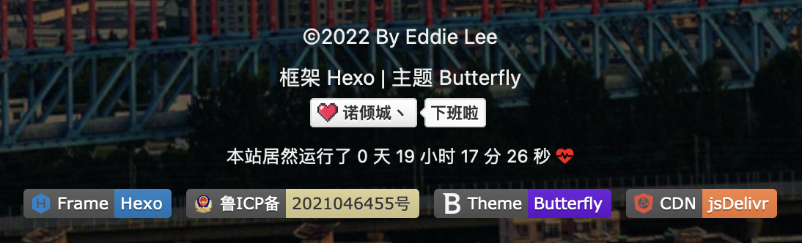

# 安装Butterfly主题

去到[Butterfly GitHub](https://github.com/jerryc127/hexo-theme-butterfly)主页,在博客根目录运行以下命令:

```shell
git clone -b master https://github.com/jerryc127/hexo-theme-butterfly.git themes/butterfly
```

完成后,在<code>_config.yml</code>中更改theme为Butterfly(当前的版本为4.5.1),到此还不能够成功启动hexo,硬要启动会报以下错误:

```
extends includes/layout.pug block content include ./includes/mixins/post-ui.pug #recent-posts.recent-posts +postUI include includes/pagination.pug
```

需要先安装以下依赖:

```shell
npm install hexo-renderer-pug hexo-renderer-stylus --save
```

运行hexo三件套,hexo成功启动.

Note:在Mac或者Linux中如果想要更改某个文件夹下所有文件的权限,运行

```shell
chmod -R 777 文件夹名 #R必须大写
```

# 添加加载动画

博客里有一些图片比较大,进人到博客后还没有完全加载出来,这样很不好看,所以我想做一个加载动画.

参考原帖在[这里](https://anzhiy.cn/posts/52d8.html),注意Butterfly主题的版本是**4.5.1*.*


- 修改<code>themes/butterfly/layout/includes/loading/fullpage-loading.pug</code>

  ```css
  #loading-box(onclick='document.getElementById("loading-box").classList.add("loaded")')
    .loading-bg
      div.loading-img
      .loading-image-dot
  
  script.
    const preloader = {
      endLoading: () => {
        document.body.style.overflow = 'auto';
        document.getElementById('loading-box').classList.add("loaded")
      },
      initLoading: () => {
        document.body.style.overflow = '';
        document.getElementById('loading-box').classList.remove("loaded")
  
      }
    }
    window.addEventListener('load',()=> { preloader.endLoading() })
  
    if (!{theme.pjax && theme.pjax.enable}) {
      document.addEventListener('pjax:send', () => { preloader.initLoading() })
      document.addEventListener('pjax:complete', () => { preloader.endLoading() })
    }
  ```

- 修改<code>themes/butterfly/layout/includes/loading/index.pug</code>

  ```css
  if theme.preloader.source === 1
    include ./fullpage-loading.pug
  else if theme.preloader.source === 2
    include ./pace.pug
  else
    include ./fullpage-loading.pug
    include ./pace.pug
  ```

- 新建<code>source/css/progress_bar.css</code>, 也可以不做这一步下面配置文件`pace_css_url`这一项就要留空, 这一步是修改 pace 加载的胶囊样式用的.

  ```css
  .pace {
    -webkit-pointer-events: none;
    pointer-events: none;
    -webkit-user-select: none;
    -moz-user-select: none;
    user-select: none;
    z-index: 2000;
    position: fixed;
    margin: auto;
    top: 10px;
    left: 0;
    right: 0;
    height: 8px;
    border-radius: 8px;
    width: 4rem;
    background: #eaecf2;
    border: 1px #e3e8f7;
    overflow: hidden;
  }
  
  .pace-inactive .pace-progress {
    opacity: 0;
    transition: 0.3s ease-in;
  }
  
  .pace .pace-progress {
    -webkit-box-sizing: border-box;
    -moz-box-sizing: border-box;
    -ms-box-sizing: border-box;
    -o-box-sizing: border-box;
    box-sizing: border-box;
    -webkit-transform: translate3d(0, 0, 0);
    -moz-transform: translate3d(0, 0, 0);
    -ms-transform: translate3d(0, 0, 0);
    -o-transform: translate3d(0, 0, 0);
    transform: translate3d(0, 0, 0);
    max-width: 200px;
    position: absolute;
    z-index: 2000;
    display: block;
    top: 0;
    right: 100%;
    height: 100%;
    width: 100%;
    background: linear-gradient(-45deg, #ee7752, #e73c7e, #23a6d5, #23d5ab);
    animation: gradient 1.5s ease infinite;
    background-size: 200%;
  }
  
  .pace.pace-inactive {
    opacity: 0;
    transition: 0.3s;
    top: -8px;
  }
  @keyframes gradient {
    0% {
      background-position: 0% 50%;
    }
    50% {
      background-position: 100% 50%;
    }
    100% {
      background-position: 0% 50%;
    }
  }
  ```

  - 修改<code>themes/butterfly/source/css/_layout/loading.styl</code>, 其中的颜色可以替换成你喜欢的色值。

    ```css
    if hexo-config('preloader')
      .loading-bg
        display: flex;
        width: 100%;
        height: 100%;
        position: fixed;
        background: var(/* 这里替换成你的色值 */);
        z-index: 1001;
        opacity: 1;
        transition: .3s;
    
      #loading-box
        .loading-img
          width: 100px;
          height: 100px;
          border-radius: 50%;
          margin: auto;
          border: 4px solid #f0f0f2;
          animation-duration: .3s;
          animation-name: loadingAction;
          animation-iteration-count: infinite;
          animation-direction: alternate;
        .loading-image-dot
          width: 30px;
          height: 30px;
          background: #6bdf8f;
          position: absolute;
          border-radius: 50%;
          border: 6px solid #fff;
          top: 50%;
          left: 50%;
          transform: translate(18px, 24px);
        &.loaded
          .loading-bg
            opacity: 0;
            z-index: -1000;
    
      @keyframes loadingAction
        0% {
            opacity: 1;
        }
    
        100% {
            opacity: .4;
        }
    
    ```

- 在<code>[BlogRoot]/source/css/</code>下创建一个custom.css的文件,在该文件中添加如下代码:

  ```css
  .loading-img {
    background: url(/* 这里填你博客头像的地址 */) no-repeat center center;
    background-size: cover;
  }
  ```

- 修改<code>_config.butterfly.yml</code>中<code>preloader</code>选项, 改完以后<code>source: 1</code>为满屏加载无pace胶囊,<code>source: 2</code>为pace胶囊无满屏动画, <code>source: 3</code>是两者都启用。

  ```yml
  # Loading Animation (加载动画)
  preloader:
    enable: true
    # source
    # 1. fullpage-loading
    # 2. pace (progress bar)
    # else all
    source: 3
    # pace theme (see https://codebyzach.github.io/pace/)
    pace_css_url: /css/progress_bar.css
  ```

- 记得要在<code>_config.butterfly.yml</code>中添加<code>inject</code>

  ```yml
  inject:
    head:
      # 自定义css
      - <link rel="stylesheet" href="/css/custom.css" media="defer" onload="this.media='all'">
  ```

  # 向博客中添加图片,并且能够在Typora和网页中都能正常显示

  **问题描述**:在Typora中插入图片时使用的是相对路径,该并不能够被hexo识别,导致启动hexo的时候文章内的图片没有办法正常显示.反过来如果使用了hexo能够识别的图片路径,在Typora中又不能够浏览图片了.

  **解决办法**:

  - 将<code>_config.yml</code>中<code>post_asset_folder:</code>设置为true,在新建文章时hexo会自动生成一个和文章同名的文件夹存放文章中的图片.

  - 调整Typora中的设置

  

  - 安装插件

    ```shell
    npm install hexo-renderer-marked #不推荐,这一个包可以不安装
    npm install hexo-image-link --save
    
    npm uninstall hexo-renderer-marker --save  #卸载 marked 
    npm install hexo-renderer-markdown-it --save  #安装markdown-it
    ```

Note:如果想要给文章添加封面,可以在scaffold文件夹的post.md中更改一下文章的模板

```markdown
title: {{ title }}
date: {{ date }}
tags:
updated: 
top_img:
categories:
cover: 
```

将封面的连接填在<code>cover</code>后面,如果封面图片在本地就直接填封面图片的文件名.

# 添加本地搜索

```shell
npm install hexo-generator-searchdb --save
```

在<code>_config.yml</code>中添加

```shell
# Search
search:
	path: search.xml
	field: post
	format: html
	limit: 10000
	#  template: ./search.xml 这一行添加上会报错,先注释掉
```

将<code>_config.butterfly.yml</code>中localsearch的enable改为true

# 设置文章永久化连接

```shell
npm install hexo-abbrlink --save
```

# 统计字数阅读时间

```shell
npm install hexo-wordcount --save
```

更改<code>_config.butterfly.yml</code>中的代码

```yml
wordcount:
  enable: true
  post_wordcount: true
  min2read: true
  total_wordcount: true
```

# 自定义网站样式

**挖坑:了解CSS的工作原理**

在`[BlogRoot]/source/css/custom.css`中添加如下代码:

```css
/* 颜色 */
:root {
  --anzhiyu-theme-op: #4259ef23;
  --anzhiyu-gray-op: #9999992b;
  --anzhiyu-theme-top: var(--anzhiyu-theme);
  --anzhiyu-white: #fff;
  --anzhiyu-white-op: rgba(255, 255, 255, 0.2);
  --anzhiyu-black: #000;
  --anzhiyu-black-op: rgba(0, 0, 0, 0.2);
  --anzhiyu-none: rgba(0, 0, 0, 0);
  --anzhiyu-gray: #999999;
  --anzhiyu-yellow: #ffc93e;
  --anzhiyu-border-radius: 8px;
  --anzhiyu-main: var(--anzhiyu-theme);
  --anzhiyu-main-op: var(--anzhiyu-theme-op);
  --anzhiyu-shadow-theme: 0 8px 12px -3px var(--anzhiyu-theme-op);
  --anzhiyu-shadow-main: 0 8px 12px -3px var(--anzhiyu-main-op);
  --anzhiyu-shadow-blue: 0 8px 12px -3px rgba(40, 109, 234, 0.2);
  --anzhiyu-shadow-white: 0 8px 12px -3px rgba(255, 255, 255, 0.2);
  --anzhiyu-shadow-black: 0 0 12px 4px rgba(0, 0, 0, 0.05);
  --anzhiyu-shadow-yellow: 0px 38px 77px -26px rgba(255, 201, 62, 0.12);
  --anzhiyu-shadow-red: 0 8px 12px -3px #ee7d7936;
  --anzhiyu-shadow-green: 0 8px 12px -3px #87ee7936;
  --anzhiyu-shadow-border: 0 8px 16px -4px #2c2d300c;
  --anzhiyu-shadow-blackdeep: 0 2px 16px -3px rgba(0, 0, 0, 0.15);
  --anzhiyu-logo-color: linear-gradient(215deg, #4584ff 30%, #ff7676 70%);
  --style-border: 1px solid var(--anzhiyu-card-border);
  --anzhiyu-blue-main: #3b70fc;
  --style-border-hover: 1px solid var(--anzhiyu-main);
  --style-border-dashed: 1px dashed var(--anzhiyu-theme-op);
  --style-border-avatar: 4px solid var(--anzhiyu-background);
  --style-border-always: 1px solid var(--anzhiyu-card-border);
  --anzhiyu-white-acrylic1: #fefeff !important;
  --anzhiyu-white-acrylic2: #fcfdff !important;
  --anzhiyu-black-acrylic2: #08080a !important;
  --anzhiyu-black-acrylic1: #0b0b0e !important;
  --anzhiyu-main-none: #b8b8b800 !important;
}

[data-theme="light"] {
  --anzhiyu-theme: #3b70fc;
  --anzhiyu-theme-op: #4259ef23;
  --anzhiyu-blue: #3b70fc;
  --anzhiyu-red: #d8213c;
  --anzhiyu-pink: #ff7c7c;
  --anzhiyu-green: #57bd6a;
  --anzhiyu-fontcolor: #363636;
  --anzhiyu-background: #f7f9fe;
  --anzhiyu-reverse: #000;
  --anzhiyu-maskbg: rgba(255, 255, 255, 0.6);
  --anzhiyu-maskbgdeep: rgba(255, 255, 255, 0.85);
  --anzhiyu-hovertext: var(--anzhiyu-theme);
  --anzhiyu-ahoverbg: #f7f7fa;
  --anzhiyu-lighttext: var(--anzhiyu-main);
  --anzhiyu-secondtext: rgba(60, 60, 67, 0.6);
  --anzhiyu-scrollbar: rgba(60, 60, 67, 0.4);
  --anzhiyu-card-btn-bg: #edf0f7;
  --anzhiyu-post-blockquote-bg: #fafcff;
  --anzhiyu-post-tabs-bg: #f2f5f8;
  --anzhiyu-secondbg: #edf0f7;
  --anzhiyu-shadow-nav: 0 5px 12px -5px rgba(102, 68, 68, 0.05);
  --anzhiyu-card-bg: #fff;
  --anzhiyu-shadow-lightblack: 0 5px 12px -5px rgba(102, 68, 68, 0);
  --anzhiyu-shadow-light2black: 0 5px 12px -5px rgba(102, 68, 68, 0);
  --anzhiyu-card-border: #c0c6d8;
}

[data-theme="dark"] {
  --global-bg: #191919;
  --anzhiyu-theme: #0084ff;
  --anzhiyu-theme-op: #0084ff23;
  --anzhiyu-blue: #0084ff;
  --anzhiyu-red: #ff3842;
  --anzhiyu-pink: #ff7c7c;
  --anzhiyu-green: #57bd6a;
  --anzhiyu-fontcolor: #f7f7fa;
  --anzhiyu-background: #18171d;
  --anzhiyu-reverse: #fff;
  --anzhiyu-maskbg: rgba(0, 0, 0, 0.6);
  --anzhiyu-maskbgdeep: rgba(0, 0, 0, 0.85);
  --anzhiyu-hovertext: #0a84ff;
  --anzhiyu-ahoverbg: #fff;
  --anzhiyu-lighttext: #f2b94b;
  --anzhiyu-secondtext: #a1a2b8;
  --anzhiyu-scrollbar: rgba(200, 200, 223, 0.4);
  --anzhiyu-card-btn-bg: #30343f;
  --anzhiyu-post-blockquote-bg: #000;
  --anzhiyu-post-tabs-bg: #121212;
  --anzhiyu-secondbg: #30343f;
  --anzhiyu-shadow-nav: 0 5px 20px 0px rgba(28, 28, 28, 0.4);
  --anzhiyu-card-bg: #1d1b26;
  --anzhiyu-shadow-lightblack: 0 5px 12px -5px rgba(102, 68, 68, 0);
  --anzhiyu-shadow-light2black: 0 5px 12px -5px rgba(102, 68, 68, 0);
  --anzhiyu-card-border: #42444a;
}
/* @font-face {
  font-family: Candyhome;
  src: url(https://npm.elemecdn.com/anzhiyu-blog@1.1.6/fonts/Candyhome.ttf);
  font-display: swap;
  font-weight: lighter;
} */
@font-face {
  font-family: ZhuZiAYuanJWD;
  src: url(https://npm.elemecdn.com/anzhiyu-blog@1.1.6/fonts/ZhuZiAWan.woff2);
  font-display: swap;
  font-weight: lighter;
}

div#menus {
  font-family: "ZhuZiAYuanJWD";
}
h1#site-title {
  font-family: ZhuZiAYuanJWD;
  font-size: 3em !important;
}
a.article-title,
a.blog-slider__title,
a.categoryBar-list-link,
h1.post-title {
  font-family: ZhuZiAYuanJWD;
}

.iconfont {
  font-family: "iconfont" !important;
  font-size: 3em;
  /* 可以定义图标大小 */
  font-style: normal;
  -webkit-font-smoothing: antialiased;
  -moz-osx-font-smoothing: grayscale;
}

/* 时间轴生肖icon */
svg.icon {
  /* 这里定义svg.icon，避免和Butterfly自带的note标签冲突 */
  width: 1em;
  height: 1em;
  /* width和height定义图标的默认宽度和高度*/
  vertical-align: -0.15em;
  fill: currentColor;
  overflow: hidden;
}

.icon-zhongbiao::before {
  color: #f7c768;
}

/* bilibli番剧插件 */
#article-container .bangumi-tab.bangumi-active {
  background: var(--anzhiyu-theme);
  color: var(--anzhiyu-ahoverbg);
  border-radius: 10px;
}
a.bangumi-tab:hover {
  text-decoration: none !important;
}
.bangumi-button:hover {
  background: var(--anzhiyu-theme) !important;
  border-radius: 10px !important;
  color: var(--anzhiyu-ahoverbg) !important;
}
a.bangumi-button.bangumi-nextpage:hover {
  text-decoration: none !important;
}
.bangumi-button {
  padding: 5px 10px !important;
}

a.bangumi-tab {
  padding: 5px 10px !important;
}
svg.icon.faa-tada {
  font-size: 1.1em;
}
.bangumi-info-item {
  border-right: 1px solid #f2b94b;
}
.bangumi-info-item span {
  color: #f2b94b;
}
.bangumi-info-item em {
  color: #f2b94b;
}

/* 解决artitalk的图标问题 */
#uploadSource > svg {
  width: 1.19em;
  height: 1.5em;
}

/*top-img黑色透明玻璃效果移除，不建议加，除非你执着于完全一图流或者背景图对比色明显 */
#page-header:not(.not-top-img):before {
  background-color: transparent !important;
}

/* 首页文章卡片 */
#recent-posts > .recent-post-item {
  background: rgba(255, 255, 255, 0.9);
}

/* 首页侧栏卡片 */
#aside-content .card-widget {
  background: rgba(255, 255, 255, 0.9);
}

/* 文章页面正文背景 */
div#post {
  background: rgba(255, 255, 255, 0.9);
}

/* 分页页面 */
div#page {
  background: rgba(255, 255, 255, 0.9);
}

/* 归档页面 */
div#archive {
  background: rgba(255, 255, 255, 0.9);
}

/* 标签页面 */
div#tag {
  background: rgba(255, 255, 255, 0.9);
}

/* 分类页面 */
div#category {
  background: rgba(255, 255, 255, 0.9);
}

/*夜间模式伪类遮罩层透明*/
[data-theme="dark"] #recent-posts > .recent-post-item {
  background: #121212;
}

[data-theme="dark"] .card-widget {
  background: #121212 !important;
}

[data-theme="dark"] div#post {
  background: #121212 !important;
}

[data-theme="dark"] div#tag {
  background: #121212 !important;
}

[data-theme="dark"] div#archive {
  background: #121212 !important;
}

[data-theme="dark"] div#page {
  background: #121212 !important;
}

[data-theme="dark"] div#category {
  background: #121212 !important;
}

[data-theme="dark"] div#category {
  background: transparent !important;
}
/* 页脚透明 */
#footer {
  background: transparent !important;
}

/* 头图透明 */
#page-header {
  background: transparent !important;
}

#rightside > div > button {
  border-radius: 5px;
}

/* 滚动条 */

::-webkit-scrollbar {
  width: 10px;
  height: 10px;
}

::-webkit-scrollbar-thumb {
  background-color: #3b70fc;
  border-radius: 2em;
}

::-webkit-scrollbar-corner {
  background-color: transparent;
}

::-moz-selection {
  color: #fff;
  background-color: #3b70fc;
}

/* 音乐播放器 */

/* .aplayer .aplayer-lrc {
  display: none !important;
} */

.aplayer.aplayer-fixed.aplayer-narrow .aplayer-body {
  left: -66px !important;
  transition: all 0.3s;
  /* 默认情况下缩进左侧66px，只留一点箭头部分 */
}

.aplayer.aplayer-fixed.aplayer-narrow .aplayer-body:hover {
  left: 0 !important;
  transition: all 0.3s;
  /* 鼠标悬停是左侧缩进归零，完全显示按钮 */
}

.aplayer.aplayer-fixed {
  z-index: 999999 !important;
}

/* 评论框  */
.vwrap {
  box-shadow: 2px 2px 5px #bbb;
  background: rgba(255, 255, 255, 0.3);
  border-radius: 8px;
  padding: 30px;
  margin: 30px 0px 30px 0px;
}

/* 设置评论框 */

.vcard {
  box-shadow: 2px 2px 5px #bbb;
  background: rgba(255, 255, 255, 0.3);
  border-radius: 8px;
  padding: 30px;
  margin: 30px 0px 0px 0px;
}

/* 鼠标图标 */
body {
  cursor: url("/img/x1.cur"), auto;
}
a,
[type="button"]:not(:disabled),
[type="reset"]:not(:disabled),
[type="submit"]:not(:disabled),
button:not(:disabled) {
  cursor: url("/img/x2.cur"), auto !important;
}
/* md网站下划线 */
#article-container a:hover {
  text-decoration: none !important;
}

#article-container #hpp_talk p img {
  display: inline;
}

/* 404页面 */
#error-wrap {
  position: absolute;
  top: 40%;
  right: 0;
  left: 0;
  margin: 0 auto;
  padding: 0 1rem;
  max-width: 1000px;
  transform: translate(0, -50%);
}

#error-wrap .error-content {
  display: flex;
  flex-direction: row;
  justify-content: center;
  align-items: center;
  margin: 0 1rem;
  height: 18rem;
  border-radius: 8px;
  background: var(--card-bg);
  box-shadow: var(--card-box-shadow);
  transition: all 0.3s;
}

#error-wrap .error-content .error-img {
  box-flex: 1;
  flex: 1;
  height: 100%;
  border-top-left-radius: 8px;
  border-bottom-left-radius: 8px;
  background-color: #3b70fc;
  background-position: center;
  background-size: cover;
}

#error-wrap .error-content .error-info {
  box-flex: 1;
  flex: 1;
  padding: 0.5rem;
  text-align: center;
  font-size: 14px;
  font-family: Titillium Web, "PingFang SC", "Hiragino Sans GB", "Microsoft JhengHei", "Microsoft YaHei", sans-serif;
}
#error-wrap .error-content .error-info .error_title {
  margin-top: -4rem;
  font-size: 9em;
}
#error-wrap .error-content .error-info .error_subtitle {
  margin-top: -3.5rem;
  word-break: break-word;
  font-size: 1.6em;
}
#error-wrap .error-content .error-info a {
  display: inline-block;
  margin-top: 0.5rem;
  padding: 0.3rem 1.5rem;
  background: var(--btn-bg);
  color: var(--btn-color);
}

#body-wrap.error .aside-list {
  display: flex;
  flex-direction: row;
  flex-wrap: nowrap;
  bottom: 0px;
  position: absolute;
  padding: 1rem;
  width: 100%;
  overflow: scroll;
}

#body-wrap.error .aside-list .aside-list-group {
  display: flex;
  flex-direction: row;
  flex-wrap: nowrap;
  max-width: 1200px;
  margin: 0 auto;
}

#body-wrap.error .aside-list .aside-list-item {
  padding: 0.5rem;
}

#body-wrap.error .aside-list .aside-list-item img {
  width: 100%;
  object-fit: cover;
  border-radius: 12px;
}

#body-wrap.error .aside-list .aside-list-item .thumbnail {
  overflow: hidden;
  width: 230px;
  height: 143px;
  background: var(--anzhiyu-card-bg);
  display: flex;
}

#body-wrap.error .aside-list .aside-list-item .content .title {
  -webkit-line-clamp: 2;
  overflow: hidden;
  display: -webkit-box;
  -webkit-box-orient: vertical;
  line-height: 1.5;
  justify-content: center;
  align-items: flex-end;
  align-content: center;
  padding-top: 0.5rem;
  color: white;
}

#body-wrap.error .aside-list .aside-list-item .content time {
  display: none;
}

/* 代码框主题 */
#article-container figure.highlight {
  border-radius: 10px;
}
```

如果不需要一图流,删除上面代码中的:

```css
/* 页脚透明 */
#footer {
  background: transparent !important;
}

/* 头图透明 */
#page-header {
  background: transparent !important;
}
```

我感觉一图流更好看一些,同时不要忘记在`_config.butterfly.yml`中background属性后添加背景图片的地址.

# 给网站添加页脚徽标和计时器



徽标我们在很多GitHub项目的主页中也会看到，比如：


[推荐一个徽标生成网站](https://shields.io/)，但是比较可以的是徽标的label部分底色修改不了。不过我们可以自定义图标，步骤如下：

1.找到合适的图片，尽量不要太大，背景透明，然后存储png格式。

2.找个在线转base64图片的网站，推荐[这个在线生成Base64的网站](https://tool.chinaz.com/tools/imgtobase),把制作好的图片转为base64链接。

3.把base64链接作为logo填进徽标链接，比如这样：

```url
https://img.shields.io/badge/诺倾城丶-下班啦-d021d6?style=&logo=<生成的base64编码>
```

将上面生成的链接使用Chrome浏览器打开，用Safari打开有时会抽风显示不出来。将打开的页面下载下来，下载下来的是一个<code>svg</code>文件，将这个文件放到<code>/img</code>目录下，方便索引。

在<code>Terminal</code>中安装依赖：

```shell
npm install hexo-butterfly-footer-beautify --save
```

在<code>_config.butterfly.yml</code>中添加：

```yaml
footer_beautify:
  enable:
    timer: true # 计时器开关
    bdage: true # 徽标开关
  priority: 5 #过滤器优先权
  enable_page: all # 应用页面
  exclude: #屏蔽页面
    # - /posts/
    # - /about/
  layout: # 挂载容器类型
    type: id
    name: footer-wrap
    index: 0
  # 计时器部分配置项
  runtime_js:  /js/runtime/runtime.min.js
  runtime_css: /css/runtime/runtime.min.css
  # 徽标部分配置项
  swiperpara: 4 #若非0，则开启轮播功能，每行徽标个数
  bdageitem:
    - link: https://hexo.io/ #徽标指向网站链接
      shields: https://img.shields.io/badge/Frame-Hexo-blue?style=flat&logo=hexo #徽标API
      message: 博客框架为Hexo_v5.4.0 #徽标提示语
    - link: https://beian.miit.gov.cn/#/Integrated/index
      shields: /img/备案.svg
      message: 本站已在鲁进行备案
    - link: https://butterfly.js.org/
      shields: https://img.shields.io/badge/Theme-Butterfly-6513df?style=flat&logo=bitdefender
      message: 主题版本Butterfly_v3.8.2
    - link: https://www.jsdelivr.com/
      shields: https://img.shields.io/badge/CDN-jsDelivr-orange?style=flat&logo=jsDelivr
      message: 本站使用JsDelivr为静态资源提供CDN加速
    - link: https://vercel.com/
      shields: https://img.shields.io/badge/Hosted-Vercel-brightgreen?style=flat&logo=Vercel
      message: 本站采用双线部署，默认线路托管于Vercel
    - link: https://vercel.com/
      shields: https://img.shields.io/badge/Hosted-Coding-0cedbe?style=flat&logo=Codio
      message: 本站采用双线部署，联通线路托管于Coding
    - link: https://github.com/
      shields: https://img.shields.io/badge/Source-Github-d021d6?style=flat&logo=GitHub
      message: 本站项目由Github托管
    - link: http://creativecommons.org/licenses/by-nc-sa/4.0/
      shields: https://img.shields.io/badge/Copyright-BY--NC--SA%204.0-d42328?style=flat&logo=Claris
      message: 本站采用知识共享署名-非商业性使用-相同方式共享4.0国际许可协议进行许可
    
  swiper_css: https://unpkg.zhimg.com/hexo-butterfly-swiper/lib/swiper.min.css
  swiper_js: https://unpkg.zhimg.com/hexo-butterfly-swiper/lib/swiper.min.js
  swiperbdage_init_js: https://unpkg.zhimg.com/hexo-butterfly-footer-beautify/lib/swiperbdage_init.min.js
# see https://akilar.top/posts/8e1264d1/
```

计时器部分的两个文件：在博客根目录下的<code>source</code>文件夹下新建<code>/runtime/runtime.css</code>和<code>js/runtime/runtime.js</code>文件，填入以下内容：

```javascript
/* runtime.js */
var now = new Date();
function createtime() {
  var t = new Date("10/10/2022 00:00:00");
  now.setTime(now.getTime() + 250);
  var e = (now - t) / 1e3 / 60 / 60 / 24,
    a = Math.floor(e),
    n = (now - t) / 1e3 / 60 / 60 - 24 * a,
    r = Math.floor(n);
  1 == String(r).length && (r = "0" + r);
  var s = (now - t) / 1e3 / 60 - 1440 * a - 60 * r,
    i = Math.floor(s);
  1 == String(i).length && (i = "0" + i);
  var o = (now - t) / 1e3 - 86400 * a - 3600 * r - 60 * i,
    l = Math.round(o);
  1 == String(l).length && (l = "0" + l);
  let g = "";
  (g =
    r < 18 && r >= 9
      ? `<span class='textTip'> <br> 本站居然运行了 ${a} 天</span><span id='runtime'> ${r} 小时 ${i} 分 ${l} 秒 </span> <i class='fas fa-heartbeat' style='color:red'></i>`
      : `<span class='textTip'> <br> 本站居然运行了 ${a} 天</span><span id='runtime'> ${r} 小时 ${i} 分 ${l} 秒 </span> <i class='fas fa-heartbeat' style='color:red'></i>`),
    document.getElementById("workboard") &&
      (document.getElementById("workboard").innerHTML = g);
}
setInterval(() => {
  createtime();
}, 250);

```

```css
/* runtime.css */
div#runtime {
  width: 180px;
  margin: auto;
  color: #fff;
  padding-inline: 5px;
  border-radius: 10px;
  background-color: rgba(0, 0, 0, 0.7);
}
#workboard {
  font-size: 12px;
}
[data-theme="dark"] div#runtime {
  color: #28b4c8;
  box-shadow: 0 0 5px rgba(28, 69, 218, 0.71);
  animation: flashlight 1s linear infinite alternate;
}
#ghbdages .github-badge img {
  height: 20px;
}
@-moz-keyframes flashlight {
  from {
    box-shadow: 0 0 5px #1478d2;
  }
  to {
    box-shadow: 0 0 2px #1478d2;
  }
}
@-webkit-keyframes flashlight {
  from {
    box-shadow: 0 0 5px #1478d2;
  }
  to {
    box-shadow: 0 0 2px #1478d2;
  }
}
@-o-keyframes flashlight {
  from {
    box-shadow: 0 0 5px #1478d2;
  }
  to {
    box-shadow: 0 0 2px #1478d2;
  }
}
@keyframes flashlight {
  from {
    box-shadow: 0 0 5px #1478d2;
  }
  to {
    box-shadow: 0 0 2px #1478d2;
  }
}

```

使用<code>VSCode</code>的插件<code>JS & CSS Minifier (Minify)</code>生成<code>runtime.min.css</code>和<code>runtime.min.js</code>文件。

# 添加站点动态Title

在`[BlogRoot]/source/js/`下新建`title.js`,填入以下代码,**注意要在主题配置文件中Inject**

```js
//动态标题
var OriginTitile = document.title;
var titleTime;
document.addEventListener("visibilitychange", function () {
  if (document.hidden) {
    //离开当前页面时标签显示内容
    document.title = "w(ﾟДﾟ)w 不要走！再看看嘛！";
    clearTimeout(titleTime);
  } else {
    //返回当前页面时标签显示内容
    document.title = "♪(^∇^*)欢迎肥来！" + OriginTitile;
    //两秒后变回正常标题
    titleTime = setTimeout(function () {
      document.title = OriginTitile;
    }, 2000);
  }
});
```

# 添加外挂标签

```shell
# https://www.npmjs.com/package/hexo-butterfly-tag-plugins-plus
npm install hexo-butterfly-tag-plugins-plus --save

npm uninstall hexo-renderer-marked --save
npm install hexo-renderer-kramed --save
```

使用方法参考:https://akilar.top/posts/615e2dec/

# 安装wowjs

**需要解决的问题碰到了问题:**

​	我在给个人简介的侧边栏加上变色的效果后,这一个卡片的载入动画就不受控制了,和其他的板块格格不入,除了个人信息卡处的动画不受控制以外,Git Calendar的加载动画也不受控制.需要解决

```shell
npm install hexo-butterfly-wowjs --save
```

添加配置项

```yml
# wowjs
# see https://www.npmjs.com/package/hexo-butterfly-wowjs
wowjs:
  enable: true #控制动画开关。true是打开，false是关闭
  priority: 10 #过滤器优先级
  mobile: false #移动端是否启用，默认移动端禁用
  animateitem:
    - class: recent-post-item #必填项，需要添加动画的元素的class
      style: animate__zoomIn #必填项，需要添加的动画
      duration: 1.5s #选填项，动画持续时间，单位可以是ms也可以是s。例如3s，700ms。
      delay: 200ms #选填项，动画开始的延迟时间，单位可以是ms也可以是s。例如3s，700ms。
      offset: 30 #选填项，开始动画的距离（相对浏览器底部）
      iteration: 1 #选填项，动画重复的次数
    - class: card-widget
      style: animate__zoomIn
      delay: 200ms
    # - class: flink-list-card
    #   style: wowpanels
    - class: flink-list-card
      style: animate__flipInY
      duration: 3s
    - class: flink-list-card
      style: animate__animated
      duration: 3s
    - class: article-sort-item
      style: animate__slideInRight
      duration: 1.5s
    - class: site-card
      style: animate__flipInY
      duration: 3s
    - class: site-card
      style: animate__animated
      duration: 3s
  animate_css: https://cdn.cbd.int/hexo-butterfly-wowjs/lib/animate.min.css
  wow_js: https://cdn.cbd.int/hexo-butterfly-wowjs/lib/wow.min.js
  wow_init_js: https://cdn.cbd.int/hexo-butterfly-wowjs/lib/wow_init.js
```

# 魔改关于页面

# 添加打赏功能

# 外挂标签的使用

# 添加GitCalendar

# 在侧边栏添加电子时钟

# 添加Butterfly Swiper插件

# 适配B站视频

在文章中添加B站的视频

将下面的代码直接复制到你想要添加视频的博客中去,替换掉aid后面那一串字符.**注意,如果你的视频ID是BV开头,那么要把aid替换成bvid**

```html
<div align="center" class="aspect-ratio">
  <iframe
    src="https://player.bilibili.com/player.html?aid=556933559&&page=1&as_wide=1&high_quality=1&danmaku=0"
    scrolling="no"
    border="0"
    frameborder="no"
    framespacing="0"
    high_quality="1"
    danmaku="1"
    allowfullscreen="true"
  ></iframe>
</div>
```

在source/css/custom.css中添加以下代码

```css
/*哔哩哔哩视频适配*/
.aspect-ratio {
  position: relative;
  width: 100%;
  height: 0;
  padding-bottom: 75%;
  margin: 3% auto;
  text-align: center;
}
.aspect-ratio iframe {
  position: absolute;
  width: 100%;
  height: 100%;
  left: 0;
  top: 0;
}
```

<div align="center" class="aspect-ratio">
  <iframe
    src="https://player.bilibili.com/player.html?bvid=BV1uT4y1P7CX&&page=1&as_wide=1&high_quality=1&danmaku=0"
    scrolling="no"
    border="0"
    frameborder="no"
    framespacing="0"
    high_quality="1"
    danmaku="1"
    allowfullscreen="true"
  ></iframe>
</div>

# 存在Bug

## 文章目录无法跳转

打开浏览器的开发者模式，toc-link并没有生成，所以没有办法实现跳转，解决办法：

安装插件：

```shell
npm install markdown-it-named-headings --save
```

然后进入项目的根目录，修改根目录下 `node_modules\hexo-renderer-markdown-it\lib\renderer.js` 文件，在 `renderer.js` 中添加一行以使用此插件：

```js
parser.use(require('markdown-it-named-headings'))
```


因为`.gitignore`忽略了`node_modules`中的修改，所以在新的设备上git pull下来之后还要手动地添加上面这一行才可以
