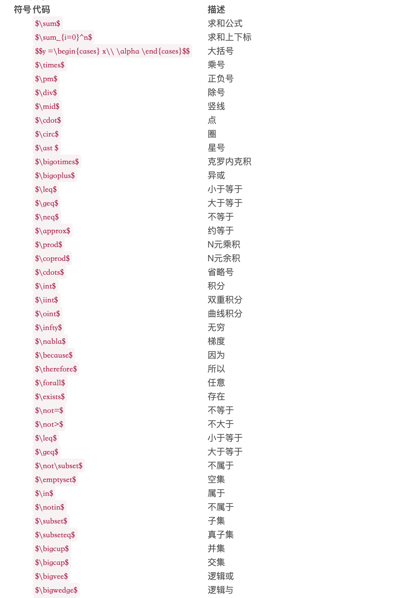
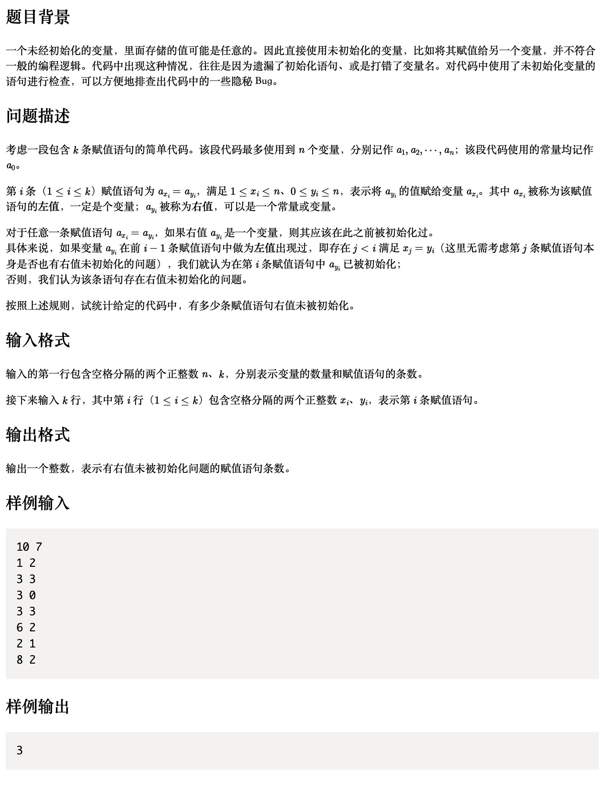
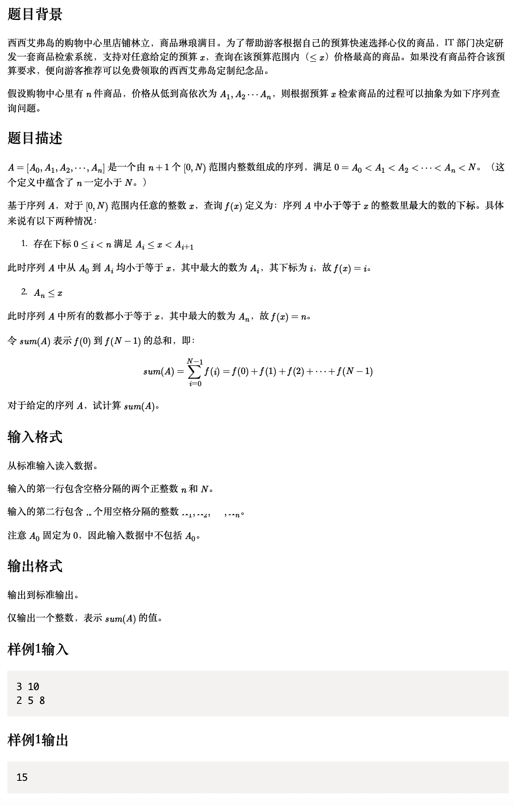
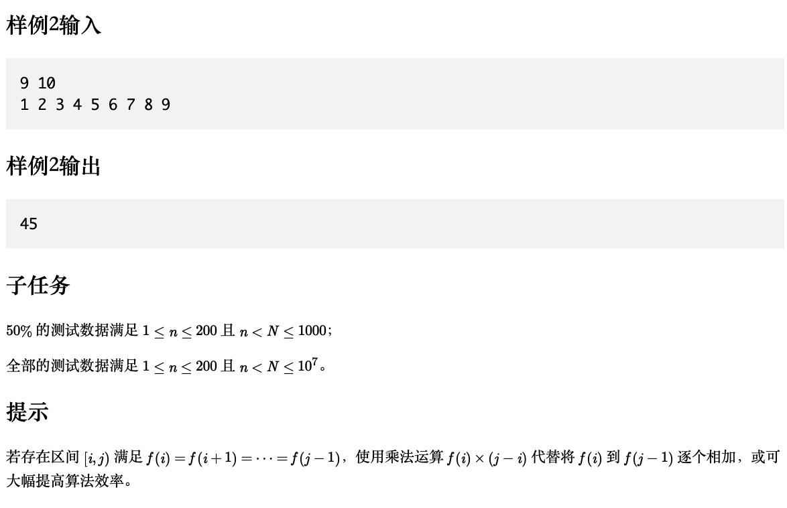
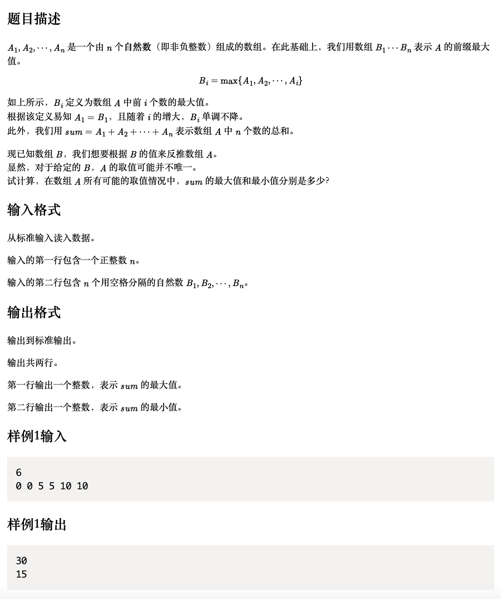

<!--more-->

# 前言

距离上次更新博客已经过去了快两个月，在这两个月的时间里，各种比赛和考研复习让我无暇顾及博客的更新。比赛大都是拿我大创项目的成果参加的，对于我这个考研狗来讲，这些比赛的履历没有太大意义。我真不知道该说是自己胸襟伟岸还是闲的胃疼，我对比赛的名次不感兴趣，我也相信我参加的这些比赛，只要认真做都能拿一个不错的成绩，我不会为了比赛去卷（但是我互联网+的小组员真的很有干劲，申报书卷了整整一百页）。我更喜欢和积极、负责又有思想的人一起去做有意义的事情，这些比赛的意义就在于我能由此认识这些人，这大概就是团队协作的魅力吧。我终究还是一个喜欢热闹按耐不住孤独的小孩子，但考研的路是孤独又漫长的路，。
​  一段时间不写博客，连基本的部署操作都忘记了，之前在本地创建的Hexo的文件夹好像又出什么问题了，但至少服务器端还是正常的，这次遇到了两个问题： 

1. 在博客中插入数学符号，要在公式块中使用，公式我贴到下面了，虽然在Typora中完全可以显示，但是，部署到hexo中还是什么都显示不了。破案了，不要用typora的插入公式块，直接输入两个$，在两个$中间打数学符号就可以了
2. 在博客中插入图片，目前这个问题还没有完全解决，插入图片有两种方式：
   - 使用<u>！[]（）</u>的方式插入图片，这样可以在Typora中看到图片，但是部署hexo之后就怎么都显示不了。
   - 使用<u></u> 这样能够在hexo中显示，但是在编辑器中无法显示，真的简直了，就不能两全齐美么，在我以前的博客中，我记得方法a是可以显示的，应该是因为添加了永久化链接abbrlink之后，文件的索引目录变了，在之前的！[]()方法里，将文件夹的目录去掉，只留下图片的文件名就可以了。因此只要每次部署博客之前先把前面的文件夹名称删掉就可以了。（真的好麻烦）



# 202203-1：未初始化警告

## [原题链接](http://118.190.20.162/view.page?gpid=T143)

## 问题描述：



## 思路

因为是一级的题，只要问题描述能读明白思路就差不多出来了，这里我总结两个我踩过的坑：

- 注意数组下标，题目中变量的个数是n，常量个数有很多但是都归为a<sub>0</sub>，因此在创建数组的时候要创建一个长度为n+1的数组，并且在使用的时候要时刻注意下标和变量的对应
- 我之前遇到这种题，我的第一想法是：创建一个变长的数组**sum**存储初始化好的变量，遍历给出的赋值语句，比如a<sub>2</sub> = a<sub>0</sub>，那么说明a<sub>2</sub>被初始化了，我就把a<sub>2</sub>加入初始化数组，遍历完整个数组之后，就能判断为初始化赋值语句的个数了，这种想法真的太蠢了。**更好的做法是：**创建一个长度为n+1的数组sum，表示每个变量在等式左边出现的次数，初始值为0。遍历赋值语句，如果某个变量比如a<sub>3</sub> = a<sub>2</sub>，a<sub>2</sub>是右值，那么判断parameter[2]是否为0，为0代表它没有在左边出现过，那么这就是一条未初始化语句，但是parameter[3] + 1，因为它是左值，或许这样更符合计算机的思考逻辑。

## 代码

```c++
#include<iostream>
using namespace std;
int main(){
    int n,k;
    //n表示变量的个数，k表示赋值语句个数
    cin >> n >> k;
    bool isInit = false; //是否初始化
    int xi,yi;
    //xi表示赋值语句左值，yi表示赋值语句右值 
    int parameter[n + 1];
    for(int i = 0; i <=n; i++){
        parameter[i] = 0;
    }
    int count = 0;//为初始化语句计数
    for(int i = 0; i < k; i++){
        cin >> xi >> yi;
        if(i == 0){
            if(yi == 0)isInit = true;
            else isInit = false;
        }else{
            if(yi == 0)isInit = true;
            else if(parameter[yi] == 0)isInit = false;
            else isInit = true;
        }
        if(isInit == false){
            count++;
        }
        parameter[xi] += 1;   
    }
    cout << count << endl;
    return 0;
}
```

#  202112-1:序列查询

## [原题链接](http://118.190.20.162/view.page?gpid=T138)

## 问题描述





## 思路

不难看出这是个双循环的问题，我在选择谁是外循环谁是内循环的时候纠结了一下，但是看到它给的提示之后突然就恍然大悟了，要用乘法的话那必然是让便利A[i]的循环为外循环，每次外循环首先将count置0，代表上轮循环已经计数完成，已经求出$ A[i] \le x < A[i+1]$中x的个数了。

**注意数组的下标，还是个坑**

## 代码

```C++
#include<iostream>
using namespace std;
int main(){
    int n,N;
    int A[n+1];
    int x = 0;
    cin >> n >> N;
    int sum = 0;
    A[0] = 0;
    for(int i = 1; i <= n; i++){
        cin >> A[i];
    }
    int i = 0;
    while(i <= n){
        int count = 0; //该值记录的是每一个A[i]可以拦下的x的个数
        //怎么拦呢？
        //x要小于或者等于A[i]才能拦住，否则就要放走它
        //考虑边界问题，如果i=n了,
        while(x < N){
            if(i == n){
                count = N - x;
                break;
            }else if(A[i] <= x && x < A[i+1]){

                count++;
                x++;
            }else break;
        }
        sum = sum + count * i;
        i++;
    }
    cout << sum << endl;
    return 0;
}
```

# 202101-1 数组推导

## [原题链接](http://118.190.20.162/view.page?gpid=T129)

## 问题描述



## 思路

不难看出，最大值就是第二行输入的数据相加，最小值就是从第二行中每个数挑一个然后加起来，但这破题还是恶心到我了，我在系统里提交了好几次都没通过，去网上找了一份代码提交通过了之后再把我的代码交上去竟然就通过了？

## 代码

```c++
#include<iostream>
using namespace std;
int main(){
    int n;
    cin >> n;
    int B[n];
    int max_sum = 0,min_sum = 0;
    for(int i = 0; i < n; i++){
        cin >> B[i];
        max_sum += B[i];
        if(i==0)min_sum = B[i];
        else{
            if(B[i] == B[i-1])continue;
            min_sum += B[i];
        }
    }
    cout << max_sum << endl << min_sum << endl;;
    return 0;
}
```

## 总结

CCF的题目就跟语文阅读理解一样，或许出题人觉得带入实际问题能帮助我们理解题目吧……
