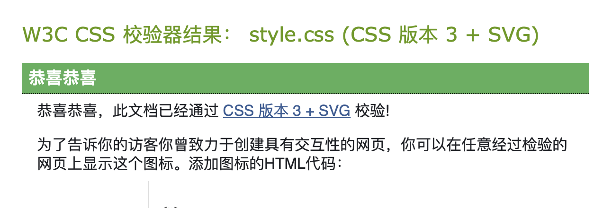
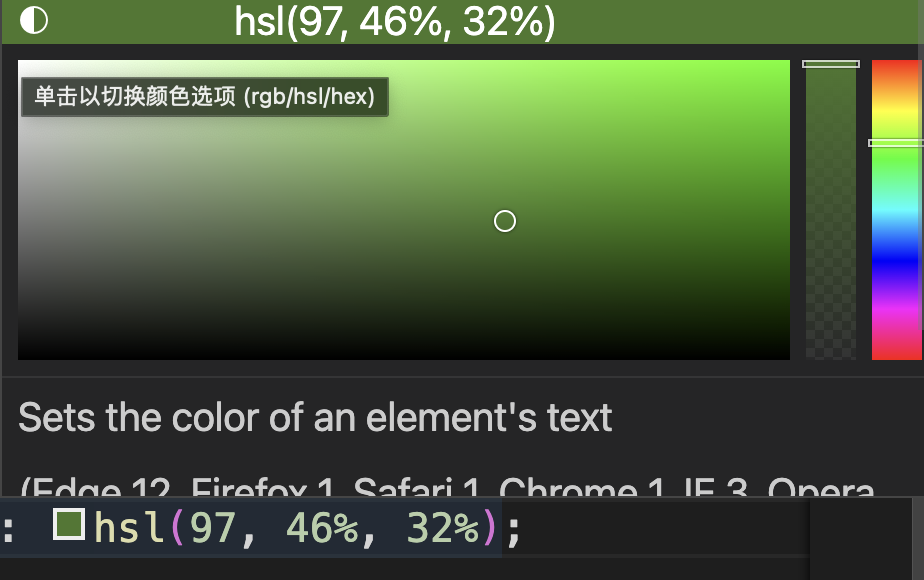
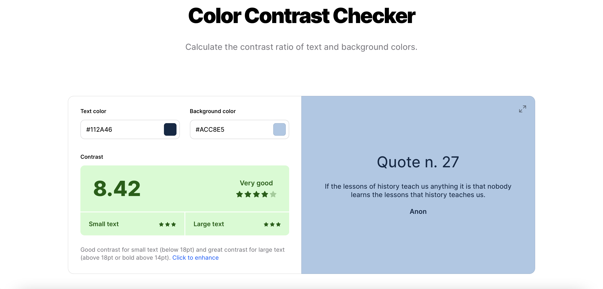

# StartHere

Css全称Cascading Style Sheet(层叠样式表),它是一种样式表语言,用来描述HTML或者XML文档的呈现,CSS描述了在屏幕,纸质,音频等其他媒体上的元素应该如何被渲染的问题.

## CSS是如何工作的?

当浏览器展示一个文件的时候,它必须坚固文件的内容和文件的样式信息,下面我们会了解到它处理文件的标准的流程,需要知道的事,下面的步骤是浏览加载网页的简化版本,而且不同的浏览器在处理文件的时候会有不同的方式,但是下面的步骤基本都会出现.

1. 浏览器载入HTML文件(比如从网络上获取).

2. 将HTML文件转换成一个DOM(Document Object Model),DOM是文件在计算机内存中的表现形式,之后会更加详细的解释**DOM(挖坑),记得回来填上**

   这里挖坑了,记得填上.

3. 接下来,浏览器会拉取该HTML相关的大部分资源,比如嵌入到页面的图片,视频和CSS样式.JavaScript则会稍后进行处理,简单起见,我们不会过多讨论如何加载JavaScript.

4. 浏览器拉取到CSS之后便会进行解析,根据选择器(Selector)的不同类型(比如element,class,id等等)把他们分到不同的“**桶**”中.浏览器基于它找到的不同的选择器(Selector),将不同的规则(基于选择器的规则,如元素选择器,类选择器,id选择器等等)应用在对应的DOM节点中,并添加节点依赖的样式(这个中间步骤称为渲染树).

5. 上述的规则应用于渲染树之后,渲染树会依照因该出现的结构进行布局

6. 网页展示在屏幕上(这一步被成为着色).

结合流程图理解更加形象:


## 关于DOM

一个DOM又一个树形结构,标记语言中的每一个元素、属性以及每一段文字都对应着结构树中的一个节点(node/DOM或者DOM node).节点由节点本身和其他DOM节点的关系定义,有些节点有父节点,有些节点有兄弟节点(同级节点).

对于DOM的理解会很大程度上帮助我们设计、调试和维护我们的CSS,因为DOM是CSS样式和文件内容的结合.当我们使用浏览器F12调试的时候我们可以操作DOM来查看使用了哪些规则.

## 一个真实的DOM案例

不同于很长且枯燥的案例,这里我们通过一个HTML片段来了解HTML是怎么转换成DOM的

```html
<p>
  Let's use:
  <span>Cascading</span>
  <span>Style</span>
  <span>Sheets</span>
</p>

```

在这个DOM中,`<p>`元素对应了父节点,他的子节点是一个text节点和三个对应了`<span>`元素的节点,SPAN节点同时也是它们中的Text节点的父节点

```
P
├─ "Let's use:"
├─ SPAN
|  └─ "Cascading"
├─ SPAN
|  └─ "Style"
└─ SPAN
    └─ "Sheets"
```

上图就是浏览器如何解析这个HTML片段,它生成上图的DOM树形结构并将它按照如下输出到浏览器:

Let's use: Cascading Style Sheets

## 应用CSS到DOM

接下来让我们看看添加一些CSS到文件里加以渲染,同样的HTML代码:

```html
<p>
  Let's use:
  <span>Cascading</span>
  <span>Style</span>
  <span>Sheets</span>
</p>
```

添加CSS代码:

```css
span {
  border: 1px solid black;
  background-color: lime;
}
```

浏览器会解析HTML并创造一个DOM,然后解析CSS.可以看到唯一的选择器就是`span`元素选择器,浏览器处理规则会非常快,把同样的规则直接使用在三个`<span>`标签上,然后渲染出图像到屏幕.

现在的显示如下:

<p>
  Let's use:
  <span style="border: 1px solid black;background-color: lime;">Cascading</span>
  <span style="border: 1px solid black;background-color: lime;">Style</span>
  <span style="border: 1px solid black;background-color: lime;">Sheets</span>
</p>

## 当浏览器遇到无法解析的CSS代码会发生什么?

浏览器什么都不会做,继续解析下一个CSS样式.

如果一个浏览器在解析你所书写的CSS规则中遇到了无法理解的属性或者值,它会忽略这些并继续解析下面的CSS声明,在你书写了错误的CSS代码(或者错误拼写),又或者当浏览器遇到对于它来说很新的还没有支持的CSS代码的时候,上述情况同样会发生.

相似的,当浏览器遇到无法解析的选择器的时候,他会直接忽略掉整个选择器的规则,然后解析下一个CSS选择器.

这样做的好处很多,你所编写的CSS优化过程中浏览器遇到无法解析的规则也不会报错,当你为一个元素制定多个CSS样式的时候,浏览器会加载样式表中最后的CSS代码进行渲染(样式表的优先级看这👀),也正因为如此,我们可以给同一个元素制定多个CSS样式来解决有些浏览器不兼容新特性的问题(比如指定两个width).

这一特点在你想使用一个很新的CSS特性但并不是所有的浏览器都支持的时候非常有用,比如一些老的浏览器不接受`calcu()`作为一个值.我们可能使用它结合像素为一个元素设置了动态宽度,老式的浏览器由于无法解析而会选择忽略掉这一行,新式浏览器则会把这一行解析成像素值,并且覆盖第一行制定的宽度.

```css
.box {
  width: 500px;
  width: calc(100% - 50px);
}
```

## CSS在html中三种引用方式:

1. 外部样式表(external style sheet)，在`head`中使用link引入css外部文件

   ```html
   <!DOCTYPE html>
   <html lang="en">
   <head>
       <meta charset="UTF-8">
       <meta http-equiv="X-UA-Compatible" content="IE=edge">
       <meta name="viewport" content="width=device-width, initial-scale=1.0">
       <title>Document</title>
       <link rel="stylesheet" href="css/style.css" >
   </head>
   <body>
       <p>I'm learning css!</p>
   </body>
   </html>
   ```

2. 内部样式表，添加<code>style</code>标签，缺点是会使得html看起来很臃肿.

   ```html
     <head>
     <meta charset="UTF-8">
     <meta http-equiv="X-UA-Compatible" content="IE=edge">
     <meta name="viewport" content="width=device-width, initial-scale=1.0">
     <title>Document</title>
     <style>
     	p{
     		color:burlywood
     	}
     </style>
     </head>
   <body>
       <p>I'm learning css!</p>
   </body>
   </html>
   ```

3. 内连样式,此方法最不推荐.

   ```html
   <!DOCTYPE html>
   <html lang="en">
   <head>
       <meta charset="UTF-8">
       <meta http-equiv="X-UA-Compatible" content="IE=edge">
       <meta name="viewport" content="width=device-width, initial-scale=1.0">
       <title>Document</title>
       <link rel="stylesheet" href="css/style.css" >
   </head>
   <body>
       <p style="color:burlywood">I'm learning css!</p>
   </body>
   </html>
   ```


## 小练习1

在VSCode中安装`LiveServer`插件,这个插件可以在你对CSS做完更改后立刻将你所做的更改渲染到页面上.安装完成后在`html`文件中使用`右键`->`open with liver server`

### 修改元素的默认属性

我们可以修改浏览器默认的样式,只需要选定想要修改的元素,加一条CSS规则即可.

拿无序列表`<ul>`举例,它自带项目符号,你不喜欢它就可以这样移除它们:

```css
li {
  list-style-type: none;
}
```

```html
<h1>I am a level one heading</h1>

<p>This is a paragraph of text. In the text is a <span>span element</span> 
and also a <a href="http://example.com">link</a>.</p>

<p>This is the second paragraph. It contains an <em>emphasized</em> element.</p>

<ul>
    <li>Item one</li>
    <li>Item two</li>
    <li>Item <em>three</em></li>
</ul>
```

我们不仅可以移除项目符号,我们甚至可以改变它们的形状:

```css
li {
  list-style-type: square;
}
```

### 使用类名

我们已经能够修改HTML元素的默认属性了,接下来我们尝试给HTML元素添加类(class),用来实现更加定制化的效果.

举个例子,我们更改一下上面的html代码:

```html
<ul>
    <li>Item one</li>
    <li class="special">Item two</li>
    <li>Item <em>three</em></li>
</ul>
```

在CSS文档中,我们添加这个`special`类

```css
.special {
  color: orange;
  font-weight: bold;
}
```

保存后,我们通过`live server`能够直接看到变化,通过添加类,我们实现了对HTML相同元素的不同效果的显示.

应该注意的是,这个`special`类可不仅仅局限于列表,它可以应用到各种元素上,举个例子,我们可以让段落里的`<span>`也具有同样的效果.

```html
<p>This is a paragraph of text. In the text is a <span class="special">span element</span> 
and also a <a href="http://example.com">link</a>.</p>
```


还有一种写法,HTML元素选择器跟类一起出现:

```css
li.special {
  color: orange;
  font-weight: bold; 
}
```

意思就是说,“选中每个`special`类的`li`元素”,如果是这样的话,那它对`<span>`还有其他的元素都不起作用了,想要再次对`<span>`起作用就需要这样写:

```css
li.special,
span.special {
  color: orange;
  font-weight: bold;
}
```

这样写可太麻烦了,作为一个懒狗我还是想把一个类的属性应用在多个元素上,所以大部分时候我们还是不要管元素了,光看类就完事儿了.

### 根据元素在文档中的位置确定样式

有时候,我们希望某些内容根据它在文档中的位置而有所不同,有很多选择器可以为我们所用,在这里我们只介绍两种.在我们的文档中有两个`<em>`元素,一个在段落内,另一个在列表项内.仅选择嵌套在`<li>`元素内的`<em>`我们可以使用一个称为**包含选择符**的选择器,它只是单纯地在两个选择器之间加上了一个空格.

```css
li em {
  color: rebeccapurple;
}
```

该选择器将选择`<li>`内部的任何`<em>`元素(`<li>`的后代),因此在上面给到的html代码中,实现的效果应该是第三个列表项内的`<em>`是紫色,但是在段落内的那个没有发生变化.

再举一个我们可能想要实现的效果:设置在HTML文档中直接出现在标题后面并且与标题有相同层级的段落样式,在两个选择器之间添加一个`+`号(称为**相邻选择符**)

```css
h1 + p {
  font-size: 200%;
}
```

### 根据状态确定样式

在本次小练习中我们最后要看的一种修改样式的方法是根据标签的状态确定样式.一个直观的例子就是当我们修改连接的样式时,我们需要定位(针对)`<a>`标签,取决于是否是未访问的、访问过的、被鼠标悬停的、被键盘定位的,亦或是正在被点击当中的状态,这个标签有着不同的状态,我们可以使用CSS去定位或者说针对这些不同的状态进行修饰,下面的代码使得没有被访问的链接的颜色变成粉色、访问过的链接变成绿色.

```css
a:link {
  color: pink;
}

a:visited {
  color: green;
}
```

我们也可以改变被鼠标悬停时候的样式,如移除下划线,下面的代码就实现了这个功能:

```css
a:hover {
  text-decoration: none;
}
```

### 同时使用选择器和选择符

```css
/* selects any <span> that is inside a <p>, which is inside an <article>  */
article p span { ... }

/* selects any <p> that comes directly after a <ul>, which comes directly after an <h1>  */
h1 + ul + p { ... }

```

向我们自己的CSS中添加如下代码:

```css
/* 这段的意思是选取body标签中所有和h1标签同级的p标签的special类 */
body h1 + p .special {
  color: yellow;
  background-color: black;
  padding: 5px;
}
```

可能上面的代码看起来有点复杂了,不要灰心,通过深入的学习我们会找到窍门的.

## CSS的优先级

这里挖坑了,记得填上.

优先级是分配给指定的CSS声明的一个权重,它由匹配的选择器中的每一种选择类型的数值所决定

而当优先级与多个CSS声明中任意一个声明的优先级相等的时候,CSS中最后的那个声明将会被应用到元素上.

当同一个元素有多个声明的时候,优先级才会有意义.因为每个直接作用于元素的CSS规则总是会接管/覆盖(takeover)该元素从祖先元素继承而来的规则.

### 选择器类型

下面给出的列表,选择器类型的优先级是递增的(出现了`伪元素`、`伪类`这些新概念不要怕,后面我们会使用到):

1. 类型选择器(比如`<h1>`)和伪元素(比如,`::before`)
2. 类选择器(比如,`.example`),属性选择器(比如,`[type="radio"]`)和伪类(比如,`:hover`)
3. ID选择器(比如,`#example`)

通配选择符(universal selector)(`*`)、关系选择符(combinators)([`+`](https://developer.mozilla.org/zh-CN/docs/Web/CSS/Adjacent_sibling_combinator), [`>`](https://developer.mozilla.org/zh-CN/docs/Web/CSS/Child_combinator), [`~`](https://developer.mozilla.org/zh-CN/docs/Web/CSS/General_sibling_combinator), [" "](https://developer.mozilla.org/zh-CN/docs/Web/CSS/Descendant_combinator), [`||`](https://developer.mozilla.org/zh-CN/docs/Web/CSS/Column_combinator))、否定伪类(negation pseudo-class)(`:not()`)对优先级没有影响(但是在`:not()`内部声明的选择器会影响优先级)

给元素添加的内联样式(例如,`style="font-weight:bold"`)总会覆盖外部样式表的任何样式,因此可以看作是具有最高的优先级

### `!important`例外规则

当在一个样式声明中使用一个`!important`规则时,此声明将覆盖任何其他声明.虽然,从技术上讲,`!important`与优先级无关,但是它与最终的结果直接相关,使用`!important`是一个坏习惯,应该尽量避免,因为这破坏了样式表中固有的级联规则,使得调试找bug变得更加困难了.当两条相呼冲突的带有`!important`规则的声明被应用到相同的元素上时,拥有更大优先级的声明会被采用.

[此处](https://developer.mozilla.org/zh-CN/docs/Web/CSS/Specificity)有关于`!important`的使用心得,未来某天我会将它整理到我的博客中

## 验证css是否生效？

使用以下网站



可以检验自己的css是否生效

# CSS Selectors

CSS选择器是CSS规则的一部分,它是元素和其他部分组合起来告诉浏览器哪个html元素应当是被选为应用规则中的CSS属性值的方式,选择器所选择的元素,叫做选择器的对象.

我们已经遇到过几种不同的选择器,选择器可以以不同的方式选择元素,比如`h1`元素,或者是根据class(类)选择例如`.special`.

## 选择器列表

如果我们有多个使用相同样式的CSS选择器,那么这些单独的选择器可以被混编为一个“选择器列表”,这样,规则就可以应用到所有的单个选择器上了,比如`h1`和`.special`类有相同的CSS,那么我可以把它们写成两个分开的规则.

```css
h1 {
  color: blue;
}

.special {
  color: blue;
}
```

我也可以将它们组合起来,在它们之间加上一个逗号,变成**选择器列表**.

```css
h1, .special {
  color: blue;
}
```

空格可以在逗号的前面或者后面,我们还可以让每个选择器都另起一行,这样会更好读一些.

```css
h1,
.special {
  color: blue;
}
```

在下面的示例中,我们尝试把两个相同声明的选择器组合起来,展示的效果在组合起来以后应该还是一样的.

这里要插入示例

当我们使用**选择器列表**时,如果任何一个选择器无效(存在语法错误),那么整条规则都会被忽略.

在下面的示例中,无效的class选择器会被忽略,但是`h1`选择器仍然会被样式化

```css
h1 {
  color: blue;
}

..special {
  color: blue;
}
```

但是在被组合起来以后,整个规则都会失效,无论是`h1`还是这个class都不会被样式化

```css
h1, ..special {
  color: blue;
}
```

## 选择器的种类

有几组不同的选择器,知道了需要哪种选择器,我们能够正确的使用它们,

### 类型、类和ID选择器(最常用)

```css
/* 类型选择器 */
h1 { }

/* 类选择器 */
.box { }

/* ID选择器 */
#unique { }

```

下面这些选择器都还没有碰到过

### 标签属性选择器

这组选择器根据一个元素上某个标签的属性的存在以选择不同的方式:

```css
a[title] { }
```

或者根据一个有特定值的标签属性是否存在来选择:

```css
a[href="https://example.com"] { }
```

### 伪类与伪元素

这组选择器包含了伪类,用来样式化一个元素的特定状态.例如`:hover`伪类会在鼠标指针悬浮到一个元素上的时候选择这个元素

```css
a:hover { }
```

它还可以包含了伪元素,选择一个元素的某个部分而不是元素自己.例如,`::first-line`是会选择的一个元素(下面的情况中是`<p>`)中的第一行,类似`<span>`包含在了第一个被格式化的行外面,然后选择这个`<span>`

```css
p::first-line { }
```

### 运算符

最后一组选择器可以将其他选择器组合起来,更复杂的选择元素.下面的示例用运算符`>`选择了`<article>`元素的初代子元素.

```css
article > p { }
```

# Colors

- 我们可以直接输入颜色(color name),比如red、blue、green:

  ```css
  p {
  	color: green;
  }
  ```

- 也可以使用RGB表示颜色,比如

  ```css
  p {
  	color: rgb(255,0,0);
  }
  ```

- 更复杂的,我们可以使用rgba:

  ```css
  p {
  	color: rgba(255,0,0,0.5);
  }
  ```

  其中的a是`alpha channel`,代表的是透明度,范围是0~1,RGB是默认Alpha Channel为1.

- 使用十六进制(`hexamical`)表示颜色

  ```css
  p {
      color: #6bb53d;
  }
  ```

  Tips:如果颜色的Hexadecimal恰好是`aa bb cc`这样两位一重复的,可以简写(`shorthand`)成`a b a`

- 使用`color palette`随意调整

- 

  在`color palette`中可以切换成hsl模式:hue saturation and lightness(色彩、饱和度、亮度)

推荐一个配色[网站](https://coolors.co/),网站中提供了一个Contrast Checker的功能,它可以给你网站的配色进行评分.




# Units&Size

## CSS的值

在CSS规范中,我们能够看到有很多的属性值,因为它们被尖括号包围,如`<color>`或者`<length>`.当我们看到`<color>`对特定属性有效时,这意味着你可以使用任何有效的颜色作为该属性的值.

比如我们使用关键字设置标题的颜色,使用`rgb()`函数设置背景:

```css
h1 {
  color: black;
  background-color: rgb(197,93,161);
}
```

CSS中的值类型是一种定义了一些可使用的值的集合的方式,这意味着如果你看到的`<color>`是有效的,那么你就不需要考虑可以使用哪种类型——不管是关键字、十六进制还是`rgb()`函数都是有效的,如果浏览器支持这些可用的`<color>`值,那么就可以使用它们当中的任意一个.

下面介绍一些我们常会遇到的一些值和单位类型,然后做一些实际的练习.

## 数字,长度和百分比

| 数值类型 | 表头  |
|  :---  | ----  |
| `<intenger>` | `<intenger>`是一个整数,比如1024或者-55 |
| `<number>` | `<number>`表示已恶搞消暑——他可能有小数点后面的部分,也可能没有.例如:0.255、128或者-1.2 |
| `<dimension>` | `<dimension>`是一个`<number>`,它有一个附加的单位,例如45deg、5s或者10px.`<dimension>`是一个伞形类别,包括`<length>`、`<angle>`、`<time>`和`<resolution>`类型 |
| <percentage> | <percentage>表示一些其他值的一部分,例如50%.百分比值总是相对于另一个量,例如一个元素的长度相对于其父元素的长度. |

### 长度

最常见的数字类型是`<length>`,例如10px(像素)或者30em.CSS中有两种类型的长度——相对长度和绝对长度,重要的是要知道它们之间的区别,以便理解他们控制的元素将变的有多大.

#### 绝对长度单位

下面都是绝对长度单位——它们与其他任何东西都没有关系,通常被认为总是相同的大小:

| 单位 | 名称         | 等价换算              |
| ---- | ------------ | --------------------- |
| `cm` | 厘米         | 1cm = 96px/2.54       |
| `mm` | 毫米         | 1mm = 1/10th of 10 cm |
| `Q`  | 四分之一毫米 | 1Q = 1/40th of 1cm    |
| `in` | 英寸         | 1in = 2.54cm = 96px   |
| `pc` | 十二点活字   | 1pc = 1/6th of 1in    |
| `pt` | 点           | 1pt = 1/72th of 1in   |
| `px` | 像素         | 1px = 1/96th of 1in   |

这些值中的大多数在用于打印时比用于输出到屏幕时更加有用,例如我们通常不会在屏幕上使用`cm`,唯一一个可能经常使用的值,估计就是px(像素).

#### 相对长度单位

相对长度相对于其他的一些东西,比如父元素的字体大小,或者是试图端口的大小.使用相对单位的好处是,经过一些仔细的规划,我们可以使文本或者其他元素的大小与页面上的其他内容相对应,下面是我们常用到的一些单位:

| 单位   | 相对于                                                       |
| ------ | ------------------------------------------------------------ |
| `em`   | 在font-size中使用是相对父元素的字体大小,在其他属性中使用是相对于自身的字体大小,比如width |
| `ex`   | 字符“x”的高度                                                |
| `ch`   | 数字“0”的宽度                                                |
| `rem`  | 根元素的字体大小                                             |
| `lh`   | 元素的line- height                                           |
| `vw`   | 视窗宽度的1%                                                 |
| `vh`   | 视窗高度的1%                                                 |
| `vmin` | 视窗较小尺寸的1%                                             |
| `vmax` | 视窗大尺寸的1%                                               |

举一个例子:

首先,第一个框以像素为单位设置width,作为一个绝对单位,这个宽度将保持不变,无论其他如何变化.它的宽度都不会改变.

第二个框的宽度设置为`vw`(视口宽度)单位.这个值相对于视口宽度,所以10`vs`是视口宽度的10%.如果我们改变浏览器的宽度,那么框的大小会更改.

第三个框使用`em`单位,这些是相对于字体大小的.我们在包含`<div>`的元素上设置一个 1`em`的字体大小,它有一个`.wrapper`类.将这个值更改为1.5`em`,你将看到所有元素的字体大小都增加了,但是只有最后一项会变宽,因为宽度与字体的大小有关.

我其实并没有太看出来第三个框的效果......

```html
<!DOCTYPE html>
<html lang="en">
<head>
    <meta charset="UTF-8">
    <meta http-equiv="X-UA-Compatible" content="IE=edge">
    <meta name="viewport" content="width=device-width, initial-scale=1.0">
    <title>Document</title>
    <link rel="stylesheet" href="css/style.css">
    <style>
    * {
        box-sizing: border-box;
      }
      .box {
        background-color: lightblue;
        border: 5px solid darkblue;
        padding: 10px;
        margin: 1em 0;
      }
    </style>

</head>
<body>
    <div class="wrapper">
        <div class="box px">I am 200px wide</div>
        <div class="box vw">I am 10vw wide</div>
        <div class="box em">I am 10em wide</div>
      </div>
          
</body>
</html>
```

```css
.wrapper {
    font-size: 1em;
  }
  
.px {
	width: 200px;
}

.vw {
	width: 10vw;
}

.em {
	width: 10em;
}
```

`ems` 和 `rems`

`em`和`rem`是我们在从框到文本调整大小时最常遇到的两个相对长度,了解这些方法是如何工作的以及它们之间的区别是很有意义的,尤其是当我们开始学习更加复杂的主题时(我确实是因为要博客美化才学的CSS...)比如样式化文本或者CSS布局.下面举个例子.

HTML是一组嵌套的列表——我们总工有三个列表,并且两个示例都有相同的HTML.唯一的区别是第一个类具有`ems`,第二个类具有`rems`.

首先,我们将16px设置为`<html>`元素的字体大小

概括的说,在排版属性中em单位的意思是“父元素的字体大小”.带有ems类的`<ul>`内的`<li>`元素从它们的父元素中获取大小.**因此,每一个连续的嵌套级别都会逐渐变大**,因为每个嵌套的字体大小都被设置为1.3em——是其父嵌套字体大小的1.3倍.

概括的说,rem单位的意思是“根元素的字体大小”.(根em的rem标准)`<ul>`内的`<li>`元素和一个rems类从根元素(`<html>`)中获取它的大小,**这就意味着,每一个连续的嵌套层都不会不断变大**.

能看出效果,但是`<li>`作为`<ul>`的子元素,难道不是继承`<ul>`的ems属性么,为什么在CSS文件里还要对li进行定义



但是,如果你在CSS中更改`<html>`字体的大小,你讲看到所有其他相关内容都发生了改变,包括rem和em大小的文本.

```html
<!DOCTYPE html>
<html lang="en">
<head>
    <meta charset="UTF-8">
    <meta http-equiv="X-UA-Compatible" content="IE=edge">
    <meta name="viewport" content="width=device-width, initial-scale=1.0">
    <title>Document</title>
    <link rel="stylesheet" href="css/style.css">
</head>
<body>
    <ul class="ems">
        <li>One</li>
        <li>Two</li>
        <li>Three
          <ul>
            <li>Three A</li>
            <li>Three B
              <ul>
                <li>Three B 2</li>
              </ul>
            </li>
          </ul>
        </li>
      </ul>
      
      <ul class="rems">
        <li>One</li>
        <li>Two</li>
        <li>Three
          <ul>
            <li>Three A</li>
            <li>Three B
              <ul>
                <li>Three B 2</li>
              </ul>
            </li>
          </ul>
        </li>
      </ul>
          
</body>
</html>
```

```css
html {
    font-size: 16px;
  }
  
.ems li {
    font-size: 1.3em;
  }
  
.rems li {
    font-size: 1.3rem;
  }
  
```

百分比

在许多情况下,百分比与长度的处理方式是一样的,百分比的问题在于,它们总是相对于其他值设置的.例如,如果将元素的字体大小设置为百分比,那么它将是其父元素字体大小的百分比.如果使用百分比作为宽度值,那么它将是父值宽度的百分比.

在下面的示例中,两个百分比大小的框和两个像素大小的框具有相同的类名.分别是200px和40%宽.

不同之处在于,第二组的两个框位于一个400像素宽的包装器中,第二个200px宽的盒子和第一个一样宽,但是第二个40%的盒子现在是400px的40%——比第一个窄多了.自己尝试一下实现效果.

```html
<!DOCTYPE html>
<html lang="en">
<head>
    <meta charset="UTF-8">
    <meta http-equiv="X-UA-Compatible" content="IE=edge">
    <meta name="viewport" content="width=device-width, initial-scale=1.0">
    <title>Document</title>
    <link rel="stylesheet" href="css/style.css">
    <style>
        * {
            box-sizing: border-box;
          }
          .box {
            background-color: lightblue;
            border: 5px solid darkblue;
            padding: 10px;
            margin: 1em 0;
          }
        </style>
</head>
<body>
    <div class="box px">I am 200px wide</div>
    <div class="box percent">I am 40% wide</div>
    <div class="wrapper">
    <div class="box px">I am 200px wide</div>
    <div class="box percent">I am 40% wide</div>
    </div>
    
</body>
</html>
```

```css
.wrapper {
    width: 400px;
    border: 5px solid rebeccapurple;
}

.px {
    width: 200px;
}

.percent {
    width: 40%;
}
```

下面这个例子中以百分比设置字体大小,每个<li>都有80%的字体大小,因此嵌套列表项在从父级继承其大小时将逐渐变小.

```html
<!DOCTYPE html>
<html lang="en">
<head>
    <meta charset="UTF-8">
    <meta http-equiv="X-UA-Compatible" content="IE=edge">
    <meta name="viewport" content="width=device-width, initial-scale=1.0">
    <title>Document</title>
    <link rel="stylesheet" href="css/style.css">
    <style>
        * {
            box-sizing: border-box;
          }
          .box {
            background-color: lightblue;
            border: 5px solid darkblue;
            padding: 10px;
            margin: 1em 0;
          }
        </style>
</head>
<body>
    <div class="box px">I am 200px wide</div>
    <div class="box percent">I am 40% wide</div>
    <div class="wrapper">
    <div class="box px">I am 200px wide</div>
    <div class="box percent">I am 40% wide</div>
    </div>
    
</body>
</html>
```

```css

body { 
    background-color: #fff;
    color: #333;
    font: 1.2em / 1.5 Helvetica Neue, Helvetica, Arial, sans-serif;
    padding: 0;
    margin: 0;
}
li {
    font-size: 80%;
}
```

注意,虽然许多值接受长度或者百分比,但是也有一些值值接受长度.哪些属性接受哪些值可以在这里[查询](https://developer.mozilla.org/zh-CN/docs/Web/CSS/Reference),如果允许的值包括`<length-percent>`,则可以使用长度或者百分比.如果允许的值只包括`<length>`,则不可以使用百分比.

数字

有些值接受数字,不添加任何的单位,接受无单位数字的属性的一个例子就是不透明度属性(`opacity`),它控制元素的不同明度(它的透明程度).此属性接受0(完全透明)和1(完全不透明)之间的数字.

在下面的例子中尝试将不透明度的值改为从0到1之间的各种小数值,并查看内容是如何变得透明或者不透明的.

```html
<!DOCTYPE html>
<html lang="en">
<head>
    <meta charset="UTF-8">
    <meta http-equiv="X-UA-Compatible" content="IE=edge">
    <meta name="viewport" content="width=device-width, initial-scale=1.0">
    <title>Document</title>
    <link rel="stylesheet" href="css/style.css">
    <style>
        * {
            box-sizing: border-box;
          }
          .box {
            background-color: lightblue;
            border: 5px solid darkblue;
            padding: 10px;
            margin: 1em 0;
            /* 更改这里的数字 */
            opacity: 0.6;
          }
        </style>
</head>
<body>
    <div class="wrapper">
        <div class="box">I am a box with opacity</div>
      </div> 
      
</body>
</html>
```

```css

.wrapper {
    background-image: url(https://mdn.github.io/css-examples/learn/values-units/balloons.jpg);
    background-repeat: no-repeat;
    background-position: bottom left;
    padding: 20px;
}

body {
    background-color: #fff;
    color: #333;
    font: 1.2em / 1.5 Helvetica Neue, Helvetica, Arial, sans-serif;
    padding: 0;
    margin: 0;
}
```


OK,这两天进度不错,稍微咕咕咕几天,明天要稍微学一下线代,不过我要先去看电锯人咯.
