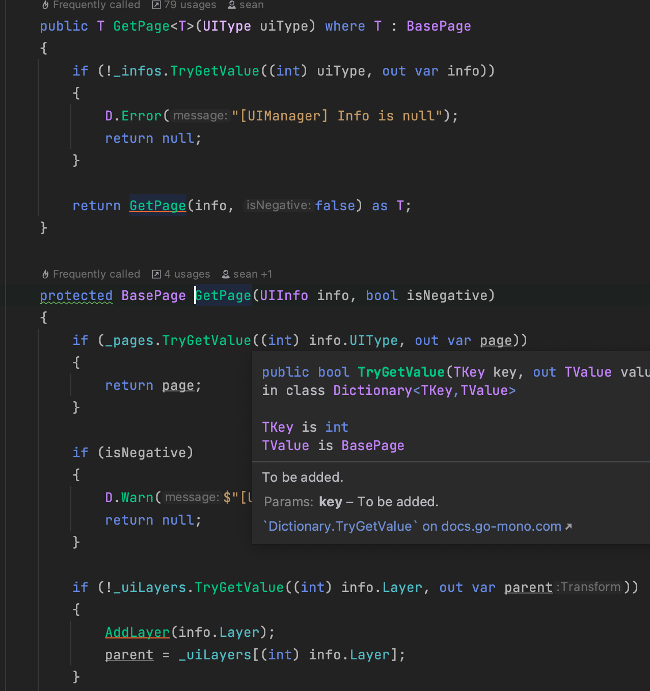
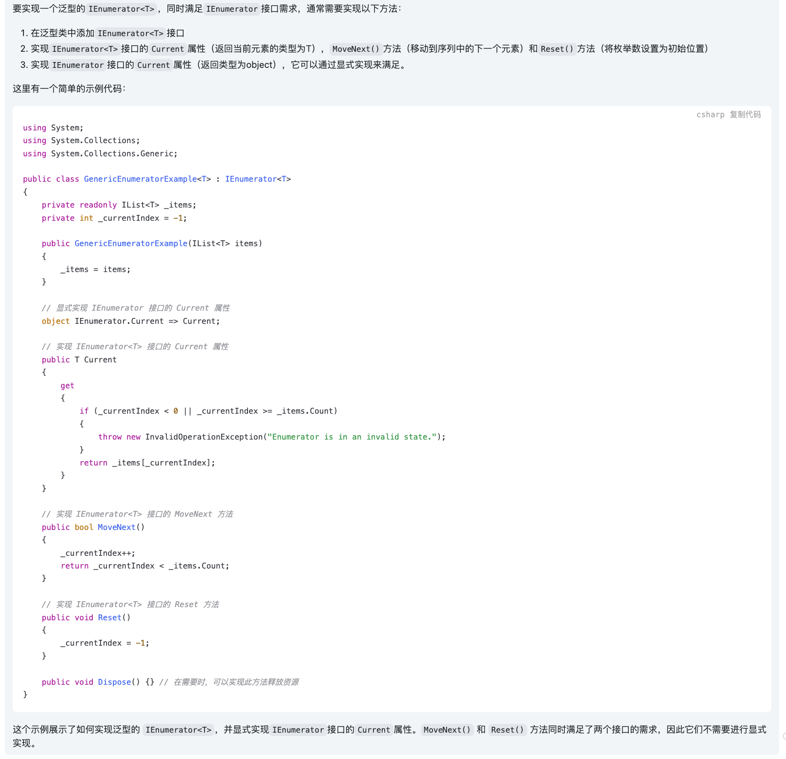

# IEnumerator更广阔的天地

编写的几乎所有程序都需要循环访问集合，因此需要编写代码来检查集合中的每一项。

迭代器可以读取集合中的数据，但是不能从底层修改集合，因为迭代器的实现方法中只实现了Get方法，所以不能对集合中的数据进行修改

语法糖：计算机中添加某种语法，这种语法对语言功能没有影响，但是更方便程序员使用，语法糖让代码更加简洁，有更高的可读性


# 基本概念

协程（Coroutine）：协同程序，在主程序运行的同时，开启另外一段逻辑处理，来协同当前程序的执行。Unity的协程系统是基于C#的一个简单而强大的接口——迭代器（IEnumerator），协程并不是多线程的，只是运行的结果很像多线程而已。它们最大的区别就是多线程可以多核并发，但是协程只能是单核按帧顺序轮转，线程可以使用多个CPU，协程不能，所以线程是真的并行。协程是在Unity主线程中运行的，每一帧中处理一次，而并不与主线程并行。这就意味着在协程之间不存在着所谓的线程间的同步和互斥问题，访问同一个值也都是安全的，不会出现死锁。

# 协程的用法：

## 开启协程：

开启协程的两种方式：

- `StartCoroutine(string methodName)`。参数是方法名（字符串类型）；此方法可以包含一个参数，形参方法可以有返回值
- `StartCoroutine(IEnumerator method)`。参数是方法名(TestMethod())，方法中可以包含多个参数；IEnumerator类型的方法不能含有ref或者out类型的参数，但是可以含有被传递的引用；必须要有返回值，并且返回值的类型为IEnumerator，返回值使用`yield return expression`或者`yield return value`，或者`yield break`语句。

## 终止协程

终止协程的两种方式

- `StopCoroutine(string methodName)`，只能终止制定的协程，在程序中调用StopCoroutine()方法只能终止以字符串形式启动的协程。
- `StopAllCoroutine()`，终止所有协程

挂起

- `yield`：挂起，程序遇到`yield`关键字的时候会被挂起，暂停执行，等待条件满足的时候从当前位置继续执行
- `yield return 0` or `yield return null`：程序在下一帧中从当前位置继续执行
- `yield return 1,2,3...`：等待程序1，2，3...帧之后从当前位置继续执行
- `yield return new WaitForSeconds(n)`:程序等待n秒之后从当前位置继续执行
- `yield new WaitForEndOfFrame()`：在所有的渲染以及GUI程序执行完成后从当前位置继续执行
- `yield new WaitForFixedUpdate()`：所有脚本中FixedUpdate()函数都被执行后从当前位置继续执行
- `yield return WWW`：等待一个协程执行完成后从当前位置继续执行
- `yield return SatrtCoroutine()`：等待一个协程执行完成后从当前位置继续执行
- `yield break`：将会导致协程的执行条件不被满足，不会从当前的位置继续执行程序，而是直接从当前位置跳出函数体回到函数的根部

# 协程的执行原理

协程函数的返回值是IEnumerator，它是一个迭代器，可以把它当成执行一个序列的某个节点的指针，它提供了两个重要的接口，分别是`Current`(返回指向当前的元素)和`MoveNext`（将指针向后移动一个单位，如果移动成功，则返回`true`）

yield关键字用来声明序列中的下一个值或者是一个无意义的值，如果用`yield return x`（x指的是一个具体的对象或者数值）的话，那么MoveNext返回为true并且Current被赋值为x，如果使用`yield break`使得`MoveNext`返回为`false`

如果`MoveNext`函数返回为`true`就意味着协程的执行条件被满足，则能够从当前位置继续往下执行，否则不能从当前位置继续往下执行。

# 理解协程的本质

我们都说协程的本质是迭代器，我在之前的博客中也对迭代器(IEnumerator)有过详细的介绍了，但是我还是没有办法把协程和迭代器联系起来，我认为问题出在了我对yield和foreach的理解上了，下面我将先试图理解foreach内部的工作原理

## 集合类的关键要素

根据定义，Microsoft .NET Framework集合是至少可以实现`IEnumerable<T>`（或非泛型IEnumerable类型）的类，此接口至关重要，因为至少必须实现`IEnumerable<T>`的方法，才支持迭代集合。

foreach语法十分简单，开发者无需知道元素数量，避免编码过于复杂。不过，运行时`Runtime`不直接支持foreach语句。C#编译器会转换代码，接下来会对此部分进行介绍：

foreach和数组：下面展示了简单的foreach循环，用于迭代整数数组，然后将每个整数打印输出到控制台中：

```C#
int[] array = new int[] {1,2,3,4,5,6};
foreach(int item in array){
	Console.WriteLine(item);
}
```

在此代码中，C#编辑器为for循环创建了等同的`CIL`：

```C#
int[] tempArray;
int[] array = new int[]{1,2,3,4,5,6};
tempArray = array;
for(int counter = 0;(counter < tempArray.Length); counter++){
	int item = tempArray[counter];
	Console.WriteLine(item);
}
```

在这个例子中，请注意，foreach依赖对Length属性和索引运算符`[]`的支持。借助Length属性，C#编译器可以使用for语句迭代数组中的每个元素。

`foreach`和`IEnumerable<T>`集合：虽然前面的代码适用于长度固定且始终支持索引运算符的数组，但并不是所有类型集合的元素数量都是已知的。此外，许多集合类（包括`Stack<T>`、`Queue<T>`和`Dictionary<TKey and TValue>`）都不支持按索引检索元素。因此，需要使用一种更为通用的方法来迭代元素集合。迭代器模式就派上用场了（迭代器模式在[这篇博客](http://soincredible777.com.cn/posts/279644bd/)中有介绍）。假设可以确定第一个、第二个和最后一个元素，那么就没有必要知道元素的数量，也就没有必要支持按索引检索元素。

`System.Collections.Generic.IEnumerator<T>`和非泛型`System.Collections.IEnumerator`接口旨在启用迭代器模式（而不是前面介绍的长度索引模式）来迭代元素集合。它们的关系类图如下：

.png)

`IEnumerator<T>`派生自IEnumerator包含三个成员。第一个成员是布尔型MoveNext。使用则中方法，可以在集合中从一个元素移动到下一个元素，同时检测是否已经枚举完所有项。第二个成员是只读属性Current，用于返回当前处理的元素。`Current在IEnumerator<T>`中进行重载，提供按类型分类的实现代码。借助集合类中的这两个成员，只需要使用while循环，即可迭代集合：

```C#
System.Collections.Generic.Stack<int> stack = new System.Collections.Generic.Stack<int>();
int number;
while(stack.MoveNext()){
  number = stack.Current;
  Console.WriteLine(number);
}
```

在此代码中，当移到集合的末尾时，MoveNext方法返回false。这样一来，便无需在循环的同时计算元素的数量。

（Reset方法通常会抛出NotImplementedException，因此不得进行调用，如果需要重新开始进行枚举，只需要新建一个枚举器就可以了。）

前面的示例展示的是C#编译器输出要点，但实际上并非按此方式进行编译，因为其中略去了两个重要的实现细节：交错和错误处理。

状态为共享：前面示例中展示的实现代码存在一个问题，即如果两个此类循环彼此交错（一个foreach在另外一个循环内，两个循环使用相同的集合），集合必须始终有当前元素的状态指示符，以便在调用MoveNext的时候，可以确定下一个元素。在这种情况下，交错的一个循环可能会影响另一个循环。（对于多个线程执行的循环也是如此）。

通过代码理解上面说的这个情况：

```C#
// stack是我们要遍历的集合，如果我们直接支持IEnumerator<T>这个接口，那我们所做的所有操作将会直接影响集合的状态
// 换个角度理解，任何要遍历这个集合的地方都是用到了同一个枚举器，所以在嵌套循环中（如下代码）一个枚举会影响到别的枚举
System.Collections.Generic.Stack<int> stack = new System.Collections.Generic.Stack<int>();
int number;
while(stack.MoveNext()){
  while(stack.MoveNext){
    number = stack.Current;
    Console.WriteLine(number);
  }
  number = stack.Current;
  Console.WriteLine(number);
}
```

为了解决这个问题，集合类不直接支持`IEnumerator<T>`和IEnumerator接口。而是直接支持另一种接口`IEnumerable<T>`，其唯一的方法是`GetEnumerator`。此方法用于返回支持`IEnumerator<T>`的对象。不必使用始终指示状态的集合类，而是可以使用另一种类，通常为嵌套类，这样便有权访问集合内部，从而支持`IEnumerator<T>`接口，并且始终指示迭代循环的状态。枚举器就像是序列中的“游标”或者“书签”。可以有多个“书签”，移动其中任何一个都可以枚举集合，与其他枚举互不影响。使用此模式就相当于有多个独立工作的枚举器在遍历这个集合，因此互不影响了，foreach循环的C#等同代码如下：

```C#
System.Collections.Generic.Stack<int> stack = new System.Collections.Generic.Stack<int>();
int number;
Syste,.Collections/Generic.Stack<int>/Enumerator enumerator;
enumerator = stack.GetEnumerator();

while(enumerator.MoveNext()){
  number = enumerator.Current;
  Console.WriteLine(number);
}
```

迭代后清除状态：由于实现`IEnumerator<T>`接口的类始终指示状态，因此有时需要在退出循环后清除状态（因为要么所有迭代均已完成，要么抛出异常）。为此，从IDisposable派生`IEnumerator<T>`接口。实现IEnumerator的枚举器不一定实现IDisposable，如果实现了，同样也会调用Dispose。这样可以在退出foreach循环后调用Dispose。因此，最终CIL的C#等同如下代码：

```C#
System.Collections.Generic.Stack<int> stack = new System.Collections.Generic.Stack<int>();
System.Collections.Generic.Stack<int>.Enumerator enumerator;
IDisposable disposable;
enumerator = stack.GetRnumerator();
try{
  int numeber;
  while(enumerator.MoveNext()){
    number = enumerator.Current;
    Console.WriteLine(number);
  }
}
finally{
  disposable = (IDisposable)enumerator;
  disposable.Dispose();
}
```

注意，由于`IEnumerator<T>`支持IDisposable接口，因此using语句可以将上面的代码简化为下面的代码：

```C#
System.Collections.Generic.Stack<int> stack = new System.Collections.Generic.Stack<int>();
int number;
using(System.Collections.Generic.Stack<int>.Enumerator enumerator = stack.GetEnumerator()){
  while(enumerator.MoveNext()){
    number = enumerator.Current;
    Console.WriteLine(number);
  }
}
```

然而，重新调用CIL并不直接支持using关键字。因此，未简化的代码实际上使用C#更精确表示的foreach CIL代码。

在*不实现* IEnumerable 的情况下使用 foreach： C# 不要求必须实现 `IEnumerable/IEnumerable<T>` 才能使用 foreach 迭代数据类型。编译器改用鸭子类型这一概念；它使用 Current 属性和 MoveNext 方法查找可返回类型的 GetEnumerator 方法。鸭子类型涉及按名称搜索，而不依赖接口或显式方法调用。（“鸭子类型”一词源自将像鸭子一样的鸟视为鸭子的怪诞想法，对象必须仅实现 Quack 方法，无需实现 IDuck 接口。） 如果鸭子类型找不到实现的合适可枚举模式，编译器便会检查集合是否实现接口。

到此为止我们算是理解了`foreach`的基本原理了，我们知道，foreach是不支持对我们遍历的元素进行修改的，我们下面尝试一下使用foreach的思想去自己实现一下对集合的遍历。

看一下下面这段代码，里面综合了比较多的知识点，多态、继承、泛型、Struct，还有我们的迭代器模式：

```C#
using System.Collections;

public struct ActivityData
{
    private string _activityName;
    private string _activityStartDate;
    private string _activityEndDate;

    public string ActivityName
    {
        get { return _activityName; }
        set { _activityName = value; }
    }

    public string ActivityStartDate
    {
        get { return _activityStartDate; }
        set { _activityStartDate = value; }
    }

    public string ActivityEndDate
    {
        get { return _activityEndDate; }
        set { _activityEndDate = value; }
    }

    public ActivityData(string activityName, string activityStartDate, string activityEndDate)
    {
        // ActivityName = activityName;
        // ActivityStartDate = activityStartDate;
        // ActivityEndDate = activityEndDate;
        _activityStartDate = activityStartDate;
        _activityEndDate = activityEndDate;
        _activityName = activityName;
    }
}

public class ConcreteEnumerator<T> : IEnumerator<T>
{
    private T[] _collection;
    private int _index;

    public ConcreteEnumerator(T[] collection)
    {
        _collection = collection;
        _index = -1;
    }

    public bool MoveNext()
    {
        _index++;
        if (_index < _collection.Length)
        {
            return true;
        }

        return false;
    }

    object IEnumerator.Current { get; } = new();

    public T Current
    {
        get => _collection[_index];
        set => _collection[_index] = value;
    }

    public void Dispose()
    {
    }

    public void Reset()
    {
        _index = 0;
    }
}

public class ConcreteCollection<T> : IEnumerable<T>
{
    private T[] _collection;

    public ConcreteCollection(T[] collection)
    {
        _collection = collection;
    }


    public IEnumerator<T> GetEnumerator()
    {
        return new ConcreteEnumerator<T>(_collection);
    }

    IEnumerator IEnumerable.GetEnumerator()
    {
        return GetEnumerator();
    }
}


public class Program
{
    public static void Main(string[] args)
    {
        int[] a = { 1, 3, 5 };

        ConcreteCollection<int> cc = new ConcreteCollection<int>(a);

        // ConcreteEnumerator<int> ce = cc.GetEnumerator<int>();

        ConcreteEnumerator<int>? ce = cc.GetEnumerator() as ConcreteEnumerator<int>;
        while (ce != null && ce.MoveNext())
        {
            Console.WriteLine(ce.Current);
            ce.Current++;
            Console.WriteLine("修改后的集合的值为：" + ce.Current);
            Console.WriteLine();
        }

        Console.WriteLine();

        ActivityData[] data =
        {
            new ActivityData("Unicorn", "2023-05-21", "2023-05-23"),
            new ActivityData("Flower", "2023-05-22", "2023-05-25")
        };

        ConcreteCollection<ActivityData> activityDataCollection = new ConcreteCollection<ActivityData>(data);
        using (ConcreteEnumerator<ActivityData>? activityDataEnumerator =
               activityDataCollection.GetEnumerator() as ConcreteEnumerator<ActivityData>)
        {
            while (activityDataEnumerator != null && activityDataEnumerator.MoveNext())
            {
                Console.WriteLine("当前活动名：" + activityDataEnumerator.Current.ActivityName);
                Console.WriteLine("当前活动开始日期：" + activityDataEnumerator.Current.ActivityStartDate);
                Console.WriteLine("当前活动结束日期：" + activityDataEnumerator.Current.ActivityEndDate);
                Console.WriteLine();
            }
        }

        Console.ReadKey();
    }
}
```

- 我们上面的代码是按照foreach的思想去遍历我们所有的元素的，但是我们实现了在遍历的过程中更改元素的内容，foreach之所以不能修改元素的值，是因为在foreach的实现中并没有暴露Current属性的set方法，因此我们没有办法在foreach遍历的时候更改集合的值。



下面放几张我和ChatGPT的截图，真的牛逼：




我们先来看两段代码：

```C#
public static IEnumerable<int> Fibonacci(int count)
{
    int prev1 = 0;
    int prev2 = 1;
    
    for (int i = 0; i < count; ++i)
    {
        int current = prev1 + prev2;
        yield return current; // 使用yield return返回当前值
        
        prev1 = prev2;
        prev2 = current;
    }
}
```


我们在Unity中执行如下的代码：

```C#
using System.Collections;
using System.Collections.Generic;
using UnityEngine;

public class TestCoroutine : MonoBehaviour
{
    // Start is called before the first frame update
    void Start()
    {
    }

    // Update is called once per frame
    void Update()
    {
        Debug.Log("我是Update中的方法1");
        StartCoroutine(Test());
        Debug.Log("我是Update中的方法2");
    }

    IEnumerator Test()
    {
        Debug.Log("第一次执行方法");
        yield return 0;
        Debug.Log("第二次执行方法");
        yield return 0;
        Debug.Log("第三次执行方法");
        yield return 0;
    }
}
```

我们可以看到控制台的输出结果是：

```
我是Update中的方法1
第一次执行方法
我是Update中的方法2

我是Update中的方法1
第一次执行方法
我是Update中的方法2
第二次执行方法

我是Update中的方法1
第一次执行方法
我是Update中的方法2
第二次执行方法
第三次执行方法
```

我们看第三次Update中代码执行的顺序我们可以得知：第二次Update中的Coroutine比第一次中的Coroutine先执行了，而且是在这一次Update结束了之后才调用的协程，就是在后面的Coroutine要先于前面的协程执行。

# IEnumerable和IEnumerator

`IEnumerable`和`IEnumerator`本质是两个接口，二者的源码如下：

```C#
// Decompiled with JetBrains decompiler
// Type: System.Collections.IEnumerator
// Assembly: netstandard, Version=2.1.0.0, Culture=neutral, PublicKeyToken=cc7b13ffcd2ddd51
// MVID: 5A41D6B7-1898-42EC-A409-FD0B1C3E3DCF
// Assembly location: /Applications/2021.3.14f1/Unity.app/Contents/NetStandard/ref/2.1.0/netstandard.dll

namespace System.Collections
{
  /// <summary><para>Supports a simple iteration over a non-generic collection.</para></summary>
  public interface IEnumerator
  {
    /// <summary><para>Gets the current element in the collection.</para></summary>
    object Current { get; }

    /// <summary><para>Advances the enumerator to the next element of the collection.</para></summary>
    bool MoveNext();

    /// <summary><para>Sets the enumerator to its initial position, which is before the first element in the collection.</para></summary>
    void Reset();
  }
}

```

```C#
// Decompiled with JetBrains decompiler
// Type: System.Collections.IEnumerable
// Assembly: netstandard, Version=2.1.0.0, Culture=neutral, PublicKeyToken=cc7b13ffcd2ddd51
// MVID: 5A41D6B7-1898-42EC-A409-FD0B1C3E3DCF
// Assembly location: /Applications/2021.3.14f1/Unity.app/Contents/NetStandard/ref/2.1.0/netstandard.dll

namespace System.Collections
{
  /// <summary><para>Exposes an enumerator, which supports a simple iteration over a non-generic collection.</para></summary>
  public interface IEnumerable
  {
    /// <summary><para>Returns an enumerator that iterates through a collection.</para></summary>
    IEnumerator GetEnumerator();
  }
}
```

二者的区别与联系：

一个集合可查询（使用foreach，where，any等），必须以某种方式返回IEnumerator object，也就是必须实现IEnumerable接口

IEnumerator object具体实现了iterator（通过MoveNext(),Reset(),Current）。

从这两个接口的选词上，可以看出IEnumerable是一个声明式的接口，声明实现该接口的class是“可枚举的”

IEnumerable和IEnumerator通过IEnumerable的GetEnumerator()方法建立了连接。

看一个例子：

```C#
using System.Collections;

namespace learnIEnumerator
{
    public class Person
    {
        public string Name { set; get; }

        public Person(string name)
        {
            Name = name;
        }

        public void ShowName()
        {
            Console.WriteLine(Name);
        }
    }

    public class PeopleEnum : IEnumerator
    {
        public Person[] _person;
        int position = -1;

        public PeopleEnum(Person[] person)
        {
            _person = person;
        }


        public bool MoveNext()
        {
            position++;
            return (position < _person.Length);
        }

        public void Reset()
        {
            position = -1;
        }

        public object Current
        {
            get
            {
                try
                {
                    return _person[position];
                }
                catch (Exception e)
                {
                    Console.WriteLine(e);
                    throw new InvalidOperationException();
                }
            }
        }
    }


    public class PersonSet : IEnumerable
    {
        private Person[] people;

        public PersonSet(Person[] pArray)
        {
            people = new Person[pArray.Length];
            for (int i = 0; i < pArray.Length; i++)
            {
                people[i] = pArray[i];
            }
        }

        public IEnumerator GetEnumerator()
        {
            // 调用了构造函数吧？
            // 类的声明其实就是调用构造函数的过程
            return new PeopleEnum(people);
        }
    }


    // 我现在疑惑的点就在于，必须要在Person类的基础上再套一个People List的类么？
    // 拿最简单的int和 int[]
    // int 相当于 Person 代表每一个Person的实例，它停留在个体这个层面
    // int[] 相当于 People 它里面是要实现集合以外，而且继承IEnumerable接口，说明它是可以枚举的，它是集合这个层面的
    // 然后我们还需要去自定义一个迭代器，来实现对于People的枚举

    // 再抽象一下
    // 我们要实现枚举我们自定义的数据结构，我们需要实现三个类
    // 1.数据结构的定义，也就是每个个体它有哪些属性
    // 2.包含1中数据结构的集合，除此之外该集合继承IEnumerable接口，调用GetEnumerator方法
    // 3。实现GetEnumerator方法

    class Program
    {
        static void Main(string[] args)
        {
            Person[] person = new Person[4]
            {
                new Person("李磊"),
                new Person("王刚"),
                new Person("彤彤"),
                new Person("丹丹"),
            };

            PersonSet listPeople = new PersonSet(person);
            foreach (Person p in listPeople)
            {
                Console.WriteLine(p.Name);
            }
        }
    }
}
```

如果我们要实现枚举我们自己定义的数据结构的功能，我们总共要实现三个类：

1. 我们自己定义的数据结构的类，也就是我们要枚举的每一个元素的类
2. 包含我们自定义数据结构的类的类，也就是集合，这个类要继承IEnumerable接口，重写GetEnumerator函数
3. 枚举我们定定义数据结构的类，也就是枚举器，继承IEnumerator接口，重写MoveNext方法、Reset方法和Current

其中最困扰我的是第二个类，或者说foreach的用法，我们在调用GetEnumerator方法的时候会向其中传入我们要枚举的自定义数据结构的数组，通过return语句新建的PeopleEnum类中传的people参数是关键，它告诉了枚举器我们要枚举什么类型的数据，以及枚举的数据有哪些。

```c#
public class PersonSet : IEnumerable
    {
  			// people就是我们要枚举的集合
        private Person[] people;

        public PersonSet(Person[] pArray)
        {
            people = new Person[pArray.Length];
            for (int i = 0; i < pArray.Length; i++)
            {
                people[i] = pArray[i];
            }
        }

        public IEnumerator GetEnumerator()
        {
            // 调用了构造函数吧？
            // 类的声明其实就是调用构造函数的过程
          
          	// 这一行代码十分关键，它把枚举器和我们要枚举的集合联系到一起了
          	// 这行代码告诉我们的枚举器类我们要枚举的数据是什么、有哪些
            return new PeopleEnum(people);
        }
    }
```

# yield关键字

yield关键字是一个语法糖，背后其实生成了一个新的类，是一个枚举器，枚举器具体实现了MoveNext、Reset和Current。

先看一段代码，通过`yield return`实现了类似用foreach便遍历数组的功能，说明yield return也是用来实现迭代器的功能的

```C#
using static System.Console;
using System.Collections.Generic;

class Program
{
    //一个返回类型为IEnumerable<int>，其中包含三个yield return
    public static IEnumerable<int> enumerableFuc()
    {
        yield return 1;
        yield return 2;
        yield return 3;
    }

    static void Main(string[] args)
    {
        //通过foreach循环迭代此函数
        foreach (int item in enumerableFuc())
        {
            WriteLine(item);
        }

        ReadKey();
    }
}
```

上面代码的输出结果将会是：`1 2 3`。

如果我在代码中加入`yield break`：

```C#
yield return 1;
yield return 2;
yield break;
yield return 3;
```

那么结果就只会输出1和2，说明这个迭代器被yield break给停掉了，所以yield break是用来终止迭代的。

我们现在把上面遍历人名的那个程序改写成`yield`的形式看一下：

```C#
namespace learnIEnumerator
{
    public class Person
    {
        public string Name { set; get; }

        public Person(string name)
        {
            Name = name;
        }

        public void ShowName()
        {
            Console.WriteLine(Name);
        }
    }

    public class PersonSet
    {
        private Person[] people;

        public PersonSet(Person[] pArray)
        {
            people = new Person[pArray.Length];
            for (int i = 0; i < pArray.Length; i++)
            {
                people[i] = pArray[i];
            }
        }

        public IEnumerable<Str4ing> PersonEnum()
        {
            for (int i = 0; i < people.Length; i++)
            {
                yield return people[i].Name;
            }
        }

        class Program
        {
            static void Main(string[] args)
            {
                Person[] person = new Person[4]
                {
                    new Person("李磊"),ty
                    new Person("王刚"),
                    new Person("彤彤"),
                    new Person("丹丹"),
                };

                PersonSet listPerson = new PersonSet(person);
                IEnumerator<String> enumerator = listPerson.PersonEnum().GetEnumerator();
                while (enumerator.MoveNext())
                {
                    String current = enumerator.Current;
                    Console.WriteLine(current);
                }
            }
        }
    }
}
```

再来看一段代码：

```C#
public static IEnumerable<int> Fibonacci(int count)
{
    int prev1 = 0;
    int prev2 = 1;
    
    for (int i = 0; i < count; ++i)
    {
        int current = prev1 + prev2;
        yield return current; // 使用yield return返回当前值
        
        prev1 = prev2;
        prev2 = current;
    }
}
```

在这段代码中我们使用了for循环嵌套了一个`yield return` 语句，我在这里时常会有一个误区就是，我会习惯性地认为for循环是用来实现`MoveNext`的方法的，但其实不是，因为看这段代码

```C#
    public static IEnumerable<int> enumerableFuc()
    {
        yield return 1;
        yield return 2;
        yield return 3;
    }
```

它里面没有for循环但是依然可以实现`MoveNext`的功能啊😂，所以无论是使用for循环还是把所有元素罗列出来，这个环节的目的都是为了告诉yield return自动生成的那个迭代器它要遍历的这个集合中有多少个元素，仅此而已，`MoveNext`会被编译器隐式地处理，完全不需要我们操心。

还有一点，我们一个IEnumerable方法中只会生成一个迭代器，理解一下这句话，还是蛮重要的，回顾一下迭代器模式中的四个角色，有一个叫做具体聚合角色，有一个叫做具体迭代器角色，具体迭代器迭代的就是具体聚合角色 （集合），集合本质就是一类事物的组合，因此我们只需要使用一个迭代器就可以完成对这一个集合的全部遍历了，我之前存在的一个误区是我认为每调用一次yield语句就会生成一个迭代器。

最后再来看看使用了yield语句后我们可以少写哪些代码，我们首先不需要自己编写具体的迭代器类了，相对应的抽象迭代器类也不需要了，我们现在只需要在具体聚合类中定义一下获取迭代器的方法就可以了。所以真的好省事啊！

一般我们会在协程中处理各种各样的业务嘛，比如下图：


可以看到里面yield return的东西五花八门，但是牢记我们上面讲到的，遍历一个具体聚合角色只会有一个迭代器，来看看ChatGPT怎么说：


我们现在理解一下StartCoroutine方法，该方法里面会传入一个IEnumerator类型的方法，所以我们类比一下调用StartCoroutine方法就相当于是使用了foreach，看一下伪代码：

```C#
public class YieldExample
{
    public static IEnumerable<int> GetValues(int count)
    {

       for (int i = 1; i <= count; i++)
        {
            yield return i;
        }

    }
}
class Program
{
    static void Main(string[] args)
    {
        // 调用静态方法GetValues，获取迭代器
        IEnumerable<int> valuesEnumerable = YieldExample.GetValues(5);

        Console.WriteLine("Type of the GetEnumerator instance: " + valuesEnumerable.GetType().FullName);

        // 使用foreach循环遍历迭代器
        foreach (int value in valuesEnumerable)
        {
            Console.WriteLine(value);
        }
    }
}
```

当我们调用了StartCoroutine方法后类似于调用了foreach循环，会不断遍历整个集合，但是在Unity的StartCoroutine方法中它所遍历的集合是执行时机的集合，因为在Unity的协程中我们一般yield return的都是一些协程再执行的时机，而且仔细想想协程的运作方式跟纯C#还不一样，在纯C#中我们需要用yield return返回我们要遍历的集合的元素，比如上面这段代码

而协程的代码：

```C#
FlyPfxManager.Create();
ActivityManager.Create();
yield return null;
PlayDefine.Init();
PlayViewDefine.Init(1.5f);
yield return null;
CmdManager.Create();
yield return null;
DataManager.Create();
yield return null;
AuthManager.Create();
```

我们的目的是在一段时间内执行很多种方法，yield return返回的元素不是我们想要的东西，它是我们达到异步的手段，我认为这是协程和纯C#中IEnumerator的区别

总之就是使用StartCoroutine和foreach都能达到遍历一个具体聚合角色的所有元素的作用，但是它们遍历这个集合元素的目的是不同的，StartCoroutine遍历集合是为了实现时间间隔，而纯C#的foreach遍历集合是为了展示或者读取到（只读）集合中所有元素的信息。

那我想协程到此应该就理解了，比如我们定义了一个`IEnumerator Func()`，那么我们会使用`StartCoroutine(Func());`，因此，`Func()`就是一个具体聚合角色（一个集合）而StartCoroutine就是一个迭代器，它去遍历整个`Func()`集合，所以说协程的本质是迭代器好像没什么问题。

关于`IEnumerator`、`IEnumerable`和`yield`的探讨就先告一段落了。

# 小结

今天是项目的验收环节，工作比较少，所以花了一天的时间写完了这篇博客，本篇博客从IEnumerator和IEnumerable出发，引出了类和接口的辨析、C#中的修饰符、虚函数和抽象函数的区别辨析等等很多零碎的知识点，真的是收获满满。

