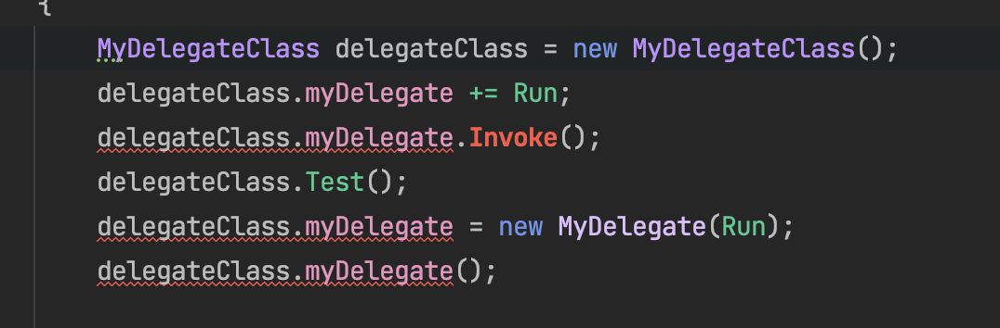
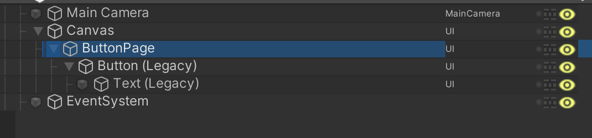
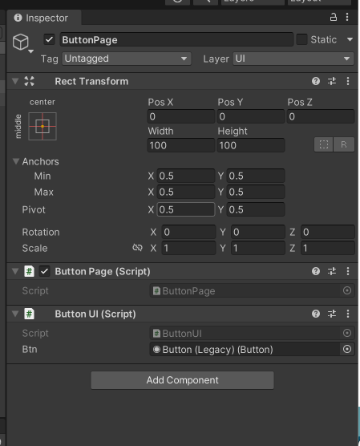

# 委托

一篇很好的博客https://www.cnblogs.com/skysoot/archive/2012/04/05/2433639.html

C#中的委托类似于C或C++中的函数指针。委托是存有对某个方法的引用的一种引用类型变量，引用可在运行时被改变。

委托特别用于实现事件和回调方法。所有的委托都派生自`System.Delegate`类。

## 从实际问题出发来理解委托

### 将方法作为方法的参数

这个标题非常地拗口，但我们先不管它，来看两个方法：

```C#
public void GreetPeople(string name){
	EnglishGreeting(name);
}
public void EnglishGreeting(string name){
  Console.WriteLine("Good Moring," + name);
}
```

先不管这两个方法有没有实际的意义，我们现在想通过这两个方法来向某人问好，当传入某人的姓名时，比如说"Joe"进去的时候，在这个方法中将调用EnglishGreeting方法，再次传递name参数，EnglishGreeting方法则用于向屏幕输出"Good Moring, Joe"。

那么现在，假设这个程序要进行全球化了，我作为一个中国人，我不理解"Good Moring"是什么意思，那我就只能再加一个中文的问候方法：

```C#
public void ChineseGreeting(string name){
	Console.WriteLine("早上好，"+name);
}
```

这时候GreetPeople也需要改一下了，不然如何判断到底用哪个版本的Greeting问候方法合适呢？当然在进行这个之前，我们最好再定义一个枚举作为判断的依据：

```C#
public enum Language{
	English, Chinese
}
public void GreetPeople(string name, Language lang){
	switch(lang){
		case Language.English:
			EnglishGreeting(name);
			break;
    case Language.Chinese:
    	ChineseGreeting(name);
    	break;	
	}
}
```

OK，尽管这样解决了问题，但是这个方法的可扩展性太差了，如果之后我们还要再添加韩文版、日文版，我们就不得不反复修改枚举和GreetPeople的方法，来适应新的需求。

那么在考虑新的解决方案之前，我们先来看看GreetPeople的方法签名：

```C#
public void GreetPeople(string name, Language lang);
```

我们只看`string name`，在这里，string是参数类型，name是参数变量，当我们赋给name字符串"Joe"时，他就代表了"Joe"这个值；当我们赋给他"周杰伦"时，它又代表着"周杰伦"这个值。然后，我们可以在这个方法体内对这个name进行其他的操作。

那我们再仔细想一想，假如GreetPeople方法可以接受一个参数变量，这个变量可以代表另一个方法，当我们给这个变量赋值EnglishGreeting的时候它代表着EnglishGreeting()这个方法；当我们给它赋值ChineseGreeting的时候，它又代表着ChineseGreeting()的方法，我们将这个参数变量命名为MakeGreeting，那么不是可以如同给name赋值的时候一样，在调用Greet People()方法的时候，给这个MakeGreeting参数也附上值么，然后我们在方法体内，也可以像使用别的参数一样使用MakeGreeting。但是，由于MakeGreeting代表着一个方法，它的使用方式应该和它被赋的方法是一样的，比如`MakeGreeting(name)`；

好了，有了思路了，我们现在就来改改GreetPeople()方法，那么它应该是这个样子：

```C#
public void GreetPeople(string name, *** MakeGreeting){
	MakeGreeting(name);
}
```

注意到 ***，这个位置通常放置的应该是参数的类型，但是到目前为止，我们仅仅想到的是应该有一个方法，并且按照这个思路去改写GreetPeople方法，现在就出现了一个大问题：这个代表着方法的MakeGreeting参数应该是什么类型的？

**说明：**这里已经不再需要枚举了，因为在给MakeGreeting赋值的时候动态地决定使用哪个方法，是ChineseGreeting还是EnglishGreeting，而在这两个方法内部，已经对使用GroodMoring还是早上好做了区分。

下面就该委托出场了：

我们MakeGreeting代表的两个方法的签名如下：

```C#
public void EnglishGreeting(string name);
public void chineseGreeting(string name);
```

如同`name`可以接受string类型的数据一样，MakeGreeting它也代表着接受相同的一类数据，再进一步讲，就是MakeGreeting代表了参数类型和返回类型都相同的一类方法。本例中委托的定义如下：

```C#
public delegate void GreetingDelegate(string name);
```

与上面EnglishGreeting()方法的签名对比一下，出了加入delegate关键字以外，其他的部分都是完全一样的，那么再次调用GreetPeople方法，如下所示：

```C#
public delegate void Greetingdelegate(string name);
public void GreetPeople(string name, Greetingdelegate MakeGreeting){
	MakeGreeting(name);
}
```

委托Greeting Delegat出现的位置和string相同，string是一个类型，Greeting Delegate也是一个类型，或者说是一个类。但是委托的声明方式和类完全不同。实际上，委托在编译的时候确实会被编译成类。因为Delegate是一个类，所以在任何可以声明类的地方都可以声明委托。下面是一个完整的代码。

```C#
public delegate void GreetingDelegate(string name);
 
class Program
{
    private static void EnglishGreeting(string name)
    {
        Console.WriteLine("Good Morning, " + name);
    }
 
    private static void ChineseGreeting(string name)
    {
        Console.WriteLine("早上好, " + name);
    }
 
    private static void GreetPeople(string name, GreetingDelegate MakeGreeting)
    {
        MakeGreeting(name);
    }
 
    static void Main(string[] args)
    {
        GreetPeople("Joe", EnglishGreeting);
        GreetPeople("周杰伦", ChineseGreeting);
        Console.ReadLine();
    }
}
```

结合游戏开发中的实际应用，我们经常讲委托和单例模式、观察者模式等设计模式结合在一起使用，下面我将尝试抽象出一个事件中心的类，它专门负责处理各种委托事件，由于在一个游戏进程中只会有一个**事件处理中心**，所以我要将它设计成[单例模式](http://soincredible777.com.cn/posts/279644bd/)。

**我们现在对委托做一个总结：委托是一个类，它定义了方法的类型，使得可以将方法作为另一个方法的参数来进行传递，这种将方法动态地赋给参数的做法，可以避免在程序中大量地使用if-else(switch)语句，同时使得程序具有更好的可扩展性。**

## 声明委托

委托声明决定了可由该委托引用的方法。委托可指向一个与其具有相同标签的方法。

假设有一个委托：

```C#
public delegate int MyDelegate(string s);
```

上面的委托可被用于引用任何一个带有一个单一的string参数的方法，并返回一个int 类型的变量。

声明委托的语法如下：

```C#
delegate <return type><delegate-name><parameter list>
```

## 实例化委托

一旦声明了委托类型，委托对象就必须使用new关键字来创建，并且与一个特定的方法有关，当委托创建时，传递到new语句的参数就像方法调用一样书写，但是不带有参数：

```C#
public delegate void printString(string s);
pringString ps1 = new printString(WriteToScreen);
printString ps2 = new printString(WriteToFile);
```

下面的实例演示了委托的声明、实例化和使用，该委托可用于引用带有一个整形参数的方法，并返回一个整型值。

```C#
using System;
using System.Diagnostics;

delegate int NumberChanger(int n);

namespace DelegateAppl
{
    class TestDelegate
    {
        private static int num = 10;

        public static int AddNum(int p)
        {
            num += p;
            return num;
        }

        public static int MultNum(int q)
        {
            num *= q;
            return num;
        }

        public static int getNum()
        {
            return num;
        }

        static void Main(string[] args)
        {
            NumberChanger nc1 = new NumberChanger(AddNum);
            NumberChanger nc2 = new NumberChanger(MultNum);
            nc1(25);
            Console.WriteLine("Value of Num: {0}", getNum());
            nc2(5);
            Console.WriteLine("Value of Num: {0}", getNum());
            Console.ReadKey();
        }
    }
}
```

当上面代码被编译和执行的时候，它会产生如下结果：

```
Value of Num: 35
Value of Num: 175
```

**补充：**

1. 委托里面存储的方法可以是静态方法也可以是非静态的方法。
2. 当声明的委托包含返回值的时候，不能直接调用Invoke方法，否则只会得到最后一个方法的结果。
3. 定义委托与定义方法相比，一是没有方法体，而是多用了delegate修饰。

```C#
internal class Program
{
    public delegate int MyDelegate(int a, int b);

    public int Test1(int a, int b)
    {
        return a * b;
    }

    public int Test2(int a, int b)
    {
        return a + b;
    }

    static void Main(string[] args)
    {
        Program program = new Program();
        MyDelegate myDelegate = new MyDelegate(program.Test1);
        myDelegate += program.Test2;
      
      	// 将delegate存放到一个数组中才能依次获取每一个方法的返回值。
        Delegate[] delegates = myDelegate.GetInvocationList();
        foreach (MyDelegate item in delegates)
        {
            Console.WriteLine(item(1, 2));
        }

        Console.ReadKey();
    }
}
```

## 委托的多播(Multicasting of a Delegate)

委托对象可以使用"+"运算符进行合并。一个合并委托调用它所合并的两个委托。只有相同类型的委托可以被合并。"-"运算符可用于从合并的委托中移除组件委托。

使用委托的这个特点，我们可以创建一个委托被调用时要调用的方法的调用列表，这种行为被称为委托的多播(multicasting)，也叫组播。下面的程序演示了委托的多播：

```C#
using System;

delegate int NumberChanger(int n);

namespace DelegateAppl
{
    class testdelegate
    {
        private static int num = 10;

        public static int AddNum(int p)
        {
            num += p;
            return num;
        }

        public static int MultNum(int q)
        {
            num *= q;
            return num;
        }

        public static int getNum()
        {
            return num;
        }

        static void Main(string[] args)
        {
            NumberChanger nc;
            NumberChanger nc1 = new NumberChanger(AddNum);
            NumberChanger nc2 = new NumberChanger(MultNum);

            nc = nc1;
            nc += nc2;
            nc += AddNum;
            nc(5);
            Console.WriteLine("Value of Num: {0}", getNum());
            Console.ReadKey();
        }
    }
}
```

## 委托的用途

下面实际演示了委托的用法，委托`printString`可用于引用带有一个字符串作为输入的方法，并不返回任何东西。

我们使用这个委托来调用两个方法，第一个把字符串打印到控制台，第二个把字符串打印到文件：

```c#
using System;
using System.IO;

namespace DelegateAppl
{
    class PrintString
    {
        private static FileStream fs;
        private static StreamWriter sw;

        public delegate void printString(string s);

        public static void WriteToScreen(string str)
        {
            Console.WriteLine("The String is:{0}", str);
        }

        public static void WriteToFile(string s)
        {
            fs = new FileStream("./message.txt", FileMode.Append, FileAccess.Write);
            sw = new StreamWriter(fs);
            sw.WriteLine(s);
            sw.Flush();
            sw.Close();
            fs.Close();
        }

        public static void sendString(printString ps)
        {
            ps("Hello World");
        }

        static void Main(string[] args)
        {
            printString ps1 = new printString(WriteToScreen);
            printString ps2 = new printString(WriteToFile);
            sendString(ps1);
            sendString(ps2);
            Console.ReadKey();
        }
    }
}
```

# 事件

事件基本上说是一个用户的操作，比如按键、点击、鼠标移动等等，或者是一些提示信息，如系统生成的通知。应用程序需要在事件发生时响应事件，比如中断。

C#中使用事件机制实现线程间的通信。

事件是一个受限制的委托，先看如下代码：

```C#
delegate void MyDelegate();

internal class MyDelegateClass
{
    public MyDelegate? myDelegate;

    public void Test()
    {
        if (myDelegate != null)
        {
            myDelegate();
        }
    }
}

class Test
{
    static void Main(string[] args)
    {
        MyDelegateClass delegateClass = new MyDelegateClass();
        delegateClass.myDelegate += Run;
        delegateClass.myDelegate.Invoke();
        delegateClass.Test();
        delegateClass.myDelegate = new MyDelegate(Run);
        delegateClass.myDelegate();

        Console.ReadKey();
    }

    static void Run()
    {
        Console.WriteLine("Running.......");
    }
}
```

上面的代码运行时没有问题的，也就是说，我们在MyDelegateClass中声明的委托，既可以在当前类中执行，也可以在其他的类中执行，还可以在其他的类中重新赋值后再被调用执行。

接下来我们看看事件声明的情况：

```
delegate void MyDelegate();

internal class MyDelegateClass
{
    public event MyDelegate? myDelegate;

    public void Test()
    {
        if (myDelegate != null)
        {
            myDelegate();
        }
    }
}

class Test
{
    static void Main(string[] args)
    {
        MyDelegateClass delegateClass = new MyDelegateClass();
        delegateClass.myDelegate += Run;
        delegateClass.myDelegate.Invoke();
        delegateClass.Test();
        delegateClass.myDelegate = new MyDelegate(Run);
        delegateClass.myDelegate();

        Console.ReadKey();
    }

    static void Run()
    {
        Console.WriteLine("Running.......");
    }
}
```



这里我们看到声明事件其实就是在声明委托变量的条件下，只用了个`event`修饰而已，即`myDelegate`现在是一个事件变量，而不是一个委托变量了，我们发现它仍然能在当前类中被执行，但是在另外的一个类中，既不能被直接调用执行，也不能被重新赋值了，只能通过`+=`或者`-=`来增减函数，这就是事件存在的必要，因为事件的这两个限制条件，在某种程度上会更安全。

**疑问：**如果我在类中声明了一个委托，那么在实例化这个对象的时候，我并没有显式地给给这个委托赋值，~~为什么不会报错呢~~？但是如果我们在Main函数中实例化一个委托，不给他赋值的话，就会报错，为什么？

下面的代码给出了答案，上面说的两种情况都会报错的，但是在实例化对象的时候还需要手动地加一个判断条件，判断实例化的对象中的委托是不是空的。

```C#
delegate void MyDelegate();

internal class MyDelegateClass
{
    protected MyDelegate? myDelegate;
    public void RegitserDelegate(MyDelegate mmm)
    {
        myDelegate += mmm;
    }

    public void InvokeDelegate()
    {
        if (myDelegate == null)
        {
            Console.WriteLine("委托是空的！不能调用！");
        }
        else
        {
            myDelegate.Invoke();
        }
    }

    public static void Run()
    {
        Console.WriteLine("Running.......");
    }
}

class Func
{
    static void Main(string[] args)
    {
        MyDelegateClass delegateClass = new MyDelegateClass();
        delegateClass.InvokeDelegate();
        MyDelegate mm = new MyDelegate(MyDelegateClass.Run);
        delegateClass.RegitserDelegate(mm);
        delegateClass.InvokeDelegate();
        Console.ReadKey();
    }
}
```

上面的代码中用到了一些访问修饰符

- `public`: 公有访问，不受任何限制
- `private`: 私有访问，只限于本类成员访问，子类、实例都不能访问
- `protected`: 保护访问，只限于本类和子类访问，实例不能访问
- `internal`: 内部访问， 只限于本项目内访问，其他不能访问

**TIPS：**在计算机科学领域，`声明(Decalration)`指的是向编译器说明一个变量或者函数信息，包活：名字、类型、初始值等等，即声明变量、函数的属性细节；而`定义(Definition)`则指明变量、函数存储在哪里，当定义发生时，系统为变量或者函数分配内存单元。

## 通过事件使用委托

事件在类中声明且生成，且通过使用同一个类或者其他类中的委托与事件处理程序关联。包含事件的类用于发布事件，它被称为发布器(publisher)类。其他接受该事件的类被称为订阅器(subscriber)类。事件使用发布-订阅(publisher-subscriber)模型。

发布器(publisher)是一个包含事件和委托定义的对象。事件和委托之间的联系也定义在这个对象中。发布器类的对象调用这个事件，并通知其他的对象。

订阅器(subscriber)是一个接受事件并提供事件处理程序的对象。在发布器类中的委托调用订阅器类中。

## 声明事件(Event)

在类的内部声明事件，首先必须声明该事件的委托类型。如：

```C#
public delegate void BoilerLogHandler(string status);
```

然后，声明事件本身，使用event关键字：

```C#
public event BoilerLogHandler BoilerEventLog;
```

上面的代码定义了一个名为BoilerLogHandler的委托和一个名为BoilerEventLog的事件，该事件在生成的时候会调用委托。

## 实例

```C#
using System;

namespace SimpleEvent
{
    /******发布器类*******/
    public class EventTest
    {
        private int value;

        public delegate void NumManipulationHandler();

        public event NumManipulationHandler ChangeNum;

        protected virtual void OnNumChanged()
        {
            if (ChangeNum != null)
            {
                ChangeNum(); // 事件被触发
            }
            else
            {
                Console.WriteLine("Event not fire");
                Console.ReadKey();
            }
        }


        public EventTest()
        {
            int n = 5;
            SetValue(5);
        }

        public void SetValue(int n)
        {
            if (value != n)
            {
                value = n;
                OnNumChanged();
            }
        }
    }

    /********订阅器类********/
    public class subscribEvent
    {
        public void printf()
        {
            Console.WriteLine("event fire");
            Console.ReadKey();
        }
    }


    /********触发********/
    public class MainClass
    {
        public static void Main()
        {
            EventTest e = new EventTest(); // 实例化对象，第一次没有触发事件
            subscribEvent v = new subscribEvent();
            e.ChangeNum += new EventTest.NumManipulationHandler(v.printf); // 注册
            e.SetValue(7);
            e.SetValue(11);
        }
    }
}
```

## 小故事：

曾经.NET只有一个Delegate，别人想要使用委托的时候，必须使用delegate关键字来定义一个委托，但是这样有一个弊端，那就是delegate可以使用`=`将所有已经订阅的取消，也可以使用`+`和`-`对订阅进行合并和删除，只保留`=`之后的新的订阅，这就给了犯罪分子可乘之机。所以event应运而生，event是一种特殊的委托，它只能使用`+=`、`-=`，而不能直接使用`=`，也就是说，event在定义类（发布者）中是可以直接`=`的，但是在其他类中（订阅者）就只能使用`+=`、`-=`了，也就是说发布者发布了一个事件之后，订阅者针对他只能进行自身的订阅和取消。但是在事件发布和订阅的过程中，定义事件的原型委托类型常常是一件重复性的工作。所以`Event Handler`应运而生，它的出现就是为了避免这种重复性的工作，并建议尽量使用该类型作为事件的原型。

下面是EvenHandler的实例：

```C#
public class TeacherArgs : EventArgs
{
    public string Name { get; set; }
}

public class Teacher
{
    public string Name;

    public event EventHandler acthandler;

    public Teacher(string name)
    {
        Name = name;
    }

    public void Come()
    {
        Console.WriteLine("老师来了");
        TeacherArgs args = new TeacherArgs() { Name = Name };
        acthandler(null, args);
    }
}

public class HeadArgs : EventArgs
{
    public string Name { get; set; }
    public int MedalCount { get; set; }
}

public class Headmaster
{
    public string Name;
    public int MedalCount;
    public event EventHandler actHandler;

    public Headmaster(string name, int medalCount)
    {
        Name = name;
        MedalCount = medalCount;
    }

    public void Come()
    {
        Console.WriteLine("校长来了");
        HeadArgs args = new HeadArgs() { Name = Name, MedalCount = MedalCount };
        actHandler(null, args);
    }
}

public class Students
{
    public void Action_Teacher(object sender, EventArgs e)
    {
        TeacherArgs args = e as TeacherArgs;
        Console.WriteLine("全体起立，喊：{0}好！", args.Name);
    }


    public void Action_Master(object sender, EventArgs e)
    {
        HeadArgs args = e as HeadArgs;
        Console.WriteLine("全体起立，喊：{0}好", args.Name);
        Console.WriteLine("校长获奖数为：{0}", args.MedalCount);
    }

    public void Action_Monitor(object sender, EventArgs e)
    {
        MonitorArgs args = e as MonitorArgs;
        Console.WriteLine("班长来了，但是没有任何参数");
    }
}

public class MonitorArgs : EventArgs
{
}

public class Monitor
{
    public event EventHandler actHandler;

    public void Come()
    {
        Console.WriteLine("班长来了，但是什么参数都没有");
        MonitorArgs args = new MonitorArgs() { };
        actHandler(null, args);
    }
}


class program
{
    static void Main(string[] args)
    {
        Students students = new Students();
        Headmaster headmaster = new Headmaster("孙校长", 10);
        Teacher teacher = new Teacher("刘老师");
        Monitor monitor = new Monitor();
        headmaster.actHandler += students.Action_Master;
        teacher.acthandler += students.Action_Teacher;
        monitor.actHandler += students.Action_Monitor;
        teacher.Come();

        Console.WriteLine("-------------------------");

        headmaster.Come();

        Console.WriteLine("-------------------------");

        monitor.Come();
    }
}
```

**总结：**使用EventHandler可以

1. 标准化
2. 可以省略定义委托这一步，不必定义多个不同类型的委托
3. 搭配EventArgs，可以传递多个信息

下面的代码是不使用EventHandler的实现：

```C#
using System.Diagnostics.Metrics;

public delegate void TeacherDelegate(string name);

public delegate void HeadMasterDelegate(string name, int medalCount);

public delegate void MonitorDelegate();

public class Teacher
{
    private string Name;

    public event TeacherDelegate acthandler;

    public Teacher(string name)
    {
        Name = name;
    }

    public void Come()
    {
        Console.WriteLine("老师来了");
        acthandler(Name);
    }
}

public class Headmaster
{
    private string Name;
    private int MedalCount;
    public event HeadMasterDelegate actHandler;

    public Headmaster(string name, int medalCount)
    {
        Name = name;
        MedalCount = medalCount;
    }

    public void Come()
    {
        Console.WriteLine("校长来了");
        actHandler(Name, MedalCount);
    }
}


public class Monitor
{
    public event MonitorDelegate actHandler;

    public void Come()
    {
        Console.WriteLine("班长来了，但是什么参数都没有");
        actHandler();
    }
}


public class Students
{
    public void Action_Teacher(string name)
    {
        Console.WriteLine("全体起立，喊：{0}好！", name);
    }

    public void Action_Master(string name, int medalCount)
    {
        Console.WriteLine("全体起立，喊：{0}好", name);
        Console.WriteLine("校长获奖数为：{0}", medalCount);
    }

    public void Action_Monitor()
    {
        Console.WriteLine("班长来了，但是没有任何参数");
    }
}


class program
{
    static void Main(string[] args)
    {
        Students students = new Students();
        Headmaster headmaster = new Headmaster("孙校长", 10);
        Teacher teacher = new Teacher("刘老师");
        Monitor monitor = new Monitor();
        headmaster.actHandler += students.Action_Master;
        teacher.acthandler += students.Action_Teacher;
        monitor.actHandler += students.Action_Monitor;
        teacher.Come();

        Console.WriteLine("-------------------------");

        headmaster.Come();

        Console.WriteLine("-------------------------");

        monitor.Come();
    }
}
```

继续回到小故事：在这个故事中，Delegate是老大哥，但是EventHandler是event的小弟，老大哥不太高兴了，说我也要有小弟，但更重要的原因是每次定义Delegate也是很麻烦的，所以Action应运而生，Action是系统预定义的一种委托，没有**返回值**，参数在`<>`中传入，下面就是使用Action的方法来实现上面的代码：

```C#
public class Teacher
{
    private string Name;

    public Action<string> acthandler;

    public Teacher(string name)
    {
        Name = name;
    }

    public void Come()
    {
        Console.WriteLine("老师来了");
        acthandler(Name);
    }
}

public class Headmaster
{
    private string Name;
    private int MedalCount;
    public Action<string, int> actHandler;

    public Headmaster(string name, int medalCount)
    {
        Name = name;
        MedalCount = medalCount;
    }

    public void Come()
    {
        Console.WriteLine("校长来了");
        actHandler(Name, MedalCount);
    }
}


public class Monitor
{
    public Action actHandler;

    public void Come()
    {
        Console.WriteLine("班长来了，但是什么参数都没有");
        actHandler();
    }
}


public class Students
{
    public void Action_Teacher(string name)
    {
        Console.WriteLine("全体起立，喊：{0}好！", name);
    }

    public void Action_Master(string name, int medalCount)
    {
        Console.WriteLine("全体起立，喊：{0}好", name);
        Console.WriteLine("校长获奖数为：{0}", medalCount);
    }

    public void Action_Monitor()
    {
        Console.WriteLine("班长来了，但是没有任何参数");
    }
}


class program
{
    static void Main(string[] args)
    {
        Students students = new Students();
        Headmaster headmaster = new Headmaster("孙校长", 10);
        Teacher teacher = new Teacher("刘老师");
        Monitor monitor = new Monitor();
        headmaster.actHandler += students.Action_Master;
        teacher.acthandler += students.Action_Teacher;
        monitor.actHandler += students.Action_Monitor;
        teacher.Come();

        Console.WriteLine("-------------------------");

        headmaster.Come();

        Console.WriteLine("-------------------------");

        monitor.Come();
    }
}
```

下面这段代码是用Func的方式实现的，Fun`<>`中比注册的函数的参数多1个，最后一个是参数是函数的返回类型。

```C#
public class Teacher
{
    private string Name;

    public Func<string, bool> acthandler;

    public Teacher(string name)
    {
        Name = name;
    }

    public void Come()
    {
        Console.WriteLine("老师来了");
        acthandler(Name);
    }
}

public class Headmaster
{
    private string Name;
    private int MedalCount;
    public Func<string, int, bool> actHandler;

    public Headmaster(string name, int medalCount)
    {
        Name = name;
        MedalCount = medalCount;
    }

    public void Come()
    {
        Console.WriteLine("校长来了");
        actHandler(Name, MedalCount);
    }
}


public class Monitor
{
    public Func<bool> actHandler;

    public void Come()
    {
        Console.WriteLine("班长来了，但是什么参数都没有");
        actHandler();
    }
}


public class Students
{
    public bool Action_Teacher(string name)
    {
        Console.WriteLine("全体起立，喊：{0}好！", name);
        return true;
    }

    public bool Action_Master(string name, int medalCount)
    {
        Console.WriteLine("全体起立，喊：{0}好", name);
        Console.WriteLine("校长获奖数为：{0}", medalCount);
        return true;
    }

    public bool Action_Monitor()
    {
        Console.WriteLine("班长来了，但是没有任何参数");
        return true;
    }
}


class program
{
    static void Main(string[] args)
    {
        Students students = new Students();
        Headmaster headmaster = new Headmaster("孙校长", 10);
        Teacher teacher = new Teacher("刘老师");
        Monitor monitor = new Monitor();
        headmaster.actHandler += students.Action_Master;
        teacher.acthandler += students.Action_Teacher;
        monitor.actHandler += students.Action_Monitor;
        teacher.Come();

        Console.WriteLine("-------------------------");

        headmaster.Come();

        Console.WriteLine("-------------------------");

        monitor.Come();
    }
}
```

# 写一个带有事件中心的发布、订阅系统

```C#
using System.Runtime.CompilerServices;
using Microsoft.VisualBasic;

public class PlayerState
{
    public void PlayerDeath()
    {
        Console.WriteLine("玩家死亡！向事件中心发送消息！");
        MessageCenter.Instance.SendMessage();
    }
}


public class AudioManager
{
    public static AudioManager Instance = new AudioManager();

    private AudioManager()
    {
        Console.WriteLine("我是AudioManager，我已经创建完毕！");
    }

    public void PlayDeathAudio()
    {
        Console.WriteLine("执行死亡音效");
    }
}

public class DataManager
{
    public static DataManager Instance = new DataManager();

    private DataManager()
    {
        Console.WriteLine("我是DataManager，我已经创建完毕！");
    }

    public void ResetData()
    {
        Console.WriteLine("玩家死亡，执行数据重制");
    }
}


public class EnenyManager
{
    public static EnenyManager Instance = new EnenyManager();

    private EnenyManager()
    {
        Console.WriteLine("我是EnemyManager，我已经创建完成！");
    }

    public void EnemyVictory()
    {
        Console.WriteLine("玩家死亡，敌人胜利！");
    }
}

public class MessageCenter
{
    // 这里是事件中心，处理游戏中各类事件
    public static MessageCenter Instance = new MessageCenter();

    private MessageCenter()
    {
        // 构造函数使用private关键字就可以避免在别的类中使用new实例化对象了
        Console.WriteLine("我是事件中心，我已经初始化完成！");
    }

    public delegate void PlayerDeathDelegate();

    private PlayerDeathDelegate DeathDelegate;

    public void SendMessage()
    {
        if (DeathDelegate == null)
        {
            Console.WriteLine("委托是空的！没有什么好执行的！");
        }
        else
        {
            DeathDelegate.Invoke();
        }
    }

    public void Register(PlayerDeathDelegate deathDelegate)
    {
        DeathDelegate += deathDelegate;
    }
}


public class GameStart
{
    static void Main(string[] args)
    {
        PlayerState player = new PlayerState();
        // 游戏开始后要先将函数注册到事件中心去
        MessageCenter.Instance.Register(AudioManager.Instance.PlayDeathAudio);
        MessageCenter.Instance.Register(DataManager.Instance.ResetData);
        MessageCenter.Instance.Register(EnenyManager.Instance.EnemyVictory);


        player.PlayerDeath();

        Console.ReadKey();
    }
}
```

上面的代码还不够完善，比如现在只是处理了玩家死亡这一种事件，那如何处理玩家其他状态的事件呢？还有如果不是玩家，是别的什么比如宝物、使用药水等等各种的委托，该怎么实现？这都是后话了，委托的学习到此可以先告一段落了。


# 项目中的按钮响应点击事件的方法





```C#
using UnityEngine;
using UnityEngine.UI;


public class ButtonUI : MonoBehaviour
{
    public Button btn;
}
```

```C#
using System.Collections;
using System.Collections.Generic;
using UI.Extension;
using UnityEngine;


public class ButtonPage : MonoBehaviour
{
    private ButtonUI _ui;

    // Start is called before the first frame update
    void Start()
    {
        _ui = gameObject.GetComponent<ButtonUI>();
        _ui.btn.onClick.AddListener(OnBtnClicked);
    }


    public void OnBtnClicked()
    {
        Debug.Log("我被点击了");
    }
}
```
