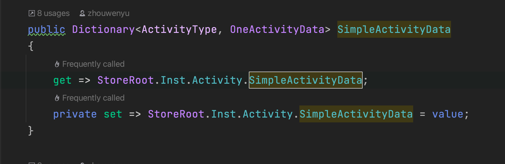
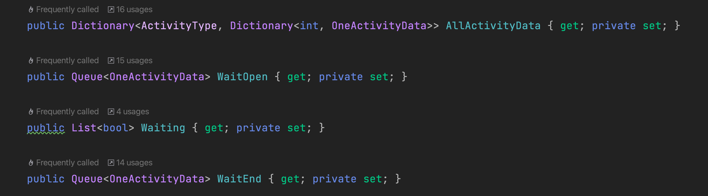

# 背景

本篇博客整理自2023.3-2023.4这段时间其他博客中遇到的C#相关的知识点。

# 属性与字段

今天是2023年4月4号，我在梳理Bubble项目的活动流程框架的时候碰到了一些数据结构的定义：



这是一个字典类型的属性，对于这个成员，它有两个标签：先是字典，然后是属性。如果只看字典，我能理解；单看属性，我也大概能理解，但是它们两个放在一起，就会让我在数据传递的流程中产生一些不理解，这种不理解源于我对于属性(Property)的概念的缺失，于是去网上看了下属性的介绍。

网上的一些帖子说，站在初学者的角度，只有Get Set的属性和所谓的共有字段貌似起的作用一样，为什么我们还需要这个东西？这也确实是我是不是会有的疑问，看来我是个初学者无疑了。

那属性这个东西到底有没有用，有什么用？我们今天来探讨一下。

首先清楚两个概念：**属性(Property)**和**字段(Field)**

字段(Field):字段是一种表示与对象或类关联的变量的成员，字段声明用于引入一个或多个给定类型的字段。字段是类内部用的，private类型的变量(字段)，通常字段的写法是加个"_"符号，然后声明只读属性，字段用来存储数据。

属性(Property):属性是另一种类型的类成员，定义属性的目的在于便于一些私有字段的访问，类提供给外部调用时用的可以设置或者读取一个值，属性则是对字段的封装，将字段和访问自己字段的方法组合在一起，提供灵活的机制来读取、编写或计算私有字段的值。属性有自己的名称，并且包含get访问器和set访问器。我们可以根据get访问器和set访问器是否存在，将属性分为：

- 读/写属性：同时包含get访问器和set访问器
- 只读：只有get访问器
- 只写：只有set访问器

现在明确了概念，回到我们的问题上：我们既然已经有字段来存储数据了，为什么还要引入属性来对数据进行访问，把声明的字段直接定义成公有的不就可以了么？

解答：在C#中我们可以非常自由的、毫无限制的访问公有字段，但是在一些场合中，我们可能希望限制只能给字段赋予某个范围的值、或是要求字段只能读或只能写，或是在改变字段时能够改变对象的其他一些状态，这些单靠字段是无法做到的，于是就有了属性，属性中包含两个快：set和get，set块负责属性的写入工作，get块负责属性的读取工作。在两个块中都可以做一些其他操作，如在set中验证赋的值是否符合要求并决定是否进行赋值。当缺少其中某一块时属性就只能只能写，set和get块中属性必须有一个，因为既不能读又不能写的属性时没有意义的，总之外部能够访问户型和修改定义为public的字段，这么做时违反类的安全性设计原则的，所以一般的字段都是设置为私有的，字段的访问便是由属性来实现的。

|     不同点     |          逻辑性/灵活性           |       存储型       |          访问型          |             适用范围             |       安全性       |
| :------------: | :------------------------------: | :----------------: | :----------------------: | :------------------------------: | :----------------: |
| 属性(Property) | 源于字段，对字段的扩展，逻辑字段 | 并不占用实际的内存 |    可以被其他类型访问    | 对接收的数据范围做限定，外部使用 | 增加了数据的安全性 |
|  字段(Field)   |          不经过逻辑处理          | 占用内存空间及位置 | 大部分字段不能直接被访问 |             内部使用             |       不安全       |

**适用情况**

公共字段：

- 允许自由读写
- 取值范围只受数据类型的约束而无其他任何特定限制
- 值的变动不需要引发类中其他任何成员的相应变化

如果上述条件均满足，那么我们便可以大胆地使用公共字段

属性：

- 要求字段只能读或只能写
- 需要限定字段的取值范围
- 在改变一个字段的值的时候希望改变对象的其他一些状态

如果满足上述条件中的任何一个，那就应该使用属性

另外，在面向接口的编程中，现代面向对象编程中不再推荐多重继承，而是使用更加合理的类+接口的方式实现程序框架。

所以如果引入接口的概念，那么属性就更是不可或缺的了。

定义接口时不允许包含字段，因为一个原则：接口不能对实现方式做具体要求，但允许接口定义属性，是对接口定义更具体的补充，而且不违反上述原则。

在接口中定义属性：

```C#
public interface MyInter{
  string Hello{
    get;
    set;
  }
}
```

然后在继承接口的类中实现Hello属性中的访问器，并且要在类中声明一个和这个属性相连的字段，就可以对该字段进行操作了。

总结：属性以灵活的方式实现了对私有字段的访问，是字段的自然扩展，一个属性总是与某个字段相关联，字段能干的，属性一定能干，属性能干的，字段不一定干的了；为了实现对字段的封装，保证字段的安全性，产生了属性，其本质是方法，暴露在外，可以对私有字段进行读写，依次提供对类中字段的保护，字段中存储数据更安全。

我在看代码的时候看到了这样一种属性：



按照上面我们对于属性的介绍，每一个属性应该有它对应的字段的关联才对，而这几个属性中只有set和get，除此之外就没有任何的内容了，这种情况叫：C#自动属性。

它是在C#5.0（和.NET5.0不是一个概念）之后，微软新增的语法糖，全称是`Auto-Implemented Properties`，如果属性的set和get的访问器中没有任何逻辑，就可以使用自动实现的属性。不需要声明私有化字段，编译器会自动创建它。使用自动实现的属性，就不能直接访问字段，因为不知道编译器声明的名称。使用自动实现的属性，就不能在属性中验证属性的有效性，自动实现的属性可以使用属性初始化器来初始化。所以使用自动属性的最大意义就是让存和取的权限分开，比如公开获取，但是私有赋值。

# 匿名函数

匿名函数(Anonymous Function)是表示内联方法定义的表达式。匿名函数本身及其内部没有值或者类型，但是可以转换为兼容的委托或者表达式树类型。匿名函数转换的计算取决于转换的目标类型：如果是委托类型，则转换计算为引用匿名函数所定义的方法的委托；如果是表达式树类型，则转换计算以对象结构形式表示方法结构的表达式树。

匿名函数有两种语法风格：Lambda表达式和匿名方法表达式。在几乎所有的情况下，Lambda表达式都比匿名方法表达式更为简洁且具有表现力。但现在C#中仍然保留了后者，为了向后兼容。

Lambda表达式：

​	async可选(匿名的函数签名)=>(匿名的函数体)

匿名方法表达式

​	async可选delegate(显式的匿名函数签名)可选{代码块}

其中匿名的函数签名可以包括两种，一种是隐式的匿名函数签名，另一种是显式的匿名函数签名：

​	隐式的函数签名：(p)、(p1, p2)

​	显式的函数签名：(int p)、(int p1, int p2)、(ref int p1, out int p2)

匿名的函数体可以是表达式或者代码块。

从上面我们可以看出，Lambda表达式的参数形式可以显式或者隐式类型话，在显式类型化参数列表中，每个参数的类型都是显式声明的，在隐式参数话列表中，参数的类型是从匿名函数出现的上下文中推断出来的。

当Lambda表达式只有一个具有隐式类型化参数的时候，参数列表可以省略圆括号，也就是说：

(参数)=>表达式

可以简写成

参数 => 表达式

一些匿名函数的实例：

```C#
x => x + 1 //隐式的类型化，函数体为表达式 
x => {return x + 1;} //隐式的类型化，函数体为代码块 
(int x) => x + 1 //显式的类型化，函数体为表达式 
(int x) => {return x + 1;} //显式的类型化，函数体为代码块 
(x , y) => x * y //多参数 
() => Console.WriteLine() //无参数 
async (t1 , t2) => await t1 + await t2 //异步 
delegate (int x) {return x + 1;} //匿名函数方法表达式 
delegate {return 1 + 1;} //参数列表省略
```

Lambda表达式和匿名方法表达式的区别：

- 当没有参数的时候，匿名方法表达式允许完全省略参数列表，从而可以转换为具有任意值参数列表的委托类型，Lambda表达式则不能省略参数列表的圆括号()
- Lambda表达式允许省略和推断类型参数，而匿名方法表达式要求显式声明参数类型
- Lambda表达式主体可以为表达式或者代码块，而匿名方法表达式的主体必须为代码块
- 只有Lambda表达式可以兼容到表达式树类型

来看代码：

```C#
class Program
{
    static void Main(string[] args)
    {
        int x = 1;
        int y = 2;
				Func<int, int, bool> aab = (x,y) =>{
          if (x > y)
          {
              Console.WriteLine("第一个参数大于第二个参数");
              return true;
          }
          else
          {
              Console.WriteLine("第二个参数大于等于第一个参数");
              return false;
          }
        };
      	
        Func<int, int, bool> aaa = delegate(int x, int y)
            {
                if (x > y)
                {
                    Console.WriteLine("第一个参数大于第二个参数");
                    return true;
                }
                else
                {
                    Console.WriteLine("第二个参数大于等于第一个参数");
                    return false;
                }
            }
            ;
      	bool aabb = aab(x,y);
        bool sad = aaa(x, y);
      	Console.WriteLine(aabb);
        Console.WriteLine(sad);
    }
}
```

下面是我个人的总结：

- 不论是Lambda表达式，还是匿名方法，它们都是依托于委托的概念而出现的。所以它们的使用也只是会在委托中。
- Lambda表达式和匿名方法定义的匿名函数，和一般的函数一样，都是模版的作用，只有被调用了才有意义，又因为我们直接调用的是委托，所以调用了委托就会调用该委托中注册的匿名函数
- 匿名方法的声明开头必须带有delegate

回看本篇文章最开始那张图，在属性中使用了lambda表达式：

```C#
PropertyType PropertyName => expression;
```

它等价于下面这段代码：

```C#
public Dictionary<ActivityType, OneActivityData> SimpleActivityData
{
    get {return StoreRoot.Inst.Activity.SimpleActivityData;}
    private set {StoreRoot.Inst.Activity.SimpleActivityData = value;}
}
```

但是不等价于：

```C#
public Dictionary<ActivityType, OneActivityData> SimpleActivityData
{
    get => {return StoreRoot.Inst.Activity.SimpleActivityData;}
    private set => {StoreRoot.Inst.Activity.SimpleActivityData = value;}
}
```

这种写法是错误的，所以我粗浅的理解`=>`在这里是为了规避set或者get中只有一行语句还要写`{}`的问题，当set或者get中的语句超过两行，就不能用`=>`了。

再比如下面的这种写法：

```C#
public class Location
{
   private string locationName;
   public string Name => locationName;
}
```

Name是属性，并不是字段，上面这两行代码等价于：

```C#
public class Location
{
   private string locationName;
   public string Name
   {
      get => locationName;
   } 
}
```

表明Name属性是只读的。

# readonly和const的用法

使用const关键字可以将字段或者局部变量声明为常量，它不能够被修改。而readonly关键字被用来声明只读字段，主要用于字段。两者具有一定的相似性，但是也有明显的差异性。先看代码：

```C#
private const int FIRST_NUM = 1;

private static const int SECOND_NUM = 1;

int t = 1;
private const int THIRD_NUM = t + 1;

private const int FIFTH_NUM = FIRST_NUM + 1;
```

其中第二个语句是不正确的，因为const默认就是静态的，所以在声明中显式地加上static关键字地做法就是错误的。

第三个语句也不正确，因为const是编译时常数。

总结：

- const默认是静态的，readonly如果设置成静态就必须显式地声明；

- const字段只能在该字段的声明中初始化，不能从一个变量中提取值来初始化常量，即：const字段是编译时常数，在编译的时候就要确定它的具体值了。

- readonly是可以使用变量来进行初始化的，但是只能在构造函数中初始化，因为readonly是在计算时执行的，所以它可以用某些变量来进行初始化。

  ```C#
  class Program
  {
      private readonly int a;
  
      public Program()
      {
        	// 不报错
        	int cc = 1;
          a = cc;
      }
  
      static void Main(string[] args)
      {
        	// 报错
          a = 1;
      }
  }
  ```

- 对于引用类型的常数，const可能的值只能是string和null。而readonly可以适用于任何类型的字段声明。

# 重写、重载、多态的区别

重写 `override` 重载 `overload` 多态`polymorphism`

重写`override`指的是重写了一个方法来实现不同的功能，一般是用于子类在继承父类的时候后，重写父类中的方法，重写的规则：

1. 重写方法的参数列表必须完全与被重写方法的参数列表相同，否则就不能称之为重写而是重载
2. 重写方法的访问修饰符一定要大于被重写方法的访问修饰符public > protected > default > private
3. 重写的方法的返回值必须和被重写方法的返回值一致
4. 重写的方法所抛出的异常必须和被重写方法所抛出的异常一致，或者是其子类
5. 被重写的方法不能是private，否则在其子类中只是新定义了一个方法，并没有对其进行重写
6. 静态方法不能被重写为非静态方法
7. 静态方法属于类，不能被重写，因此也不能多态

重载`overload`一般用于在一个类内实现若干重载的方法，这些方法的名称相同而参数形式不同

重载的规则：

1. 在使用重载时只能通过相同的方法名、不同的参数形式实现。可以是不同的参数个数，不同的参数顺序（参数类型必须不一样）
2. 不能通过访问权限、返回类型、抛出的异常进行重载
3. 方法的异常类型和数目不会对重载造成影响

多态`polymorphism`可以是静态的或动态的，在静态多态性中，函数的响应是在编译的时候发生的。在动态多态性中，函数的响应是在运行时发生的。

静态多态：在编译阶段，函数和对象的连接机制被称为早起绑定，也被称为静态绑定。C#提供了两种技术来实现静态多态性：函数重载和[运算符重载](#2)

动态多态的三个条件：

1. 继承
2. 重写（重写父类继承的方法）
3. 父类引用指向子类的对象（这个在[IEnumerator和IEnumerable的理解与辨析](http://soincredible777.com.cn/posts/133a9667/)这篇博客末尾提到了，当时还不太明确这是实现多态的一个条件），语句在堆内存中开辟了子类的对象，并把栈内存中的父类的引用指向了这个子类的对象

## 函数重载实例

我们可以在同一个范围内对相同的函数名有多个定义，函数的定义必须彼此不同，可以是参数列表中的参数类型不同，也可以是参数个数不同。**不能重载只有返回类型不同的函数声明**

```C#
namespace LearnOverload
{
    public class Overload
    {
        public static int Add(int a, int b, int c)
        {
            return a + b + c;
        }

        public static int Add(int a, int b)
        {
            return a + b;
        }
      
      	public static float Add(float a, float b)
        {
            return a + b;
        }

        static void Main(string[] args)
        {
            int a = 1;
            int b = 1;
            int c = 1;
            Console.WriteLine(Overload.Add(a, b));
            Console.WriteLine(Overload.Add(a, b, c));
        }
    }
}
```

## 动态多态：

C#允许我们使用关键字`abstract`创建抽象类，用于提供接口部分类的实现。当一个派生类继承自该抽象类时，实现即完成。抽象类包含抽象方法，抽象方法可以被派生类实现，派生类具有更专业的功能，我们在使用抽象类的时候要注意以下几点：

- 我们不能创建一个抽象类的实例
- 我们不能在一个抽象类外部声明一个抽象方法
- 通过在类定义前面放置关键字`sealed`，可以将类声明为密封类。当一个类被声明为`sealed`时，它不能被继承。抽象类不能被声明为`sealed`

```C#
namespace PolymorhismApplication
{
    public abstract class Shape
    {
        public abstract int Area();
    }

    class Rectangle : Shape
    {
        private int _length;
        private int _width;

        public Rectangle(int a, int b)
        {
            _length = a;
            _width = b;
        }

        public int Length
        {
            set { _length = value; }
            get { return _length; }
        }

        public int Width
        {
            set { _width = value; }
            get { return _width; }
        }


        public override int Area()
        {
            return _length * _width;
        }
    }

    class RectangleTest
    {
        static void Main(string[] args)
        {
            Rectangle r = new Rectangle(2, 3);
            Console.WriteLine(r.Area());
            Console.ReadKey();
        }
    }
}
```

下面使用了虚方法来实现多态

```C#
namespace PolymorhismApplication
{
    public class Shape
    {
        public virtual int? Area()
        {
            Console.WriteLine("执行了绘制图形的基类");
            return null;
        }
    }

    class Rectangle : Shape
    {
        private int _length;
        private int _width;

        public Rectangle(int a, int b)
        {
            _length = a;
            _width = b;
        }

        public int Length
        {
            set { _length = value; }
            get { return _length; }
        }

        public int Width
        {
            set { _width = value; }
            get { return _width; }
        }


        public override int? Area()
        {
            Console.WriteLine("执行绘制矩形的函数");
            return _length * _width;
        }
    }


    class Circle : Shape
    {
        private int _radius;


        public int Radius
        {
            set { _radius = value; }
            get { return _radius; }
        }


        public Circle(int radius)
        {
            _radius = radius;
        }

        public override int? Area()
        {
            Console.WriteLine("执行Circle类的绘制函数");
            return null;
            return base.Area();
        }
    }

    class Test
    {
        static void Main(string[] args)
        {
            var shapes = new List<Shape>
            {
                new Rectangle(2, 3),
                new Circle(2)
            };

            foreach (var p in shapes)
            {
                p.Area();
            }

            Console.ReadKey();
        }
    }
}
```

联想：在写枚举器那一篇博客的时候，我们自己写枚举器的目的是为了枚举自己自定义的数据类型，而C#中是有List这个数据类型的，我们可以把我们自定义的数据类型放在List里，不也能实现枚举的效果么，那我们自己写枚举器的意义何在呢？

```C#
using System.Collections;

namespace learnIEnumerator
{
    public class Person
    {
        public string Name { set; get; }

        public Person(string name)
        {
            Name = name;
        }

        public void ShowName()
        {
            Console.WriteLine(Name);
        }
    }
    
    class Program
    {
        static void Main(string[] args)
        {
            var ll = new List<Person>
                {
                    new Person("李磊"),
                    new Person("王刚"),
                    new Person("彤彤"),
                    new Person("丹丹"),
                }
                ;
            foreach (Person p in ll)
            {
                Console.WriteLine(p.Name);
            }
        }
    }
}
```

## <span id = "2">运算符重载</span>

我们可以重定义或者重载C#中内置的运算符。因此，我们也可以使用自定义类型的运算符。重载运算符具有特殊名称的函数，是通过关键字`operator`后跟运算符的符号来定义的。于其他函数一样，重载运算符返回类型和参数列表：

```C#
namespace OverloadOperator
{
    public class Box
    {
        private double length;
        private double breadth;
        private double height;

        public double getVolume()
        {
            return length * breadth * height;
        }

        public void setBreadth(double bre)
        {
            breadth = bre;
        }

        public void setLength(double len)
        {
            length = len;
        }

        public void setHeight(double hei)
        {
            height = hei;
        }


        public static Box operator +(Box b, Box c)
        {
            Box box = new Box();
            box.length = b.length + c.length;
            box.breadth = b.breadth + c.breadth;
            box.height = b.height + c.height;
            return box;
        }
    }

    class Tester
    {
        static void Main(string[] args)
        {
            Box Box1 = new Box();
            Box Box2 = new Box();
            Box Box3 = new Box();
            double volume = 0.0;


            Box1.setLength(6.0);
            Box1.setBreadth(7.0);
            Box1.setHeight(5.0);

            Box2.setLength(12.0);
            Box2.setBreadth(13.0);
            Box2.setHeight(10.0);

            volume = Box1.getVolume();
            Console.WriteLine("Box1的体积：{0}", volume);

            volume = Box2.getVolume();
            Console.WriteLine("Box2的体积：{0}", volume);

            Box3 = Box1 + Box2;

            volume = Box3.getVolume();
            Console.WriteLine("Box3的体积：{0}", volume);
            Console.ReadKey();
        }
    }
}
```

上面的代码实现的是我们自己对自定义类Box的加法运算符，它把两个Box对象的属性相加，并返回相加后的Box对象。

# 闭包

闭包是一个代码块（在C#中，指的是匿名方法或者Lambda表达式，也就是匿名函数），并且这个代码块使用到了代码块以外的变量，于是这个代码块和用到的代码块以外的变量（上下文）被“封闭地包在一起”，当使用此代码块的时候，该代码块里使用的外部变量的值，是使用该代码块时的值，并不一定是创建该代码块时的值，正常的函数内部的变量时保存在帧栈中。当形成闭包以后，托管堆就形成一个类，用来存放该变量

一句话概括，闭包就是一个包含了上下文环境的匿名函数。

看代码：

```C#
static void Main(string[] args){
	int i = 90;
	TestDelegate dd = delegate{console.WriteLine("hello"); i = i + 10;};
}
```

闭包就是指IL代码中的<>c_DisplayClass2.0类，编译器把匿名方法和使用到的外部变量打包在一起封装成<>c_DisplayClass2.0，并且生成属性来读取变量i。

## 形成闭包的条件

嵌套定义的函数、匿名函数、lambda表达式、将函数作为参数或者返回值。

## 闭包的优点

使用闭包我们可以轻松的访问外层函数定义的变量，例如在匿名方法中有以下场景：在WinForm中，我们希望当用户关闭窗体时，给用户一个提示，代码如下：

```C#
private void Form1_Load(object sender, EventArgs e){
  string tipWords = "您将关闭当前对话框";
  this.FormClosing += delegate;
  {
    MessageBox.show(tipWords);
  };
}
```

如果不使用匿名方法的话，我们就需要使用其他方式将tipWords变量的值传递给FormClosing注册的处理函数，这就增加了不必要的工作量。

## 闭包陷阱

看代码：

```C#
private static void Before(){
  Action[] actions = new action[10];
  for(var i = 0; i < actions.Length; i++){
    actions[i] = () =>{
      Console.WriteLine(i)
    };
  }
  foreach(var item in actions){
    item();
  }
}
```

输出结果：


解释：

在for循环中，只能有一个i变量，即在第一次循环的时候，i的地址就已经分配好了（i的地址第一次分配了之后就是不变的了），不会因为循环次数的多少而发生任何的改变，其改变的只能是里面装载的值。

当使用匿名方法时传进去的是变量的地址，**而不是具体的值。只有当真正执行这个匿名方法的时候，才会去确定它的值**，这就是为什么在上面的例子中，结果都是10（for循环在最后，当i=9时，i又加了1）。

## 编译器帮我们做了什么？

下面是编译器帮我们生成的代码：

```C#
private static void After(){
  Action[] actions = new Action[10];
  
  var anonymous = new AnonymousClass();
  
  for(anonymous.i = 0; anonymous.i < actions.Length; anonymous.i++){
    actions[anonymous.i] = anonymous.Action;
  }
  foreach(var item in actions){
		item();
  }
}

class AnonymousClass{
  public int i;
  public void Action(){
    Console.WriteLine(this.i);
  }
}
```

## 如何避免闭包陷阱

1. 在for循环中，定义一个临时变量temNum，存储i的值即可。因为编译器会对该临时变量重新分配内存，这样，每次循环都会从新分配新的内存，就不会有这个问题了。

2. **使用foreach**，C#5.0以后，for和foreach在处理闭包问题上有了一些新的改变。为了适应不同的需求，微软对foreach做了调整，foreach的遍历中定义的临时循环变量会被逻辑上限制在循环内，foreach的每次循环都会是循环变量的一个拷贝，这样闭包就看起来关闭了

   看代码：

   ```C#
   class Program
   {
       private static void Before()
       {
           Action[] actions = new Action[10];
           foreach (var i in Enumerable.Range(0, 10))
           {
               actions[i] += () => { Console.WriteLine(i); };
           }
   
           foreach (var item in actions)
           {
               item();
           }
       }
   
   
       static void Main(string[] args)
       {
           Before();
       }
   }
   ```

​			使用foreach遍历了Action之后，输出的就是0 、1、 2、3、4 .....了。

## 闭包的应用

需求：实现变量a的自增

通过全局变量实现，虽然可以实现，但是会污染其他程序

```C#
var a = 10;
function Add()
{
	a++;
  Console.Log(a);
}

Add();
Add();
Add();
Console.Log(a);
```

定义一个局部变量，不污染全局，但是实现不了递增

```C#
var a = 10;
function Add2(){
	var a = 10;
	a++;
	Console.Log(a);
}
Add();
Add();
Add();
Console.Log(a);
```

通过闭包，可以使函数内部局部变量递增，不会影响全局变量：

```C#
var a = 10;
function Add3(){
	var a = 10;
	return function(){
		a++;
		return a;
	};
};
var cc = Add3();
Console.Log(cc());
Console.Log(cc());
Console.Log(cc());
Console.Log(a);
```

# 关于帧栈

https://blog.csdn.net/weixin_41519463/article/details/122203481?spm=1001.2101.3001.6650.1&utm_medium=distribute.pc_relevant.none-task-blog-2%7Edefault%7ECTRLIST%7ERate-1-122203481-blog-116846805.235%5Ev28%5Epc_relevant_t0_download&depth_1-utm_source=distribute.pc_relevant.none-task-blog-2%7Edefault%7ECTRLIST%7ERate-1-122203481-blog-116846805.235%5Ev28%5Epc_relevant_t0_download&utm_relevant_index=2

# 字典、列表和队列

看代码：

```C#
public class Student
{
    private string _name;

    public string Name
    {
        get { return _name; }
        set { _name = value; }
    }

    private int _age;

    public int Age
    {
        get { return _age; }
        set { _age = value; }
    }

    private string _grade;

    public string Grade
    {
        get { return _grade; }
        set { _grade = value; }
    }

    public Student(string name, int age, string grade)
    {
        _name = name;
        _age = age;
        _grade = grade;
    }

    public override string ToString()
    {
        return this._name + "," + this._age.ToString() + "," + this._grade;
    }
}

public class Program
{
    public static void Main()
    {
        List<Student> arr = new List<Student>();
        arr.Add(new Student("张三", 7, "一年级"));
        arr.Add(new Student("李四", 11, "二年级"));
        arr.Add(new Student("王五", 21, "一年级"));
        arr.Add(new Student("李六", 8, "三年级"));
        arr.Add(new Student("刘七", 15, "二年级"));


        // 调用Sort方法，传入一个匿名方法，实现按年级排序
        arr.Sort(delegate(Student x, Student y) { return x.Grade.CompareTo(y.Grade); });


        // 原生的List的Sort算法是怎么实现的？
        foreach (var item in arr)
        {
            Console.WriteLine(item.ToString());
        }


        Console.WriteLine();

        // 调用Sort方法，传入一个匿名方法，实现按照姓名排序
        arr.Sort(delegate(Student x, Student y) { return x.Name.CompareTo(y.Name); });


        foreach (var item in arr)
        {
            Console.WriteLine(item.ToString());
        }
    }
}
```

# C#中out和ref之间的区别

首先两者都是按地址传递的，使用后都将改变原来参数的数值。

其次，ref可以把参数的数值传递进函数，但是out是要把参数清空，我们无法把一个数值从out传递进去，out进去后，参数的数值为空，我们必须初始化一次。

# C#中的params关键字

params是C#关键字，可变长参数，是在声明方法时参数类型或者参数个数不确定的时候使用的。

关于params参数数组，需要掌握以下几点：

1. 参数数组必须是一维数组
2. 不允许将params修饰符与ref和out修饰符组合起来使用
3. 与参数数组对应的实参可以是同一类型的数组名，也可以是任意多个与该数组元素属于同一类型的变量
4. 如果实参是数组按引用传递，若实参是变量或表达式则按值传递
5. 形式为：方法修饰符 返回类型 方法名(params 类型[] 变量名)
6. params参数必须是参数列表的最后一个参数

```C#
class Program
{
    static void Main()
    {
        UserParams(1, 2, 3);

        int[] myarray = new int[3] { 10, 11, 12 };
        UserParams(myarray);

        UserParams2(1, 'a', "dasd");
    }

    public static void UserParams(params int[] list)
    {
        for (int i = 0; i < list.Length; i++)
        {
            Console.WriteLine(list[i]);
        }

        Console.WriteLine();
    }

    public static void UserParams2(params object[] list)
    {
        for (int i = 0; i < list.Length; i++)
        {
            Console.WriteLine(list[i]);
        }

        Console.WriteLine();
    }
}
```

# 结构体和类的区别

- 关于结构体，C#的结构不同于传统的C或者C++中的结构，它的特点如下：
  - 结构可以带有方法、字段、索引、属性、运算符方法和事件
  - 结构可以自定义构造函数，但是不能定义析构函数。要注意，我们不能为结构定义无参的构造函数，无参的构造函数默认是自动定义的，而且不能被改变
  - 与类不同，结构不能继承其他的结构或类
  - 结构不能作为其他结构或类的基础结构（不能被继承）
  - 结构可以实现一个或多个接口
  - 结构成员不能制定为`abstract`、`virtua`l或者`protected`
  - 当我们使用New操作服创建一个结构对象的时候，会调用适当的构造函数来创建结构。与类不同，结构可以不适用New操作符即可以被实例化
  - 如果不使用New操作符，有在所有的字段都被初始化之后，字符才被赋值，对象才被引用。

- 类和结构的区别
  - 类是引用类型，结构是值类型
  - 结构不支持继承
  - 结构不能声明默认的构造函数

# C#的类修饰符

- `public`：访问不受限制的，所有的本程序集以及其他的程序集里面的类都能够访问
- `internal`：本程序集内的类可以访问，这是类默认的修饰符，在一个程序集内，public和internal的权限是一样的
- `partial`：部分类，可以将一个类分成几部分写在不同的文件中，最终编译时将合成一个文件，并且各个部分不能分散在不同的程序集中
- `abstract`：修饰类的时候表示该类为抽象类，不能够创建该类的实例。修饰方法的时候表示该方法需要子类来实现，如果子类没有实现该方法那么子类同样是抽象类；并且含有抽象方法的类一定是抽象类。
- `sealed`：修饰类表示该类不能够被继承
- `static`：修饰类时表示该类是静态类，不能够实例化该类的对象，那么这个类也就不能够含有对象成员，即该类所有成员为静态。

- `new`：只能用于嵌套的类，表示对继承父类同名类型的隐藏

**C#类修饰符的总结**

- 抽象类就是不能使用new方法进行实例化的类，即没有具体实例对象的类。抽象类有点类似“模板”的作用，目的是根据其格式来创建和修改新的类，对象不能由抽象类直接创建，只可以通过抽象类派生出新的子类，再由其子类来创建对象。当一个类被声明为抽象类时，要在这个类前面加上修饰符abstract
- 在抽象类中的成员方法可以包括**一般方法**和**抽象方法**，抽象方法就是以abstract修饰的方法，这种方法只声明返回的数据类型、方法名称和所需的参数，没有方法体，也就是说冲向方法只需要声明而不需要实现。当一个方法为抽象方法时，意味着这个方法必须被子类的方法所重写，否则其子类的该方法仍然是abstract的，而这个子类也必须是抽象的，即声明为abstract，想要调用**抽象类中的一般方法只能通过定义一个子类并实例化它之后才能调用**。
- 抽象类中不一定包含抽象方法，但是包含抽象方法的类一定要被声明为抽象类。抽象类本身不具备实际的功能，只能用于派生其子类。抽象类中可以包含构造方法，但是构造方法不能被声明为抽象。
- 调用抽象类中的方法（抽象方法和非抽象方法），如果方法是static的，直接使用`抽象类.方法`就可以了，如果是非static的则必须一个继承的非抽象类，然后用这个非抽象类的实例来调用方法。
- 抽象类可以实现接口，接口中的方法，在抽象类中可以不实现，当有子类继承抽象类时，并且子类不是抽象类时，子类需要将抽象类中的抽象方法和接口中的方法都实现。
- 抽象类不能用final来修饰，即一个类不能既是最终类又是抽象类。
- abstract不能与private、static、final、native并列修饰同一个方法。

**TIPS：抽象方法和虚方法都可以供派生类重写，它们的区别如下**

- 虚方法必须有实现部分，并为派生类提供了覆盖方法的选项；抽象方法没有提供实现部分抽象方法是一种强制派生类覆盖的方法，否则派生类将不能被实例化。
- 抽象方法只能在抽象类中声明，抽象方法必须在派生类中重写，这一点跟接口类似；虚方法不是也不必要重写。如果类包含抽象方法，那么该类也是抽象的，也必须声明为抽象的。
- 抽象方法不能声明方法实体，而虚方法可以；包含抽象方法的类不能够被实例化，而包含虚方法的类可以被实例化。

protected、private、protected internal只能用于嵌套的类

为什么要有嵌套类？

嵌套类主要用于当该类仅仅被所在类使用，不需要外部进行显式地构造，并且需要对所在类的成员进行大量访问操作的情况

嵌套类型的访问修饰符为：public、internal、protected、private和protected internal

