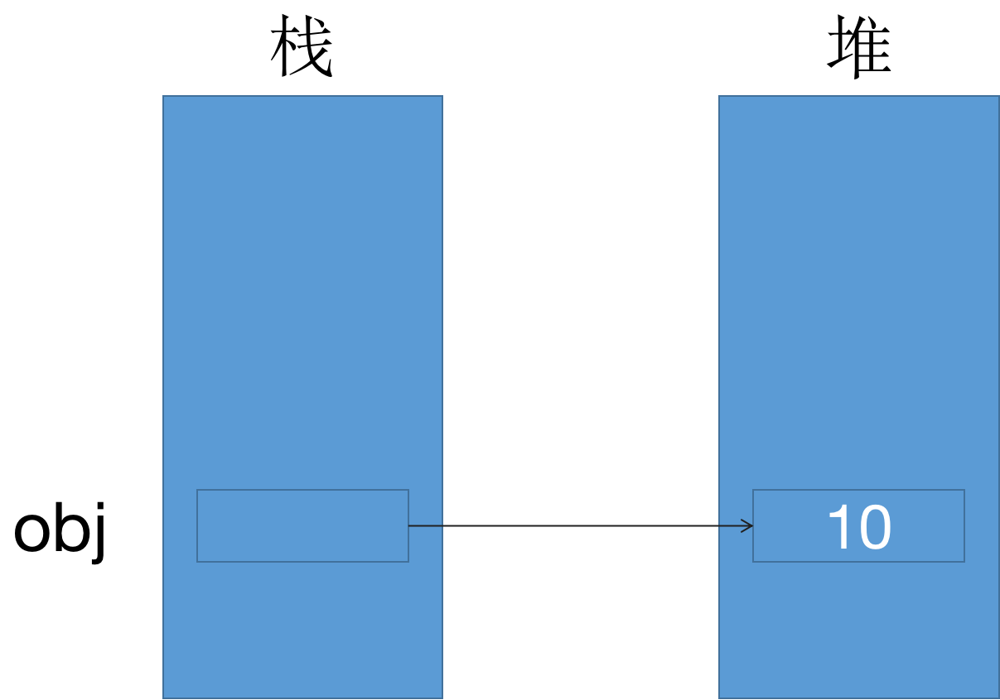
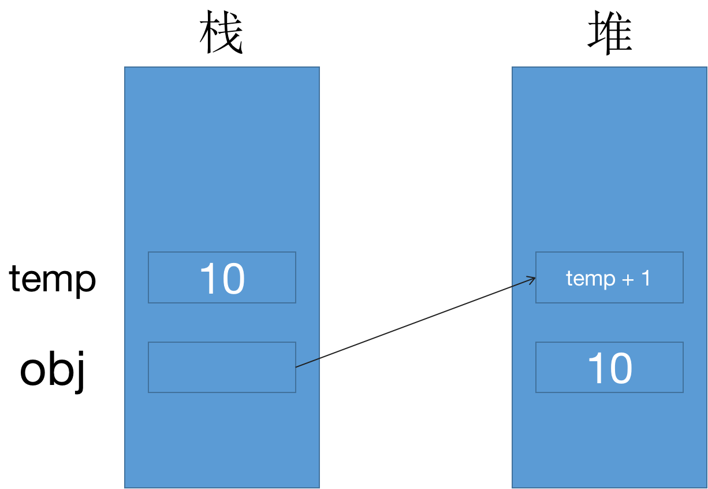

# 背景

编写的几乎所有程序都需要循环访问集合，因此需要编写代码来检查集合中的每一项。

迭代器可以读取集合中的数据，但是不能从底层修改集合，因为迭代器的实现方法中只实现了Get方法，所以不能对集合中的数据进行修改

语法糖：计算机中添加某种语法，这种语法对语言功能没有影响，但是更方便程序员使用，语法糖让代码更加简洁，有更高的可读性

由迭代器引出了更多的基础知识：什么是接口？https://www.cnblogs.com/binyao/p/4891306.html 很好的一篇博客

# 接口与类（抽象类）的区别

**接口是对动作的抽象表示这个对象能做什么，类是对根源的抽象表示这个对象是什么。**

# 接口（Interface）

接口定义了所有类继承接口时应该遵循的语法合同，接口定义了语法合同“是什么”的部分，派生类定义了语法合同“怎么做”部分。接口定义了属性、方法和事件，这些都是接口的成员。接口只包含了成员的声明。成员的定义是派生类的责任。接口提供了派生类应该遵循的标准结构。接口使得实现接口的类或结构在形式上保持一致。抽象类在某种程度上与接口类似，但是它们大多只是用在当只有少数方法由基类声明由派生类实现时。接口本身并不实现任何功能，它只是和声明实现该接口的对象订立一个必须实现哪些行为的契约。

# IEnumerable和IEnumerator

`IEnumerable`和`IEnumerator`本质是两个接口，二者的源码如下：

```C#
// Decompiled with JetBrains decompiler
// Type: System.Collections.IEnumerator
// Assembly: netstandard, Version=2.1.0.0, Culture=neutral, PublicKeyToken=cc7b13ffcd2ddd51
// MVID: 5A41D6B7-1898-42EC-A409-FD0B1C3E3DCF
// Assembly location: /Applications/2021.3.14f1/Unity.app/Contents/NetStandard/ref/2.1.0/netstandard.dll

namespace System.Collections
{
  /// <summary><para>Supports a simple iteration over a non-generic collection.</para></summary>
  public interface IEnumerator
  {
    /// <summary><para>Gets the current element in the collection.</para></summary>
    object Current { get; }

    /// <summary><para>Advances the enumerator to the next element of the collection.</para></summary>
    bool MoveNext();

    /// <summary><para>Sets the enumerator to its initial position, which is before the first element in the collection.</para></summary>
    void Reset();
  }
}

```

```C#
// Decompiled with JetBrains decompiler
// Type: System.Collections.IEnumerable
// Assembly: netstandard, Version=2.1.0.0, Culture=neutral, PublicKeyToken=cc7b13ffcd2ddd51
// MVID: 5A41D6B7-1898-42EC-A409-FD0B1C3E3DCF
// Assembly location: /Applications/2021.3.14f1/Unity.app/Contents/NetStandard/ref/2.1.0/netstandard.dll

namespace System.Collections
{
  /// <summary><para>Exposes an enumerator, which supports a simple iteration over a non-generic collection.</para></summary>
  public interface IEnumerable
  {
    /// <summary><para>Returns an enumerator that iterates through a collection.</para></summary>
    IEnumerator GetEnumerator();
  }
}
```

二者的区别与联系：

一个集合可查询（使用foreach，where，any等），必须以某种方式返回IEnumerator object，也就是必须实现IEnumerable接口

IEnumerator object具体实现了iterator（通过MoveNext(),Reset(),Current）。

从这两个接口的选词上，可以看出IEnumerable是一个声明式的接口，声明实现该接口的class是“可枚举的”

IEnumerable和IEnumerator通过IEnumerable的GetEnumerator()方法建立了连接。

看一个例子：

```C#
using System.Collections;

namespace learnIEnumerator
{
    public class Person
    {
        public string Name { set; get; }

        public Person(string name)
        {
            Name = name;
        }

        public void ShowName()
        {
            Console.WriteLine(Name);
        }
    }

    public class PeopleEnum : IEnumerator
    {
        public Person[] _person;
        int position = -1;

        public PeopleEnum(Person[] person)
        {
            _person = person;
        }


        public bool MoveNext()
        {
            position++;
            return (position < _person.Length);
        }

        public void Reset()
        {
            position = -1;
        }

        public object Current
        {
            get
            {
                try
                {
                    return _person[position];
                }
                catch (Exception e)
                {
                    Console.WriteLine(e);
                    throw new InvalidOperationException();
                }
            }
        }
    }


    public class PersonSet : IEnumerable
    {
        private Person[] people;

        public PersonSet(Person[] pArray)
        {
            people = new Person[pArray.Length];
            for (int i = 0; i < pArray.Length; i++)
            {
                people[i] = pArray[i];
            }
        }

        public IEnumerator GetEnumerator()
        {
            // 调用了构造函数吧？
            // 类的声明其实就是调用构造函数的过程
            return new PeopleEnum(people);
        }
    }


    // 我现在疑惑的点就在于，必须要在Person类的基础上再套一个People List的类么？
    // 拿最简单的int和 int[]
    // int 相当于 Person 代表每一个Person的实例，它停留在个体这个层面
    // int[] 相当于 People 它里面是要实现集合以外，而且继承IEnumerable接口，说明它是可以枚举的，它是集合这个层面的
    // 然后我们还需要去自定义一个迭代器，来实现对于People的枚举

    // 再抽象一下
    // 我们要实现枚举我们自定义的数据结构，我们需要实现三个类
    // 1.数据结构的定义，也就是每个个体它有哪些属性
    // 2.包含1中数据结构的集合，除此之外该集合继承IEnumerable接口，调用GetEnumerator方法
    // 3。实现GetEnumerator方法

    class Program
    {
        static void Main(string[] args)
        {
            Person[] person = new Person[4]
            {
                new Person("李磊"),
                new Person("王刚"),
                new Person("彤彤"),
                new Person("丹丹"),
            };

            PersonSet listPeople = new PersonSet(person);
            foreach (Person p in listPeople)
            {
                Console.WriteLine(p.Name);
            }
        }
    }
}
```

以上代码中有三个不太理解的点：

- 对象（Object）类型

  对象类型是C#通用类型系统中所有数据类型的终极基类。Object是System.Object类的别名。所以对象（Object）类型可以被分配其他类型（值类型、引用类型、预定义类型或者用户自定义类型）的值。但是在分配之前需要先进行类型转换。

  当一个值类型转换成对象类型时，则被称为`装箱`；另一方面，当一个对象类型转换为值类型时，则被称为`拆箱`。（[关于装箱和拆箱](#1)）

  ```C#
  object obj;
  obj = 100;
  ```

  **知识点补充： 值类型和引用类型**

  值类型：值类型变量可以直接分配给一个值，它们是从类`System.ValueType`中派生的。值类型直接包含数据，比如int、char、float，它们分别存储数字、字符和浮点数。

  引用类型：引用类型不包含存储在变量中的实际数据，但它们包含对变量的引用。换句话说，它们指的是一个内存位置，使用多个变量时，引用类型可以指向一个内存位置。如果内存位置的数据是由一个变量改变的，其他变量会自动反映这种值的变化。**内置**的引用类型有：`object`、`dynamic`、`string`

- 属性（Property）

  属性是类、结构和接口的命名成员。类或结构中的成员变量或者方法称为域（Field）。属性是域的扩展，并且可以使用相同的语法来访问。它们使用访问器（Accessors）让私有域的值可以被读写或者操作。属性不会确定存储位置，相反，它们具有可读写或计算它们值的访问器。例如，有一个名为Student的类，带有age、name和code的私有域。我们不能在类的范围以外直接访问这些域，但是我们可以拥有访问这些私有域的属性。在IEnumerator中，我们需要重写一个object类型的Current属性：

  ```C#
  // Current 的真实数据类型应该和 _people[poistion]的数据类型一致
  public object Current
          {
              get
              {
                  try
                  {
                      return _people[position];
                  }
                  catch (Exception e)
                  {
                      Console.WriteLine(e);
                      throw new InvalidOperationException();
                  }
              }
          }
  ```

- foreach的原理

  我看了一个半小时的资料，还是没有太理解foreach的原理，我现在只能用表现层给foreach做一个定义：foreach是一个完全用来遍历集合的工具，它的使用不需要数组下标的参与，能够减少我们使用数组下标会出现的问题、提高我们编写代码的效率。（关于foreach的原理已经在[这篇博客](http://soincredible777.com.cn/posts/83d7c4e7/)中解释清楚）

在对上面三点进行了了解之后，我现在对IEnumerator和IEnumerable做一个总结：

如果我们要实现枚举我们自己定义的数据结构的功能，我们总共要实现三个类：

1. 我们自己定义的数据结构的类，也就是我们要枚举的每一个元素的类
2. 包含我们自定义数据结构的类的类，也就是集合，这个类要继承IEnumerable接口，重写GetEnumerator函数
3. 枚举我们定定义数据结构的类，也就是枚举器，继承IEnumerator接口，重写MoveNext方法、Reset方法和Current

其中最困扰我的是第二个类，或者说foreach的用法，我们在调用GetEnumerator方法的时候会向其中传入我们要枚举的自定义数据结构的数组，通过return语句新建的PeopleEnum类中传的people参数是关键，它告诉了枚举器我们要枚举什么类型的数据，以及枚举的数据有哪些。

```c#
public class PersonSet : IEnumerable
    {
  			// people就是我们要枚举的集合
        private Person[] people;

        public PersonSet(Person[] pArray)
        {
            people = new Person[pArray.Length];
            for (int i = 0; i < pArray.Length; i++)
            {
                people[i] = pArray[i];
            }
        }

        public IEnumerator GetEnumerator()
        {
            // 调用了构造函数吧？
            // 类的声明其实就是调用构造函数的过程
          
          	// 这一行代码十分关键，它把枚举器和我们要枚举的集合联系到一起了
          	// 这行代码告诉我们的枚举器类我们要枚举的数据是什么、有哪些
            return new PeopleEnum(people);
        }
    }
```

# yield关键字

yield关键字是一个语法糖，背后其实生成了一个新的类，是一个枚举器，枚举器具体实现了MoveNext、Reset和Current。

先看一段代码，通过`yield return`实现了类似用foreach便遍历数组的功能，说明yield return也是用来实现迭代器的功能的

```C#
using static System.Console;
using System.Collections.Generic;

class Program
{
    //一个返回类型为IEnumerable<int>，其中包含三个yield return
    public static IEnumerable<int> enumerableFuc()
    {
        yield return 1;
        yield return 2;
        yield return 3;
    }

    static void Main(string[] args)
    {
        //通过foreach循环迭代此函数
        foreach (int item in enumerableFuc())
        {
            WriteLine(item);
        }

        ReadKey();
    }
}
```

上面代码的输出结果将会是：`1 2 3`。

如果我在代码中加入`yield break`：

```C#
yield return 1;
yield return 2;
yield break;
yield return 3;
```

那么结果就只会输出1和2，说明这个迭代器被yield break给停掉了，所以yield break是用来终止迭代的。

我们现在把上面遍历人名的那个程序改写成`yield`的形式看一下：

```C#
namespace learnIEnumerator
{
    public class Person
    {
        public string Name { set; get; }

        public Person(string name)
        {
            Name = name;
        }

        public void ShowName()
        {
            Console.WriteLine(Name);
        }
    }

    public class PersonSet
    {
        private Person[] people;

        public PersonSet(Person[] pArray)
        {
            people = new Person[pArray.Length];
            for (int i = 0; i < pArray.Length; i++)
            {
                people[i] = pArray[i];
            }
        }

        public IEnumerable<Str4ing> PersonEnum()
        {
            for (int i = 0; i < people.Length; i++)
            {
                yield return people[i].Name;
            }
        }

        class Program
        {
            static void Main(string[] args)
            {
                Person[] person = new Person[4]
                {
                    new Person("李磊"),ty
                    new Person("王刚"),
                    new Person("彤彤"),
                    new Person("丹丹"),
                };

                PersonSet listPerson = new PersonSet(person);
                IEnumerator<String> enumerator = listPerson.PersonEnum().GetEnumerator();
                while (enumerator.MoveNext())
                {
                    String current = enumerator.Current;
                    Console.WriteLine(current);
                }
            }
        }
    }
}
```

再来看一段代码：

```C#
public static IEnumerable<int> Fibonacci(int count)
{
    int prev1 = 0;
    int prev2 = 1;
    
    for (int i = 0; i < count; ++i)
    {
        int current = prev1 + prev2;
        yield return current; // 使用yield return返回当前值
        
        prev1 = prev2;
        prev2 = current;
    }
}
```

在这段代码中我们使用了for循环嵌套了一个`yield return` 语句，我在这里时常会有一个误区就是，我会习惯性地认为for循环是用来实现`MoveNext`的方法的，但其实不是，因为看这段代码

```C#
    public static IEnumerable<int> enumerableFuc()
    {
        yield return 1;
        yield return 2;
        yield return 3;
    }
```

它里面没有for循环但是依然可以实现`MoveNext`的功能啊😂，所以无论是使用for循环还是把所有元素罗列出来，这个环节的目的都是为了告诉yield return自动生成的那个迭代器它要遍历的这个集合中有多少个元素，仅此而已，`MoveNext`会被编译器隐式地处理，完全不需要我们操心。

还有一点，我们一个IEnumerable方法中只会生成一个迭代器，理解一下这句话，还是蛮重要的，回顾一下迭代器模式中的四个角色，有一个叫做具体聚合角色，有一个叫做具体迭代器角色，具体迭代器迭代的就是具体聚合角色 （集合），集合本质就是一类事物的组合，因此我们只需要使用一个迭代器就可以完成对这一个集合的全部遍历了，我之前存在的一个误区是我认为每调用一次yield语句就会生成一个迭代器。

最后再来看看使用了yield语句后我们可以少写哪些代码，我们首先不需要自己编写具体的迭代器类了，相对应的抽象迭代器类也不需要了，我们现在只需要在具体聚合类中定义一下获取迭代器的方法就可以了。所以真的好省事啊！

好！然后我们再来看一下unity中的协程！现在整篇博客的逻辑已经十分混乱了，五一需要整理博客喔！

一般我们会在协程中处理各种各样的业务嘛，比如下图：


可以看到里面yield return的东西五花八门，但是牢记我们上面讲到的，遍历一个具体聚合角色只会有一个迭代器，来看看ChatGPT怎么说：


我们现在理解一下StartCoroutine方法，该方法里面会传入一个IEnumerator类型的方法，所以我们类比一下调用StartCoroutine方法就相当于是使用了foreach，看一下伪代码：

```C#
public class YieldExample
{
    public static IEnumerable<int> GetValues(int count)
    {

       for (int i = 1; i <= count; i++)
        {
            yield return i;
        }

    }
}
class Program
{
    static void Main(string[] args)
    {
        // 调用静态方法GetValues，获取迭代器
        IEnumerable<int> valuesEnumerable = YieldExample.GetValues(5);

        Console.WriteLine("Type of the GetEnumerator instance: " + valuesEnumerable.GetType().FullName);

        // 使用foreach循环遍历迭代器
        foreach (int value in valuesEnumerable)
        {
            Console.WriteLine(value);
        }
    }
}
```

当我们调用了StartCoroutine方法后类似于调用了foreach循环，会不断遍历整个集合，但是在Unity的StartCoroutine方法中它所遍历的集合是执行时机的集合，因为在Unity的协程中我们一般yield return的都是一些协程再执行的时机，而且仔细想想协程的运作方式跟纯C#还不一样，在纯C#中我们需要用yield return返回我们要遍历的集合的元素，比如上面这段代码

而协程的代码：

```C#
FlyPfxManager.Create();
ActivityManager.Create();
yield return null;
PlayDefine.Init();
PlayViewDefine.Init(1.5f);
yield return null;
CmdManager.Create();
yield return null;
DataManager.Create();
yield return null;
AuthManager.Create();
```

我们的目的是在一段时间内执行很多种方法，yield return返回的元素不是我们想要的东西，它是我们达到异步的手段，我认为这是协程和纯C#中IEnumerator的区别

总之就是使用StartCoroutine和foreach都能达到遍历一个具体聚合角色的所有元素的作用，但是它们遍历这个集合元素的目的是不同的，StartCoroutine遍历集合是为了实现时间间隔，而纯C#的foreach遍历集合是为了展示或者读取到（只读）集合中所有元素的信息。

那我想协程到此应该就理解了，比如我们定义了一个`IEnumerator Func()`，那么我们会使用`StartCoroutine(Func());`，因此，`Func()`就是一个具体聚合角色（一个集合）而StartCoroutine就是一个迭代器，它去遍历整个`Func()`集合，所以说协程的本质是迭代器好像没什么问题。

关于`IEnumerator`、`IEnumerable`和`yield`的探讨就先告一段落了。

# <span id = "1">关于装箱和拆箱</span>

值类型直接存储其值在线程栈中，引用类型存储对其值的引用。这一句话中涉及到的数据完全都是栈上的数据，没有堆。

- 值类型声明变量后，无论是否已经赋值，编译器都会为其分配内存
- 引用类型在声明一个类时，只会在栈中分配一小块内存用于存放引用地址，在堆上并没有为其分配堆上的空间。当类实例化时，为其分配堆上的内存空间，然后将堆上空间的地址保存到栈上分配的一小块空间中。

当我们把一个值类型赋值给引用类型时，这个过程可以看作是“装箱”。

```c#
object obj = 10;
```

上面这一行代码在堆栈中执行的操作大概如下：

1. 在栈上开辟空间给变量obj
2. 在堆上开辟空间，习惯上把该空间看作是箱子
3. 把10`装箱`



变量obj指向堆上值为10的对象，换句话说，变量obj的值时堆上对象的地址。

那现在如果我想要改变obj的值，比如obj = 11，按照对值类型的操作，我们会想要使用`obj++`的方式让obj自增，但是这样是错误的，因为`++`无法应用于引用类型。

那如果先将引用类型拆箱，编程值类型，然后再自增1呢？

```C#
object obj = 10;
((int)a)++;
```

结果还是报错：增量或减量运算符的操作数必须为变量、属性或者索引器。

而`((int)a)++`相当于10++，相当于10 = 10 +1，相当于10 = 11，所以就报错了。

那该怎么做？我们可以把拆箱后的值赋给另外一个变量：

```C#
object obj = 10;
int temp = (int)obj;
obj = temp + 1;
```

这样obj的值就是11了。

上述实现引用类型自增的操作，在堆栈上的流程大概是这样的：

1. 在栈上开辟空间给变量obj
2. 在堆上开辟空间，习惯上把该空间看作是箱子
3. 把10`装箱`
4. 在栈上开辟空间给变量temp
5. 把obj的值拆箱后，复制给temp变量，此时temp的值为10
6. 在堆上又开辟另外的空间
7. 把temp+1，即11装箱




如此依赖，obj指向了堆上值为11的对象。堆上值为10的对象就等待GC的回收，从上面这个角度可以稍微理解，为什么装箱拆箱会引起GC。

所以，值类型装箱后是不能改变它的值的，装箱后的值具有恒定性（Immutable）的特点，如果想给引用类型的变量赋予新的值，那就需要再堆上另开辟新的内存空间，一旦一个值类型被装箱，它的值就没有办法改变了。

下面这段内容是我在看到int类型继承自`System.ValueType`的时候突然想到的，和装箱拆箱没有太大关系，下面主要想说明子类和父类中一些调用关系。

`System.ValueType`是int类型的父类，我们现在把`System.ValueType`类更抽象成Father类，将int类抽象成Child，看一段代码：

```C#
public class Father
  {
      public virtual void funcBase()
      {
          Console.WriteLine("这是虚函数基类");
      }

      public void funcFather()
      {
          Console.WriteLine("这是父类中的函数");
      }
  }

  public class Child : Father
  {
      public override void funcBase()
      {
          // base.funcBase();
          Console.WriteLine("这是子类中对虚函数的重写");
      }

      public void funcChild()
      {
          Console.WriteLine("这是子类中的函数");
      }
  }
```

调用一下：

```C#
Father f1 = new Father();
Father f2 = new Child();
```

其中`Father f2 = new Child();`虽然f2是Father类，但是它本质还是一个Child的类，所以说Child的方法f2是可以调用的。

但是反过来

```C#
Child c1 = new Father();
Child c2 = new Child();
```

c1会报错。父亲可以变成儿子，儿子不能变成父亲。

# int?

`int?`表示可空类型，它是一种特殊的值类型，它的值可以为null，在变量设初值的时候，给变量赋值为null，而不是0

`int??`用于判断并赋值，先判断当前变量是否为null，如果是就可以赋一个新值，否则跳过。注：这是一个右值，不是一个statement。

```c#
public int？ a=null；
public int b()
{
return this.a ?? 0;
}
```

# 小结

今天是项目的验收环节，工作比较少，所以花了一天的时间写完了这篇博客，本篇博客从IEnumerator和IEnumerable出发，引出了类和接口的辨析、C#中的修饰符、虚函数和抽象函数的区别辨析等等很多零碎的知识点，真的是收获满满。

