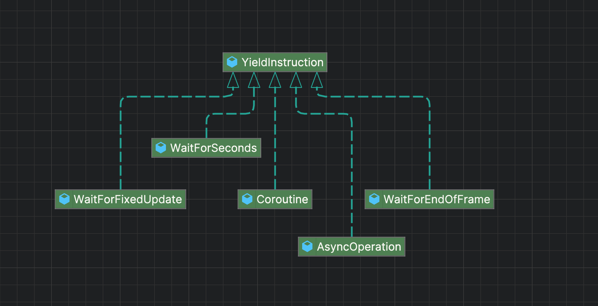
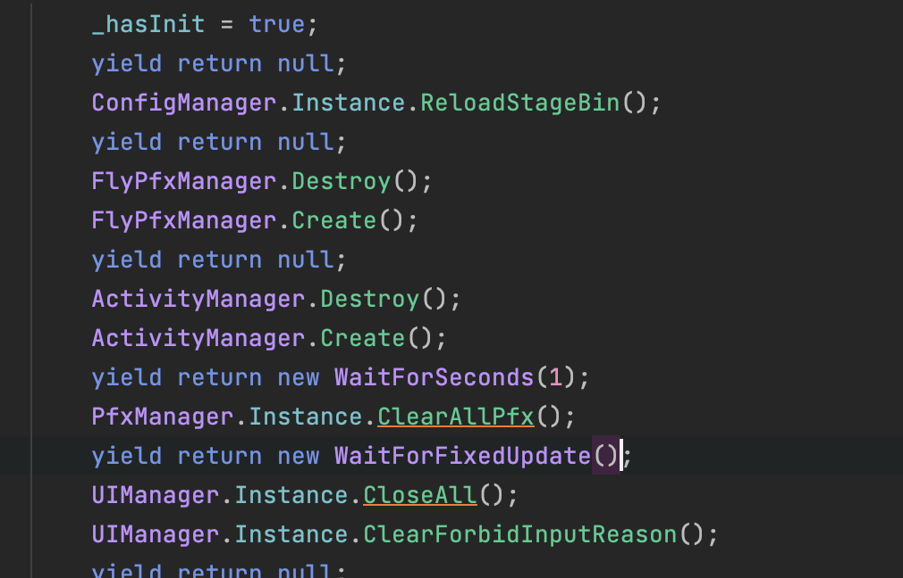
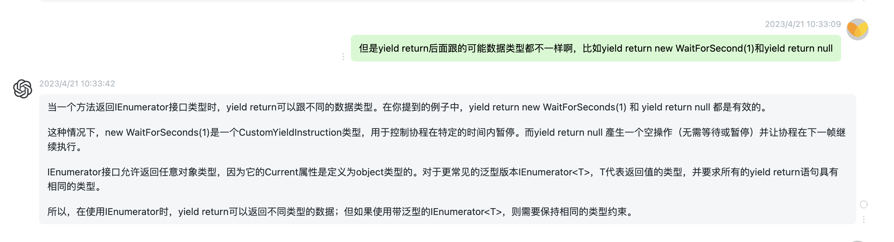

# Unity中的协程和真正的协程并不是一回事

Unity中的协程（Coroutines）并不是严格意义上的“真协程”，而是基于C#迭代器（IEnumerator）和Unity引擎的帧调度机制实现的一种协程模拟

异步是异步, 多线程是多线程

多线程是真线程概念范围内的议题, 而异步的议题不止包含线程, 还包含网络请求、文件读取等和物理硬件相关的范畴

因为网络请求和文件读取等与物理硬件交互的过程并不占用线程, 因此在进行类似操作的时候, 线程上是可以执行别的任务的. 这种情况是异步

在多线程的范畴里, 由于多个任务确实就是并行地执行的, 我们也将其看成了异步

但是要注意的是, 我们Unity开发者调用Unity底层API的时候, 就拿网络请求和加载资源来说, Unity都会给我们提供两种类型的接口, 一种是异步, 一种是同步. 这两种接口都是I/O密集型操作, 因为Unity是单线程嘛. 如果你常常陷入纠结网络和资源加载的内部实现是怎样的 不利于你了解异步的本质, 


所以妄图使用协程来做一些CPU密集型的工作是根本不可能的, 因为协程本质上还是运行在一个进程上, 协程反而适合那些I/O密集型的操作, 因为这类操作并不真的会占用CPU的执行时间, 这段时间的CPU只是在空转而已, 或者我们希望使用协程达成一种延时的效果

yield和await都能实现异步, 区别是什么?

而多线程我们往往会用多线程来做一些CPU密集型的任务, 我们会决定这些任务的具体实现, 或许会让你更好理解

# Unity协程的局限性

依赖主线程：所有协程代码在主线程执行，长时间运行的操作会阻塞渲染和逻辑更新。
无独立栈：协程的“暂停”状态由IEnumerator保存局部变量，而非独立的执行栈。
无法跨线程：无法在后台线程中启动或恢复协程。
# 为什么说Unity协程是“伪协程”？

被动调度：协程的恢复完全由Unity引擎控制，而非主动让出给其他协程。
单线程限制：无法利用多核CPU实现并行计算，仅适用于异步等待或分帧处理。
基于迭代器：底层实现是状态机（IEnumerator），而非真正的协程原语。


# 关于yield return

```
using System;
using System.Collections;
public class C {
    public void M() {
        
    }
    
    public IEnumerator A(){
        Console.WriteLine("SaySomething");
        yield return new BClass(0); 
        Console.WriteLine("SaySomething");
        yield return new BClass(1);
        Console.WriteLine("SaySomething");
    }
    
    public class BClass{
        public BClass(int idx){
            
        }
    }
}
```
在`SharpLab`中处理之后:
```
using System;
using System.Collections;
using System.Collections.Generic;
using System.Diagnostics;
using System.Reflection;
using System.Runtime.CompilerServices;
using System.Security;
using System.Security.Permissions;

[assembly: CompilationRelaxations(8)]
[assembly: RuntimeCompatibility(WrapNonExceptionThrows = true)]
[assembly: Debuggable(DebuggableAttribute.DebuggingModes.Default | DebuggableAttribute.DebuggingModes.IgnoreSymbolStoreSequencePoints | DebuggableAttribute.DebuggingModes.EnableEditAndContinue | DebuggableAttribute.DebuggingModes.DisableOptimizations)]
[assembly: SecurityPermission(SecurityAction.RequestMinimum, SkipVerification = true)]
[assembly: AssemblyVersion("0.0.0.0")]
[module: UnverifiableCode]
[module: RefSafetyRules(11)]

public class C
{
    public class BClass
    {
        public BClass(int idx)
        {
        }
    }


    [CompilerGenerated]
    private sealed class <A>d__1 : IEnumerator<object>, IEnumerator, IDisposable
    {
        private int <>1__state;

        private object <>2__current;

        public C <>4__this;

        object IEnumerator<object>.Current
        {
            [DebuggerHidden]
            get
            {
                return <>2__current;
            }
        }

        object IEnumerator.Current
        {
            [DebuggerHidden]
            get
            {
                return <>2__current;
            }
        }

        [DebuggerHidden]
        public <A>d__1(int <>1__state)
        {
            this.<>1__state = <>1__state;
        }

        [DebuggerHidden]
        void IDisposable.Dispose()
        {
        }

        private bool MoveNext()
        {
            switch (<>1__state)
            {
                default:
                    return false;
                case 0:
                    <>1__state = -1;
                    Console.WriteLine("SaySomething");
                    <>2__current = new BClass(0);
                    <>1__state = 1;
                    return true;
                case 1:
                    <>1__state = -1;
                    Console.WriteLine("SaySomething");
                    <>2__current = new BClass(1);
                    <>1__state = 2;
                    return true;
                case 2:
                    <>1__state = -1;
                    Console.WriteLine("SaySomething");
                    return false;
            }
        }

        bool IEnumerator.MoveNext()
        {
            //ILSpy generated this explicit interface implementation from .override directive in MoveNext
            return this.MoveNext();
        }

        [DebuggerHidden]
        void IEnumerator.Reset()
        {
            throw new NotSupportedException();
        }
    }

    public void M()
    {
    }

    [NullableContext(1)]
    [IteratorStateMachine(typeof(<A>d__1))]
    public IEnumerator A()
    {
        <A>d__1 <A>d__ = new <A>d__1(0);
        <A>d__.<>4__this = this;
        return <A>d__;
    }
}

```

我曾经以为, 只有WaitForSeconds、资源的异步操作等才可以被yield return, 但我是对yield return的理解出现偏差了. 任何数据结构都可以被yield return, 看过上面的代码我想你应该就清楚了, yield return只是在状态机里面一个新增一个状态, 然后在这个状态的分支中执行从上一个`yield return`(不包含), 到这一个`yield return`(包含)之间的代码

而在MonoBehaviour中, 实现可能是这样的:
```
class MyMonoBehaviour
{
    private List<IEnumerator> _coroutineLists = new List<IEnumerator>();
    public Coroutine StartCoroutine(IEnumerator coroutine)
    {
        // 某种手段 将IEnumerator转换成Coroutine
        return Coroutine;
    }

    void CoroutineUpdate()
    {
        foreach (var coroutine in _coroutineLists)
        {
            if (coroutine.Current is AsyncOperation asyncOperation)
            {
                if (asyncOperation.isDone)
                {
                    coroutine.MoveNext();
                }
            }
            else
            {
                coroutine.MoveNext();
            }
        }
    }
}
```


yield return语法糖 编译器背后会帮我们生成代码

在Unity中迭代器多用来实现异步, Unity要使用迭代器来实现异步, 是基于Unity的MonoBehaviour和UnityEngine命名空间下的`YieldInstruction`基类的

我们首先来看一下, 在一个迭代器中, 对一个被yield return的对象干了什么?

在Unity中, StartCoroutine里面的代码可能是这样的:



# Unity开发者视角下的IEnumerator

笔者对迭代器的理解是有所偏差的, 源自迭代器在Unity中的使用, Unity为我们实现了一个名为`YieldInstruction`的类, 

# 背景

编写的几乎所有程序都需要循环访问集合，因此需要编写代码来检查集合中的每一项。

迭代器可以读取集合中的数据，但是不能从底层修改集合，因为迭代器的实现方法中只实现了Get方法，所以不能对集合中的数据进行修改

语法糖：计算机中添加某种语法，这种语法对语言功能没有影响，但是更方便程序员使用，语法糖让代码更加简洁，有更高的可读性

# IEnumerable和IEnumerator

`IEnumerable`和`IEnumerator`本质是两个接口，二者的源码如下：

```C#
// Decompiled with JetBrains decompiler
// Type: System.Collections.IEnumerator
// Assembly: netstandard, Version=2.1.0.0, Culture=neutral, PublicKeyToken=cc7b13ffcd2ddd51
// MVID: 5A41D6B7-1898-42EC-A409-FD0B1C3E3DCF
// Assembly location: /Applications/2021.3.14f1/Unity.app/Contents/NetStandard/ref/2.1.0/netstandard.dll

namespace System.Collections
{
  /// <summary><para>Supports a simple iteration over a non-generic collection.</para></summary>
  public interface IEnumerator
  {
    /// <summary><para>Gets the current element in the collection.</para></summary>
    object Current { get; }

    /// <summary><para>Advances the enumerator to the next element of the collection.</para></summary>
    bool MoveNext();

    /// <summary><para>Sets the enumerator to its initial position, which is before the first element in the collection.</para></summary>
    void Reset();
  }
}

```

```C#
// Decompiled with JetBrains decompiler
// Type: System.Collections.IEnumerable
// Assembly: netstandard, Version=2.1.0.0, Culture=neutral, PublicKeyToken=cc7b13ffcd2ddd51
// MVID: 5A41D6B7-1898-42EC-A409-FD0B1C3E3DCF
// Assembly location: /Applications/2021.3.14f1/Unity.app/Contents/NetStandard/ref/2.1.0/netstandard.dll

namespace System.Collections
{
  /// <summary><para>Exposes an enumerator, which supports a simple iteration over a non-generic collection.</para></summary>
  public interface IEnumerable
  {
    /// <summary><para>Returns an enumerator that iterates through a collection.</para></summary>
    IEnumerator GetEnumerator();
  }
}
```

二者的区别与联系：

一个集合可查询（使用foreach，where，any等），必须以某种方式返回IEnumerator object，也就是必须实现IEnumerable接口

IEnumerator object具体实现了iterator（通过MoveNext(),Reset(),Current）。

从这两个接口的选词上，可以看出IEnumerable是一个声明式的接口，声明实现该接口的class是“可枚举的”

IEnumerable和IEnumerator通过IEnumerable的GetEnumerator()方法建立了连接。

看一个例子：

```C#
using System.Collections;

namespace learnIEnumerator
{
    public class Person
    {
        public string Name { set; get; }

        public Person(string name)
        {
            Name = name;
        }

        public void ShowName()
        {
            Console.WriteLine(Name);
        }
    }

    public class PeopleEnum : IEnumerator
    {
        public Person[] _person;
        int position = -1;

        public PeopleEnum(Person[] person)
        {
            _person = person;
        }


        public bool MoveNext()
        {
            position++;
            return (position < _person.Length);
        }

        public void Reset()
        {
            position = -1;
        }

        public object Current
        {
            get
            {
                try
                {
                    return _person[position];
                }
                catch (Exception e)
                {
                    Console.WriteLine(e);
                    throw new InvalidOperationException();
                }
            }
        }
    }


    public class PersonSet : IEnumerable
    {
        private Person[] people;

        public PersonSet(Person[] pArray)
        {
            people = new Person[pArray.Length];
            for (int i = 0; i < pArray.Length; i++)
            {
                people[i] = pArray[i];
            }
        }

        public IEnumerator GetEnumerator()
        {
            // 调用了构造函数吧？
            // 类的声明其实就是调用构造函数的过程
            return new PeopleEnum(people);
        }
    }


    // 我现在疑惑的点就在于，必须要在Person类的基础上再套一个People List的类么？
    // 拿最简单的int和 int[]
    // int 相当于 Person 代表每一个Person的实例，它停留在个体这个层面
    // int[] 相当于 People 它里面是要实现集合以外，而且继承IEnumerable接口，说明它是可以枚举的，它是集合这个层面的
    // 然后我们还需要去自定义一个迭代器，来实现对于People的枚举

    // 再抽象一下
    // 我们要实现枚举我们自定义的数据结构，我们需要实现三个类
    // 1.数据结构的定义，也就是每个个体它有哪些属性
    // 2.包含1中数据结构的集合，除此之外该集合继承IEnumerable接口，调用GetEnumerator方法
    // 3。实现GetEnumerator方法

    class Program
    {
        static void Main(string[] args)
        {
            Person[] person = new Person[4]
            {
                new Person("李磊"),
                new Person("王刚"),
                new Person("彤彤"),
                new Person("丹丹"),
            };

            PersonSet listPeople = new PersonSet(person);
            foreach (Person p in listPeople)
            {
                Console.WriteLine(p.Name);
            }
        }
    }
}
```

以上代码中有三个不太理解的点：

- 属性（Property）

  属性是类、结构和接口的命名成员。类或结构中的成员变量或者方法称为域（Field）。属性是域的扩展，并且可以使用相同的语法来访问。它们使用访问器（Accessors）让私有域的值可以被读写或者操作。属性不会确定存储位置，相反，它们具有可读写或计算它们值的访问器。例如，有一个名为Student的类，带有age、name和code的私有域。我们不能在类的范围以外直接访问这些域，但是我们可以拥有访问这些私有域的属性。在IEnumerator中，我们需要重写一个object类型的Current属性：

    ```C#
    // Current 的真实数据类型应该和 _people[poistion]的数据类型一致
    public object Current
    {
        get
        {
            try
            {
                return _people[position];
            }
            catch (Exception e)
            {
                Console.WriteLine(e);
                throw new InvalidOperationException();
            }
        }
    }
    ```

在对上面三点进行了了解之后，我现在对IEnumerator和IEnumerable做一个总结：

如果我们要实现枚举我们自己定义的数据结构的功能，我们总共要实现三个类：

1. 我们自己定义的数据结构的类，也就是我们要枚举的每一个元素的类
2. 包含我们自定义数据结构的类的类，也就是集合，这个类要继承IEnumerable接口，重写GetEnumerator函数
3. 枚举我们定定义数据结构的类，也就是枚举器，继承IEnumerator接口，重写MoveNext方法、Reset方法和Current

其中最困扰我的是第二个类，或者说foreach的用法，我们在调用GetEnumerator方法的时候会向其中传入我们要枚举的自定义数据结构的数组，通过return语句新建的PeopleEnum类中传的people参数是关键，它告诉了枚举器我们要枚举什么类型的数据，以及枚举的数据有哪些。

```c#
public class PersonSet : IEnumerable
    {
  			// people就是我们要枚举的集合
        private Person[] people;

        public PersonSet(Person[] pArray)
        {
            people = new Person[pArray.Length];
            for (int i = 0; i < pArray.Length; i++)
            {
                people[i] = pArray[i];
            }
        }

        public IEnumerator GetEnumerator()
        {
            // 调用了构造函数吧？
            // 类的声明其实就是调用构造函数的过程
          
          	// 这一行代码十分关键，它把枚举器和我们要枚举的集合联系到一起了
          	// 这行代码告诉我们的枚举器类我们要枚举的数据是什么、有哪些
            return new PeopleEnum(people);
        }
    }
```

# yield关键字

yield关键字是一个语法糖，背后其实生成了一个新的类，是一个枚举器，枚举器具体实现了MoveNext、Reset和Current。

先看一段代码，通过`yield return`实现了类似用foreach便遍历数组的功能，说明yield return也是用来实现迭代器的功能的

```C#
using static System.Console;
using System.Collections.Generic;

class Program
{
    //一个返回类型为IEnumerable<int>，其中包含三个yield return
    public static IEnumerable<int> enumerableFuc()
    {
        yield return 1;
        yield return 2;
        yield return 3;
    }

    static void Main(string[] args)
    {
        //通过foreach循环迭代此函数
        foreach (int item in enumerableFuc())
        {
            WriteLine(item);
        }

        ReadKey();
    }
}
```

上面代码的输出结果将会是：`1 2 3`。

如果我在代码中加入`yield break`：

```C#
yield return 1;
yield return 2;
yield break;
yield return 3;
```

那么结果就只会输出1和2，说明这个迭代器被yield break给停掉了，所以yield break是用来终止迭代的。

我们现在把上面遍历人名的那个程序改写成`yield`的形式看一下：

```C#
namespace learnIEnumerator
{
    public class Person
    {
        public string Name { set; get; }

        public Person(string name)
        {
            Name = name;
        }

        public void ShowName()
        {
            Console.WriteLine(Name);
        }
    }

    public class PersonSet
    {
        private Person[] people;

        public PersonSet(Person[] pArray)
        {
            people = new Person[pArray.Length];
            for (int i = 0; i < pArray.Length; i++)
            {
                people[i] = pArray[i];
            }
        }

        public IEnumerable<Str4ing> PersonEnum()
        {
            for (int i = 0; i < people.Length; i++)
            {
                yield return people[i].Name;
            }
        }

        class Program
        {
            static void Main(string[] args)
            {
                Person[] person = new Person[4]
                {
                    new Person("李磊"),ty
                    new Person("王刚"),
                    new Person("彤彤"),
                    new Person("丹丹"),
                };

                PersonSet listPerson = new PersonSet(person);
                IEnumerator<String> enumerator = listPerson.PersonEnum().GetEnumerator();
                while (enumerator.MoveNext())
                {
                    String current = enumerator.Current;
                    Console.WriteLine(current);
                }
            }
        }
    }
}
```

再来看一段代码：

```C#
public static IEnumerable<int> Fibonacci(int count)
{
    int prev1 = 0;
    int prev2 = 1;
    
    for (int i = 0; i < count; ++i)
    {
        int current = prev1 + prev2;
        yield return current; // 使用yield return返回当前值
        
        prev1 = prev2;
        prev2 = current;
    }
}
```

在这段代码中我们使用了for循环嵌套了一个`yield return` 语句，我在这里时常会有一个误区就是，我会习惯性地认为for循环是用来实现`MoveNext`的方法的，但其实不是，因为看这段代码

```C#
    public static IEnumerable<int> enumerableFuc()
    {
        yield return 1;
        yield return 2;
        yield return 3;
    }
```

它里面没有for循环但是依然可以实现`MoveNext`的功能啊😂，所以无论是使用for循环还是把所有元素罗列出来，这个环节的目的都是为了告诉yield return自动生成的那个迭代器它要遍历的这个集合中有多少个元素，仅此而已，`MoveNext`会被编译器隐式地处理，完全不需要我们操心。

还有一点，我们一个IEnumerable方法中只会生成一个迭代器，理解一下这句话，还是蛮重要的，回顾一下迭代器模式中的四个角色，有一个叫做具体聚合角色，有一个叫做具体迭代器角色，具体迭代器迭代的就是具体聚合角色 （集合），集合本质就是一类事物的组合，因此我们只需要使用一个迭代器就可以完成对这一个集合的全部遍历了，我之前存在的一个误区是我认为每调用一次yield语句就会生成一个迭代器。

最后再来看看使用了yield语句后我们可以少写哪些代码，我们首先不需要自己编写具体的迭代器类了，相对应的抽象迭代器类也不需要了，我们现在只需要在具体聚合类中定义一下获取迭代器的方法就可以了。所以真的好省事啊！

一般我们会在协程中处理各种各样的业务嘛，比如下图：



可以看到里面yield return的东西五花八门，但是牢记我们上面讲到的，遍历一个具体聚合角色只会有一个迭代器，来看看ChatGPT怎么说：



我们现在理解一下StartCoroutine方法，该方法里面会传入一个IEnumerator类型的方法，所以我们类比一下调用StartCoroutine方法就相当于是使用了foreach，看一下伪代码：

```C#
public class YieldExample
{
    public static IEnumerable<int> GetValues(int count)
    {

       for (int i = 1; i <= count; i++)
        {
            yield return i;
        }

    }
}
class Program
{
    static void Main(string[] args)
    {
        // 调用静态方法GetValues，获取迭代器
        IEnumerable<int> valuesEnumerable = YieldExample.GetValues(5);

        Console.WriteLine("Type of the GetEnumerator instance: " + valuesEnumerable.GetType().FullName);

        // 使用foreach循环遍历迭代器
        foreach (int value in valuesEnumerable)
        {
            Console.WriteLine(value);
        }
    }
}
```

当我们调用了StartCoroutine方法后类似于调用了foreach循环，会不断遍历整个集合，但是在Unity的StartCoroutine方法中它所遍历的集合是执行时机的集合，因为在Unity的协程中我们一般yield return的都是一些协程再执行的时机，而且仔细想想协程的运作方式跟纯C#还不一样，在纯C#中我们需要用yield return返回我们要遍历的集合的元素，比如上面这段代码

而协程的代码：

```C#
FlyPfxManager.Create();
ActivityManager.Create();
yield return null;
PlayDefine.Init();
PlayViewDefine.Init(1.5f);
yield return null;
CmdManager.Create();
yield return null;
DataManager.Create();
yield return null;
AuthManager.Create();
```

我们的目的是在一段时间内执行很多种方法，yield return返回的元素不是我们想要的东西，它是我们达到异步的手段，我认为这是协程和纯C#中IEnumerator的区别

总之就是使用StartCoroutine和foreach都能达到遍历一个具体聚合角色的所有元素的作用，但是它们遍历这个集合元素的目的是不同的，StartCoroutine遍历集合是为了实现时间间隔，而纯C#的foreach遍历集合是为了展示或者读取到（只读）集合中所有元素的信息。

那我想协程到此应该就理解了，比如我们定义了一个`IEnumerator Func()`，那么我们会使用`StartCoroutine(Func());`，因此，`Func()`就是一个具体聚合角色（一个集合）而StartCoroutine就是一个迭代器，它去遍历整个`Func()`集合，所以说协程的本质是迭代器好像没什么问题。

关于`IEnumerator`、`IEnumerable`和`yield`的探讨就先告一段落了。

# 小结

今天是项目的验收环节，工作比较少，所以花了一天的时间写完了这篇博客，本篇博客从IEnumerator和IEnumerable出发，引出了类和接口的辨析、C#中的修饰符、虚函数和抽象函数的区别辨析等等很多零碎的知识点，真的是收获满满。

