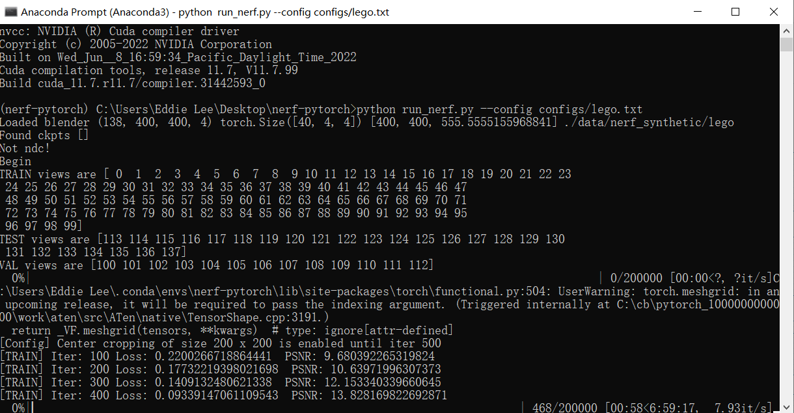

# 环境安装

CUDA安装参考https://www.bilibili.com/video/BV1nL4y1b7oT/?spm_id_from=333.337.search-card.all.click&vd_source=83f4165825ce9df46cf4fd576ccb1102

实现多版本CUDA共存

Github仓库例子 https://github.com/yenchenlin/nerf-pytorch

使用Anaconda创建虚拟环境

查看电脑的支持的CUDA版本

```cmd
nvcc -V
```

要安装CUDA https://developer.nvidia.com/cuda-toolkit-archive

CuDNN目前最高支持到CUDA11

CuDNN https://developer.nvidia.cn/rdp/cudnn-archive

低版本Pytorch好像可以运行高版本Cuda？



# NeRF-pytorch

[NeRF](http://www.matthewtancik.com/nerf) (Neural Radiance Fields) 是一种获得最先进结果的方法，用于合成复杂场景的新视图.


## 安装

```
git clone https://github.com/yenchenlin/nerf-pytorch.git
cd nerf-pytorch
pip install -r requirements.txt
```


  ## 安装依赖

  - PyTorch 1.4
  - matplotlib
  - numpy
  - imageio
  - imageio-ffmpeg
  - configargparse

## 运行

### 

训练低分辨率 `lego` NeRF:

```
python run_nerf.py --config configs/lego.txt
```

训练结果在`logs/lego_test/lego_test_spiral_100000_rgb.mp4`.


---

训练低分辨率 `fern` NeRF:

```
python run_nerf.py --config configs/fern.txt
```

 200k次迭代 ，结果在 logs/fern_test/fern_test_spiral_200000_rgb.mp4` and `logs/fern_test/fern_test_spiral_200000_disp.mp4


---

### 更多数据

文件目录

```
├── configs                                                                                                       
│   ├── ...                                                                                     
│                                                                                               
├── data                                                                                                                                                                                                       
│   ├── nerf_llff_data                                                                                                  
│   │   └── fern                                                                                                                             
│   │   └── flower  # downloaded llff dataset                                                                                  
│   │   └── horns   # downloaded llff dataset
|   |   └── ...
|   ├── nerf_synthetic
|   |   └── lego
|   |   └── ship    # downloaded synthetic dataset
|   |   └── ...
```

---

To train NeRF on different datasets: 

```
python run_nerf.py --config configs/{DATASET}.txt
```

replace `{DATASET}` with `trex` | `horns` | `flower` | `fortress` | `lego` | etc.

---

To test NeRF trained on different datasets: 

```
python run_nerf.py --config configs/{DATASET}.txt --render_only
```

replace `{DATASET}` with `trex` | `horns` | `flower` | `fortress` | `lego` | etc.


### Pre-trained Models

You can download the pre-trained models [here](https://drive.google.com/drive/folders/1jIr8dkvefrQmv737fFm2isiT6tqpbTbv). Place the downloaded directory in `./logs` in order to test it later. See the following directory structure for an example:

```
├── logs 
│   ├── fern_test
│   ├── flower_test  # downloaded logs
│   ├── trex_test    # downloaded logs
```

### Reproducibility 

Tests that ensure the results of all functions and training loop match the official implentation are contained in a different branch `reproduce`. One can check it out and run the tests:

```
git checkout reproduce
py.test
```

## 参考

[NeRF: Representing Scenes as Neural Radiance Fields for View Synthesis](http://tancik.com/nerf)  
 [Ben Mildenhall](https://people.eecs.berkeley.edu/~bmild/)\*<sup>1</sup>,
 [Pratul P. Srinivasan](https://people.eecs.berkeley.edu/~pratul/)\*<sup>1</sup>,
 [Matthew Tancik](http://tancik.com/)\*<sup>1</sup>,
 [Jonathan T. Barron](http://jonbarron.info/)<sup>2</sup>,
 [Ravi Ramamoorthi](http://cseweb.ucsd.edu/~ravir/)<sup>3</sup>,
 [Ren Ng](https://www2.eecs.berkeley.edu/Faculty/Homepages/yirenng.html)<sup>1</sup> <br>
 <sup>1</sup>UC Berkeley, <sup>2</sup>Google Research, <sup>3</sup>UC San Diego  
  \*denotes equal contribution  


> 神经辐射场是一个简单的全连接网络（权重为 ~5MB），经过训练，可以使用渲染损失重现单个场景的输入视图。网络直接从空间位置和观看方向（5D 输入）映射到颜色和不透明度（4D 输出），充当“体积”，因此我们可以使用体积渲染来区分渲染新视图
