[学习链接](https://www.bilibili.com/video/BV1d34y1n7fn)

大纲：

部分一：为何我们要从图片中生成三位内容

什么是三维内容

渲染和反渲染

三个反渲染中的关键因素

部分二：为什么NeRF进来如此火爆

将NeRF拆解成三个主要的成分

NeRF可带走的信息

如何将NeRF拓展到Unbounded scene和anti-aliasing（抗锯齿）

部分三：可编辑的三维内容

重新打光、材料的编辑

风格化的三位内容生成

其他的编辑

# 为何我们要从图片中生成三维内容

## 什么是三维内容

三维场景中的各种物体

VRPainting

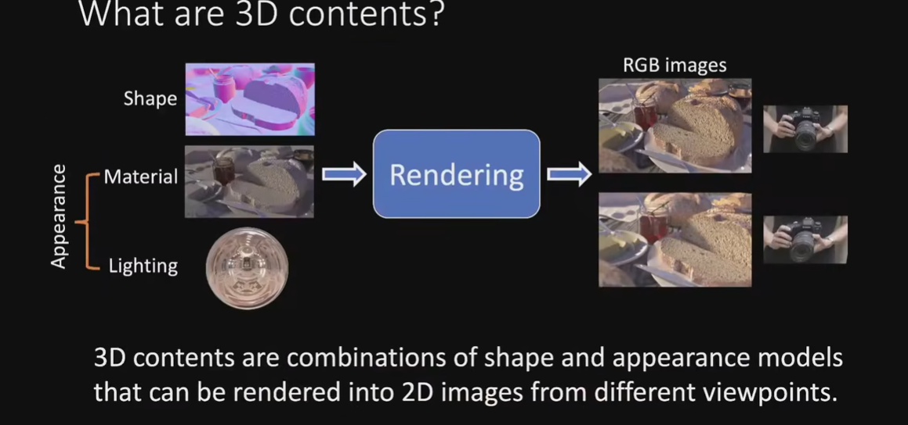

三维内容包含：形状、材料、光通过渲染变成一张图片

那么为何要从图片中生成三维内容？

传统的三维内容创作十分的耗时

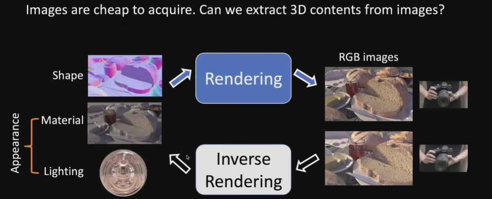

## 渲染和反渲染

所以渲染是将三维内容渲染成照片 计算机图形学

反渲染是将照片还原成三维内容（Inverse Rendering）计算机视觉

**三维重建也属于反渲染，侧重点在于重建几何，与NeRF是有一些区别的**

## 三个重要的因素

我们应该选择怎样的形状表征

我们如何去表征外观

有了形状和外观的表征之后我们该如何使用

### 常见的形状表征方式

Mesh

点云

Occupancy field

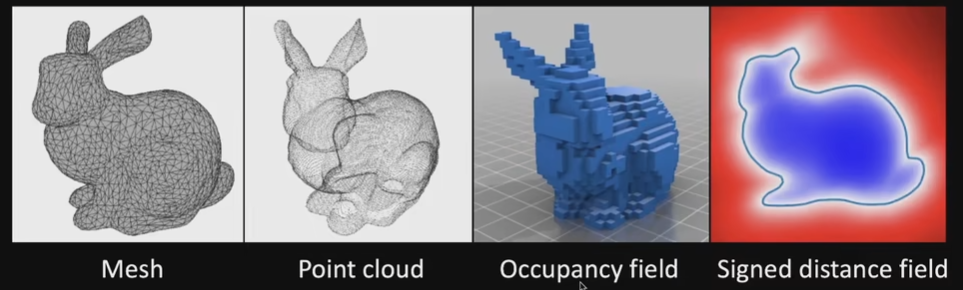

Signed distance field：在物体外部距离为负，在物体内部距离为正

### 外表的表征方式

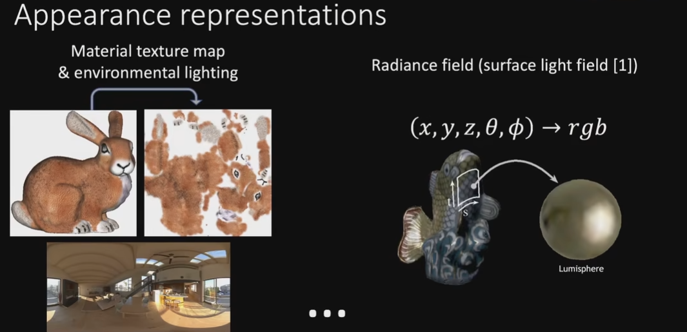

光照信息和物体的材质信息分开存储

右边的例子材料和光照打包在一起，没有办法编辑，在新的环境中的光照会发生改变，外观也会改变很多。surface light field

### 渲染的过程

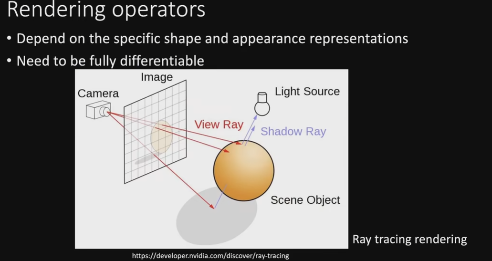

raytracing光追

NeRF的形状不是优势

# 为什么NeRF很重要

 

NeRF的三个重要因素：

shape 

appearance **surface light field**

 rendering 

nerf使用的是**soft shape**这是NeRF成功的最重要的因素

soft shape形象来说像是一团雾

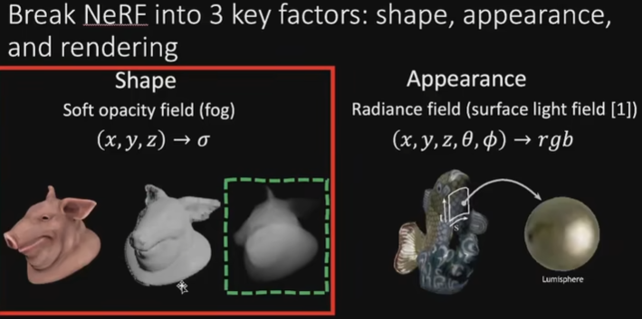

hard-geometry 

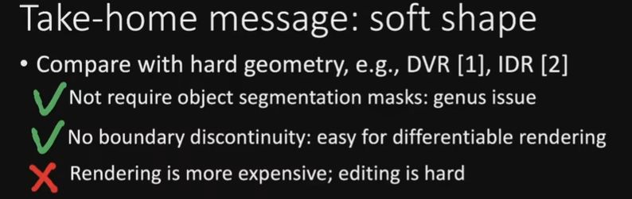

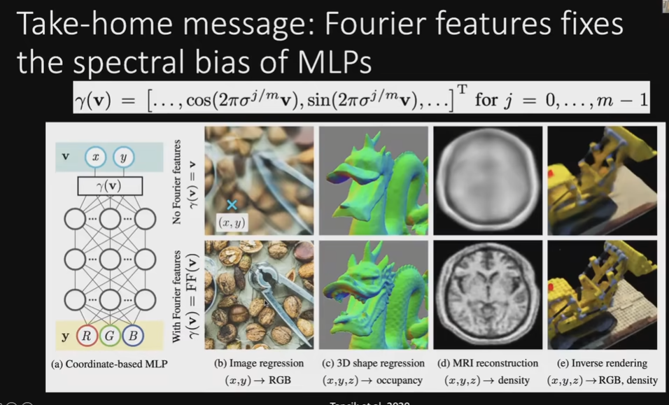

**MLP神经网络？要学**多层感知器  

σ的含义是光在空间中传播递减的速度

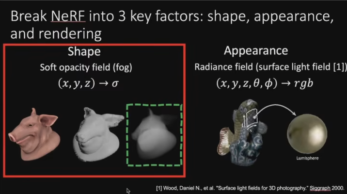

五种拍摄

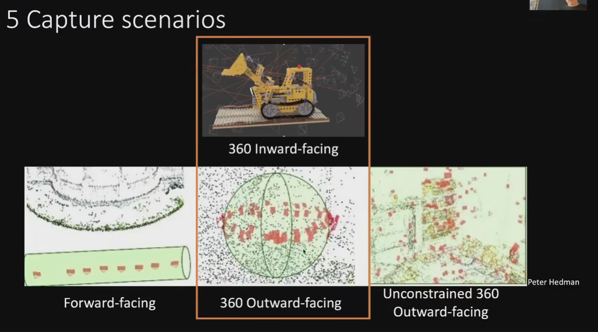

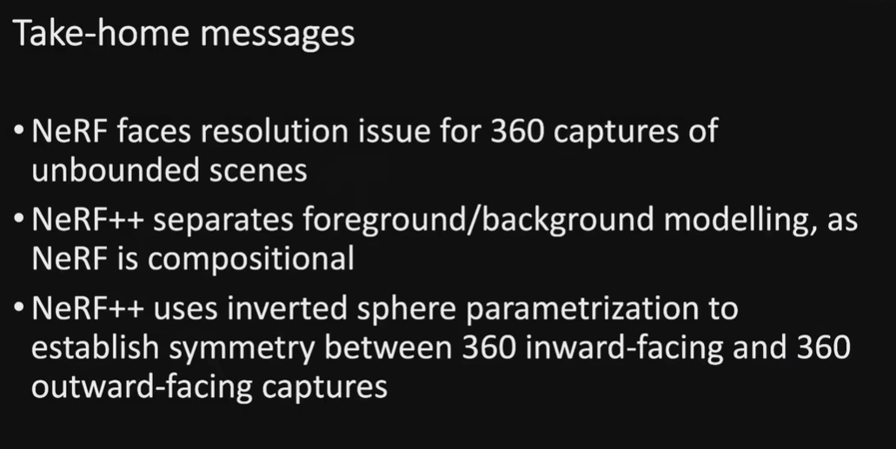
