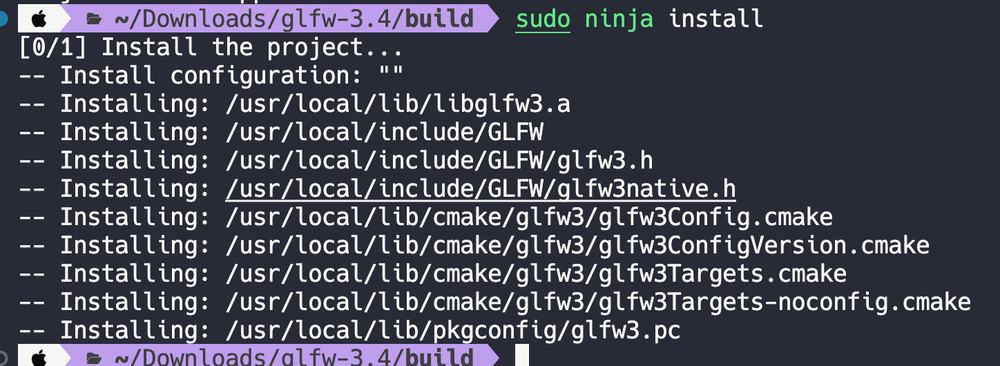
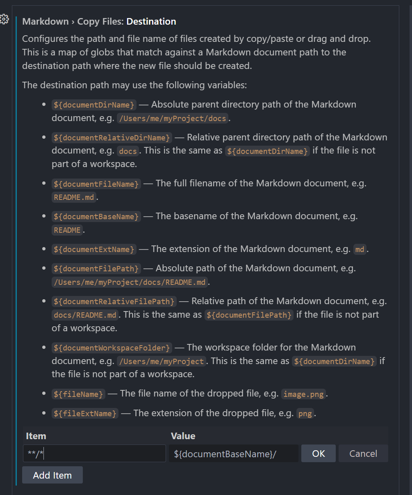

本篇博客记录以[JoeyDeVries](https://github.com/JoeyDeVries)的[OpenGL教程](https://learnopengl.com/Introduction)为指导在`MacOS`和`Windows`系统上搭建OpenGL的过程和疑惑。
在参考的[OpenGL教程](https://learnopengl-cn.github.io/01%20Getting%20started/02%20Creating%20a%20window/)中使用的开发平台是Windows系统上的VisualStudio，但是Mac系统上的VisualStudio不能进行C++开发，为了在Mac和Windows上保持相同的开发体验，我决定在MacOS和Windows上统一使用`VSCode` + `CMake` + `Ninja` + `Clang`的开发方案。

# 前置知识

## OpenGL是什么？

OpenGL十分类似面向对象编程思想中的接口和虚方法，它只是定义了一个框架，而没有任何具体的实现。所有的实现需要显卡生产厂商自己实现。可以说OpenGL是一套规范。

## GLFW和GLAD

GLFW是一个专门针对OpenGL的C语言库，它提供了一些渲染物体所需的最低限度的接口。它允许用户创建OpenGL上下文、定义窗口参数以及处理用户输入。

因为OpenGL只是一个标准/规范，具体的实现是由驱动开发商针对特定显卡实现的。由于OpenGL驱动版本众多，它大多数函数的位置都无法在编译时确定下来，需要在运行时查询。所以任务就落在了开发者身上，开发者需要在运行时获取函数地址并将其保存在一个函数指针中供以后使用。
GLAD是一个开源的库，它能解决我们上面提到的那个繁琐的问题。GLAD的配置与大多数的开源库有些许的不同，GLAD使用了一个在线服务。在这里我们能够告诉GLAD需要定义的OpenGL版本，并且根据这个版本加载所有相关的OpenGL函数。GLAD的作用是管理OpenGL的函数指针，所以在调用任何OpenGL函数之前，我们都需要初始化GLAD。

## C++工具链

将C++从源代码变成可执行程序需要经过四个基本步骤：预编译、编译、汇编、链接。每一步都需要有相应的工具支持，将在C++编译成可执行程序过程中每个环节使用到的工具放在一起，就称这些工具组成了一套C++工具链。目前主流的C++工具链有GNU、LLVM、MSVC等。

## [Clang和LLVM的介绍](https://llvm.org/)

## [Ninja-build](https://ninja-build.org/)介绍

# 准备工作

## 安装[VSCode](https://code.visualstudio.com/)

## 安装[CMake](https://cmake.org/)

Mac上也可以使用Homebrew进行安装

```
brew install cmake
```

## 安装Ninja

1. Mac上使用Homebrew安装Ninja

```
brew install ninja
```

2. Windows上可以在github上的[ninja主页](https://github.com/ninja-build/ninja/releases)进行下载，**将下载完的文件的根目录添加到环境变量中**。

在终端中运行`ninja --version`如果正确显示版本号就说明ninja安装成功了。

## 安装clang

1. Mac上默认使用的C++编译器就是clang 不需要额外下载
2. Windows去到[LLVM](https://github.com/llvm/llvm-project/releases)的Github主页上下载 下载LLVM-win64版本。将下载好的目录下的bin目录设置为环境变量。在终端中运行`clang --verison`如果正确显示版本号说明clang安装成功。

## 编译GLFW源码

去到[GLFW官网](https://www.glfw.org/download.html)下载GFLW源码，解压下载好的源码文件，在终端中进入源码的根目录，创建名为`build`的路径

```
mkdir build
```

要使我们编写的程序正确地调用GLFW库中的方法，我们可以使用动态链接或者静态链接GLFW库的方式，**优先选择静态链接**的方式，因为动态链接的方式需要额外指定一下参数，而且编译成功后运行可执行文件时还有找不到动态链接库的问题，具体细节会在下文会具体阐述。

使用**静态链接方式**要生成静态链接库，Windows下对应的文件是.lib，Mac下对应的文件是.a

CMake可以指定使用何种类型的构建系统，Windows下默认的构建系统是VisualStudio工程，这并不是我们想要的，因此在调用cmake指令的时候要手动指定要构建的系统。另外Windows下默认使用的编译器是VisualStudio编译器，我们也需要指定为clang编译器，所以cmake的完整指令如下：
  
```
cmake .. -G Ninja -D CMAKE_C_COMPILER=clang -D CMAKE_CXX_COMPILER=clang++
```

接着使用`ninja`指令，如果编译成功的话，我们就能在build目录下的src目录下找到对应平台的静态链接库文件了。

使用**动态链接方式**要生成动态链接库，Windows下对应的文件是.dll，Mac下对应的文件是.dylib，动态链接库的编译命令和静态链接库是一样的，但是需要指定一下`BUILD_SHARED_LIBS`参数，注意指定一下要构建的系统，另外还要注意Windows下指定使用的编译器

```
cmake .. -G Ninja -D BUILD_SHARED_LIBS=ON -D CMAKE_C_COMPILER=clang -D CMAKE_CXX_COMPILER=clang++
```
接着使用`ninja`指令

对于MacOS系统，还使用`make install`命令可以把动态链接库安装到本机，可能需要管理员权限。动态库将会被安装到`usr/local/lib`目录，头文件安装到`usr/local/include`。
> 2024.11.30更新
> 笔者使用ninja命令替代了make命令，因此**make install**命令要被替换为**ninja install**，文件会被安装到下面的目录:
> 

执行完上面的操作之后，就可以在`build`目录的`src`目录下看到对应的平台的动态链接库文件了。
**注意** 在Windows下使用`Ninja`构建系统编译出来的动态链接库出了`glfw3.dll`外还会生成一个`glfw3dll.lib`，这两个都是在下文搭建OpenGL开发环境中要使用到的文件。

## 下载GLAD

使用GLAD的[在线服务](https://glad.dav1d.de/)下载所需要的文件。API栏目下的gl的版本一般选择最新的就可以，参考OpenGL教程中要求使用的OpenGL的版本不能低于**3.3**，Profile栏目选择Core，其他的不用配置，点击Generate之后下载生成的压缩包到本地。解压压缩包，文件结构应该如下：
```
.
├── include
│   ├── KHR
│   │   └── khrplatform.h
│   └── glad
│       └── glad.h
└── src
    └── glad.c

```

## VSCodeCoding体验优化

### 设置

使用Mac上的 `Command + ,` 或者Windows上的 `Control + ,` 快捷键可以打开设置页面,在设置页面的右上角选择使用Json模式打开, 将下面的文本粘贴进去，将鼠标悬停在上面可以看到每一个设置的作用。

```
"files.autoSave": "afterDelay",
"files.autoGuessEncoding": true, 
"workbench.list.smoothScrolling": true, 
"editor.cursorSmoothCaretAnimation": "on",
"editor.smoothScrolling": true, 
"editor.cursorBlinking": "smooth",
"editor.mouseWheelZoom": true,
"editor.formatOnPaste": true,
"editor.formatOnType": true,
"editor.formatOnSave": true,
"editor.wordWrap": "on",
"editor.guides.bracketPairs": true,
"editor.suggest.snippetsPreventQuickSuggestions": false,
"editor.acceptSuggestionOnEnter": "smart",
"editor.suggestSelection": "recentlyUsed",
"window.dialogStyle": "custom",
"debug.showBreakpointsInOverviewRuler": true,
"editor.fontFamily": "JetBrains Mono",
"git.ignoreMissingGitWarning": true,
"explorer.confirmDelete": false,
"cmake.configureOnOpen": false,
```

### 插件与字体

**MarkDown插件**

Markdown Preview Enhanced

Markdown All in One

> 2024.8.11更新
> 在VSCode中使用像Typora那样将图片复制到指定路径的方法如下：
> - 首先下载好上面的两个插件
> - 在VSCode的设置中搜索`Markdown › Copy Files: Destination`
> - 添加一对KeyValue如下： Key: `**/*` Value: `${documentBaseName}/`
> 
> 但是我还没有搞懂KeyValue是如何做路径映射的
> [VSCode官网上的参考](https://code.visualstudio.com/docs/languages/markdown)


**代码截图工具** CodeSnap

**图标主题** Material Icon Theme

**代码格式化工具** Prettier - Code formatter

**主题** [OneDarkPro](https://marketplace.visualstudio.com/items?itemName=zhuangtongfa.Material-theme)

**字体** [JetBrains Mono](https://www.jetbrains.com/lp/mono/)

### 智能提示

GLAD和GLFW都是第三方库，在VSCode直接使用是没有提示的。使用Mac上的 `Shift + CMD + P` 或者 Windows上的 `Shift + Control + P` 在弹出的搜索栏中输入`C/C++:Edit Configurations(JSON)`，会新建如下Json文件：
```json
{
    "configurations": [
        {
            "name": "Mac",
            "includePath": [
                "${workspaceFolder}/**"
            ],
            "defines": [],
            "macFrameworkPath": [
                "/Applications/Xcode-15.1.0.app/Contents/Developer/Platforms/MacOSX.platform/Developer/SDKs/MacOSX.sdk/System/Library/Frameworks"
            ],
            "compilerPath": "/usr/bin/clang",
            "cStandard": "c17",
            "cppStandard": "c++17",
            "intelliSenseMode": "macos-clang-arm64"
        }
    ],
    "version": 4
}
```

在`includePath`中将项目的include目录添加进去，保存重启VSCode，编写OpenGL相关代码时就会有提示了。

> 2024.12.9更新 
> 请注意,虽然有智能提示了，但是不代表在编译项目的时候，编译器可以找到对应的头文件
> 我们需要在CMakeList文件中使用`include_directories(${INCLUDE_DIR})`命令添加相关的文件路径

### include头文件第一行报红问题

按照上面的流程设置完之后,点击include的头文件也能跳转到对应头文件的内容中，但是在第一行会有一个红色的波浪线，原因是设置中`clang.diagnostic.enable`选项被打开了，将它关掉就不会有问题了。

# OpenGL环境搭建

## 目录结构

教程的每一个小节是一个小的OpenGL项目，所有小节项目共用相同的`lib`和`include`路径，另外还共用一个`glad.c`脚本。文件目录结构如下，将前文中编译成功的GLFW的库文件和GLAD在线服务中下载下来的文件放入对应的路径。

```
.
├── C1_GettingStart
│   ├── P1_HelloWindow
│   │   ├── CMakeLists.txt
│   │   └── src
│   │       └── main.cpp
│   └── P2_HelloTriangle
│       ├── CMakeLists.txt
│       └── src
│           └── main.cpp
├── C2_Lighting
│   ├── P1_Color
│   │   ├── CMakeLists.txt
│   │   └── src
│   │       └── main.cpp
├── README.md
├── include
│   ├── GLFW
│   │   ├── glfw3.h
│   │   └── glfw3native.h
│   ├── KHR
│   │   └── khrplatform.h
│   └── glad
│       └── glad.h
├── lib
│   ├── glfw3.dll
│   ├── glfw3.lib
│   ├── glfw3dll.lib
│   ├── libglfw.3.4.dylib
│   ├── libglfw.3.dylib -> libglfw.3.4.dylib
│   └── libglfw3.a
└── src
    └── glad.c

```

## 编写测试程序
测试代码来自参考OpenGL教程的[HelloWindow](https://learnopengl-cn.github.io/01%20Getting%20started/03%20Hello%20Window/)章节
```cpp
#include <glad/glad.h>
#include <GLFW/glfw3.h>

#include <iostream>

void framebuffer_size_callback(GLFWwindow *window, int width, int height);
void processInput(GLFWwindow *window);

int main()
{
    // 初始化GLFW
    glfwInit();
    // 设置使用的GLFW最小版本号为3.3
    glfwWindowHint(GLFW_CONTEXT_VERSION_MAJOR, 3);
    glfwWindowHint(GLFW_CONTEXT_VERSION_MINOR, 3);

    // 指定使用OpenGL的核心功能
    glfwWindowHint(GLFW_OPENGL_PROFILE, GLFW_OPENGL_CORE_PROFILE);

#ifdef __APPLE__
    glfwWindowHint(GLFW_OPENGL_FORWARD_COMPAT, GL_TRUE);
#endif

    GLFWwindow *window = glfwCreateWindow(800, 600, "HelloWindow", NULL, NULL);

    if (window == NULL)
    {
        std::cout << "Failed to create GLFW window" << std::endl;
        glfwTerminate();
        return -1;
    }
    glfwMakeContextCurrent(window);

    // GLAD用来管理OpenGL函数指针 调用任何OpenGL的函数之前都需要初始化GLAD
    if (!gladLoadGLLoader((GLADloadproc)glfwGetProcAddress))
    {
        std::cout << "Failed to initialize GLAD" << std::endl;
        return -1;
    }

    glfwSetFramebufferSizeCallback(window, framebuffer_size_callback);

    // 留意窗口和视口的区别
    glViewport(200, 200, 400, 300);

    while (!glfwWindowShouldClose(window))
    {
        processInput(window);

        glClearColor(0.2f, 0.3f, 0.3f, 1.0f);
        glClear(GL_COLOR_BUFFER_BIT);

        glfwSwapBuffers(window);
        glfwPollEvents();
    }

    glfwTerminate();
    return 0;
}

void framebuffer_size_callback(GLFWwindow *window, int width, int height)
{
    glViewport(200, 200, width / 2, height / 2);
}

void processInput(GLFWwindow *window)
{
    if (glfwGetKey(window, GLFW_KEY_ESCAPE) == GLFW_PRESS)
    {
        glfwSetWindowShouldClose(window, true);
    }
}

```

## 编写CMakeList

在Windows和MacOS上通用的`CMakeLists.txt`文件内容如下：

```CMake
cmake_minimum_required(VERSION 3.10)
project(HelloWindow VERSION 0.1.0)

# 使用 C++17 标准
set(CMAKE_CXX_STANDARD 17)
set(CMAKE_CXX_STANDARD_REQUIRED True)

# 设置源代码目录和包含目录
set(SOURCE_DIR "${PROJECT_SOURCE_DIR}/src")
set(INCLUDE_DIR "${PROJECT_SOURCE_DIR}/../../include")
set(LIBRARY_DIR "${PROJECT_SOURCE_DIR}/../../lib")

# 添加头文件目录
include_directories(${INCLUDE_DIR})

# 查找源文件
file(GLOB SOURCES "${SOURCE_DIR}/*.cpp" "${PROJECT_SOURCE_DIR}/../../src/glad.c")

# 添加可执行文件
add_executable(${PROJECT_NAME} ${SOURCES})
if(WIN32)
    target_link_libraries(${PROJECT_NAME} "${LIBRARY_DIR}/glfw3.lib")

    #动态链接库方式 不优先考虑
    #  target_link_libraries(${PROJECT_NAME} "${LIBRARY_DIR}/glfw3dll.lib")
endif()

if(APPLE)
    target_link_libraries(${PROJECT_NAME} "${LIBRARY_DIR}/libglfw3.a")

    # 动态链接库方式 不优先考虑
    # target_link_libraries(${PROJECT_NAME} "${LIBRARY_DIR}/libglfw.3.dylib")
endif()

# 如果是在苹果系统上且如果使用的是静态链接的方式，需要链接额外的框架
if(APPLE)
    target_link_libraries(${PROJECT_NAME} "-framework Cocoa" "-framework OpenGL" "-framework IOKit" "-framework CoreVideo" "-lobjc")
endif()

```
**需要注意**
1. Windows上使用动态链接的方式`target_link_libraries()`中lib文件不是`glfw3.dll`而是`glfw3dll.lib`，另外使用动态链接的方式编译成可执行程序后，还需要把`glfw3.dll`文件复制到可执行程序所在的目录下程序才能够正常运行。因此优先使用静态链接的方式
2. MacOS上如果使用了静态链接的方式需要链接额外的框架

## 构建OpenGL程序

1. 在项目的根目录下创建build
   ```
   mkdir build
   cd build
   ```
2. 执行cmake指令，指定要构建的文件系统和使用的编译器
   ```
   cmake .. -G Ninja -D CMAKE_C_COMPILER=clang -D CMAKE_CXX_COMPILER=clang++
   ```
3. 执行ninja
   ```
   ninja
   ```
编译完成之后就可以在build目录下找到可执行程序了，能够正常运行就说明OpenGL的开发环境搭建完成。

# 参考文章
[OpenGL中文教程](https://learnopengl-cn.github.io)

[OpenGL英文教程](https://learnopengl.com/)

[VSCode+CMake搭建OpenGL开发环境](https://huosk.github.io/2019/12/12/OpenGLDevWithVSCode-CMake/)

[How to build GLFW on Mac OSX 10.13 for use in xcode](https://fdhenard.github.io/build_glfw_on_osx.html)

[LLVM官网](https://llvm.org/)

[Ninja官网](https://ninja-build.org/)

[CMake官网](https://cmake.org/)

[VSCode优化使用体验](https://blog.csdn.net/qq_51173321/article/details/126287293)

[VSCode智能提示](https://blog.csdn.net/cbc000/article/details/80670413?spm=1001.2101.3001.6661.1&utm_medium=distribute.pc_relevant_t0.none-task-blog-2%7Edefault%7ECTRLIST%7ERate-1-80670413-blog-123625515.235%5Ev43%5Econtrol&depth_1-utm_source=distribute.pc_relevant_t0.none-task-blog-2%7Edefault%7ECTRLIST%7ERate-1-80670413-blog-123625515.235%5Ev43%5Econtrol&utm_relevant_index=1)

