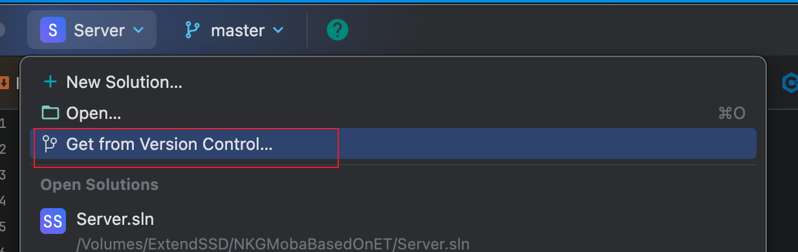
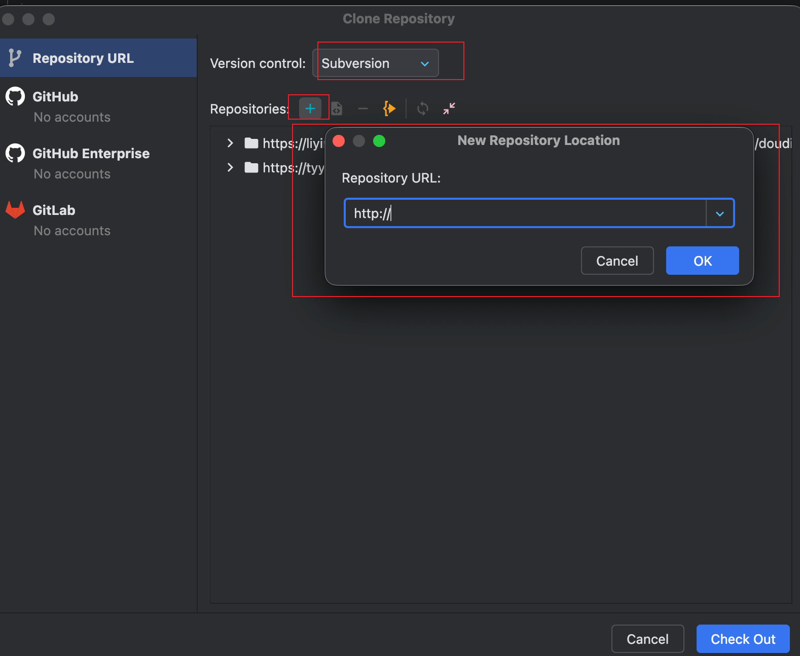

> 2025.10.23
> 我收回对SVN的成见, Rider中集成的Subversion插件还是相当好用的, 除了基础的拉取提交, 还可以切换分支、创建分支、合并分支, 以及有类似git的贮存操作.
> 成见大纯属是因为Mac上的CornerStone太卡太垃圾, Windows上的小乌龟又没有一个像git的Fork一样的可视化图形界面.

> 注意, 本文全程使用Rider中集成的Subversion插件

# SVN中的一些操作

## Create Patch


## Patch与Shelve的区别

**SVN Create Patch（SVN 生成补丁）** 是用来生成你本地文件修改差异（diff）的一个文件，常被称为“补丁文件”或“差异包”。补丁文件可以让别人（或自己）在另一台电脑上、或者另一份代码仓库中**还原/应用这些修改**，而不用你手动合并每一处改动，非常适合代码评审/协作/临时转移代码用。

---

# 具体作用

### 1. **将本地改动导出为补丁文件**
- 包含你对代码的所有增删改内容（不包括没被 `svn add` 的新文件，以及未提交的删除）。
- 补丁本质就是一份标准 **diff 格式**文本。

### 2. **便于代码评审和团队协作**
- 你可以把补丁文件发给同事，让他先“尝试应用”，看到所有修改内容，决定是否合并。
- 比如 `xxx.patch` 或 `xxx.diff` 文件。

### 3. **临时保存修改**
- 有时候你本地已经有多个大改动，不方便直接提交，也可以先生成补丁，转移到其他机器或版本，避免丢失工作。

---

# 用法举例

## A. 命令行方式

生成补丁：

```bash
svn diff > my_change.patch
```

- 这个命令将你所有未提交的变动和文件状态写到 patch 文件里。

## B. GUI工具（如 TortoiseSVN、Rider）

一般右键项目，选择 `Create Patch` 或 `生成补丁`，会弹出内容选择和保存位置的窗口。

---

## 应用补丁（Apply Patch）

- 如果收到一个 patch 文件，可以用 `svn patch my_change.patch` 或者用 TortoiseSVN 的 `Apply Patch` 功能，将它自动合并到你的工作副本。
- 只有你本地是同一目录结构，补丁才会无冲突自动应用。

---

# 总结小结

- **Create Patch** 就是把你对代码的改动（还没提交的差异）导出为补丁文件，便于分享、评审、迁移等。
- 和“直接提交”区别是，补丁只是一个文本diff，没有正式加入仓库历史。
- 通常用于跨团队沟通、代码评审（有时就是“发补丁”而不是“拉分支合并”）、或者对比本地改动等场景。

---

如需举例某工具/某场景下的使用方法，可继续追问！

关于 SVN 中的 **Shelve**（暂存），这里详细解答：

---

## 1. Shelve 是什么？

**SVN Shelve** 作用就是把你当前的代码改动（未提交的、本地的）**临时存起来**，就像 git 的“stash”。这样你可以清理工作副本（回到干净状态），之后再把 shelve 的内容取出来（unshelve/apply），恢复这些改动。

更简单地说：  
就是**把当前没提交的修改“铲到一边”**，等你需要时再拿回来，比 Create Patch 更自动、易用、不怕遗漏。

---

## 2. Shelve 的主要用途

- **临时保存本地改动**，不想提交、不想丢掉，也不想影响后面别的操作（比如拉分支、合并代码）。
- **切换任务**：比如你正在开发A功能，突然急需切回主分支修B bug，就可以 shelve 当前A的改动，然后恢复成干净副本去修BUG，修好再unshelve回来继续搞A。
- **多人评审/调试**：个别工具支持把 shelve 内容发给同事。

---

## 3. Shelve 和 Patch 有什么区别？

| 功能           | Shelve                           | Create Patch             |
| -------------- | -------------------------------- | ------------------------ |
| 保存形式       | 在本地工作副本（或特殊文件夹）    | 生成一个 diff 文件       |
| 还原方式       | 一键 Unshelve                    | 手动 Apply Patch         |
| 是否便于分享   | 不易直接分享（仅本机用）          | 可发给别人用             |
| 操作命令       | `svn shelve` / GUI Shelve        | `svn diff > patch`       |
| 遗漏风险       | 自动识别全部改动，不容易遗漏      | 需手动选取内容           |

---

## 4. Shelve 命令行用法

需要 SVN 1.10 以上版本（旧版本没有），常用命令：

### 保存当前改动

```bash
svn shelve "名称"
```
- 举例：`svn shelve "working-on-BUG-123"`

### 查看 shelve 记录

```bash
svn shelve --list
```

### 取回（恢复）改动

```bash
svn unshelve "名称"
```

### 删除 shelve

```bash
svn shelve --delete "名称"`
```

---

## 5. 在图形工具/IDE（如 Rider、TortoiseSVN）如何用？

- 右键项目目录，通常有 Shelve/Unshelve/管理Shelves 的菜单。
- 操作都在本地，不影响仓库历史，不会推送到远端。

---

## 6. Shelve的典型工作流举例

1. 你改了若干代码，临时有新优先任务。
2. 用 Shelve 先把当前改动全部“暂存”。
3. SVN 自动还原工作副本为最近提交的干净状态。
4. 处理新任务，修完相关内容并提交。
5. 再 Unshelve 刚才 shelve 的内容，恢复原代码进度继续开发。

---

## 7. 总结理解

- **Shelve** 是把本地未提交改动临时“备份”起来，避免干扰别的操作，之后随时可以拿回这些改动。
- 适合频繁切换任务、不能马上提交但又不想丢失的开发场景。
- Patch 适合分享，Shelve 适合自己临时切换。

---

如需具体某工具的菜单、操作图或者命令行举例，请继续问！

## Shelve

看起来有点类似git的贮藏

## 创建不同的ChangeList

使用场景是 你在开发着某一个功能, 有别的产品来找你修改另外的东西, 如果两个工作同时推进的话要改动的东西可能有很多, 所有修改的文件又杂又乱, Svn提供了一个分支的功能, 能创建多个ChangeList在里面放不同的修改文件

## 切换分支

当需要多个版本并行开发的时候, 我最一开始以为每拉取一个新的分支, 我本地就要同步地创建一个该分支的拷贝, 但其实Svn是支持在一个WorkingCopy中进行分支切换的操作的. 有一个Switch命令. 知道有这个功能就好, 因为切换分支会导致Unity的AssetDatabase重新构建, 切换分支的时间开销甚至可能大于额外拉一个新的分支到本地打开这个工程的时间了. 需要权衡.

# 使用Tips

如果要拉一个分支, 不一定要在Terminal里面输入`svn checkout`命令, 可直接在Rider进行下面的操作



# 问题

## 


SVN中的两种冲突
## 1. 文件冲突（file conflict）是什么？

- **文件冲突**指的是：  
    多人对**同一个文件的同一个部分**进行了不同修改。
- 例如：你和同事同时编辑 `a.txt` 的第5行内容，提交更新时就会发生文件冲突。

### 常见表现

- SVN 会把有冲突的部分插入一些 `<<<<<<<`、`=======`、`>>>>>>>` 标记，等你手动合并/选择。
- 你需要打开文件合并或直接重新编辑。

---

## 2. 树冲突（tree conflict）是什么？

- **树冲突**是 SVN 1.6 及以后的概念。
- 所谓“树”其实指**目录结构/文件结构（不是树状控件，也不是数据结构的树，而是整个项目的文件、文件夹组成的目录树）**。
- **树冲突出现在：**  
    针对目录结构操作（如文件/文件夹的新增、重命名、删除、移动）时，不同人对同一部分目录树做了**结构性变化**，并发生了冲突。

### 典型例子

1. **你删除了某个文件/文件夹，同事修改了这个文件**
    - 你删了`A/B/C.cs`，同事还在同一版本上编辑`C.cs`，你们都提交，然后更新。你就会遇到`tree conflict`。
2. **一方移动/重命名目录，另一方在原地新建或修改文件**
3. **父目录被删除、子文件被修改或反之**
4. **任何目录或者文件在结构上发生变化，而非内容修改**


# SVN撤回某一次提交

你想撤销130次提交的内容（可能此后还有131、132、133…的正常提交），只撤销这次的内容，其后的变动继续存在。
操作命令

svn merge -c -130 你的工作副本目录
svn commit -m "撤销r130提交内容"
-c参数后面加上负号-130，表示“撤销 r130”的变更。
执行后记得到工作副本看下变动，再commit。
举例

如你的项目地址为http://xxx.com/svn/project/trunk，你在trunk目录下：

svn merge -c -130 .
svn commit -m "撤销第130次提交"

# SVN插件一直弹出Authoration Required窗口

要你什么证书, 看一下是仓库的路径填的有问题. 改一下仓库的路径就可以!

# SVN查看当前Revision
```shell
svn info
```


# 写一个可以查询当天提交记录的shell脚本
```shell
#!/bin/bash

  
# 用法: ./svn_tag_summary.sh /path/to/your/svn/working_copy


SVN_PATH="$1"

AUTHOR="liyinuo@tuyoogame.com"

TODAY=$(date +"%Y-%m-%d")

  

if [[ ! -d "$SVN_PATH/.svn" ]]; then

echo "路径 $SVN_PATH 不是svn仓库"

exit 1

fi

  

cd "$SVN_PATH" || exit 1

  

# 获取今天该作者的提交记录

svn log -r {${TODAY}T00:00:00}:{${TODAY}T23:59:59} --search "$AUTHOR" --verbose --xml > __svn_today.xml

  

if ! grep -q "<logentry" __svn_today.xml; then

echo "没有今天作者 $AUTHOR 的提交记录"

rm -f __svn_today.xml

exit 0

fi

  

# 取所有 commit message

msgs=$(xmllint --xpath '//logentry[author="'$AUTHOR'"]/msg/text()' __svn_today.xml 2>/dev/null | grep -v '^$')

  

# 各分类字符串

feat_msgs=""

fix_msgs=""

refactor_msgs=""

docs_msgs=""

test_msgs=""

chore_msgs=""

other_msgs=""

  

while IFS= read -r line; do

if [[ "$line" =~ ^\[feat\][[:space:]]*[:：]? ]]; then

feat_msgs="${feat_msgs}${line}"$'\n'

elif [[ "$line" =~ ^\[fix\][[:space:]]*[:：]? ]]; then

fix_msgs="${fix_msgs}${line}"$'\n'

elif [[ "$line" =~ ^\[refactor\][[:space:]]*[:：]? ]]; then

refactor_msgs="${refactor_msgs}${line}"$'\n'

elif [[ "$line" =~ ^\[docs\][[:space:]]*[:：]? ]]; then

docs_msgs="${docs_msgs}${line}"$'\n'

elif [[ "$line" =~ ^\[test\][[:space:]]*[:：]? ]]; then

test_msgs="${test_msgs}${line}"$'\n'

elif [[ "$line" =~ ^\[chore\][[:space:]]*[:：]? ]]; then

chore_msgs="${chore_msgs}${line}"$'\n'

else

other_msgs="${other_msgs}${line}"$'\n'

fi

done <<< "$msgs"

echo "作者: $AUTHOR 今天的提交分类如下："

echo

  

if [ -n "$feat_msgs" ]; then

echo "---------------- [feat] ----------------"

echo "$feat_msgs"

fi

  

if [ -n "$fix_msgs" ]; then

echo "---------------- [fix] ----------------"

echo "$fix_msgs"

fi

  

if [ -n "$refactor_msgs" ]; then

echo "---------------- [refactor] ----------------"

echo "$refactor_msgs"

fi

  

if [ -n "$docs_msgs" ]; then

echo "---------------- [docs] ----------------"

echo "$docs_msgs"

fi

  

if [ -n "$test_msgs" ]; then

echo "---------------- [test] ----------------"

echo "$test_msgs"

fi

  

if [ -n "$chore_msgs" ]; then

echo "---------------- [chore] ----------------"

echo "$chore_msgs"

fi

  

if [ -n "$other_msgs" ]; then

echo "---------------- [other] ----------------"

echo "$other_msgs"

fi

  

rm -f __svn_today.xml
```

### 1. SVN 删除一个文件后如何用命令行提交这个修改

删除文件后，请按以下步骤操作：

#### （1）删除文件

```
svn delete 文件名
# 比如
svn delete test.txt
```

或者直接

```
svn del test.txt
```

#### （2）提交删除操作

```
svn commit -m "删除了test.txt文件"
```

---

### 2. SVN 使用命令行 Add to working copy

如果您想将某个文件或目录添加到您的工作副本（working copy），即包含到版本控制，命令如下：

#### （1）添加文件或目录

```
svn add 文件名或目录名
# 比如
svn add newfile.txt
```

如果是新文件夹，可以递归添加内部全部新文件：

```
svn add newfolder --force
```

#### （2）提交添加操作

```
svn commit -m "添加了新文件（或文件夹）"
```

---

### 总结

- **删除后提交：**
    
    ```
    svn delete 文件
    svn commit -m "说明"
    ```
    
- **新增后提交：**
    
    ```
    svn add 文件
    svn commit -m "说明"
    ```