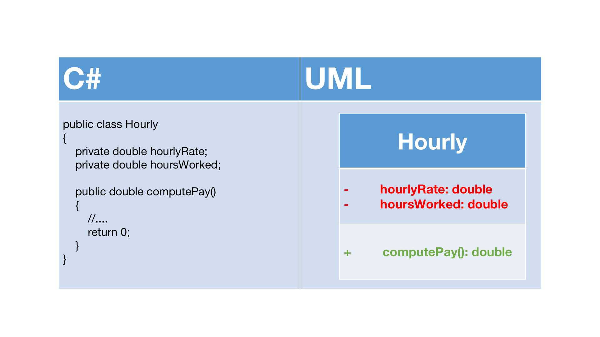
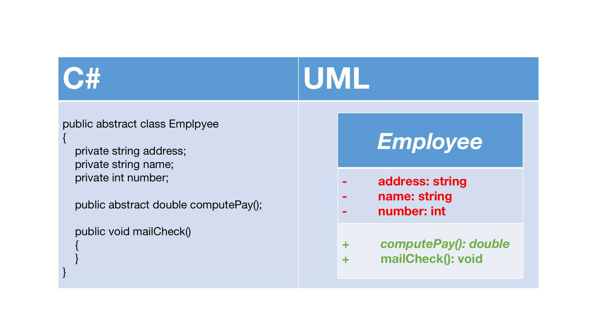
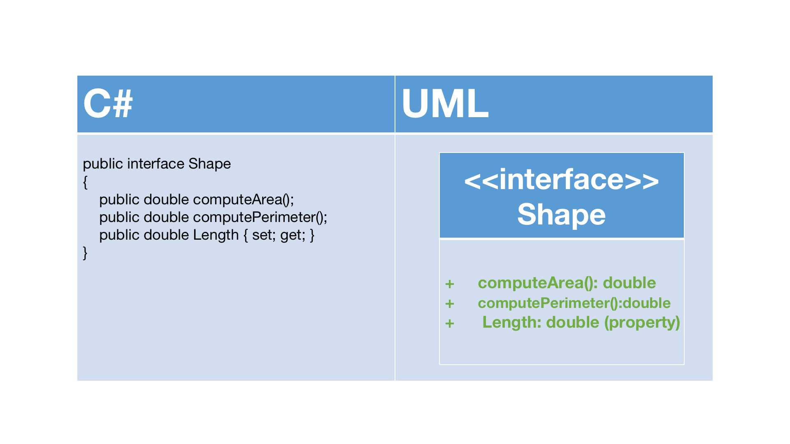
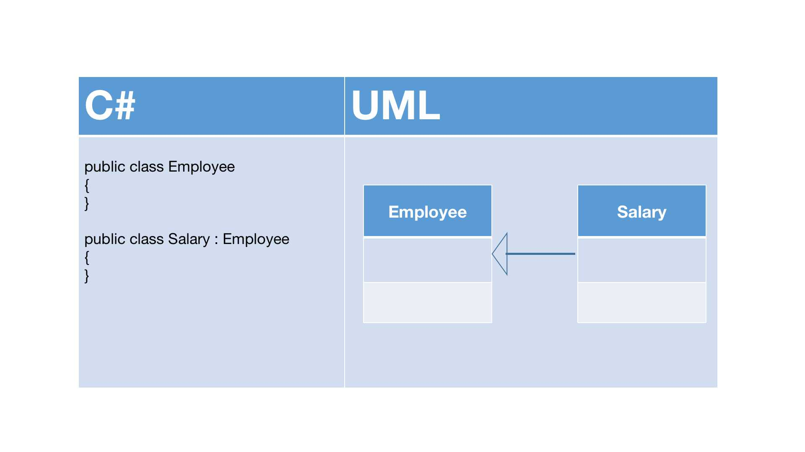

# 背景

UML图有很多中，但是并非必须掌握所有的UML图，才能完成系统分析和设计工作。一般来说，在UML图中，只要掌握类图、用例图、时序图的使用，就能完成大部分的工作。也就是说，掌握UML的20%，就可以做80%的事情。对于程序员来说，最频繁使用的莫过于类图。因此我们先主要探讨类图，其他的图我们在之后会不断补充进来。

https://zhuanlan.zhihu.com/p/109655171

# 类图

类图是面向对象系统建模中最常用和最重要的图，是定义其他图的基础。类图主要是用来显示系统中的类、接口以及它们之前静态结构和关系的一种静态模型。类图中最基本的元素是类、接口。我们设计出类图后，就可以用代码实现类图中包含的内容。

## 类图中具体类、抽象、接口和包的表示方法

UML类图中具体类、抽象类、接口和包有不同的表示方法。

## 在UML中表示具体类

具体类在类图中用矩形框表示，矩形框分为三层：第一层是类名；第二层是类的成员变量；第三层是类的方法。成员变量以及方法前的访问修饰符用符号来表示：

- `+`表示`public`
- `-`表示`private`
- `#`表示`protected`
- 不带符号表示`default`



## 在UML类图中表示抽象类

抽象类在UML类图中同样用矩形框表示，但是抽象类的类名以及抽象方法的名字都用斜体字表示



## 在UML类图中表示接口

接口在类图中也是使用矩形框进行表示的，但是与类的表示方法不同的是，接口在类图中的第一层顶端用构造型`<<interface>>`表示，下面是接口的名字，第二层是方法。此外，接口还有另外一种表示方法，俗称棒棒糖表示法，就是类上面的一根棒棒糖（圆圈+实线）。圆圈旁边为接口名称，接口方法在实现类中出现。



## 在UML类图中表示包（看起来像是一个Java中的概念，先不写了）


# 在类图中表示关系

类和类、类和接口、接口和接口之间存在一定的关系，UML类图中一般会有连线指明它们之间的关系。关系一共有六种类型，分别是实现关系、泛化关系、关联关系、依赖关系、聚合关系、组合关系。


下面来详细讲述这些关系，以及在UML类图中如何表示这些关系。

## 实现关系

实现关系是指接口及其实现类之间的关系。在UML类图中，实现关系用空心三角和虚线组成的箭头来表示，从实现类指向接口，在Java（参考的原文是以Java作为开发语言的，C#和Java高度相似）中实现关系可以直接翻译为关键字`implements`。


## 泛化关系

泛化关系`Generalization`是指对象与对象之间的继承关系。如果对象A和对象B之间的`is a`关系成立，那么二者之间就存在继承关系，对象B是父对象，对象A是子对象。例如，一个年薪制员工`is a`员工，很显然年薪制员工Salary对象和员工Employee对象之间存在继承关系，Employee对象是父对象，Salary对象是子对象。

在UML类图中，泛化关系用空心三角形和实线组成的箭头表示，从子类指向父类，在Java（C#）中泛化关系可以直接翻译为关键字`extends`。



## 关联关系

关联关系`Association`是指对象和对象之间的链接，它使一个对象知道另一个对象的属性和方法。在Java（C#）中，关联关系的代码表现成为一个对象含有另一个对象的引用。也就是说，如果一个对象的类代码中包含有对另一个对象的引用，那么这两个对象之间就是关联关系。

关联关系有单向关联和双向关联。如果两个对象都知道（即可以调用）对方的公共属性和操作，那么二者就是双向关联。如果只有一个对象知道（即可以调用）另一个对象的公共属性和操作，那么就是单向关联，大多数关联都是单向关联，单向关联关系更容易建立和维护，有助于寻找可重用的类。

在UML图中，双向关联关系用带箭头的实线或者无箭头的实现双线表示。


## 依赖关系

依赖`Dependency`关系是一种弱关联关系。如果对象A用到对象B，但是和B的关系不是太明显的时候，就可以把这种关系看作依赖关系。如果对象A依赖于对象B，则A `use a` B。比如驾驶员和汽车的关系，驾驶员使用汽车，两者是依赖关系。

在UML类图中，依赖关系用一个带虚线的箭头表示，由使用方向指向被使用方，表示使用方对象是有的被使用方对象的引用


依赖关系在代码中的具体表现形式为B为A的构造器或方法中的局部变量、方法或构造器的参数、方法的返回值，或者A调用B的静态方法。 

不好理解，直接看代码：

```C#
public class B
{
    public string field1; //成员变量

    public void method1()
    {
        Debug.Log("在B类的方法1中");
    }

    public static void method2() //静态方法
    {
        Debug.Log("在B类静态方法2中");
    }
}
```

然后是依赖B类的A类：

```C#

public class A
{
    public void method1()
    {
        //  A依赖于B的第一种表现形式：B为A的局部变量
        B b = new B();
        b.method1();
    }

    public void method2()
    {
        // A依赖于B的第二种表现形式：调用B中的静态方法
        B.method2();
    }

    public void method3(B b)
    {
        // A依赖B的第三种表现形式：B作为A的方法参数
        string s = b.field1;
    }

    public B method()
    {
        // A依赖B的第四种表现形式：B作为A的方法的返回值
        return new B();
    }
}
```

## 聚合关系和组合关系

聚合`Aggregation`是关联关系的一种特例，它体现的是整体与部分的拥有关系，即`has a`的关系。此时整体与部分之间是可分离的，它们可以具有各自的生命周期，部分可以属于多个整体对象，也可以为多个整体对象共享，所以聚合关系也常称为共享关系。例如，公司部门与员工的关系，一个员工可以属于多个部门，一个部门撤销了，员工可以转到其他部门。

在UML图中，聚合关系用空心菱形+实线箭头表示，空心菱形在整体一方，箭头指向部分一方，如下图所示：


组合`Composition`也是关联关系的一种特例，它同样体现整体与部分之间的包含关系，即`contains a`的关系。但此时整体与部分是不可分的，部分也不能给其他整体共享，作为整体的对象负责部分的对象的生命周期。这种关系比聚合更强，也称为强聚合。如果A组合B，则A需要知道B的生命周期，即可能A负责生成或者释放B，或者A通过某种途径知道B的生成和释放。

比如说，人包含头、躯干、四肢，它们的生命周期一致。当人出生时，头、躯干、四肢同时诞生。当人死亡时，作为人体组成部分的头、躯干、四肢同时死亡。

在UML图中，组合关系用实心菱形加实线箭头表示，实心菱形在整体一方，箭头指向部分一方，如下图：


在代码形式上，聚合关系和组合关系中部分对象是整体对象的一个成员变量。但是，在实际应用开发时，两个对象之间的关系到底是聚合还是组合，有时候很难区别。在C#中，仅从类代码本身是区分不了组合和聚合的。如果一定要区分，那么如果在删除整体对象的时候，必须删除掉部分对象，那么就是组合关系；否则就有可能是聚合关系。从业务角度来看，如果作为整体的对下岗必须要部分对象的参与，才能完成自己的职责，那么二者之间就是组合关系，否则就是聚合关系。

例如，汽车和轮胎，汽车作为整体，轮胎作为部分。如果用在二手车销售业务环境下，二者就是聚合关系。因为轮胎作为汽车的一个组成部分，它和汽车可以分别生产以后装配起来使用，但是汽车可以更换新的轮胎，轮胎也可以拆下来给别的汽车使用。如果用在驾驶系统业务环境上，汽车如果没有轮胎，就无法完成形式任务，二者之间就是一个组合关系。再比如网上书店业务中的订单和订单项之间的关系，如果订单中没有订单项，也就无法完成订单的业务，所以二者是组合关系。而购物车和商品之间的关系，因为商品的生命周期并不被购物车控制，商品可以被多个购物车共享，因此，二者之间是聚合关系。

