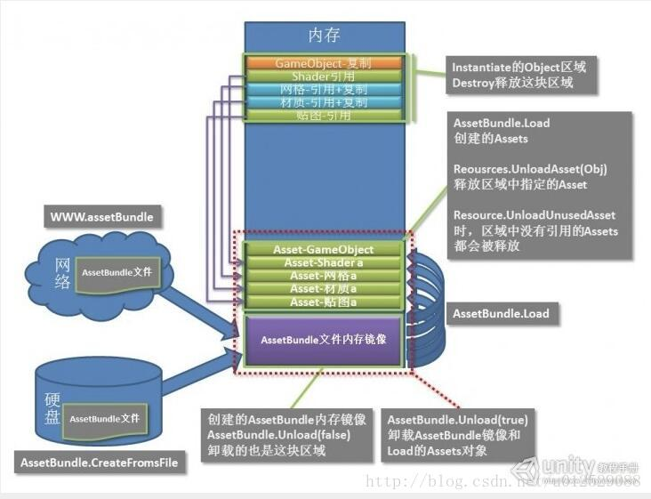

# AssetBundle基础

## AssetBundle、AssetBundle-Browser与Addressable

AssetBundle是Unity推出的一种内置的资源压缩格式，能够允许开发者在运行时动态加载需要的资源。用不用取决于开发者自己。当你在Unity中创建、导入任何非代码资源或者文件夹的时候，在Inspector窗口的下面都会有一个AssetLabel：

Addressable是基于AssetBundle的一套完整的Unity资源管理框架，也就是说，如果我们使用Addressable进行开发，项目中的资源如何进行打包、加载Addressable都帮我们规划好了，我们只需要按照它给定的规范和接口使用资源就可以了。但是如果我们只是使用AssetBundle，那么我们还需要开发一套自己的资源管理框架。

另外，Unity还推出了[AssetBundle-Browser](https://github.com/Unity-Technologies/AssetBundles-Browser)用来可视化AssetBundle的构建过程。应该说Unity是先推出了`AssetBundleBrowser`然后推出了`Addressable`。二者都可以用来管理AssetBundle，`Addressable`中有更多的自动化功能，而`AssetBundleBrowser`则更多地需要手动管理Bundle。所以`AssetBundle-Browser`算是`Addressable`的阉割版。

## AssetBundle-Browser的使用

在AssetBundle-Browser仓库的说明文档中提示该工具并不作为Unity推荐的AssetBundle的资源管理工具，但是因为该工具的建议性，还是可以作为AssetBundle的入门学习使用。

按照说明文档的介绍，可以直接复制git仓库的连接将该库安装到Unity工程中，但是有可能会因为网络原因失败，可以选择DownloadZip，然后解压到Assets目录下，记得删除Test目录，[不然会有Boo命名空间的报错](https://www.cnblogs.com/XieBoss-blogs1/p/17847061.html)。

# AssetBundle内存

使用[AssetRipper](https://github.com/AssetRipper/AssetRipper?tab=readme-ov-file)可以查看AssetBundle中的文件

Unity内置的AssetBundle工具是[Addressable库](https://docs.unity3d.com/Packages/com.unity.addressables@2.3/manual/index.html)

# 依赖

如果两个ab A和B中的一些资源都依赖了一个没有被指定要打包的资源C，那么C就会同时被打进ab A和B中，造成资源的冗余，增大ab和安装包的体积。而这个被A，B依赖的资源C又可以分为两种类型，一种是Assets下外部导入的资源，即开发者导入或创建的资源；另一种则是Unity内置的资源，例如内置的Shader，Default-Material和UGUI一些组件如Image用的一些纹理资源等等。因此要解决资源冗余的问题，就要分别对这两种被依赖的资源进行处理。

也就是说，只有我们自己手动把一些资源打进Bundle，
想要打Bundle，最终都要调用`BuildPipeline.BuildAssetBundles`接口，

`public static AssetBundleManifest BuildAssetBundles(string outputPath,AssetBundleBuild[] builds,BuildAssetBundleOptions assetBundleOptions,BuildTarget targetPlatform)`接口支持传入AssetBundleBuild数组

` public static AssetBundleManifest BuildAssetBundles(string outputPath,BuildAssetBundleOptions assetBundleOptions,BuildTarget targetPlatform)`
通过给AssetBundleBuild显示传入打包的依赖关系，确保打包资源不会冗余
因此 重点在于AssetBundleBuild数组的构建。

在AssetBundle的工作流中，必须有一个环节指定有哪些资源是要打进Bundle的，这个操作可以由Unity内置的AssetBundle工具执行，也可以自己编写脚本执行。

# Unity AssetBundle与图集Sprite Atlas

测试环境使用安卓平台
## 没有AssetBundle 没有SpriteAtlas的情况

这是最原始的情况，出了那些已经放在Resources目录下的资源会被打进包内，还有那些被Resources目录中引用的放在Resources外面的资源。

打出Android Apk之后解压，在目录下找到`assets/bin/Data/data.unity3d`，使用AssetRipper可以看到如下结构：

其中resources.asset文件里面包含了Resources目录下的所有资源。`sharedassets0.asset`文件则包含了所有的Resources目录下引用的Resources目录外的资源

## 没有AssetBundle 有SpriteAtlas的情况

### SpriteAtlas勾选IncludeInBuild的情况

### SpriteAtlas未勾选IncludeInBuild的情况

## 有AssetBundle 没有SpriteAtlas的情况

## 有AssetBundle 有SpriteAtlas的情况

### SpriteAtlas勾选IncludeInBuild的情况

### SpriteAtlas未勾选IncludeInBuild的情况

## 如果项目中只有散图，这些散图是如何被打进包内的？

分两种情况，第一种是不在Resources目录下的图片，如果没有Prefab的引用，是不会被打入包内的。 使用AndroidStudio的ApkAnalyzer查看包内的资源，

## 

如果项目中打了图集，预制体A依赖了图集中的图片a，Build之后，预制体A中依赖的是散图a还是图集呢？

Atlas资产的Inspector上有一个IncludeInBuild选项。勾选该选项之后，与这个Atlas对应的散图就建立了依赖关系，因此在构建AssetBundle的时候，查询依赖会查询到Atlas文件，并把Atlas文件和散图打在一个bundle文件中

如果勾选了IncludeInBuild选项，就不需要再把SpriteAtlas打一个Bundle了，这样会造成图集资源的冗余

在合理使用SpriteAtlas的情况下，当我们把AssetBundle包解开以后，会发现里面会包含一张Texture和若干个Sprite这两种资产。Texture是纹理，显示的文件大小较大；而Sprite可以理解为一个描述了精灵在整张纹理上的偏移量位置信息的数据文件，显示的文件大小较小。

因此这个不是冗余，是正常现象。

不过确实存在一个冗余的问题：如果Prefab1和Prefab2引用了同一个Atlas的Sprite，那么这个Atlas至少要主动包含在一个AssetBundle中，否则会被动打入两个包中，造成冗余。

Sprite和SpriteAtlas和Texture的概念重要区分

Sprite和Sprite Atlas是两个类，他们中具有一些图片信息的数据成员，他们不是真的“图片”！而Texture才是真正的图片，因此在MemoryProfiler中你可以看到SpriteAtlas和Sprite类外加真正的图片Texture被加载到内存中

> 如果不勾选IncludeInBuild，而是指定图集打Bundle，效果是一样的嘛？
> 

# 案例

# 参考资料

- https://blog.csdn.net/yinfourever/article/details/109493160
- https://zhuanlan.zhihu.com/p/369080940
- https://docs.unity3d.com/cn/2021.2/Manual/AssetBundles-Native.html
- https://www.jianshu.com/p/1b1527faaca2
- https://www.jianshu.com/p/0d18ac565563
- https://blog.csdn.net/sunheng_/article/details/128204386
- https://blog.uwa4d.com/archives/TechSharing_249.html