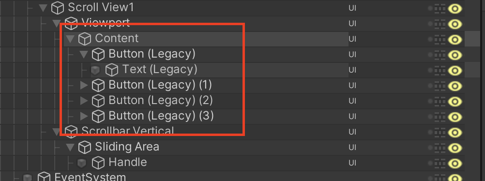

# 背景

在经过两周多与迭代器纠缠不清的拉扯之后，我好疲惫，底层的东西固然有趣并且巧妙，但是把迭代器这种东西吃透是要花费太多功夫了，下面这段时间我想把精力多放在学习Unity组件使用上。

# Scroll View使用

ScrollView的学习是学习无限滑动列表的前提

我们在Unity中先创建一个滑动列表，看看它的结构、以及每个节点上挂在的组件的作用：

```
- ScrollView (GameObject)
  ├─ RectTransform
  └─ Scroll Rect (Script)
  ├─ Viewport (GameObject)
  │  ├─ RectTransform
  │  └─ Mask + Image (Script+Component)
  │  └─ Content (GameObject)
  │    └─ RectTransform (Inside the content, you will have your items or elements)
  ├─ Scrollbar Horizontal (GameObject) (optional)
  │  ├─ RectTransform
  │  └─ Scrollbar (Script)
  ├─ Scrollbar Vertical (GameObject) (optional)
     ├─ RectTransform
     └─ Scrollbar (Script)
```


## Scroll Rect组件

在Unity中，ScrollRect组件用于实现滚动窗口，在这个窗口中，我们可以移动其内容来查看被遮挡的部分。经常搭配UI元素（比如列表、长文本等）使用

下面是Scroll Rect组件的一些主要属性与功能：

1. Content：一个RectTransform，表示滚动区域中的内容。它包含所有需要滚动的子物体。通常还会添加一个LayoutGroup组件（比如水平排列布局组、垂直排列布局组等），以自动定位和调整子物体的位置和大小
2. Horizontal和Vertical：分别控制水平滚动和垂直滚动是否启用
3. Movement Type：
   - Unrestricted：容器可以在任何方向上无限制地滚动。
   - Elastic：容器具有弹性边界。当用户停止拖动之后，内容会缓冲返回原始边界内。
   - Clamped：不允许将内容拖到容器边界以外
4. Elasticity：管理了Elastic类型移动时的回弹效果。值越高，回弹速度越快，反之越慢。
5. Inertia：如果启动惯性，用户在拖动内容并释放时，内容会按照惯性继续滚动一段时间。
6. Deceleration Rate：表示成比例的惯性减速（仅在惯性启用的时候又消失）。值越低，减速的效果越强。
7. Scroll Sensitivity：滚动响应的灵敏度。值越大，对拖动的响应越敏感。
8. Viewport：可视区域的RectTransform。可以将大小调整为要显示内容的部分区域。如果不设置，会退回外层容器作为Viewport
9. Horizontal ScrollBar和Vertical ScrollBar：缩略图栏，可以将Scrollbar组件连接到Scroll Rect组，与滚动内容同步变化。
10. Visibility：定义ScrollBar是否一直可见、仅在拖动时可见、或者用户悬停时可见。另外还有不支持此功能的选项AutoHideAndExpandViewport，它不仅可以自动隐藏滚动条，并且在隐藏时会扩大可视界面以填充原本滚动条占据的空间。


## 我想要隐藏掉ScrollBar

我们可以通过调整ScrollBar Visibility属性来将ScrollBar隐藏掉，但是给出的选项中是没有将ScrollBar一直隐藏掉的功能，我们需要通过其他的方式实现：

将ScrollBar的透明度设置为0，选中包含ScrollBar组件的GameObject，在Inspector窗口找到Image组件。展开`Color`属性并将Alpha设置为0。这将使ScrollBar变为透明，看起来像是消失了一样，但是仍然具有交互的功能。不过要注意的是我们要确保将所有跟ScrollBar相关的图片、颜色、子物体都设置成透明。

到此还没有结束，因为虽然ScrollBar现在看上去已经透明了，但是ScrollBar占据的空间还在那，所以效果上就像是少了什么东西一样，我们需要修改ScrollRect组件中的ScrollBar的Spacing的值。个人测试将值修改为-20可以达到理想的展示效果。


## GridLayoutGroup

Grid Layout Group组件是一种UI布局组件，它可以让我们轻松地创建规则的二维网格布局。Grid Layout Group组件可以在其中放置子元素，并根据指定的行列书自动整理排列这些子物体

使用时，将Grid Layout Group组件附加到某个UI对象，比如Panel或者GameObject。它的主要属性有：

- Padding：它定义了网格内子元素与容器边缘之间的间距，它有四个方向的值：左、右、上、下。通过这些值，可以控制整个网格相对于其夫对象容器的内边距，通过设置这些值，可以控制整个网格相对于其父对象容器的内边距，这样一来我们就可以根据设定完整布局在容器内的留白区域了。
- Cell Size：单元格尺寸决定了子物体的大小
- Spacing：间距用于控制每个单元格之间的横向和纵向距离。
- Start Corner：起始角落，定义从哪个角落开始排列子物体（左上、右上、左下、右下）
- StartAxis：起始轴，确定网格的填充顺序是先填充行还是先填充列。
- Child Alignment：子物体对齐方式，设置子元素在网格内的对齐方式。
- Constraint：约束，可选择无约束、固定列数或者固定行数，在此情况下会自动调整它们的数量或者高度/宽度以满足限制条件。

# 代码在这

```C#
using System.Collections;
using System.Collections.Generic;
using Platform.Analyze;
using Resource;
using UnityEngine;
using UnityEngine.UI;

public class MyScrollView : MonoBehaviour
{
    public GridLayoutGroup grid_layout_group;
    public ScrollRect scroll_rect;
    public RectTransform rect_transform;
    public GameObject prefab;

    public int buffer_count;
    public int total_count;

    public List<GameObject> game_objects;

    [SerializeField] private int headIndex;
    [SerializeField] private int tailIndex;
    [SerializeField] private Vector2 firstItemAnchoredPos;

    // Start is called before the first frame update
    void Start()
    {
        firstItemAnchoredPos = new Vector2(grid_layout_group.padding.left + grid_layout_group.cellSize.x / 2,
            -grid_layout_group.padding.top - grid_layout_group.cellSize.y / 2);
        grid_layout_group.startAxis = GridLayoutGroup.Axis.Vertical;
        grid_layout_group.startCorner = GridLayoutGroup.Corner.UpperLeft;
        grid_layout_group.childAlignment = TextAnchor.UpperLeft;
        grid_layout_group.constraintCount = 1;
        SetContentLength();
        headIndex = 0;
        tailIndex = buffer_count - 1;
        game_objects = new List<GameObject>(5);
        for (int i = 0; i < buffer_count; i++)
        {
            GameObject tempGameObject = GameObject.Instantiate(prefab, rect_transform);
            tempGameObject.GetComponentInChildren<Text>().text = (i + 1).ToString();
            tempGameObject.name = (i + 1).ToString();
            game_objects.Add(tempGameObject);
        }

        Debug.Log("List的容量：" + game_objects.Count);
        scroll_rect.onValueChanged.AddListener(OnScroll);
    }


    public void SetContentLength()
    {
        rect_transform.sizeDelta = new Vector2(grid_layout_group.cellSize.x,
            grid_layout_group.padding.top + grid_layout_group.padding.bottom +
            (grid_layout_group.cellSize.y + grid_layout_group.spacing.y) * total_count - grid_layout_group.spacing.y);
    }

    public void OnScroll(Vector2 v)
    {
        // 向上滑，新元素从底部出现
        while (rect_transform.anchoredPosition.y >=
               (grid_layout_group.cellSize.y + grid_layout_group.spacing.y) * (headIndex + 1) +
               grid_layout_group.padding.top &&
               tailIndex != total_count - 1)
        {
            GameObject tempObject = game_objects[0];
            game_objects.Remove(tempObject);
            headIndex++;
            tailIndex++;
            // 新元素的位置
            SetPos(tempObject, tailIndex);
            // 设置显示效果
            SetShow(tempObject, tailIndex + 1);
            game_objects.Add(tempObject);
        }

        // 向下滑，新元素从顶部出现
        while (rect_transform.anchoredPosition.y <=
               (grid_layout_group.cellSize.y + grid_layout_group.spacing.y) * headIndex +
               grid_layout_group.padding.top && headIndex != 0)
        {
            GameObject tempObject = game_objects[buffer_count - 1];
            game_objects.Remove(tempObject);
            headIndex--;
            tailIndex--;
            // 设置新的元素的位置
            SetPos(tempObject, headIndex);
            // 设置显示效果：
            SetShow(tempObject, headIndex + 1);
            game_objects.Insert(0, tempObject);
        }
    }

    public void SetPos(GameObject obj, int index)
    {
        // 这里是因为对锚点的理解不到位导致的
        obj.GetComponent<RectTransform>().anchoredPosition = new Vector2(
            firstItemAnchoredPos.x,
            // firstItemAnchoredPos是一个负数
            // 我觉得不该加这个-grid_layout_group.padding.top
            firstItemAnchoredPos.y -
            index * (grid_layout_group.cellSize.y + grid_layout_group.spacing.y));
    }

    public void SetShow(GameObject obj, int index)
    {
        obj.GetComponentInChildren<Text>().text = index.ToString();
        obj.name = index.ToString();
    }
}
```


我们先提一个简单的需求：

我想要纵向展示四个按钮，这四个按钮高度很高，一次性展示补全，所以我要利用ScrollView做一个简单的列表效果：

1. 创建一个ScrollView，创建四个按钮，将四个按钮都放在content节点下。

   

2. 调节参数，


有很多实现的方案，哪种方案是最完美的？

- 不依托其他的组件？
- 通用性？
- ...

问了宇哥，宇哥说要依情况而定。


# 实现思路

通过头下标和尾下标记录当前实例化数据的最大最小索引，之后用Content的锚点位置与当前头下标的位置进行比较判断滑动的方向以及是否超出滑动范围，如果正方向滑动超出范围则将第一个元素移动到最后一个，如果反方向滑动超出范围则将最后一个元素移到第一个，这样的场景中始终存在5个实例化的元素，依次改变元素的位置和显示即可

首先我们要明确：谁先谁后的问题。所谓谁先谁后，指的是什么组件的移动引起了什么组件的变化，在我们要实现滑动列表的这个案例中，是content先动引起了item生成位置的变化，明确这一点对我们理解无限滑动列表的原理至关重要。

我们就以上下滑动为例，探讨一下无限滑动列表的工作原理：

首先我们要明确我们的整个content的容量（长度），它包含我们元素和顶部的间隔、元素和底部的间隔、元素个数*元素的高度、元素的间隔高度x元素个数-1。


接下来我们先对于整个过程有一个感性的认知：


在我们向上滑动，底部出现新的Item的时候，会出现这种情况：

最顶部的一个Item会逐渐移出我们的可视区域的顶部，当顶部的Item被完全移出可视区域之后，它就没有必要存在了，我们应该将它移动到我们List的末尾，让它在下面进行显示。

在我们向下滑动，在可视区域的顶部要出现新的Item的时候，由于现在最顶部展示的已经是List头部的Item了，再往前是没有Item供我们展示的，但是这个时候List尾部的Item已经在我们可视区域的下方了，我们可以把它移动到我们ItemList的顶部，让它作为新的Item显示出来，因此我们的实现思路其实很简单，就是我们要判断出上面我们所说的两种情况，然后分别在这两种情况内去做处理就可以了，可视问题是我们该如何去判断Item的位置和可视区域的位置呢？

这里我们需要了解一个属性的含义了：`anchoredPosition`，这个属性表示当前UI元素相对于其锚点的位置（二维向量）。它基于父级UI元素的矩形边界以及自身的锚点设定来计算相对坐标。注意锚点是不会随着


## 向上滑动，底部出现新的Item的情况


```C#
using System.Collections.Generic;
using UnityEngine;
using UnityEngine.UI;
using System.Linq;


/// <summary>
/// 无限滑动列表
/// </summary>
public class InfiniteScrollView : MonoBehaviour
{
    // Scroll View节点上的Scroll Rect组件
    private ScrollRect scrollRect; //滑动框组件

    private RectTransform content; //滑动框的Content

    // 先搞清楚所有用到的变量属性
    // 使用到了该组件
    private GridLayoutGroup layout; //布局组件

    [Header("滑动类型")] public ScrollType scrollType;
    [Header("固定的Item数量")] public int fixedCount;
    [Header("总共要显示的数量")] public int totalCount;
    [Header("Item的预制体")] public GameObject itemPrefab;


    private List<RectTransform> dataList = new List<RectTransform>(); //数据实体列表
    private int headIndex; //头下标
    private int tailIndex; //尾下标
    private Vector2 firstItemAnchoredPos; //第一个Item的锚点坐标


    // 接下来要做的就是，搞懂原理。
    void Start()
    {
        Init();
    }

    #region Init

    /// <summary>
    /// 实例化Item
    /// </summary>
    private void InitItem()
    {
        for (int i = 0; i < fixedCount; i++)
        {
            GameObject tempItem = Instantiate(itemPrefab, content);
            dataList.Add(tempItem.GetComponent<RectTransform>());
            // Prefab的size在GridLayoutGroup插件里面设置    
            // 这里没有问题，因为数组下标从0开始嘛
            SetShow(tempItem.GetComponent<RectTransform>(), i + 1);
        }
    }

    /// <summary>
    /// 设置Content大小
    /// </summary>
    private void SetContentSize()
    {
        // content的x应该和一个按钮一样大，这是在Vertical展示的情况下
        // 如果是在Horizontal展示的情况下它才会把Content的宽设置成这么长
        // 所以应该做一个区分。如果是Vertical
        // 如果是Horizontal
        content.sizeDelta = new Vector2
        (
            // 使用Grid Layout Group组件访问了以下数据：
            // 其中包含了间隔、每个Item的高度
            layout.padding.left + layout.padding.right + totalCount * (layout.cellSize.x + layout.spacing.x) -
            layout.spacing.x - content.rect.width,
            layout.padding.top + layout.padding.bottom + totalCount * (layout.cellSize.y + layout.spacing.y) -
            layout.spacing.y
            // 间隔比Item个数少一个
            // 加上边距
        );
    }

    /// <summary>
    /// 设置布局
    /// </summary>
    private void SetLayout()
    {
        // 一些看不懂的设置
        layout.startCorner = GridLayoutGroup.Corner.UpperLeft;
        layout.startAxis = GridLayoutGroup.Axis.Horizontal;
        layout.childAlignment = TextAnchor.UpperLeft;
        layout.constraintCount = 1;

        // 设置结束


        if (scrollType == ScrollType.Horizontal)
        {
            scrollRect.horizontal = true;
            scrollRect.vertical = false;
            layout.constraint = GridLayoutGroup.Constraint.FixedRowCount;
        }
        else if (scrollType == ScrollType.Vertical)
        {
            scrollRect.horizontal = false;
            scrollRect.vertical = true;
            layout.constraint = GridLayoutGroup.Constraint.FixedColumnCount;
        }
    }

    /// <summary>
    /// 得到第一个数据的锚点位置
    /// </summary>
    private void GetFirstItemAnchoredPos()
    {
        firstItemAnchoredPos = new Vector2
        (
            layout.padding.left + layout.cellSize.x / 2,
            -layout.padding.top - layout.cellSize.y / 2
        );
    }

    #endregion

    #region Main

    /// <summary>
    /// 滑动中
    /// </summary>
    private void OnScroll(Vector2 v)
    {
        if (dataList.Count == 0)
        {
            Debug.LogWarning("先调用SetTotalCount方法设置数据总数量再调用Init方法进行初始化");
            return;
        }

        if (scrollType == ScrollType.Vertical)
        {
            // 向上滑
            // 新元素从底部出现
            // content的y值一直比layout高
            while (content.anchoredPosition.y >=
                   layout.padding.top + (headIndex + 1) * (layout.cellSize.y + layout.spacing.y)
                   && tailIndex != totalCount - 1)
            {
                // 思想就是当headIndex的那个元素被移出可视范围以后，就把这个移出的Item移动到队列后面去
                // 将数据列表中的第一个元素移动到最后一个
                // 这个过程会设计新的元素的创建和消除么？
                // 暂定不会
                RectTransform item = dataList[0];
                dataList.Remove(item);
                dataList.Add(item);

                headIndex++;
                tailIndex++;
                // 设置位置
                SetPos(item, tailIndex);
                // 设置显示
                // 这里的下标有问题
                SetShow(item, tailIndex + 1);
            }

            // 向下滑
            // 新元素从顶部出现
            while (content.anchoredPosition.y <= layout.padding.top + headIndex * (layout.cellSize.y + layout.spacing.y)
                   && headIndex != 0)
            {
                // 将数据列表中的最后一个元素移动到第一个
                RectTransform item = dataList.Last();
                dataList.Remove(item);
                // 然后插入头部
                dataList.Insert(0, item);

                // 因为它是逐个刷新
                headIndex--;
                tailIndex--;
                // 设置位置
                SetPos(item, headIndex);
                // 设置显示
                SetShow(item, headIndex + 1);
                // 这样就统一咧！☺
            }
        }
        else if (scrollType == ScrollType.Horizontal)
        {
            // 向左滑
            while (content.anchoredPosition.x <=
                   -layout.padding.left - (headIndex + 1) * (layout.cellSize.x + layout.spacing.x)
                   && tailIndex != totalCount - 1)
            {
                // 将数据列表中的第一个元素移动到最后一个
                RectTransform item = dataList[0];
                dataList.Remove(item);
                dataList.Add(item);

                // 设置位置
                SetPos(item, tailIndex + 1);
                // 设置显示
                SetShow(item, tailIndex + 1);

                headIndex++;
                tailIndex++;
            }

            // 向右滑
            while (content.anchoredPosition.x >=
                   -layout.padding.left - headIndex * (layout.cellSize.x + layout.spacing.x)
                   && headIndex != 0)
            {
                //将数据列表中的最后一个元素移动到第一个
                RectTransform item = dataList.Last();
                dataList.Remove(item);
                dataList.Insert(0, item);

                // 为什么这里就没问题呢？
                //设置位置
                SetPos(item, headIndex - 1);
                //设置显示
                SetShow(item, headIndex - 1);

                headIndex--;
                tailIndex--;
            }
        }
    }

    #endregion

    #region Tool

    /// <summary>
    /// 设置位置
    /// </summary>
    private void SetPos(RectTransform trans, int index)
    {
        if (scrollType == ScrollType.Horizontal)
        {
            trans.anchoredPosition = new Vector2
            (
                // index为0怎么了？
                index == 0
                    ? layout.padding.left + firstItemAnchoredPos.x
                    : layout.padding.left + firstItemAnchoredPos.x + index * (layout.cellSize.x + layout.spacing.x),
                firstItemAnchoredPos.y
            );
        }
        else if (scrollType == ScrollType.Vertical)
        {
            // 设置新生成的元素的位置
            trans.anchoredPosition = new Vector2
            (
                firstItemAnchoredPos.x,
                index == 0
                    ? -layout.padding.top + firstItemAnchoredPos.y
                    : -layout.padding.top + firstItemAnchoredPos.y - index * (layout.cellSize.y + layout.spacing.y)
            );
        }
    }

    #endregion

    #region 外部调用

    /// <summary>
    /// 初始化
    /// </summary>
    public void Init()
    {
        scrollRect = GetComponent<ScrollRect>();
        content = scrollRect.content;
        layout = content.GetComponent<GridLayoutGroup>();
        scrollRect.onValueChanged.AddListener(OnScroll);

        // 设置布局
        SetLayout();

        // 设置头下标和尾下标
        // 没问题
        headIndex = 0;
        tailIndex = fixedCount - 1;

        //设置Content大小
        SetContentSize();
        // content.sizeDelta = new Vector2(0, 3000);
        //实例化Item
        InitItem();

        //得到第一个Item的锚点位置
        GetFirstItemAnchoredPos();
    }

    /// <summary>
    /// 设置显示
    /// </summary>
    public void SetShow(RectTransform trans, int index)
    {
        //=====根据需求进行编写
        // 生成对应的name和index
        trans.GetComponentInChildren<Text>().text = index.ToString();
        trans.name = index.ToString();
    }

    /// <summary>
    /// 设置总的数据数量
    /// </summary>
    public void SetTotalCount(int count)
    {
        totalCount = count;
    }

    /// <summary>
    /// 销毁所有的元素
    /// </summary>
    public void DestoryAll()
    {
        for (int i = dataList.Count - 1; i >= 0; i--)
        {
            DestroyImmediate(dataList[i].gameObject);
        }

        dataList.Clear();
    }

    #endregion
}

/// <summary>
/// 滑动类型
/// </summary>
public enum ScrollType
{
    Horizontal, //竖直滑动
    Vertical, //水平滑动
}
```

