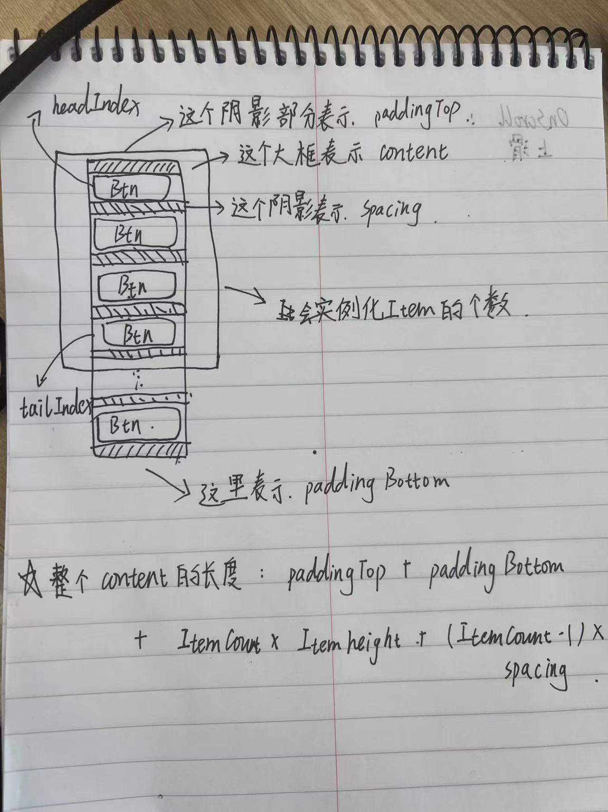

# 背景

在经过两周多与迭代器纠缠不清的拉扯之后，我好疲惫，底层的东西固然有趣并且巧妙，但是把迭代器这种东西吃透是要花费太多功夫了，下面这段时间我想把精力多放在学习Unity组件使用上。

# Scroll View

ScrollView是实现无限滑动列表的基础，我们先来看看它的结构、以及每个节点上挂在的组件的作用：

```
- ScrollView (GameObject)
  ├─ RectTransform
  └─ Scroll Rect (Script)
  ├─ Viewport (GameObject)
  │  ├─ RectTransform
  │  └─ Mask + Image (Script+Component)
  │  └─ Content (GameObject)
  │    └─ RectTransform (Inside the content, you will have your items or elements)
  ├─ Scrollbar Horizontal (GameObject) (optional)
  │  ├─ RectTransform
  │  └─ Scrollbar (Script)
  ├─ Scrollbar Vertical (GameObject) (optional)
     ├─ RectTransform
     └─ Scrollbar (Script)
```

这里面有两个组件需要我们搞清楚：`Scroll Rect`和`Rect Transform`

## Scroll Rect组件

在Unity中，ScrollRect组件用于实现滚动窗口，在这个窗口中，我们可以移动其内容来查看被遮挡的部分。经常搭配UI元素（比如列表、长文本等）使用

下面是Scroll Rect组件的一些主要属性与功能：

1. Content：一个RectTransform，表示滚动区域中的内容。它包含所有需要滚动的子物体。通常还会添加一个LayoutGroup组件（比如水平排列布局组、垂直排列布局组等），以自动定位和调整子物体的位置和大小
2. Horizontal和Vertical：分别控制水平滚动和垂直滚动是否启用
3. Movement Type：
   - Unrestricted：容器可以在任何方向上无限制地滚动。
   - Elastic：容器具有弹性边界。当用户停止拖动之后，内容会缓冲返回原始边界内。
   - Clamped：不允许将内容拖到容器边界以外
4. Elasticity：管理了Elastic类型移动时的回弹效果。值越高，回弹速度越快，反之越慢。
5. Inertia：如果启动惯性，用户在拖动内容并释放时，内容会按照惯性继续滚动一段时间。
6. Deceleration Rate：表示成比例的惯性减速（仅在惯性启用的时候又消失）。值越低，减速的效果越强。
7. Scroll Sensitivity：滚动响应的灵敏度。值越大，对拖动的响应越敏感。
8. Viewport：可视区域的RectTransform。可以将大小调整为要显示内容的部分区域。如果不设置，会退回外层容器作为Viewport
9. Horizontal ScrollBar和Vertical ScrollBar：缩略图栏，可以将Scrollbar组件连接到Scroll Rect组，与滚动内容同步变化。
10. Visibility：定义ScrollBar是否一直可见、仅在拖动时可见、或者用户悬停时可见。另外还有不支持此功能的选项AutoHideAndExpandViewport，它不仅可以自动隐藏滚动条，并且在隐藏时会扩大可视界面以填充原本滚动条占据的空间。

## RectTransform

在 Unity 中，RectTransform（矩形变换）组件是 UI 元素的核心部分。它用于定义 2D 界面元素在屏幕上的位置、大小和方向。RectTransform 专为 Unity 的 UI 系统（UGUI，Unity Graphic User Interface）设计，继承自 Transform 组件。与标准的 Transform 组件相比，RectTransform 提供了针对二维空间的额外功能。

以下是 RectTransform 的一些关键特性和属性：

1. **锚定（Anchors）**：锚点用于确定 UI 元素在其父容器中的相对位置。有两种类型的锚点：最小锚点和最大锚点。最小锚点表示左下角的位置，最大锚点表示右上角的位置。通过调整这两个锚点，您可以将 UI 元素固定到父容器的一个角落、边缘或中心。
2. **轴对齐（Pivot）**：轴心点是旋转和缩放操作的参考点。默认情况下，轴心点位于矩形的中心（0.5, 0.5）。您可以移动轴心点以更改 UI 元素的旋转和缩放方式。
3. **尺寸（Width and Height）**：这两个属性定义了 UI 元素的宽度和高度。你可以通过直接设置数值或使用 RectTransform 工具在场景视图中进行调整。
4. **位置（Position）**：还可以设置 RectTransform 的位置属性，以确定 UI 元素在屏幕上的具体位置。位置属性包括 X、Y 和 Z 坐标。
5. **缩放（Scale）**：与 Transform 组件类似，RectTransform 也有一个表示局部缩放的属性，允许您改变 UI 元素的大小。

要使用 RectTransform，需要先确保已经导入了 Unity 的 UI 系统。然后，在场景中创建 UI 元素（例如按钮、文本框、图像等），它们将自动带有 RectTransform 组件。通过调整 RectTransform 的各种属性，您可以灵活地布局和设计 UI 界面。

总之，RectTransform 是 Unity UI 系统的核心组件，用于在场景中定位、旋转、缩放和调整大小。借助 RectTransform，开发者可以轻松设计出响应式和美观的用户界面。

除了上面这两个组件之外，还有一个组件我们需要了解：`Grid Layout Group`

## GridLayoutGroup

Grid Layout Group组件是一种UI布局组件，它可以让我们轻松地创建规则的二维网格布局。Grid Layout Group组件可以在其中放置子元素，并根据指定的行列书自动整理排列这些子物体

使用时，将Grid Layout Group组件附加到某个UI对象，比如Panel或者GameObject。它的主要属性有：

- Padding：它定义了网格内子元素与容器边缘之间的间距，它有四个方向的值：左、右、上、下。通过这些值，可以控制整个网格相对于其夫对象容器的内边距，通过设置这些值，可以控制整个网格相对于其父对象容器的内边距，这样一来我们就可以根据设定完整布局在容器内的留白区域了。
- Cell Size：单元格尺寸决定了子物体的大小
- Spacing：间距用于控制每个单元格之间的横向和纵向距离。
- Start Corner：起始角落，定义从哪个角落开始排列子物体（左上、右上、左下、右下）
- StartAxis：起始轴，确定网格的填充顺序是先填充行还是先填充列。
- Child Alignment：子物体对齐方式，设置子元素在网格内的对齐方式。
- Constraint：约束，可选择无约束、固定列数或者固定行数，在此情况下会自动调整它们的数量或者高度/宽度以满足限制条件。


## 如何隐藏掉ScrollBar

我们可以通过调整ScrollBar Visibility属性来将ScrollBar隐藏掉，但是给出的选项中是没有将ScrollBar一直隐藏掉的功能，我们需要通过其他的方式实现：

将ScrollBar的透明度设置为0，选中包含ScrollBar组件的GameObject，在Inspector窗口找到Image组件。展开`Color`属性并将Alpha设置为0。这将使ScrollBar变为透明，看起来像是消失了一样，但是仍然具有交互的功能。不过要注意的是我们要确保将所有跟ScrollBar相关的图片、颜色、子物体都设置成透明。

到此还没有结束，因为虽然ScrollBar现在看上去已经透明了，但是ScrollBar占据的空间还在那，所以效果上就像是少了什么东西一样，我们需要修改ScrollRect组件中的ScrollBar的Spacing的值。个人测试将值修改为-20可以达到理想的展示效果。

# 如何实现无限滑动列表？

首先滑动列表的原理就是用固定的一组Prefab来表示更大的一组东西，我们称我们要展示的这些东西叫做`Item`，我们用一个`ItemList`的List来存放它们，

我们来看一下具体的场景：

放图1

当头部的这个Item完全出了我的可视区域，或者说headIndex后面的第二个Item移动到可视区域的顶部边界的时候 ，上面的Item已经看不到了，我们就可以将它转移到我们Item List的末尾去

放图2

当头部的这个Item恰好在可视区域的顶部边界的时候，头部Item上面没有Item了，就需要将ItemList尾部的Item插入到头部，

放图3

 所以说，当头部的Item处在可视区域顶部边界之间的时候，是不会发生Item位置的变化的，只有到达了顶部或者底部的边界的时候，才会发生变化。



接下来我们先对于整个过程有一个感性的认知：


在我们向上滑动，底部出现新的Item的时候，会出现这种情况：

最顶部的一个Item会逐渐移出我们的可视区域的顶部，当顶部的Item被完全移出可视区域之后，它就没有必要存在了，我们应该将它移动到我们List的末尾，让它在下面进行显示。

在我们向下滑动，在可视区域的顶部要出现新的Item的时候，由于现在最顶部展示的已经是List头部的Item了，再往前是没有Item供我们展示的，但是这个时候List尾部的Item已经在我们可视区域的下方了，我们可以把它移动到我们ItemList的顶部，让它作为新的Item显示出来，因此我们的实现思路其实很简单，就是我们要判断出上面我们所说的两种情况，然后分别在这两种情况内去做处理就可以了，可视问题是我们该如何去判断Item的位置和可视区域的位置呢？

这里我们需要了解一个属性的含义了：`anchoredPosition`，这个属性表示当前UI元素相对于其锚点的位置（二维向量）。它基于父级UI元素的矩形边界以及自身的锚点设定来计算相对坐标。注意锚点是不会随着

# 代码在这

```C#
using System.Collections;
using System.Collections.Generic;
using Newtonsoft.Json.Converters;
using Unity.VisualScripting;
using UnityEngine;
using UnityEngine.UI;

public class MyScrollView : MonoBehaviour
{

    public RectTransform content;

    public ScrollRect scrollRect;

    public GridLayoutGroup gridLayoutGroup;

    public GameObject prefab;
    public int bufferCount;

    public int totalCount;

    [SerializeField]private int headIndex;
    [SerializeField]private int tailIndex;

    public List<GameObject> Items;

    public Vector2 firstItemAnchoredPos;
    // Start is called before the first frame update
    void Start()
    {
        
        SetContentLength();
        SetGridLayoutGroupDefault();
        // 给初始化一下
        SetFirstItemAnchoredPosition();
        
        
        // 实例化Item
        // 第一次初始化的时候我们时不需要关心它的位置的，因为它会自动帮助我们调整好
        Items = new List<GameObject>(totalCount);
        headIndex = 0;
        tailIndex = bufferCount - 1;
        for (int i = 0; i < bufferCount; i++)
        {
            GameObject tempGameobject = Instantiate(prefab, content);
            Items.Add(tempGameobject);
            SetShow(tempGameobject, i+1);
        }
        
        scrollRect.onValueChanged.AddListener(OnScroll);
        
    }

    public void SetFirstItemAnchoredPosition()
    {
        firstItemAnchoredPos = new Vector2(
            gridLayoutGroup.padding.left + gridLayoutGroup.cellSize.x / 2,
            - gridLayoutGroup.padding.top - gridLayoutGroup.cellSize.y / 2);
    }

    public void SetGridLayoutGroupDefault()
    {  
        // 给GridLayoutGroup进行初始化
        gridLayoutGroup.startCorner = GridLayoutGroup.Corner.UpperLeft;
        gridLayoutGroup.startAxis = GridLayoutGroup.Axis.Vertical;
        gridLayoutGroup.childAlignment = TextAnchor.UpperLeft;
        gridLayoutGroup.constraint = GridLayoutGroup.Constraint.Flexible;
        gridLayoutGroup.constraintCount = 1;
    }


    public void OnScroll(Vector2 v)
    {
        // 向上滑动
        while (content.anchoredPosition.y >= gridLayoutGroup.padding.top + (headIndex + 1) * (gridLayoutGroup.spacing.y + gridLayoutGroup.cellSize.y) && tailIndex != totalCount - 1)
        {
            GameObject tempGameObj = Items[0];
            Items.Remove(tempGameObj);
            
           
            headIndex++;
            tailIndex++;
            SetPos(tempGameObj,tailIndex);
            SetShow(tempGameObj,tailIndex+1);
            Items.Add(tempGameObj);
            
            
        }
        // 向下滑动
        while (content.anchoredPosition.y <= gridLayoutGroup.padding.top + headIndex * (gridLayoutGroup.spacing.y + gridLayoutGroup.cellSize.y) && headIndex != 0)
        {
            GameObject temGamObj = Items[bufferCount - 1];
            Items.Remove(temGamObj);
            headIndex--;
            tailIndex--;
            SetPos(temGamObj,headIndex);
            SetShow(temGamObj, headIndex + 1);
            Items.Insert(0,temGamObj);
        }
    }
    public void SetPos(GameObject obj ,int index)
    {
        obj.GetComponent<RectTransform>().anchoredPosition = new Vector2(
            firstItemAnchoredPos.x,
            firstItemAnchoredPos.y - index * (gridLayoutGroup.spacing.y + gridLayoutGroup.cellSize.y));
    }

    public void SetShow(GameObject obj, int index)
    {
        obj.name = index.ToString();
        obj.GetComponentInChildren<Text>().text = index.ToString();
    }

    public void SetContentLength()
    {
        content.sizeDelta = new Vector2(
            gridLayoutGroup.cellSize.x,gridLayoutGroup.padding.top + gridLayoutGroup.padding.bottom + gridLayoutGroup.cellSize.y * totalCount + gridLayoutGroup.spacing.y * (totalCount -1));
    }
}

```

其实是有很多实现滑动列表的方案，哪种方案是最完美的？

- 不依托其他的组件？
- 通用性？
- ...

问了宇哥，宇哥说要依情况而定，按照需求设计最合适的滑动列表，不愧是宇哥👍

