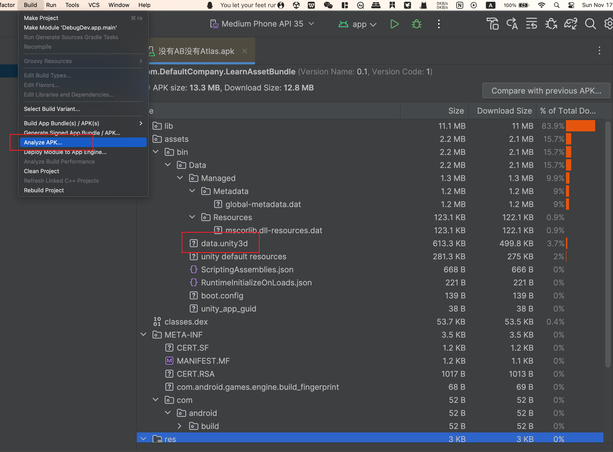

# 包体构成

使用AndroidStudio中的`Build -> ApkAnalyzer`来对包体内容进行分析，可以看到安卓包内的基本结构如下：

Resources目录下的文件都会被打包进`assets/bin/Data/data.unity3d`文件中，游戏启动的时候会一次性把这个文件加载到内存中，因此应该要尽可能地减小放在resources目录下的文件体积。

# libil2cpp.so内容分析

https://blog.csdn.net/linxinfa/article/details/116572369

# AssetRipper使用

AssetRipper的GitHub链接👉👉👉 https://github.com/AssetRipper/AssetRipper

下载到本地解压后在根目录打开终端，运行`./AssetRipper.GUI.Free`在浏览器中启动。

UnityResources目录下的内容都被打包进了一个unity_3d的目录下，

# AssetBundle打包问题

