# AssetBundle基础

## AssetBundle原理

⭕️ AssetBundle在内存中如何加载、存储

## AssetBundle、AssetBundle-Browser与Addressable

AssetBundle是Unity推出的一种内置的资源压缩格式，能够允许开发者在运行时动态加载需要的资源。用不用取决于开发者自己。当你在Unity中创建、导入任何非代码资源或者文件夹的时候，在Inspector窗口的下面都会有一个AssetLabel：
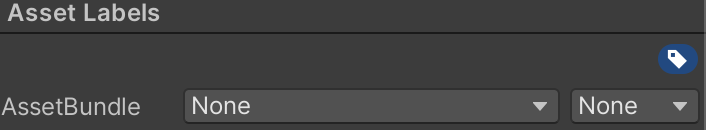

Addressable是基于AssetBundle的一套完整的Unity资源管理框架，也就是说，如果我们使用Addressable进行开发，项目中的资源如何进行打包、加载Addressable都帮我们规划好了，我们只需要按照它给定的规范和接口使用资源就可以了。但是如果我们只是使用AssetBundle，那么我们还需要开发一套自己的资源管理框架。

另外，Unity还推出了[AssetBundle-Browser](https://github.com/Unity-Technologies/AssetBundles-Browser)用来可视化AssetBundle的构建过程。应该说Unity是先推出了`AssetBundleBrowser`然后推出了`Addressable`。二者都可以用来管理AssetBundle，`Addressable`中有更多的自动化功能，而`AssetBundleBrowser`则更多地需要手动管理Bundle。所以`AssetBundle-Browser`算是`Addressable`的阉割版。

## AssetBundle-Browser的使用

在AssetBundle-Browser仓库的说明文档中提示该工具并不作为Unity推荐的AssetBundle的资源管理工具，但是因为该工具的建议性，还是可以作为AssetBundle的入门学习使用。

按照说明文档的介绍，可以直接复制git仓库的连接将该库安装到Unity工程中，但是有可能会因为网络原因失败，可以选择DownloadZip，然后解压到Assets目录下，记得删除Test目录，[不然会有Boo命名空间的报错](https://www.cnblogs.com/XieBoss-blogs1/p/17847061.html)。

# AssetBundle内存

使用[AssetRipper](https://github.com/AssetRipper/AssetRipper?tab=readme-ov-file)可以查看AssetBundle中的文件

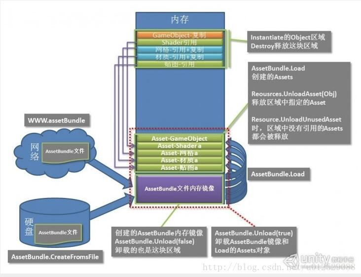

Unity内置的AssetBundle工具是[Addressable库](https://docs.unity3d.com/Packages/com.unity.addressables@2.3/manual/index.html)

# 依赖

如果两个ab A和B中的一些资源都依赖了一个没有被指定要打包的资源C，那么C就会同时被打进ab A和B中，造成资源的冗余，增大ab和安装包的体积。而这个被A，B依赖的资源C又可以分为两种类型，一种是Assets下外部导入的资源，即开发者导入或创建的资源；另一种则是Unity内置的资源，例如内置的Shader，Default-Material和UGUI一些组件如Image用的一些纹理资源等等。因此要解决资源冗余的问题，就要分别对这两种被依赖的资源进行处理。

也就是说，只有我们自己手动把一些资源打进Bundle，
想要打Bundle，最终都要调用`BuildPipeline.BuildAssetBundles`接口，

`public static AssetBundleManifest BuildAssetBundles(string outputPath,AssetBundleBuild[] builds,BuildAssetBundleOptions assetBundleOptions,BuildTarget targetPlatform)`接口支持传入AssetBundleBuild数组

` public static AssetBundleManifest BuildAssetBundles(string outputPath,BuildAssetBundleOptions assetBundleOptions,BuildTarget targetPlatform)`
通过给AssetBundleBuild显示传入打包的依赖关系，确保打包资源不会冗余
因此 重点在于AssetBundleBuild数组的构建。

在AssetBundle的工作流中，必须有一个环节指定有哪些资源是要打进Bundle的，这个操作可以由Unity内置的AssetBundle工具执行，也可以自己编写脚本执行。

# Unity AssetBundle与图集Sprite Atlas

> 本小节建议配合[UnityAndroid工程包体优化](https://soincredible.github.io/posts/279644bd/)这篇博客阅读

新建一个Unity工程，Assets目录下的文件结构如下：
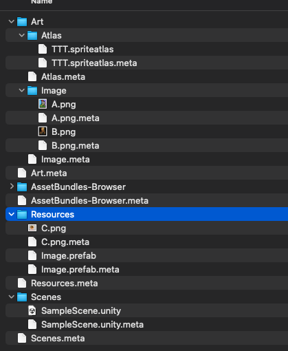
其中名为TTT的图集中包含图片A、图片B、图片C资源，Image预制体中只有一个Image组件，Image组件上引用了图片A。笔者将会测试下面几种方案会如何将这些资源打入包内：

## 不使用AssetBundle 不使用SpriteAtlas

在这种策略下，除了那些已经放在Resources目录下的资源，还有那些被Resources目录中资源引用的、放在Resources外面的资源会被打入apk。也就是说`Art/Image/A` + 所有Resources目录下的文件被打包进了apk。

打出Android Apk之后解压，在目录下找到`assets/bin/Data/data.unity3d`，使用AssetRipper可以看到如下结构：

- `globalgamemanagers`、`unity_builtin_extra`、`globalgamemanagers.asset`是Unity自动创建的，本测试并不关心其内容，也与我们自己的资源没有关系。

- `resources.asset`文件里面包含了Resources目录下的所有资源。即图片C和Image预制体
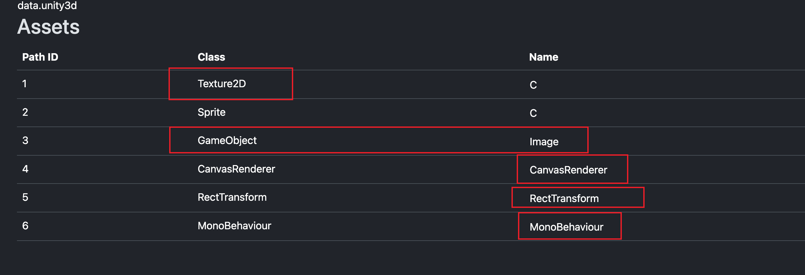

- `level0`是我们构建的场景，其中包含了场景中的所有节点信息，Image预制体也在其中。
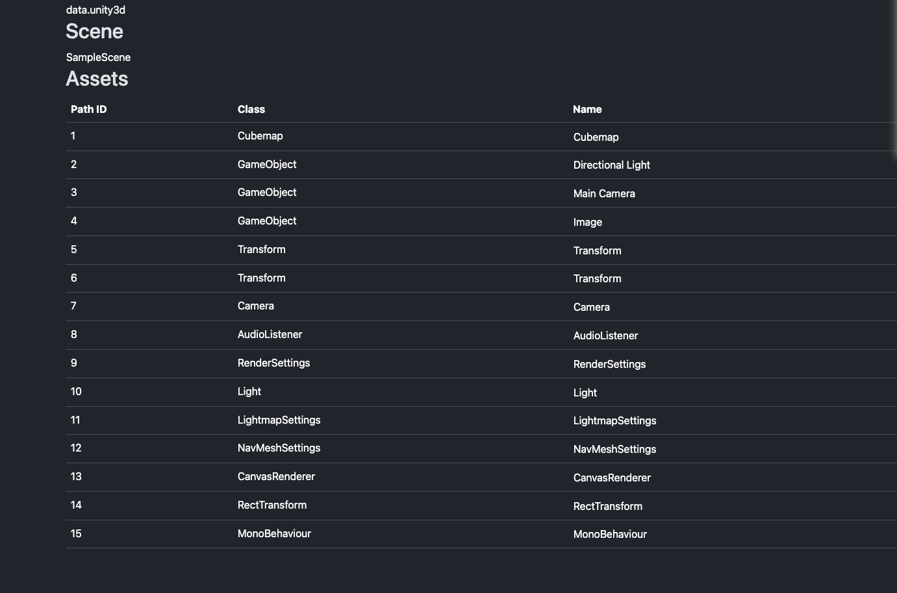

- `sharedassets0.asset`文件则包含了所有的Resources目录下引用的Resources目录外的资源。其中包含了图片A。
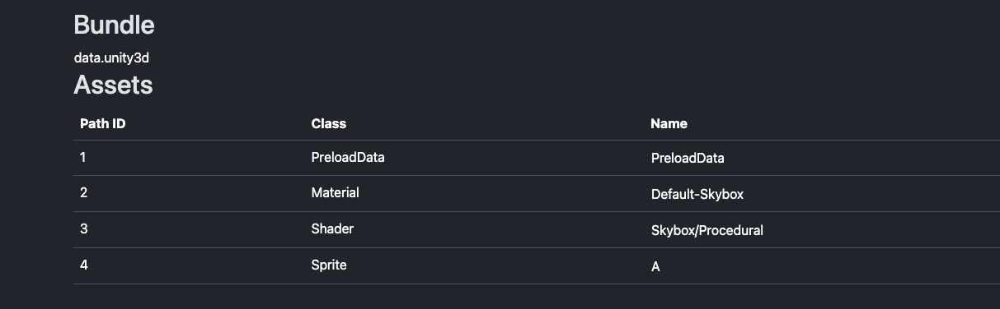

## 没有AssetBundle 有SpriteAtlas的情况

### SpriteAtlas勾选IncludeInBuild的情况

> 注意 笔者在做下面的实验的时候，每做一个实验都会删除原来的图集->退出Unity->删除工程下的Library目录->重新启动Unity->重新创建一个一模一样的图集，Unity存在Bug当图集的IncludeInBuild选项的变化并不会生效。

勾选IncludeInBuild的情况下，散图和图集之间就建立了`映射关系`，`散图`与`其依赖资源`之间的依赖关系就变成了`散图所在图集`与`依赖该散图资源`之间的依赖关系。

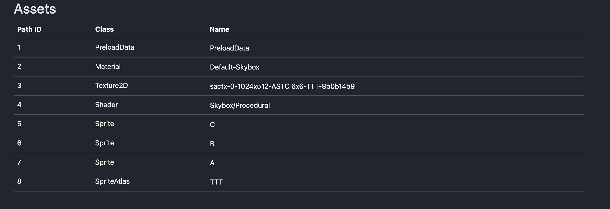

> 注意：Resources目录下的资源会被无条件地打入包内，即便是包含在图集内的散图，最终打进包内的是散图所在的图集+散图自己，会有资源冗余。就比如图片C，在Resources目录下有一张图片C散图，然后图片C又被打入TTT图集存放在sharedassets中，不过本测试图集中还有很多的空白空间，多一张图片C并不会造成图集变大，因此包体不会变大。

### SpriteAtlas未勾选IncludeInBuild的情况

和`不使用AssetBundle 不使用SpriteAtlas`实验条件的结果一样，图集不会被打入包内。

## 有AssetBundle 没有SpriteAtlas的情况

我们需要更改一下工程的目录结构，新建一个AssetBundle目录，把Resources目录下的图片C移动到Sprites目录下，把Image预制体改名为ImageA放在PrefabA目录下，复制一个ImageA预制体改名为ImageB放在PrefabB目录下，将ImageB中的Sprite引用改为图片B。我们还要把刚才创建的图集删掉，防止影响实验。

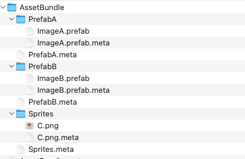

~~我们分别给这三个目录添加AssetLabels:~~

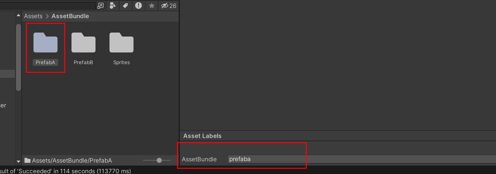

~~然后打开AssetBundleBrowser，就会看到我们刚才打的三个AssetBundleTag了~~

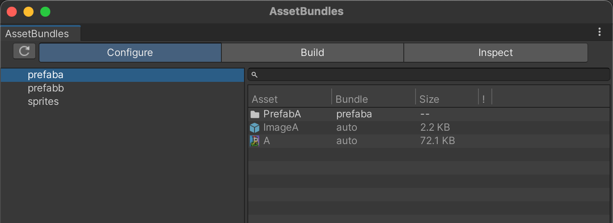

上面这样添加AssetBundleLabel是错误的，正确的方式是打开AssetBundleBrowser将要打Bundle的文件夹或者文件拖拽进去，所有的Bundle结构组织都在AssetBundleBrowser中操作。

执行Build操作

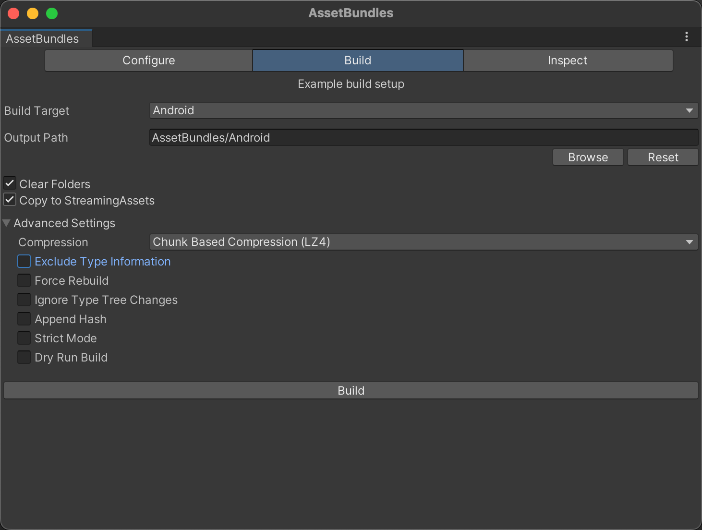

然后BuildAndroidPlayer，此时我们的资源就不是在`assets/bin/Data/data.unity3d`目录下了，而是在`assets/bin/`目录下。
实验预期是`assets/bin/Data/data.unity3d`内不包含任何我们自己创建的资源。不过注意：场景中还存放了一个Image的预制体，因此在`level0`中你会看到预制体相关的信息，而在`sharedassets0.asset`中你会看到预制体上引用的图片A。从场景中将预制体移除，再次打包，我们就不会再在`assets/bin/Data/data.unity3d`目录下看到任何我们自己创建的资源了。

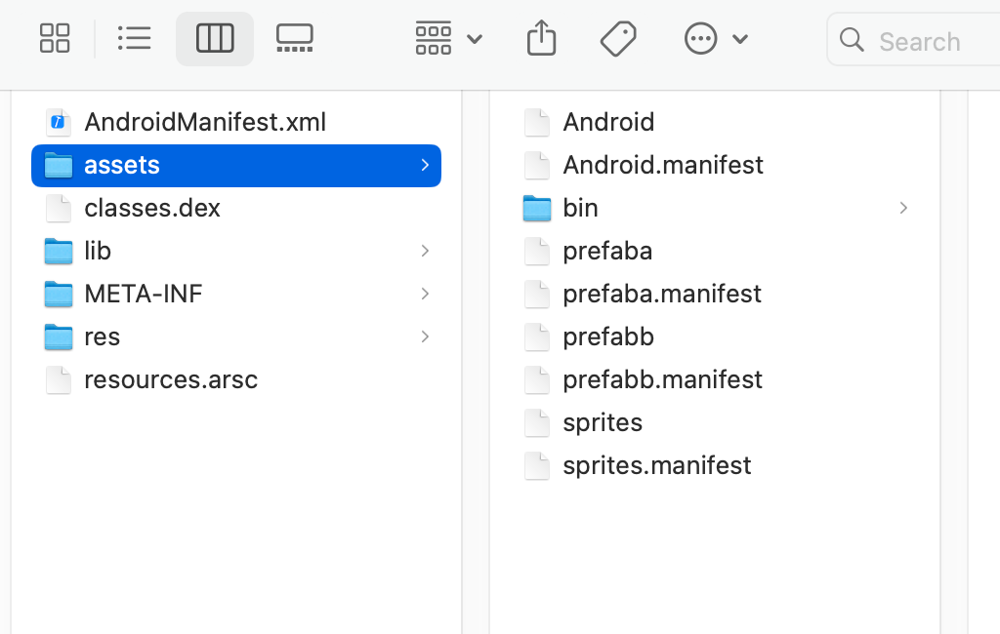

目前这种情况是没有资源冗余的，因为现在是散图，而且我们也在AssetBundle-Browser里面看到了每个Bundle中的资源情况。

## 有AssetBundle 有SpriteAtlas的情况

### SpriteAtlas勾选IncludeInBuild的情况

按照上面说的：删除原来的图集->退出Unity->删除工程下的Library目录->重新启动Unity->重新创建一个一模一样的图集。

然后打开AssetBundleBrowser，可以看到，即便是我们创建了图集并且把图片ABC都放进了图集内，在AssetBundleBrowser里面还是把图片ABC识别为了单张图片去引用，虽然看上去资源没有冗余，但是打出包来之后这些图片会以图集的方式存在在ab包内，因此每个ab包内都会有一张图集，实际上是冗余的。所以为了避免冗余，我们需要为SpriteAtlas显示指定打包路径。

另外在我们的测试场景中，发现了Unity中打图集和打Bundle的机制：以图片C为例，如果图片C所在的目录被指定要打Bundle了，那么即便是图集文件中指定了包含图片C，最终构建出来的Atlas中也是不包含图片C的。

### SpriteAtlas未勾选IncludeInBuild的情况 其实不是因为未勾选IncludeInBuild导致图集没打进包内，而是因为没有显式制定图集Bundle

这种情况等同于`有AssetBundle 没有SpriteAtlas的情况`，不使用图集而是将散图打进包内，只要没有显式指定这些散图要打到哪个Bundle里，如果有多个Bundle引用了同一个散图，这个散图就会被打进每一个引用它的Bundle里，不只是图片，所有的资源都是这个逻辑。因此可以将放在一个图集中的不同散图看作是一个资源。

## 结论

- 想要让图集被打入Bundle内，要么显示指定该图集被打入哪个Bundle，要么引用该图集的资源被显示打入某个或某些Bundle且勾选了IncludeInBuild，但会造成资源冗余，而且如果内嵌场景也有对该图集的引用，在内嵌资源中也会有一份冗余的图集资源。SpriteAtlas的IncludeInBuild勾选与否影响的是：当内嵌场景中有对该图集中的散图有依赖时，未勾选的图集不会内嵌进Player中，场景加载的时候有可能找不到这个图集，而如果场景没有依赖该图集，那勾不勾选无所谓，因为BuildPlayer时判定没有对该图集有引用，就算勾选了也不会内嵌进Player。**规范的图集与AssetBundle的使用应该是：内嵌场景中没有对图集的依赖、显示指定图集Bundle、不勾选IncludeInBundle**
- 勾选IncludeInBuild，不显式指定图集Bundle的情况下，BuildPlayer构建内嵌资源和BuildBundle构建Bundle资源，两种构建资源的结果是一样的，如果有对这个图集的引用，就会把这个图集构建到各自的资源中，没有引用就不会构建到包内。突然想到，把图集放到Resources目录下等价于AssetBundle中显式指定将图集打入Bundle。不勾选IncludeInBuild，且不指定图集Bundle，打入Bundle中的就都是散图了。
- 如果图集中的某一个散图被显示指定打入某一个Bundle，那么这个散图就不会被打进图集中，也不会因为有多个Bundle中的资源引用而造成冗余。
- 图集的引用计数等于图集中每一个散图各自引用计数的和
- 场景中应当尽可能地不包含任何资源的引用，而是通过一些脚本动态加载需要的资源，不然这些资源会被打进`assets/bin/Data/data.unity3d`文件中从而拖慢游戏的启动速度。
- 想要资源不冗余，就必须把场景中所有的资源引用过一遍，将所有引用的资源都显示地打Bundle。
- BuildPlayer与BuildBundle是两个独立的过程。在BuildPlayer阶段处理的资源都会嵌入到`assets/bin/Data/data.unity3d`，这类资源叫嵌入式资源。

好了，到此为止笔者大概清晰了AssetBundle和SpriteAtlas之间的关系，接下来笔者需要搞明白的事情是：在BuildBundle的时候自动将散图的关系和图集的关系的映射还是需要人为地去管理这个流程。我们需要看一下AssetBundleBrowser中的BuildBundle操作做了什么？

那么在构建AssetBundle的时候，AssetBundle是不知道有散图的图集的概念的吧？
Unity的AssetDataBase接口里面的GetAllDependency接口，在获取一个资源的所有依赖的时候，如果一个依赖是图片，那么它获取的依赖究竟是图集还是这个散图呢？需要验证一下。
是不是说明在BuildBundle之前需要先构建图集？ 然后再调用GetDependency接口的时候资源的依赖就都指向图集而非散图了。

## Sprite和SpriteAtlas和Texture的概念重要区分

在合理使用SpriteAtlas的情况下，当我们把AssetBundle包解开以后，会发现里面会包含一张Texture和若干个Sprite这两种资产。Texture是纹理，显示的文件大小较大；而Sprite可以理解为一个描述了精灵在整张纹理上的偏移量位置信息的数据文件，显示的文件大小较小。因此这个不是冗余，是正常现象。

Sprite和Sprite Atlas是两个类，他们中具有一些图片信息的数据成员，他们不是真的“图片”！而Texture才是真正的图片，因此在MemoryProfiler中你可以看到SpriteAtlas和Sprite类外加真正的图片Texture被加载到内存中

# 参考资料

- https://blog.csdn.net/yinfourever/article/details/109493160
- https://zhuanlan.zhihu.com/p/369080940
- https://docs.unity3d.com/cn/2021.2/Manual/AssetBundles-Native.html
- https://www.jianshu.com/p/1b1527faaca2
- https://www.jianshu.com/p/0d18ac565563
- https://blog.csdn.net/sunheng_/article/details/128204386
- https://blog.uwa4d.com/archives/TechSharing_249.html
- https://www.yuque.com/sibyl-3ao1w/phv062/sgagpsf8bcm9fu1b?singleDoc