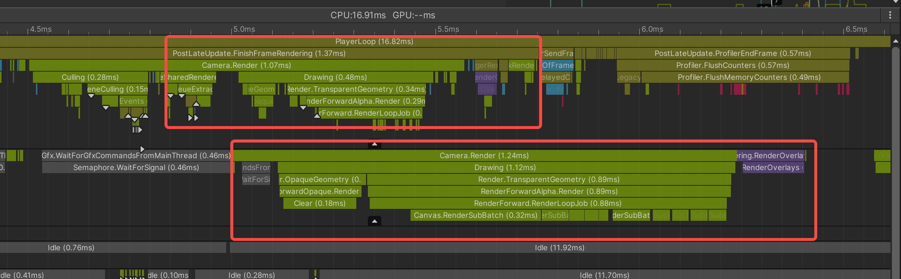

本文是笔者近期开展性能优化工作的知识点记录，性能优化涉及渲染、内存代码逻辑等方方面面，内容特别繁杂。以笔者目前的能力没有办法将这些知识系统梳理，因此本文每小节之间并无关联性，是一个个独立的知识点。

# 性能优化的原则

本小结翻译自[Unity官方的性能优化指导书](https://unity.com/cn/resources/ultimate-guide-to-profiling-unity-games)

## 设置帧率预算

# Unity 性能分析工具

Unity官方提供的性能分析工具有 'Profiler' 'Frame Debugger' 'Memory Profiler' 'Profile Analyzer'
笔者体验下来觉得这几个工具的使用还是很容易上手体验很好的

## 判断是CPU瓶颈还是GPU瓶颈

## Unity Profiler

在Unity Profiler中才看到的CPU Usage Module中 会看到一个Main Thread和Render Thread他们两个的关系是什么？
[Unity Forum的解答](https://forum.unity.com/threads/what-exactly-is-happening-in-the-renderthread.1011172/)

### CPUUsage TimeLine视图中常见的Marker

- Gfx.WaitForGfxCommandsFromMainThread : 此Marker会出现在RenderThread上，

## Memory Profiler

## Frame Debugger

# 对DrawCall Batch SetCallPass的理解

在Unity的Game窗口的工具栏上有一个Label叫Stats，激活该Label在Game窗口中会出现一个名叫Statistic的小弹窗。
你可以在这个小弹窗中找到Batches和SetPass calls两个字段。

那么SetPass Calls和Batches是什么？
DrawCall又是什么？
SetPass Call Batch和DrawCall的关系是什么？
DrawCall是一个在CPU上的操作，它指的是CPU向GPU发送一次绘制操作的命令，

在介绍SetPassCall之前，我们先确保我们能够对Shader有一个基本的了解，Shader的结构中会含有一个Pass
SetPassCall就和场景中所有的Material使用的Shader的Pass的个数有关， SetPassCall也是CPU向GPU发送的一种指令，用来告诉GPU要更换使用的Pass

Batches翻译过来是批次，它代表着在这一帧中CPU向GPU输送的绘制物体的次数

这是Unity的Dynamic Batching技术，如果没有这项技术的话，就会产生大量的DrawCall，Batch的意思是将多个DrawCall合并成一个DrawCall Batch的数量也就是CPU向GPU发送绘制命令的次数

在说Batches字段的含义之前，我们先来了解一下Unity的[合批(Batching)](https://docs.unity3d.com/Manual/DrawCallBatching.html)技术，这项技术通过把一些渲染信息相同的物体合并在一起打包一并发送给GPU渲染，这些物体本来要分批次发送给GPU，现在只需要发送一次，这样就降低了CPU和GPU的渲染次数。所以Batches的含义就是在一帧内CPU最终向GPU发送绘制命令的次数，或者叫DrawCall数。但是把Batches叫做DrawCall在官方的说法中没有说的很明确，笔者觉得官方没把Batch和DrawCall的关系说的很清楚，按照笔者的理解，Batching技术把原本需要用多个DrawCall完成的绘制命令合并到一个或者几个DrawCall 也就是我们常说的合批，不过有可能这些物体的渲染状态也相同，但是最后还是因为各种原因不能合批，有可能原本十个DrawCall不能合并成一个 但是能合并成两个。

- 如果Canvas中的UI元素的Z轴不为0 它们就无法被合批
  

# 一些想说的

性能优化是一个十分琐碎的事，在性能优化的过程中了解了Unity底层的执行顺序、内存管理等

