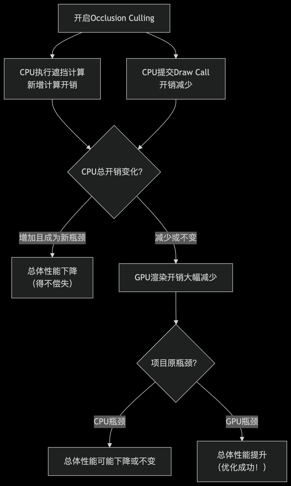

[看完Unity 官方Graphics文档](https://docs.unity3d.com/2022.3/Documentation/Manual/Graphics.html)

# Render中的概念

- RenderPipeline
- Graphics tiers

- frustum culling
- occlusion culling
- reflection probe
- rendering path

# RenderPipeline就干三件事情

剔除 分为视锥体提出(frustum culling)和遮挡剔除(occlusion culling)

Preventing wasted rendering operations can save on both CPU and GPU time. Unity’s built-in occlusion culling performs runtime calculations on the CPU, which can offset the CPU time that it saves. Occlusion culling is therefore most likely to result in performance improvements when a Project is GPU-bound due to overdraw. Unity官方文档中对于Occlusion Culling的叙述我没明白, 为什么GPU瓶颈的情况 通过使用OcclusionCulling操作可以提高性能? 那它说的Unity’s built-in occlusion culling performs runtime calculations on the CPU, which can offset the CPU time that it saves. 这句话又是什么意思?
非常好的问题！你引用的这段Unity官方文档确实点出了 occlusion culling 的一个核心权衡。我们来把它拆解清楚。

核心问题：为什么GPU瓶颈时，使用OC能提高性能？
简单回答：因为 OC从根本上解决的是“过度绘制（Overdraw）”问题，而过度绘制是GPU的主要负担之一。

让我们详细解释一下：

什么是过度绘制（Overdraw）？

它指的是GPU在同一帧中，对屏幕上的同一个像素进行了多次绘制。

例如，一堵墙前面有一棵树。当相机渲染时，GPU会先绘制远处的墙（像素颜色被设置为“墙”），然后绘制近处的树（像素颜色被覆盖为“树”）。对于被树挡住的墙的部分像素，GPU进行了两次绘制，但最终只有树的颜色是有效的。第一次绘制墙的操作就是“浪费”的渲染，即过度绘制。

GPU瓶颈与过度绘制的关系：

当你的游戏是 GPU瓶颈（GPU-Bound） 时，意味着每一帧的渲染速度主要受限于GPU的处理能力。GPU已经满负荷工作，而CPU还有空闲。

过度绘制会极大地增加GPU的工作量。如果场景复杂，一个像素被绘制5次、10次甚至更多，GPU就需要处理数倍于最终屏幕像素数量的计算（着色、光照、纹理采样等），这直接导致了帧率下降。

Occlusion Culling（遮挡剔除）如何解决这个问题？

OC的工作就是在CPU上预先判断：“从相机的视角看，哪些物体被其他物体完全挡住了（即不可见）？”

判断完成后，CPU会形成一个“最终可见物体列表”并交给GPU。

GPU只会渲染这个列表里的物体，而那些被完全挡住的物体（例如，房间外的物体、被墙挡住的家具等）根本不会进入渲染管线。

结果就是：GPU需要处理的物体数量大大减少，过度绘制被极大降低。 GPU的工作负担减轻了，帧率自然就上去了。这就是为什么在GPU瓶颈时，OC能带来显著的性能提升。

第二句话：“Unity’s built-in occlusion culling performs runtime calculations on the CPU, which can offset the CPU time that it saves.” 是什么意思？
这句话描述的是OC的成本或副作用。它意思是：

“Unity自带的遮挡剔除功能需要在运行时由CPU进行计算，这个计算本身会消耗CPU时间，从而可能抵消掉它（通过减少渲染）为CPU节省下来的时间。”

我们来分解一下：

“performs runtime calculations on the CPU”：OC不是一个简单的开关。它需要CPU每帧（或在一定频率下）进行视锥体剔除（Frustum Culling，剔除相机视野外的物体）和更复杂的遮挡剔除计算（使用预先烘焙的数据或运行时算法判断物体之间的遮挡关系）。这些计算是需要消耗CPU计算资源的。

“offset the CPU time that it saves”：

OC本来也能为CPU节省时间：因为CPU需要准备渲染数据并提交给GPU（称为Draw Call）。如果OC成功剔除了一半的物体，CPU需要准备和提交的Draw Call也就减少了一半，这部分工作是节省了的。

但是，进行OC计算本身也需要花费CPU时间。

如果 OC计算本身消耗的CPU时间 > 因减少Draw Call而节省的CPU时间，那么总体上，CPU的负担反而加重了。

举个例子：
假设没有OC时，CPU一帧需要花 5ms 来提交所有Draw Call。
开启OC后：

CPU需要花 3ms 来执行OC计算。

由于OC剔除了很多物体，CPU现在只需要花 1ms 来提交剩下的Draw Call。

CPU总耗时 = 3ms + 1ms = 4ms。 这比之前的5ms要少，性能提升。

但换一个场景：

CPU执行复杂的OC计算花了 6ms。

剔除后，提交Draw Call花了 1ms。

CPU总耗时 = 6ms + 1ms = 7ms。 这比不开OC时的5ms更糟，性能下降。

总结与结论
对GPU的好处（核心价值）：OC通过减少渲染对象数量，直接降低了GPU的过度绘制，这在GPU瓶颈时效果极佳。

对CPU的双刃剑效应：OC会带来CPU的额外计算开销。它节省了提交Draw Call的时间，但增加了剔除计算的时间。

在CPU瓶颈（CPU-Bound）的项目中：如果OC计算本身很重，它很可能得不偿失，导致整体帧率下降。

在GPU瓶颈或CPU/GPU平衡的项目中：OC节省的GPU时间远大于它带来的CPU开销，从而大幅提升帧率。

因此，Unity文档的那段话是在教你如何正确地使用这个功能：

不要无脑地开启Occlusion Culling。你应该先使用Unity Profiler分析你的游戏，确定瓶颈到底是CPU还是GPU。如果主要是GPU瓶颈且由过度绘制引起，那么开启OC很可能带来收益。如果已经是CPU瓶颈了，开启OC可能会让情况恶化。

所以这是一个此消彼长的过程是吧
完全正确！这就是一个非常经典的“此消彼长”或者说“权衡（Trade-off）”的过程。

你用这个词来形容，非常精准地抓住了 occlusion culling 乃至很多游戏优化技术的核心思想。

我们可以把这个过程清晰地画出来：

就像上图展示的，这完全是一个系统性的平衡艺术。优化从来不是免费的，用一个地方的资源（CPU时间）去换取另一个地方的资源（GPU时间）。

成功的优化就是确保：

你付出的代价（CPU计算）小于你得到的收益（GPU时间减少）。

你换取的资源正好是系统最缺的那个（即缓解了系统的瓶颈）。

所以，Unity 官方文档的那段话，本质上就是在提醒你：不要盲目使用优化技术。一定要先分析（Profile），找到真正的瓶颈（Bottleneck），然后再有针对性地进行优化，否则很可能适得其反。

You can use occlusion culling to occlude Dynamic GameObjects, but Dynamic GameObjects cannot occlude other GameObjects. If your Project generates Scene geometry at runtime, then Unity’s built-in occlusion culling is not suitable for your Project. Dynamic Gameobject是什么 是我动态加载实例化的东西吗?
说得非常对！你的理解基本正确，但我们可以更精确地定义一下。

什么是 Dynamic GameObject（动态游戏对象）？
在Unity occlusion culling（遮挡剔除）的上下文中，Dynamic GameObject 主要指的是在运行时移动、旋转或缩放的物体，而不是指“动态加载实例化”这个动作。

更准确的区分如下：

静态遮挡物（Static Occluder）：

在场景中永远不会移动、旋转或缩放的物体。

你需要在其Inspector窗口中将 Occluder Static 复选框勾选。

作用：只有被标记为 Occluder Static 的物体才能在烘焙（Bake）时被计入遮挡数据，从而能够遮挡其他物体。

例子：场景中的地形、建筑、不会移动的墙壁、大型岩石等。

动态游戏对象（Dynamic GameObject）：

在运行时会移动、旋转或缩放的物体。

或者，即使它不移动，但也没有被标记为 Occluder Static。

作用（局限性）：

它可以被静态遮挡物遮挡（例如，一个移动的角色走到墙后面，会被墙遮挡而剔除）。

但它自身无法作为遮挡物去遮挡其他物体（例如，一辆移动的大卡车开过去，它无法遮挡它后面的房子或树，即使从相机角度看它确实挡住了）。

例子：玩家角色、敌人、NPC、可移动的车辆、可被拾取的物品、由代码实例化并会移动的对象等。

针对你提到的两种情况：
“是我动态加载实例化的东西吗？”

你动态实例化（Instantiate）出来的一个物体，如果它在生成后一动不动，并且你将其标记为了 Occluder Static，那么它可以作为遮挡物。（但这种情况很少见，因为通常静态物体直接放在场景里就好，没必要运行时实例化）。

你动态实例化出来的物体，如果会移动或者没有标记为Static，那它就是Dynamic GameObject。它只能被遮挡，不能遮挡别人。

“如果您的项目在运行时生成场景几何体，那么Unity的内置遮挡剔除不适合您的项目。”

这句话的意思是：如果你的游戏关卡、地形、房间布局等主要几何结构是在运行时随机生成或动态加载的（例如程序化生成的地牢、随机地图的沙盒游戏），那么就不适合使用Unity内置的烘焙式 occlusion culling。

原因：Unity的 occlusion culling 需要预先烘焙（Precompute/Bake）。烘焙过程会基于那些标记为 Occluder Static 的物体来计算它们之间的遮挡关系，并将结果保存成数据。运行时只是查询这些预计算的数据。

如果场景结构是运行时才确定的，那么就无法进行预先烘焙，这个系统也就失效了。

总结
对象类型	能否移动？	能否被遮挡？	能否作为遮挡物？	例子
静态遮挡物 (Occluder Static)	不能	可以（但没必要）	可以	地形、静态建筑
动态游戏对象 (Dynamic GameObject)	可以	可以	不可以	角色、车辆、子弹
所以，如果你的游戏有很多大型的、会移动的物体（比如巨型机器人、移动的堡垒），你希望它们也能遮挡其身后的东西，Unity内置的OC就无法满足需求了。这种情况下，开发者通常会寻求基于软件光栅化（Software Rasterization）的实时遮挡剔除系统（如Umbra、PVSporta等第三方解决方案，或Unity的Entitiy组件系统ECS下的一些新方法）。

运行时 动态加载实例化一些预制体出来 Unity也没有什么接口能让我在运行时给这些物体设置静态的操作吗?
非常好的问题！这触及了Unity静态系统的一个核心限制。

简单直接的回答是：没有。Unity 没有提供在运行时（Runtime）通过代码将 GameObject 设置为“静态”（包括 Occluder Static）并使其生效的接口。

详细解释
为什么不行？

烘焙（Baking）是一个编辑器（Editor-Time）过程：静态标记的真正意义在于，它告诉Unity的光照系统（GI）、遮挡剔除系统（Occlusion Culling） 和导航系统（Navigation） 等，这些物体是静止的，可以针对它们进行预计算。

这个预计算过程（我们常说的“Bake灯光”、“Bake Occlusion”）非常耗时，它需要分析场景中所有静态物体的几何关系、UV、材质属性等，并生成相应的数据（如光照贴图、遮挡数据、导航网格）。这个过程绝不可能在游戏运行时实时完成，否则会卡住游戏好几秒甚至几分钟。

gameObject.isStatic 属性存在，但它是“陷阱”
你确实能在代码中找到 gameObject.isStatic 这个属性，并且可以设置它。但是！

它只改变标识，不触发烘焙。你可以在运行时将一个物体 isStatic = true，但这只是一个“标签”。光照、遮挡等系统所使用的预计算数据是在编辑器阶段就生成好的，运行时不会因为你这个标记的改变而重新计算。

结果是无效的。你把它标记为静态，但它并不会因此就能遮挡其他物体，也不会参与全局光照。它的作用微乎其微，几乎只是为了查询。

运行时实例化的物体如何参与遮挡？
虽然不能成为“遮挡物”，但你动态实例化的物体仍然可以作为“被遮挡者”，这是自动的，无需任何设置。

流程是这样的：

你在编辑器烘焙Occlusion Data时，场景里那些标记为 Occluder Static 的墙壁、山体等生成了遮挡数据。

运行时，你实例化了一个角色（动态物体）。

Unity的摄像机每帧都会进行视锥体剔除和遮挡查询。

它会判断你这个角色的包围盒是否被那些预计算好的静态遮挡物挡住。

如果被挡住，Unity就不会渲染这个角色。

所以，动态物体享受到了被静态遮挡物剔除的好处，但它自己不能贡献遮挡。

替代方案与解决方案
如果你的项目确实需要在运行时动态生成关卡，并且希望这些新生成的墙体等能作为有效的遮挡物，你有几个选择：

使用第三方实时遮挡剔除解决方案：

例如 Umbra（很多3A大作在用）、PVS Studio 等。

它们的工作原理不同，通常基于软件光栅化等技术，在CPU上实时计算遮挡关系，不依赖预烘焙的数据，因此非常适合动态环境。但这些都是付费插件，并且需要一定的集成和学习成本。

自己实现简单的遮挡剔除：

对于简单需求，你可以自己写逻辑。例如：

距离剔除：如果物体离相机很远，直接隐藏。

手动区域管理（Room System）：将动态生成的关卡分成多个房间（Room），当相机在一个房间内时，只启用这个房间内的物体，禁用其他所有房间的物体。这是一种粗粒度的“遮挡”。

设计上的规避：

这是最常用的方法。既然知道动态生成的物体不能遮挡，就在设计关卡时避免出现“需要一个动态生成的大物体去遮挡大量其他动态物体”的情况。

确保主要的、大型的遮挡物（如外围城墙、主要建筑结构）是场景中预先放置好并烘焙好的静态物体。而动态生成的部分只是内部的可移动细节。

结论
你不能在运行时创建真正的“静态”物体。Unity的静态系统是一个为编辑器预计算服务的系统。

对于遮挡剔除：运行时实例化的物体只能是被遮挡者，无法成为遮挡物。

如果你的项目严重依赖运行时生成几何体并需要它们遮挡，你需要寻求不依赖预烘焙的实时剔除方案，而不是试图去设置静态标志。

那比如说 场景中有一个被标记为static的物体 我在运行时通过脚本获取到了这个物体 然后用代码去移动这个物体 会有什么问题吗?
千万不要这样做！ 这是一个非常错误的操作，会导致一系列问题，但Unity并不会阻止你这么做。

移动一个在编辑器中被标记为 Static 的物体，会导致“静态”系统的假设完全失效，从而引发各种渲染和逻辑错误。

会产生的问题：
渲染错误（最主要的问题）：

光照错误（Lighting Artifacts）：静态物体参与了全局光照（GI） 和光照贴图（Lightmapping） 的烘焙。光照贴图上的光线、阴影和反弹光信息都是基于该物体原始的位置、旋转和缩放计算并“烤”在纹理上的。如果你移动了物体，它的模型顶点和光照贴图上的信息就错位了，会导致奇怪的阴影、错误的光照甚至模型变黑。

遮挡剔除失效（Broken Occlusion Culling）：遮挡数据是基于物体静态时的位置预计算的。你移动它之后，它可能还在原地遮挡着实际上已经可见的物体，或者它本该在新位置遮挡物体却没能起到作用。这会导致本应被剔除的物体被渲染（性能下降） 或本应被渲染的物体被错误剔除（物体消失）。

性能问题：

虽然你移动了它，但Unity的许多系统（如GI、OC）仍然会把它当作静态物体来处理，使用那份已经失效的预计算数据。这会导致CPU和GPU在做无用功，甚至比直接使用一个动态物体的性能还要差。

导航系统问题（如果标记了 Navigation Static）：

如果这个静态物体还参与了导航网格（NavMesh）的烘焙，那么AI会依然认为它在旧的位置上，从而撞向空气墙（因为物体实际已经移走了）或者穿墙而过（因为物体移动到了一个原本可通行的区域）。

正确的做法是什么？
如果你需要一个物体在游戏开始时是静态的（参与烘焙），但运行时又需要移动它，你必须遵循以下流程：

在运行时取消其静态标记：在移动它之前，通过代码将其 isStatic 属性设置为 false。

通知相关系统更新：告诉Unity的各个系统，这个物体的状态已经改变了。

对于渲染器（Renderer）：通常需要强制刷新或重新计算一些数据，但在Unity中，简单地取消静态标记后，渲染器会将其视为动态物体，使用实时光照而不是光照贴图。这可能会导致视觉效果突变（例如从有烘焙光变到只有实时光）。

对于导航（Navigation）：如果你移动了一个曾经是导航静态的物体，你可能需要重新烘焙导航网格（NavMesh） 或使用 NavMesh Obstacle 组件来动态阻挡AI。运行时烘焙NavMesh是一个开销很大的操作，需要谨慎使用。

示例代码：

csharp
public class MoveStaticObject : MonoBehaviour
{
    public GameObject staticObject; // 赋值那个静态物体
    public Vector3 targetPosition;

    void Start()
    {
        // 1. 在移动前，取消它的静态标记！
        staticObject.isStatic = false;

        // 2. （可选但重要）通知渲染器等相关组件
        // 例如，强制它使用实时光照，停止尝试使用光照贴图
        var renderer = staticObject.GetComponent<Renderer>();
        if (renderer != null)
        {
            renderer.lightProbeUsage = UnityEngine.Rendering.LightProbeUsage.BlendProbes; // 使用光照探针
            // renderer.reflectionProbeUsage = ...; // 可能需要设置反射探针
        }

        // 3. 现在可以移动它了
        staticObject.transform.position = targetPosition;

        // 注意：对于导航，处理起来更复杂，需要添加NavMeshObstacle或RebakeNavMesh。
    }
}
总结
静态标记是一个“契约”：你向Unity承诺这个物体在运行时永远不会变换（移动、旋转、缩放），Unity则通过耗时的预计算来为你优化光照和性能。

如果你在运行时打破了这份契约（移动了静态物体），Unity基于承诺所进行的优化就会全部出错。 因此，最佳实践是：任何需要在运行时变换的物体，都不要在编辑器里标记为 Static。 如果它最初是静态的，移动前务必先取消其静态标记。

Camera -> DynamicA -> DynamicB -> Static C -> Dynamic D -> Static E 这个位置关系中, D 、E实际上是不会渲染的, 剩下的A B C 都渲染
非常好！你给出的这个例子非常经典，完美地说明了Unity遮挡剔除（Occlusion Culling）的工作原理。

你的理解是完全正确的。

在这个位置关系 Camera -> DynamicA -> DynamicB -> Static C -> Dynamic D -> Static E 中，最终的渲染结果很可能是：Dynamic A, Dynamic B, Static C 被渲染，而 Dynamic D 和 Static E 不会被渲染。

原理逐步分析：
让我们一步步分析相机渲染时发生了什么：

视锥体剔除（Frustum Culling）：

首先，相机会进行视锥体剔除。我们假设所有物体（A, B, C, D, E）都在相机的视野范围内，所以这一步它们全部通过。

遮挡查询（Occlusion Query）：

接下来，Unity的遮挡剔除系统开始工作。它会使用在编辑器里预先烘焙好的遮挡数据（由 Static C 和 Static E 这些静态遮挡物生成）来判断物体之间的可见性。

它的判断逻辑是从近到远（或者按某种顺序），但核心是：如果一个物体被一个已知的、不透明的遮挡物完全挡住，它就会被剔除。

具体到你的例子：

Dynamic A：离相机最近，没有任何东西挡住它。（渲染）

Dynamic B：它可能在A的后面，但Dynamic物体不能作为遮挡物，所以系统会认为A没有挡住B。B是否被渲染取决于它有没有被静态遮挡物挡住。假设没有，（渲染）

Static C：它是一个强大的静态遮挡物。系统会检查它是否可见。因为前面的A和B都是动态物，不遮挡它，所以它是可见的。（渲染）

Dynamic D：系统会检查D的包围盒（Bounds）。由于 Static C 是一个有效的静态遮挡物，并且从相机视角看，D完全在C的后面，因此Unity会判定D被C完全遮挡。（剔除，不渲染）

Static E：系统同样会检查E的包围盒。它不仅在C的后面，还在D的后面。但判断遮挡时，只要有一个不透明的静态遮挡物（C）挡住了它，它就会被剔除。不需要关心它前面还有一个Dynamic D。（剔除，不渲染）

核心要点总结：
遮挡物的权威性：只有被标记为 Occluder Static 的物体（如你的C和E）才能在遮挡查询中起到遮挡作用。动态物体（A, B, D）即使看起来很大，也完全不会影响遮挡计算。

查询逻辑：遮挡查询并不关心物体之间的“父子关系”或“逻辑关系”，它只关心它们的世界坐标下的包围盒和从相机出发的射线是否被静态遮挡物阻断。

性能增益：正是因为这个机制，Static C 成功地将它身后的整个区域（包括D和E）都剔除了，为GPU节省了大量的渲染工作量（避免了overdraw）。这就是 occlusion culling 在GPU瓶颈场景中提升性能的关键。

所以，你的判断非常准确！这个例子清晰地展示了为何将重要的、大的场景结构标记为 Occluder Static 是如此重要。

如果场景中没有物体被标记为Static 那么开启摄像机的OcclusionCulling有什么作用呢?
这是一个非常好的问题，它触及了Unity occlusion culling 系统的一个关键前提。

简单直接的回答是：如果场景中没有任何物体被标记为 Occluder Static，那么开启摄像机的 Occlusion Culling 功能几乎没有任何作用，只会白白浪费一点CPU性能。

详细解释
Occlusion Culling 系统的工作分为两个核心阶段：

预计算阶段（烘焙，Baking）：

在编辑器里，你点击“Bake”按钮时，Unity会遍历场景中所有标记了 Occluder Static 的物体。

它会将这些物体的几何信息（简化后的）分解成一个个小块（ cells），并计算它们之间的相互遮挡关系，然后将这些关系保存成一个遮挡数据文件（OcclusionCullingData.asset）。

如果没有物体被标记为 Occluder Static，这个烘焙过程就无法生成任何有效的遮挡数据。 结果就是一个空的或者无效的遮挡数据文件。

运行时阶段（查询）：

在游戏运行时，开启Occlusion Culling的摄像机会查询第一步中生成的预计算数据。

它会根据相机的位置和视角，快速地从数据中查出：“在这个视角下，哪些静态遮挡物是可见的？哪些区域被它们完全挡住了？”

然后，它会将那些位于被挡住区域内的物体（无论是静态还是动态）从渲染队列中剔除。

如果没有预计算的遮挡数据（因为没标记静态物体），这个查询就无数据可查，系统也就无法知道任何遮挡关系。

那么，开启后还有什么效果？
即使没有静态遮挡物，开启Occlusion Culling可能还会有以下极其有限的效果，但这些效果并不依赖它：

视锥体剔除（Frustum Culling）：

这是所有摄像机默认永远开启的核心功能，与你是否开启Occlusion Culling无关。

它的作用是只渲染相机视锥体（视野范围）内的物体。视野外的物体本来就不会渲染。

你开不开OC，视锥体剔除都在工作。所以这不是OC的功劳。

非常微弱的动态物体处理：

理论上，Unity的OC系统可能仍会为动态物体执行一些最基本的包围盒检查。但由于没有静态遮挡物作为参考，它无法判断一个动态物体是否被另一个动态物体挡住（因为动态物体不能作为遮挡物）。

因此，所有动态物体只要在视野内，就都会被渲染，哪怕它们堆叠在一起。这会导致严重的过度绘制（Overdraw）。

结论与比喻
你可以把这个过程想象成一个捉迷藏游戏：

静态遮挡物（Occluder Static）：就像是房间里预先把家具、墙壁的位置和大小画好的藏宝图。

烘焙（Baking）：就是绘制这张藏宝图的过程。

运行时Occlusion Culling：就是“鬼”看着这张藏宝图，直接知道哪些地方藏了人（被遮挡），不用一个个角落去翻找（渲染）。

如果你的场景里没有标记任何静态物体，就相当于：

你告诉“鬼”：“我们玩捉迷藏吧！”，然后递给他一张白纸（空的遮挡数据）。“鬼”拿着这张白纸，依然需要翻遍房间的每一个角落（渲染所有视野内的物体），因为他没有任何信息能帮他排除任何位置。

因此，开启摄像机的Occlusion Culling功能，但又不提供任何静态遮挡物，是完全没有意义的优化策略。 正确的做法是：将场景中永远不会移动的大型物体（地形、建筑、山体）标记为 Occluder Static，并进行烘焙，这样才能真正发挥OC的强大威力。

这个Bake操作 是每次打包前必须我自己处理吗? 还是自动处理
这是一个非常关键的工作流问题。

答案是：Bake操作必须由你在Unity编辑器中手动执行。它不会在打包时自动处理，也不会在运行时自动完成。

详细解释
为什么不是自动的？

极其耗时：烘焙光照（GI）和遮挡剔除（Occlusion Culling）是非常消耗计算资源的进程，可能需要几分钟到几小时不等，取决于场景的复杂度和你的电脑配置。如果每次打包前都自动执行一次，整个开发流程会变得无法忍受的缓慢。

需要人工审核：烘焙结果常常需要开发者用眼睛去检查。比如光照贴图是否有瑕疵、漏光？遮挡剔除是否正确，有没有不该被剔除的物体被剔除了？这些都需要人工在编辑器里查看和调整参数后重新烘焙，无法全自动完成。

基于编辑器状态：烘焙过程依赖于物体在编辑器场景（Scene） 中的状态（位置、静态标记、光照参数等）。打包（Build）过程只是将编辑器的最终成果（包括烘焙好的数据文件）打包成一个游戏应用程序。

烘焙的数据去哪了？
当你点击Bake按钮后，Unity会在你的项目资产（Assets） 文件夹中生成对应的数据文件：

光照烘焙（Lighting Bake）：会在场景文件所在的同级目录生成一个名为 LightingData 的文件夹，里面包含 .exr, .lighting 等光照贴图和数据文件。

遮挡剔除烘焙（Occlusion Culling Bake）：会在场景文件所在的同级目录生成一个 OcclusionCullingData.asset 文件。

打包（Build）时，这些数据文件会和场景、模型、纹理等资源一起被包含到最终的游戏包（.apk, .exe等）中。运行时直接读取这些预计算好的数据。

正确的工作流程
你的工作流程应该是这样的，特别是在项目后期：

在编辑器中进行最终调整：布置好场景中的所有静态物体，设置好灯光参数、 occlusion culling 参数。

手动执行烘焙：在 Window > Rendering > Lighting 和 Window > Rendering > Occlusion Culling 面板中，点击 Generate Lighting 和 Bake 按钮。

等待并检查结果：等待烘焙完成，在场景视图中检查烘焙效果是否正确。如果有问题，调整参数后回到第2步重新烘焙。

保存场景和项目：确保烘焙生成的数据文件已经保存。

打包（Build）：现在你可以点击 File > Build Settings... > Build 进行打包了。打包器会自动包含所有当前已经烘焙好的数据文件。

非常重要的注意事项
版本控制（Version Control）：烘焙生成的数据文件（光照贴图、OcclusionCullingData.asset）是必须提交到版本控制系统（如Git, SVN） 的文件。这样能保证所有团队成员和构建服务器（CI/CD）拿到项目后，看到的画面和性能是一致的，而无需自己重新烘焙。

构建服务器（CI/CD）：在自动化的构建流水线上，通常不会执行烘焙操作。构建脚本会直接打包已经由开发者在本机烘焙好并提交到版本库的数据。如果需要在服务器上烘焙，需要专门配置，但这会极大地增加构建时间。

动态修改：如果你在运行时通过代码实例化或移动了物体，这些变动完全不会影响已经烘焙好的数据。这也是为什么移动静态物体会导致渲染错误的原因。

总结一句话：Bake 是你在编辑器里为游戏“预处理”数据的创作过程，而 Build 只是将这些处理好的成果“打包发货”。