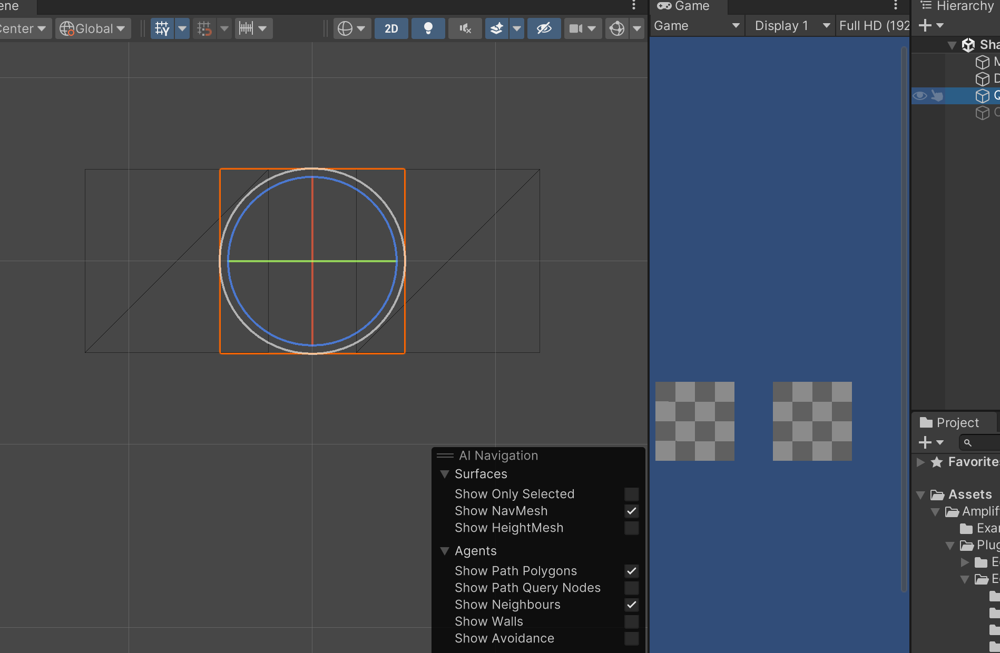
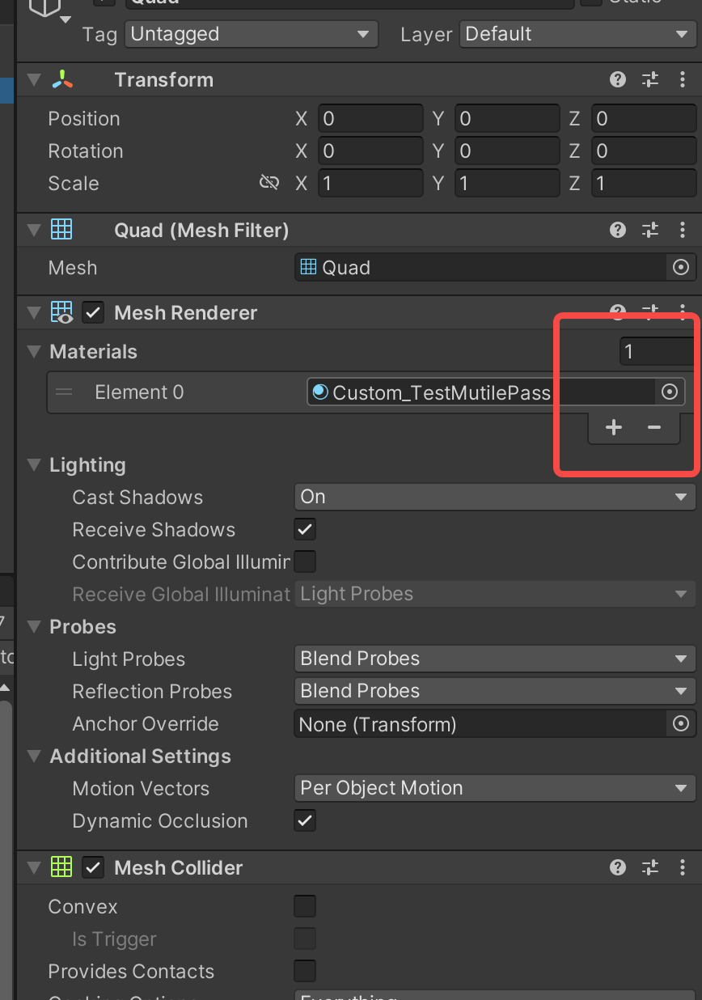
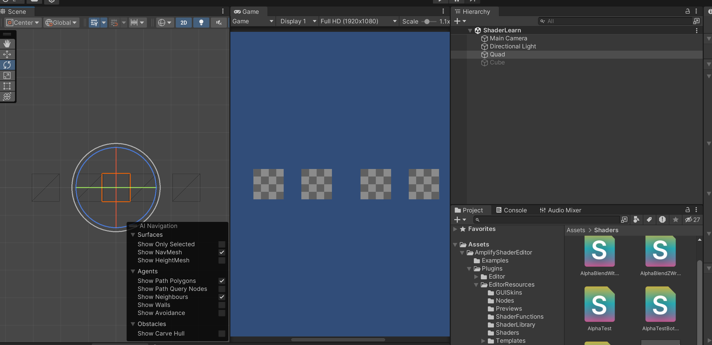
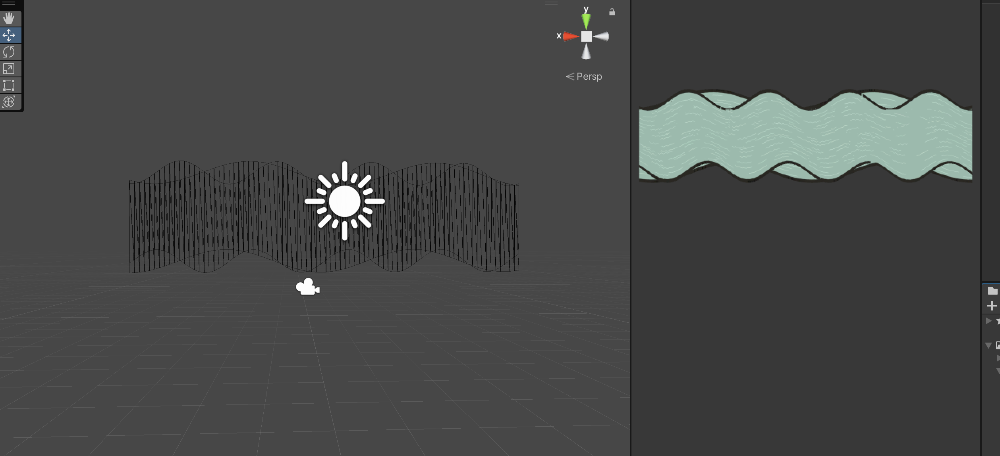
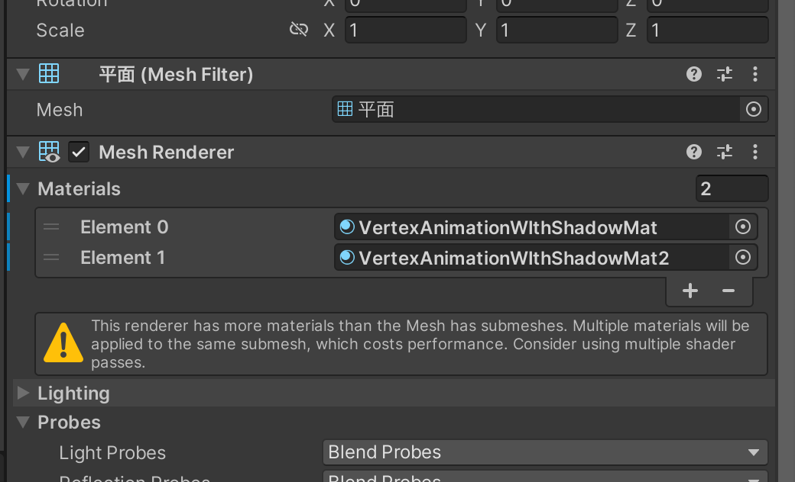
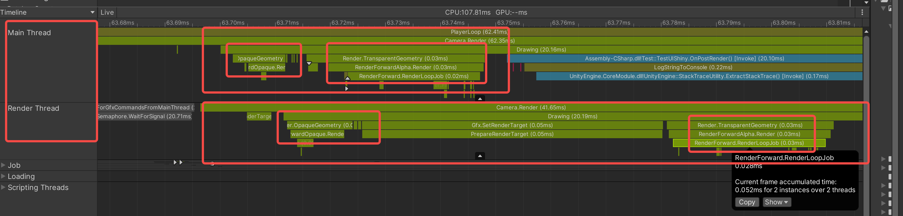
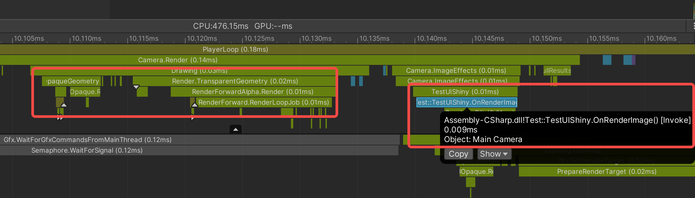

# CPU和GPU的关系

> 这里我想到了CPU和GPU之间的角色关系很像幼儿园或者小学一二年级里老师和小朋友在玩问答游戏，老师发问 “一加一等于几？” “二乘二等于几？” 小朋友们要回答“二！”“四！”。老师（CPU）负责提供 运算数（网格顶点信息）和运算式（Shader）而小朋友（GPU）需要做的是把老师给的题目解答出来就可以了。

# 关于多Pass
在本书的第八章透明效果中第一次遇到了多Pass的概念，笔者在学习多Pass的过程中产生了很多疑惑，直到第十二章笔者的疑惑才得以解答。
首先为什么Shader中需要多Pass的存在？在本书第三章介绍SubShader的时候提到了每一个Pass都会完整地走一遍GPU的流水线。笔者无法理解同一份顶点数据是如何能够在GPU中经过多个Pass处理表现出多个效果的。比如说，有一个包含有两个Pass的Shader，第一个Pass在顶点着色器中进行了顶点向左偏移的操作，第二个Pass在顶点着色器中进行了顶点向右偏移的操作。最终表现的效果是怎么样的呢？笔者自己写了一段Shader验证一下：

```
Shader "Custom/TestMutilePass"
{
    Properties
    {
        _MainTex ("MainTex", 2D) = "white" {}
        _InvWaveLength ("Distortion Inverse Wave Length", Float) = 10
    }
    
    SubShader
    {
        
        CGINCLUDE

        #include "UnityCG.cginc"
        #include "Lighting.cginc"

        sampler2D _MainTex;
        float _InvWaveLength;
        float4 _MainTex_ST;

        struct a2v
        {
            float4 vertex : POSITION;
            float4 texcoord : TEXCOORD0;
        };
        
        struct v2f
        {
            float4 position : SV_POSITION;
            float2 uv : TEXCOORD0;
        };
        
        fixed4 frag(v2f i) : SV_TARGET
        {
            float4 color = tex2D(_MainTex, i.uv);
            return color;
        }
        
        ENDCG
        
        Pass
        {
            CGPROGRAM

            #pragma vertex vert;
            #pragma fragment frag

            v2f vert(a2v v)
            {
                v2f o;

                float4 offset;
				offset.yzw = float3(0.0, 0.0, 0.0);
				offset.x = _InvWaveLength;
            
                o.position = mul(unity_MatrixMVP, v.vertex + offset);
                o.uv = v.texcoord.xy * _MainTex_ST.xy + _MainTex_ST.zw;;
            
                return o;
            }
            
            ENDCG
        }
        
        Pass
        {
            CGPROGRAM
            
            #pragma vertex vert;
            #pragma fragment frag

            v2f vert(a2v v)
            {
                v2f o;

                float4 offset;
				offset.yzw = float3(0.0, 0.0, 0.0);
				offset.x = _InvWaveLength;
            
                o.position = mul(unity_MatrixMVP, v.vertex - offset);
                o.uv = v.texcoord.xy * _MainTex_ST.xy + _MainTex_ST.zw;
            
                return o;
            }
            
            ENDCG
        }
    }
}
```
笔者在第一个Pass中将所有的顶点都进行了向左的偏移，在第二个Pass中将所有的顶点进行了向右的偏移。把这个Shader给到一个材质并赋给一个Quad模型，可以看到表现效果如下：

在这一个Quad上竟然生成了两个面片！也就是说在表现上，这种多Pass方式达到了和在场景中创建多个模型同样的效果。
在来看一种情况，在Unity Inspector窗口中可以看到，一个MeshRenderer上面可以挂多个材质的：

那我们就在Quad模型上多挂几个看看，然后你就可以看到，在场景中虽然只有一个Quad模型，但是实际上你却能看到四个Quad模型在场景中！

下面这张图使用的是本书中第十一章模拟河流的Shader，可以看到确实达到了“分身”的效果。

到这为止，Unity多Pass的理解就基本清晰了：在显存中存储了模型的网格数据，每帧渲染的时候，每个Shader的每个Pass都会从显存中获取这些顶点数据，注意只是**读取**，Shader的执行不会影响存储在显存中的顶点数据，所以说，一个Shader的多个Pass只是都恰好读取了一模一样的顶点数据，各自执行的时候都操作各自的**临时数据**互不影响，最终渲染到屏幕上的时候也是各自渲染各自的，这真的挺奇妙的，使用多Pass和使用多个Material能够达到相同的效果，看起来Unity官方更加推荐使用多Pass的效果，这种方式更加节省性能。

在本章介绍高斯模糊实现方式中，作者使用到了RenderTexture，RenderTexture搭配多Pass使用还是挺巧妙的，因为它做到了**上一个Pass输出的RenderTexture的结果作为下一个Pass的输入**。这一点在非RenderTexture的应用上给笔者造成了困惑，这和直接把多Pass的Shader挂在一个模型上每个Pass各自渲染各自的情况是不一样的，比如上面的Quad实验。在非RenderTexture的应用中，笔者能想到的多Pass的应用是用来显示模型的外轮廓线，至于还有什么多Pass的应用场景，笔者在这里就不再脑力风暴了。

# Unity的OnRenderImage接口

> 在一帧中，CPU并不是一次性把这一帧所有的渲染命令打包提交给GPU进行渲染的，而是逐步提交的。

OnRenderImage接口的官方描述如下：Unity在相机完成渲染后调用的事件函数，它允许你修改相机的最终图像。(Event function that Unity calls after a Camera has finished rendering, that allows you to modify the Camera's final image.)

首先介绍一下Profiler中CPUUsage模块TimeLine窗口中MainThread和RenderThread的含义

- MainThread : This is where all of the game logic/scripts perform their work by default and where the majority of the time is spent for features and systems such as physics, animation, UI, and rendering
- RenderThread : During the rendering process, the main thread examines the scene and performs Camera culling, depth sorting, and draw call batching, resulting in a list of things to render . This list is passed to the render thread, which translates it from Unity’s internal platform-agnostic representation to the specific graphics API calls required to instruct the GPU on a particular platform

笔者在这里只关注两个Thread与GPU相关的作用，说白了MainThread负责相机剔除、深度排序和DrawCall合并的工作，将GPU要做的事情整理成一个列表，交给RenderThread。RenderThread负责接收到来自MainThread的列表后，把这个列表中的渲染命令翻译成GPU能够理解的东西，并发送给GPU，也就是**DrawCall**。

看一下下面这张图：



由这张图推测，Unity是在调用Camera.Render中的Drawing接口中进行的CPU和GPU的通信，然后我们来看一下下面这张图：



这张图反映了`OnRenderImage`方法调用和CPU GPU通信之间的时间间隔。按照Unity官方的描述说，OnRenderImage方法的第一个source参数是当前帧这个Camera的渲染结果，也就是说GPU在这么短的时间里面就完成了这一帧中大部分场景的渲染。**笔者之前一直有误区，以为当前帧中GPU渲染的是上一帧CPU提交给GPU的命令，但其实不是，当前帧GPU渲染的就是当前帧的画面**。

2024.9.13更新
笔者还是觉得难以置信，要求GPU在这么短的时间里把这一帧的主要内容都渲染出来可能吗？笔者上面的测试场景中包含的东西很少，对GPU渲染来说没什么压力。还是需要在正式的环境下验证一条假设：如果有脚本调用了OnRenderImage，即使在OnRenderImage中没有做什么，会不会导致Camera.Render的执行时间变长，就是为了等GPU渲染完成把渲染结果传递给OnRenderImage的SourceRenderTexture。笔者决定等明天来公司了之后在公司的项目中调用一下OnRenderImage接口，然后在Profiler中看一下表现。

另外，当前实现屏幕后处理的效果使用的都是CommandBuffer了，比如Unity官方的屏幕后处理的库。OnRenderImage已经很少使用了。
