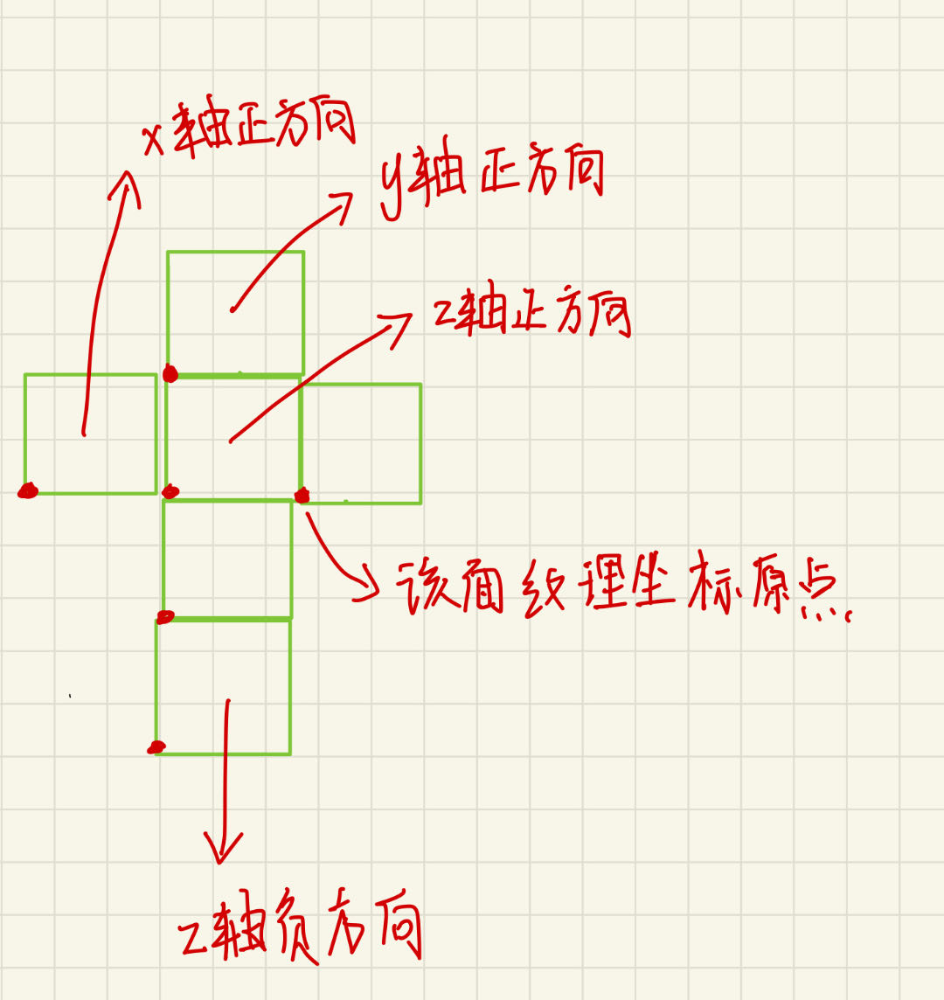

没有动画的画面往往会让人觉得很无趣，在本章中，我们将会学习如何向UnityShader中引入时间变量，以实现各种动画效果。

# Unity Shader中的内置变量(时间篇)

动画效果往往是把时间添加到一些变量的计算中，以便在时间变化时画面也可以随之变化。UnityShader提供了一些列关于时间的内置变量来允许我们方便地在Shader中访问运行时间，实现各种动画效果。下表是Unity中内置地时间变量。

| 名称            | 类型   | 描述                                                            |
| --------------- | ------ | --------------------------------------------------------------- |
| _Time           | float4 | t是自该场景加载开始所经过地时间，4个分量分别是(t/20, t, 2t, 3t) |
| _SinTime        | float4 | t是时间的正弦值，4个分量的值分别是(t/8, t/4, t/2, t)            |
| _CosTime        | float4 | t是时间的余弦值 ，4个分量分别是(t/8,t/4, t/2, t)                |
| unity_DeltaTime | float4 | dt是时间增量，4个分量的值分别是(dt, 1/dt, smoothDt, 1/smoothDt) |

在后面的章节中，我们会使用上述的时间变量来实现纹理动画和顶点动画。

# 纹理动画

纹理动画在游戏中非常广泛。尤其在各种资源都比较局限的移动平台上，我们往往会使用纹理动画来代替复杂的粒子系统等模拟各种动画效果。

## 序列帧动画

最常见的纹理动画之一就是序列帧动画。序列帧动画的原理十分简单，它像放电影一样，依次播放一系列关键帧图像，当播放速度达到一定数值时，看起来就像是一个连续的动画化。它的优点在于灵活性强，我们不需要进行任何的物理计算就可以得到非常细腻的动画效果。而它的缺点也很明显，由于序列帧中每张关键帧图像都不一样，因此要制作一张出色的序列帧纹理所需要的工程量很大。

想要实现序列帧动画，我们首先要提供一张包含关键帧图像的图像。
序列帧动画的精髓在于，我们需要在每个时刻计算下个应该播放的关键帧的位置，并对关键帧进行采样。

```
Shader "UnityShaderBook/Chapter11/ImageSequenceAnimation"
{
    Properties
    {
        _Color ("Color Tint", Color) = (1,1,1,1)
        _MainTex ("Image Sequence", 2D) = "white" {}
        _HorizontalAmount ("Horizontal Amount", Float) = 4
        _VerticalAmount ("Vertical Amount", Float) = 4
        _Speed ("Speed", Range(1, 100)) = 30
    }
    
    SubShader
    {
        Tags{
            "Queue"="TransParent"
            "IgnoreProjector"="True"
            "RenderType"="Transparent"
        }
        
        Pass
        {
            Tags
            {
                "LightMode"="ForwardBase"
            }
            
            ZWrite Off
            Blend SrcAlpha OneMinusSrcAlpha
            
            CGPROGRAM

            #pragma vertex vert
            #pragma fragment frag

            #include "UnityCG.cginc"
            
            fixed4 _Color;
            sampler2D _MainTex;
            float4 _MainTex_ST;
            float _HorizontalAmount;
            float _VerticalAmount;
            float _Speed;
            
            struct a2v
            {
                float4 vertex : POSITION;
                float4 texcoord : TEXCOORD0;
            };

            struct v2f
            {
                float4 pos : SV_POSITION;
                float2 uv : TEXCOORD0;
            };

            v2f vert(a2v v)
            {
                v2f o;
                o.pos = mul(unity_MatrixMVP, v.vertex);
                o.uv = TRANSFORM_TEX(v.texcoord, _MainTex);
                return  o;
            }

            fixed4 frag(v2f i) : SV_Target{

                float time = floor(_Time.y * _Speed);
                float row = floor(time / _HorizontalAmount);
                float column = time - row * _HorizontalAmount;

                half2 uv = i.uv + half2(column, -row);
                uv.x /= _HorizontalAmount;
                uv.y /= _VerticalAmount;

                fixed4 c = tex2D(_MainTex, uv);

                c.rgb *= _Color;
                
                return c;
            }
            
            ENDCG
        }
    }

Fallback "Transparent/VertexLit"

}
```

由于序列帧图像通常是透明纹理，我们需要设置Pass的相关状态，以渲染透明效果，由于序列帧图像通常包含了透明通道，因此可以被当成是一个半透明对象，在这里我们使用半透明的“标配”来设置它的SubShader标签，即把Queue和RenderType设置成Transparent，把IgnoreProjector设置为True。在Pass中，我们使用Blend命令来开启并设置混合模式，同时关闭了深度写入。

顶点着色器的代码十分简单，我们进行了基本的顶点变换，并把顶点纹理坐标存储到了v2f结构体中。

要播放帧动画，从本质上来说，我们需要计算出每个时刻需要播放的关键帧在纹理中的位置，而由于序列帧纹理都是按行按列进行排列的，因此这个位置可以认为时该关键帧所在的行列索引数。因此，在上面的代码的前3行中我们计算计算行列式，其中使用了Unity的内置时间变量_Time。由上表知道，_Time.y就是自该场景加载后经过的时间。我们首先把_Time.y和速度属性_Speed相乘来得到模拟的时间，并使用CG的floor函数对结果值取整来得到整数时间time。然后，我们使用time除以_HorizontalAmount的结果的商来作为当前对应的行索引，除法结果的余数对应的则时列索引。接下来，我们需要使用行列索引值来构建真正的采样坐标。由于序列帧图像包含了许多关键帧图像，这意味着采样坐标需要映射到每个关键帧图像的坐标范围内。我们可以首先把原纹理坐标i.uv按行数和列数进行等分，得到每个子图像的纹理坐标范围。然后，我们使用当前行列数对上面的结果进行偏移，得到当前子图像的纹理坐标范围。需要注意的时，对竖直方向上的坐标偏移要使用减法，这是因为在Unity中纹理坐标竖直方向的顺序和序列帧纹理中的顺序是相反的。这样，我们就得到了真正的纹理采样坐标。

代码中的`half2 uv = i.uv + half2(column, -row);`这一行让我迷惑了很久，我迷惑的点在于，i中的v最大值是1，而row的最小值为1，也就是说uv最终的结果里的v的值是一个小于等于0的值，为什么通过这个值能够得到正确的UV采样坐标呢？好了现在我们来解答这个问题，我们回顾一下在UnityShader入门精要第七章的7.1.2节，介绍纹理属性那一部分，书中给我们演示了使用Tilling和offset对纹理的表现造成的影响，我们把这一部分搞懂了，上面这行代码也就自然而然搞懂了。

## 滚动的背景

很多2D游戏都使用了不断滚动的背景来模拟游戏角色在场景中的穿梭，这些背景往往包含了多个层(layer)来模拟一种视差效果。而这些背景的实现往往就是利用了纹理动画。在本节中，我们将实现一个包含了两层的无限滚动的2D游戏背景。


```
Shader "UnityShaderBook/Chapter11/ScrollingBackground"{

    Properties{
        _MainTex ("Base Layer (RGB)", 2D) = "white" {}
        _DetailTex ("2nd Layer (RGB)", 2D) = "white" {} 
        _ScrollX ("Base Layer Scroll Speed", Float) = 1.0
        _Scroll2X ("2nd Layer Scroll Speed", Float) = 1.0
        _Multiplier ("Layer Multiplier", Float) = 1.0
    }
    
    SubShader{
        
        Tags
        {
            "RenderType"="Opaque"
            "Queue"="Geometry"   
        }
        
        Pass
        {
                
            Tags
            {
                "LightMode"="ForwardBase" 
            }
            
            CGPROGRAM

            #pragma vertex vert
            #pragma fragment frag

            #include "UnityCG.cginc"

            sampler2D _MainTex;
            float4 _MainTex_ST;
            sampler2D _DetailTex;
            float4 _DetailTex_ST;
            float _ScrollX;
            float _Scroll2X;
            float _Multiplier;
            
            struct a2v
            {
                float4 vertex : POSITION;
                float4 texcoord : TEXCOORD0;
            };

            struct v2f
            {
                float4 pos : SV_POSITION;
                float4 uv : TEXCOORD0;
            };

            v2f vert(a2v v)
            {
                v2f o;
                o.pos = mul(unity_MatrixMVP, v.vertex);
                o.uv.xy = TRANSFORM_TEX(v.texcoord, _MainTex) + frac(float2(_ScrollX, 0.0) * _Time.y);
                o.uv.zw = TRANSFORM_TEX(v.texcoord, _DetailTex) + frac(float2(_Scroll2X, 0.0) * _Time.y);
                return o;
            }

            fixed4 frag(v2f i) : SV_Target
            {
                fixed4 firstLayer = tex2D(_MainTex, i.uv.xy);
                fixed4 secondLayer = tex2D(_DetailTex, i.uv.zw);

                fixed4 c = lerp(firstLayer, secondLayer, secondLayer.a);

                c.rgb *= _Multiplier;

                return c;
            }
         
            ENDCG
        }
    }
}
```

> lerp是干啥的？已经看到过好多次了，在这个例子中，我们使用lerp函数来混合两张纹理。frac方法用于计算并返回一个数值的小数部分。并不是很理解为什么这里要用一个frac方法，猜测是只取小数部分来避免大量的计算。

# 顶点动画

如果一个游戏中所有的物体都是静止的，这样枯燥的世界恐怕很难引起玩家的兴趣。顶点动画可以让我们的场景变得更加生动有趣。在游戏中，我们常常使用顶点动画来模拟飘动的旗帜、湍流的小溪等效果。本节中，我们将学习两种常见的顶点动画的应用——流动的河流以及广告牌技术。在本节的最后，我们还将给出一些顶点动画中的注意事项以及解决方法。

## 流动的河流

河流的模拟是顶点动画最常见的应用之一。它的原理通常是使用正弦函数等来模拟水流的波动特效。在本小节中，我们将学习如何模拟一个2D河流的效果。


```
Shader "UnityShaderBook/Chapter11/Water"
{
    
    Properties
    {
        _MainTex ("Main Tex", 2D) = "white" {}
        _Color ("Color Tint", Color) = (1,1,1,1)
        _Magnitude ("Distortion Magnitude", Float) = 1
        _Frequency ("Distortion Frequency", Float) = 1
        _InvWaveLength ("Distortion Inverse Wave Length", Float) = 10
        _Speed ("Speed", Float) = 0.5
    }
    
    SubShader
    {
        
        Tags
        {
            "Queue"="Transparent"
            "IgnoreProjector"="True"
            "RenderType"="Transparent"
            "DisableBatching"="True"    
        }
        
        Pass
        {
            Tags
            {
                "LightMode"="ForwardBase"
            }
                    
            ZWrite Off
            Blend SrcAlpha OneMinusSrcAlpha
            Cull Off
            
            CGPROGRAM

            #include"UnityCG.cginc"
            
            #pragma vertex vert
            #pragma fragment frag
            
            sampler2D _MainTex;
            float4 _MainTex_ST;
            fixed4 _Color;
            float _Magnitude;
            float _Frequency;
            float _InvWaveLength;
            float _Speed;
            
            struct a2v
            {
                float4 vertex : POSITION;
                float4 texcoord : TEXCOORD0;
            };

            struct v2f
            {
                float4 pos : SV_POSITION;
                float2 uv : TEXCOORD0;
            };

            v2f vert(a2v v)
            {
                v2f o;

                float4 offset;
                offset.yzw = float3(0.0, 0.0, 0.0);

                offset.x = sin(_Frequency * _Time.y + v.vertex.x * _InvWaveLength + v.vertex.y * _InvWaveLength + v.vertex.z * _InvWaveLength) * _Magnitude;

                o.pos = mul(unity_MatrixMVP, v.vertex + offset);

                o.uv = TRANSFORM_TEX(v.texcoord, _MainTex);
                o.uv += float2(0.0, _Time.y * _Speed);

                return o;
            }

            fixed4 frag(v2f i) : SV_Target
            {
                fixed4 c = tex2D(_MainTex, i.uv);
                c.rgb *= _Color.rgb;
                return c;
            }
            
            ENDCG
        }
    }
    
    Fallback "Transparent/VertexLit"
}
```
如果你遇到了显示不正确的问题，很可能是因为你使用的了Unity内置的Quad模型，如果你使用Unity内置的Plane模型或者随书附带的模型，就能得到正确的效果了。为啥用Quad就不行呢？你在Scene窗口中，将Shading Mode改为Wireframe，你会看到，Quad模型上的顶点很少，所以我们的Shader没有办法做出流畅的曲线，因此，只要沿着y、z轴方向上的顶点数越多，实现出来的效果越流畅丝滑。

为了得出这个正确的结论，踩了很多坑：

一开始我以为是Quad和Plane模型中顶点的分布位置问题导致的效果不一样：Plane平面中，所有点的y轴分量都是一致的，而Quad模型中，所有点的z轴分量都是一致的。但是我反复读了几遍实现水流效果的Shader脚本，我终于理解了，这个脚本要做的是在x轴分量上进行偏移，与y和z轴的分量其实是没有关系的，也就是说Plane和Quad的表现应该是一样的。

在这里说一下我对Plane和Quad的理解：Plane模型是用来做“地面”的，而Quad是用来做“墙面”的。你没有必要使用Plane，旋转90度（无论是哪个轴）来做墙面，直接用Quad就好了。

然后，我将这个材质附给了一个Cube，我在旋转这个立方体的过程中发现了一些奇怪的效果，不过在说奇怪效果之前，我们先来说一下立方体上六个面的纹理坐标系，如果我们给立方体添加一个包含单张纹理的材质，这六个面都会显示这个纹理，但是每个面的显示规则是什么呢？或者说每个面的纹理坐标的原点是如何确定的呢？经过我的一番研究，我得到了下面的结论：想象一下将一个立方体展开，也就是说将立方体的六个面粘连着展开成一张平面图如下：



注意，上面提到的坐标轴都是在模型空间下的。

但我发现我看到的一些面的纹理坐标并没有按照立方体展开的纹理坐标展开，首先上面的结论肯定是没有问题的，于是又是对代码一顿苦心研究，因为Water的Shader代码中关闭了Cull和ZWrite，导致发生了Z-Fighting的现象。也就是我看到的那些纹理坐标异常的面，其实不是我以为的那个面，而是和这个面对应的“背后”的那个面，离摄像机近的那个面根本就没有被渲染，而是被剔除了，但我还不知道为什么会这样的具体原因，因为有的面是正常显示而有的面却被剔除掉了，我也不想在这里深究，不过我知道的是，产生这样的原因是在Sahder中同时配置了ZWrite和Cull Off导致的。我的眼睛都要看晕了。


## 广告牌

另一种常见的顶点动画就是广告牌技术(Billboarding)。广告牌技术会根据视角方向来旋转一个被纹理着色的多边形(通常就是简单的四边形，这个多边形就是广告牌)，使得多边形看起来好像总是面对着摄像机。广告牌技术被用于很多应用，比如渲染烟雾、云朵、闪光效果等。

广告牌技术的本质就是构建旋转矩阵，而我们知道一个变换矩阵需要3个基向量。广告牌技术使用的基向量通常就是表面法线(normal)、指向上的方向(up)以及指向右的方向。除此之外，我们还需要一个锚点，这个锚点在旋转过程中是固定不变的，以此来确定多边形在空间中的位置。

广告牌技术的难点在于如何根据需求来构建3个相互正交的基向量。计算过程通常是，我们首先会通过初始计算得到目标的表面法线(例如就是视角方向)和指向上的方向，而两者往往是不垂直的。但是，两者其中之一是固定的，例如当模拟草丛时，我们希望广告牌指向上的方向永远是(0,1,0)，而法线方向应该随视角变化；而当模拟粒子效果时，我们希望广告牌的法线方向是固定的，即总是指向视角方向，指向上的方向则可以发生变化。这里的指向上和指向右的表述是在模型空间下的。

我们假设法线方向是固定的，首先我们根据初始的表面法线和指向上的方向来计算出目标方向的指向右的方向(通过叉积操作):
$$right = up \times normal$$

对其归一化后，再由法线方向和指向右的方向计算出正交的指向上的方向即可

$$up' = normal \times right$$

至此，我们就可以得到用于旋转的3个正交基了。

```
Shader "UnityShaderBook/Chapter11/BillBoard"
{
    Properties
    {
        _MainTex ("MainTex", 2D) = "white" {}
        _Color ("Color", Color) = (1,1,1,1)
        _VerticalBillboarding ("Vertical Restraints", Range(0,1)) = 1
    }
    
    SubShader
    {
        Tags
        {
            "Queue"="Transparent"
            "IgnoreProjector"="True"
            "RenderType"="Transparent"
            "DisableBatching"="True"
        }
        Pass
        {
            Tags
            {
                "LightMode"="ForwardBase"
            }
            
            ZWrite Off
            Blend SrcAlpha OneMinusSrcAlpha
            Cull Off
            
            CGPROGRAM

            #pragma vertex vert
            #pragma fragment frag

            #include "UnityCG.cginc"
            
            sampler2D _MainTex;
            float4 _MainTex_ST;
            float4 _Color;
            float _VerticalBillboarding;
            
            struct a2v
            {
                float4 vertex : POSITION;
                float4 texcoord : TEXCOORD0;
            };

            struct v2f
            {
                float4 pos : SV_POSITION;
                float2 uv : TEXCOORD0;
            };

            v2f vert(a2v v)
            {
                v2f o;

                float3 center = float3(0,0,0);
                float3 viewer = mul(unity_WorldToObject, float4(_WorldSpaceCameraPos, 1));

                float3 normalDir = viewer - center;
                normalDir.y = normalDir.y * _VerticalBillboarding;
                normalDir = normalize(normalDir);

                float3 upDir = abs(normalDir.y) > 0.999 ? float3(0,0,1) : float3(0,1,0);
                float3 rightDir = normalize(cross(upDir, normalDir));
                upDir = normalize(cross(normalDir, rightDir));

                float3 centerOffs = v.vertex.xyz - center;
                float3 localPos = center + rightDir * centerOffs.x + upDir * centerOffs.y + normalDir * centerOffs.z;

                o.pos = mul(unity_MatrixMVP, float4(localPos,1));

                o.uv = TRANSFORM_TEX(v.texcoord, _MainTex);
                return o;
            }

            fixed4 frag(v2f i) : SV_Target
            {
                fixed4 c = tex2D(_MainTex, i.uv);
                c.rgb *= _Color.rgb;
                return c;
            }
            
            ENDCG
        }
    }   
    
    Fallback "Transparent/VertexLit"
}
```

通过代码可以看到，法线的方向不是通过流水线的输入进来的，而是由摄像机的视角和center点的位置算出来的。

另外，为了防止法线方向和向上方向平行，如果平行，那么叉积得到的结果就是错误的，我们对法线方向的y分量进行判断，以得到合适的向上方向，然后根据法线方向和粗略的向上方向得到向右方向，并对结果进行归一化。但由于此时向上的方向还是不准确的，我们又根据确定的法线方向和向右方向得到了最后的向上方向。

而且，我们使用的是Unity自带的Quad来作为广告牌，而不能使用自带的平面。这是因为，我们的代码是建立在一个竖直摆放的多边形的基础上，也就是说，这个多边形的顶点结构需要满足在模型空间下是竖直排列的。只有这样，我们才能用v.vertex来计算得到正确的相对于中心的位置的偏移量。


## 注意事项

顶点动画虽然非常灵活有效，但是有一些注意事项要在此提醒一下。

首先如我们在11.3.2节看到的那样，如果我们在模型空间下进行了一些顶点动画，那么批处理往往会破坏这种动画效果。这时，我们可以通过SubShader的DisableBatching标签来强制取消对该unityShader的批处理。然而，取消批处理会带来一定的性能下降，增加了Draw Call，因此我们应该尽量避免使用模型空间下的一些绝对位置和方向进行计算。在广告牌的例子中，为了避免显式使用模型空间的中心来作为锚点，我们可以利用顶点颜色来存储每个顶点到锚点的距离值，这种做法在商业游戏中很常见。

其次，如果我们想要对包含了顶点动画的物体添加阴影，那么仍然像9.4节中那样使用内置的Diffuse等包含阴影的Pass来渲染，就得不到正确的阴影效果(这里指的是无法向其他物体正确地投射阴影)。这是因为，我们讲过Unity地阴影绘制需要调用一个ShadowCasterPass，而如果直接使用这些内置地ShaddowCaster Pass，这个Pass中并没有进行相关的顶点动画，因此Unity会仍然按照原来的顶点位置来计算阴影，这并不是我们希望看到的。这是，我们就需要提供一个自定义的ShadowCasterPass，在这个Pass中我们将进行同样的顶点变换的过程。需要注意的是，在前面的实现中，如果涉及半透明物体我们都把Fallback设置成了Transparent/VertexLit，而Transparent/VertexLit没有定义ShadowCaster Pass，因此也就不会产生阴影。

下面是得到水流正确阴影效果的Shader脚本：

```

Shader "UnityShaderBook/Chapter11/Water"
{
    
    Properties
    {
        _MainTex ("Main Tex", 2D) = "white" {}
        _Color ("Color Tint", Color) = (1,1,1,1)
        _Magnitude ("Distortion Magnitude", Float) = 1
        _Frequency ("Distortion Frequency", Float) = 1
        _InvWaveLength ("Distortion Inverse Wave Length", Float) = 10
        _Speed ("Speed", Float) = 0.5
    }
    
    SubShader
    {
        
        Tags
        {
            "Queue"="Transparent"
            "IgnoreProjector"="True"
            "RenderType"="Transparent"
            "DisableBatching"="True"    
        }
        
        Pass
        {
            Tags
            {
                "LightMode"="ForwardBase"
            }
                    
            ZWrite Off
            Blend SrcAlpha OneMinusSrcAlpha
            Cull Off
            
            CGPROGRAM

            #include"UnityCG.cginc"
            
            #pragma vertex vert
            #pragma fragment frag
            
            sampler2D _MainTex;
            float4 _MainTex_ST;
            fixed4 _Color;
            float _Magnitude;
            float _Frequency;
            float _InvWaveLength;
            float _Speed;
            
            struct a2v
            {
                float4 vertex : POSITION;
                float4 texcoord : TEXCOORD0;
            };

            struct v2f
            {
                float4 pos : SV_POSITION;
                float2 uv : TEXCOORD0;
            };

            v2f vert(a2v v)
            {
                v2f o;

                float4 offset;
                offset.yzw = float3(0.0, 0.0, 0.0);

                offset.x = sin(_Frequency * _Time.y + v.vertex.x * _InvWaveLength + v.vertex.y * _InvWaveLength * 300 + v.vertex.z * _InvWaveLength) * _Magnitude;

                o.pos = mul(unity_MatrixMVP, v.vertex + offset);
                // o.pos = mul(unity_MatrixMVP, v.vertex);

                o.uv = TRANSFORM_TEX(v.texcoord, _MainTex);
                o.uv += float2(0, _Time.y * _Speed);

                return o;
            }

            fixed4 frag(v2f i) : SV_Target
            {
                fixed4 c = tex2D(_MainTex, i.uv);
                c.rgb *= _Color.rgb;
                return c;
            }
            
            ENDCG
        }
    
        Pass
        {
            Tags
            {
                "LightMode"="ShadowCaster"
            }
            
            CGPROGRAM

            #pragma vertex vert
            #pragma fragment frag

            #pragma multi_compile_shadowcaster

            #include "UnityCG.cginc"

            float _Magnitude;
            float _Frequency;
            float _InvWaveLength;
            float _Speed;

            struct v2f
            {
                V2F_SHADOW_CASTER;                
            };

            v2f vert(appdata_base v)
            {
                v2f o;

                float4 offset;

                offset.yzw = float3(0.0, 0.0, 0.0);

                offset.x = sin(_Frequency * _Time.y + v.vertex.x * _InvWaveLength + v.vertex.y * _InvWaveLength + v.vertex.z * _InvWaveLength) * _Magnitude;

                v.vertex = v.vertex + offset;

                TRANSFER_SHADOW_CASTER_NORMALOFFSET(o);

                return o;
            }

            fixed4 frag(v2f i) : SV_Target
            {
                SHADOW_CASTER_FRAGMENT(i)       
            }
                                      
            
            ENDCG
        }
}
    
    Fallback "Transparent/VertexLit"
}

```

阴影投射的重点在于我们需要按照正常Pass的处理来剔除片元或者进行顶点动画，以便阴影可以和物体正常渲染的结果下匹配。在定义的阴影投射Pass中，我们通常会使用Unity提供的内置宏V2F_SHADOW_CASTER、TRANSFER_SHADOW_CASTER_NORMALOFFSET和SHADOW_CASTER_FRAGMENT来计算阴影投射时需要的各种变量，而我们可以只关注自定义计算的部分。在上面的代码中，我们首先在v2f结构体中利用V2F_SHADOW_CASTER来定义阴影投射所需要的变量，随后，在顶点着色器中，我们首先按之前对顶点的处理方法计算顶点的偏移量，不同的是，我们直接把偏移值加到顶点位置变量中，再使用TRANSFER_SHADOW_CASTER_NORMALOFFSET来让Unity为我们完成剩下的工作。在片元着色器中，我们直接使用SHADOW_CASTER_FRAGMENT来让Unity自动完成阴影投射部分，把结果输出到深度图和阴影映射纹理中。

通过Unity提供的这3个内置宏，我们可以方便地自定义需要地阴影投射地Pass，但由于这些宏里需要使用一些特定的输入变量，因此我们需要保证为它们提供了这些变量。例如TRANSFER_SHADOW_CASTER_NORMALOFFSET会使用名称为v作为输入结构体，v中需要包含顶点位置v.vertex和顶点法线v.normal的信息，我们可以直接使用内置的appdata_base结构体，它包含了这些必需的顶点变量。如果我们需要进行顶点动画，可以在顶点着色器中直接修改v.vertex，再传递给TRANSFER_SHADOW_CASTER_NORMALOFFSET即可。