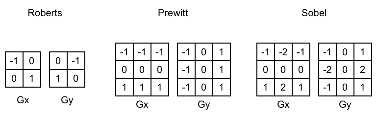
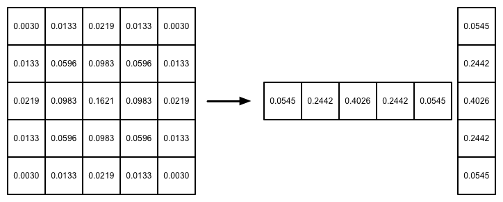

屏幕后处理效果是游戏中实现屏幕特效的常见方法。在本章中我们将学习如何在Unity中利用渲染纹理来实现各种常见的屏幕后处理效果。我们首先要建立一个基本的屏幕后处理脚本系统，随后我们会使用这个系统实现一个简单的调整画面亮度、饱和度和对比度的屏幕特效。然后我们会接触到图像滤波的概念，并利用Sobel算子在屏幕空间中对图像进行边缘检测，实现描边效果。在此基础上，我们会实现一个高斯模糊的屏幕特效、Bloom和运动模糊的效果。


# 建立一个基本的屏幕后处理脚本系统

> 在Unity5之后，书里面提到的这个后处理脚本系统的基类中使用的那些接口都已经废弃了，所以这个后处理脚本启动其实也没有什么存在的必要了。
> 另外，本书使用OnRenderImage的方法实现后处理效果的方式也逐渐被CommandBuffer给取代了，所以笔者会尝试用CommandBuffer的方式重新实现这章的所有后处理效果。

```
using UnityEngine;

[ExecuteInEditMode]
[RequireComponent (typeof(Camera))]
public class PostEffectsBase : MonoBehaviour {

    // Called when start
    protected void CheckResources() {
        bool isSupported = CheckSupport();
		
        if (isSupported == false) {
            NotSupported();
        }
    }

    // Called in CheckResources to check support on this platform
    protected bool CheckSupport() {
        return true;
    }

    // Called when the platform doesn't support this effect
    protected void NotSupported() {
        enabled = false;
    }
	
    protected void Start() {
        CheckResources();
    }

    // Called when need to create the material used by this effect
    protected Material CheckShaderAndCreateMaterial(Shader shader, Material material) {
        if (shader == null) {
            return null;
        }
		
        if (shader.isSupported && material && material.shader == shader)
            return material;
		
        if (!shader.isSupported) {
            return null;
        }
        else {
            material = new Material(shader);
            material.hideFlags = HideFlags.DontSave;
            if (material)
                return material;
            else 
                return null;
        }
    }
}
```


# 调整屏幕的亮度、饱和度和对比度

```
using System;
using UnityEngine;

public class BrightnessSaturationAndContrast : PostEffectsBase
{
    public Shader briSatConShader;
    public Material briSatConMat;
    
    private Material _material
    {
        get
        {
            briSatConMat = CheckShaderAndCreateMaterial(briSatConShader, briSatConMat);
            return briSatConMat;
        }
    }
    
    [Range(0.0f, 3.0f)] public float brightness = 1.0f;
    [Range(0.0f, 3.0f)] public float saturation = 1.0f;
    [Range(0.0f, 3.0f)] public float contrast = 1.0f;


    private void OnRenderImage(RenderTexture source, RenderTexture destination)
    {
        if (_material != null)
        {
            _material.SetFloat("_Brightness", brightness);
            _material.SetFloat("_Saturation", saturation);
            _material.SetFloat("_Contrast", contrast);
            
            Graphics.Blit(source, destination, _material);
        }
        else
        {
            Graphics.Blit(source, destination);
        }
    }
}
```

```
Shader "UnityShaderBook/Chapter 12/BrightnessSaturationAndContrast"
{
    Properties
    {
        _MainTex ("MainTex", 2D) = "white" {}
        _Brightness ("Brightness", Float) = 1
        _Saturation ("Saturation", Float) = 1
        _Contrast ("Contrast", Float) = 1
    }
    
    SubShader
    {
        Tags
        {
            
        }
        
        Pass
        {
            ZTest Always
            Cull Off
            ZWrite Off

            CGPROGRAM

            #pragma vertex vert;
            #pragma fragment frag;

            #include "UnityCG.cginc"
            
            sampler2D _MainTex;
            half _Brightness;
            half _Saturation;
            half _Contrast;

            struct v2f
            {
                float4 pos : SV_POSITION;
                half2 uv : TEXCOORD0;
            };

            v2f vert(appdata_img v)
            {
                v2f o;
                o.pos = mul(unity_MatrixMVP, v.vertex);
                o.uv = v.texcoord;
                return o;
            }

            fixed4 frag(v2f i) : SV_Target{
                fixed4 renderTex = tex2D(_MainTex, i.uv);

                fixed3 finalColor = renderTex.rgb * _Brightness;

                fixed luminance = 0.2125 * renderTex.r + 0.7154 * renderTex.g + 0.0721 * renderTex.b;
                fixed3 luminanceColor = fixed3(luminance, luminance, luminance);
                finalColor = lerp(luminanceColor, finalColor, _Saturation);

                fixed3 avgColor = fixed3(0.5, 0.5, 0.5);
                finalColor = lerp(avgColor, finalColor, _Contrast);

                return fixed4(finalColor, renderTex.a);
            }
            
            ENDCG
        }   
    }
}
```

首先，我们得到对原屏幕图像（存储在_MainTex）中的采样结果renderTex。然后，利用_Brightness属性来计算来调整亮度。亮度的调整非常简单，我们只需要把原颜色乘以亮度系数_Brightness即可。然后，我们计算该像素值对应的亮度值（luminance），这是通过对每个颜色分量乘以一个特定的系数

# 边缘检测

边缘检测的原理是利用一些边缘检测算子对图像进行`卷积(convolution)`操作，我们首先来了解一下什么是卷积。

## 什么是卷积

在图像处理中，卷积操作指的就是使用一个`卷积核(kernel)`对一张图片中的每个像素进行一系列的操作。卷积核通常是一个四方形的网格结构(比如 $2 \times 2$、$3 \times 3$的方形区域)，该区域内每个方格都有一个权重值。当对图像中某个像素进行卷积时，我们会把卷积核的中心放置于该像素上，翻转核之后再以此计算核中每个元素和其覆盖的图像像素值的乘积并求和，得到的结果就是该位置的新像素值。

这样的计算过程虽然简单，但是可以实现很多常见的图像处理效果，例如图像模糊、边缘检测等。例如，如果我们想要对图像进行均值模糊，可以使用一个$3 \times 3$的卷积核，核内每个元素的值均为1/9。

## 常见的边缘检测算子

卷积操作的神奇之处在于选择的卷积。那么，用于边缘检测的卷积核应该长什么样呢？在回答这个问题前，我们可以先回想一下边到底是如何形成的。如果相邻像素之间存在差别明显的颜色、亮度、纹理等属性，我们就会认为它们之间应该有一条边界。这种相邻像素之间的差值可以用梯度(gradient)来表示，可以想象到，边缘处的梯度绝对值会比较大。



3种常见的边缘算子如图所示，它们都包含了两个方向的卷积核，分别用于检测水平方向和竖直方向上的边缘信息。在进行边缘检测时，我们需要对每个像素分别进行一次卷积计算，得到两个方向上的梯度值$G_{x}$和$G_{y}$ ，而整体的梯度公式可以按照下面的公式计算而得：
$$G=\sqrt{G^2_{x} + G^2_{y}}$$

由于上面的计算包含了开根号的操作，出于性能考虑。我们有时会使用绝对值操作来代替开根号操作:
$$G = |G_{x}| + |G_{y}|$$

当我们得到梯度G后，我们就可以据此来判断哪些像素对应了边缘（梯度值越大越有可能是边缘点）。

## 实现

本节会使用Sobel算子进行边缘检测，实现描边效果。


```
using System;
using UnityEngine;

public class EdgeDetection : PostEffectsBase
{
    public Shader edgeDetectShader;
    private Material edgeDetectMaterial = null;

    public Material material
    {
        get
        {
            edgeDetectMaterial = CheckShaderAndCreateMaterial(edgeDetectShader, edgeDetectMaterial);
            return edgeDetectMaterial;
        }
    }

    [Range(0.0f, 1.0f)] public float edgesOnly = 0.0f;
    
    public Color edgeColor = Color.black;
    
    public Color backgroundColor = Color.white;
    private static readonly int EdgeColor = Shader.PropertyToID("_EdgeColor");
    private static readonly int EdgeOnly = Shader.PropertyToID("_EdgeOnly");
    private static readonly int BackgroundColor = Shader.PropertyToID("_BackgroundColor");

    private void OnRenderImage(RenderTexture source, RenderTexture destination)
    {
        if (material != null)
        {
            material.SetFloat(EdgeOnly, edgesOnly);
            material.SetColor(EdgeColor, edgeColor);
            material.SetColor(BackgroundColor, backgroundColor);
            Graphics.Blit(source, destination, material);
        }
        else
        {
            Graphics.Blit(source, destination);
        }
    }
}
```


```
Shader "Unity Shader Book/Chapter 12/Edge Detection"
{
    Properties
    {
        _MainTex ("Base (RGB)", 2D) = "white"{}
        _EdgeOnly ("Edge Only", Float) = 1.0
        _EdgeColor ("Edge Color", Color) = (0,0,0,1)
        _BackgroundColor ("Background Color", Color) = (1,1,1,1)
    }
    
    SubShader
    {
        Pass
        {
            ZTest Always
            Cull Off
            ZWrite Off
            
            CGPROGRAM

            #pragma vertex vert;
            #pragma fragment frag;

            #include "UnityCG.cginc"
            
            sampler2D _MainTex;
            half4 _MainTex_TexelSize;
            fixed _EdgeOnly;
            fixed4 _EdgeColor;
            fixed4 _BackgroundColor;

            struct v2f
            {
                float4 pos : SV_POSITION;
                half2 uv[9] : TEXCOORD0;
            };

            v2f vert(appdata_img v)
            {
                v2f o;
                o.pos = mul(unity_MatrixMVP, v.vertex);

                half2 uv = v.texcoord;
                o.uv[0] = uv + _MainTex_TexelSize.xy * half2(-1, -1);
                o.uv[1] = uv + _MainTex_TexelSize.xy * half2(0, -1);
                o.uv[2] = uv + _MainTex_TexelSize.xy * half2(1, -1);
                o.uv[3] = uv + _MainTex_TexelSize.xy * half2(-1, 0);
                o.uv[4] = uv + _MainTex_TexelSize.xy * half2(0, 0);
                o.uv[5] = uv + _MainTex_TexelSize.xy * half2(1, 0);
                o.uv[6] = uv + _MainTex_TexelSize.xy * half2(-1, 1);
                o.uv[7] = uv + _MainTex_TexelSize.xy * half2(0, 1);
                o.uv[8] = uv + _MainTex_TexelSize.xy * half2(1, 1);
                return o;
            }

            fixed luminance(fixed4 color)
            {
                return 0.2125 * color.r + 0.7154 * color.g + 0.0721 * color.b;
            }

            half Sobel(v2f i)
            {
                const half Gx[9] = {
                    -1, -2, -1,
                    0, 0, 0,
                    1, 2, 1
                };

                const half Gy[9] = {
                    -1, 0, 1,
                    -2, 0, 2,
                    -1, 0, 1
                };

                half texColor;
                half edgeX = 0;
                half edgeY = 0;
                for(int it = 0; it < 9; it++)
                {
                    texColor = luminance(tex2D(_MainTex, i.uv[it]));
                    edgeX += texColor * Gx[it];
                    edgeY += texColor * Gy[it];
                }

                half edge = 1 - abs(edgeX) - abs(edgeY);

                return edge;
            }
            
            fixed4 frag(v2f i) : SV_Target{

                half edge = Sobel(i);

                fixed4 withEdgeColor = lerp(_EdgeColor, tex2D(_MainTex, i.uv[4]), edge);
                fixed4 onlyEdgeColor = lerp(_EdgeColor, _BackgroundColor, edge);
                return lerp(withEdgeColor, onlyEdgeColor, _EdgeOnly);
            }
            ENDCG
        }
    }

    Fallback Off
}
```

在上面的代码中，我们还声明了一个新的变量_MainTex_TexelSize。xxx_TexelSize是unity为我们提供的访问xxx纹理对应的每个纹素的大小。例如一张512x512大小的纹理，该值大约是0.001953。由于卷积需要对相邻区域内的纹理进行采样，因此我们需要利用_MainTex_TexelSize来计算各个相邻区域的纹理坐标。

我们在v2f结构体中定义了一个维数为9的纹理数组，对应了使用Sobel算子采样时需要的9哥邻域纹理坐标。通过把计算采样纹理坐标的代码从片元着色器中转移到顶点着色器中，可以减少运算，提高性能。由于从顶点着色器到片元着色器的插值是线性的，因此这样的转移并不会影响纹理坐标的计算结果

我们首先调用Sobel函数计算当前像素的梯度值edge，并利用该值分别计算了背景为原图和纯色的颜色值，然后利用_EdgeOnly在两者之间插值得到最终的像素值。Sobel函数利用Sobel算子对原图进行边缘检测。

我们首先定义了水平方向和竖直方向使用的卷积核$G_{x}$和$G_{y}$。接着，我们依次对9个像素进行采样，计算它们的亮度值，再与卷积核G_{x}$和$G_{y}$中对应的权重相乘后，叠加到各自的梯度值上。最后我们从1中减去水平方向和树枝方向的梯度值的绝对值，得到edge。edge越小，表明该位置越可能是一个边缘点。至此，边缘检测的过程结束。

需要注意的是，本节实现的边缘检测仅仅利用了屏幕颜色信息，而在实际应用中，物体的纹理、阴影等信息均会影响边缘检测的结果，使得结果包含许多非预期的描边，为了得到更加准确的边缘信息，我们往往会在屏幕的深度纹理和法线纹理上进行边缘检测。我们将会在13.4节中实现这种方法。

# 高斯模糊

## 高斯滤波

高斯模糊同样利用了卷积计算，它使用的卷积核名为高斯核。高斯核是一个正方形大小的滤波核，其中每个元素的计算都是基于下面的高斯方程：

$$G(x,y) = \frac{1}{2\pi\sigma^2}e^{\frac{x^2 + y^2}{2\sigma^2}}$$

其中$\sigma$是标准方差，一般取值为1，x和y分别对应了当前位置到卷积核中心的整数距离。要构建一个高斯核，我们只需要计算高斯核中各个位置对应的高斯值。为了保证滤波后的图像不会变暗，我们需要对高斯核中的权重进行归一化，即让每个权重除以所有权重的和，这样可以保证所有权重的和为1.因此，高斯函数e前面的系数实际不会对结果产生任何影响。下图显示了一个标准方差为1的5$\times$5大小的高斯核。



高斯方程很好地模拟了邻域每个像素对当前处理像素的影响程度——距离越近，影响越大。高斯核的维数越高，模糊程度就越大。使用一个NxN的高斯核对图像进行卷积滤波，就需要N$\times$N$\times$W$\times$H(W和H分别是图像的宽和高)次纹理采样。当N的大小不断增加时，采样的次数就会变得非常巨大。幸运的是，我们可以把这个二维的高斯函数拆分成两个一维函数。也就是说，我们可以使用两个一维的高斯核先后对图像进行滤波，它们得到的结果和直接使用二维高斯核是一样的，但采样次数只需要2$\times$N$\times$W$\times$H。我们可以进一步观察到，两个一维高斯核中包含了很多重复的权重，对于一个大小为5的一维高斯核，我们实际上只需要记录3个权重值就可以了。

> 为啥两个一维的高斯核先后对图像进行滤波，它们得到的结果和直接使用二维高斯核是一样？
> 

在本节中，我们会使用上述的5$\times$5的高斯核对原图像进行高斯模糊。我们将先后调用两个Pass，第一个Pass将会使用竖直方向的一维高斯核对图像进行滤波，第二个Pass使用水平方向的一维高斯核对图像进行滤波，得到最终的目标图像。在实现中我们还会利用图像缩放来进一步提高性能，并通过调整高斯滤波的应用次数来控制模糊程度（次数越多，图像越模糊）。

```
using UnityEngine;
using System.Collections;

public class GaussianBlur : PostEffectsBase {

	public Shader gaussianBlurShader;
	private Material gaussianBlurMaterial = null;

	public Material material {  
		get {
			gaussianBlurMaterial = CheckShaderAndCreateMaterial(gaussianBlurShader, gaussianBlurMaterial);
			return gaussianBlurMaterial;
		}  
	}

	// Blur iterations - larger number means more blur.
	[Range(0, 4)]
	public int iterations = 3;
	
	// Blur spread for each iteration - larger value means more blur
	[Range(0.2f, 3.0f)]
	public float blurSpread = 0.6f;
	
	[Range(1, 8)]
	public int downSample = 2;
	
	void OnRenderImage (RenderTexture src, RenderTexture dest) {
		if (material != null) {
			int rtW = src.width/downSample;
			int rtH = src.height/downSample;

			RenderTexture buffer0 = RenderTexture.GetTemporary(rtW, rtH, 0);
			buffer0.filterMode = FilterMode.Bilinear;

			Graphics.Blit(src, buffer0);

			for (int i = 0; i < iterations; i++) {
				material.SetFloat("_BlurSize", 1.0f + i * blurSpread);

				RenderTexture buffer1 = RenderTexture.GetTemporary(rtW, rtH, 0);

				// Render the vertical pass
				Graphics.Blit(buffer0, buffer1, material, 0);

				RenderTexture.ReleaseTemporary(buffer0);
				buffer0 = buffer1;
				buffer1 = RenderTexture.GetTemporary(rtW, rtH, 0);

				// Render the horizontal pass
				Graphics.Blit(buffer0, buffer1, material, 1);

				RenderTexture.ReleaseTemporary(buffer0);
				buffer0 = buffer1;
			}

			Graphics.Blit(buffer0, dest);
			RenderTexture.ReleaseTemporary(buffer0);
		} else {
			Graphics.Blit(src, dest);
		}
	}
}
```
上面的代码显示了如何利用两个临时缓存在迭代之间进行交替的过程。在迭代开始前，我们首先定义了第一个缓存buffer0，并把src中的图像缩放后存储到buffer0中。在迭代过程中，我们又定义了第二个缓存buffer1。在执行第一个Pass时，输入是buffer0，输出是buffer1，完毕后首先把buffer0释放，再把结果值buffer1存储到buffer0中，重新分配buffer1，然后再调用第二个Pass重复上面的过程。迭代完成后，buffer0将存储最终的图像，我们再利用Graphic.Blit(buffer0, dest)把结果显示到屏幕上，并释放缓存。

下面是Shader实现部分

```
Shader "Unity Shader Book/Chapter 12/GaussianBlur"
{
	Properties {
		_MainTex ("Base (RGB)", 2D) = "white" {}
		_BlurSize ("Blur Size", Float) = 1.0
	}
    SubShader
    {
        CGINCLUDE

        #include "UnityCG.cginc"
        
        sampler2D _MainTex;
        half4 _MainTex_TexelSize;
        float _BlurSize;

        struct v2f
        {
            float4 pos : SV_POSITION;
            half2 uv[5] : TEXCOORD0;
        };

        v2f vertexBlurVertical(appdata_img v)
        {
			v2f o;
			o.pos = UnityObjectToClipPos(v.vertex);
			
			half2 uv = v.texcoord;
			
			o.uv[0] = uv;
			o.uv[1] = uv + float2(0.0, _MainTex_TexelSize.y * 1.0) * _BlurSize;
			o.uv[2] = uv - float2(0.0, _MainTex_TexelSize.y * 1.0) * _BlurSize;
			o.uv[3] = uv + float2(0.0, _MainTex_TexelSize.y * 2.0) * _BlurSize;
			o.uv[4] = uv - float2(0.0, _MainTex_TexelSize.y * 2.0) * _BlurSize;
					 
			return o;
        }

        v2f vertexBlurHorizontal(appdata_img v)
        {
           	v2f o;
			o.pos = UnityObjectToClipPos(v.vertex);
			
			half2 uv = v.texcoord;
			
			o.uv[0] = uv;
			o.uv[1] = uv + float2(_MainTex_TexelSize.x * 1.0, 0.0) * _BlurSize;
			o.uv[2] = uv - float2(_MainTex_TexelSize.x * 1.0, 0.0) * _BlurSize;
			o.uv[3] = uv + float2(_MainTex_TexelSize.x * 2.0, 0.0) * _BlurSize;
			o.uv[4] = uv - float2(_MainTex_TexelSize.x * 2.0, 0.0) * _BlurSize;

            return o;
        }

        fixed4 fragBlur(v2f i) : SV_Target{
            float weight[3] = {0.4026, 0.2442, 0.0545};

            fixed3 sum = tex2D(_MainTex, i.uv[0]).rgb * weight[0];

            for(int it = 1; it < 3; it++)
            {
                sum += tex2D(_MainTex, i.uv[it*2 - 1]).rgb * weight[it];
                sum += tex2D(_MainTex, i.uv[it*2]).rgb * weight[it];
            }

            return fixed4(sum, 1.0);
        }

        ENDCG
        
        ZTest Always
        Cull Off
        ZWrite Off
        
        Pass
        {
            Name "GAUSSIAN_BLUR_VERTICAL"
            
            CGPROGRAM

            #pragma vertex vertexBlurVertical
            #pragma fragment fragBlur
            
            ENDCG
        }

        Pass
        {
            Name "GAUSSIAN_BLUR_HORIZONTAL"
            
            CGPROGRAM

            #pragma vertex vertexBlurHorizontal
            #pragma fragment fragBlur
            
            ENDCG
        }        

    }
    
    Fallback "Diffuse"
}
```

在本节中，我们将第一次使用CGINCLUDE来组织代码。我们在SubShader块中利用CGINCLUDE和ENDCG语义定义了一系列的代码。
这些代码不需要包含在任何Pass语义块中，在使用时，我们只需要在Pass中直接指定需要使用的顶点着色器和片元着色器函数名即可。CGINCLUDE类似于C++中头文件的功能。由于高斯模糊需要定义两个Pass，但它们使用的片元着色器代码是完全相同的，使用CGINCLUDE可以避免我们编写两个完全一样的frag函数。

由于要得到相邻像素的纹理坐标，我们这里再一次使用了Unity提供的_MainTex_TexelSize变量以计算相邻像素的纹理坐标偏移量。

在本节中我们会利用5$\times$5大小的高斯核对原图像进行高斯模糊，而由12.4.1节可知，一个5$\times$5的二维高斯核可以拆分成两个大小为5的一维高斯核，因此我们只需要计算5个纹理坐标即可。为此我们在v2f结构体中定义了一个5维的纹理坐标数组。鼠族的第一个坐标存储了当前的采样纹理，剩余的四个坐标则是高斯模糊中对邻域采样时使用的纹理坐标。我们还和属性_BlurSize相乘来控制采样距离。在高斯核维数不变的情况下，_BlurSize越大，模糊程度越高，但是采样数却不会受到影响。但是过大的_BlurSize会造成虚影，这可能并不是我们希望的。通过把计算采样纹理坐标的代码从片元着色器移动到顶点着色器中，可以减少运算，提高信念。由于从顶点着色器到片元着色器的插值是线性的，因此这样的转移并不会影响纹理坐标的计算结果。

水平方向的顶点着色器和上面的代码类似，只是在计算4个纹理坐标时使用了水平方向的纹素大小进行纹理偏移。

注意，我们仍然首先设置了渲染状态。和之前不同的是，我们为两个Pass使用NAME语义定义了它们的名字。这是因为，高斯模糊是非常常见的图像处理操作，很多屏幕特效都是建立在它的基础上的，例如Bloom效果。为Pass定义名字，可以在其他Shader中直接通过它们的名字来使用该Pas，而不需要再重复编写代码。

同样的，由于高斯核的对称性，我们只需要记录3个高斯权重，也就是代码中的weight变量。我们首先声明了各个邻域像素对应的权重weight，然后将结果值sum初始化为当前的像素值乘以它的权重值。根据对称性，我们进行了两次迭代，每次迭代包含了两次纹理采样，并把像素值和权重相乘后的结果叠加到sum中。最后，函数返回滤波结果sum。

# Bloom效果

Bloom效果是游戏中常见的一种效果。这种特效可以模拟真实摄像机的一种图像效果，它让画面中较亮的区域“扩散”到周围区域中，造成一种朦胧的效果。

Bloom效果的实现原理非常简单：我们首先根据一个阈值提取出图像中较亮的区域，把它们存储到一张渲染纹理中，再利用高斯模糊对这样渲染纹理进行模糊处理，模拟光线扩散的效果，最后再将其和原图像混合，得到最终的效果。

尽管在大多数情况下，图像的亮度值不会超过1.但是如果我们开启了HDR，硬件就会允许我们把颜色值存储在一个更高精度范围的缓冲中，此时像素的亮度值可能会超过1。因此，在这里我们把luminanceThreashold的值规定在[0,4]范围内。


```
using System;
using UnityEngine;

public class Bloom : PostEffectsBase
{
    public Shader bloomShader;
    private Material bloomMaterial = null;

    public Material material
    {
        get
        {
            bloomMaterial = CheckShaderAndCreateMaterial(bloomShader, bloomMaterial);
            return bloomMaterial;
        }
    }

    [Range(0, 4)] public int iterations = 3;
    [Range(0.2f, 3.0f)] public float blurSpread = 0.6f;
    [Range(1, 8)] public int downSample = 2;
    [Range(0.0f, 4.0f)] public float luminanceThreshold = 0.6f;
    private static readonly int LuminanceThreshold = Shader.PropertyToID("_LuminanceThreshold");
    private static readonly int Bloom1 = Shader.PropertyToID("_Bloom");
    private static readonly int BlurSize = Shader.PropertyToID("_BlurSize");

    private void OnRenderImage(RenderTexture source, RenderTexture destination)
    {
        if (material != null)
        {
            material.SetFloat(LuminanceThreshold, luminanceThreshold);

            int rtW = source.width / downSample;
            int rtH = source.height / downSample;

            RenderTexture buffer0 = RenderTexture.GetTemporary(rtW, rtH, 0);
            buffer0.filterMode = FilterMode.Bilinear;

            Graphics.Blit(source, buffer0, material, 0);

            for (int i = 0; i < iterations; i++)
            {
                material.SetFloat(BlurSize, 1.0f + i * blurSpread);

                RenderTexture buffer1 = RenderTexture.GetTemporary(rtW, rtH, 0);
                
                Graphics.Blit(buffer0, buffer1, material, 1);
                
                RenderTexture.ReleaseTemporary(buffer0);

                buffer0 = buffer1;
                buffer1 = RenderTexture.GetTemporary(rtW, rtH, 0);
                
                Graphics.Blit(buffer0, buffer1, material, 2);
                
                RenderTexture.ReleaseTemporary(buffer0);
                buffer0 = buffer1;
            }
            
            material.SetTexture(Bloom1, buffer0);
            Graphics.Blit(source,destination, material, 3);
            
            RenderTexture.ReleaseTemporary(buffer0);
        }
        else
        {
            Graphics.Blit(source, destination);
        }
    }
}
```


```
Shader "Unity Shader Book/Chapter 12/Bloom"
{
    
    Properties
    {
        _MainTex ("Base (RGB)", 2D) = "white" {}
        _Bloom ("Bloom (RGB)", 2D) = "black" {}
        _LuminanceThreshold ("Luminance Threshold", Float) = 0.5
        _BlurSize ("Blur Size", Float) = 1.0
    }
    
    SubShader
    {
        CGINCLUDE

        #include "UnityCG.cginc"
        sampler2D _MainTex;
        half4 _MainTex_TexelSize;
        sampler2D _Bloom;
        float _LuminanceThreshold;
        float _BlurSize;

        struct v2f
        {
            float4 pos : SV_POSITION;
            half2 uv : TEXCOORD0;
        };

        v2f vertExtractBright(appdata_img v)
        {
            v2f o;

            o.pos = mul(unity_MatrixMVP, v.vertex);

            o.uv = v.texcoord;

            return o;
        }

        fixed luminance(fixed4 color)
        {
            return 0.2125 * color.r + 0.7154 * color.g + 0.0721 * color.b;
        }

        fixed4 fragExtractBright(v2f i) : SV_Target{
            fixed4 c = tex2D(_MainTex, i.uv);
            fixed val = clamp(luminance(c) - _LuminanceThreshold, 0.0, 1.0);
            return c * val;
        }

        struct v2fBloom
        {
            float4 pos : SV_POSITION;
            half4 uv : TEXCOORD0;
        };

        v2fBloom vertBloom(appdata_img v)
        {
            v2fBloom o;
            o.pos = mul(unity_MatrixMVP, v.vertex);

            o.uv.xy = v.texcoord;
            o.uv.zw = v.texcoord;

            #if UNITY_UV_STARTS_AT_TOP
            if(_MainTex_TexelSize.y < 0.0)
            {
                o.uv.w = 1.0 - o.uv.w;
            }
            #endif

            return o;
        }

        fixed4 fragBloom(v2fBloom i) : SV_Target{
            return tex2D(_MainTex, i.uv.xy) + tex2D(_Bloom, i.uv.zw);
        }
        
        ENDCG
        
        Pass
        {
            CGPROGRAM

            #pragma vertex vertExtractBright
            #pragma fragment fragExtractBright
            
            ENDCG
        }   
        
        UsePass "Unity Shader Book/Chapter 12/GaussianBlur/GAUSSIAN_BLUR_VERTICAL"
        UsePass "Unity Shader Book/Chapter 12/GaussianBlur/GAUSSIAN_BLUR_HORIZONTAL"
        
        Pass
        {
            CGPROGRAM

            #pragma vertex vertBloom
            #pragma fragment fragBloom
            
            ENDCG
        }
    } 
    Fallback Off
}
```


# 运动模糊

运动模糊是真实世界中的摄像机的一种效果。如果在摄像机曝光时，拍摄场景发生了变化，就会产生模糊的画面。运动模糊在我们的日常生活中是非常常见的，只要留心观察，就可以发现无论是体育报道还是各个电影中，都有运动模糊的身影。运动模糊的效果可以让物体运动起来更加真实平滑，但在计算机产生图像的过程中，由于不存在曝光这一物理现象，渲染出来的图像往往都是棱角分明，缺少运动模糊。在一些注入赛车类型的游戏中，为画面添加运动模糊是一种常见的处理方法。在这一节中，我们将学习如何在屏幕后处理中实现运动模糊的效果。

运动模糊的实现有很多种方法。一种实现方法是利用一块**累计缓存(accumulation buffer)**来混合多张连续的图像。当物体快速移动产生多张图像后，我们取它们之间的平均值作为最后的运动模糊图像。然而这种暴力的方法对性能的消耗很大，因为想要获得多张帧图像往往意味着我们要在同一帧内渲染多次场景。另一种应用广泛的方法是创建和使用**速度缓存(velocity buffer)**，这个缓存种存储了各个像素当前的运动速度，然后利用该值来决定模糊的方向和大小。

在本节中，我们将使用类似上述第一种方法的实现来模拟运动模糊的效果。我们不需要在一帧中把场景渲染多次，但需要保存之前的渲染结果，不断把当前的渲染图像叠加到之前的渲染图像中，从而产生一种运动轨迹的视觉效果。这种方法与原始的利用累计缓存的方法相比性能更好，但模糊效果可能会略有影响。

```
using UnityEngine;

public class MotionBlur : PostEffectsBase
{
    public Shader motionBlurShader;
    private Material motionBlurMaterial = null;

    public Material material
    {
        get
        {
            motionBlurMaterial = CheckShaderAndCreateMaterial(motionBlurShader, motionBlurMaterial);
            return motionBlurMaterial;
        }
    }

    [Range(0.0f, 0.9f)] public float blurAmount = 0.5f;

    private RenderTexture accumulationTexture;
    private static readonly int BlurAmount = Shader.PropertyToID("_BlurAmount");

    private void OnDisable()
    {
        DestroyImmediate(accumulationTexture);
    }
    
    private void OnRenderImage(RenderTexture source, RenderTexture destination)
    {
        if (material != null)
        {
            if (accumulationTexture == null || accumulationTexture.width != source.width ||
                accumulationTexture.height != source.height)
            {
                DestroyImmediate(accumulationTexture);
                accumulationTexture = new RenderTexture(source.width, source.height, 0);

                accumulationTexture.hideFlags = HideFlags.HideAndDontSave;
                Graphics.Blit(source, accumulationTexture);
            }
            
            material.SetFloat(BlurAmount, 1.0f - blurAmount);
            Graphics.Blit(source, accumulationTexture, material);
            Graphics.Blit(accumulationTexture, destination);
        }
        else
        {
            Graphics.Blit(source, destination);
        }
    }
}

```


```
Shader "Unity Shader Book/Chapter 12/Motion Blur"
{
    
    Properties
    {
        _MainTex ("Base(RGB)", 2D) = "white"{}
        _BlurAmount ("Blur Amount", Float) = 1.0
    }
    
    SubShader
    {
        CGINCLUDE

        #include "UnityCG.cginc"
        fixed _BlurAmount;
        sampler2D _MainTex;

        struct v2f
        {
            float4 pos : SV_POSITION;
            half2 uv : TEXCOORD0;
        };

        v2f vert(appdata_img v)
        {
            v2f o;

            o.pos = mul(unity_MatrixMVP, v.vertex);

            o.uv = v.texcoord;

            return o;
        }

        fixed4 fragRGB(v2f i) : SV_Target{
            return fixed4(tex2D(_MainTex, i.uv).rgb, _BlurAmount);
        }

        fixed4 fragA(v2f i) : SV_Target{
            return tex2D(_MainTex, i.uv);
        }
        
        ENDCG
        
        ZTest Always Cull Off ZWrite Off
        Pass
        {
            Blend  SrcAlpha OneMinusSrcAlpha
            ColorMask RGB
            
            CGPROGRAM

            #pragma vertex vert
            #pragma fragment fragRGB
            
            ENDCG
        }

        Pass
        {
            Blend One Zero
            ColorMask A
            
            CGPROGRAM

            #pragma vertex vert
            #pragma fragment fragA
                
            ENDCG
        }
    }

    Fallback Off
}
```