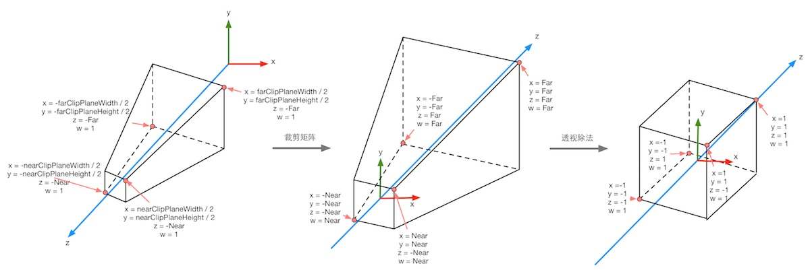
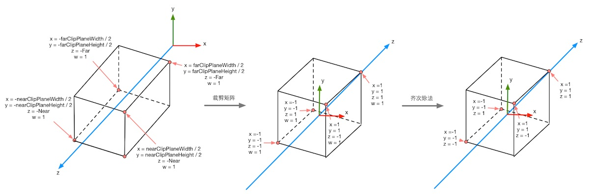
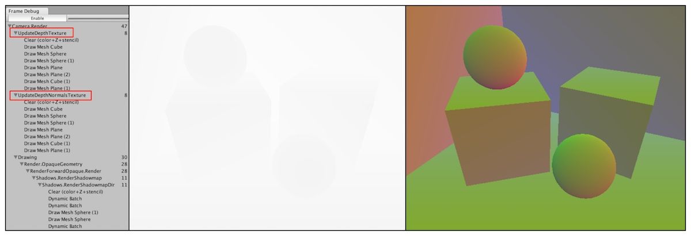
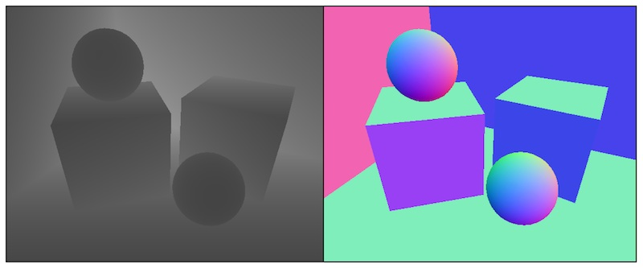
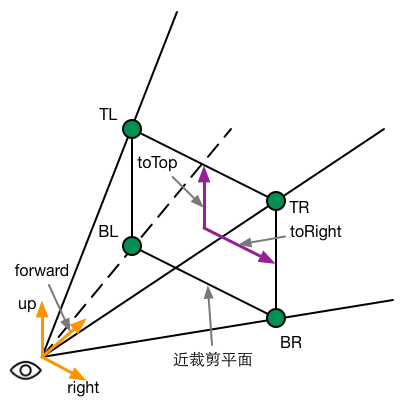
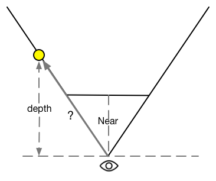
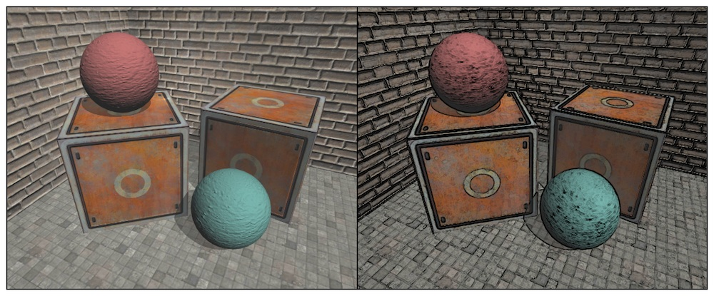
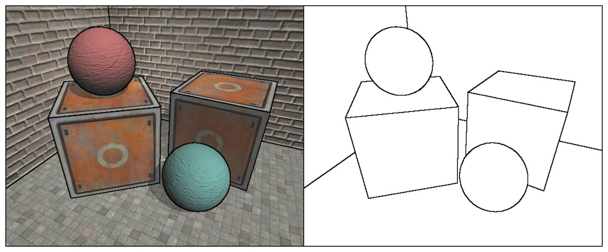
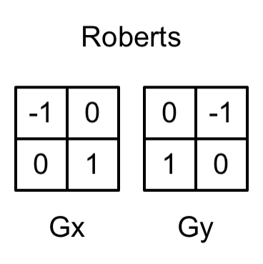

在第12章中，我们学习的屏幕后处理效果都只是在屏幕颜色图像上进行各种操作来实现的。然而，很多时候我们不仅需要当前屏幕的颜色信息，还希望得到深度和法线信息。例如，在进行边缘检测的时候，枝节利用颜色信息会使检测到的边缘信息收物体纹理和光照等外部因素的影响，得到很多我们不需要的边缘点。一种更好的方法是，我们可以在深度纹理和法线纹理上进行边缘检测，这些图像不会受纹理和光照的影响，而仅仅保存了当前渲染物体的模型信息，通过这样的方式检测出来的边缘更加可靠。

在本章中，我们将学习如何在Unity中获取深度纹理和法线纹理来实现特定的屏幕后处理效果。在13.1节中，我们首先会学习如何在Unity中获取这两种纹理。在13.2节中，我们会利用深度纹理来计算摄像机的移动速度，实现摄像机的运动模糊效果。在13.3节中，我们会学习如何利用深度纹理来重建屏幕像素在世界空间中的位置，从而模拟屏幕雾效。13.4节会再次学习边缘检测的另一种实现，即利用深度和法线纹理进行边缘检测。

# 获取深度和法线纹理

虽然在Unity中获取深度和法线纹理的代码十分简单，但是我们有必要在这之前首先了解它们背后的实现原理。

## 背后的原理

深度纹理实际就是一张渲染纹理，只不过它里面存储的像素值不是颜色值，而是一个高精度的深度值。由于被存储在一张纹理中，深度纹理里的深度值范围是[0,1]，而且通常是非线性分布的。那么，这些深度值是从哪里得到的呢？要回答这个问题，我们需要回顾在第4章学习过的顶点变换的过程。总体来说，这些深度值来自于顶点变换后得到的归一化的设备坐标(Normalized Device Coordinates, NDC)。回顾一下，一个模型想要最终被绘制在屏幕上，需要把它的顶点从模型空间变换到齐次裁剪坐标系下，这是通过在顶点着色器中乘以MVP变换矩阵得到的。在变换的最后一步，我们需要使用一个投影矩阵来变换顶点，当我们使用的是透视投影类型的摄像机时，这个投影矩阵就是非线性的，具体过程可以回顾4.6.7小节。

下图显示了在4.6.7小节中给出的Unity中透视投影对顶点的变换过程。图中左侧的图显示了投影变换前，即观察空间下视锥体的结构以及相应顶点的位置，中间图显示了应用透视裁剪矩阵后的变换结果，即顶点着色器阶段输出的顶点变换的结果，最右侧的图则是底层硬件进行了透视除法后得到的归一化的设备坐标。需要注意的是，这里的投影过程是建立在Unity对坐标系的假定上的，也就是说，我们针对的是观察空间为右手坐标系，使用列矩阵在矩阵右侧进行相乘，且变换到NDC后z分量范围将在[-1,1]之间的情况。而在类似DirectX这样的图形接口中，变换后z分量范围将在[0,1]之间。如果需要在其他图形接口下实现本章的类似效果，需要对一些计算参数作出相应的变化。



下图显示了在使用正交摄像机时投影变换的过程。同样，变换后会得到一个范围为[-1,1]的正方体。正交投影使用的变换矩阵是线性的。



在得到NDC之后，深度纹理中的像素值就可以很方便的计算到了，这些深度值就对应了NDC中顶点坐标的z分量的值。由于NDC中z分量的范围在[-1,1]，为了让这些值能够存储在一张图像中，我们需要使用下面的公式对其进行映射：
$$d = 0.5z_{ndc} + 0.5$$

其中，d对应了深度纹理中的像素值，$z_{ndc}$对应了NDC坐标中的z分量的值。

那么Unity是怎么得到这样一张深度纹理的呢？在Unity中，深度纹理可以直接来自于真正的深度缓存，也可以使用一个单独的Pass渲染而得。具体实现是，Unity会使用着色器替换(Shader Replacement)技术选择那些渲染类型(即SubShader的RenderType标签)为Opaque的物体，判断他们的渲染队列是否小于等于2500(内置的Background、Geometry和AlphaTest渲染队列均在此范围内)，如果满足条件，就把它渲染到深度和法线纹理中。因此，要想让物体能够出现在深度和法线纹理中，就必须在Shader中设置正确的RenderType标签。

在Unity中，我们可以选择让一个摄像机生成一张深度纹理或是一张深度+法线纹理。当选择前者，即只需要一张单独的深度纹理时，Unity会直接获取深度缓存或是按之前讲到的着色器替换技术，选取需要的不透明物体，并使用它投射阴影时使用的Pass(即LightMode被设置为ShadowCaster的Pass)来得到深度纹理。如果Shader中不包括这样一个Pass，那么这个物体就不会出现在深度纹理中（当然也不能像其他物体投射阴影。深度纹理的精度通常是24位或者16位，这取决于使用的深度缓存的精度，如果选择生成一张深度+法线纹理。Unity会创建一张和屏幕分辨率相同、精度为32位（每个通道为8位）的纹理，其中观察空间下的法线信息会被编码进纹理的R和G通道，而深度信息会被编码进B和A通道。法线信息的获取在延迟渲染中是可以非常容易就得到的，Unity只需要合并深度和法线缓存即可。而在前向渲染中，默认情况下是不会创建法线缓存的，因此Unity底层使用了一个单独的Pass把整个场景再渲染一遍来完成。这个Pass被包含在Unity内置的一个Unity Shader中，我们可以在内置的builtin_shaders-xxx/DefaultResources/Camera-DepthNormalTexture.shader文件中找到这个用于渲染深度和法线信息的Pass。

## 如何获取


在Unity中，获取深度纹理是非常简单的，我们只需要告诉Unity：“嘿！把深度纹理给我！”然后在Shader中直接访问特定的纹理属性即可。这个与Unity沟通的过程是通过在脚本中设置摄像机的depthTextureMode来完成的，例如我们可以通过下面的代码来获取深度纹理：

```
camera.depthTextureMode = DepthTextureMode.Depth;
```
一旦设置好了上面的摄像机模式后，我们就可以在Sahder中通过声明_CameraDepthTexture变量来访问它。这个过程非常简单，但我们需要知道这两行代码的背后，Unity为我们做了很多工作。

同理，如果想要获得深度+法线纹理，我们只需要在代码中这样设置：

```
camera.depthTextureMode = DepthTextureMode.DepthNormals;
```

然后在Shader中通过声明_CameraDepthNormalsTexture变量来访问它。
我们还可以组合这些模式，让一个摄像机同时产生一张深度和深度+法线纹理:

```
camera.depthTextureMode |= DepthTextureMode.Depth;
camera.depthTextureMode |= DepthTextureMode.DepthNormals;
```

在Unity中我们还可以在摄像机的Camera组件上看到当前摄像机是否需要渲染深度或深度+法线纹理。当在Shader中访问深度纹理_CameraDepthTexture后，我们就可以使用当前像素的纹理坐标对它进行采样。绝大多数情况下，我们直接使用tex2D函数采样即可，但是在某一些平台上，我们需要一些特殊处理。Unity为我们提供了一个统一的宏SAMPLE_DEPTH_TEXTURE，用来处理这些由于平台差异造成的问题。而我们只需要在Shader中使用SAMPLE_DEPTH_TEXTURE宏对深度纹理进行采样。如：
```
float d = SAMPLE_DEPTH_TEXTURE(_CameraDdepthTexture, i.uv);
```

其中，i.uv是一个float2类型的变量，对应了当前像素的纹理坐标。类似的宏还有SAMPLE_DEPTH_TEXTURE_PROJ和SAMPLE_DEPTH_TEXTURE_LOD。SAMPLE_DEPTH_TEXTURE_PROJ宏同样接受两个参数——深度纹理和一个float3或float4类型的纹理坐标，它的内部使用了tex2Dproj这样的函数进行投影纹理采样，纹理坐标的前两个分量首先会除以最后一个分量，再进行纹理采样。如果提供了第四个分量，还会进行一次比较，通常用于阴影的实现中。SAMPLE_DEPTH_TEXTURE_PROJ的第二个参数通常是由顶点着色器输出的插值而得的屏幕坐标。例如:
```
float d = SAMPLE_DEPTH_TEXTURE_PROJ(_CameraDepthTexture, UNITY_PROJ_COORD(i.scrPos))
```

其中, i.scrPos是再顶点着色器中通过调用ComputeScreenPos(o.pos)得到的屏幕坐标。上述这些宏的定义，我们可以在Unity内置的HLSLSupport.cginc文件中找到。

当通过纹理采样得到深度值后，这些深度值往往是非线性的，这种非线性来自于透视投影使用的裁剪矩阵。然而，在我们计算过程中通常是需要线性的深度值，也就是说，我们需要把投影后的深度值变换到线性空间下，例如视角空间下的深度值。那么，我们应该如何进行这个转换呢？实际上，我们只需要倒推顶点变换的过程即可。下面我们以透视投影为例，推导如何由深度纹理中的深度信息计算得到视角空间下的深度值。

由4.6.7节可知，当我们使用透视投影的裁剪矩阵$P_{clip}$对视角空间下的一个顶点进行变换后，裁剪空间下顶点的z和w分量为：

$$z_{clip} = -z_{view}\frac{Far + Near}{Far - Near} - \frac{2\cdot Near \cdot Far}{Far - Near}$$
$$w_{clip} = -z_{view}$$

其中，Far和Near分别是远近裁切平面的距离。然后，我们通过齐次除法就可以得到NDC下的z分量：

$$z_{ndc} = \frac{z_{clip}}{w_{clip}} = \frac{Far + Near}{Far - Near} + \frac{2Near \cdot Far}{(Far - Near) \cdot z_{view}}$$

在13.1.1节中我们知道，深度纹理中的深度值是通过下面的公式由NDC计算而得的：
$$d = 0.5 \cdot z_{ndc} + 0.5$$

由上面的这些式子，我们可以推导出d表示而得的$z_{view}$的表达式：

$$z_{view} = \frac{1}{\frac{Far - Near}{Near \cdot Far}d - \frac{1}{Near}}$$

由于在Unity使用的视角空间中，摄像机正向对应的z值均为负值，因此为了得到深度值的正数表示，我们需要对上面的结果取反，最后得到的结果如下：

$$z_{view} = \frac{1}{\frac{Near - Far}{Near \cdot Far}d + \frac{1}{Near}}$$

它的取值范围就是视锥体的深度范围，即[Near, Far]。如果我们想要得到范围在[0,1]之前的深度值，只需要把上面得到的结果除以Far即可。这样，0就表示该点与摄像机处于同一位置，1表示该点位于视锥体的远裁剪平面上。结果如下：
$$z_{01} = \frac{1}{\frac{Near - Far}{Near }d + \frac{Far}{Near}}$$

幸运的是，Unity提供了两个辅助函数来为我们进行上述的计算过程——LinearEyeDepth和Linear01Depth。LinearEyeDepth负责把深度纹理的采样结果转换到视角空间下的深度值，也就是我们上面得到的。而Linear01Depth则会返回一个范围在[0,1]的线性深度值，也就是我们上面得到的$z_{01}$。这两个函数内部使用了内置的_ZBufferParams变量来得到远近裁剪平面的距离。

如果我们需要获取深度+法线纹理，可以直接使用tex2D函数对_CameraDepthNormalsTexture进行采样，得到里面存储的深度和法线信息。Unity提供了辅助函数来为我们对这个采样结果进行解码，从而得到深度值和法线方向。这个函数是DecodeDepthNormal，它在UnityCG.cginc里被定义:

```
inline void DecodeDepthNormal(float4 enc, out float depth, out float3 normal){
    depth = DecodeFloatRG(enc.zw);
    normal = DecodeViewNormalStereo(enc);
}

```
DecodeDepthNormal的第一个参数是对深度+法线纹理的采样结果，这个采样结果是Unity对深度和法线信息编码后的结果，它的xy分量存储的是视角空间下的法线信息，而深度信息被编码进了zw分量。通过调用DecodeDepthNormal函数对采样结果编码后，我们就可以得到解码后的深度值和法线。这个深度值范围在[0,1]的线性深度值（这与单独的深度纹理中存储的深度值不同），而得到的法线则是视角空间下的法线方向。同样，我们也可以通过调用DecodeFloatRG和DecodeViewNormalStereo来解码深度+发现纹理中的深度和法线信息。

至此，我们已经学会了如何在Unity里获得及使用深度和法线纹理。下面，我们会学习如何使用它们实现各种屏幕特效。

## 查看深度和法线纹理

很多时候，我们希望可以查看生成的深度和法线纹理，以便对Shader进行调试。Unity中可以使用Frame Debugger来查看摄像机生成的深度和法线纹理。如下图：



使用帧调试器查看到的深度纹理是非线性空间的深度值，而深度和法线纹理都是由Unity编码后的结果。有时，显示出线性空间下的深度信息或解码后的法线方向会更加有用。此时，我们可以自行在片元着色器中输出转换或解码后的深度和法线值，如下图所示。输出代码非常简单，我们可以使用类似下面的代码来输出线性深度值：

```
float depth = SAMPLE_DEPTH_TEXTURE(_CameraDepthTexture, i.uv);
float linearDepth = Linear01Depth(depth);
return fixed4(linearDepth, linearDepth, linearDepth, 1.0);
```
或是输出法线方向：

```
fixed3 normal = DecodeViewNormalStereo(tex2D(_CameraDepthNormalsTexture, i.uv).xy);
return fixed4(normal * 0.5 + 0.5, 1.0);
```


**在查看深度纹理时，我们得到的画面有可能几乎是全黑或者全白的。这时我们可以把摄像机的远裁剪平面的距离调小，使视锥体的范围刚好覆盖从近裁剪平面到远裁剪平面的所有深度区域，当远裁剪平面的距离过大时，会导致距离摄像机较近的距离映射到非常小的深度值，如果场景是一个封闭的区域，那么这就会导致画面看起来几乎是全黑的。相反，如果场景是一个开放区域，并且物体离摄像机的距离较远，就会导致画面几乎是全白的。**

# 再谈运动模糊

在12.6节中，我们学习了如何通过混合多张屏幕图像来模拟运动模糊的效果。但是，另外一种应用更加广泛的技术则是使用速度映射图。速度映射图中存储了每个像素的速度，然后使用这个速度来决定模糊的大小和方向。速度缓冲的生成有多种方法，一种方法是把场景中所有物体的速度渲染到一张纹理中。但这种方法的缺点是需要修改场景中所有物体的Shader代码，使其添加计算速度的代码并输出到一个渲染纹理中。

GPU精粹在第27章中介绍了一种生成速度映射图的方法。这种方法利用深度纹理在片元着色器中为每个像素计算其在世界空间下的位置，这是通过使用当前的视角乘投影矩阵的逆矩阵对NDC下的顶点坐标进行变换得到的。当得到世界空间中的顶点坐标后，我们使用前一帧的视角乘投影矩阵对其进行变换，得到该位置在前一帧中的NDC坐标。然后，我们计算前一帧和当前帧的位置差，生成该像素的速度。这种方法的优点是可以在一个屏幕后处理步骤中完成整个效果的模拟，但是缺点需要在片元着色器中进行两次矩阵乘法的操作，对性能有所影响。


本节实现的运动模糊适用于场景静止、摄像机快速运动的情况，这是因为我们在计算时只考虑了摄像机的运动。因此，如果我们把本节的代码应用到一个物体快速运动而摄像机静止的场景，会发现不会产生任何运动模糊效果。如果我们想要对快速移动的物体产生运动模糊的效果，就需要生成更加精确的速度映射图。我们可以在Unity自带的Image Effect包中找到更多运动模糊的实现方法。

本节选择在片元着色器中使用逆矩阵来重建每个像素在世界空间下的位置。但是这种做法往往会影响性能，在13.3节中，我们会介绍一种更快速由深度纹理重建世界坐标的方法。

Shader代码如下
```
// Upgrade NOTE: replaced 'mul(UNITY_MATRIX_MVP,*)' with 'UnityObjectToClipPos(*)'

Shader "Custom/MotionBlur"
{
    Properties
    {
        _MainTex ("Base (RGB)", 2D) = "white" {}
        _BlurSize ("Blur Size", Float) = 1.0
    }
    
    SubShader
    {
        CGINCLUDE

        #include "UnityCG.cginc"
            
        sampler2D _MainTex;
        half4 _MainTex_TexelSize;
        sampler2D _CameraDepthTexture;
        float4x4 _CurrentViewProjectionInverseMatrix;
        float4x4 _PreviousViewProjectionMatrix;
        half _BlurSize;

        struct v2f
        {
            float4 pos : SV_POSITION;
            half2 uv : TEXCOORD0;
            half2 uv_depth : TEXCOORD1;
        };

        v2f vert(appdata_img v)
        {
            v2f o;
            o.pos = UnityObjectToClipPos(v.vertex);
            o.uv = v.texcoord;
            o.uv_depth = v.texcoord;

            #if UNITY_UV_STARTS_AT_TOP
            if(_MainTex_TexelSize.y < 0)
                o.uv_depth = 1 - o.uv_depth.y;
            #endif

            return o;
        }

        fixed4 frag(v2f i) : SV_Target{

            float d = SAMPLE_DEPTH_TEXTURE(_CameraDepthTexture, i.uv_depth);

            float4 H = float4(i.uv.x * 2 - 1, i.uv.y * 2 - 1, d * 2 - 1, 1);

            float4 D = mul(_CurrentViewProjectionInverseMatrix, H);

            float4 worldPos = D / D.w;

            float4 currentPos = H;

            float4 previousPos = mul(_PreviousViewProjectionMatrix, worldPos);

            previousPos /= previousPos.w;

            float2 velocity = (currentPos.xy - previousPos.xy) / 2.0f;

            
            float2 uv = i.uv;
			float4 c = tex2D(_MainTex, uv);
			uv += velocity * _BlurSize;
			for (int it = 1; it < 3; it++, uv += velocity * _BlurSize) {
				float4 currentColor = tex2D(_MainTex, uv);
				c += currentColor;
			}
			c /= 3;
			
			return fixed4(c.rgb, 1.0);
        }
        
        ENDCG

        Pass
        {
            ZTest Always Cull Off ZWrite Off
            
            CGPROGRAM

            #pragma vertex vert
            #pragma fragment frag
            
            ENDCG
        }
    }

    Fallback Off
}

```

在片元着色器中，我们首先需要利用深度纹理和当前帧的视角乘投影矩阵的逆矩阵来求得该像素在世界空间下的坐标，过程开始于对深度纹理的采样，我们使用内置的SAMPLE_DEPTH_TEXTURE宏和纹理坐标对深度纹理进行采样，得到了深度值d。由13.1.2节可知，d是由NDC下的坐标映射而来的，我们想要构建像素的NDC坐标H，就需要把这个深度值重新映射回NDC，这个映射很简单，只需要使用原映射的反函数即可，即d*2 - 1。同样，NDC的xy分量可以由像素的纹理坐标映射而来(NDC下的xyz分量范围均为[-1,1])。当得到NDC下的坐标H后，我们就可以使用当前帧的视角乘**投影矩阵的逆矩阵**对其进行变换，并把结果值除以它的w分量来得到世界空间下的坐标表示`worldPos`。

> 笔者在写这段博客的时候还没有好好看代码，被投影矩阵的逆矩阵这个概念搞糊涂了，在第四章中讲到了从世界空间到观察空间要经过视图变化、投影变换，怎么到这只有一个逆投影变换了，但是你看代码的话发现其实这个矩阵是视图变换和投影变化矩阵的乘积

一旦得到了世界空间下的坐标，我们就可以使用前一帧的视角*投影矩阵对它进行变换，得到前一帧在NDC下的坐标previousPos。然后，我们计算前一帧和当前帧在屏幕空间下的位置差，得到该像素的velocity。


C#代码如下:
```
using UnityEngine;

namespace Shader.Chapter13
{
    public class MotionBlurWithDepthTexture : MonoBehaviour
    {
        private static readonly int BlurSize = UnityEngine.Shader.PropertyToID("_BlurSize");
        private static readonly int PreviousViewProjectionMatrix = UnityEngine.Shader.PropertyToID("_PreviousViewProjectionMatrix");
        private static readonly int CurrentViewProjectionInverseMatrix = UnityEngine.Shader.PropertyToID("_CurrentViewProjectionInverseMatrix");
        public UnityEngine.Shader motionBlurShader;
        
        private Material motionBlurMaterial;
        private Camera _camera;

        private void OnEnable()
        {
            if (motionBlurMaterial == null)
            {
                motionBlurMaterial = new Material(motionBlurShader);
            }

            if (_camera == null)
            {
                _camera = GetComponent<Camera>();
            }

            _camera.depthTextureMode |= DepthTextureMode.Depth;
        }

        [Range(0.0f, 1.0f)] public float blurSize = 0.5f;
        
        
        private Matrix4x4 previousViewProjectionMatrix;
        
        
        private void OnRenderImage(RenderTexture source, RenderTexture destination)
        {
            if (motionBlurMaterial != null)
            {
                motionBlurMaterial.SetFloat(BlurSize, blurSize);
                motionBlurMaterial.SetMatrix(PreviousViewProjectionMatrix, previousViewProjectionMatrix);
                
                Matrix4x4 currentViewProjectionMatrix = _camera.projectionMatrix * _camera.worldToCameraMatrix;
                Matrix4x4 currentCurrentViewProjectionInverseMatrix = currentViewProjectionMatrix.inverse;
                motionBlurMaterial.SetMatrix(CurrentViewProjectionInverseMatrix, currentCurrentViewProjectionInverseMatrix);
                previousViewProjectionMatrix = currentViewProjectionMatrix;
                
                Graphics.Blit(source, destination, motionBlurMaterial);
            }
            else
            {
                Graphics.Blit(source, destination);
            }
        }
    }
}

```

# 全局雾效

雾效(Fog)是游戏里经常使用的一种效果。Unity内置的雾效可以产生基于距离的线性或指数雾效。然而，想要在自己编写的顶点/片元着色器中实现这些雾效，我们需要在Shader中添加`#pragma multi_compile_fog`指令，同时还需要使用相关的内置宏，例如UNITY_FOG_COORDS、UNITY_TRANSFER_FOG和UNITY_APPLY_FOG等。这种方法的缺点在于，我们不仅要为场景中所有物体添加相关的渲染代码，而且能够实现的效果非常有限。当我们需要对雾效进行一些个性化操作时，例如使用基于高度的雾效等，仅仅使用Unity内置的雾效就变得不再可行。

在本节中，我们将会学习一种基于屏幕后处理的全局雾效的实现。使用这种方法，我们不需要更改场景内渲染的物体所使用的Shader代码，而仅仅依靠一次屏幕后处理步骤即可。这种方法的自由度很高，我们可以方便地模拟各种雾效，例如均匀的雾效、基于距离的线性/指数雾效、基于高度的雾效等。在学习完本节后，我们可以得到类似下图的效果。

基于屏幕后处理的全局雾效的关键是，根据深度纹理来重建每个像素在世界空间下的位置。尽管在13.2节中，我们在模拟运动模糊时已经实现了这个需求，即构建出当前像素的NDC坐标，再通过当前摄像机的视角乘投影矩阵的逆矩阵来得到世界空间下的像素坐标。但是这样的实现需要在片元着色器中进行矩阵乘法的操作，而这通常会影响游戏的性能。在本节中，我们将会学习一个快速从深度纹理中构建世界坐标的方法。这种方法首先对图像空间下的视锥体射线（从摄像机出发，指向图像上的某点的射线）进行插值，这条射线存储了该像素在世界空间下到摄像机的方向信息。然后，我们把该射线和线性化后的视角空间下的深度值想成，再加上摄像机的世界位置，就可以得到该像素在世界空间下的位置。当我们得到世界坐标后，就可以轻松地使用各个公式来模拟全局雾效了。

## 重建世界坐标

在动手开始写代码之前，我们首先来了解如何从深度纹理中重建世界坐标。我们知道，坐标中的一个顶点坐标可以通过它相对于另一个顶点坐标的偏移量来求得。重建像素的世界坐标也是基于这样的思想。我们只需要知道摄像机在世界空间下的位置，以及世界空间下该像素相对于摄像机的偏移量，把它们相加就可以得到该像素的世界坐标。整个过程可以使用下面的代码来表示:
```
float worldPos = _WorldSpaceCameraPos + linearDepth * interpolateRay;
```

其中，`_WorldSpaceCameraPos`是摄像机在世界空间下的位置，这可以由Unity的内置变量直接访问得到。而`linearDepth * interpolatedRay`则可以计算得到该像素相对于摄像机的偏移量，`linearDepth`是由深度纹理得到的线性深度值，`interpolatedRay`是由顶点着色器输出并插值后得到的射线，它不仅包含了该像素到摄像机的方向，也包含了距离信息。`linearDepth`的获取我们已经在前面的小节中详细解释过了，因此，本节着重解释`interpolatedRay`的求法。

`interpolatedRay`来源于对近裁切平面的4个角的某个特定向量的插值，这4个向量包括了它们到摄像机的方向和距离信息，我们可以利用摄像机的近裁切平面距离、FOV、纵横比计算而得。下图显示了计算时使用的一些辅助向量。为了方便计算，我们可以先计算两个向量——toTop和toRight，显示了计算时使用的一些辅助向量。分别指向摄像机正上方和正右方的向量。它们的计算公式如下：

$$half = Near \times tan(\frac{FOV}{2})$$
$$toTop = camera.up \times halfHeight$$
$$toRight = camera.right \times halfHeight \cdot aspect$$

其中，Near是近裁切平面的距离，FOV是竖直方向的视角范围，camera.up、camera.right分别对应了摄像机的正上方和正右方。
当得到这两个辅助向量后，我们就可以计算4个角相对于摄像机的方向了。我们以左上角为例(见下图的TL点)，它的计算公式如下：

$$TL = camera.forward \cdot Near + toTop - toRight$$

读者可以依靠基本的矢量运算验证上面的结果。同理，其他三个角的计算也是类似的:

$$TR = camera.forward \cdot Near + toTop + toRight$$
$$BL = camera.forward \cdot Near - toTop - toRight$$
$$BR = camera.forward \cdot Near - toTop + toRight$$



注意，上面求得的4个向量不仅包含了方向信息，它们的模对应了4个点到摄像机的空间距离。由于我们得到的线性深度值并非是点到摄像机的欧式距离，而是在z方向上的距离，因此我们不能直接使用深度值和4个角的单位方向的乘积来计算它们到摄像机的偏移量，如下图所示，想要把深度值转换成到摄像机的欧式距离也很简单，我们以TL点为例，根据相似三角形原理，TL所在的射线上，像素的深度值和它到摄像机的实际距离的比等于近裁剪平面的距离和TL向量的模的比，即:

$$\frac{depth}{dist} = \frac{Near}{|TL|}$$

由此可得，我们需要的TL距离摄像机的欧式距离dist:

$$ dist = \frac{|TL|}{Near} \times depth$$

由于4个点相互对称，因此其他三个向量的模和TL相等，即我们可以使用同一个因子和单位向量相乘，得到它们对应的向量值

$$scale = \frac{|TL|}{|Near|}$$

$$Ray_{TL} = \frac{TL}{|TL|} \times scale, Ray_{TR} = \frac{TR}{|TR|} \times scale$$
$$Ray_{BL} = \frac{BL}{|BL|} \times scale, Ray_{BR} = \frac{BR}{|BR|} \times scale$$



屏幕后处理的原理是使用特定的材质去渲染一个刚好填充整个屏幕的四边形面片。这个四边形面片的4个顶点就对应了近裁剪平面的4个角。因此我们可以把上面的计算结果传递给顶点着色器，顶点着色器根据当前的位置选择它所对应的向量，然后再将其输出，经过插值后传递给片元着色器得到interpolatedRay，我们就可以直接利用本节一开始提到的公式重建该像素在世界空间下的位置了。

## 雾的计算

在简单的雾效实现中，我们需要计算一个雾效系数f，作为混合原始颜色和雾的颜色的混合系数：

```
float afterFog = f * fogColor + (1 - f) * origColor;
```

这个雾效系数$f$有很多计算方法。在Unity内置的雾效实现中，支持三种雾效的计算方式——线性(Linear)、指数(Exponential)以及指数的平方(Exponential Squared)。当给定距离z后，$f$的计算公式分别如下:

Linear:

$$f = \frac{d_{max} - |z|}{d_{max} - d_{min}}$$

其中$d_{min}$和$d_{max}$分别表示受雾影响的最小距离和最大距离。

Exponential:

$$f = e^{-d \cdot |z|}$$

其中d是控制雾的浓度的参数

Exponential Squard：

$$f = e ^ {-(d - |z|)^2}$$

d是控制雾的浓度的参数

在本节中，我们将使用类似线性雾的计算方式，计算基于高度的雾效。具体方法是，当给定一点在世界空间下的高度y后，$f$的计算公式为：

$$f = \frac{H_{end} - y}{H_{end} - H_{start}}$$

其中$H_{start}$和$H_{end}$分别表示受雾影响的起始高度和终止高度。

## 实现

```
Shader "Custom/FogWithDepthTexture"
{
    Properties
    {
        _MainTex ("Base (RGB)", 2D) = "white" {}
        _FogDensity ("Rog Density", Float) = 1.0
        _FogColor ("Fog Color", Color) = (1, 1, 1, 1)
        _FogStart ("Fog Start", Float) = 0.0
        _FogEnd ("Fog End", Float) = 1.0
    }
    
    SubShader
    {
        CGINCLUDE

        #include "UnityCG.cginc"

        float4x4 _FrustumCornersRay;
        
        sampler2D _MainTex;
        half4 _MainTex_TexelSize;
        sampler2D _CameraDepthTexture;
        half _FogDensity;
        fixed4 _FogColor;
        float _FogStart;
        float _FogEnd;

        struct v2f
        {
            float4 pos : SV_POSITION;
            half2 uv : TEXCOORD0;
            half2 uv_depth : TEXCOORD1;
            float4 interpolatedRay : TEXCOORD2;
        };

        v2f vert(appdata_img v)
        {
            v2f o;
            o.pos = UnityObjectToClipPos(v.vertex);
            o.uv = v.texcoord;
            o.uv_depth = v.texcoord;

            #if UNITY_UV_STARTS_AT_TOP
            if(_MainTex_TexelSize.y < 0)
                o.uv_depth = 1 - o.uv_depth.y;
            #endif

            int index = 0;
            if(v.texcoord.x < 0.5 && v.texcoord.y < 0.5)
            {
                index = 0;
            }else if(v.texcoord.x > 0.5 && v.texcoord.y < 0.5)
            {
                index = 1;
            }else if(v.texcoord.x > 0.5 && v.texcoord.y > 0.5)
            {
                index = 2;
            }else
            {
                index = 3;
            }

            #if UNITY_UV_STARTS_AT_TOP
            if(_MainTex_TexelSize.y < 0)
                index = 3 - index;
            #endif

            o.interpolatedRay = _FrustumCornersRay[index];            
            
            return o;
        }

        fixed4 frag(v2f i) : SV_Target{

            float linearDepth = LinearEyeDepth(SAMPLE_DEPTH_TEXTURE(_CameraDepthTexture, i.uv_depth));

            float3 worldPos = _WorldSpaceCameraPos + linearDepth * i.interpolatedRay.xyz;

            float fogDensity = (_FogEnd - worldPos.y) / (_FogEnd - _FogStart);
            fogDensity = saturate(fogDensity * _FogDensity);

            fixed4 finalColor = tex2D(_MainTex, i.uv);
            finalColor.rgb = lerp(finalColor.rgb, _FogColor.rgb, fogDensity);
            
			return finalColor;
        }
        
        ENDCG

        Pass
        {
            ZTest Always Cull Off ZWrite Off
            
            CGPROGRAM

            #pragma vertex vert
            #pragma fragment frag
            
            ENDCG
        }
    }

    Fallback Off
}
```

```
using UnityEngine;

namespace Shader.Chapter13
{
    public class FogWithDepthTexture : MonoBehaviour
    {
        private static readonly int FrustumCornersRay = UnityEngine.Shader.PropertyToID("_FrustumCornersRay");
        private static readonly int ViewProjectionInverseMatrix = UnityEngine.Shader.PropertyToID("_ViewProjectionInverseMatrix");
        private static readonly int FogDensity = UnityEngine.Shader.PropertyToID("_FogDensity");
        private static readonly int FogColor = UnityEngine.Shader.PropertyToID("_FogColor");
        private static readonly int FogStart = UnityEngine.Shader.PropertyToID("_FogStart");
        private static readonly int FogEnd = UnityEngine.Shader.PropertyToID("_FogEnd");
        public UnityEngine.Shader fogShader;
        private Material material;

        private Camera _camera;
        private Transform cameraTransform;
        
        private void OnEnable()
        {
            _camera = GetComponent<Camera>();
            cameraTransform = GetComponent<Transform>();

            if (material == null)
            {
                material = new Material(fogShader);
            }
            
            _camera.depthTextureMode |= DepthTextureMode.Depth;
        }
        
        [Range(0.0f, 3.0f)]
        public float fogDensity = 1.0f;
        
        public Color fogColor = Color.white;
        
        public float fogStart = 0.0f;
        public float fogEnd = 2.0f;


        private void OnRenderImage(RenderTexture source, RenderTexture destination)
        {
            if (material != null)
            {
                Matrix4x4 frustumCorners = Matrix4x4.identity;

                float fov = _camera.fieldOfView;
                float near = _camera.nearClipPlane;
                float aspect = _camera.aspect;

                float halfHeight = near * Mathf.Tan(fov * 0.5f * Mathf.Deg2Rad);
                Vector3 toRight = cameraTransform.right * halfHeight * aspect;
                Vector3 toTop = cameraTransform.up * halfHeight;

                Vector3 topLeft = cameraTransform.forward * near + toTop - toRight;
                float scale = topLeft.magnitude / near;

                topLeft.Normalize();
                topLeft *= scale;

                Vector3 topRight = cameraTransform.forward * near + toRight + toTop;
                topRight.Normalize();
                topRight *= scale;

                Vector3 bottomLeft = cameraTransform.forward * near - toTop - toRight;
                bottomLeft.Normalize();
                bottomLeft *= scale;

                Vector3 bottomRight = cameraTransform.forward * near + toRight - toTop;
                bottomRight.Normalize();
                bottomRight *= scale;

                frustumCorners.SetRow(0, bottomLeft);
                frustumCorners.SetRow(1, bottomRight);
                frustumCorners.SetRow(2, topRight);
                frustumCorners.SetRow(3, topLeft);

                material.SetMatrix("_FrustumCornersRay", frustumCorners);

                material.SetFloat("_FogDensity", fogDensity);
                material.SetColor("_FogColor", fogColor);
                material.SetFloat("_FogStart", fogStart);
                material.SetFloat("_FogEnd", fogEnd);

                Graphics.Blit (source, destination, material);
            }
            else
            {
                Graphics.Blit(source, destination);
            }
        }
    }
}
```

# 再谈边缘检测

在12.3节中，我们曾介绍如何使用Sobel算子对屏幕图像进行边缘检测，实现描边的效果。但是，这种直接利用颜色信息进行边缘检测的方法会产生很多我们不希望得到的边缘线，如下图所示。



可以看出，物体的纹理、阴影等位置也被描上黑边，而这往往不是我们希望看到的。在本节中，我们将学习如何在深度和法线纹理上进行边缘检测，这些图像不会受纹理和光照的影响，而仅仅保存了当前渲染物体的模型信息，通过这样的方式检测出来的边缘更加可靠。在学习完本节后我们可以得到下图的效果。



与12.3节使用的Sobel算子不同，本节将使用Roberts算子来进行边缘检测。它使用的卷积核如下图所示。

Robert算子的本质就是计算左上角和右上角的差值，乘以右上角和左下角的差值，作为评估边缘的依据。在下面的实现中，我们也会按照这样的方式，取对角方向的深度或法线值，比较它们之间的差值，如果超过某一个阈值，就认为它们之间存在一条边。



```
using UnityEngine;

namespace Shader.Chapter13
{
    public class EdgeDetectNormalsAndDepth : MonoBehaviour {
        private static readonly int EdgeOnly = UnityEngine.Shader.PropertyToID("_EdgeOnly");

        public UnityEngine.Shader edgeDetectShader;
        private Material material = null;

        [Range(0.0f, 1.0f)]
        public float edgesOnly = 0.0f;

        public Color edgeColor = Color.black;

        public Color backgroundColor = Color.white;

        public float sampleDistance = 1.0f;

        public float sensitivityDepth = 1.0f;

        public float sensitivityNormals = 1.0f;
	
        void OnEnable() {
            GetComponent<Camera>().depthTextureMode |= DepthTextureMode.DepthNormals;
            material = new Material(edgeDetectShader);
        }

        [ImageEffectOpaque]
        void OnRenderImage (RenderTexture src, RenderTexture dest) {
            if (material != null) {
                material.SetFloat(EdgeOnly, edgesOnly);
                material.SetColor("_EdgeColor", edgeColor);
                material.SetColor("_BackgroundColor", backgroundColor);
                material.SetFloat("_SampleDistance", sampleDistance);
                material.SetVector("_Sensitivity", new Vector4(sensitivityNormals, sensitivityDepth, 0.0f, 0.0f));

                Graphics.Blit(src, dest, material);
            } else {
                Graphics.Blit(src, dest);
            }
        }
    }
}
```
需要注意的是，这里我们为OnRenderImage函数添加了[ImageEffectOpaque]属性，我们曾在12.1节提到过这个属性的含义。在默认情况下，OnRenderImage函数会在所有的不透明和透明的Pass执行完成之后被调用，以便对场景中的所有游戏对象都产生影响。但有时，我们希望在不透明的Pass(即渲染队列小于等于2500的Pass，内置的Background、Geometry和AlphaTest渲染队列均在此范围内)执行完毕后立即调用该函数，而不对透明物体(渲染队列为TransparentPass)产生影响，此时，我们可以在OnRenderImage函数前面添加[ImageEffectOpaque]属性来实现这样的目的。在本例中，我们只希望对不透明物体进行描边，而不希望透明物体也被描边，因此需要添加该属性。

```
// Upgrade NOTE: replaced 'mul(UNITY_MATRIX_MVP,*)' with 'UnityObjectToClipPos(*)'

Shader "Unity Shaders Book/Chapter 13/Edge Detection Normals And Depth" {
	Properties {
		_MainTex ("Base (RGB)", 2D) = "white" {}
		_EdgeOnly ("Edge Only", Float) = 1.0
		_EdgeColor ("Edge Color", Color) = (0, 0, 0, 1)
		_BackgroundColor ("Background Color", Color) = (1, 1, 1, 1)
		_SampleDistance ("Sample Distance", Float) = 1.0
		_Sensitivity ("Sensitivity", Vector) = (1, 1, 1, 1)
	}
	SubShader {
		CGINCLUDE
		
		#include "UnityCG.cginc"
		
		sampler2D _MainTex;
		half4 _MainTex_TexelSize;
		fixed _EdgeOnly;
		fixed4 _EdgeColor;
		fixed4 _BackgroundColor;
		float _SampleDistance;
		half4 _Sensitivity;
		
		sampler2D _CameraDepthNormalsTexture;
		
		struct v2f {
			float4 pos : SV_POSITION;
			half2 uv[5]: TEXCOORD0;
		};
		  
		v2f vert(appdata_img v) {
			v2f o;
			o.pos = UnityObjectToClipPos(v.vertex);
			
			half2 uv = v.texcoord;
			o.uv[0] = uv;
			
			#if UNITY_UV_STARTS_AT_TOP
			if (_MainTex_TexelSize.y < 0)
				uv.y = 1 - uv.y;
			#endif
			
			o.uv[1] = uv + _MainTex_TexelSize.xy * half2(1,1) * _SampleDistance;
			o.uv[2] = uv + _MainTex_TexelSize.xy * half2(-1,-1) * _SampleDistance;
			o.uv[3] = uv + _MainTex_TexelSize.xy * half2(-1,1) * _SampleDistance;
			o.uv[4] = uv + _MainTex_TexelSize.xy * half2(1,-1) * _SampleDistance;
					 
			return o;
		}
		
		half CheckSame(half4 center, half4 sample) {
			half2 centerNormal = center.xy;
			float centerDepth = DecodeFloatRG(center.zw);
			half2 sampleNormal = sample.xy;
			float sampleDepth = DecodeFloatRG(sample.zw);
			
			// difference in normals
			// do not bother decoding normals - there's no need here
			half2 diffNormal = abs(centerNormal - sampleNormal) * _Sensitivity.x;
			int isSameNormal = (diffNormal.x + diffNormal.y) < 0.1;
			// difference in depth
			float diffDepth = abs(centerDepth - sampleDepth) * _Sensitivity.y;
			// scale the required threshold by the distance
			int isSameDepth = diffDepth < 0.1 * centerDepth;
			
			// return:
			// 1 - if normals and depth are similar enough
			// 0 - otherwise
			return isSameNormal * isSameDepth ? 1.0 : 0.0;
		}
		
		fixed4 fragRobertsCrossDepthAndNormal(v2f i) : SV_Target {
			half4 sample1 = tex2D(_CameraDepthNormalsTexture, i.uv[1]);
			half4 sample2 = tex2D(_CameraDepthNormalsTexture, i.uv[2]);
			half4 sample3 = tex2D(_CameraDepthNormalsTexture, i.uv[3]);
			half4 sample4 = tex2D(_CameraDepthNormalsTexture, i.uv[4]);
			
			half edge = 1.0;
			
			edge *= CheckSame(sample1, sample2);
			edge *= CheckSame(sample3, sample4);
			
			fixed4 withEdgeColor = lerp(_EdgeColor, tex2D(_MainTex, i.uv[0]), edge);
			fixed4 onlyEdgeColor = lerp(_EdgeColor, _BackgroundColor, edge);
			
			return lerp(withEdgeColor, onlyEdgeColor, _EdgeOnly);
		}
		
		ENDCG
		
		Pass { 
			ZTest Always Cull Off ZWrite Off
			
			CGPROGRAM      
			
			#pragma vertex vert  
			#pragma fragment fragRobertsCrossDepthAndNormal
			
			ENDCG  
		}
	} 
	FallBack Off
}

```

本节实现的描边效果是基于整个屏幕空间进行的，也就是说，场景内的所有物体都会被添加描边效果。但有时，我们希望只对特定的物体进行描边，例如当玩家选中场景中的某个物体后，我们想要在该物体周围添加一层描边效果。这时，我们可以使用Unity提供的`Graphics.DrawMesh`或者`Graphics.DrawMeshNow`函数把需要描边的物体再渲染一次(在所有不透明物体渲染完毕之后)，然后再使用本节提到的边缘检测算法计算深度和法线纹理中每个像素的梯度值，判断它们是否小于某个阈值，如果是，就在Shader中使用clip()函数将该像素剔除掉，从而显示出原来的颜色。