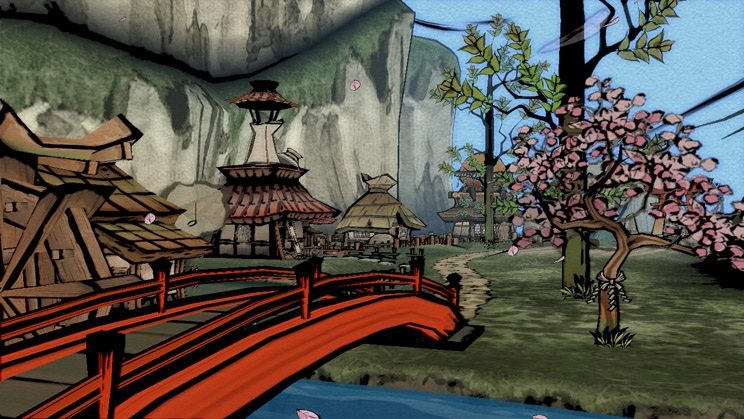
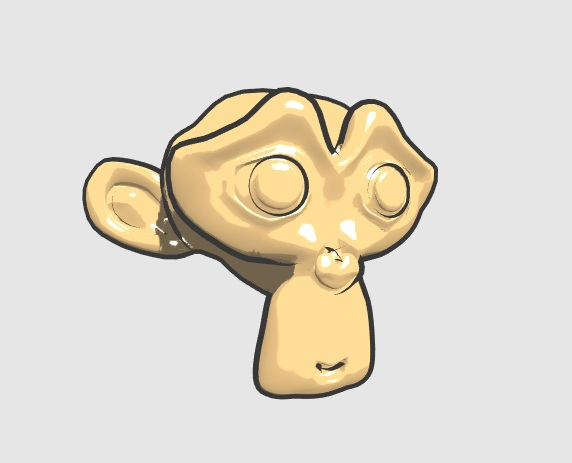
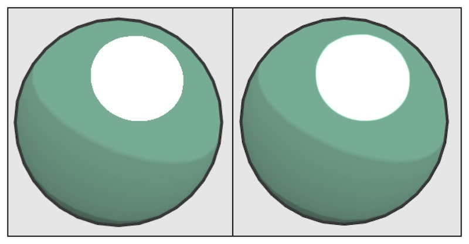
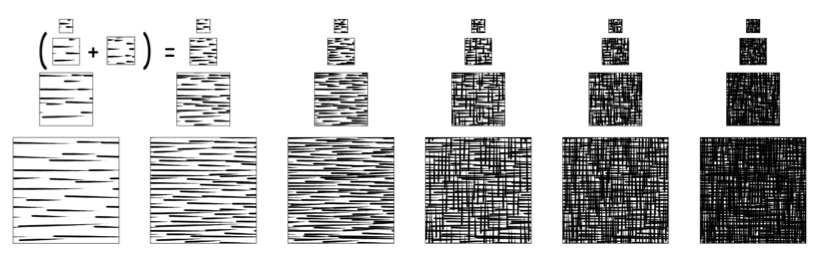
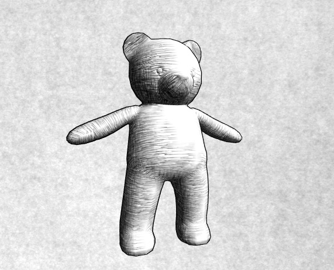

尽管游戏渲染一般是以照相写实主义(photorealism)作为主要目标，但也有很多游戏使用了非真实感渲染(Non-PhotorealisticRendering, NPR)的方法来渲染游戏画面。非真实感渲染的一个主要目标是，使用一些渲染方法使得画面达到和某些特殊的绘画风格相似的效果，例如卡通、水彩风格等。

在本章中，我们将会介绍两种常见的非真实感渲染方法。14.1节中，我们会学习如何实现一个包含简单漫反射、高光和描边的卡通风格的渲染效果。14.2节将会介绍一种实时素描效果的实现。在本章的最后，我们还会给出一些关于非真实感渲染的资料，读者可以在这些文献中找到更多非真实感渲染的实现方法。

# 卡通风格的渲染

卡通风格是游戏中常见的一种渲染风格。使用这种风格的游戏画面通常有一些共同的特点，比如物体都被黑色的线条描边，以及分明的明暗变化等。由日本卡普空株式会社开发的游戏《大神》就使用了水墨+卡通风格来渲染整个画面。



要实现卡通渲染有很多方法，其中之一就是使用基于色调的着色技术(tone-based shading)。Gooch等人在他们1998年的一篇理论文中提出并实现了基于色调的光照模型。在实现中，我们往往会使用漫反射系数对一张一维纹理进行采样，以控制漫反射的色调。我们曾在7.3节使用渐变纹理实现过这样的效果。卡通风格的高光效果也和我们之前学习的光照不同。在卡通风格中，模型的高光往往是一块块分界明显的纯色区域。

除了光照模型不一样，卡通风格通常还需要在物体边缘部分绘制轮廓。在之前的章节中，我们曾介绍使用屏幕后处理技术对屏幕图像进行描边。在本节中，我们将会介绍基于模型的描边方法，这种方法的实现更加简单，而且在很多情况下也能得到不错的效果。在本节结束后我们将实现类似下图的效果。



## 渲染轮廓线

在实时渲染中，轮廓线的渲染是应用非常广泛的一种效果。近20年来，有许多绘制模型轮廓线的方法被先后提出来。在《Real Time Rendering, third edition》一书中，作者把这些方法分成了五种类型。

- 基于观察角度和表面法线的轮廓线渲染。这种方法使用视角方向和表面法线的点乘结果来得到轮廓线的信息。这种方法简单快速，可以在一个Pass中就得到渲染结果，但是局限性很大，很多模型渲染出来的描边效果都不尽如人意。
- 过程式几何轮廓线渲染。这种方法的核心是使用两个Pass渲染，第一个Pass渲染背面的面片，并使用某些技术让它的轮廓可见；第二个Pass再正常渲染正面的面片。这种方法的优点在于快速有效，并且适用于绝大多数表面平滑的模型，但它的缺点是不适合类似于立方体这种平整的模型。
- 基于图像处理的轮廓线渲染。我们在12、13章介绍的边缘检测的方法就属于这个类别。这种方法的优点在于，可以适用于任何种类的模型。但它也有自身的局限所在，一些深度和法线变化很小的轮廓无法被检测出来，例如桌子上的纸张。
- 基于轮廓边缘检测的轮廓线渲染。上面提到的各种方法，一个最大的问题是，无法控制轮廓线的风格渲染。对于一些情况，我们希望可以渲染出独特的轮廓线，例如水墨风格等。为此，我们希望可以检测出精确的轮廓边，然后直接渲染它们。检测一条边是否是轮廓边的公式很简单，我们只需要检查和这条边相邻的两个三角面片是否满足以下条件：
  $$(n_0 \cdot v > 0) \neq (n_1 \cdot v > 0) $$

其中，$n_0$和$n_1$分别表示两个相邻三角面片的法向，v是从视角到该边山任意顶点的方向。上述公式的本质在于检查两个相邻的三角面片是否一个朝正面、一个朝背面。我们可以在几何着色器(Geometry Shader)的帮助下实现上面的检测过程。当然，这种方法也有缺点，除了实现相对复杂外，它还会有动画连贯性的问题。也就是说由于是逐帧单独提取轮廓，所以在帧与帧之间会出现跳跃性。

- 最后一个种类就是混合了上述的几种渲染方法。例如，首先找到精确的轮廓边，把模型和轮廓边渲染到纹理中，再使用图像处理的方法识别出轮廓线，并在图像空间下进行风格化渲染。

在本节中，我们将会在Unity中使用过程式几何轮廓线渲染方法来对模型进行轮廓描边。我们将使用两个Pass渲染模型：在第一个Pass中我们会使用轮廓线颜色渲染整个背面的图片，并在视角空间下把模型顶点沿着法线方向向外扩张一段距离，以此来让背部轮廓线可见。代码如下：

```
viewPos = viewPos + viewNormal * _Outline;
```

但是，如果直接使用顶点法线进行扩展，对于一些内凹的模型，就可能发生背面面片遮挡正面面片的情况。为了尽可能防止出现这样的情况，在扩张背面顶点之前，我们首先对顶点法线的z分量进行处理，使它们等于一个定值，然后把法线归一化后再对顶点进行扩张。这样的好处在于，扩展后的背面更加扁平化，从而降低了遮挡正面面片的可能性。代码如下：

```
viewNormal.z = -0.5;
viewNormal = normalize(viewNormal);
viewPos = viewPos + viewNormal * _Outline;
```
## 添加高光

前面提到过，卡通风格中的高光往往是模型上一块块分界明显的纯色区域。为了实现这种效果，我们就不能再使用之前学习的光照模型。回顾一下，在之前实现Blinn-Phong模型的过程中，我们使用法线点乘光照方向以及视角方向的一半，再和另一个参数进行指数操作得到高光反射系数。代码如下:

```
float spec = pow(saturate(dot(normal, halfDir)), _Gloss)
```

对于卡通渲染需要的高光反射光照模型，我们同样需要计算normal和halfDir的点乘结果，但是不同的是，我们把该值和一个阈值进行比较，如果小于该阈值，那么高光反射系数就是0，否则返回1.


```
float spec = dot(worldNormal, worldHalfDir);
spec = step(threshold, spec);
```

在上面的代码中，我们使用CG的step函数来实现和阈值比较的目的。step函数接受两个参数，第一个参数是参考值，第二个参数是待比较的数值。如果第二个参数大于等于第一个参数，则返回1，否则返回0。

但是这种粗暴的判断方法会在高光区域的边界造成锯齿，如下图的左图所示。出现这种问题的原因在于，高光区域的边缘不是平滑渐变的，而是由0突变到1。想要对其进行抗锯齿处理，我们可以在边界处很小的一块区域内，进行平滑处理。代码如下：

```
float spec = dot(worldNormal, worldHalfDir);
spec = lerp(0, 1, smoothstep(-w, w, spec - threshold));
```

在上面的代码中，我们没有像之前一样直接使用step函数返回0或1，而是首先使用了CG的smoothstep函数。其中w是一个很小的值，当spec - threshold小于-w时，返回0，大于w时，返回1，否则在0到1之间进行差值。这样的效果是，我们可以在[-w, w]区间内，即高光区域的边界处，得到一个从0到1平滑变化的spec值，从而实现抗锯齿的目的。尽管我们可以把w设置为一个很小的定值，但在本例中，我们选择使用邻域像素之间的近似导数值，这可以通过CG的fwidth函数来得到。



当然，卡通渲染中的高光往往有更过个性化的需要。例如，很多卡通高光特效希望可以随意伸缩、方块化光照区域。Anjyo等人在他们2003年的一篇论文中给出了一种风格化的卡通高光的实现。可以在本书作者的[这篇博客](http://blog.csdn.net/candycat1992/article/details/47284289)中找到这种方法在Unity中的实现

## 实现

# 素描风格的渲染

另一个非常流行的非真实感渲染是素描风格的渲染。微软研究院的Praun等人在2001年的SIGGRAPH上发表了一篇著名的论文。在这篇文章中，他们使用了提前生成的素描纹理来实现实时的素描风格渲染，这些纹理组成了一个色调艺术映射(Tonal Art Map, TAM)，如下图所示。在下图中，从左到右纹理中的笔触逐渐增多，用于模拟不同光照下的漫反射效果，从上到下则对应了每张纹理的多级渐远纹理(mipmaps)。这些多级渐远纹理的生成并不是简单的对上一级纹理进行降采样，而是需要保持笔触之间的间隔，一边更真实地模拟素描效果。



本节将会实现简化版的论文中提出的方法，我们不考虑多级渐远纹理的生成，而直接使用6张素描纹理进行渲染。在渲染阶段，我们首先在顶点着色器阶段计算逐顶点的光照，根据光照结果来决定六张纹理的混合权重，并传递给片元着色器。然后，在片元着色器中根据这些权重来混合六张纹理的采样结果。本节过后，会得到如下图所示的效果。

