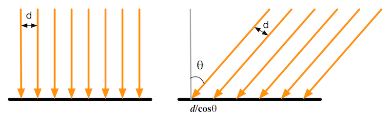

# 我们如何看到这个世界

当我们说一个物体的颜色是红色时，是因为这个物体更多地反射了红光波长，而吸收了其他波长。要在计算机上模拟真实的光照环境来生成一张图像，需要考虑三个过程：

- 首先， 光线从光源中被发射出来

- 然后，光线和场景中的一些物体相交；一些光线被物体吸收了，而另一些光线被散射到其他方向了

- 最后，摄像机吸收了一些光，产生了一张图像

## 光源

在光学中，使用`辐照度(irradiance)`来量化光。我们用`l`来表示光线的从光源射出的方向，对于平行光来说，它的辐照度可以用过计算在垂直于`l`的单位面积上单位时间内穿过的能量来得到。注意这个值表示的是**垂直**于光线方向上的辐照度，而我们在计算光照模型中，需要知道的是物体表面的辐照度，物体的表面往往是不垂直于`l`的，所以为了得到物体表面的辐照度，我们需要用光线方向`l`和物体表面发现`n`之间夹角的余弦值来得到。

## 吸收和散射

光线由光源发射出来之后，就会和一些物体相交。通常相交的结果有两个：散射(scattering)和吸收(absorption)。

**散射只改变光线的方向，但是不改变光线的密度和颜色。而吸收只改变光线的密度和颜色，不改变光的方向。**

我们重点看散射部分，散射的结果也可以分成两种，第一种是散射到物体内部，被称为折射(refraction)或者透射(transmission)；第二种是散射到外部，被称为反射(reflection)。请反复理解这句话：**散射到内部的光会与物体内部的颗粒相交，其中一些光线最后会重新发射出物体表面，而另一些则被物体吸收，这些从物体表面重新发射出的光线将具有和入射光线不同的方向分布和颜色。这个过程即包括散射也包括吸收。**为了区分这两种不同的散射方向，我们在光照模型中使用了不同的部分来计算它们：`高光反射(specular)`部分表示物体表面是如何反射光线的，高光反射不会改变光线的颜色，`漫反射(diffuse)`部分表示有多少光会**被折射、吸收和散射**出表面。根据入射光线的数量和方向，我们可以计算出射光线的数量和方向，我们通常使用`出射度(exitance)`来描述它。辐照度和出射度之间是满足线性关系的，**它们之间的比值就是材质的漫反射和高光反射属性**。



## 着色

`着色(Shading)`指的是：根据材质属性（如漫反射属性）、光源信息（如光源方向、辐照度），使用一个等式去计算**沿着某个观察方向的出射度**的过程。

## BRDF光照模型

`BRDF(Bidirectional Reflectance Distribution Function)` 当给定模型表面上一个点时，BRDF包含了对该点外观的完整的描述。在图形学中，BRDF大多使用一个数学公式来表示，并且提供了在一些参数来调整材质属性。在给定入射光线的方向和辐照度之后，BRDF某个出射方向上的光照能量分布。

**计算机图形学第一定律：如果它看起来是对的，那么那就是对的。**

然而有时我们希望可以更加真实地模拟光和物体的交互，这就出现了**基于物理**的BRDF模型，在之后的章节会进行阐述。

# 标准光照模型

标准光照模型由学者裴祥风(Bui Tuong Phong)提出，标准光照模型只关心直接光照(direct light)，也就是那些直接从光源发射出来照射到物体表面后，经过物体表面的一次反射直接进入摄像机的光线。
它的基本方法是，把进入到摄像机内的光线分成4个部分，每个部分使用异种骨方法来计算它的贡献度。这四个部分是：

- `自发光(emmissive)`部分，这个部分用于描述当给定一个方向时，一个表面本身会向该方向发射多少辐射量。需要注意的是，如果没有`全局光照(global illumination)`，这些自发光的表面并不会真的照亮周围的物体，而是它本身看起来更亮了而已。
- `高光反射(specular)`部分，这个部分用于描述当光线从光源照射到模型表面时，该表面会在完全镜面反射方向散射多少辐射量。
- `漫反射(diffuse)`部分，这个部分用来描述，当光线从光源照射到模型表面时，该表面会向每个方向散射多少辐射量。
- `环境光(ambient)`部分，用于描述其他所有的间接光照。

## 环境光

虽然标准光照模型的重点在于描述直接光照，但是在真实世界中，物体也是可以`间接光照(indirect light)`所照亮。间接光照指的是，光线通常会在多个物体之间反射，最后进入摄像机。也就是说，光线在进入摄像机之前，经过了不止一次的物体反射。例如在红色地毯上放置一个灰色的沙发，那么沙发底部也会有红色，这些红色是由地毯反射了一部分光线，再反射到沙发上的。

在标准光照模型中，我们使用了一种被称为环境光的部分来近似模拟间接光照。环境光的计算十分简单，它通常是一个全局变量，即场景中的所有物体都使用这个环境光。下面这个等式给出了计算环境光的部分：

$$c_{ambient} = g_{ambient}$$

## 自发光

光线也可以直接由光源发射进入摄像机，而不需要经过任何物体的反射。标准光照模型使用自发光来计算这个部分的贡献度。它的计算也很简单，就是直接使用了该材质的自发光颜色：
 $$c_{emissive} = m_{emissive}$$
通常在实时渲染中，自发光的表面往往不会照亮周围的表面，也就是说，这个物体并不会被当成一个光源。Unity5中引入了全新的全局光照系统可以模拟这类自发光物体对周围物体的影响，在之后的章节会阐述。

## 漫反射

漫反射光照是用于对那些被物体表面随机散射到各个方向的辐射度进行建模的。在漫反射中，视角的位置是不重要的，因为反射是完全随机的，因此可以认为在任何反射方向上的分布都是一样的。到那时，入射光线的角度很重要。
漫反射光照符合`兰伯特定律(Lambert's law)`:**反射光线的强度与表面法线和光源方向之间夹角的余弦值成正比**。因此，漫反射部分的计算如下：

$$c_{diffuse} = (c_{light} · m_{diffuse})max(0, \vec{n} · \vec{l})$$ 

其中$\vec{n}$是表面法线，$\vec{l}$是指向光源的单位矢量，$m_{diffuse}$是材质的漫反射颜色，$c_{light}$是光源颜色。需要注意的是我们需要防止法线和光源方向点积的结果为负值，为此我们使用取最大值的函数来将其截取到0，这可以防止物体被从后面来的光源照亮。

## 高光反射

这里的高光反射是一种经验模型，也就是说，它并不完全符合真实世界中的高光反射现象。它可用于计算那些沿着完全镜面反射方向被反射的光线，这可以让物体看起来是有光泽的，例如金属材质。

计算高光反射需要知道的信息比较多，比如表面法线、视角方向、光源方向、反射方向等。在本节中，我们假设这些矢量都是单位矢量。
在这四个矢量中，我们实际上只需要知道其中三个矢量即可，而第四个矢量——反射方向可以通过其他信息计算得到：

$$\vec{r} = 2(\vec{n} · \vec{l})\vec{n} - \vec{l}$$

这样，我们可以利用Phong模型来计算高光反射的部分：

$$c_{specular} = (c_{light} · m_{specular})max(0, \vec{v} · \vec{r})^{m_{gloss}}$$

其中，m_gloww是材质的`光泽度(gloss)`，也被称为`反光度(shiniess)`。它用于控制高光区域的亮点有多宽,$m_{gloss}$越大，亮点就越小。$m_{specular}$是材质的高光反射颜色，它用于控制该材质对于高光反射的强度和颜色。$c_{light}$则是光源的颜色和强度。同样，这里也需要防止$\vec{v} · \vec{r}$的结果为负数。

和上述Phong模型相比，Blinn提出了一个简单的修改方法来得到类似的效果。它的基本思想是，避免计算反射方向$\vec{r}$。为此Blinn模型引入了一个新的矢量$\vec{h}$，它是通过对$\vec{v}$和$\vec{l}$的取平均后再归一化得到的。即

$$\vec{h} = \frac{\vec{v} + \vec{l}}{|\vec{v} + \vec{l}|}$$


然后使用$\vec{n}$和$\vec{h}$之间的夹角进行计算，而非$\vec{v}$和$\vec{r}$之间的夹角
总结一下，Blinn模型的公式如下:

$$c_{specular} = (c_{light} · m_{specular})max(0, \vec{n} · \vec{h})^{m_{gloss}}$$

在硬件实现时，如果摄像机和光源距离模型足够远的话，Blinn模型会快于Phong模型，这是因为，此时可以认为$\vec{v}$和$\vec{l}$都是定值，因此$\vec{h}$将是一个常量；但是当$\vec{v}$或者$\vec{l}$不是定值的时候，Phong模型可能反而更快一些。需要注意的是，两种光照模型都是经验模型，也就是说，我们不应该认为Blinn模型是“对正确”的Phong模型的近似，实际上，在一些情况下，Blinn模型更符合实验结果。

## 逐像素还是逐顶点

上面我们给出了基本光照模型使用的数学公式，那么我们在哪里计算这些光照模型呢？通常来讲，我们有两种选择：在片元着色器中计算，也被称为`逐像素光照(per-pixel lighting)`；在顶点着色器中计算，也被称为`逐顶点光照(per-vertex lighting)`。
在逐像素光照中，我们会以每个像素为基础，得到它的法线(可以是对顶点法线插值得到的，也可以是从法线纹理中采样得到的)，然后进行光照模型的计算。这种在面片之间对顶点法线进行插值的技术被称为`Phong着色(Phong shading)`，也被称为Phong插值或者法线插值着色技术。这不同与我们前面降到的Phong光照模型。

与之相对的是顶点光照，也被称为`高洛德着色(Gouraud shading)`。在逐顶点光照中，我们在每个顶点上计算光照，然后会在渲染图元内部进行线性插值，最后输出成像素颜色。但是由于逐顶点数目往往远小于像素数目，因此逐顶点光照的计算量往往要小于逐像素的计算量。但是，由于逐顶点光照依赖于线性插值来得到像素光照，因此当光照模型中有非线性的计算(例如计算高光反射时)，逐顶点光照就会出问题。在后面的章节中就会看到这种情况。而且由于逐顶点光照会在渲染图元内部对顶点颜色进行插值，这回导致渲染图元内部的颜色总是暗于顶点处的最高颜色值，这在某些情况下会产生明显的棱角现象。

想象一下，如果要渲染一个三角形，使用逐顶点光照的计算方式我们只需要计算三个顶点的光照，而如果我们要使用逐像素的方式，显然构成这个三角形的像素要大于三。因此，逐像素光照的性能开销要高于逐顶点光照。

## 总结

虽然标准光照模型仅仅是一个**经验模型**，也就是说，它并不完全符合真实世界的光照现象。但由于它的易用性、计算速度和得到的效果都比较好，因此仍然被广泛使用。而也是由于它的广泛适用性，这种标准光照模型由很多不同的叫法。例如一些资料中称它为`Phong光照模型`，因为裴祥风首先提出了使用漫反射和高光反射的和来对反射光照尽性建模的基本思想，并且提出了基于经验的计算高光反射的方法(用于计算漫反射光照的兰伯特模型在那时已经被提出了)。随后，由于Blinn的方法简化了计算而且在某些情况下计算更快，我们把这种模型称为`Blinn-Phong光照模型`。

但是这种模型有很多局限性。首先，有很多重要的物理现象无法用Blinn-Phong模型表现出来，例如`菲涅耳反射(Fresnel reflection)`。其次，Blinn-Phong模型是`各项同性(isotropic)`，也就是说，当我们固定视角和光源方向旋转这个表面的时候，反射不会发生任何改变。但是有些表面是具有`各向异性(anisotropic)`反射性质的，例如金属拉丝、毛发等。在第18章中会学习基于物理的光照模型，这些光照模型更加复杂，同时也可以更加真实地反应光和物体的交互。

# Unity中的环境光和自发光

在标准光照模型中，环境光和自发光的计算是最简单的。
在Unity中，场景中的环境光可以在`Window->Rendering->Lighting->Environment->EnvironmentLighting`中控制，首先在Source选择Color，然后就能看到Ambient Color选项了。在Shader中我们只需要通过Unity的内置变量`UNITY_LIGHTMODEL_AMBIENT`就可以得到环境光的颜色和强度信息。

而大多数物体是没有自发光特性的，因此在本书中绝大部分的Shader中都没有计算自发光部分，如果要计算自发光也十分简单，我们只需要在片元着色器输出最后的颜色之前，把材质的自发光颜色添加到输出颜色上即可。

# 在Unity Shader中实现漫反射光照模型

在了解了上述理论之后，现在来看一下如何在Unity中实现这些基本的光照模型。首先我们来实现标准光照模型中的漫反射部分。
在前面的章节中我们给出了基本光照模型中漫反射部分的计算公式：
$$c_{diffuse} = (c_{light} · m_{diffuse})max(0,\vec{n} · \vec{l})$$
从公式可以看出，要计算漫反射需要知道4个参数：入射光线的颜色和强度、材质的漫反射系数、表面法线$\vec{n}$以及光源方向$\vec{l}$。
为了防止点击的结果为负，我们需要使用max操作，Cg提供了这样的函数`saturate(x)`参数x是用来操作的标量或者矢量，可以是float、float2、float3等类型。它同来把x截取在[0,1]范围内，如果x是一个矢量，那么会对它的每一个分量进行这个操作。

## 实践：逐顶点光照

### 准备工作

- 创建好场景
- 在场景中添加一个平行光
- 去掉场景中的天空盒子 在Unity2022中，笔者是通过设置MainCamera中的ClearFlags去除的天空盒，与书上有些出入
- 创建一个胶囊体

### 编写Shader

需要注意的点：

1. 要包括头文件
2. 要正确设置LightMode，只有这样我们才能正确获得_
3. 要把Diffuse暴露在材质的面板上，并将这个属性和Shader中的脚本联系起来
4. 顶点的法线和光源方向要归一化，还是要搞清楚_WorldSpaceLightPos0的含义
   
Shader代码如下:
```
Shader "Unity Shader Book/Chapter 6/Diffuse Vertex Level"
{
    Properties
    {
          _Diffuse ("Diffuse", Color) = (1,1,1,1)
    }
    
    SubShader
    {
        Pass
        {
            Tags
            {
                "LightMode"="ForwardBase"
            }
            
            CGPROGRAM

            #pragma vertex vert
            #pragma fragment frag

            #include "Lighting.cginc"

            fixed4 _Diffuse;
            
            struct a2v
            {
                float4 vertex : POSITION;
                float3 normal : NORMAL;
            };
            
            struct v2f
            {
                float4 pos : SV_POSITION;
                fixed3 color : COLOR;
            };

            // 漫反射如何计算？
            // 逐顶点光照需要在顶点着色器中进行光照的计算
            v2f vert(a2v v)
            {
                v2f o;

                o.pos = mul(unity_MatrixMVP, v.vertex);

                fixed3 ambient = UNITY_LIGHTMODEL_AMBIENT.xyz;
                fixed3 worldNormal = normalize(UnityObjectToWorldNormal(v.normal));
                fixed3 worldLight = normalize(_WorldSpaceLightPos0.xyz);
                fixed3 diffuse =  _LightColor0.rgb * _Diffuse.rgb * saturate(dot(worldNormal, worldLight));
                o.color = ambient + diffuse;
                
                return o;
            }

            fixed4 frag(v2f i) : SV_Target
            {
                return fixed4(i.color, 1);
            }
            
            ENDCG
            
        }
    }

    Fallback "Diffuse"
    
}

```


## 实践：逐像素光照

准备工作同上


我们只需要对Shader进行一点更改就可以得到逐像素的漫反射效果。


```
Shader "Unity Shader Book/Chapter 6/Diffuse Pixel Level"
{
    Properties
    {
        _Diffuse ("Diffuse", Color) = (1,1,1,1)    
    }
    
    SubShader
    {
        Pass
        {
            Tags
            {
                "LightMode"="ForwardBase"
            }       
            
            CGPROGRAM

            #pragma vertex vert
            #pragma fragment frag

            #include"Lighting.cginc"

            fixed4 _Diffuse;
            
            struct a2v
            {
                float4 vertex : POSITION;
                float3 normal : NORMAL;
            };

            struct v2f
            {
                float4 pos : SV_POSITION;
                float3 worldNormal : TEXCOORD0;
            };

            // 半兰伯特模型是在逐像素的漫反射光照明模型的基础上实现的。
            v2f vert(a2v v)
            {
                v2f o;
                
                o.pos = mul(unity_MatrixMVP, v.vertex);
                o.worldNormal = normalize(UnityObjectToWorldNormal(v.normal));
                
                return o;
            }

            fixed4 frag(v2f i) : SV_Target
            {

                fixed3 amibient = UNITY_LIGHTMODEL_AMBIENT.xyz;
                
                fixed3 worldSpaceLightDir = normalize(_WorldSpaceLightPos0.xyz);
                fixed3 diffuse = _LightColor0.rgb * _Diffuse.rgb * saturate(dot(i.worldNormal, worldSpaceLightDir));
                // fixed3 diffuse = _LightColor0.rgb * _Diffuse.rgb * (dot(i.worldNormal, worldSpaceLightDir) * 0.5 + 0.5) ;
                
                fixed3 color = amibient + diffuse;
                return fixed4(color,1.0);
            }
            
            ENDCG
        }
    }
    
    Fallback "Diffuse"
}

```

逐像素光照可以达到更加平滑的效果，但是即便是使用了逐像素漫反射光照，有一个问题仍然存在，在光照无法到达的区域，模型的外观通常全是黑色的，没有任何明暗变化，这会使得模型的背光区域看起来就像一个平面一样，失去了模型细节的表现。事实上我们可以通过添加环境光来得到非全黑的效果，但即便这样仍然无法解决背光明暗一样的缺点。为此，有一种改善技术被提出来，这就是`半兰伯特(Half Lambert)光照模型`。

### 编写Shader

这次我们要在片元着色器中进行光照的计算


## 半兰伯特模型

在前面几个小节中我们使用到的漫反射光照模型也被称为兰伯特光照模型，因为它符合兰伯特定律——在平面某点漫反射光的强度与该反射点的法向量和入射光角度的余弦值成正比。
为了改善在6.4.2小节最后提出的问题，Valve公司在开发游戏《半条命》时提出了一种技术，由于该技术是在原兰伯特光照模型的基础上进行了一个简单的修改，因此被称为半兰伯特光照模型

```
Shader "Unity Shader Book/Chapter 6/Half Lambert"
{
    Properties
    {
        _Diffuse ("Diffuse", Color) = (1,1,1,1)    
    }
    
    SubShader
    {
        Pass
        {
            Tags
            {
                "LightMode"="ForwardBase"
            }       
            
            CGPROGRAM

            #pragma vertex vert
            #pragma fragment frag

            #include"Lighting.cginc"

            fixed4 _Diffuse;
            
            struct a2v
            {
                float4 vertex : POSITION;
                float3 normal : NORMAL;
            };

            struct v2f
            {
                float4 pos : SV_POSITION;
                float3 worldNormal : TEXCOORD0;
            };

            // 半兰伯特模型是在逐像素的漫反射光照明模型的基础上实现的。
            v2f vert(a2v v)
            {
                v2f o;
                
                o.pos = mul(unity_MatrixMVP, v.vertex);
                o.worldNormal = normalize(UnityObjectToWorldNormal(v.normal));
                
                return o;
            }

            fixed4 frag(v2f i) : SV_Target
            {

                fixed3 amibient = UNITY_LIGHTMODEL_AMBIENT.xyz;
                
                fixed3 worldSpaceLightDir = normalize(_WorldSpaceLightPos0.xyz);
                // fixed3 diffuse = _LightColor0.rgb * _Diffuse.rgb * saturate(dot(i.worldNormal, worldSpaceLightDir));
                fixed3 diffuse = _LightColor0.rgb * _Diffuse.rgb * (dot(i.worldNormal, worldSpaceLightDir) * 0.5 + 0.5) ;
                
                fixed3 color = amibient + diffuse;
                return fixed4(color,1.0);
            }
            
            ENDCG
        }
    }
    
    Fallback "Diffuse"
}

```

半兰伯特模型是没有任何物理依据的，它仅仅是一个视觉加强技术。


# 在Unity Shader中实现高光反射光照模型

基本光照模型中的高光反射部分的计算公式是：
$$c_{specular} = (c_{light} \cdot m_{specular})max(0, \vec{v} \cdot \vec{r})^{m_{gloss}}$$

从公式可以看出，要计算高光反射需要知道4个参数：入射光线的颜色和强度$c_{light}$，材质的高光反射系数$m_{specular}$，视角方向$\vec{v}$以及反射方向$\vec{r}$。其中，反射方向$\vec{r}$可以由表面法线$\vec{n}$和光源方向$\vec{l}$计算而得：
$$\vec{r} = \vec{l} - 2(\vec{n} \cdot \vec{l})\vec{n}$$

上述公式很简单，更幸运的是，Cg提供了计算反射方向的函数reflect。
> **函数**：reflect(i,n)
> **参数**：i，入射方向；n法线方向。可以是float、float2、float3等类型
> **描述**：当给定入射方向i和法线方向n时，reflect函数可以返回反射方向


## 实践：逐顶点光照

逐顶点光照的高光反射是在逐顶点漫反射光照效果的基础上加入逐顶点高光反射的计算实现的。


```
Shader "Unity Shader Book/Chapter 6/Specular Vertex Lvel"
{
    Properties
    {
        _Specular ("Specular", Color) = (1,1,1,1)
        _Gloss ("Gloss", Range(8.0, 256)) = 20
        _Diffuse ("Diffuse", Color) = (1,1,1,1)
    }
    
    SubShader
    {
        Pass
        {
            Tags
            {
                "LightMode"="ForwardBase"
            }
            
            CGPROGRAM

            #pragma vertex vert
            #pragma fragment frag
            
            #include"Lighting.cginc"

            fixed4 _Specular;
            fixed4 _Diffuse;
            float _Gloss;
            
            struct a2v
            {
                float4 vertex : POSITION;
                float3 normal : NORMAL;
            };

            struct v2f
            {
                float4 pos : SV_POSITION;
                fixed3 color : COLOR;
            };

            v2f vert(a2v v)
            {
                v2f o;

                o.pos = mul(unity_MatrixMVP, v.vertex);
                
                // 环境光
                fixed3 ambient = UNITY_LIGHTMODEL_AMBIENT.xyz;
                
                // 漫反射部分一样
                // 计算世界坐标下的归一化的法线方向
                fixed3 worldNormal = normalize(UnityObjectToWorldNormal(v.normal));

                fixed3 worldLight = normalize(_WorldSpaceLightPos0.xyz);
                
                // 知道光照强度
                fixed3 diffuse =  _LightColor0.rgb * _Diffuse.rgb * saturate(dot(worldNormal, worldLight));
                
                // 高光反射部分

                fixed3 viewDir = normalize(_WorldSpaceCameraPos.xyz - mul(unity_ObjectToWorld, v.vertex).xyz);

                fixed3 reflectDir = normalize(reflect(-worldLight,worldNormal));
                
                fixed3 specular = _LightColor0.rgb * _Specular.rgb * pow(saturate(dot(viewDir , reflectDir)), _Gloss);
                
                o.color = diffuse + ambient + specular;
                return o;
            }

            fixed4 frag(v2f i) : SV_Target{
                return fixed4 (i.color,1);
            }
            
            ENDCG
        }
    }
    Fallback "Specular"
}

```

对于高光反射部分，我们首先计算了入射光线方向关于表面法线的反射方向reflectDir。由于Cg的relect函数的入射方向要求是由光源指向交点处的，因此我们需要对worldLightDir取反后再传给reflect函数。然后我们通过_WorldSpaceCameraPos得到了世界空间中摄像机的位置，再把顶点位置从模型空间变换到世界空间下，再通过和_WorldSpaceCameraPos相减即可得到世界空间下的视角方向。

由此，我们已经得到了所有的四个参数，代入公式即可得到高光反射的光照部分。最后，再和环境光、漫反射相加存储到最后的颜色中。

## 实践：逐像素光照


```
Shader "Unity Shader Book/Chapter 6/Specular Pixel Level"
{
    Properties
    {
        _Diffuse ("Diffuse", Color) = (1,1,1,1)
        _Specular ("Specular", Color) = (1,1,1,1)
        _Gloss ("Gloss", Range(8,256))  = 20
    }
    
    SubShader
    {
        Pass
        {
            Tags
            {
                "LightMode"="ForwardBase"
            }       
            
            CGPROGRAM

            #pragma vertex vert
            #pragma fragment frag

            #include"Lighting.cginc"

            fixed4 _Diffuse;
            fixed4 _Specular;
            float _Gloss;
            
            struct a2v
            {
                float4 vertex : POSITION;
                float3 normal : NORMAL;
            };

            struct v2f
            {
                float4 pos : SV_POSITION;
                float4 worldPos : TEXCOORD0;
                float3 worldNormal : TEXCOORD1;
            };

            v2f vert(a2v v)
            {
                v2f o;

                o.pos = mul(unity_MatrixMVP, v.vertex);
                o.worldPos = mul(unity_ObjectToWorld, v.vertex);
                o.worldNormal = UnityObjectToWorldNormal(v.normal);

                return o;
            }

            fixed4 frag(v2f i) : SV_Target
            {
                fixed3 ambient = UNITY_LIGHTMODEL_AMBIENT.xyz;

                fixed3 lightDir = normalize(_WorldSpaceLightPos0);
                fixed3 worldNormal = normalize(i.worldNormal);
                
                fixed3 diffuse = _LightColor0.rgb * _Diffuse.rgb * saturate(dot(worldNormal, lightDir)); 

                fixed3 viewDir = normalize(_WorldSpaceCameraPos.xyz - i.worldPos.xyz);
                fixed3 reflectDir = normalize(reflect(-lightDir,worldNormal));
                
                fixed3 specular = _LightColor0.rgb * _Specular.rgb * pow(saturate(dot(viewDir, reflectDir)), _Gloss);

                fixed3 color = diffuse + ambient + specular;
                return fixed4(color,1.0);
            }
            
            ENDCG
        }
    }
    Fallback "Specular"
}
```


## Blinn-Phong光照模型

在6.5.2小节中，我们给出了Phong光照模型在Unity中的实现，而在6.2.4小节中，我们还提到了另一种高光反射的实现方法——Blinn光照模型。回忆一下，Blinn模型没有使用反射方向，而是引入了一个新的矢量$\vec{h}$，它是通过对视角方向$\vec{v}$和光照方向$\vec{l}$相加后再归一化得到的。即
$$\vec{h} = \frac{\vec{v} + \vec{l}}{|\vec{v} + \vec{l}|}$$

而Blinn模型计算高光反射的公式如下：
$$c_{specular} = (c_{light} \cdot m_{specular}) max(0, \vec{n} \cdot \vec{h})^{m_{gloss}}$$

Blinn-Phong模型的实现和6.5.2节中的代码很类似：
```
Shader "Unity Shader Book/Chapter 6/Blinn-Phong"
{
    Properties
    {
        _Diffuse ("Diffuse", Color) = (1,1,1,1)
        _Specular ("Specular", Color) = (1,1,1,1)
        _Gloss ("Gloss", Range(8,256))  = 20
    }
    
    SubShader
    {
        Pass
        {
            Tags
            {
                "LightMode"="ForwardBase"
            }       
            
            CGPROGRAM

            #pragma vertex vert
            #pragma fragment frag

            #include"Lighting.cginc"

            fixed4 _Diffuse;
            fixed4 _Specular;
            float _Gloss;
            
            struct a2v
            {
                float4 vertex : POSITION;
                float3 normal : NORMAL;
            };

            struct v2f
            {
                float4 pos : SV_POSITION;
                float4 worldPos : TEXCOORD0;
                float3 worldNormal : TEXCOORD1;
            };

            v2f vert(a2v v)
            {
                v2f o;

                o.pos = mul(unity_MatrixMVP, v.vertex);
                o.worldPos = mul(unity_ObjectToWorld, v.vertex);
                o.worldNormal = UnityObjectToWorldNormal(v.normal);

                return o;
            }

            fixed4 frag(v2f i) : SV_Target
            {
                fixed3 ambient = UNITY_LIGHTMODEL_AMBIENT.xyz;

                fixed3 lightDir = normalize(_WorldSpaceLightPos0);
                fixed3 worldNormal = normalize(i.worldNormal);
                
                fixed3 diffuse = _LightColor0.rgb * _Diffuse.rgb * saturate(dot(worldNormal, lightDir)); 
                
                fixed3 viewDir = normalize(_WorldSpaceCameraPos.xyz - i.worldPos.xyz);

                fixed3 halfDir = normalize(viewDir+lightDir);
                
                fixed3 specular = _LightColor0.rgb * _Specular.rgb * pow(saturate(dot(worldNormal, halfDir)), _Gloss);

                fixed3 color = diffuse + ambient + specular;
                return fixed4(color,1.0);
            }
            
            ENDCG
        }
    }
    Fallback "Specular"
}
```
# 召唤神龙——使用Unity内置函数

在计算光照模型的时候，我们往往需要得到光源的方向、视角方向这两个基本的信息，在上面的例子中，我们都是自行在代码中计算的，例如使用normalize(_WorldSpaceLightPos0.xyz)来得到光源的方向（这种方法实际只使用于平行光），使用normalize(_WorldSpacecameraPos.xyz - i.worldPosition.xyz)来得到视角方向。但如果需要处理更复杂的光照类型，如点光源和聚光灯，我们计算光源方向的方法就是错误的。这需要我们在代码中先判断光源的类型，再计算光源的信息。

手动计算这些光源信息的过程比较麻烦，幸运的是，Unity提供了一些内置函数来帮助我们计算这些信息。在之前的章节中，我们给出了unityCG.cginc里面一些非常有用的帮助函数，这里我们再次回顾一下他们：
| 函数名                                       | 描述                                                                                                                                                    |
| -------------------------------------------- | ------------------------------------------------------------------------------------------------------------------------------------------------------- |
| float3 WorldSpaceViewDir(float4 v)           | 输入一个模型空间中的顶点位置，返回世界空间中从该点到摄像机的观察方向。内部实现了使用UnityWorldSpaceViewDir函数                                          |
| float3 UnityWorldSpaceviewDir(float4 v)      | 输入一个世界空间中的顶点位置，返回世界空间中从该点到摄像机的观察方向                                                                                    |
| float3 ObjSpaceViewDir(float4 v)             | 输入一个模型空间中的顶点位置，返回模型空间中从该点到摄像机的观察方向                                                                                    |
| float3 WorldSpaceLightDir(float4 v)          | **仅可以用于前前向渲染中**。输入一个模型空间中的顶点位置，返回世界空间中从该点到光源的光照方向。内部实现使用了UnityWorldSpaceLightDir函数，没有被归一化 |
| float3 UnityWorldSpaceLightDir(float4 v)     | **仅可以用于前向渲染中**。输入一个世界空间中的顶点位置，返回世界空间中从该点到光源的光照方向。没有被归一化。                                            |
| float3 ObjSpaceLightDir(float4 v)            | **仅可以用于前向渲染中**。输入一个模型空间中的顶点位置，返回模型空间中从该点到光源的光照方向，没有被归一化。                                            |
| float3 UnityObjectToWorldNormal(float3 norm) | 把法线方向从模型空间转换到世界空间中                                                                                                                    |
| float UnityObjectToWorldDir(float3 dir)      | 把方向矢量从模型空间变换到世界空间中                                                                                                                    |
| float3 unityWorldToObjectDir(float3 dir)     | 把方向矢量从是世界空间变换到模型空间中                                                                                                                  |


需要注意的是，这些函数都没有保证得到的方向矢量是单位矢量，因此，我们需要在使用前把它们归一化。

下面我们使用Unity内置的函数修改我们再Blinn-Phong小节的Shader代码
```
Shader "Unity Shader Book/Chapter 6/Blinn-Phong"
{
    Properties
    {
        _Diffuse ("Diffuse", Color) = (1,1,1,1)
        _Specular ("Specular", Color) = (1,1,1,1)
        _Gloss ("Gloss", Range(8,256))  = 20
    }
    
    SubShader
    {
        Pass
        {
            Tags
            {
                "LightMode"="ForwardBase"
            }       
            
            CGPROGRAM

            #pragma vertex vert
            #pragma fragment frag

            #include"Lighting.cginc"

            fixed4 _Diffuse;
            fixed4 _Specular;
            float _Gloss;
            
            struct a2v
            {
                float4 vertex : POSITION;
                float3 normal : NORMAL;
            };

            struct v2f
            {
                float4 pos : SV_POSITION;
                float4 worldPos : TEXCOORD0;
                float3 worldNormal : TEXCOORD1;
            };

            v2f vert(a2v v)
            {
                v2f o;

                o.pos = mul(unity_MatrixMVP, v.vertex);
                o.worldPos = mul(unity_ObjectToWorld, v.vertex);
                o.worldNormal = UnityObjectToWorldNormal(v.normal);

                return o;
            }

            fixed4 frag(v2f i) : SV_Target
            {
                fixed3 ambient = UNITY_LIGHTMODEL_AMBIENT.xyz;

                fixed3 lightDir = normalize(WorldSpaceLightDir(i.worldPos));
                fixed3 worldNormal = normalize(i.worldNormal);
                
                fixed3 diffuse = _LightColor0.rgb * _Diffuse.rgb * saturate(dot(worldNormal, lightDir)); 
                
                fixed3 viewDir = normalize(UnityWorldSpaceViewDir(i.worldPos));

                fixed3 halfDir = normalize(viewDir+lightDir);
                
                fixed3 specular = _LightColor0.rgb * _Specular.rgb * pow(saturate(dot(worldNormal, halfDir)), _Gloss);

                fixed3 color = diffuse + ambient + specular;
                return fixed4(color,1.0);
            }
            
            ENDCG
        }
    }
    Fallback "Specular"
}
```