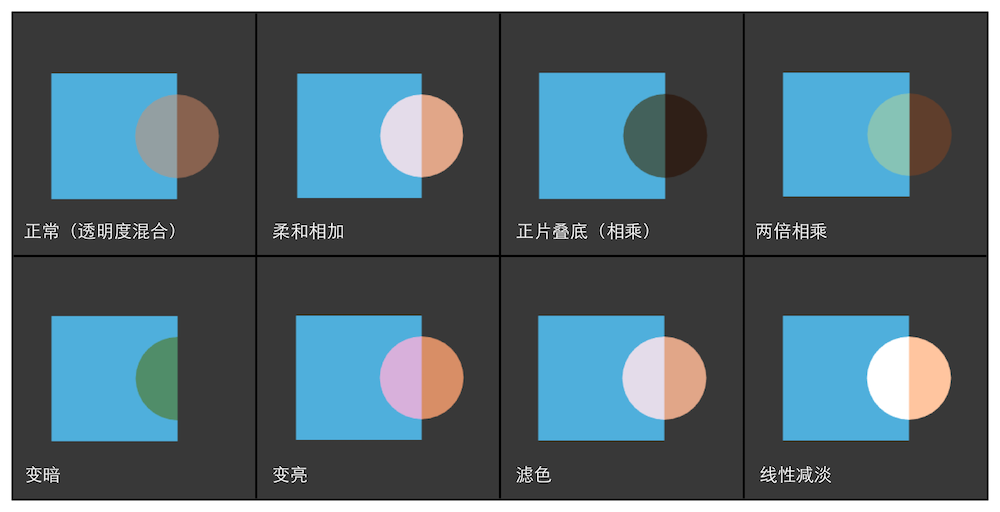

Unity中实现透明效果有两种方式，透明度测试(Alpha Test)和透明度混合(Alpha Blend)

# 渲染顺序很重要

在使用透明度混合技术的时候需要关闭深度写入，为什么呢？如果不关闭深度写入的话，一个半透明的物体表面背后的表面本来是可以透过它被我们看到的，但是由于深度测试时判断结果时该半透明表面距离摄像机更近，导致后面的表面将会被剔除，我们也就无法通过半透明表面看到后面的物体了。但是，我们由此也破坏了深度缓冲的工作机制，这是一个很糟糕的事情，尽管我们不得不这样做。

渲染引擎一般都会先对物体进行排序，再渲染。常用的方法是：
1. 先渲染所有不透明的物体，并且开启它们的深度测试和深度写入
2. 把半透明物体按照它们距离摄像机的远近进行排序，然后按照从后往前的顺序渲染透明物体，并开启它们的深度测试，但关闭深度写入。

为了减少错误排序的情况，我们可以尽可能让模型是凸面体。并且考虑将复杂的模型拆成可以独立排序的子模型等。其实就算排序错误结果有时也不会非常糟糕，如果我们不想分割网格，可以试着让透明通道更加柔和，使穿插看起来并不是那么明显。我们也可以使用开启了深度写入的半透明效果来近似模拟物体的半透明。

# 透明度测试

透明度测试的原理是：给定一个透明度阈值，当片元的透明度低于这个值的时候，直接舍弃该片元。
这种方式虽然简单，但是无法实现真正的半透明效果，要么是完全透明的，什么也看不到；要么是完全不透明的，就像不透明的物体一样。

```
Shader "Unity Shader Book/Chapter 8/Alpha Test"
{
    Properties{
        //
        _MainTex ("MainTex", 2D) = "white" {}
        
        //
        _Color ("MainTint", Color) = (1,1,1,1)
        
        // 阈值，
        _Cutoff ("Cutoff", Range(0,1)) = 0.5
    }

    SubShader{

        Tags{
            "Queue"="AlphaTest"
            "IgnoreProjector"="True"
            "RenderType"="TransparentCutout"
        }

        Pass{
            Tags{
                "LightMode"="ForwardBase"
            }

            CGPROGRAM
            ENDCG
        }
    }
}
```

所有的片元着色器方法的返回值都是fixed4的，它代表的就是输出到屏幕上的每个像素的颜色，

# 透明度混合

透明度混合的原理是：它会使用当前片元的透明度作为混合因子，与已经存储在颜色缓冲中的颜色值进行混合，得到新的颜色。但是透明度混合关闭了深度写入，这使得我们需要十分小心物体的渲染顺序。这种方法可以得到真正的半透明效果。

为了进行混合，我们需要使用Unity提供的混合命令——Blend，Blend是Unity提供的设置混合的命令。想要实现半透明的效果就需要把当前自身的颜色和已经存在于颜色缓冲中的颜色值进行混合，混合时使用的函数就是由该指令决定的。下表给出了Blend命令的语义：


两个透明物体的渲染顺序也很重要

A和B两个物体，如果谁先渲染，最终显示在屏幕上看起来就是谁被挡在了后面，为什么呢？混合操作的实现原理是什么？
| 语义                                            | 描述                                                                                                                                                           |
| ----------------------------------------------- | -------------------------------------------------------------------------------------------------------------------------------------------------------------- |
| BlendOff                                        | 关闭混合                                                                                                                                                       |
| Blend SrcFactor DstFactor                       | 开启混合，并设置混合因子。源颜色（该片元产生的颜色）会乘以SrcFactor，而目标颜色（已经存在于颜色缓冲中的颜色）会乘以DstFactor，然后把两者相加后再存入颜色缓冲中 |
| Blend SrcFactor DstFactor SrcFactorA DstFactorA | 和上面几乎一样 只是使用了不同的混合因子来混合透明通道                                                                                                          |
| BlendOp BlendOperation                          | 并非是把源颜色和目标颜色简单相加后混合，而是使用BlendOperation对他们进行其他操作                                                                               |

在本节中，我们会使用上表中的第二种语义，并且我们会把源颜色的混合因子SrcFactor设置成SrcAlpha，而目标颜色的混合因子DstFactor设置为OneMinusSrcAlpha。这意味着，经过混合后的新颜色是：
$$DstColor_{new} = SrcAlpha \times SrcColor + (1 - SrcAlpha) \times DstColor_{old}$$

```
// Upgrade NOTE: replaced 'mul(UNITY_MATRIX_MVP,*)' with 'UnityObjectToClipPos(*)'

Shader "Shader Book/Chapter 8/AlphaBlend"
{
    
    Properties
    {
        _Color ("ColorTine", Color) = (1,1,1,1)
        _MainTex ("MainTex", 2D) = "white"{}
        _AlphaScale ("AlphaScle", Range(0,1)) = 1
    }
    
    SubShader
    {
        Tags
        {
            "Queue"="Transparent"
            "IgnoreProjector"="True"
            "RenderType"="Transparent"
        }
        
        Pass
        {
            Tags{
                "LightMode"="ForwardBase"
            }
            
            Blend SrcAlpha OneMinusSrcAlpha
            ZWrite Off
            
            CGPROGRAM

            #pragma vertex vert
            #pragma fragment frag

            #include"Lighting.cginc"

            sampler2D _MainTex;
            float4 _MainTex_ST;
            fixed _AlphaScale;
            fixed4 _Color;

            struct a2v
            {
                // 因为需要做MVP变换 需要一个四维矩阵
                float4 vertex : POSITION;
                float3 normal : NORMAL;
                float4 texcoord : TEXCOORD0;
            };

            struct v2f
            {
                float4 pos : SV_POSITION;
                float3 worldNormal : TEXCOORD0;
                float3 worldPos : TEXCOORD1;
                float2 uv : TEXCOORD2;
            };
            

            v2f vert(a2v v)
            {
                v2f o;

                o.pos = UnityObjectToClipPos(v.vertex);
                o.worldNormal = UnityObjectToWorldNormal(v.normal);
                o.worldPos = mul(unity_ObjectToWorld, v.vertex).xyz;
                o.uv = TRANSFORM_TEX(v.texcoord, _MainTex);
                
                return o; 
            }

            fixed4 frag(v2f i) : SV_Target
            {
                fixed3 worldNormal = normalize(i.worldNormal);
                fixed3 worldLightDir = normalize(UnityWorldSpaceLightDir(i.worldPos));

                fixed4 texColor = tex2D(_MainTex, i.uv);
                fixed3 albedo = texColor.rgb * _Color.rgb;
                fixed3 ambient = UNITY_LIGHTMODEL_AMBIENT.xyz * albedo;
                
                fixed3 diffuse = _LightColor0.rgb * albedo * max(0, dot(worldNormal, worldLightDir));

                return fixed4(ambient + diffuse, texColor.a * _AlphaScale);
            }
            
            ENDCG
        }
    }
    
    Fallback "Transparent/VertexLit"
    
}

```


我们前面提到了关闭深度写入带来的种种问题，当模型本身有十分复杂的遮挡关系或者是包含了复杂的非凸网格的时候，就会有各种因为排序错误而产生的错误的透明效果。

因此我们需要想办法重新利用深度写入，让模型可以像半透明物体一样淡入淡出。

# 开启深度写入的半透明效果

上一小结最后我们提到了由于关闭深度写入而导致错误排序的情况。一种解决方法是**使用两个Pass**来渲染模型：第一个Pass开启深度写入，但是不输出颜色，它的目的仅仅是把模型的深度值写入深度缓冲中；第二个Pass进行正常的透明度混合，由于上一个Pass已经得到了逐像素的正确深度信息，该Pass就可以按照逐像素级别的深度排序结果进行透明渲染。但这种方法的缺点就是会对性能造成一定的开销，使用这种方法，我们仍然可以实现模型与它后面的背景的混合效果，但是模型内部之间不会有任何真正的半透明效果。

本节使用的Shader代码和上一节中的代码几乎一样，只是在Pass前面新添加一个Pass：

```
// Upgrade NOTE: replaced 'mul(UNITY_MATRIX_MVP,*)' with 'UnityObjectToClipPos(*)'

Shader "Shader Book/Chapter 8/AlphaBlendZWrite"
{
    
    Properties
    {
        _Color ("ColorTine", Color) = (1,1,1,1)
        _MainTex ("MainTex", 2D) = "white"{}
        _AlphaScale ("AlphaScle", Range(0,1)) = 1
    }
    
    SubShader
    {
        Tags
        {
            "Queue"="Transparent"
            "IgnoreProjector"="True"
            "RenderType"="Transparent"
        }
        
        Pass
        {
            ColorMask 0
            ZWrite On
        }

        Pass
        {
            Tags{
                "LightMode"="ForwardBase"
            }
            
            Blend SrcAlpha OneMinusSrcAlpha
            ZWrite Off
            
            CGPROGRAM

            #pragma vertex vert
            #pragma fragment frag

            #include"Lighting.cginc"

            sampler2D _MainTex;
            float4 _MainTex_ST;
            fixed _AlphaScale;
            fixed4 _Color;

            struct a2v
            {
                // 因为需要做MVP变换 需要一个四维矩阵
                float4 vertex : POSITION;
                float3 normal : NORMAL;
                float4 texcoord : TEXCOORD0;
            };

            struct v2f
            {
                float4 pos : SV_POSITION;
                float3 worldNormal : TEXCOORD0;
                float3 worldPos : TEXCOORD1;
                float2 uv : TEXCOORD2;
            };
            

            v2f vert(a2v v)
            {
                v2f o;

                o.pos = UnityObjectToClipPos(v.vertex);
                o.worldNormal = UnityObjectToWorldNormal(v.normal);
                o.worldPos = mul(unity_ObjectToWorld, v.vertex).xyz;
                o.uv = TRANSFORM_TEX(v.texcoord, _MainTex);
                
                return o; 
            }

            fixed4 frag(v2f i) : SV_Target
            {
                fixed3 worldNormal = normalize(i.worldNormal);
                fixed3 worldLightDir = normalize(UnityWorldSpaceLightDir(i.worldPos));

                fixed4 texColor = tex2D(_MainTex, i.uv);
                fixed3 albedo = texColor.rgb * _Color.rgb;
                fixed3 ambient = UNITY_LIGHTMODEL_AMBIENT.xyz * albedo;
                
                fixed3 diffuse = _LightColor0.rgb * albedo * max(0, dot(worldNormal, worldLightDir));

                return fixed4(ambient + diffuse, texColor.a * _AlphaScale);
            }
            
            ENDCG
        }
    }
    
    Fallback "Transparent/VertexLit"
    
}
```
这个新添加的Pass的目的仅仅是为了把模型的深度信息写入深度缓冲中，从而剔除模型中被自身遮挡的片元。因此，Pass的第一行开启了深度写入。在第二行，我们使用了一个新的渲染命令——**ColorMask**，在ShaderLab中，ColorMask用于设置颜色通道的写掩码（write mask），它的语义如下：
ColorMask RGB | A | 0 | 其他任何R、G、B、A的组合
当ColorMask设置为0时，意味着该Pass不写入任何颜色通道，即不会输出任何颜色，这正是我们需要的——该Pass只需要写入深度缓存即可。

# ShaderLab的混合命令

我们先来看一下混合是如何实现的。当片元着色器产生一个颜色的时候，可以选择与颜色缓存中的颜色进行混合，这样一来，混合就和两个操作数有关：源颜色（Source Color）和目标颜色（Destination Color），源颜色我们用**S**来表示，指的是由片元着色器产生的颜色值；目标颜色我们用**D**来表示，指的是从颜色缓冲中读取到的颜色值。对它们进行混合后得到的输出颜色，我们用**O**表示，它会重新写入颜色缓冲中，需要注意的是，当我们谈及混合中的源颜色、目标颜色和输出颜色的时候，它们都包含了RGBA四个通道的值，而并非RGB通道。


## 混合等式和参数

在之前的章节中我们提到过，混合是一个逐片元的操作，而且它是不可编程的，但却是高度可配置的。也就是说，我们可以设置混合时使用的运算操作、混合因子等来影响混合。

现在，我们已知两个操作数：源颜色S和目标颜色D，想要得输出颜色O就必须使用一个等式来计算。我们把这个等式成为**混合等式（blend equation）**当进行混合时，我们需要两个混合等式：一个用于混合RGB通道，一个用于混合A通道。当设置混合状态时，我们实际上设置的就是混合等式中的**操作**和**因子**。在默认情况下，混合等式使用的操作都是加操作（我们也可以使用其他操作），我们只需要再设置一下混合因子即可。由于需要两个等式（分别用于混合RGB通道和A通道），每个等式都有两个因子（一个用于和源颜色相乘，另一个用于和目标颜色相乘），因此一共需要四个因子。

| 语义                                            | 描述                                                                                                                                                           |
| ----------------------------------------------- | -------------------------------------------------------------------------------------------------------------------------------------------------------------- |
| Blend SrcFactor DstFactor                       | 开启混合，并设置混合因子。源颜色（该片元产生的颜色）会乘以SrcFactor，而目标颜色（已经存在于颜色缓冲中的颜色）会乘以DstFactor，然后把两者相加后再存入颜色缓冲中 |
| Blend SrcFactor DstFactor SrcFactorA DstFactorA | 和上面几乎一样 只是使用了不同的混合因子来混合透明通道                                                                                                          |

可以发现，上面这个表中的第一个语义只提供了两个因子，这意味着将使用同样的混合因子来混合RGB通道和A通道，即此时SrcFactorA将等于SrcFactor，DstFactorA将等于DstFactor。下面就是使用这些因子进行加法混合时的公式：
$$ O_{rgb} = SrcFactor \times S_{rgb} + DstFactor \times D_{rgb} $$
$$ O_{a} = SrcFactor \times S_{a} + DstFactor \times D_{a} $$ 
下表给出了ShaderLab支持的混合因子
| 参数             | 描述                                                                                                                                         |
| ---------------- | -------------------------------------------------------------------------------------------------------------------------------------------- |
| One              | 因子为1                                                                                                                                      |
| Zero             | 因子为0                                                                                                                                      |
| SrcColor         | 因子为源颜色值，当用于混合RGB的混合等式时，使用SrcColor的RGB分量作为混合因子；当用于混合A的混合等式时，使用SrcColor的A分量作为混合因子       |
| SrcAlpha         | 混合因子为源颜色的透明度值（A通道）                                                                                                          |
| DstColor         | 因子为目标颜色值，当用于混合RGB通道等式时，使用DstColor的RGB分量作为混合因子；当用于混合A通道的                                              |
| DstAlpha         | 因子为目标颜色的透明度值（A通道）                                                                                                            |
| DsrColor         | 因子为目标颜色值，当用于混合RGB通道的混合等式时，使用结果的RGB分量作为混合因子；当用于混合A通道的混合等式时，使用DstColor的A分量作为混合因子 |
| OneMinusSrcColor | 因子为(1-源颜色)，当用于混合RGB的混合等式时，使用结果的RGB分量作为混合因子；当用于混合A的混合等式时，使用结果的A分量作为混合因子             |
| OneMinusSrcAlpha | 因子为(1-源颜色的透明度值)                                                                                                                   |
| OneMinusDstColor | 因子为(1-目标颜色的颜色值)。当用于混合RGB的混合等式时，使用结果的RGB分量作为混合因子；当用于混合A的混合等式时，使用结果的A分量作为混合因子   |
| OneMinusDstAlpha | 因子为(1-目标颜色的透明度值)                                                                                                                 |


## 混合操作

在上面涉及的混合等式中，当把源颜色和目标颜色与它们对应的混合因子相乘之后，我们都是把它们的结果相加起来作为输出颜色的。那么可不可以选择不使用加法，而使用减法呢？答案是肯定的，我们可以使用ShaderLab的**BlendOp BlendOperation**命令，即混合操作命令。下表给出了ShaderLab中支持的混合操作
| 操作         | 描述                                                                                                                                                                                          |
| ------------ | --------------------------------------------------------------------------------------------------------------------------------------------------------------------------------------------- |
| Add          | 将混合后的源颜色和目标颜色相加。默认的混合操作。使用的混合等式是：<br>$O_{rgb} = SrcFactor \times S_{rgb} + DstFactor \times D_{rgb}$ <br>$O_{a} = SrcFactorA \times DstFactorA$              |
| Sub          | 用混合后的源颜色减去混合后的目标颜色。使用的混合等式是：<br>$O_{rgb} = SrcFactor \times S_{rgb} - DstFactor \times D_{rgb}$ <br> $O_{a} = SrcFactorA \times S_{a} - DstFactorA \times D_{a}$  |
| RevSub       | 使用混合后的目标颜色减去混合后的源颜色。使用的混合等式是: <br> $O_{rgb} = DstFactor \times D_{rgb} - SrcFactor \times S_{rgb}$ <br>$O_{a} = DstFactorA \times D_{a} - SrcFactor \times S_{a}$ |
| Min          | 使用源颜色和目标颜色中较小的值，是逐分量比较的，使用的混合等式是：<br> $O_{rgba} = (min(S_{r}, D{r}),min(S_{g}, D{g}),min(S_{b}, D{b}),min(S_{a}, D{a}))$                                     |
| Max          | 使用源颜色和目标颜色中较大的值，是逐分量比较的，使用的混合等式是: <br> $O_{rgba} = (max(S_{r}, D{r}),max(S_{g}, D{g}),max(S_{b}, D{b}),max(S_{a}, D{a}))$                                     |
| 其他逻辑操作 | 只在DirectX 11.1中支持                                                                                                                                                                        |

混合操作命令通常是与混合因子命令一起工作的。但是需要注意的是，当使用**Min**和**Max**混合操作的时候，混合因子实际上是不起作用的，它们仅会判断原始的源颜色和目标颜色之间的比较结果。

## 常见的混合类型

通过混合操作和混合因子命令的组合，我们可以得到一些类似PhotoShop混合模式中的混合效果
- 正常(Normal) 即透明度混合
 
    Blend SrcAlpha OneMinusSrcAlpha
- 柔和相加(Soft Additive)
  
  Blend OneMinusDstColor One
- 两倍相乘(2x Multiply)
  
  Blend DstColor SrcColor 
- 变暗(Darken)
  
  BlendOp Min
  Blend One One

- 变亮(Lighting)
  
  BlendOp Max
  Blend One one

- 滤色(Screen)
  
  Blend OneMinusDstColor One
  
  // 等同于
  Blend One OneMinusSrcColor

- 线性减淡(Linear Doge)
  
  Blend One one




# 双面渲染的透明效果

在现实生活中，如果一个物体是透明的，因为着我们不仅可以投哦过它看到其他物体的样子，也可以看到它的内部结构。但在前面实现的透明效果中，无论是透明度测试还是透明度混合，我们都无法观察到正方体内部和其背面的形状，导致物体看起来只有半个一样。这是因为，默认情况下渲染引擎剔除了物体背面(相对于摄像机方向)的渲染图元，而只渲染了物体的正面。如果我们想要得到双面渲染的效果，可以使用Cull指令来控制需要剔除哪个面的渲染图元。在Unity中，Cull指令的语法如下：
>Cull Back | Front | Off

如果设置为Back，那么那些背对着摄像机的渲染图元就不会被渲染，这也是默认情况下的剔除状态；如果设置为Front，那么那些朝向摄像机的渲染图元就不会被渲染；如果设置为Off，就会关闭剔除功能，那么所有的图元都会被渲染，但由于这时需要渲染的图元数目会成倍增加，因此除非是用于特殊效果，例如这里的双面渲染的透明效果，通常情况下是不会关闭剔除功能的。

## <span id = 1>透明度测试的双面渲染</span>

我们首先来看一下，如何让使用了透明度测试的物体实现双面渲染的效果，这非常简单，只需要在Pass的渲染设置中使用Cull指令来关闭剔除即可。因此拷贝AlphaTest小节部分的代码，并加入`Cull off`:
```
Shader "Unity Shader Book/Chapter 8/AlphaTestBothSides"
{
    Properties
    {
        _Color ("Main Tint", Color) = (1,1,1,1)
        _MainTex ("Texture", 2D) = "white" {}
        _Cutoff ("Alpha Cutoff", Range(0,1)) = 0.5
    }
    SubShader
    {
       Tags
       {
           "Queue"="AlphaTest"
           "IgnoreProjector"="True"
           "RenderType"="TransparentCutout"
       }
       
       Cull Off
       
       Pass
       {
           Tags
           {
               "LightMode"="ForwardBase"
           }
           
           CGPROGRAM

            #pragma vertex vert
            #pragma fragment frag

            #include "Lighting.cginc"

            fixed4 _Color;
            sampler2D _MainTex;
            float4 _MainTex_ST;
            fixed _Cutoff;


            struct a2v
            {
               float4 vertex : POSITION;
               float3 normal : NORMAL;
               float4 texcoord : TEXCOORD0;
            };
            
            struct v2f
            {
               float4 pos : SV_POSITION;
               float3 worldNormal : TEXCOORD0;
               float3 worldPos : TEXCOORD1;
               float2 uv : TEXCOORD2;
            };

            v2f vert(a2v v){

                v2f o;
                o.pos = mul(unity_MatrixMVP,v.vertex);
                o.worldNormal = UnityObjectToWorldNormal(v.normal);
                o.worldPos = mul(unity_ObjectToWorld, v.vertex).xyz;
                o.uv = TRANSFORM_TEX(v.texcoord, _MainTex);
                return o;                
            }

            fixed4 frag(v2f i) : SV_Target{
                fixed3 worldNormal = normalize(i.worldNormal);
                fixed3 worldLightDir = normalize(UnityWorldSpaceLightDir(i.worldPos));

                fixed4 texColor = tex2D(_MainTex, i.uv);

                clip(texColor.a - _Cutoff);

                // if((texColor.a - _Cutoff) < 0.0)
                // {
                //     discard;
                // }

                fixed3 albedo = texColor.rgb * _Color.rgb;

                fixed3 ambient = UNITY_LIGHTMODEL_AMBIENT.xyz * albedo;

                fixed3 diffuse = _LightColor0.rgb * albedo * max(0, dot(worldNormal, worldLightDir));

                return fixed4(ambient + diffuse, 1.0);
            }
            
           ENDCG
       }
        
       
       
       
    }
}
```

## 透明度混合的双面渲染

和透明度测试相比，想要让透明度混合实现双面渲染可能会更复杂一点，这是因为透明度混合需要关闭深度写入，而这是“一切混乱的开端”。我们知道，想要得到正确的透明效果，渲染顺序是十分重要的——**我们需要保证图元是从后往前渲染的**。对于透明度测试来说，由于我们没有关闭深度写入，因此可以利用深度缓冲按逐像素的粒度进行排序，从而保证渲染的正确性。然而一旦关闭了深度写入，我们就需要小心地控制渲染顺序来得到正确的深度关系。如果我们仍然采用[**透明度测试的双面渲染**](#1)小节中的方法直接关闭剔除功能，那么我们就无法保证同一个物体的正面和背面图元的渲染顺序，就有可能得到错误的半透明效果。

为此，我们选择把双面渲染的工作分成两个Pass——第一个Pass只渲染背面，第二个Pass只渲染正面，由于Unity会顺序执行SubShader中的各个Pass，因此我们可以保证背面总是在正面渲染之前渲染，从而可以保证正确的深度关系。

```
// Upgrade NOTE: replaced 'mul(UNITY_MATRIX_MVP,*)' with 'UnityObjectToClipPos(*)'

Shader "Shader Book/Chapter 8/AlphaBlendBothSides"
{
    
    Properties
    {
        _Color ("ColorTine", Color) = (1,1,1,1)
        _MainTex ("MainTex", 2D) = "white"{}
        _AlphaScale ("AlphaScle", Range(0,1)) = 1
    }
    
    SubShader
    {
        Tags
        {
            "Queue"="Transparent"
            "IgnoreProjector"="True"
            "RenderType"="Transparent"
        }
        
        Pass
        {
            Tags{
                "LightMode"="ForwardBase"
            }
            
            Cull Front
            
            Blend SrcAlpha OneMinusSrcAlpha
            ZWrite Off
            
            CGPROGRAM

            #pragma vertex vert
            #pragma fragment frag

            #include"Lighting.cginc"

            sampler2D _MainTex;
            float4 _MainTex_ST;
            fixed _AlphaScale;
            fixed4 _Color;

            struct a2v
            {
                // 因为需要做MVP变换 需要一个四维矩阵
                float4 vertex : POSITION;
                float3 normal : NORMAL;
                float4 texcoord : TEXCOORD0;
            };

            struct v2f
            {
                float4 pos : SV_POSITION;
                float3 worldNormal : TEXCOORD0;
                float3 worldPos : TEXCOORD1;
                float2 uv : TEXCOORD2;
            };
            

            v2f vert(a2v v)
            {
                v2f o;

                o.pos = UnityObjectToClipPos(v.vertex);
                o.worldNormal = UnityObjectToWorldNormal(v.normal);
                o.worldPos = mul(unity_ObjectToWorld, v.vertex).xyz;
                o.uv = TRANSFORM_TEX(v.texcoord, _MainTex);
                
                return o; 
            }

            fixed4 frag(v2f i) : SV_Target
            {
                fixed3 worldNormal = normalize(i.worldNormal);
                fixed3 worldLightDir = normalize(UnityWorldSpaceLightDir(i.worldPos));

                fixed4 texColor = tex2D(_MainTex, i.uv);
                fixed3 albedo = texColor.rgb * _Color.rgb;
                fixed3 ambient = UNITY_LIGHTMODEL_AMBIENT.xyz * albedo;
                
                fixed3 diffuse = _LightColor0.rgb * albedo * max(0, dot(worldNormal, worldLightDir));

                return fixed4(ambient + diffuse, texColor.a * _AlphaScale);
            }
            
            ENDCG
        }
        
        Pass
        {
            Tags{
                "LightMode"="ForwardBase"
            }
            
            Cull Back
            
            Blend SrcAlpha OneMinusSrcAlpha
            ZWrite Off
            
            CGPROGRAM

            #pragma vertex vert
            #pragma fragment frag

            #include"Lighting.cginc"

            sampler2D _MainTex;
            float4 _MainTex_ST;
            fixed _AlphaScale;
            fixed4 _Color;

            struct a2v
            {
                // 因为需要做MVP变换 需要一个四维矩阵
                float4 vertex : POSITION;
                float3 normal : NORMAL;
                float4 texcoord : TEXCOORD0;
            };

            struct v2f
            {
                float4 pos : SV_POSITION;
                float3 worldNormal : TEXCOORD0;
                float3 worldPos : TEXCOORD1;
                float2 uv : TEXCOORD2;
            };
            

            v2f vert(a2v v)
            {
                v2f o;

                o.pos = UnityObjectToClipPos(v.vertex);
                o.worldNormal = UnityObjectToWorldNormal(v.normal);
                o.worldPos = mul(unity_ObjectToWorld, v.vertex).xyz;
                o.uv = TRANSFORM_TEX(v.texcoord, _MainTex);
                
                return o; 
            }

            fixed4 frag(v2f i) : SV_Target
            {
                fixed3 worldNormal = normalize(i.worldNormal);
                fixed3 worldLightDir = normalize(UnityWorldSpaceLightDir(i.worldPos));

                fixed4 texColor = tex2D(_MainTex, i.uv);
                fixed3 albedo = texColor.rgb * _Color.rgb;
                fixed3 ambient = UNITY_LIGHTMODEL_AMBIENT.xyz * albedo;
                
                fixed3 diffuse = _LightColor0.rgb * albedo * max(0, dot(worldNormal, worldLightDir));

                return fixed4(ambient + diffuse, texColor.a * _AlphaScale);
            }
            
            ENDCG
        }
    }
    
    Fallback "Transparent/VertexLit"
    
}
```
