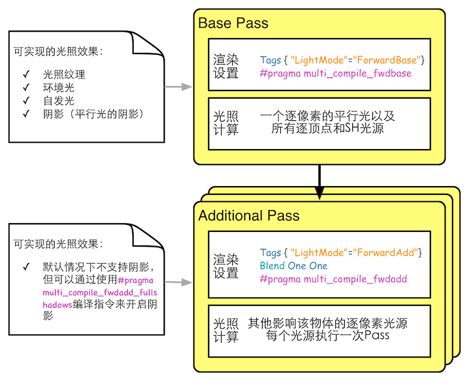
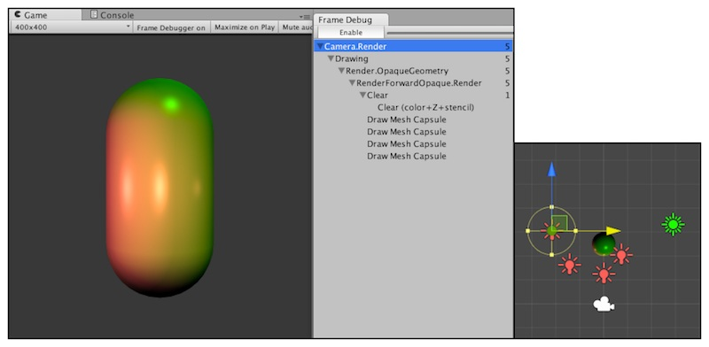
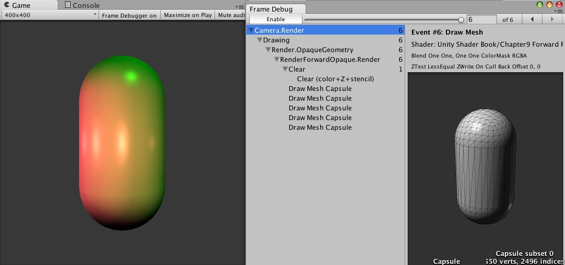
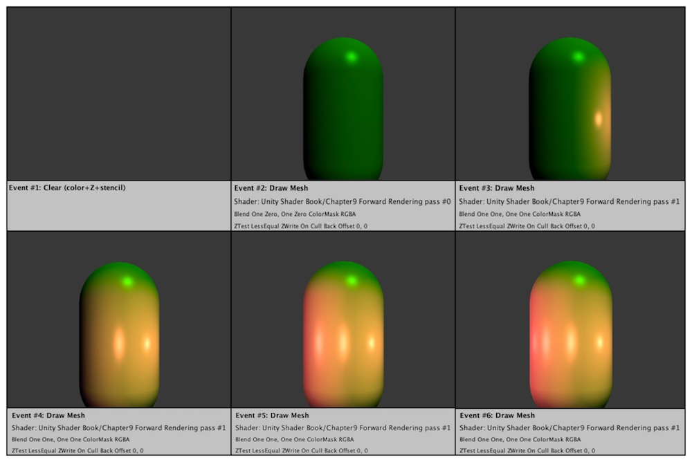
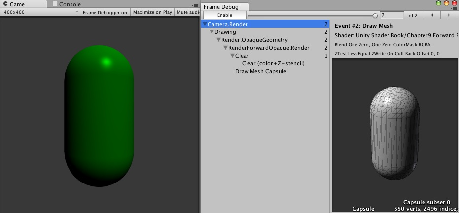
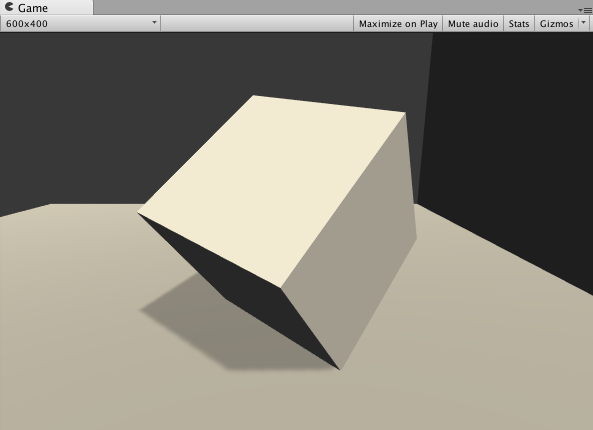
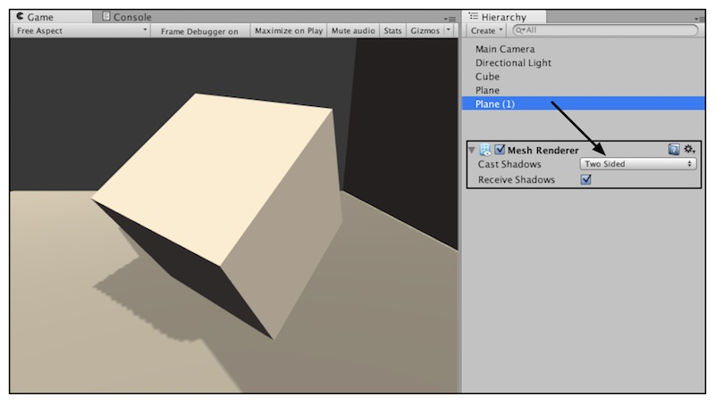
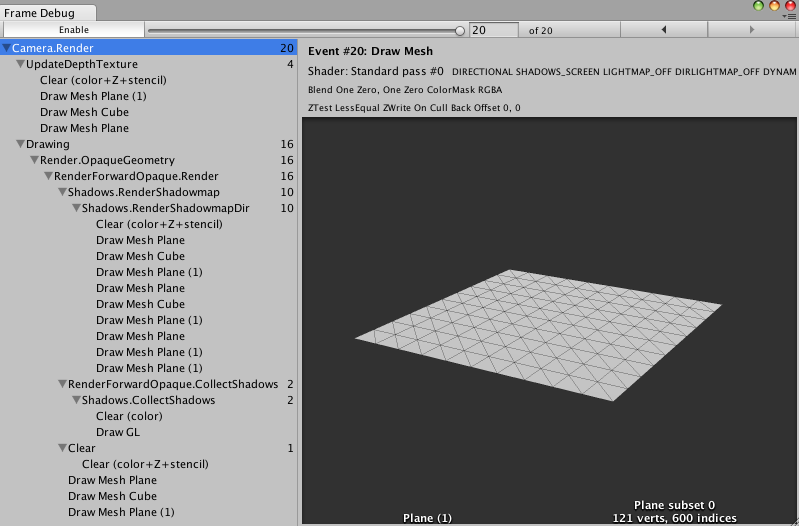

# Unity 的渲染路径


在Unity中， 渲染路径(Render Path)决定了光照是如何被应用到Unity Shader中的。因此，如果要和光源打交道，我们需要为每个Pass指定它使用的渲染路径，只有这样才能让Unity知道，“哦，原来这个程序员想要这种渲染路径，那么好的，我把光源和处理后的光照信息都放在这些数据里，你可以访问啦！”也就是说，我们只有为Shader正确地选择和设置了需要地渲染路径，该Shader地光照计算才能被正确执行。

Unity支持多种类型的渲染路径。在Unity5.0之前，Unity主要有3种：`前向渲染路径(Forward Rendering Path)`、`延迟渲染路径(Deferred Rendering Path)`和`顶点照明渲染路径(Vertex Lit Rendering Path)`。unity5.0之后，Unity做了很多更改，主要有两个变化：首先顶点照明渲染路径已经被Unity抛弃。其次，新的延迟渲染路径已经代替了原来的延迟渲染路径。

大多数情况下，一个项目只会使用一种渲染路径，因此我们可以为整个项目设置渲染时的渲染路径。我们可以通过在Unity的`Edit -> Project Settings -> Player -> Other Settings -> Rendering Path`种进行这是。默认情况下是前向渲染路径。有时我们希望可以使用多个渲染路径，例如摄像机A渲染的物体使用前向渲染路径，而摄像机B渲染的物体使用延迟渲染路径。这时，我们可以在每个摄像机的渲染设置种设置该摄像机的渲染路径，以覆盖Project Setting种的设置。需要注意的是，如果当前的显卡不支持所选择的渲染路径，Unity会自动使用更低一级的渲染路径。例如如果一个GPU不支持延迟渲染，那么Unity就会使用前向渲染。

完成了上面的设置后，我们就可以在每个Pass种使用标签来指定该Pass使用的渲染路径。这是通过设置Pass中的`LightMode`标签来实现的。不同类型的渲染路径可能会包含多种标签设置。例如，我们之前在代码中写的：
```
Pass{
    Tags{"LightMode"="ForwardBase"}
}
```

上面的代码将告诉Unity，该Pass使用前向渲染路径中的ForwardBase路径。而前向渲染路径还有一种路径叫做ForwardAdd。下表给出了Pass的LightMode标签支持的渲染路径设置选项。
| 标签名                         | 描述                                                                           |
| ------------------------------ | ------------------------------------------------------------------------------ |
| Always                         | 不管使用哪种渲染路径，该Pass都会被渲染，但是不会计算任何光照                   |
| ForwardBase                    | 用于**前向渲染**。该Pass会计算环境光、最重要的平行光、逐顶点/SH光源和Lightmaps |
| ForwardAdd                     | 用于**前向渲染**。该Pass会计算额外的逐像素光源，每个Pass对应一个光源           |
| Deferred                       | 用于**延迟渲染**。该Pass会渲染G缓冲(G-Buffer)                                  |
| ShadowCaster                   | 把物体的深度信息渲染到阴影映射纹理(shadowmap)或者一张深度纹理中                |
| PerpassBase                    | 用于**遗留的延迟渲染**。该Pass会渲染法线和高光反射的指数部分                   |
| PerpassFinal                   | 用于遗留的**延迟渲染**。该Pass通过合并纹理、光照和自发光来渲染得到最后的颜色   |
| Vertex、VertexLMRGBM和VertexLM | 用于**遗留的顶点照明渲**染                                                     |

那么指定渲染路径到底有什么用呢？如果一个Pass没有指定任何渲染路径会有什么问题吗？通俗来讲，指定渲染路径是我们和Unity的底层渲染引擎的一次重要的沟通。例如，如果我们为一个Pass设置了前向渲染路径的标签，相当于会告诉Unity引擎：“嘿，我准备使用前向渲染了，你把这些光照属性都按照前向渲染的流程给我准备好，我一会儿要用！”随后，我们可以通过Unity提供的内置光照变量来访问这些属性。如果我们没有指定任何渲染路径，那么一些光照变量很可能不会被正确赋值，我们计算出的效果也就很可能是错误的。那么Unity的渲染引擎是如何处理这些渲染路径的呢？下面我们会对这些渲染路径进行更加详细的解释。

## 前向渲染路径

前向渲染路径是传统的渲染方式，也是我们最常用的一种渲染路径。在本节，我们首先会概括前向渲染路径的原理，然后再给出Unity对于前向渲染路径的实现细节和要求，最后给出Unity Shader中哪些内置变量是用于前向渲染路径的。

1. 前向渲染路径原理

每进行一次完整的前向渲染，我们需要渲染该对象的渲染图元，并计算两个缓冲区的信息，一个是颜色缓冲区，一个是深度缓冲区。我们利用深度缓冲来决定一个片元是否可见，如果可见就更新颜色缓冲区的颜色值。我们可以用下面的伪代码来描述前向渲染路径的大致过程：
```
Pass{
    for(each primitive in this model){
        // primitive 就是图元的意思
        for(each fragment coverd by this primitive){
            if(failed in depth test){
                // 如果没有通过深度测试，就丢弃
                discard;
            }else{

                // 如果该片元可见就进行光照计算
                float4 color = Shading(materialInfo, pos, normal, lightDir, viewDir);

                // 将颜色写入颜色缓冲
                writeFrameBuffer(fragment, color);
            }
        }
    }
}
```

对于每个逐像素光源，我们都需要及逆行上面一次完整的渲染流程。如果一个物体再多个逐像素光源的影响区域内，那么该物体就需要执行多个Pass，每个Pass计算一个逐像素光源的光照结果，那么该物体就需要执行多个Pass，每个Pass计算一个逐像素光源的光照结果，然后再帧缓冲中把这些光照结果混合起来得到最终的颜色值。假设，场景中有N个物体，每个物体受M个光源的影响，那么渲染整个场景一共需要N*M个Pass。可以看出，如果有大量逐像素光照，那么执行的Pass数目也会很大。因此，渲染引擎通常会限制每个物体的逐像素光照的数目。

2. Unity中的前向渲染 

事实上，一个Pass不仅仅可以用来计算逐像素光照，它也可以用来计算逐顶点等其他光照，这取决于光照计算所处流水线阶段以及计算时使用的数学模型。当我们渲染一个物体时，Unity会计算哪些光源照亮了它，以及这些光照亮该物体的方式。

在Unity中，前向渲染路径有3种处理光照(即照亮物体)的方式：逐顶点处理、逐像素处理、球谐函数(Spherical harmonics, SH)处理。而决定一个光源使用哪种处理模式取决于它的类型和渲染模式。光源类型指的是光源是平行光还是其他类型的光源，而光源的渲染模式指的是该光源是否是重要的。如果我们把一个光照的模式设置为Important，意味着我们告诉Unity“嘿老兄，这个光源很重要，我希望你可以认真对待它，把它当成一个逐像素光源来处理！”我们可以在光源的Light组件中设置这些属性。

在前向渲染中，当我们渲染一个物体时，Unity会根据场景中各个光源的设置以及这些光源对物体的影响程度(例如，距离该物体的远近、光源强度等)对这些光源进行一个重要程度的排序。其中，一定数目的光源会按照逐像素的方式处理，然后最多有4个光源按照逐顶点的方式处理，剩下的光源可以按照SH的方式处理.Unity使用的判断规则如下:
- 场景中最亮的平行光总是按像素处理的。
- 渲染模式被设置成Not Important的光源，会按照逐顶点或者SH处理
- 渲染模式被设置成Important的光源，会按逐像素处理
- 如果根据以上规则得到逐像素光源数量小于Quality Setting中的逐像素光源数量(Pixel Light Count)，会有更多的光源以逐像素的方式进行渲染。

那么，在哪里进行光照计算呢？当然是在Pass里，前面提到过，前向渲染路径有两种Pass:Base Pass和Additional Pass。通常来说，这两种Pass进行的标签和渲染设置以及常规光照计算如下图：



图中有几点要说明的地方
- 首先，可以发现在渲染设置中，我们除了设置Pass的标签以外，还是用了`#pragma multi_compile_fwdbase`这样的编译指令。根据官方文档中的解释，我们可以知道，这些编译指令会保证Unity可以为相应的Pass生成所有需要的Shader变种，这些变种会处理不同条件下的渲染逻辑，例如是否使用光照贴图、当前处理哪种光源类型、是否开启了阴影等，同时Unity也会在背后声明相关的内置变量并传递到Shader中。通俗来讲，只有分别为Base Pass和Additional Pass使用这两个编译指令，我们才可以在相关的Pass中得到一些正确的光照变量，例如光照衰减值等。
- Base Pass旁边的标注给出了Base Pass中支持的一些二光照特性。例如在Base Pass中，我们可以访问光照纹理(light map)。
- Base Pass中渲染的平行光默认是支持阴影的(如果开启了光源的阴影功能)，而Additional Pass中渲染的光源在默认情况下是没有阴影的，即便我们在它的Light组件中设置了有阴影的Shadow Type。但我们可以在Additional Pass中使用 #pragma_multi_compile_fwdadd_fullshadows代替#pragma_multi_compile_fwdadd编译指令，为点光源和聚光灯开启阴影效果，但这需要Unity在内部使用更多的Shader变种。
- 环境光和自发光也是在Base Pass中计算的。这是因为，对于一个物体来说，环境光和自发光我们只希望计算一次即可，而如果我们在Additional Pass中计算两种光照，就会造成叠加多次环境光和自发光，这不是我们想要的。
- 在Additional Pass的渲染设置中，我们还开启和设置了混合模式。这是因为，我们希望每个Additional Pass可以与上一次的光照结果在帧缓存中进行叠加，从而得到最终的有多个光照的渲染结果。如果我们没有开启和设置混合模式，那么Additional Pass的渲染结果会覆盖掉之前的渲染结果，看起来就好像该物体只受该光源的影响。通常境况下，我们选择的混合模式是`Blend One One`。
- 对于前向渲染来说，一个Unity Shader通常会定义一个Base Pass(Base Pass也可以定义多次，例如需要双面渲染的情况)以及一个Additional Pass。一个Base Pass仅会执行一次(定义了多个Base Pass的情况除外)，而一个Additional Pass会根据影响物体的其他逐像素光源的数目而被多次调用，即每个逐像素的光源都会执行一次Additional Pass。
  
上图中给出的光照计算是通常情况下我们在每种Pass中进行的计算。实际上，渲染路径的设置用于告诉Unity该Pass在前向渲染路径中的位置，然后底层的渲染引擎会进行相关的计算并填充一些内置变量比如_Lightcolor0等，如何使用这些内置变量进行计算完全取决于开发者的选择。例如，我们完全可以利用Unity提供的内置变量在Base Pass中只进行逐顶点的光照；同样我们也完全可以在Additional Pass中按逐顶点的方式进行光照计算，不进行任何逐像素光照计算。

3. 内置的光照变量和函数

前面说过，根据我们使用的渲染路径，Unity会把不同的光照变量传递给Shader。
在Unity5中，对于前向渲染ForwardBase和ForwardAdd来说，下表给出了我们可以在Shader中访问到的光照变量
| 名称                                                     | 类型            | 描述                                                                                                                                                               |
| -------------------------------------------------------- | --------------- | ------------------------------------------------------------------------------------------------------------------------------------------------------------------ |
| _LightColor0                                             | float4          | 该Pass处理的逐像素光源的颜色                                                                                                                                       |
| _WorldSpaceLight0                                        | float4          | _WorldSpaceLightPos0.xyz是该Pass处理的逐像素光源的位置。如果该光源是平行光，那么_WorldSpaceLightPos0.w是0，其他光源类型的w值为1                                    |
| _LightMatrix0                                            | float4$\times$4 | 从世界空间到光源空间的变换矩阵。可以用于采样cookie和光强衰减(attenuation)纹理                                                                                      |
| unity_4LightPosX0，unity_4LightPosY0,unity_4LightPosZ0、 | float4          | 仅用于BasePass 前4个非重要的点光源在世界空间中的位置                                                                                                               |
| unity_4LightAtten0                                       | float4          | 仅用于BasePass                                                                                                               。存储了前4个非重要的点光源的衰减因子 |
| unity_LightColor                                         | half[4]         | 仅用于BasePass。存储了前4个非常重要的点光源的颜色。                                                                                                                |

我们在之前的学习中已经给出了一些可以用于前向渲染路径的函数，例如WorlSpaceLightDir、UnityWorldSpaceLightDir和ObjSpaceLightDir。为了完整性，下表再次给出了前向渲染中可以使用的内置光照函数
| 函数名                                   | 描述                                                                                                                                                                                                                                                   |
| ---------------------------------------- | ------------------------------------------------------------------------------------------------------------------------------------------------------------------------------------------------------------------------------------------------------ |
| float3 WorldSpaceLightDir(float4 v)      | **仅可以用于前前向渲染中**。输入一个模型空间中的顶点位置，返回世界空间中从该点到光源的光照方向。内部实现使用了UnityWorldSpaceLightDir函数，没有被归一化                                                                                                |
| float3 UnityWorldSpaceLightDir(float4 v) | **仅可以用于前向渲染中**。输入一个世界空间中的顶点位置，返回世界空间中从该点到光源的光照方向。没有被归一化。                                                                                                                                           |
| float3 ObjSpaceLightDir(float4 v)        | **仅可以用于前向渲染中**。输入一个模型空间中的顶点位置，返回模型空间中从该点到光源的光照方向，没有被归一化。                                                                                                                                           |
| float3 Shade4PointLights(...)            | **仅可用于前向渲染中**。计算四个光源的光照，它的参数是已经打包进矢量的光照数据，也就是上张表中的内置变量，如unity_4LightPosX0，unity_4LightPosY0,unity_4LightPosZ0、unity_LightColor和unity_4LightAtten0等。前向渲染通常会使用这个函数来计算逐顶点光照 |

需要说明的是，上面给出的变量和函数并不是完整的，一些前向渲染可以使用的内置变量和函数官方文档中并没有给出说明。在后面的学习中，我们会使用到一些不在这些表中的变量和函数，那时我们会特别说明。

## 顶点照明渲染路径

顶点照明路径是对硬件配置要求最少、运算性能最高，但同时也是得到的效果最差的一种类型，它不支持那些逐像素才能得到的效果，比如阴影、法线映射、高精度的高光反射等。实际上，它仅仅是前向渲染路径的一个子集，也就是说，所有可以在顶点照明路径中可以实现的效果都能够在前向渲染路径中实现。就如同它的名字一样，顶点照明路径只是使用了逐顶点的方式来计算光照，并没有什么神奇的地方。实际上，我们在前向渲染路径中也可以计算一些逐顶点的光照。但是如果选择使用顶点照明渲染路径，那么Unity只会填充哪些逐顶点相关的变量，意味着我们不能使用一些逐像素的光照变量。
1. Unity中的顶点照明渲染
   顶点照明渲染路径通常在一个Pass中就可以完成对物体的渲染。在这个Pass中，我们会计算我们关心的所有光源对该物体的照明，并且这个计算是按照逐顶点的方式处理的。这是Unity中最快速的渲染路径，并且具有最广泛的硬件支持。由于顶点照明渲染路径仅仅是前向渲染路径的一个子集，因此现在Unity其实已经抛弃这种渲染路径了。
2. 可访问的内置变量和函数
   在Unity中，我们可以在一个顶点照明的Pass中最多访问到8个逐顶点光源。如果我们只需要渲染其中两个光源对物体的照明。可以仅使用下表中内置光照数据的前两个。如果影响该物体的光源数目小于8个，那么数组中剩下的光源颜色都会被设置成黑色。

| 名称                | 类型      | 描述                                                                                                                                                                         |
| ------------------- | --------- | ---------------------------------------------------------------------------------------------------------------------------------------------------------------------------- |
| unity_LightColor    | half4[8]  | 光源颜色                                                                                                                                                                     |
| unity_LightPosition | float4[8] | xyz分量是视角空间中的光源位置。如果光源是平行光 ，那么z分量值为0，其他光源类型z分量值为1                                                                                     |
| unity_LightAtten    | half4[8]  | 光源衰减因子。如果光源是聚光灯，x分量是cos(spotAngle/2)，y分量是1/cos(spotAngle/4)；如果是其他类型的光源，x分量是-1，y分量是1.z分量是衰减的平方，w分量是光源范围开根号的结果 |
| unity_SpotDirection | float4[8] | 如果光源是聚光灯的话，值为视角空间的聚光灯的位置；如果是其他类型的光源，值为(0,0,1,0)                                                                                        |

可以看出，一些变量我们同样可以在前向渲染路径中使用，例如unity_LightColor。但是这些变量的数组的维度和数值在不同渲染路径下的值是不一样的。

下表给出了顶点照明路径中可以使用的内置函数。
| 函数名                                                                                     | 描述                                                                                                                                                                                  |
| ------------------------------------------------------------------------------------------ | ------------------------------------------------------------------------------------------------------------------------------------------------------------------------------------- |
| float3 ShadeVertexLights(float4 vertex, float3 normal)                                     | 输入模型空间中顶点位置和法线，计算四个逐顶点光源的光照以及环境光，内部实现实际上调用了ShadeVertexLightsFull函数                                                                       |
| float3 ShadeVertexLightsFull(float3 vertex, float3 normal, int lightCount, bool spotlight) | 输入模型空间中的顶点位置和法线，计算lightCount个光源的光照以及环境光。如果spotLight值为true，那么这些光源会被当成聚光灯来处理，虽然结果更加精确，但是计算更加耗时；否则按照点光源处理 |

## 延迟渲染路径

前向渲染的问题是：当场景中包含大量的实时光源时，前向渲染的性能会技术下降。例如，如果我们在场景的某一块区域放置了多个光源，这些光源影响的区域互相重叠，那么为了得到最终的光照效果，我们就需要为该区域内的每个物体执行多个Pass来计算不同光源对该物体的光照结果，然后在颜色缓冲中把这些结果混合起来得到最终的光照。然而，每执行一个Pass我们都需要重新渲染一遍物体，但是很多的计算是重复的。

延迟渲染是一种更加古老的算法，但是由于上述前向渲染可能造成瓶颈问题，近几年来又流行起来。除了前向渲染中使用的颜色缓冲和深度缓冲外，延迟渲染还会利用额外的缓冲区，这些缓冲区也被称为G缓冲(G-buffer)，其中G是英文Geometry的缩写。G缓冲存储了我们所关心的表面(通常是指离摄像机更近的表面)的其他信息。例如该表面的法线、位置、用于光照计算的材质属性等。

1. 延迟渲染的原理
延迟渲染主要包括了两个Pass。在第一个Pass中，我们不进行任何的光照计算，而是仅仅计算哪些片元是可见的，这主要是通过深度缓冲技术来实现的，当发现一个片元是可见的，我们就把它的相关信息存储到G缓冲区中。然后，在第二个Pass中，我们利用G缓冲区的各个片元信息，例如表面法线、视角方向、漫反射系数等，进行真正的光照计算。
延迟渲染的过程大致可以用下面的伪代码来描述

```
Pass 1{
    // 第一个Pass不进行真正的光照计算
    // 仅仅把光照计算需要的信息存储到G缓冲中

    for(each primitive in this model){
        for(each fragment cover by this primitive){
            if(failed in depth test){
                // 没有通过深度测试，说明该片元是不可见的
                discard;
            }else{
                // 如果该片元可见
                // 就把需要的信息存储到G缓冲中
                writeGBuffer(materialInfo, pos, normal);
            }
        }
    }
}

Pass 2{
    // 利用G缓冲中的信息进行真正的光照计算

    for(each pixel in the screen){
        if(the pixel is valid){
            // 如果该像素是有效的
            // 读取它对应的G缓冲中的信息
            readGBuffer(pixel, materialInfo, pos, normal);

            // 根据读取到的信息进行光照计算
            float4 color = Shading(materialInfo, pos, normal, lightDir, viewDir);

            // 更新帧缓冲
            writeFrameBuffer(pixel, color)
        }
    }
}
```

可以看出，延迟渲染使用的Pass数通常就是两个，这跟场景中包含的光源数量是没有关系的。换句话说，延迟渲染的效率不依赖于场景的复杂度，而是和我们使用的屏幕空间的大小有关。这是因为，我们需要的信息都存储在缓冲区中，而这些缓冲区可以理解成是一张张2D图像，我们的计算实际上就是在这些图像空间中进行的。


2. Unity中的延迟渲染
   第二个Pass用于计算真正的光照模型，这个Pass会使用上一个Pass中的渲染数据来计算最终的光照颜色，再存储到帧缓冲中。
   默认的G缓冲区，注意不同的Unity版本的渲染纹理存储内容会有所不同，包含了以下几个渲染纹理(Render Texture, RT)。
   - RT0: 格式是ARGB32，RGB通道用于存储漫反射颜色，A通道没有被使用
   - RT1: 格式是ARGB32，RGB通道用于存储高光反射颜色，A通道用于存储高光反射的指数部分。
   - RT2: 格式是ARGB2101010，RGB用于存储法线，A通道没有被使用。
   - RT3: 格式是ARGB32(非HDR)或ARGBHalf(HDR)，用于存储自发光+lightmap+反射探针(reflection probes)
   - 深度缓冲和模板缓冲
   在第二个Pass中计算光照时，默认情况下尽可以使用Unity内置的Standard光照模型，如果我们想使用其他的光照模型，就需要替代掉原有的Internal-DeferredShading.shader文件。
3. 可访问的内置变量和函数
下表给除了处理延迟渲染路径可以使用的光照变量。这些变量都可以在`UnityDeferredLibrary.cginc`文件中找到它们的声明。

| 名称          | 类型              | 描述                                                             |
| ------------- | ----------------- | ---------------------------------------------------------------- |
| _LightColor   | float4            | 光源颜色                                                         |
| _LightMatrix0 | float4 $\times$ 4 | 从世界空间到光源空间的变换矩阵，可以用于采样cookie和光强衰减纹理 |

# Unity中的光源类型

Unity一共支持4种类型的光源：平行光、点光源、聚光灯和面光源(area light)。面光源仅在烘培时才可以发挥作用，因此不在本书的讨论范围内。由于每种光源的几何定义不同，因此它们对应的光源属性也就各不相同。这就要求我们要区别对待它们。幸运的是Unity提供了很多内置函数帮助我们处理这些光源，在本章最后我们会介绍这些函数，但首先，我们要先来了解它们背后的原理。

## 光源类型有什么影响

我们来看一下光源类型的不同到底会给Shader带来哪些影响。我们可以考虑Shader种使用了光源的哪些属性。最常用的光源属性有光源的**位置、方向（更具体的说时到某点的方向）、颜色、强度以及衰减（更具体地说是到某点的衰减，与该点到光源的距离有关）**这5个属性。而这些属性与它们的几何定义息息相关。


1. 平行光
   对于我们能之前使用的平行光来说，它的几何定义是最简单的。平行光可以照亮的范围是没有限制的，它通常是作为太阳这样的角色在场景中出现的。
   平行光之所以简单，是因为它没有一个唯一的位置，也就是说，它可以放在场景中的任意位置，它的几何属性只有方向，我们可以调整平行光的Transform组件中的Rotation属性来改变它的光源方向，而且平行光到场景中所有点的方向都是一样的，这也是平行光的由来。除此之外，由于平行光没有一个具体的位置，因此也没有衰减的概念，也就是说，光照强度不会随着距离而发生变化。
2. 点光源
   点光源的照亮空间则是有限的，它是由空间中的一个球体定义的。点光源可以表示由一个点发出的、向所有方向无限延伸的光。需要注意，我们要在Scene视图中开启光照才能看到预览光源是如何影响场景中的物体的。
   球体的半径可以由面板中的Range属性来调整，也可以在Scene视图中直接拖拉点光源的线框来修改它的属性。点光源是有位置属性的，它是由点光源的Transform组件中的Position属性定义的。对于方向属性，我们需要用点光源的位置减去某点的位置来得到它到该点的方向。而点光源的颜色和强度可以在Light组件面板中调整。同时，点光源也是会衰减的，随着物体逐渐远离点光源，它接收到的光照强度也会逐渐减小。点光源球心处的光照强度最强，球体边界处的最弱，值为0.其中间的衰减值可以由一个函数定义。
   
3. 聚光灯
   聚光灯是这三种光源中最复杂的一种。它的照亮空间同样是有限的，但不再是简单的球体，而是由空间中的一块锥形区域定义的。聚光灯可以用于表示由一个特定位置触发、向特定方向延伸的光。
   这块锥形区域的半径由面板中的Range属性决定，而锥体的张开角度由SpotAngle属性决定。我们同样也可以在Scene视图中直接拖拉聚光灯的线框来修改它的属性。聚光灯的位置同样是由Transform组件中的Position属性定义的。对于方向属性，我们需要使用聚光灯的位置减去某点的位置来得到它到该点的方向。聚光灯的衰减也是随着物体逐渐远离光源而逐渐减小，在锥形的顶点处光照强度最强，在锥形的边界处强度为0.其中的衰减值可以由一个函数定义，这个函数相对于点光源衰减计算公式要更加复杂，因为我们需要判断一个点是否在锥体范围内。


## 在前向渲染中处理不同的光源类型


在了解了三种光源的几何定义之后，我们来看一下如何在Unity Shader中访问它们的5个 属性：位置、方向、颜色、强度以及衰减。需要注意的是，我们本节都是建立在使用前向渲染路径的基础上。

1. 实践
   我们的代码使用了Blinn-Phong光照模型，并为前向渲染定义了BasePass和Additional Pass来处理多个光源。
```
// Upgrade NOTE: replaced '_LightMatrix0' with 'unity_WorldToLight'

// Upgrade NOTE: replaced '_LightMatrix0' with 'unity_WorldToLight'

Shader "UnityShaderBook/Chapter 9/ForwardRendering"
{
   // 使用Blinn-Phong光照模型
   
   Properties
   {
      _Specular ("Specular", Color) = (1,1,1,1)
      _Diffuse ("Diffuse", Color) = (1,1,1,1)
      _Gloss ("Gloss", Range(8.0, 256)) = 20      
   }
   
   SubShader
   {
      Pass
      {
         Tags
         {
            "LightMode"="ForwardBase"
         }     
         
         CGPROGRAM

         #include "Lighting.cginc"
         #pragma multi_compile_fwdbase
         #pragma vertex vert
         #pragma fragment frag
         
         fixed4 _Specular;
         fixed4 _Diffuse;
         float _Gloss;
         
         struct a2v
         {
            float4 vertex : POSITION;
            float3 normal : NORMAL;
         };
         
         struct v2f
         {
            float4 pos : SV_POSITION;
            float3 worldNormal : TEXCOORD0;
            float3 worldPos : TEXCOORD1;
         };

         v2f vert(a2v v)
         {
            v2f o;

            o.pos = mul(unity_MatrixMVP, v.vertex);
            o.worldNormal = UnityObjectToWorldNormal(v.normal);
            o.worldPos = mul(unity_ObjectToWorld, v.vertex);
            
            return o;
         }

         fixed4 frag(v2f i) : SV_Target{
            
            fixed3 worldViewDir = normalize(UnityWorldSpaceViewDir(i.worldPos));
            fixed3 lightDir = normalize(UnityWorldSpaceLightDir(i.worldPos));
            fixed3 worldNormal = normalize(i.worldNormal);
            
            fixed3 ambient = UNITY_LIGHTMODEL_AMBIENT.xyz;

            fixed3 diffuse = _LightColor0.rgb * _Diffuse.rgb * saturate(dot(worldNormal,lightDir));
            
            fixed3 halfDir = normalize(worldViewDir + lightDir);      
            
            fixed3 specular = _LightColor0.rgb * _Specular.rgb * pow(saturate(dot(i.worldNormal, halfDir)),_Gloss);

            return fixed4(ambient + diffuse + specular, 1.0);
         }
         
         ENDCG
      }
      
      Pass
      {
         Tags
         {
            "LightMode"="ForwardAdd"  
         }
         
         Blend One One
         
         CGPROGRAM

         #pragma multi_compile_fwdadd
         
         #include "Lighting.cginc"
         #include "AutoLight.cginc"
         
         #pragma vertex vert
         #pragma fragment frag
         
         fixed4 _Specular;
         fixed4 _Diffuse;
         float _Gloss;
         
         struct a2v
         {
            float4 vertex : POSITION;
            float3 normal : NORMAL;
         };
         
         struct v2f
         {
            float4 pos : SV_POSITION;
            float3 worldNormal : TEXCOORD0;
            float3 worldPos : TEXCOORD1;
         };

         v2f vert(a2v v)
         {
            v2f o;

            o.pos = mul(unity_MatrixMVP, v.vertex);
            o.worldNormal = UnityObjectToWorldNormal(v.normal);
            o.worldPos = mul(unity_ObjectToWorld, v.vertex);
            
            return o;
         }

         fixed4 frag(v2f i) : SV_Target{
            
            fixed3 worldViewDir = normalize(UnityWorldSpaceViewDir(i.worldPos));

#ifdef USING_DIRECTIONAL_LIGHT
            fixed3 lightDir = normalize(UnityWorldSpaceLightDir(i.worldPos));
#else
            fixed3 lightDir = normalize(_WorldSpaceLightPos0.xyz - i.worldPos.xyz);
#endif
            
            fixed3 worldNormal = normalize(i.worldNormal);

            fixed3 diffuse = _LightColor0.rgb * _Diffuse.rgb * saturate(dot(worldNormal,lightDir));
            
            fixed3 halfDir = normalize(worldViewDir + lightDir);      


#ifdef USING_DIRECTIONAL_LIGHT
            fixed atten = 1.0;
#else
            float3 lightCoord = mul(unity_WorldToLight, float4(i.worldPos, 1)).xyz;
            fixed atten = tex2D(_LightTexture0, dot(lightCoord, lightCoord).rr).UNITY_ATTEN_CHANNEL;
#endif
            
            
            fixed3 specular = _LightColor0.rgb * _Specular.rgb * pow(saturate(dot(i.worldNormal, halfDir)),_Gloss);

            return fixed4( diffuse + specular, 1.0);
            }
         ENDCG
      }
   }
   
   Fallback "Specular"
}


   ```


2. 实验：Base Pass 和 Additional Pass的调用
   我们在介绍前向渲染原理的章节中解释了Unity是如何决定哪些光源是逐像素光，而哪些是逐顶点或SH光。下面我们做一个实验：
   新建一个场景，创建一个胶囊体，并给它附上我们上一小节中实现的材质，在场景中创建一个绿色的平行光和四个红色的点光。那么我们会得到如下的效果：
   
   那么，这样的结果是怎么来的呢？当我们创建一个光源时，默认情况下它的Render Mode(可以在Light组件中设置)是Auto。这意味着，Unity会在背后为我们判断哪些光源会按照逐像素处理，而哪些按照逐顶点或SH的方式处理。由于我们没有更改`Edit -> ProjectSettings -> Quality -> Pixel Light Count`中的数值，因此默认情况下一个物体可以接收除最亮的平行光外的4个逐像素光照。在这个例子中，场景中一共包含了5个光源，其中一个是平行光，它会在我们Shader的BasePass中按照逐像素的方式被处理；其余4个都是点光源，由于它们的Render Mode为Auto且数目正好为4，因此都会在Shader中的Additional Pass中逐像素的方式被处理，每个光源都会调用一次Additional Pass。
   我们可以通过Frame Debugger来查看场景的绘制过程。从Frame Debugger中可以看出，这个场景Unity一共进行了6此渲染实践，由于本例只创建了一个物体，因此这6个渲染事件几乎都是用于渲染物体的光照结果。我们可以通过依次单击Frame Debugger中的渲染事件，来看看Unity是怎么样渲染物体的：
    
    
从上图中可以看出：在第一个渲染事件中Unity首先清除颜色、深度和模板缓冲，为后面的渲染做准备；在第二个渲染事件中，Unity利用Shader的第一个Pass，即BasePass，将平行光的光照渲染到帧缓存中；在后面的4个事件中，Unity使用第二个Pass依次将4个点光源的光照应用到物体上，得到最终的渲染结果。

可以注意到，Unity处理这些点光源的顺序是按照它们的重要程度来排序的。在这个例子中，由于所有的点光源的颜色和强度都相同，因此它们的重要成都取决于它们距离胶囊体的远近，因此在上图中首先绘制的是距离胶囊体最近的点光源。但是如果光源的强度和颜色互不相同，那么距离就不再是唯一的衡量标准。例如如果我们把现在距离最近的点光源的强度设置为0.2，那么从FrameDebugger中我们可以发现绘制顺序发生了变化，此时首先绘制的是距离胶囊体第二近的点光源，最近的点光源则会在最后被渲染。Unity官方并没有给出光源强度、颜色和距离物体的远近是如何具体影响光源的重要程度排序的，我们仅知道排序结果和这三者都有关系。

对于场景中的一个物体，如果它不在一个光源的光照范围内，Unity是不会为这个物体调用Pass来处理这个光源的。在本例中，我们可以把距离最远的点光源的范围缩小，使得胶囊体在它的照亮范围外。此时再看FrameDebugger，我们可以发现渲染事件比之前少了一个，如下图所示，如果一个物体不在某个聚光灯范围内，Unity也是不会为该物体调用相关的渲染事件的。
 
我们知道，如果逐像素的光源数目很多的话，该物体的Additional Pass就会被多次调用，影响性能。我们可以通过把光源的Redner Mode设置为Not Important来告诉Unity，我们不希望把这个光源当成逐像素处理。在本例中，我们可以把四个点光源的RenderMode都设置为Not Important，就可以得到下面的结果：
 
由于我们没有在Shader脚本的BasePass中计算逐顶点和SH光源，因此场景中的这四个点光源实际上不会对物体造成任何影响。同样，如果我们把平行光的Render Mode也设置为Not Important，物体就仅仅会显示环境光的光照结果了。那么我们如何在前向渲染路径的BasePass中计算逐顶点计算和SH光呢？我们可以用前面章节提到的内置变量和函数来计算这些光源的光照效果。


# Unity的光照衰减

在上一节中，我们提到了Unity使用一张纹理作为查找表来在片元着色器中计算逐像素光照的衰减。这样的好处在于，计算衰减不依赖于数学公式的复杂性，我们只要使用一个参数值去纹理中采样即可。但是使用纹理查找查找来计算衰减也有一些弊端。

- 需要预处理得到采样纹理，而且纹理的大小也会影响衰减的精度。
- 不直观，同时也不方便，因此一旦把数据存储到查找表中，我们就无法使用其他的数学公式来计算衰减。

但是因为这种方法在一定程度上提升性能，而且得到的效果在大部分情况下都是良好的，因此Unity默认就是使用这种纹理查找的方式来计算逐像素的点光源和聚光灯的衰减的。

## 用于光照衰减的纹理

Unity在内部使用了一张名为_LightTexture0的纹理来计算光源衰减。需要注意的时，如果我们对该光源使用了cookie，那么衰减查找纹理时_LightTextureB0，但这里不讨论这种情况，我们通常只关心_LightTexture0对角线上的纹理颜色值，这些值表明了在光源空间中不同位置的点的衰减值。例如(0,0)表明了与光源位置重合的点的衰减值，而(1,1)表明了在光源空间中所关心的距离最远的点的衰减。

为了对_LightTexture0纹理采样得到给定点到该光源的衰减值，我们首先需要得到该点在光源空间中的位置，这是通过_LightMatrix0变换矩阵得到的。在上面小节中，我们已经知道_LightMatrix0可以把顶点从世界空间变换到光源空间。因此，我们只需要把_LightMatrix0和世界空间中的顶点坐标相乘即可得到光源空间中的相应位置。
```
float3 lightCoord = mul(_LightMatirx0, float4(i.worldPosition,1)).xyz;
```

`.rr`这是一个swizzle操作，用于从向量中选择组件。在这里，rr表示重复选取点积结果（一个标量，因此它的每个组件都是相同的值）作为一个新的二维向量的两个组件。在GLSL或HLSL这样的着色语言中，swizzle操作允许你重新排列或重复向量中的元素。例如，对于一个向量v = (x, y, z, w)，v.xy会得到(x, y)，而v.zwzw会得到(z, w, z, w)。

然后，我们可以使用这个坐标的模的平方对衰减纹理进行采样，得到衰减值：
```
fixed atten = tex2D(_LightTexture0, dot(lightCoord, lightCoord).rr).UNITY_ATTEN_CHANNEL;
```
可以发现，在上面的代码中，我们使用了光源空间中顶点距离的平方(通过dot函数来得到)来对纹理采样，之所以没有使用距离值来采样是因为这种方法可以避免开方操作。然后我们使用宏UNITY_ATTEN_CHANNEL来得到衰减纹理中衰减值所在的分量，以得到最终的衰减值

## 使用数学公式计算衰减

尽管纹理采样的方法可以减少计算衰减时的复杂度，但有时我们希望可以在代码中利用公式来计算光源的衰减。例如下面的代码可以计算光源的线性衰减：
```
float distance = length(_WorldSpaceLightPos0.xyz - i.worldPosition.xyz);
atten = 1.0 / distance;
```
可惜的是，Unity没有在文档中给出内置衰减计算的相关说明。尽管我们仍然可以在片元着色器中利用一些数学公式来计算衰减，但是由于我们无法在Shader中通过内置变量得到光源的范围、聚光灯的朝向、张开的角度等信息，因此得到的效果往往在有些时候不尽人意，尤其来物体离开光源的照明范围时会发生突变（这是因为，如果物体不在该光源的照明范围内，Unity就不会为物体执行一个Additional Pass）。当然我们可以利用脚本将光源的相关信息传递给Shader，但这样的灵活性更低。我们只能期待未来Unity版本可以开放更多的参数给我们使用。


# Unity的阴影

## 阴影是如何实现的

我们可以先考虑下生活中的阴影是如何产生的。当一个光源发射的一条光线遇到一个不透明的物体时，这条光线就不可以再继续照亮其他的物体（这里不考虑光线的反射）。因此，这个物体会向它旁边的物体投射阴影，那些阴影区域的产生时因为光线无法到达这些区域。

在实时渲染中，我们常用的是一种名为ShadowMap的技术。这种技术理解起来非常简单，它首先会把摄像机的位置放在与光源重合的位置上，那么场景中该光源的阴影区域就是那些摄像机看不到的地方。而Unity就是使用的这种技术。

在前向渲染路径中，如果场景中最重要的平行光开启了阴影，Unity就会为该光源计算它的阴影映射纹理(shadowmap)。这张阴影映射纹理本质上也是一张深度图，它记录了从该光源的位置出发、能看到场景中距离它最近的表面位置（深度信息）。

那么在计算阴影映射纹理时，我们如何判定距离它最近的表面位置呢？一种方法是，先把摄像机放置在光源位置上，然后按照正常的渲染流程，即调用Base Pass 和 Additional Pass来更新深度信息，得到阴影映射纹理。这种方法会对性能造成一定的浪费，因为我们实际上仅仅需要选择使用一个额外的Pass来专门更新光源的阴影映射纹理，这个Pass就是LightMode标签被设置为ShadowCaster的Pass。这个Pass的渲染目标不是帧缓存，而是阴影映射纹理（或者深度纹理）。Unity首先把摄像机放置在光源位置上，然后调用该Pass，通过对顶点变换后得到光源空间下的位置，并据此来输出深度信息到阴影映射纹理中。因此，当开启了光源的阴影效果后，底层渲染引擎首先会在当前渲染物体的Unity Shader中找到LightMode为ShadowCater的Pass，如果没有，它就会在Fallback中指定的UnitySahder中继续寻找，如果仍然没有找到，该物体就没有办法向其他物体投射阴影，但它仍然可以接收来自其他物体的阴影。当找到了一个LightMode为ShadowCaster的Pass后，Unity会使用该Pass来更新光源的阴影映射纹理。

在传统的阴影映射纹理的实现中，我们会在正常渲染的Pass中把顶点位置变换到光源空间下，以得到它在光源空间中的三维位置信息。然后，我们使用xy分量对阴影映射纹理进行采样，得到阴影映射纹理中该位置的深度信息。如果该深度值小于该顶点的深度值。然后我们使用xy分量对阴影映射纹理进行采样，得到阴影映射纹理中该位置的深度信息。如果该深度值小于该顶点的深度值（通常由z分量得到），那么说明该点位于阴影中。但在Unity5中，Unity使用了不同于这种传统的阴影采样技术，即屏幕空间的阴影映射技术（Screenspace Shadow Map）。屏幕空间的阴影映射原本是延迟渲染中产生阴影的方法。需要注意的是，并不是所有平台Unity都会使用这种技术。这是因为，屏幕空间的阴影映射需要显卡支持MRT（Multiple Render Texture），而有些移动平台不支持这种特性。

当使用了屏幕空间的阴影映射技术时，Unity首先会通过调用LightMode为ShadowCaster的Pass来得到可投射阴影的光源的阴影映射纹理以及摄像机的深度纹理。然后，根据光源的阴影映射纹理和摄像机的深度纹理来得到屏幕空间的阴影图。如果摄像机的深度图中记录的表面深度大于转换到阴影映射纹理中的深度值，就说明该表面虽然是可见的，但是却处于该光源的阴影中。通过这样的方式，阴影图就包含了屏幕空间的中所有的阴影区域。如果我们想要一个物体接收来自其他物体的阴影，只需要在Shader中对阴影图进行采样。由于阴影图是屏幕空间下的，因此，我们首先需要把表面坐标从模型空间变换到屏幕空间中，然后使用这个坐标对阴影图进行采样即可。

总结一下，一个物体接收来自其他物体的阴影，以及它向其他物体投射阴影是两个过程

- 如果我们想要一个物体接收来自其他物体的阴影，就必须在Shader中对阴影映射纹理（包括屏幕空间的阴影图）进行采样，把采样结果和最后的光照结果相乘来产生阴影结果。
- 如果我们想要一个物体向其他物体投射阴影，就必须把该物体加入到光源的阴影映射纹理的计算中，从而让其他物体在对阴影映射纹理采样时可以得到该物体的相关信息。在Unity中，这个过程是通过为该物体执行LightMode为ShadowCaster的Pass来实现的。如果使用了屏幕空间的投影映射技术，Unity还会使用这个Pass产生一张摄像机的深度纹理。


## 不透明物体的阴影

在本例中，我们选择了软阴影（Soft Shadows）。
新建一个场景，创建以一个正方体，为它添加上一节实现的前向渲染路径下的包含Base Pass和Additional Pass的Shader的材质。

1. 让物体投射阴影
   
在Unity中，我们可以选择是否让一个物体投射或者接收阴影，这是通过设置Mesh Renderer中的Cast Shadows和Receive Shadows属性来实现的。

Cast Shadows可以被设置为开启或者关闭。如果开启了Cast Shadows属性，那么Unity就会把该物体加入到光源的阴影映射纹理的计算中，从而让其他物体在对阴影映射纹理采样时就可以得到该物体的相关信息。正如之前所说，这个过程是通过为该物体执行LightMode为ShadowCaster的Pass来实现的。Receive Shadows则可以选择是否让物体接收来自其他物体的阴影，如果没有开启Receive Shadows，那么当我们调用Unity的内置宏和变量计算阴影时，这些宏通过判断该物体有没有开启接收阴影的功能，就不会在内部为我们计算阴影。

我们把正方体和两个平面的Cast Shadows和Recieve Shadows都设置为开启状态。就会得到下面的结果：
 
在上图中，我们可以发现，尽管我们没有对Shader做任何修改，但是正方体仍然可以向下面的平面投射阴影。这是因为，我们在Shader中添加了Fallback语义：
```
Fallback "Specular"
```

在我们的Shader代码中，我们为它的Fallback指定了一个用于回调的Unity Shader，即内置的Specular。虽然Specular本身也没有包含这样一个Pass，但是由于它的Fallback调用了VertexLit，它会继续回调，并最终回调到内置的VertexLit。我们可以在Unity内置的着色器中找到它，实现LigtMode为ShadowCaster的Pass代码大致如下：
```
Pass{
    Name "ShadowCaster"
    Tags {"LightMode"="ShadowCaster"}

    CGPROGRAM

    #pragma vertex vert
    #pragma fragment frag
    #pragma multi_compile_shadowcaster
    #include "UnityCG.cginc"

    struct v2f{
        V2F_SHADOW_CASTER;
    }

    v2f vert(appdata_base v){
        v2f o;
        TRANSFER_SHADOW_CASTER_NORMALOFFSET(o)
        retrun o;
    }

    float4 frag(v2f i) : SV_Target{
        SHADOW_CASTER_FRAGMENT(i)
    }

    ENDCG

}
```
上面的代码非常短，尽管有一些指令和宏是我们之前没有遇到过的，但它们的用处实际上就是为了把深度信息写入渲染目标中。在unity5中，这个Pass的渲染目标可以是光源的阴影映射纹理，或是摄像机的深度纹理。

如果我们把我们Shader代码中的Fallback注释掉，就可以法线正方体不会再向平面投射阴影了。当然我们可以额不依赖Fallback，而自行在SubShader中定义自己的LightMode为ShadowCaster的Pass。这种自定义的Pass可以让我们更加灵活地控制阴影的产生。但由于这个Pass地功能通常是可以在多个UnityShader中通用地，因此直接Fallback是一个更加方便的用法。在之前的章节中，我们有时也在Fallback中使用内置的Diffuse，虽然Diffuse本身也没有包含这样一个Pass，但是由于它的Fallback调用了VertexLit，因此Unity最终还是会找到一个LightMode为ShadowCaster的Pass，从而可以让物体产生阴影。在下面小节中我们将继续看到LightMode为ShadowCaster的Pass对产生正确的阴影的重要性。

另外，上图中还有一个有意思的现象，就是右侧的平面并没有向最下面的平面投射阴影，尽管它的Caster Shadows已经被开启了。在默认情况下，我们在计算光源的阴影映射纹理时会剔除掉物体的背面。但对于内置的平面来说，它只有一个面，因此在本例中当计算阴影纹理映射时，由于在右侧的平面在光源空间下没有任何正面(frontface)，因此就不会添加到阴影映射纹理中。我们可以将CastShadows设置为Two Sided来允许对物体的所有面都计算阴影信息，这样我们就得到了下面的效果：

 

在本例中，最下面的平面之所以可以接收阴影是因为它使用了内置的Standard Shader，而这个内置的Shader进行了接受阴影的相关操作。但是由于正方体使用了我们自己实现的Shader并没有对阴影进行任何处理，因此它不会显示出右侧平面投射来的阴影，在下一小节中，我们将学习如何让正方体也可以接收阴影。
   
2. 让物体接收阴影


为了让正方体可以接收阴影，我们首先新建一个UnityShader，

```
// Upgrade NOTE: replaced '_LightMatrix0' with 'unity_WorldToLight'

// Upgrade NOTE: replaced '_LightMatrix0' with 'unity_WorldToLight'

Shader "UnityShaderBook/Chapter 9/Shadow"
{
   // 使用Blinn-Phong光照模型
   
   Properties
   {
      _Specular ("Specular", Color) = (1,1,1,1)
      _Diffuse ("Diffuse", Color) = (1,1,1,1)
      _Gloss ("Gloss", Range(8.0, 256)) = 20      
   }
   
   SubShader
   {
      Pass
      {
         Tags
         {
            "LightMode"="ForwardBase"
         }     
         
         CGPROGRAM

         #include "Lighting.cginc"
         #include "AutoLight.cginc"
         #pragma multi_compile_fwdbase
         #pragma vertex vert
         #pragma fragment frag
         
         fixed4 _Specular;
         fixed4 _Diffuse;
         float _Gloss;
         
         struct a2v
         {
            float4 vertex : POSITION;
            float3 normal : NORMAL;
         };
         
         struct v2f
         {
            float4 pos : SV_POSITION;
            float3 worldNormal : TEXCOORD0;
            float3 worldPos : TEXCOORD1;
            SHADOW_COORDS(2)
         };

         v2f vert(a2v v)
         {
            v2f o;

            o.pos = mul(unity_MatrixMVP, v.vertex);
            o.worldNormal = UnityObjectToWorldNormal(v.normal);
            o.worldPos = mul(unity_ObjectToWorld, v.vertex);

            TRANSFER_SHADOW(o);
            
            return o;
         }

         fixed4 frag(v2f i) : SV_Target{
            
            fixed3 worldViewDir = normalize(UnityWorldSpaceViewDir(i.worldPos));
            fixed3 lightDir = normalize(UnityWorldSpaceLightDir(i.worldPos));
            fixed3 worldNormal = normalize(i.worldNormal);
            
            fixed3 ambient = UNITY_LIGHTMODEL_AMBIENT.xyz;

            fixed shadow = SHADOW_ATTENUATION(i);

            fixed3 diffuse = _LightColor0.rgb * _Diffuse.rgb * saturate(dot(worldNormal,lightDir)) * shadow;
            
            fixed3 halfDir = normalize(worldViewDir + lightDir);      
            
            fixed3 specular = _LightColor0.rgb * _Specular.rgb * pow(saturate(dot(i.worldNormal, halfDir)),_Gloss) * shadow;
            
            return fixed4(ambient + diffuse + specular, 1.0);
         }
         
         ENDCG
      }
      
      Pass
      {
         Tags
         {
            "LightMode"="ForwardAdd"  
         }
         
         Blend One One
         
         CGPROGRAM

         #pragma multi_compile_fwdadd
         
         #include "Lighting.cginc"
         #include "AutoLight.cginc"
         
         #pragma vertex vert
         #pragma fragment frag
         
         fixed4 _Specular;
         fixed4 _Diffuse;
         float _Gloss;
         
         struct a2v
         {
            float4 vertex : POSITION;
            float3 normal : NORMAL;
         };
         
         struct v2f
         {
            float4 pos : SV_POSITION;
            float3 worldNormal : TEXCOORD0;
            float3 worldPos : TEXCOORD1;
         };

         v2f vert(a2v v)
         {
            v2f o;

            o.pos = mul(unity_MatrixMVP, v.vertex);
            o.worldNormal = UnityObjectToWorldNormal(v.normal);
            o.worldPos = mul(unity_ObjectToWorld, v.vertex);
            
            return o;
         }

         fixed4 frag(v2f i) : SV_Target{
            
            fixed3 worldViewDir = normalize(UnityWorldSpaceViewDir(i.worldPos));

#ifdef USING_DIRECTIONAL_LIGHT
            fixed3 lightDir = normalize(UnityWorldSpaceLightDir(i.worldPos));
#else
            fixed3 lightDir = normalize(_WorldSpaceLightPos0.xyz - i.worldPos.xyz);
#endif
            
            fixed3 worldNormal = normalize(i.worldNormal);

            fixed3 diffuse = _LightColor0.rgb * _Diffuse.rgb * saturate(dot(worldNormal,lightDir));
            
            fixed3 halfDir = normalize(worldViewDir + lightDir);      


#ifdef USING_DIRECTIONAL_LIGHT
            fixed atten = 1.0;
#else
            float3 lightCoord = mul(unity_WorldToLight, float4(i.worldPos, 1)).xyz;
            fixed atten = tex2D(_LightTexture0, dot(lightCoord, lightCoord).rr).UNITY_ATTEN_CHANNEL;
#endif
            
            
            fixed3 specular = _LightColor0.rgb * _Specular.rgb * pow(saturate(dot(i.worldNormal, halfDir)),_Gloss);

            return fixed4( diffuse + specular, 1.0);
         }
         ENDCG
      }
   }
   
   Fallback "Specular"
}

```

上面这段代码中，我们在顶点着色器的输出结构体中添加了一个内置宏**SHADOW_COORDS**，这个宏的作用很简单，就是声明一个用于对阴影纹理采样的坐标。需要注意的是，这个宏的参数需要是下一个可用的插值寄存器的索引值，在本例中，**TEXCOORD0**和**TEXCOORD1**插值寄存器被用作存储worldPos和worldNormal，因此需要向该宏中传递的参数是2。
然后我们在顶点着色器返回之前添加另一个内置宏**TRANSFER_SHADOW**，这个宏用于在顶点着色器中计算上一步中声明的阴影纹理坐标。

接着，我们在片元着色器中计算阴影值，这同样使用了一个内置宏**SHADOW_ATTENUATION**。

**SHADOW_COORDS**、**TRANSFER_SHADOW**、**SHADOW_ATTENUATION**是计算阴影时的三剑客。这些内置宏帮助我们在必要时计算光源的阴影。我们可以在`AutoLight.cginc`中找到它们的声明。

```
// ----------------
//  Shadow helpers
// ----------------

// If none of the keywords are defined, assume directional?
#if !defined(POINT) && !defined(SPOT) && !defined(DIRECTIONAL) && !defined(POINT_COOKIE) && !defined(DIRECTIONAL_COOKIE)
    #define DIRECTIONAL 1
#endif

// ---- Screen space direction light shadows helpers (any version)
#if defined (SHADOWS_SCREEN)

    #if defined(UNITY_NO_SCREENSPACE_SHADOWS)
        UNITY_DECLARE_SHADOWMAP(_ShadowMapTexture);
        #define TRANSFER_SHADOW(a) a._ShadowCoord = mul( unity_WorldToShadow[0], mul( unity_ObjectToWorld, v.vertex ) );
        #define TRANSFER_SHADOW_WPOS(a, wpos) a._ShadowCoord = mul( unity_WorldToShadow[0], float4(wpos.xyz, 1.0f) );
        inline fixed unitySampleShadow (unityShadowCoord4 shadowCoord)
        {
            #if defined(SHADOWS_NATIVE)
                fixed shadow = UNITY_SAMPLE_SHADOW(_ShadowMapTexture, shadowCoord.xyz);
                shadow = _LightShadowData.r + shadow * (1-_LightShadowData.r);
                return shadow;
            #else
                unityShadowCoord dist = SAMPLE_DEPTH_TEXTURE(_ShadowMapTexture, shadowCoord.xy);
                // tegra is confused if we use _LightShadowData.x directly
                // with "ambiguous overloaded function reference max(mediump float, float)"
                unityShadowCoord lightShadowDataX = _LightShadowData.x;
                unityShadowCoord threshold = shadowCoord.z;
                return max(dist > threshold, lightShadowDataX);
            #endif
        }

    #else // UNITY_NO_SCREENSPACE_SHADOWS
        UNITY_DECLARE_SCREENSPACE_SHADOWMAP(_ShadowMapTexture);
        #define TRANSFER_SHADOW(a) a._ShadowCoord = ComputeScreenPos(a.pos);
        #define TRANSFER_SHADOW_WPOS(a, wpos) a._ShadowCoord = ComputeScreenPos(a.pos);
        inline fixed unitySampleShadow (unityShadowCoord4 shadowCoord)
        {
            fixed shadow = UNITY_SAMPLE_SCREEN_SHADOW(_ShadowMapTexture, shadowCoord);
            return shadow;
        }

    #endif

    #define SHADOW_COORDS(idx1) unityShadowCoord4 _ShadowCoord : TEXCOORD##idx1;
    #define SHADOW_ATTENUATION(a) unitySampleShadow(a._ShadowCoord)
#endif


// ---- Shadows off
#if !defined (SHADOWS_SCREEN) && !defined (SHADOWS_DEPTH) && !defined (SHADOWS_CUBE)
#define SHADOW_COORDS(idx1)
#define TRANSFER_SHADOW(a)
#define TRANSFER_SHADOW_WPOS(a, wpos)
#define SHADOW_ATTENUATION(a) 1.0
#define READ_SHADOW_COORDS(a) 0
#else
#ifndef READ_SHADOW_COORDS
#define READ_SHADOW_COORDS(a) a._ShadowCoord
#endif
#endif
```

上面的代码实际上只是Unity为了处理不同的光源类型、不同平台而定义了多个版本的宏。在前向渲染中，宏**SHADOW_COORDS**实际上就是声明了一个名为_ShadowCoord的阴影纹理坐标变量。而**TRANSFER_SHADOW**的实现会根据平台不同而有所差异。如果当前平台可以使用屏幕空间的阴影映射技术(通过判断是否定义了**UNITY_NO_SCREENSPACE_SHADOWS**来得到)，**TRANSFER_SHADOW**会调用内置的ComputeScreenPos函数来计算_ShadowCoord；如果该平台不支持屏幕空间的阴影映射技术，就会使用传统的阴影映射技术，**TRANSFER_SHADOW**会把顶点坐标从模型空间变换到光源空间后存储到_ShadowCoord中。然后**SHADOW_ATTENUATION**负责使用_ShadowCoord对相关的纹理进行采样，得到阴影信息。

注意到，上面的内置代码的最后定义了在关闭阴影的时候的处理代码。可以看出，当关闭了阴影后，**SHADOW_COORDS**和**TRANSFER_SHADOW**实际没有任何作用，而**SHADOW_ATTENUATION**的值会直接等于数值1。

需要注意的是，由于这些宏会使用上下文变量来进行相关计算，例如TRANSFER_SHADOW会使用v.vertex或a.pos来计算坐标，因此为了能够让这些宏工作，我们需要保证自定义的变量名和这些宏中使用的变量名相匹配。**我们需要保证：a2v结构体的顶点坐标变量名必须是vertex，顶点着色器的输入结构体a2v必须命名为v，且v2f中的顶点位置变量必须命名为pos。**

在完成了上面的所有操作之后，我们只需要把阴影值shadow和漫反射以及高光反射颜色相乘即可。

需要注意的是，我们在代码中只更改了Base Pass中的代码，使其可以得到阴影效果，而没有对Additional Pass进行任何更改。大体上，Additional Pass的阴影处理和Base Pass是一样的。本小节实现的代码只是为了解释如何让物体接收阴影，不可以直接用于项目中。我们在本篇文章的最后会给出完整的包含光照处理的Unity Shader


## 使用Frame Debugger查看阴影的绘制过程

通过FrameDebugger，我们可以看到，绘制上面的场景的渲染事件可以被分成四个部分：UpdateDepthTexture，即更新摄像机的深度纹理；RenderShadowmap，即渲染得到平行光的阴影映射纹理；CollectShadows，即根据深度纹理和阴影映射纹理得到屏幕空间的阴影图；最后绘制渲染结果。

 

## 统一管理光照衰减和阴影

我们已经讲过如何在Unity Shader的前向渲染路径中计算光照衰减——在Base Pass中，平行光的衰减因子总是等于1，而在Additional Pass中，我们需要判断该Pass处理的光源类型，再使用内置变量和宏去计算衰减因子。实际上，光照衰减和阴影对物体最终的渲染结果的影响本质上是相同的——我们都是把光照衰减因子和阴影值及光照结果相乘得到最终的渲染结果。那么，是不是有什么方法可以同时计算两个信息呢？在Unity中这个功能主要是通过内置的**UNITY_LIGHT_ATTENUATION**宏来实现的。

尽管之前的Shader代码已经可以得到正确的阴影效果了，但是在实践中我们通常还是会使用Unity的内置宏和函数在计算衰减和阴影，从而隐藏一些细节。 

## 透明度物体的阴影

我们从一开始就强调，想要在Unity中让物体能够向其他物体投射阴影，一定要在它使用的UnityShader中提供一个LightMode为ShadowCaster的Pass。在前面的例子中，我们使用内置的VertexLit中提供的ShadowCaster来投射阴影。VertexLit中的ShadowCaster实现很简单，它会正常渲染整个物体，然后把深度结果输出到一张深度图或阴影映射纹理中。

对于大多数不透明的物体来说，把Fallback设为VertexLit就可以得到正确的阴影。但是对于透明物体来说，我们就需要小心处理它的阴影。透明物体的实现通常会使用透明度测试或者透明度混合，我们需要小心设置这些物体的Fallback。

透明度测试的处理比较简单，如果我们仍然直接使用VertexLit、Diffuse、Specular等作为回调，往往无法得到正确的阴影。这是因为透明度测试需要在片元着色器中舍弃某些片元，而VertexLit中的阴影投射纹理没有这样的操作。

```
Shader "Unity Shader Book/Chapter 9/AlphaTestWithShadow"
{
    Properties
    {
        _Color ("Main Tint", Color) = (1,1,1,1)
        _MainTex ("Texture", 2D) = "white" {}
        _Cutoff ("Alpha Cutoff", Range(0,1)) = 0.5
    }
    SubShader
    {
       Tags
       {
           "Queue"="AlphaTest"
           "IgnoreProjector"="True"
           "RenderType"="TransparentCutout"
       }
       
       Pass
       {
           Tags
           {
               "LightMode"="ForwardBase"
           }
           
           CGPROGRAM

            #pragma vertex vert
            #pragma fragment frag

            #include "Lighting.cginc"
            #include "AutoLight.cginc"
            
            fixed4 _Color;
            sampler2D _MainTex;
            float4 _MainTex_ST;
            fixed _Cutoff;

            struct a2v
            {
               float4 vertex : POSITION;
               float3 normal : NORMAL;
               float4 texcoord : TEXCOORD0;
            };
            
            struct v2f
            {
                float4 pos : SV_POSITION;
                float3 worldNormal : TEXCOORD0;
                float3 worldPos : TEXCOORD1;
                float2 uv : TEXCOORD2;
                SHADOW_COORDS(3)
            };

            v2f vert(a2v v){

                v2f o;
                o.pos = mul(unity_MatrixMVP,v.vertex);
                o.worldNormal = UnityObjectToWorldNormal(v.normal);
                o.worldPos = mul(unity_ObjectToWorld, v.vertex).xyz;
                o.uv = TRANSFORM_TEX(v.texcoord, _MainTex);
                TRANSFER_SHADOW(o);
                return o;                
            }

            fixed4 frag(v2f i) : SV_Target{
                fixed3 worldNormal = normalize(i.worldNormal);
                fixed3 worldLightDir = normalize(UnityWorldSpaceLightDir(i.worldPos));

                fixed4 texColor = tex2D(_MainTex, i.uv);

                clip(texColor.a - _Cutoff);

                // if((texColor.a - _Cutoff) < 0.0)
                // {
                //     discard;
                // }

                fixed3 albedo = texColor.rgb * _Color.rgb;

                fixed3 ambient = UNITY_LIGHTMODEL_AMBIENT.xyz * albedo;

                fixed3 diffuse = _LightColor0.rgb * albedo * max(0, dot(worldNormal, worldLightDir));

                UNITY_LIGHT_ATTENUATION(atten, i, i.worldPos);

                return fixed4(ambient + diffuse * atten, 1.0);
            }
            
           ENDCG
       }
    }
    Fallback "VertexLit"
}

```


为了让使用透明度测试的物体得到正确的阴影效果，我们只需要在Unity Shader中更改一行代码，即把Fallback设置为Transparent/Cutout/VertexLit，在这个Shader代码中的ShadowCaster Pass也计算了透明度测试，因此会把裁剪后的物体深度信息写入深度图和阴影映射纹理中。但是需要注意的是，由于Transparent/Cutout/VertexLit中计算透明度测试时，使用了名为_Cutoff的属性来进行透明度测试，因此，这就要求我们的Shader中也必须提供名为_Cutoff的属性。否则就无法得到正确的阴影结果。

```
Shader "Unity Shader Book/Chapter 9/AlphaTestWithShadow"
{
    Properties
    {
        _Color ("Main Tint", Color) = (1,1,1,1)
        _MainTex ("Texture", 2D) = "white" {}
        _Cutoff ("Alpha Cutoff", Range(0,1)) = 0.5
    }
    SubShader
    {
       Tags
       {
           "Queue"="AlphaTest"
           "IgnoreProjector"="True"
           "RenderType"="TransparentCutout"
       }
       
       Pass
       {
           Tags
           {
               "LightMode"="ForwardBase"
           }
           
           CGPROGRAM

            #pragma vertex vert
            #pragma fragment frag

            #include "Lighting.cginc"
            #include "AutoLight.cginc"
            
            fixed4 _Color;
            sampler2D _MainTex;
            float4 _MainTex_ST;
            fixed _Cutoff;

            struct a2v
            {
               float4 vertex : POSITION;
               float3 normal : NORMAL;
               float4 texcoord : TEXCOORD0;
            };
            
            struct v2f
            {
                float4 pos : SV_POSITION;
                float3 worldNormal : TEXCOORD0;
                float3 worldPos : TEXCOORD1;
                float2 uv : TEXCOORD2;
                SHADOW_COORDS(3)
            };

            v2f vert(a2v v){

                v2f o;
                o.pos = mul(unity_MatrixMVP,v.vertex);
                o.worldNormal = UnityObjectToWorldNormal(v.normal);
                o.worldPos = mul(unity_ObjectToWorld, v.vertex).xyz;
                o.uv = TRANSFORM_TEX(v.texcoord, _MainTex);
                TRANSFER_SHADOW(o);
                return o;                
            }

            fixed4 frag(v2f i) : SV_Target{
                fixed3 worldNormal = normalize(i.worldNormal);
                fixed3 worldLightDir = normalize(UnityWorldSpaceLightDir(i.worldPos));

                fixed4 texColor = tex2D(_MainTex, i.uv);

                clip(texColor.a - _Cutoff);

                // if((texColor.a - _Cutoff) < 0.0)
                // {
                //     discard;
                // }

                fixed3 albedo = texColor.rgb * _Color.rgb;

                fixed3 ambient = UNITY_LIGHTMODEL_AMBIENT.xyz * albedo;

                fixed3 diffuse = _LightColor0.rgb * albedo * max(0, dot(worldNormal, worldLightDir));

                UNITY_LIGHT_ATTENUATION(atten, i, i.worldPos);

                return fixed4(ambient + diffuse * atten, 1.0);
            }
            
           ENDCG
       }
    }
    Fallback "Transparent/Cutout/VertexLit"
}

```


但是，这样的结果仍然有些问题，例如出现了一些不应该透过光的问题。出现这种情况的原因是，默认情况下把物体渲染到深度图和阴影映射纹理中仅考虑物体的正面。但对于本例的正方体来说，由于一些面完全背对光源，因此这些面的深度信息并没有加入到阴影映射纹理的计算中。为了得到正确的结果，我们可以将正方体的MeshRenderer组件中的CastShadows属性设置为Two Sided，强制Unity在计算阴影映射纹理时计算所有面的深度信息。

与透明度测试的物体相比，想要为使用透明度混合的物体添加阴影是一件比较复杂的事情。实际上，所有内置的透明度混合的UnityShader，如Transparent/VertexLit等，都没有包含阴影投射的Pass，这意味着，这些半透明物体不会参与深度图和阴影映射纹理计算，也就是说，它们不会向其他物体投射阴影，同样的，它们也不会接收来自其他物体的阴影。

```
// Upgrade NOTE: replaced 'mul(UNITY_MATRIX_MVP,*)' with 'UnityObjectToClipPos(*)'

Shader "Shader Book/Chapter 9/AlphaBlendWithShadow"
{
    
    Properties
    {
        _Color ("ColorTine", Color) = (1,1,1,1)
        _MainTex ("MainTex", 2D) = "white"{}
        _AlphaScale ("AlphaScle", Range(0,1)) = 1
    }
    
    SubShader
    {
        Tags
        {
            "Queue"="Transparent"
            "IgnoreProjector"="True"
            "RenderType"="Transparent"
        }
        
        Pass
        {
            Tags{
                "LightMode"="ForwardBase"
            }
            
            Blend SrcAlpha OneMinusSrcAlpha
            ZWrite Off
            
            CGPROGRAM

            #pragma vertex vert
            #pragma fragment frag

            #include"Lighting.cginc"
            #include"AutoLight.cginc"
            
            sampler2D _MainTex;
            float4 _MainTex_ST;
            fixed _AlphaScale;
            fixed4 _Color;

            struct a2v
            {
                // 因为需要做MVP变换 需要一个四维矩阵
                float4 vertex : POSITION;
                float3 normal : NORMAL;
                float4 texcoord : TEXCOORD0;
            };

            struct v2f
            {
                float4 pos : SV_POSITION;
                float3 worldNormal : TEXCOORD0;
                float3 worldPos : TEXCOORD1;
                float2 uv : TEXCOORD2;
                SHADOW_COORDS(3)
            };
            

            v2f vert(a2v v)
            {
                v2f o;

                o.pos = UnityObjectToClipPos(v.vertex);
                o.worldNormal = UnityObjectToWorldNormal(v.normal);
                o.worldPos = mul(unity_ObjectToWorld, v.vertex).xyz;
                o.uv = TRANSFORM_TEX(v.texcoord, _MainTex);
                TRANSFER_SHADOW(o)
                
                return o; 
            }

            fixed4 frag(v2f i) : SV_Target
            {
                fixed3 worldNormal = normalize(i.worldNormal);
                fixed3 worldLightDir = normalize(UnityWorldSpaceLightDir(i.worldPos));

                fixed4 texColor = tex2D(_MainTex, i.uv);
                fixed3 albedo = texColor.rgb * _Color.rgb;
                fixed3 ambient = UNITY_LIGHTMODEL_AMBIENT.xyz * albedo;
                UNITY_LIGHT_ATTENUATION(atten, i, i.worldPos);
                fixed3 diffuse = _LightColor0.rgb * albedo * max(0, dot(worldNormal, worldLightDir));

                return fixed4(ambient + diffuse * atten, texColor.a * _AlphaScale);
            }
            
            ENDCG
        }
    }
    
    Fallback "Transparent/VertexLit"
    
}
```

Unity会这样处理半透明的物体是有它的原因的。由于透明度混合需要关闭深度写入，由此带来的问题也影响了阴影的生成。总台来说，想要为这些半透明的物体产生正确的阴影，需要在每个光源空间下严格按照从后往前的顺序进行渲染，这会让阴影处理变得十分复杂，而且也会影响性能。因此，在Unity中，所有的半透明Shader都是不会产生任何阴影效果的。当然，我们可以使用一些dirty trick来强制为半透明的物体生成阴影，这可以通过把它们的Fallback设置为VertexLit、Diffuse这些不透明物体使用的UnityShader，这样Unity就会在它们的Fallback上找到一个阴影投射的Pass。然后，我们可以通过物体的Mesh Renderer组件上的Cast Shadows和Reveive Shadows选项来控制时候需要向其他物体投射或接收阴影。如下图，可以看出，此时右侧平面的阴影投射到了半透明的立方体上，但是它不会再穿透立方体把阴影投射到下方的平面上，这其实是不对的。同时，立方体也可以把自身的阴影投射在下面的平面上。

```
// Upgrade NOTE: replaced 'mul(UNITY_MATRIX_MVP,*)' with 'UnityObjectToClipPos(*)'

Shader "Shader Book/Chapter 9/AlphaBlendWithShadow"
{
    
    Properties
    {
        _Color ("ColorTine", Color) = (1,1,1,1)
        _MainTex ("MainTex", 2D) = "white"{}
        _AlphaScale ("AlphaScle", Range(0,1)) = 1
    }
    
    SubShader
    {
        Tags
        {
            "Queue"="Transparent"
            "IgnoreProjector"="True"
            "RenderType"="Transparent"
        }
        
        Pass
        {
            Tags{
                "LightMode"="ForwardBase"
            }
            
            Blend SrcAlpha OneMinusSrcAlpha
            ZWrite Off
            
            CGPROGRAM

            #pragma vertex vert
            #pragma fragment frag

            #include"Lighting.cginc"
            #include"AutoLight.cginc"
            
            sampler2D _MainTex;
            float4 _MainTex_ST;
            fixed _AlphaScale;
            fixed4 _Color;

            struct a2v
            {
                // 因为需要做MVP变换 需要一个四维矩阵
                float4 vertex : POSITION;
                float3 normal : NORMAL;
                float4 texcoord : TEXCOORD0;
            };

            struct v2f
            {
                float4 pos : SV_POSITION;
                float3 worldNormal : TEXCOORD0;
                float3 worldPos : TEXCOORD1;
                float2 uv : TEXCOORD2;
                SHADOW_COORDS(3)
            };
            

            v2f vert(a2v v)
            {
                v2f o;

                o.pos = UnityObjectToClipPos(v.vertex);
                o.worldNormal = UnityObjectToWorldNormal(v.normal);
                o.worldPos = mul(unity_ObjectToWorld, v.vertex).xyz;
                o.uv = TRANSFORM_TEX(v.texcoord, _MainTex);
                TRANSFER_SHADOW(o)
                
                return o; 
            }

            fixed4 frag(v2f i) : SV_Target
            {
                fixed3 worldNormal = normalize(i.worldNormal);
                fixed3 worldLightDir = normalize(UnityWorldSpaceLightDir(i.worldPos));

                fixed4 texColor = tex2D(_MainTex, i.uv);
                fixed3 albedo = texColor.rgb * _Color.rgb;
                fixed3 ambient = UNITY_LIGHTMODEL_AMBIENT.xyz * albedo;
                UNITY_LIGHT_ATTENUATION(atten, i, i.worldPos);
                fixed3 diffuse = _LightColor0.rgb * albedo * max(0, dot(worldNormal, worldLightDir));

                return fixed4(ambient + diffuse * atten, texColor.a * _AlphaScale);
            }
            
            ENDCG
        }
    }
    
    Fallback "VertexLit"
    
}
```

## 标准的Unity Shader

```
```

```
```
