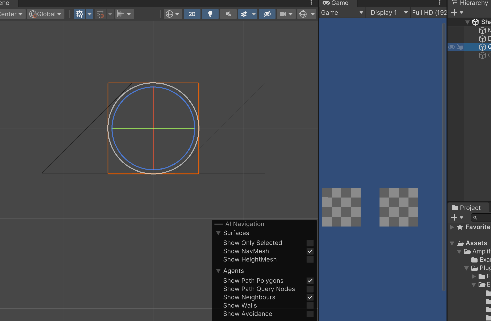
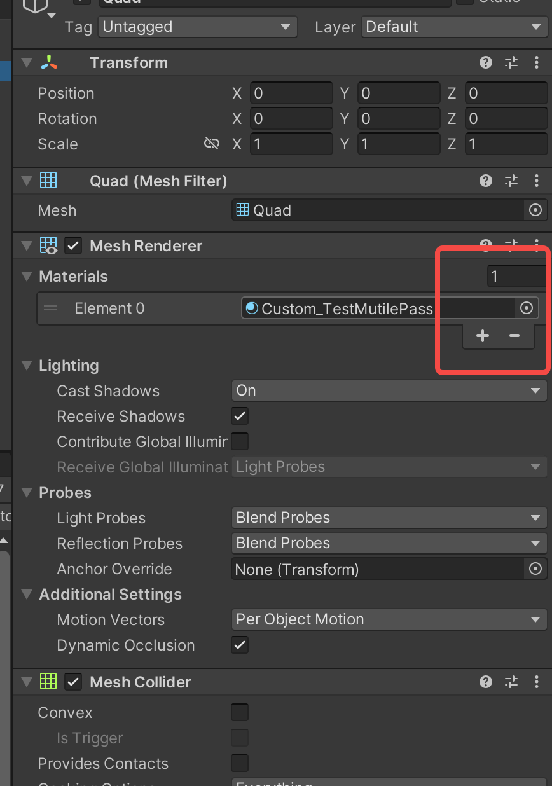
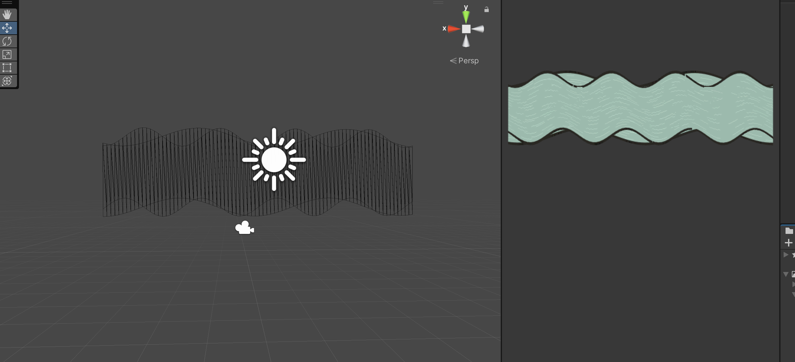
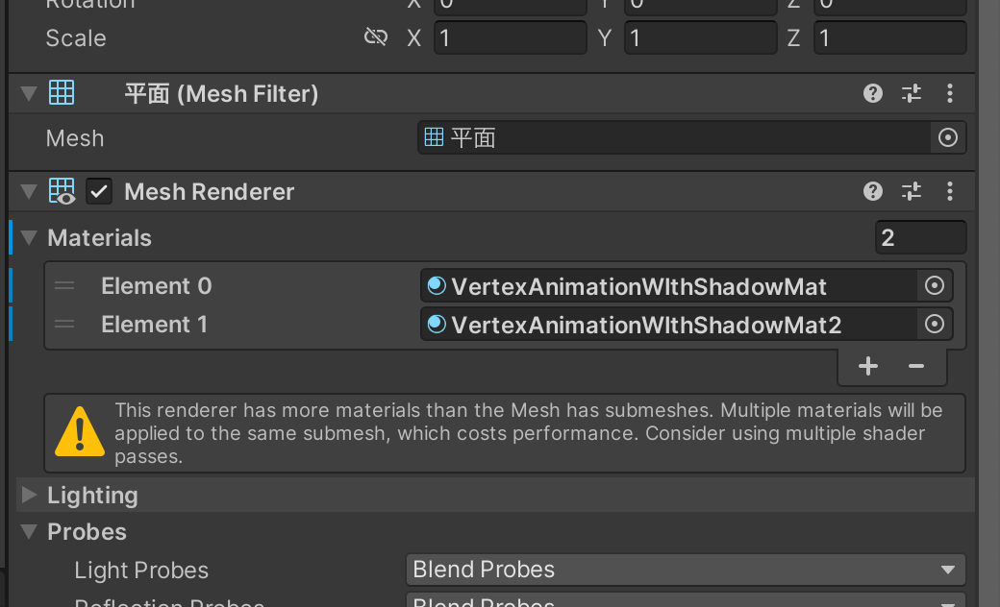
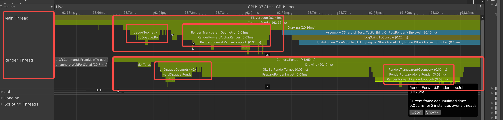

# 个人对光照模型和计算机如何显示颜色的理解


# 概念

- 前向渲染和延迟渲染
- 如何计算环境光? 环境光和albedo之间的关系是怎样的?

# CPU和GPU的关系

> 这里我想到了CPU和GPU之间的角色关系很像幼儿园或者小学一二年级里老师和小朋友在玩问答游戏，老师发问 “一加一等于几？” “二乘二等于几？” 小朋友们要回答“二！”“四！”。老师（CPU）负责提供 运算数（网格顶点信息）和运算式（Shader）而小朋友（GPU）需要做的是把老师给的题目解答出来就可以了。

# 关于多Pass
在本书的第八章透明效果中第一次遇到了多Pass的概念，笔者在学习多Pass的过程中产生了很多疑惑，直到第十二章笔者的疑惑才得以解答。
首先为什么Shader中需要多Pass的存在？在本书第三章介绍SubShader的时候提到了每一个Pass都会完整地走一遍GPU的流水线。笔者无法理解同一份顶点数据是如何能够在GPU中经过多个Pass处理表现出多个效果的。比如说，有一个包含有两个Pass的Shader，第一个Pass在顶点着色器中进行了顶点向左偏移的操作，第二个Pass在顶点着色器中进行了顶点向右偏移的操作。最终表现的效果是怎么样的呢？笔者自己写了一段Shader验证一下：

```
Shader "Custom/TestMutilePass"
{
    Properties
    {
        _MainTex ("MainTex", 2D) = "white" {}
        _InvWaveLength ("Distortion Inverse Wave Length", Float) = 10
    }
    
    SubShader
    {
        
        CGINCLUDE

        #include "UnityCG.cginc"
        #include "Lighting.cginc"

        sampler2D _MainTex;
        float _InvWaveLength;
        float4 _MainTex_ST;

        struct a2v
        {
            float4 vertex : POSITION;
            float4 texcoord : TEXCOORD0;
        };
        
        struct v2f
        {
            float4 position : SV_POSITION;
            float2 uv : TEXCOORD0;
        };
        
        fixed4 frag(v2f i) : SV_TARGET
        {
            float4 color = tex2D(_MainTex, i.uv);
            return color;
        }
        
        ENDCG
        
        Pass
        {
            CGPROGRAM

            #pragma vertex vert;
            #pragma fragment frag

            v2f vert(a2v v)
            {
                v2f o;

                float4 offset;
				offset.yzw = float3(0.0, 0.0, 0.0);
				offset.x = _InvWaveLength;
            
                o.position = mul(unity_MatrixMVP, v.vertex + offset);
                o.uv = v.texcoord.xy * _MainTex_ST.xy + _MainTex_ST.zw;;
            
                return o;
            }
            
            ENDCG
        }
        
        Pass
        {
            CGPROGRAM
            
            #pragma vertex vert;
            #pragma fragment frag

            v2f vert(a2v v)
            {
                v2f o;

                float4 offset;
				offset.yzw = float3(0.0, 0.0, 0.0);
				offset.x = _InvWaveLength;
            
                o.position = mul(unity_MatrixMVP, v.vertex - offset);
                o.uv = v.texcoord.xy * _MainTex_ST.xy + _MainTex_ST.zw;
            
                return o;
            }
            
            ENDCG
        }
    }
}
```
笔者在第一个Pass中将所有的顶点都进行了向左的偏移，在第二个Pass中将所有的顶点进行了向右的偏移。把这个Shader给到一个材质并赋给一个Quad模型，可以看到表现效果如下：

在这一个Quad上竟然生成了两个面片！也就是说在表现上，这种多Pass方式达到了和在场景中创建多个模型同样的效果。
在来看一种情况，在Unity Inspector窗口中可以看到，一个MeshRenderer上面可以挂多个材质的：

那我们就在Quad模型上多挂几个看看，然后你就可以看到，在场景中虽然只有一个Quad模型，但是实际上你却能看到四个Quad模型在场景中！

下面这张图使用的是本书中第十一章模拟河流的Shader，可以看到确实达到了“分身”的效果。

到这为止，Unity多Pass的理解就基本清晰了：在显存中存储了模型的网格数据，每帧渲染的时候，每个Shader的每个Pass都会从显存中获取这些顶点数据，注意只是**读取**，Shader的执行不会影响存储在显存中的顶点数据，所以说，一个Shader的多个Pass只是都恰好读取了一模一样的顶点数据，各自执行的时候都操作各自的**临时数据**互不影响，最终渲染到屏幕上的时候也是各自渲染各自的，这真的挺奇妙的，使用多Pass和使用多个Material能够达到相同的效果，看起来Unity官方更加推荐使用多Pass的效果，这种方式更加节省性能。

在本章介绍高斯模糊实现方式中，作者使用到了RenderTexture，RenderTexture搭配多Pass使用还是挺巧妙的，因为它做到了**上一个Pass输出的RenderTexture的结果作为下一个Pass的输入**。这一点在非RenderTexture的应用上给笔者造成了困惑，这和直接把多Pass的Shader挂在一个模型上每个Pass各自渲染各自的情况是不一样的，比如上面的Quad实验。在非RenderTexture的应用中，笔者能想到的多Pass的应用是用来显示模型的外轮廓线，至于还有什么多Pass的应用场景，笔者在这里就不再脑力风暴了。

# Unity的OnRenderImage接口

> 在一帧中，CPU并不是一次性把这一帧所有的渲染命令打包提交给GPU进行渲染的，而是逐步提交的。

OnRenderImage接口的官方描述如下：Unity在相机完成渲染后调用的事件函数，它允许你修改相机的最终图像。(Event function that Unity calls after a Camera has finished rendering, that allows you to modify the Camera's final image.)

首先介绍一下Profiler中CPUUsage模块TimeLine窗口中MainThread和RenderThread的含义

- MainThread : This is where all of the game logic/scripts perform their work by default and where the majority of the time is spent for features and systems such as physics, animation, UI, and rendering
- RenderThread : During the rendering process, the main thread examines the scene and performs Camera culling, depth sorting, and draw call batching, resulting in a list of things to render . This list is passed to the render thread, which translates it from Unity’s internal platform-agnostic representation to the specific graphics API calls required to instruct the GPU on a particular platform

笔者在这里只关注两个Thread与GPU相关的作用，说白了MainThread负责相机剔除、深度排序和DrawCall合并的工作，将GPU要做的事情整理成一个列表，交给RenderThread。RenderThread负责接收到来自MainThread的列表后，把这个列表中的渲染命令翻译成GPU能够理解的东西，并发送给GPU，也就是**DrawCall**。

看一下下面这张图：



由这张图推测，Unity是在调用Camera.Render中的Drawing接口中进行的CPU和GPU的通信，然后我们来看一下下面这张图：


这张图反映了`OnRenderImage`方法调用和CPU GPU通信之间的时间间隔。按照Unity官方的描述说，OnRenderImage方法的第一个source参数是当前帧这个Camera的渲染结果，也就是说GPU在这么短的时间里面就完成了这一帧中大部分场景的渲染。**笔者之前一直有误区，以为当前帧中GPU渲染的是上一帧CPU提交给GPU的命令，但其实不是，当前帧GPU渲染的就是当前帧的画面**。

## `OnRenderImage` 和 GPU 执行时机

`OnRenderImage`确实是在CPU端调用的，它是Unity渲染流程中的一个回调方法，用于处理渲染图像（通常在渲染到屏幕之前）。当你在`OnRenderImage`中调用`Graphics.Blit`时，你实际上是在创建一个命令，告诉GPU：“请按照这个材质（和它的Shader）处理这个纹理，然后输出到另一个纹理上。”

这些命令会被Unity渲染引擎收集起来，然后在适当的时候一起发送给GPU。GPU收到这些命令后，会按照指令执行渲染操作。这个过程确实不是立即发生的，而是在CPU端的所有渲染相关命令都提交给GPU之后，GPU才开始执行这些命令。这意味着，`Graphics.Blit`调用发生时，并不会立即执行Shader效果，而是稍后在GPU的渲染队列中执行。

另外，当前实现屏幕后处理的效果使用的都是CommandBuffer了，比如Unity官方的屏幕后处理的库。OnRenderImage已经很少使用了。

# Shader变体参考资料

- https://www.bilibili.com/video/BV1P44y1V7bu/?spm_id_from=333.999.0.0
- https://www.bilibili.com/video/BV1PG411G7DR/?spm_id_from=333.337.search-card.all.click&vd_source=83f4165825ce9df46cf4fd576ccb1102
- https://blog.csdn.net/qq_36383623/article/details/103327389

# 一个有六个面的立方体模型 为什么一张贴图会按照某种规则贴在六个面上?

# UnityShader中常用头文件、常用方法、常用宏

- UnityCG.cginc
- AutoLight.cginc
- Lighting.cginc
- UNITY_LIGHT_ATTENUATION 
- SHADOW_ATTENUATION 
- SHADOW_COORDS
- TRANSFER_SHADOW

- SHADOW_CASTER_FRAGMENT 在`LightMode`为`ShadowCaster`的Pass的`frag`中使用,用来实现阴影投射的功能,它用来处理物体的深度信息,然后将该深度信息传递给阴影映射纹理,从而让其他物体根据这个阴影映射纹理计算出自身是否处于该物体的阴影中.简单来说,它用来帮助物体在场景中正确地投射出阴影.
- TRANSFER_SHADOW_CASTER_NORMALOFFSET 用于在阴影投射的过程中,在顶点着色器里对相关数据进行处理和传递.具体而言它会处理顶点的位置信息以及法线偏移信息,并且将这些数据传递给frag着色器,为后续将物体的深度信息正确写入阴影映射纹理做准备.
- clip
- tex2D
- UnpackNormal 是Unity Shader用来从切线空间下读取被标记为`NormalMap`的Texture中读取法线信息的方法.
- normalize
- smoothstep
- pow
- step
- multi_compile_shadowcaster
- LightMode
- CGINCLUDE CGPROGRAM
- ObjSpaceLightDir
- GrabPass


# 问题记录

## 什么是切线空间? 为什么需要切线空间? 
https://www.bilibili.com/video/BV1cq4y1R7wu/?spm_id_from=333.880.my_history.page.click&vd_source=83f4165825ce9df46cf4fd576ccb1102
## 为什么在切线空间下的法线纹理看起来都是浅蓝色的?

## 为什么要用切线空间存储法线信息 和物体空间下相比各自有什么优缺点?

## 阴影是如何产生的?

所有物体的深度信息会被存入一个深度纹理或者叫阴影纹理中, 要投射阴影的物体向这个纹理中写入深度信息,需要接收阴影的物体从这个纹理中读取阴影信息.

Tag中`LightMode`为`ShadowCaster`的Pass中的代码生效,要求挂载该Shader的MeshRenderer把`CastShadows`选项打开.

## 两个Pass公用代码

Unity Shader中可以使用`CGINCLUDE`的方法将一些数据结构、字段在不同的Pass中共享

## 模型的数据结构中会存有每个顶点的法线信息,法线贴图中的法线信息又是用来干什么的?   


## Unity中有几种Shader?区别是什么?


- Standard Surface Shader
- Unlit Shader
- Image Effect Shader
- Compute Shader
- Ray Tracing Shader

## Unity Shader是怎么被收集然后打进包内的？

