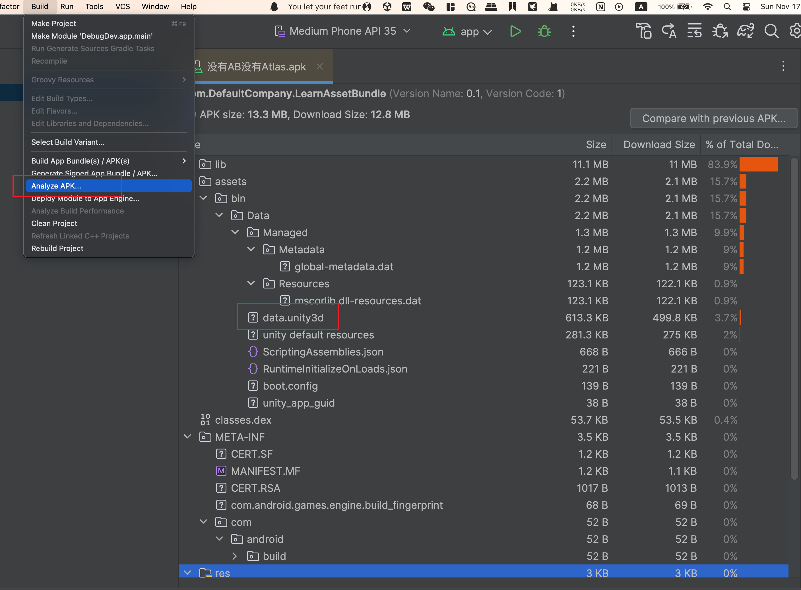

包体优化属于项目资产清理导致的一个结果,

# 什么操作会影响包体

# 包体构成

使用AndroidStudio中的`Build -> ApkAnalyzer`来对包体内容进行分析，可以看到安卓包内的基本结构如下：

Resources目录下的文件都会被打包进`assets/bin/Data/data.unity3d`文件中，游戏启动的时候会一次性把这个文件加载到内存中，因此应该要尽可能地减小放在resources目录下的文件体积。

# libil2cpp.so内容分析

https://blog.csdn.net/linxinfa/article/details/116572369

# AssetRipper使用

AssetRipper的GitHub链接👉👉👉 https://github.com/AssetRipper/AssetRipper

下载到本地解压后在根目录打开终端，运行`./AssetRipper.GUI.Free`在浏览器中启动。

UnityResources目录下的内容都被打包进了一个unity_3d的目录下，

# AssetBundle打包问题

# 资源冗余

Unity的加载是以AssetBundle为单位的.

如果两个ab A和B中的一些资源都依赖了一个没有被指定要打包的资源C，那么C就会同时被打进ab A和B中，造成资源的冗余，增大ab和安装包的体积。而这个被A，B依赖的资源C又可以分为两种类型，一种是Assets下外部导入的资源，即开发者导入或创建的资源；另一种则是Unity内置的资源，例如内置的Shader，Default-Material和UGUI一些组件如Image用的一些纹理资源等等。因此要解决资源冗余的问题，就要分别对这两种被依赖的资源进行处理。

冗余打包的原因是因为该资源没有被指定打到哪个包内，所以遍历所有的资源，找到所有资源的依赖关系，并找到这些没有被显示指定打到哪个AssetBundle的资源，打印出Log

