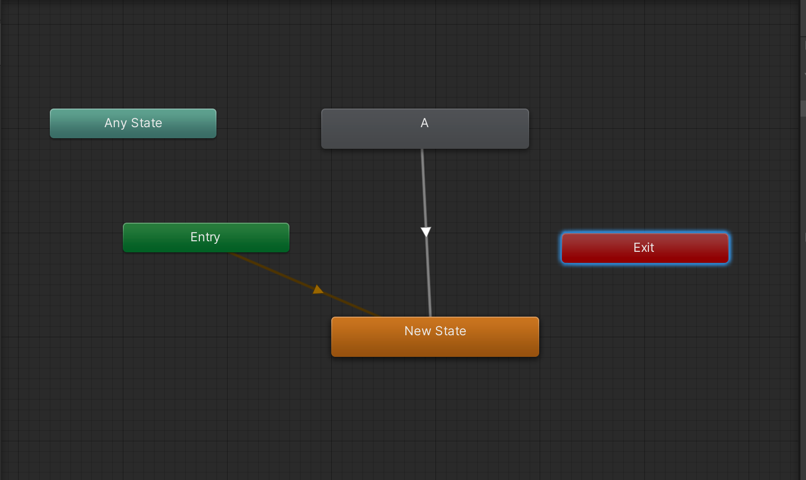
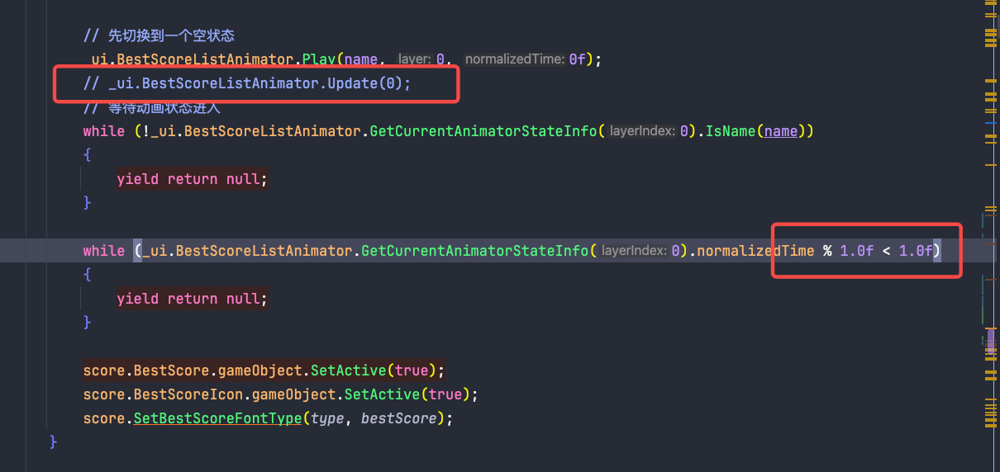

> 本篇博客记录笔者在Unity开发中遇到的各种小问题，有可能是Unity奇怪的bug、Unity Editor的使用小技巧或者是一些不值得开一篇新博客的小知识点

# Unity Scriptable Object踩坑

下面是一个名为`EntityBaseProperty.cs`的脚本，但是在创建一个`PlayerEntityProperty`SO的时候会提示你找不到这个脚本。你必须让脚本的名字和SO的类名保持一致，所以每一个SO都要新建一个和SO类命一样的脚本来写。
```C#
public class EntityBaseProperty : ScriptableObject
{
    
}

[CreateAssetMenu(fileName = "PlayerEntityProperty", menuName = "CreatePlayerEntityProperty", order = 0)]
public class PlayerEntityProperty : CharacterProperty
{
    
}

```

# Unity项目代码正常运行但是在Rider中大量报红

Rider的`solution wide analysis`组件有问题，在Unity的`Settings -> External Tools -> Regenerate project files`解决。


# AssetDataBase接口使用遇到的坑

`AssetDatabase.Refresh`方法用于刷新Unity编辑器的资产数据库。这个方法会同步磁盘和Unity编辑器之间的资产状态，包括添加、删除、修改文件等。如果你在Unity编辑器外部（比如在文件浏览器中或通过脚本）对项目中的文件进行了更改，使用AssetDatabase.Refresh可以让Unity编辑器识别这些更改。

`AssetDatabase.SaveAssets`方法用于将所有未保存的资产更改持久化到磁盘。这包括对预制体、场景、材质等任何在编辑器中做出的更改。如果你在脚本中修改了任何资产（比如更改了一个材质的颜色，或者添加了一个新的游戏对象到一个预制体中），并且想要确保这些更改被保存，就需要调用这个方法。

1. 脚本中修改完资源里面的属性的时候，调用一次AssetDataBase.Save() 必须要在AssetDataBase.Load()方法之间调用，不然修改就白做了
2. File接口相关的操作Directory相关的操作后必须后面跟一个AssetDataBase.Refresh调用

`AssetDatabase.MoveAsset`调用的时候,如果目标位置的路径不存在的话移动Asset的操作是不会成功的.会提示你`Could not find parent directory GUID`,所以在移动Asset之前需要先确定目标路径是否存在,你可以使用`AssetDataBase.CreateFolder`接口来创建目标路径,或者使用`Directory`相关接口来创建,注意使用`Directory`接口创建路径后需要调用`AssetDatabase.Refresh`接口来同步

# GetComponentsInChildren接口

GetComponentsInChildren方法中要一个参数，这个参数的作用是是否包括处于非激活状态的节点，默认是false

# GetComponentInParent接口

GetComponentInParent方法中要一个参数，这个参数的作用是是否包括处于非激活状态的节点，默认是false

# DoTween

DoTween不仅可以用来做动画，也可以实现音频减弱、图片的渐显操作。

# Spine动画的使用

Spine动画有一个专门针对UI的组件叫做SkeletonGraphic，SkeletonGraphic组件是基于UICanvas绘制的，因此它的渲染层级可以被Canvas管理
另外还有专门为非UI播放动画的SkeletonAnimation组件，该组件的渲染是基于MeshRenderer的，因此不受Canvas的管理，当要在UI上展示Spine动画的时候，要选择使用SkeletonGraphic组件。

SkeletonGraphic相关接口
```
// 停止当前正在播放的动画
// heartBeatFlower.AnimationState.ClearTrack(0);    
heartBeatFlower.AnimationState.SetEmptyAnimation(0,0); 
// 播放新的动画
heartBeatFlower.AnimationState.SetAnimation(0, "chufa", false);  
```
> 2024.11.8更新
> 使用SkeletonGraphic.AnimationState.ClearTrack(0)遇到坑了，目前笔者还不清楚Spine的作用原理，从表现上看，调用该接口会将Spine动画从轨道上移除，之后想要再次播放该动画的话就无法在轨道上找到这个动画，所以如果有切换播放动画的需求，只需要调用heartBeatFlower.AnimationState.SetAnimation(0, "chufa", false);  就可以了

SkeletonAnimation相关接口
```
// 停止当前正在播放的动画
heartBeatFlower.state.SetEmptyAnimation(0,0);            
// 播放新的动画
heartBeatFlower.state.SetAnimation(0, "loop", true);  
```

# Animator使用

Animator中必须设置一个从Entry进入的默认状态，这个从Entry进入默认状态的操作会在Animator所挂载的游戏物体的Active状态变为true或者Animator组件自身的enable状态变为true的时候自动执行，无法控制。如果在默认状态设置了某些动画，在其他开发同事不知情的情况下设置了这个Animator节点的Active状态，就会导致动画的自动触发，可能会给别人留坑。更好的使用Animator的方法是将默认状态设置为一个空状态。让真正的动画状态指向默认状态，如下图：



在我们需要播放动画的时机可以通过[`Animator.Play()`](https://docs.unity3d.com/cn/current/ScriptReference/Animator.Play.html)接口，并且在动画播放完之后会自动的进入默认状态，这样的好处是不用通过控制Active状态来控制动画的播放，而且在代码中我们也是通过`Animator.Play`接口控制动画的播放，比通过Active状态来控制的方法更让人知道这行代码在做什么。

接口的具体参数如下，其中第三个参数normalizedTime是一个归一化的时间，[0,1]指从动画的什么时刻开始播放
```
public void Play (string stateName, int layer= -1, float normalizedTime= float.NegativeInfinity);
public void Play (int stateNameHash, int layer= -1, float normalizedTime= float.NegativeInfinity);
```
> 2024.12.18更新
> 最近尝试了一种新的延时方法,以前在处理当某一动画播放完毕后,执行一段逻辑的时候,都是用
> 下面这两种方法都可以对当前的Animator播放动画的normalizedTime做调整
> 
> 2025.6.18更新
> 更健壮的版本 TODO Eddie 这个问题能不能抽成
```C#
m_ddz_zhounianqing_JY12_zhuanchang_GameObject.SetActiveEx(true);
yield return null;
m_ddz_zhounianqing_JY12_zhuanchang_Animator.Play("ddz_jiyang_12nian_zhuanchang", 0, 0);

// 等待进入动画状态
float waitAnimStateTimeout = 2f, timer = 0f;
while (!m_ddz_zhounianqing_JY12_zhuanchang_Animator.GetCurrentAnimatorStateInfo(0)
            .IsName("ddz_jiyang_12nian_zhuanchang"))
{
    yield return null;
    timer += Time.deltaTime;
    if (timer > waitAnimStateTimeout) {
        QDebug.LogError("动画没有切换到目标状态！");
        break;
    }
}

// 等待动画非循环情况下正常播放结束
timer = 0f;
float waitAnimPlayTimeout = 10f;
while (m_ddz_zhounianqing_JY12_zhuanchang_Animator.GetCurrentAnimatorStateInfo(0)
            .normalizedTime < 1.0f)
{
    yield return null;
    timer += Time.deltaTime;
    if (timer > waitAnimPlayTimeout) {
        QDebug.LogError("动画播放超时，可能动画clip循环/没切到/速度很慢！");
        break;
    }
}
QDebug.Log("转场结束");
m_ddz_zhounianqing_JY12_zhuanchang_GameObject.SetActiveEx(false);
```

# Animation体积优化的问题
https://blog.uwa4d.com/archives/UWA_Pipeline22.html


# DOTweenAnimation组件使用

DOTweenAnimation组件挂载在节点上，调用播放的时候只播第一次，之后不播了，需要搞清楚为什么

# 协程的坑

- 协程中的等待一秒并不是真正的一秒有可能会有误差
- 提示要执行Coroutine的物体的状态是inactive的
一个GameObject,在同一帧内,先被SetActive了,然后紧接着用这个GameObject上的一个Mono执行StartCoroutine,会提示GameObject无法被执行,验证是否是这样的.

# Unity的Animation的使用的坑

Animation中有一个Legacy字段，如果不勾选这个选项，在Animation中是没有办法通过Animation.Play()接口播放该动画的。
有兴趣可以做一个实验，创建一个勾选了Legacy和一个未勾选Legacy的动画，将这两个动画都添加到一个Animation组件上。在代码中获取这个Animation组件的引用，调用`Animation.GetClipCount()`接口得到的值为2，但是如果使用`foreach(AnimationState state in Animation)`去遍历却只会遍历到勾选了Legacy的AnimationClip

# XML文件读取逻辑

定义需要从XML中读取的数据结构

```C#
[XmlRoot("AssetBundleConfig")]
public class AssetBundleConfig
{
    public List<BundleRule> Bundles;
    
    public List<AtlasRule> Atlas;
}


public class BundleRule
{
    public string Relative;
    public string Path;
    public string Type;
    public bool Recursion;
}

public class AtlasRule
{
    public string Path;
    public bool Recursion;
}
```
定义XML文件内容
```xml
<?xml version="1.0" encoding="utf-8" ?>
<AssetBundleConfig xmlns:xsi="http://www.w3.org/2001/XMLSchema-instance"
                   xsi:noNamespaceSchemaLocation="AssetBundleConfigSchema.xsd">
    <!--带有平台名称的bundle只会出现名称所代表的平台-->
    <Bundles>
        <BundleRule name="Art_Animation">
            <Path>Assets/Art/Animation</Path>
            <Type>SubFolder</Type>
            <Recursion>false</Recursion>
        </BundleRule>

        <BundleRule name="Art_Audio">
            <Path>Assets/Art/Audio</Path>
            <Type>None</Type>
            <Recursion>false</Recursion>
        </BundleRule>

        <BundleRule name="Art_CustomShaders">
            <Path>Assets/Art/CustomShaders</Path>
            <Type>None</Type>
            <Recursion>false</Recursion>
        </BundleRule>

        <BundleRule name="Art_Fonts">
            <Path>Assets/Art/Fonts</Path>
            <Type>None</Type>
            <Recursion>false</Recursion>
        </BundleRule>
        
        <BundleRule name="Art_Fonts8x8">
            <Relative>Assets/Art/Fonts</Relative>
            <Path>Assets/Art/Fonts/Fonts8x8</Path>
            <Type>SubFolder</Type>
            <Recursion>true</Recursion>
        </BundleRule>

    </Bundles>
    
    <Atlas>
        <AtlasRule name="Art_Atlas">
            <Path>Assets/Art/Texture/Atlas</Path>
            <Recursion>true</Recursion>
        </AtlasRule>
    </Atlas>
</AssetBundleConfig>
```

C#脚本读取该XML文件
```C#
public static T LoadXmlConfig<T>(string path) where T : class
{
    XmlSerializer xmlSerializer = new XmlSerializer(typeof(T));
    T result;
    using (var reader = XmlReader.Create(path))
    {
        result = (T) xmlSerializer.Deserialize(reader);
    }

    return result;
}
```
调用时只需要把`AssetBundleConfig`作为T传入该方法，就可以返回XML的内容


# 写一个假的进度条

```C#
using System;
using UnityEngine;
using UnityEngine.UI;

namespace UI
{
    public class LoadingUICartoon : LoadingUI
    {
        [SerializeField] private Text progressText;
        
        private float currentValue = 0f; // 当前值
        private float targetValue = 100f; // 目标值
        private float speed = 1f; // 增长速度
        private bool endLoading = false;
        
        protected override void Start()
        {
            canvas.sortingLayerID = R.SortingLayers.Default;
            progressText.text = "0%";
        }

        private void Update()
        {
            if (endLoading)
            {
                return;
            }
            
            // 使用指数衰减的方式逐渐接近目标值
            currentValue += (targetValue - currentValue) * speed * Time.deltaTime;

            // 更新Text组件的显示内容
            progressText.text = Mathf.FloorToInt(currentValue).ToString() + "%";
        }

        public void SetProgress(float progress)
        {
            endLoading = true;
            progressText.text = progress.ToString("0") + "%";
        }
        
    }
}
```

# Unity中对导入的资产进行自动化的导入格式设置


# Unity预制体中的Image组件内容不显示

https://blog.csdn.net/WGYHAPPY/article/details/116161817

# 使用摄像机渲染一个RenderTexture 以及 我想要把一个Canvas放到世界坐标下,即不会在上层嵌套一个UICanvas

https://blog.csdn.net/qq_37179591/article/details/118148818

# Mac下如何打出乘号
https://www.zhihu.com/question/20367435

# 查询资源引用

对该工具进行扩充, 变成一个资产库工具, 能够方便开发者快速的管理资源
见[GitHub](https://github.com/SoIncredible/UnityUtils)工具库
Unity插件[FR2](https://docs.google.com/document/d/1M3drHsRSCNKk-colYnCYECM_TR2XgtGB_8GFc_La19E/edit?tab=t.0#heading=h.z6ne0og04bp5)

# Unity中合并两个Mesh

https://blog.csdn.net/qq_42980269/article/details/123064307

# 在Unity工程中使用相对路径

如果你在C#中看到这样的目录:` configFilePath = $"../Config/Excel/s/{Options.Instance.StartConfig}/{configType.Name}.bytes"; `,它代表的是跟Unity工程的根目录同级下有一个Config目录:
```
Root
 - Unity工程目录
 - Config目录
```
所以如果你要使用AssetDataBase加载某一个资源的话,资源的路径一定是"Assets/.."起手的

# Unity关闭自动编译

在2020.3.48f1中`Preference`->General一栏中取消勾选`Auto Refresh`,但是在2022.3.15f1版本中笔者并没有找到该字段. 


# Unity中安装的NuGet包
一般来说, Unity中能安装的库, 使用UnityPackageManager就都能安装上, 用不到NuGet的, 
有些包找不到并不是PackageManager不全 更有可能是Unity支持的.Net版本太低, 你想接的库, 根本就没有兼容这个版本

另外还需要注意Unity对C# Language脚本语言版本的支持情况(https://docs.unity3d.com/cn/current/Manual/CSharpCompiler.html)

# Unity安装Newtonsoft.Json库

https://github.com/applejag/Newtonsoft.Json-for-Unity/wiki/Install-official-via-UPM

# Unity 颜色十六进制和RGB之间的转换方式
https://blog.csdn.net/f_957995490/article/details/120727626
