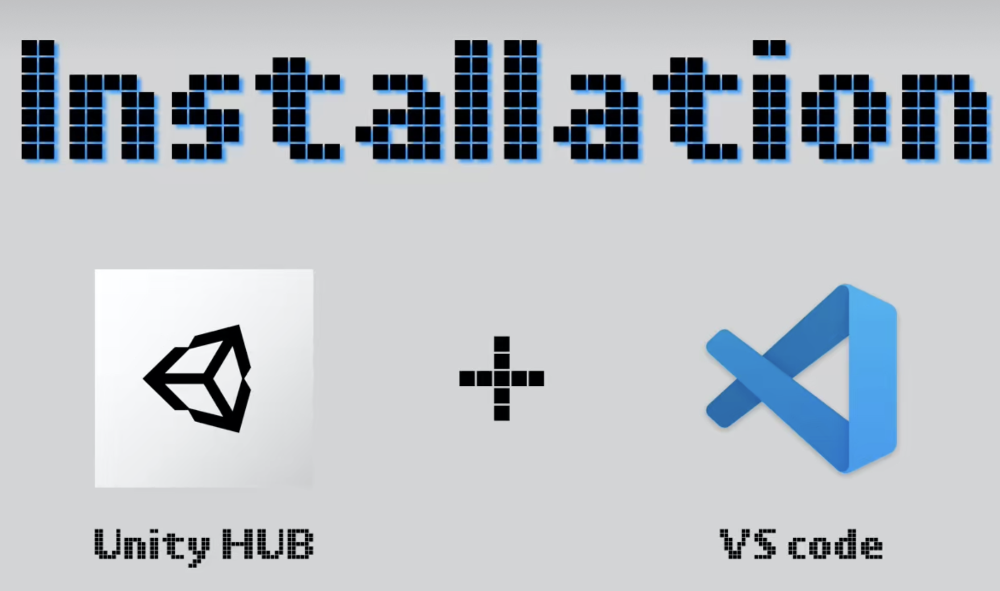
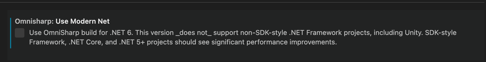
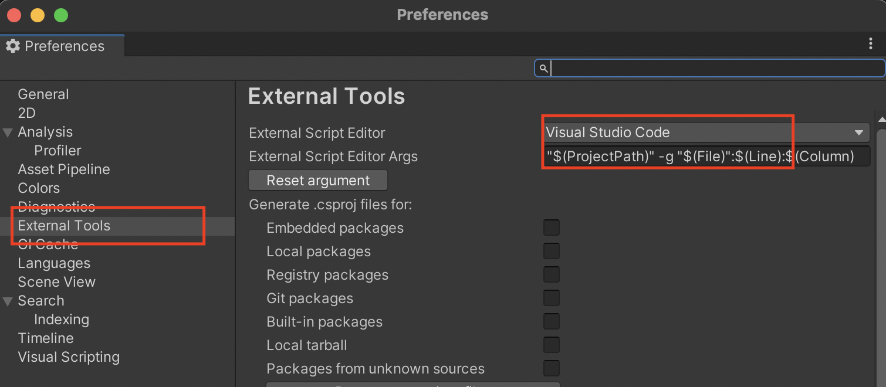

<!--more-->

[麦扣的视频链接](https://www.bilibili.com/video/BV19741167zU?spm_id_from=333.999.0.0&vd_source=83f4165825ce9df46cf4fd576ccb1102)

[VS code 官方文档](https://code.visualstudio.com/docs/other/unity)

## 前置准备 Prerequisites

1. 安装[.NET SDK](https://dotnet.microsoft.com/zh-cn/download)，执行 dotnet --version 查看是否安装成功

2. （这一步只针对Windows用户）重启Windows让更改的设置生效

3. （这一步只针对Mac用户)安装长期支持版[Mono](https://www.mono-project.com/download/stable/)，避免遇到 "Some projects have trouble loading. Please review the output for more details" 的问题 执行 mono --version 查看是否安装成功

   Note: 额外安装的这个Mono，不会干预Unity内置安装的Mono

4. 在VSCode中安装C#的扩展

5. 在VSCode的设置中，取消勾选 C# extension's Omnisharp: Use Modern Net setting("omnisharp.useModernNet" : false)

   

## 在Unity中设置VSCode为默认的脚本编辑器

选择 Unity Preferences -> External Tools，选择VSCode.

## 小结

With the solution file selected, you are now ready to start editing with VS Code. Here is a list of some of the things you can expect:

- Syntax Highlighting
- Bracket matching
- IntelliSense
- Snippets
- CodeLens
- Peek
- Go-to Definition
- Code Actions/Lightbulbs
- Go to symbol
- Hover

**巨大的坑**：我在安装完成dotnet和mono组件并且设置vscode为默认编辑器之后，在VSCode中输入rigidbody时并没有语法提示，但**耐心等待一段时间**后，语法提示就出现了……这个本不存在的问题困扰了我两天……

晚安。
