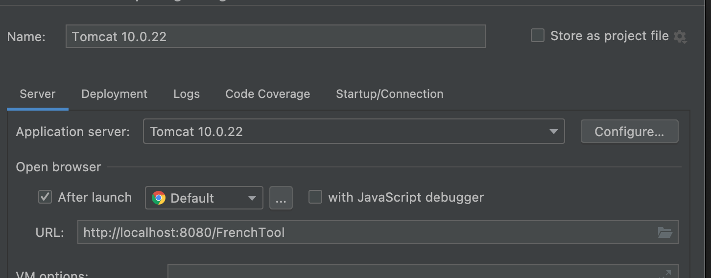
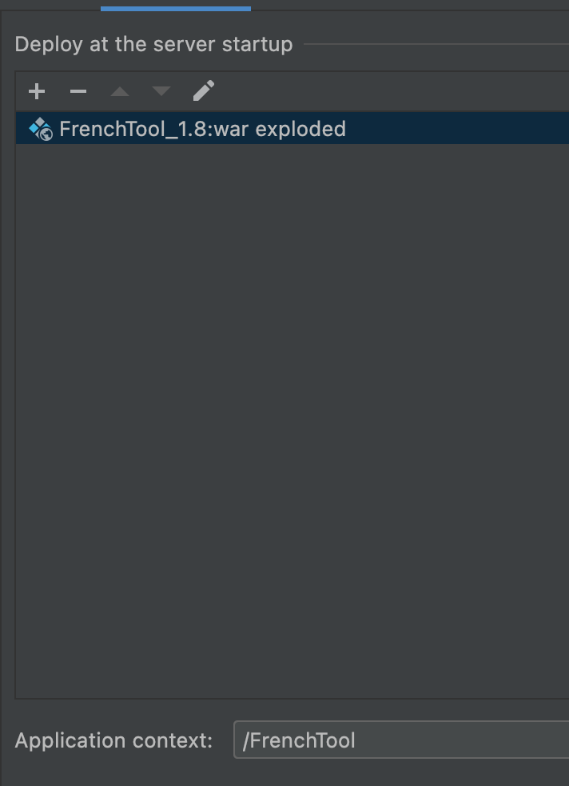
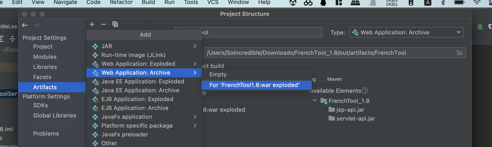
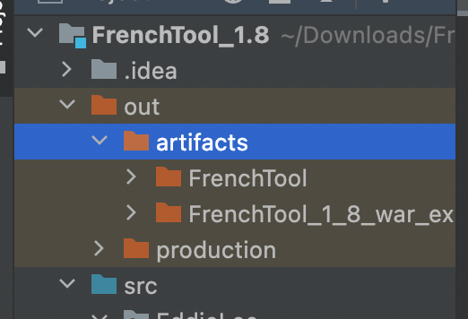
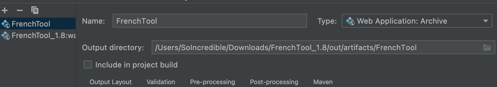

# 写在前面

在创建一个JavaWeb项目之前，有下面几点需要十分注意

1. 能够稳定运行Tomcat服务器的Java版本是1.8或者Java8
2. 自从Java8之后的Java中不再包含jre，在关闭Tomcat服务器时命令行会报错，即使手动生成jre文件夹也不管用，也访问不到界面
3. 不同的开发环境本地段和服务器端的Java版本不要差距太大，不然兼容性很差，会导致浏览器端出现500错误
4. Tomcat服务器的版本要和Java的版本相对应，否则也会报错，目前比较好的兼容版本是Tomcat10 + Java8 + Jakarta

关于创建JavaWeb的详细步骤，我已经在数据库课程设计开发记录那篇文章中做了细致的描述，本文主要的目的是记录JavaWeb开发中需要注意的问题。

# 开发中的小问题

1. 去到Tomcat的lib目录下，找到<code>jsp-api.jar</code>和<code>servlet.jar</code>两个文件，将他们添加到Project Structure -> Modules -> Dependencies中，Tomcat10使用的servlet是Jakarta的servlet，不是javax

2. 配置Tomcat运行环境，要保证Server中的URL和Deployment中的ApplicationContext的名字一样

   

   

3. <code>@WebServlet()</code>的使用，举个例子方便理解，在html或者jsp中编写如下代码：

   ```jsp
   <html>
     <head>
       
     </head>
     <body>
       <form action = "/ss">
         <input type = "submit" value = "提交">
       </form>
       
     </body>
     
   </html>
   ```

   ```java
   @WebServlet("/ss")
   public class FrenchToolServlet extends HttpServlet {
       @Override
       protected void doPost(HttpServletRequest request, HttpServletResponse response)
               throws ServletException, IOException {
         
         	// .............................
       }
   }
   ```

   在html中的<code>action</code>和Java中的WebServlet里写的地址要完全对应，反映到浏览器地址栏中的内容就是<code>域名+端口+ApplicationContex+ss</code>

4. 关于打包并发布Webapp，网上说的很玄乎，实际上很简单，在<code>ProjectStructure</code>-><code>Artifacts</code>-><code>new WebApplication:Archive</code>->为现有的exploded创建就可以了，之后点击Build Artifacts，选择刚才创建的WebApplication Archive，生成的文件存放在项目文件夹下的<code>out</code>-><code>artifacts</code>下其中一个文件夹里的war包。

   

   

5. 已经有打包出来的war包了，下面只需要将war包放到云服务器的Tomcat的webapps目录下面，启动Tomcat，War包会被自动解压出来，在启动Tomcat的前提下，在地址栏搜索<code>域名:端口/项目名/index.jsp</code>，就可以访问到页面了。这里所谓的项目名，是在add WebApplicationArchive的时候的Name，所以最后的地址就是<code>139.224.82.218:8080/FrenchTool/index.jsp</code>

   

# 总结

到此一个JavaWebapp从创建到导出的过程就完整体验一遍了，Java因为它的广泛应用性而导致了它的更新迭代快，版本多的特点，这是优点，也是缺点，在开发Java的项目是要尤为注意Java的版本是否兼容项目的需求。
