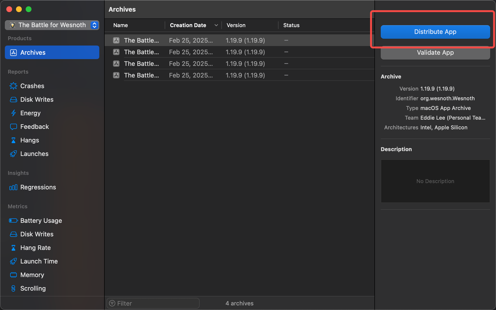
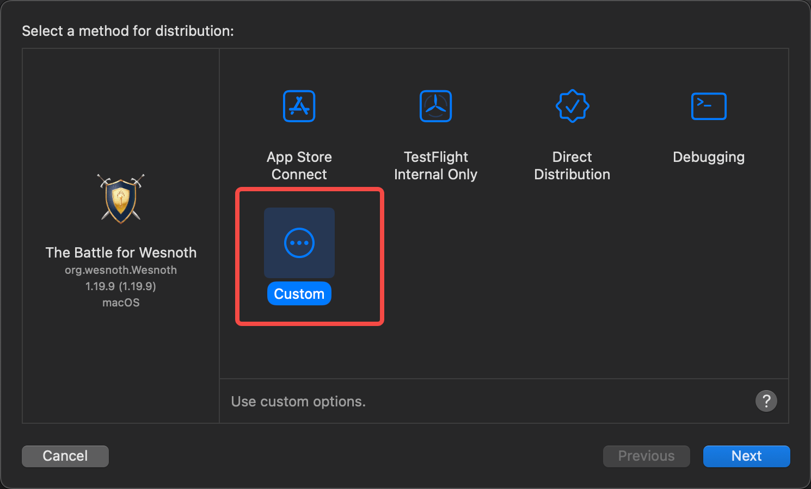
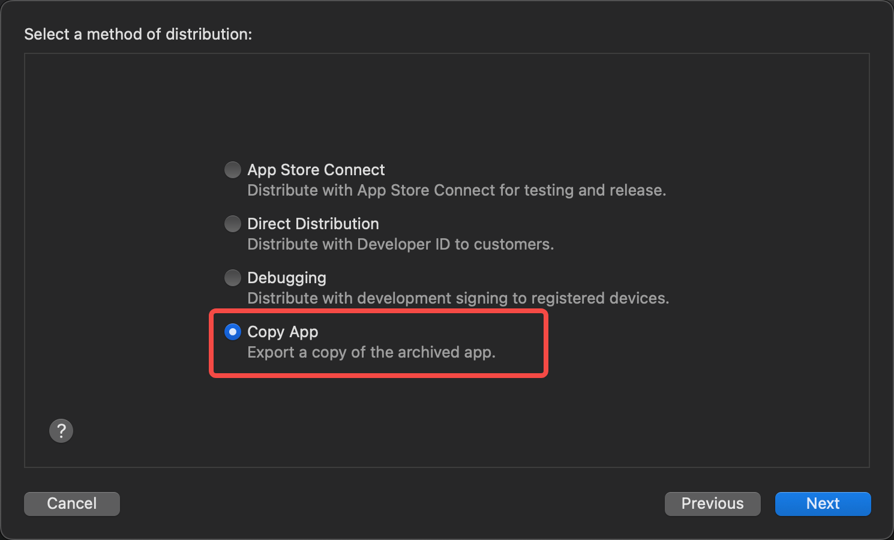

[Wesnoth社区](https://www.wesnoth.org/)
[仓库地址](https://github.com/wesnoth/wesnoth)
[WesnothDiscord频道](https://discord.com/channels/231976805987385345/channel-browser)

# 目录
- 构建Wesnoth 也就是这篇博客
- [Wesnoth中的小地图如何实现](https://soincredible.github.io/posts/9af50f63/)
- Wesnoth中的AI
- Wesnoth中的引导逻辑
- Wesnoth中的战役逻辑

> 2025.2.25更新 
> 笔者像小丑一样 尝试用Linux中的构建方式在自己的Mac上构建wesnoth 一直无法成功Build 跟各种问题缠斗了近一个月 在进行放弃前的最后一次尝试时 决定尝试一下Build文档中MacOS小结提到的使用XCodeBuild的方式构建wesnoth 不到十分钟成功了....
> 在笔者过往的经历中 Mac和Linux中构建和运行C++程序的方式是一样的 并且笔者先入为主地以为使用XCode是在Mac上要发布到AppStore、Steam或者SourceForge平台部分才会使用到的 并不是笔者目前需要Care的 笔者只需要让wesnoth的code在自己的电脑上跑起来就可以 只能说相当操蛋...
> 虽然说在Mac终端下直接使用CMake命令来尝试构建wesnoth的方式是错误的,但是在这个过程中笔者了解了一些CMake、C++构建相关的知识 本篇博客便是对这些知识的总结整理

# Mac中正确的构建Wesnoth方式

既然Build的时候用到了`XCode`,那么笔者就舍弃`VSCode`直接使用`XCode`开发了.
- 首先确保wesnoth中需要的所有依赖都已经安装好,所有的依赖都可以使用`homebrew`快速安装
- 准备一个[Apple开发者账号](https://developer.apple.com/) 不需要`enroll app store`如果你只是希望在自己的电脑上build和运行wesnoth
- 根目录下执行`scons translations`(看起来是一个执行翻译的命令 执行一次就好)
- 执行成功后,找到项目中的`projectfiles/Xcode/The Battle for Wesnoth.xcodeproj`,打开XCode
- 在XCode的菜单栏中,找到`Product`->`Archive`,XCode就开始构建wesnoth了
- XCode构建成功之后,应该会自动弹出`Organizer`窗口,在窗口中选择`DistributeApp`


选择`Custom`

选择`Copy App`

最后选择导出位置,完成Wesnoth的build.
# Mac中的环境变量

笔者在按照[INSTALL](https://github.com/wesnoth/wesnoth/blob/master/INSTALL.md)部分在M1系列芯片的Mac上使用homebrew安装好了wesnoth依赖的所有lib, 但是通过CMake build的时候却还是提示有这样那样的lib未找到、这样那样的头文件没有找到.** 笔者并不清楚中间是什么环节出了问题, 在此先进行记录, 日后若有思路再回来补充**.

首先, 笔者的假设是, 官方编写的CMake构建脚本是没有问题的, 问题出在了笔者的环境配置上, 在安装完wesnoth需要的库之后,需要在终端执行以下命令:
```
export LIBRARY_PATH=/opt/homebrew/Cellar/boost/1.87.0/lib:/opt/homebrew/lib:$LIBRARY_PATH
export CPATH=/opt/homebrew/include/harfbuzz:/opt/homebrew/Cellar/boost/1.87.0/include/boost:$CPATH     
```                
# Undefined symbols for architecture arm64

```
Undefined symbols for architecture arm64:
  "Hello()", referenced from:
      _main in test_charconv.cpp.o
ld: symbol(s) not found for architecture arm64
c++: error: linker command failed with exit code 1 (use -v to see invocation)
make[2]: *** [test_charconv] Error 1
make[1]: *** [CMakeFiles/test_charconv.dir/all] Error 2
make: *** [all] Error 2
```
出现如下报错的原因: 方法只有声明 但是没定义 于是在链接阶段的时候 编译器找不到方法的具体实现而报错. 有可能是你在头文件中定义的方法名和在cpp文件中的具体实现名不一样.

# C++中的.o文件

https://www.cnblogs.com/eyeofbajie/p/16303580.html

# CMake中常用的方法

CMake中执行表示执行编译的方法是什么?

别的CMake方法先不管,笔者比较关心find_package方法背后的实现原理

https://stackoverflow.com/questions/75536743/how-to-fix-undefined-symbols-for-arm64-when-using-boostfilesystem-on-m1-macboo