# 2023.7.11更新

经过了一段时间在工作中对版本管理工具的使用，我对Git有了更深刻的了解，之前的学习Git使用的方法十分地笨拙，因为对于很多的使用场景都没有概念，只会照抄官网上的文档。而且当时还是单纯地使用git命令行来进行操作，过程十分低效。因此这一次博客更新我将会结合具体的工作场景和Source Tree的图形化界面来说明我们在使用git管理项目时的一套流程规范，流程中的每一个环节我尽量详细阐述，我会演示每个环节如何使用命令行完成，对应地，我也会演示如何使用Source Tree的图形化界面来达到同样的效果。我还有[另外一篇]()文章介绍了我使用Git和Source Tree管理Unity项目中的时候遇到的问题、解决办法，以及一些shell编程相关的知识。

当然，在你看这一部分内容之前，希望你能够对git现有一个基本的了解，比如常用的`git add`、`git commit`、`git push`命令，这部分基础的内容可以点击[此处](#git基础)去到本篇博客内对应的部分

## 创建Git仓库

我认为在工作中使用Git的意义有两点：1.它帮助我轻松地实现版本管理；2.通过版本管理我可以将我的仓库上传到云端，实现多端同步开发。上传云端是一个很有必要的操作，它最大的意义在于数据备份，当我们本地的数据彻底丢失了之后我们还有挽回的机会。我们可以在自己的云服务器上创建Git仓库管理我们的项目，也可以将项目部署到[`github`](https://github.com/)、[`gitee`](https://gitee.com/)、[`bitbucket`](https://bitbucket.org/)这一类代码托管平台上，在不考虑自己搭建云服务器的情况下，在国内我们还是首选[`gitee`](https://gitee.com/)，其他两个平台的访问速度实在是太慢了，会大大拖慢我们的开发效率。

以上是我对于使用Git的理解。而在创建仓库前，我们首先要明确我们需要管理的是哪些文件，即我们要生成`.gitignore`文件忽略掉那些我们不需要管理的文件；另外，我们最好也要为我们的项目添加一个`README`的`markdown`类型的文件来介绍一下我们自己的项目。<span id = 2>如果不理解这两个文件作用的同学可以点[这里](#1)跳转到相关的介绍部分。</span>

### 使用命令行初始化仓库

我们需要在本地和远端都创建仓库，然后将这两个仓库连接起来。

我们**首先**创建本地，仓库在我们项目工程的根目录下，在终端中输入`git init`来初始化仓库。**注意：**文件夹的**根目录的名字必须和远端仓库的名字**一致，并且**绝对不要带有空格**，如果名字需要有多个单词的话可以使用`-`号或者`_`下划线来分割单词，因为如果单词之间有空格的话我们使用命令行执行和路径相关的命令的时候会很不方便。比如现在我们要创建一个名字叫做Starry Town的文件夹，我们可以使用Starry-Town或者Starry_Town的格式来创建。

### 使用Source Tree初始化仓库

打开Source Tree，点击`克隆/新建`，选择`Create`，填入你要管理的工程的根目录和文件夹根目录的名字之后，点击创建即可完成创建。

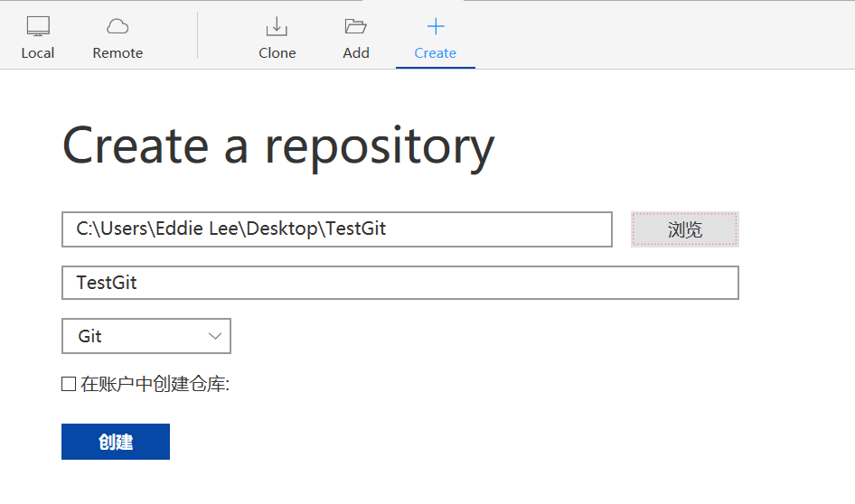

**紧接着**我们需要在仓库的根目录下创建两个文件：`.gitignore`和`README`文件。

**然后**我们在云端创建一个和本地文件夹同名的仓库，因为我们已经在`git init`之后紧接着创建了`README`文件和`.gitignore`文件，我们不需要勾选创建`README`和`gitignore`文件的选项。由于每次都要手动创建这两个文件比较麻烦，所以我们可以自己写一个终端命令的方式来自动创建这两个文件。具体操作方法在[这篇]()博客中。不过我建议你还是先继续往下看，理解了整个流程之后，再去了解如何提高版本管理的效率。

## 第一次提交

我自己的习惯是在创建并将`.gitignore`和`README`文件中的内容编写妥当后先完成第一次提交，因为我们在本地完成了第一次提交之后紧接着会将第一次提交推送到远端仓库，注意在这一小节我们只是完成提交的操作，并不会推送到远程仓库。

<span id = back3>首先我们要明确几个概念：暂存、提交、推送。这是版本管理的三个阶段，可以结合[工作区和版本库](#3)的内容来看，不过我相信在看这篇文章的你一定具备这些基础知识了</span>。

### 使用命令行进行第一次提交

使用如下两条命令完成提交

- <code>git add</code> 暂存更改。Git跟踪对开发人员代码库的更改，但有必要暂存更改并拍摄更改的快照，以将其包含在项目的历史记录中，此命令执行暂存，即该两步过程的第一部分。
- <code>git commit</code> 将快照保存到项目历史记录中并完成更改跟踪过程，一般add多次之后执行一次commit。

### 使用SourceTree进行第一次提交

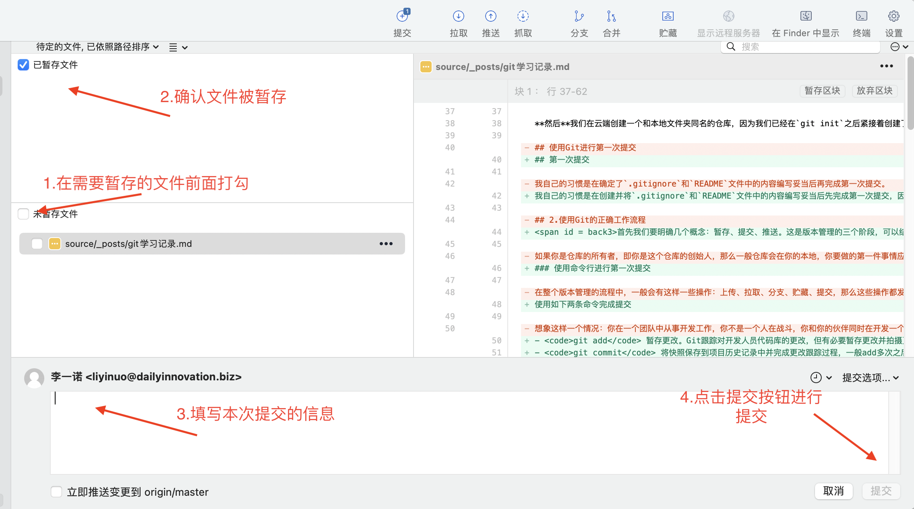

**Tips：**第一次提交很容易出问题，我曾经因为忘记创建`.gitignore`文件或者`.gitignore`文件内容编写不完整，导致一些不必要的文件被提交进去，虽然可以通过删除仓库重新再初始化然后添加gitignore的方式解决，但是这种方案总归看起来不够优雅，因此下面我给出了在第一次提交的时候存在错误并想要不通过删除仓库的方式撤回第一次提交的方案。虽然SourceTree是一个十分好用的可视化版本控制工具，但是它在面对上述情况的时候也是无能为力，我们只能通过终端输入git命令撤回我们的第一次提交。

下面是我在创建Unity工程的时候忘记一开始创建gitignore但是提交上去的情况，关于我使用**Git管理Unity项目的心得可以看另外一篇博客**，管理其他工程项目这种情况的处理也是类似的：

1. 首先，你需要确认当前分支名。如果你已经知道，可以跳过这一步。但如果你不确定，可以使用下面的命令来查看：

   ```shell
   git branch
   ```

   输出中带有星号（*）的那个就是当前分支。

2. 然后，你需要移动`HEAD`指针到空的父提交。这可以用下面的命令完成：

   ```shell
   git update-ref -d HEAD
   ```

3. 接下来我们回到SourceTree中，可以看到我们刚才提交上去的文件现在全都处在了暂存状态

4. 将这些文件状态设置为未暂存状态

5. 创建`.gitignore`文件

6. 回到SourceTree中，很多的未暂存文件就被忽略掉了，点击全部暂存就可以将未被忽略的文件全部暂存了

7. 最后我们就可以在SourceTree中提交我们正确暂存的文件了


## 送到远端仓库

### 第一次推送

第一次推送到远端仓库之前我们需要将本地仓库与远端仓库连接起来。当然我希望我们在第一次推送的时候仔细确认我们已经正确的创建了.gitignore文件和README文件

#### 使用Git

1.使用如下命令链接本地仓库和云端仓库：

```shell
git remote add origin remote_repo_url
```

除此之外我建议同时去设置本地分支与远程分支的跟踪关系，这样在之后的每一次提交或者拉取的时候就会方便我们的操作：

```shell
git branch --set-upstream-to origin/master
```

这行命令的含义是将当前本地分支设置为跟踪远程仓库`origin`下的`master`分支

完成了以上设置我们就可以执行`git push`将我们的第一次提交推送到云端仓库了

#### 使用SourceTree

在SourceTree中我们可以很方便地建立本地仓库和远端仓库之间的联系，直接按照如下操作就可以了：

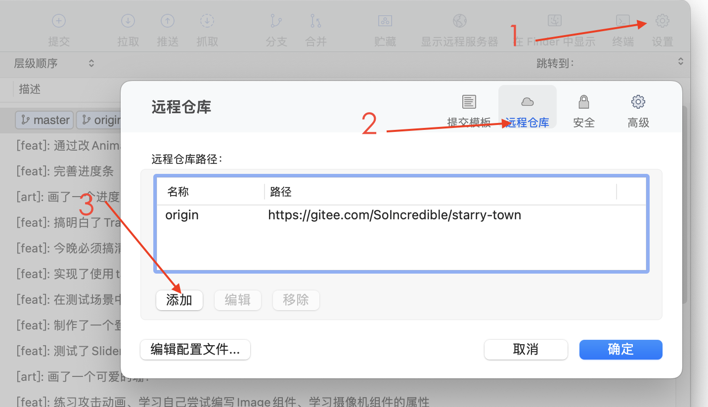

接着输入远端仓库的名称和url，就实现了绑定。

而绑定本地分支和远端分支的操作在每一次推送的时候弹出的弹窗中会有一栏复选框，一般我们不会去管它。

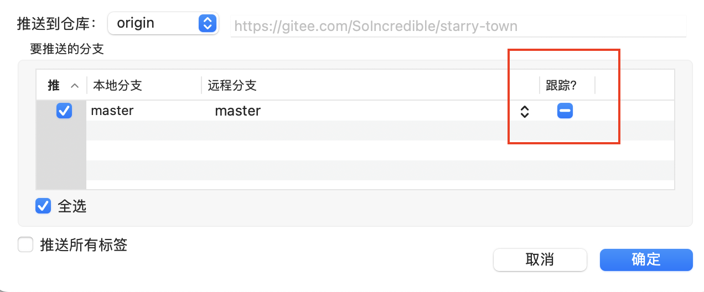

点击确定按钮，那么你的提交就被推送到远程仓库了！

### 非第一次推送

非第一次推送之前虽然不需要什么绑定本地仓库和远端仓库，但是需要做的事情仍然很多，试想这样一个场景：你和你的同事小小诺在同一时刻将远端仓库的最新节点A拉取到本地，分别在自己的本地进行开发，由于小小诺技术高超，他在你之前将他在本地做的工作提交并且推送到了远端仓库中去，此时远端仓库中最新的节点就变成了B，当你尽自己所能也将自己的工作完成了之后，想要推送到远端仓库时，你发现了问题：你是在节点A的基础上进行的开发，那么你将你本地提交的这一个新的节点推送到远端仓库时你的节点的上一个节点应该是节点A才对，但是因为小小诺捷足先登，导致如果你现在直接推送上去的话，你的节点之前的节点是小小诺推送上来的节点B，当然你直接推送这一行为是会被Git禁止掉的，那么你该怎么办呢？

既然你前面的节点已经不能是节点A了，那你可以让你前面的节点是节点B啊！所以在你准备将自己的提交推送到远端仓库之前，你应该先再一次拉取一下远端仓库，确保你获取到的是远端仓库的最新状态节点，你在这个节点的基础上进行的推送才是正确的状态，否则就会发生冲突。我尝试用下面的图来表示我刚才阐述的情况：

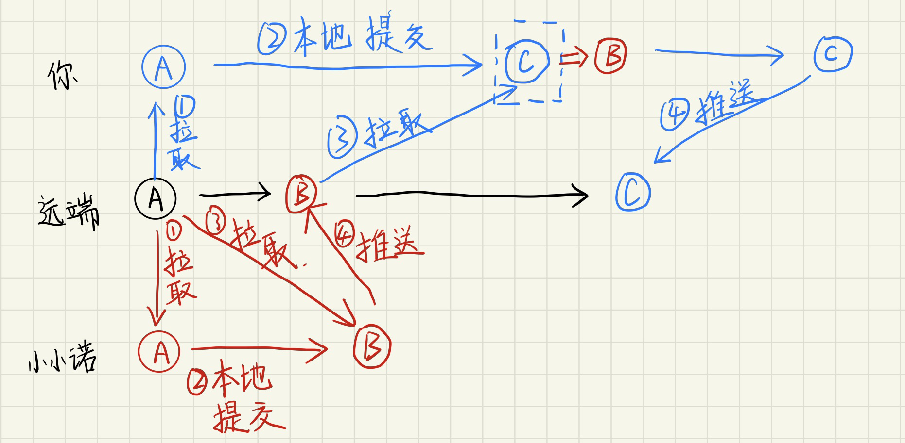

由上图我们可以看到我们完成一次推送总共要分成四步：拉取->本地提交修改->再拉取->推送到远端

## 意外情况

在使用git管理分支的时候，经常会出现一些意外情况


1. 此时你会看到三个选项：软重置，混合重置，硬重置。它们对应于 `git reset --soft` ， `git reset --mixed` ， `git reset --hard`。选择你需要的那个。

   - **软重置**: 这将保留你的更改并将它们标记为已暂存状态，这样你就可以再次提交它们。
   - **混合重置**: 这将保留你的更改，但不会将它们标记为已暂存。如果你想查看或编辑这些更改，然后再次提交，可以选择这个选项。
   - **硬重置**: 这将删除你的更改，你的代码将回到上次提交的状态。

2. 点击确定即可完成撤销操作。

   **注意** : 这些操作都是具有风险的，在执行任何撤销操作之前，确保你理解了其含义，并且已经保存了任何你不想失去的更改。
   
   


下面的内容是一开始照抄的官网文档，可以不用看

这篇博客会持续更新我的Git学习记录。

[官方参考书](https://git-scm.com/book/zh/v2)

# <span id ="在GitHub上创建仓库">在GitHub上创建仓库</span>

## 创建仓库

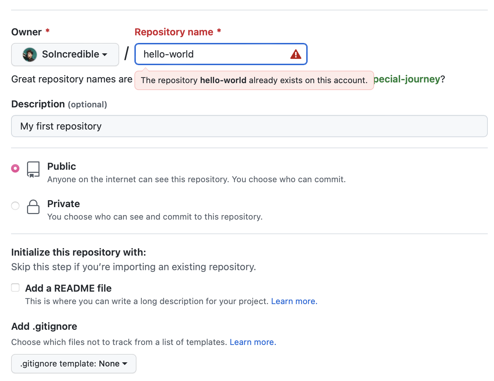

## 创建分支

默认情况下，Repository有一个名为main的分支，被视为最终分支。我们可以在Repository中创建mian以外的其他分支，使用分支可以一次拥有项目的不同版本，如果想要在不更改主要代码源的情况下向项目添加新功能，这就十分有用，在合并主分支前，在不同分支上完成的工作不会显示在主分支上。


**创建分支方法：**

1. 单击Repository中的Code选项卡

2. 单击其中显示main的文件列表顶部的下拉列表

    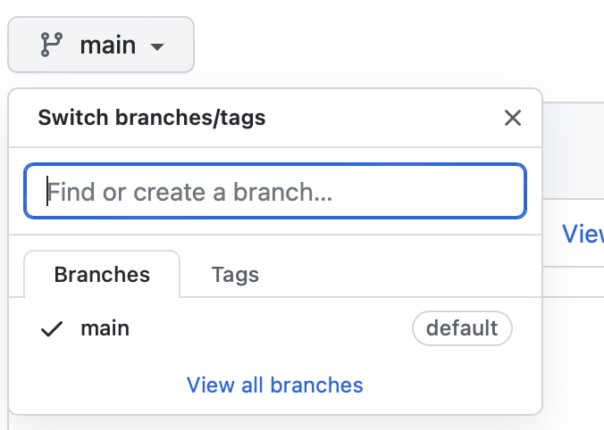

3. 在文本框中键入分支名称readme-deits

4. 单击Create branch: readme-edits from main

    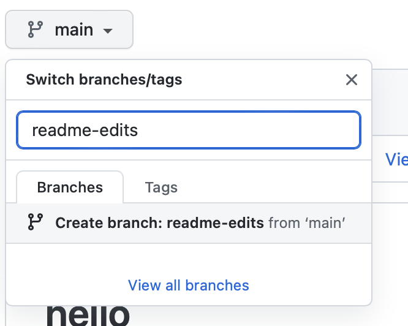

## 创建和提交更改

在上一步创建新分支时，github会跳转到新创建的readme-edits分支的代码页

# <span id = git基础>Git基础使用</span>

## 基础配置

1. 配置user信息，查看配置文件

   ```shell
   git config --global user.name 'your_name'
   git config --global user.mail 'your_mail'
   
   
   #查看配置文件
   git config --list
   
   #查看所有的配置以及它们所在的文件
   git config --list --show-origin
   
   #如果一台电脑要配置多个git用户，则需要取消全局配置--global然后进入到该项目中--local本地配置，这样才能同时使用两个不同的账号管理同一套代码。
   ```

2. config三个作用域

   <code>local</code> <code>global</code> <code>system</code>

3. 查看git日志信息<code>git log</code>

## 基本的Git命令

- <code>git init</code> 初始化一个全新的Git存储库并开始跟踪现有目录，它在现有目录中添加一个隐藏的子文件夹，该子文件夹包含版本控制所需的内部数据结构。
- <code>git clone</code> 创建远程已存在的项目的本地副本。克隆包括项目的所有文件、历史记录和分支。
- <code>git add</code> 暂存更改。Git跟踪对开发人员代码库的更改，但有必要暂存更改并拍摄更改的快照，以将其包含在项目的历史记录中，此命令执行暂存，即该两步过程的第一部分。
- <code>git commit</code> 将快照保存到项目历史记录中并完成更改跟踪过程，一般add多次之后执行一次commit。
- <code>git status</code> 将更改的状态显示为未跟踪、已修改或已暂存。
- <code>git branch</code> 显示正在本地处理的分支。
- <code>git merge</code> 将开发线合并在一起。此命令通常用于合并在两个不同分支上所做的更改，例如当开发人员想要将功能分支中的更改合并到主分支以进行部署时，他们会合并。
- <code>git pull</code> 使用远程对应项的更新来更新本地开发线，如果你的队友已经向远程上的分支进行了提交，并且他们希望将这些更改反映到其本地环境中，则开发人员使用此命令
- <code>git push</code> 使用本地对分支所做的任何提交来更新远程存储库。
- <code>git log</code> 查看git提交历史，会按照时间的先后顺序列出所有的提交，最近的更新会排在最上面。
- <code>git diff</code> 查看一个文件已暂存状态和未暂存状态的区别。

## 示例：通过Git将本地仓库添加到GitHub的仓库中（主要看这个！！！）

```shell
#1.在GitHub中创建一个新的仓库，不要生成README、LICENSE或者.gitignore文件

#2.打开终端，将目录切换到本地仓库的根目录

#3.初始化Git本地仓库 main是本地分支的名字
git init -b main 

#4.添加一些文件到本地的新仓库，如果要取消暂存文件，使用'git reset head your-file'
git add .

#5.确认文件并提交，要删除此提交并修改文件，使用'git reset --soft HEAD~1'并再次提交和添加文件
git commit -m "First commit"

#6.在终端中关联本地和远程仓库 origin是本地仓库名字，可以改成别的
git remote add origin <REMOTE_URL>
#确认关联的链接
git remote -v
#删除remote链接
git remote remove <name>

#7.push本地更改到github
git push -u origin main

```

## 示例：参与现有存储库

假设现在有一个尚未进行版本控制的项目目录，我们想要使用Git来控制它，那么首先要进入该项目的根目录下使用：<code>git init</code>，该命令将创建一个为<code>.git</code>的子目录，这个子目录含有初始化的Git仓库中所有的必须文件，这些文件是Git仓库的骨干，但是在这个时候我们仅仅是做了一个初始化的操作，我们的项目里的文件还没有被跟踪。

```shell
# create a new directory, and initialize it with git-specific functions
git init my-repo

# change into the `my-repo` directory
cd my-repo

# create the first file in the project
touch README.md

# git isn't aware of the file, stage it
git add README.md

# take a snapshot of the staging area
git commit -m "add README to initial commit"

# provide the path for the repository you created on github
git remote add origin https://github.com/YOUR-USERNAME/YOUR-REPOSITORY-NAME.git

# push changes to github
git push --set-upstream origin main
```

## 示例：启动新存储库并将其发布到GitHub

首先，我们需要在[GitHub上创建一个新的存储库](#在GitHub上创建仓库)，**不要**使用README、.gitignore或许可文件初始化存储库，这个空的存储库将等待你的代码

```shell
# create a new directory, and initialize it with git-specific functions
git init my-repo

# change into the `my-repo` directory
cd my-repo

# create the first file in the project
touch README.md

# git isn't aware of the file, stage it
git add README.md

# take a snapshot of the staging area
git commit -m "add README to initial commit"

#关联本地和远程仓库
# provide the path for the repository you created on github
git remote add origin https://github.com/YOUR-USERNAME/YOUR-REPOSITORY-NAME.git

# push changes to github
git push --set-upstream origin main
```

## 示例：为GitHub现有的分支做出贡献

此示例假定本地计算机上已经有一个名为<code>repo</code>的项目，并且上次在本地进行更改以来，已经将新分支推送到GitHub。

```shell
# change into the `repo` directory
cd repo

# update all remote tracking branches, and the currently checked out branch
git pull

# change into the existing branch called `feature-a`
git checkout feature-a

# make changes, for example, edit `file1.md` using the text editor

# stage the changed file
git add file1.md

# take a snapshot of the staging area
git commit -m "edit file1"

# push changes to github
git push
```

## git add多个文件或文件夹的方法

```shell
#方法一
git add file1 file2 file3

#方法二
git add file1
git add file2
git add file3

#方法三添加指定目录下的文件
#config目录下及子目录下所有文件，home目录下的所有.java文件
git config/*
git home/*.java

#方法四 git add . 添加所有的文件， 或者 git add --all 添加所有的文件
git add .
git add --all
```

## git 删除本地分支

```shell
git branch -d 分支名
```

## 给文件重命名

```shell
git mv 旧文件名 新文件名
```

## <code>git fetch</code> <code>git pull</code> <code>git clone</code>区别

```shell
git pull = git fetch + git merge

#将远程分支拉取到本地指定分支上
git pull origin <远程分支名>:<本地分支名>

#将远程指定分支拉取到本地当前分支上
git pull origin <远程分支名>

#将与本地当前分支同名的远程分支拉取到本地当前分支上，前提是要先关联远程分支
git pull

#在克隆远程项目的时候，本地分支会自动与远程仓库建立追踪关系，可以使用默认的origin来代替远程仓库名，所以常用的命令就是git pull origin <远程分支名>，简单操作，安全可控

#将本地当前分支推送到远程指定分支上，注意pull是远程在前本地在后，push相反
git push origin <本地分支名>:<远程分支名>

#将本地当前分支推送到与本地当前分支同名的远程分支上
git push origin <本地分支名>

#将本地当前分支推送到与本地当前分支同名的远程分支上
git push

#将本地分支与远程同名分支相关联
git push --set-upstream origin <本地分支名>
```

# Git分支

每次提交，Git都把它们串成一条时间线，这条时间线就是一个分支，如果仅仅是在本地使用<code>git init</code>了一下，那么本地就只有一条时间线，在Git里，这个分支叫做主分支，即<code>master</code>分支。

<code>HEAD</code>严格来说不是指向提交，而是指向<code>master</code>,<code>master</code>才是指向提交的，所以，<code>HEAD</code>指向的就是当前分支。

一开始的时候，<code>master</code>分支是一条线，Git使用<code>master</code>指向最新的提交，再用<code>HEAD</code>指向<code>master</code>，就能确定当前分支，以及当前分支的提交点。


每次提交，<code>master</code>分支都会向前移动一步，这样，随着我们不断提交，<code>master</code>，<code>master</code>分支的线也越来越长。

当我们创建新的分支，例如<code>dev</code>时，Git新建了一个指针叫做<code>dev</code>，指向<code>master</code>相同的提交，再把<code>HEAD</code>指向<code>dev</code>，就表示当前分支在<code>dev</code>上：


这样Git创建一个分支很快，因为除了增加了一个<code>dev</code>指针，改变了<code>HEAD</code>的指向，工作区的文件没有发生任何的变化。

不过从现在开始，对工作区的修改和提交就是针对<code>dev</code>分支了，比如新提交一次之后，<code>dev</code>指针向前移动一步，但是<code>master</code>指针不变：


假如我们在<code>dev</code>上的工作完成了，就可以把<code>dev</code>合并到<code>master</code>上，最简单的方法就是直接把<code>master</code>指向<code>dev</code>的当前提交，就完成了合并：


合并完成分支以后，甚至可以删除<code>dev</code>分支，删除<code>dev</code>分支就是把<code>dev</code>指针给删除掉，删除后，我们就剩下了一条<code>master</code>分支：


实操一下：

```shell
#首先创建一个dev分支，然后切换到dev分支：
git checkout -b dev

#git checkout 命令加上-b参数表示创建并切换，相当于以下两条命令
git branch dev
git checkout dev

#使用 git branch 命令查看当前分支：
git branch

#创建一个测试文件
touch test.md
vim test.md

git add test.md
git commit -m "这是一个测试"

#切换回master分支
git checkout master
git merge dev
#merge指令的作用是把merge后的分支合并到当前分支上

#删除dev分支
git branch -d de
```

# <span id = "版本回退">版本回退</span>

在使用Git的过程中，文件修改到一定程度的时候，可以保存一个“快照”，也就是<code>commit</code>。一旦误删了文件，或者文件被改乱，还可以从最近的一个<code>commit</code>中恢复，然后继续工作。

通过<code>git log</code>命令查看提交记录：

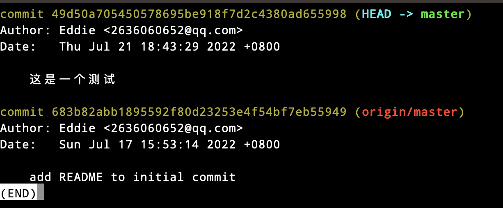

上面的输出过于繁杂，加上<code>--pretty=oneline</code>参数：

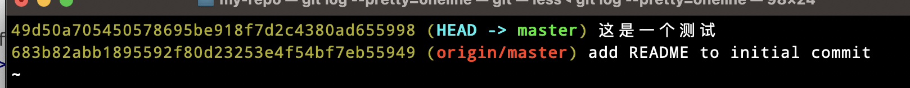

前面一长串的乱码是<code>commitid</code>，用HEAD表示当前的版本， 上一个版本就是<code>HEAD^</code>，上上个版本就是<code>HEAD^^</code>，网上100个版本就写100个^，但太复杂，所以写成<code>HEAD~100</code>。

如果要把当前版本回退到上个版本，使用<code>git reset</code>命令

```shell
git reset --hard HEAD^
```

但我们再用<code>git log</code>查看时，我们就看不到最新的版本了，如果我们还记得最新版本的commitid，我们可以使用<code>git reset --hard commitid</code>来重新回到最新版本，当然commitid不需要写全，git会自动去找。如果很不幸地忘记了<code>commitid</code>，可以使用<code>git reflog</code>，它用来记录你的每一次命令，这样就可以找到<code>commitid</code>然后使用<code>git reset</code>了。

# <span id = 3>工作区和暂存区</span>

**工作区**就是在本地电脑里能看到的目录，例如<code>hello-world</code>这个文件夹。

**版本库**存在于工作区中有一个隐藏目录<code>.git</code>，这个不算工作区，而是Git的**版本库**。

Git的版本库里存了很多东西，其中最重要的就是称为stage或者index的**暂存区**，还有Git自动创建的分支<code>master</code>以及指向<code>master</code>的一个指针<code>HEAD</code>


我们在把文件往Git版本库里添加的时候是分两步执行的：

第一步<code>git add</code> 把文件添加进去，实际上就是把文件需改添加到**暂存区**，也就是**暂存**。

第二步用<code>git commit</code> 提交更改，实际上就是把暂存区的所有内容提交到当前分支。

也就是说，需要提交的文件都统统放到暂存区，然后一次性提交暂存区中所有的修改。

推送即将本地版本库中最新的内容上传到远端。

现在你应该清楚暂存、提交和推送的概念了，点[这里](#back3)回去。

**实操一下**

修改一下README文件，添加一个LICENSE文件，使用<code>git status</code>可以查看一下状态：

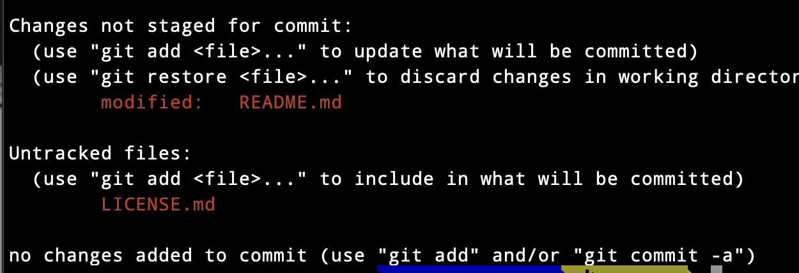

使用<code>git status</code>命令的输出十分详细，但是其用语有些繁琐，使用<code>git status -s</code>或者<code>git status --short</code>可以得到一种格式更为紧凑的输出。

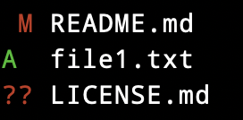

新添加的未跟踪文件前面有<code>??</code>标记，新添加到暂存区中的文件前面有<code>A</code>标记，修改过的文件前面有M标记。

那么Git就非常清楚的告诉我们，README文件被修改了，LICENSE还从来没有被添加过，那么我们使用<code>git add</code>，把这两个文件都添加之后，用<code>git status</code>再查看的时候就会看到：

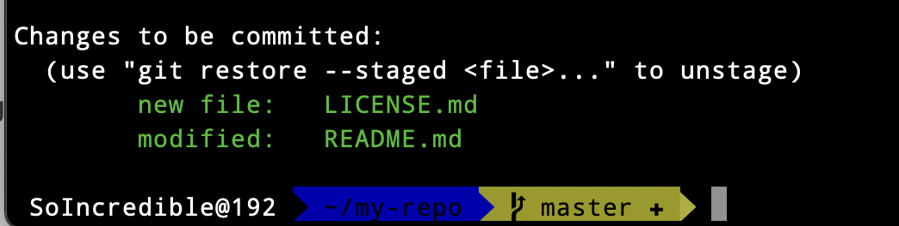

现在暂存区的状态就变成了这样：


然后执行<code>git commit</code>将暂存区的修改提交到分支，一旦提交后，工作区就是干净的。版本库就变成了这样，暂存区就没有任何内容了：


通过<code>git status</code>命令可以让我们时刻掌握仓库当前的状态，上面的命令输出虽然可以告诉我们哪个文件被修改过了，但是我们不能看到具体修改了什么内容，所以使用<code>git diff</code>命令查看：

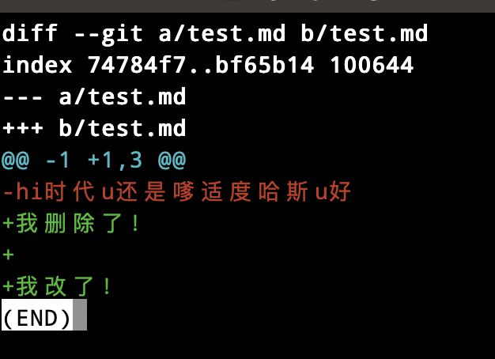

知道了对这个文件做了什么修改后，再将它提交到仓库就可以放心了，通过<code>add</code> <code>commit</code>完成。

# Git在合并分支时存在冲突

现在准备新的<code>feature</code>分支，继续我们的新分支开发：

```shell
#由于checkout指令既能够切换分支，又能够将文件从暂存区取回，所以切换分支我们用switch
git switch -c feature
```

修改<code>test.txt</code>

```shell
Creating a new branch is quick AND simple.
```

在<code>feature</code>分支上提交：

```shell
git add test.txt

git commit -m "AND simple"
```

切换到<code>master</code>分支：

```shell
git switch master
```

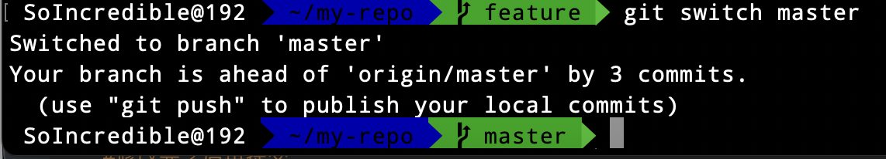

在<code>master</code>分支上把<code>test.txt</code>文件的最后一行改为：

```shell
Creating a new branch is quick & simple.
```

提交：

```shell
git add test.txt
git commit -m "& simple"
```

现在，<code>master</code>分支和<code>feature</code>分支各自都分别有新的提交，就变成了这样：


这种情况下，Git无法执行“快速合并”，只能试图把各自的修改合并起来，但是这种合并可能就会有冲突：

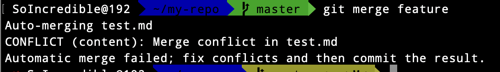

Git告诉我们test.md文件存在冲突，必须手动解决冲突之后再提交。<code>git status</code>也告诉我们冲突的文件：

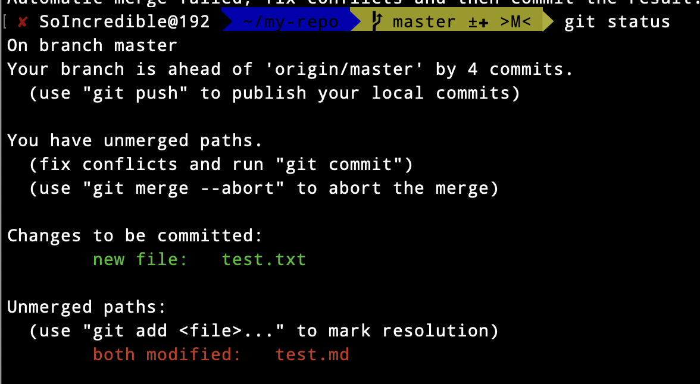

我们可以直接查看<code>test.md</code>的内容：

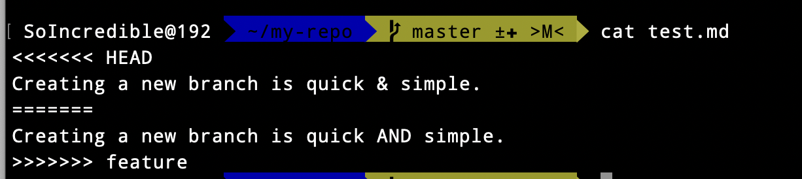

Git使用<code><<<<<<<</code><code>=======</code><code>\>>>>>>></code>标记出不同分支的内容，我们修改如下后保存：

```shell
Creating a new branch is quick and simple.
```

然后提交：

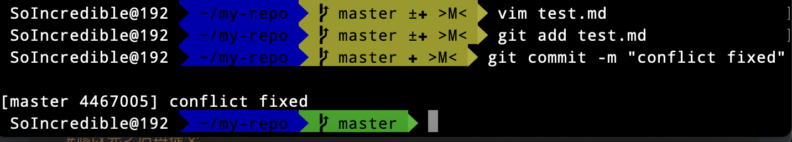

现在，分支结构图如下：


用带参数的<code>git log</code>可以看到分支合并的情况：

```shell
git log --graph --pretty=oneline --abbrev-commit
```

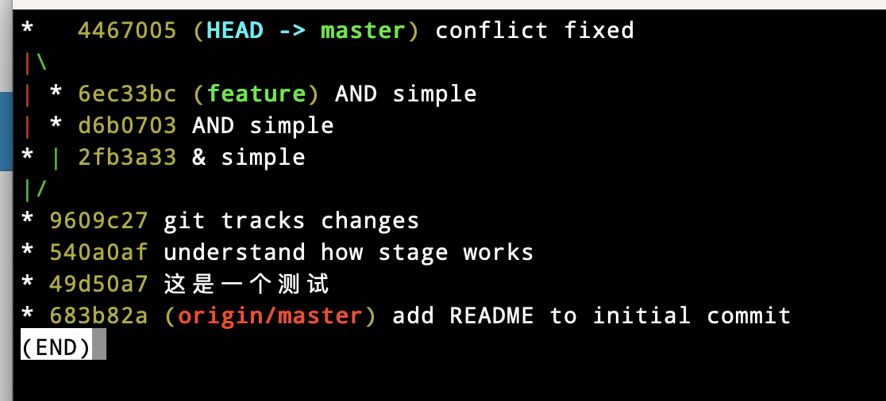

最后删除<code>feature</code>分支：

```shell
git branch -d feature 
```

# 管理修改

Git管理的是修改，而不是文件，做一个实验：

```shell
#对README文件做一次修改，然后添加
vim README.md

git add README.md

#然后再次修改README文件
vim README.md
#修改完之后再提交
git commit -m "git tracks changes"

#提交完之后再查看状态
git status

```

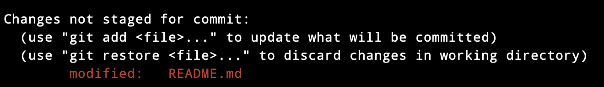

发现第二次的修改没有提交，回顾一下刚才操作的过程：

第一次修改 -> <code>git add</code> -> 第二次修改 -> <code>git commit</code>

因为Git管理的是修改，在使用<code>git add</code>命令后，在工作区的第一次修改被放入暂存区，准备提交，但是在工作区的第二次修改并没有被放入暂存区，所以<code>git commit</code>只负责把暂存区的修改提交了，也就是第一次的修改被提交了，第二次的修改不会被提交。

提交后，使用<code>git diff HEAD -- README.md</code>命令可以查看工作区和版本库里面最新版本的区别：

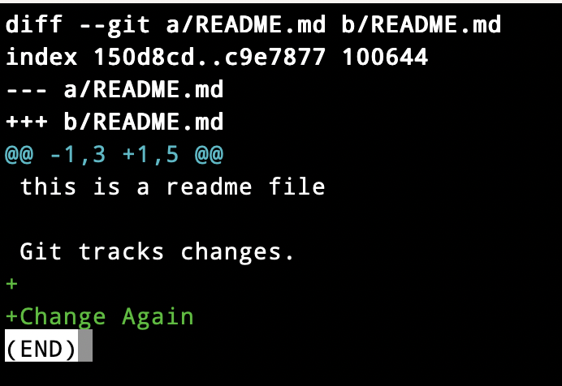

可见第二次的修改确实没有被提交。为了提交第二次修改，应该在第二次修改完之后使用<code>git add</code>然后再<code>git commit</code>，也可以先不着急提交第一次修改，先<code>git add</code>第二次修改，再<code>git commit</code>就相当于把两次修改合并后一起提交了：

第一次修改 -> <code>git add</code> -> 第二次修改 -> <code>git add</code> -> <code>git commit</code>

# 撤销修改

现在假设已经add完毕，准备commit了，但是在commit之前，我们发现了某个文件中的错误，这时可以使用<code>git checkout -- file</code>来丢弃工作区的更改，比如对于<code>README.md</code>，意思就是把<code>README.md</code>在工作区的修改全部撤销，这里有两种情况：

一种是<code>README.me</code>自修改后还没有被放到暂存区，现在撤销修改就回到和版本库一模一样的状态；

一种是<code>README.md</code>已经添加到暂存区后，又做了修改，现在撤销修改就回到添加暂存区后的状态。

总之，就是让这个文件回到最近一次<code>git commit</code>或者<code>git add</code>时的状态

场景一：我不小心改乱了工作区某个文件的内容，或者想要丢弃工作区的修改时，使用<code>git checkout -- file</code>丢弃掉工作区的修改。

场景二：我不但改乱了工作区的某个文件的内容，还添加到了暂存区，想要丢弃修改，先使用<code>git restore --staged file</code>将要撤销的文件从暂存区取回，然后就回到了场景一，按照场景一的步骤进行操作。

场景三：我已经提交了不合适的修改到版本库时，想要撤销本次提交，就需要用到[版本回退](#版本回退)中的操作了。

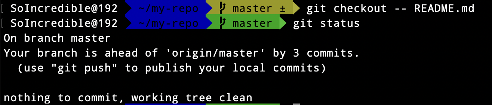

# 删除文件

在Git中，删除也是一个修改操作。

实操一下，先添加一个<code>test.txt</code>文件并到Git中提交：

```shell
#查看该目录下的隐藏文件
ls -ah 
touch test.txt

git commit -m "add test.txt"

```

 一般情况下，我们通常直接在文件管理器中把没用的文件删除了，或者使用<code>rm</code>指令：

```shell
rm test.txt
```

这个时候Git知道你删除了文件，因此工作区和版本库就不一致了，<code>git status</code>命令会立刻告诉你哪些文件被删除了，现在我们有两个选择，一是确实要从版本库里面删除该文件，那就使用<code>git rm</code>删掉，并且<code>git commit</code>，那现在文件就从版本库中被删除了，另外一种情况就是删错了，因为版本库里还有呢，所以可以轻松地把误删的文件恢复到最新版本：

```shell
git checkout -- test.txt
```

<code>git checkout</code>其实使用版本库里的版本替换工作区的版本，无论是工作区是修改还是删除，都可以“一键还原”。

还有一种情况，将文件从Git仓库或者暂存区中删除，但仍然希望保存到当前工作目录中

如果我们忘记添加<code>.gitignore</code>文件，不小心把一个很大的日志文件或者一堆<code>.a</code>这样的编译生成的文件添加到暂存区时，这一做法尤其有用：

```shell
git rm --cached 文件名
```

# 添加远程库

现在的情景是我们已经在本地创建了GIt仓库，又想在GitHub上创建一个Git仓库，并且让这恋歌仓库进行远程同步，这样，GitHub上的仓库既可以作为备份，又可以让其他人通过该仓库来协作，一举两得，按照[在GitHub上创建仓库](#在GitHub上创建仓库)步骤创建一个**空仓库**。

现在，我们在本地已经<code>git init</code>了一个本地仓库<code>learngit</code>，使用如下命令关联本地和远程库

```shell
git remote add origin https:github.com/soincredible/repository
```

添加后，远程库的名字就是origin，这是Git的默认叫法，也可以改成别的，下一步就可以把本地库的所有内容推送到远程库：

```shell
git push -u origin master
```

把本地库的内容推送到远程，用的是<code>git push</code>命令，实际上是把当前分支<code>master</code>推送到远程。

由于远程库是空的，我们第一次推送<code>master</code>分支时，加上了<code>-u</code>参数，Git不但会把本地的<code>master</code>分支内容推送到远程新的<code>master</code>分支，还会把本地的<code>master</code>分支和远程的<code>master</code>分支关联起来，在以后的推送或者拉取时就可以简化命令。

如果添加远程库的时候地址写错了，或者是想删除远程库，可以使用<code>git remote rm name</code>命令。

如果我们从零开发，最好的方式是先创建远程库，然后从远程库克隆，依旧是在GitHub上创建一个新的空仓库，然后使用git clone克隆一个本地库。如果多人协作开发，那么每个人各自从远程克隆一份可以了。

# <span id = "1">忽略文件</span>

一般有些文件无需纳入Git的管理，也不希望它们总出现在未跟踪文件列表，通常都是些自动生成的文件，比如日志文件或者编译过程中创建的临时文件等，在这种情况下，我们可以创建一个名为<code>.gitignore</code>的文件，列出要忽略的文件的模式。

GitHub有一个十分详细的针对数十种项目及语言的<code>.gitignore</code>文件列表，你可以在[这里](https://github.com/github/gitignore)找到它。

```shell
# 忽略所有的 .a 文件
*.a
 
# 但跟踪所有的 lib.a，即便你在前面忽略了 .a 文件
!lib.a
 
# 只忽略当前目录下的 TODO 文件，而不忽略 subdir/TODO
/TODO
# 忽略任何目录下名为 build 的文件夹
build/
 
# 忽略 doc/notes.txt，但不忽略 doc/server/arch.txt
doc/*.txt
 
# 忽略 doc/ 目录及其所有子目录下的 .pdf 文件
doc/**/*.pdf
```

<code>.gitignore</code>的文件规范如下：

- 所有空行或者以#开通的行都会被Git忽略
- 可以使用标准的global模式匹配，它会递归地应用在整个工作区中
- 匹配模式可以以<code>/</code>开头防止递归。
- 匹配模式可以以<code>/</code>结尾指定目录
- 要忽略指定模式以外的文件或者目录，可以在模式前面加上<code>!</code>取反

**思考：**如果一个文件已经在git仓库里了，这个时候再忽略掉会怎么样？

参考：https://shiyousan.com/post/636470505667009340/

所以应该遵循规范，在第一次push之前就把忽略文件配置好。

现在理解`.gitignore`文件的作用了吧？点[这里](#2)回去，我们继续。

# Git中的origin/master

在使用git时，如果我们使用了clone或者git push到远程的某个origin上之后，使用命令git branch -a会发现，有一个origin/master分支，这实际上是git从远程clone的一个分支，origin/master指向远端origin的master，用来跟踪远程origin/master变化情况，只有git再和远程的origin通讯，比如fetch、pull后，origin/master分支的指针次才会更新移动，当我们使用git fetch或者git remote update时，就会把远端的代码给更新到origin/master上，此时，如果我们想以远程的分支为基础，建立一个本地分支来做开发，那么git checkout -b local_branch origin/master 所以，当合并的时候，需要git merge origin/master，之前讲过，Git往远程push前修改commit信息，使用的是git rebase -i origin/master，也就不难理解，它rebase的是origin/master的commit信息，所以push之后，远端的commit信息就会改变了。

实操一下，看图：

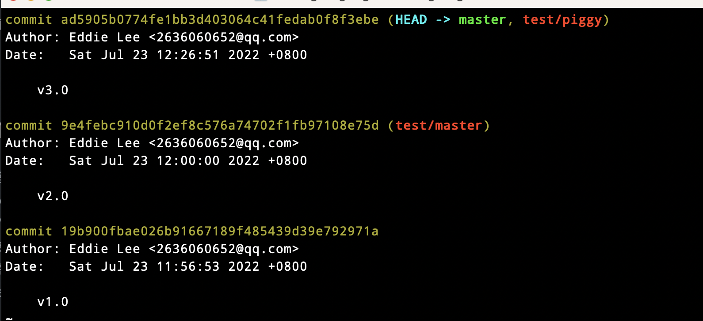

图中我在本地提交了三次，本地版本控制是<code>HEAD -> master</code>，当前指向版本是<code>v3.0</code>，红字表示的是这次提交和远程仓库的关联，比如<code>v2.0</code>和远程仓库的master对应，<code>v3.0</code>和远程仓库中的<code>piggy</code>分支对应。

现在假设一个场景，你和你的小伙伴一起在一起开发项目，你们两个都要在一个<code>dev</code>的分支上面进行开发，那么你们都需要创建远程的<code>dev</code>分支，

```shell
git checkout -b dev origin/dev
```

现在他就可以在dev上进行修改，然后时不时地把dev分支push到远程。

你的小伙伴已经向test/piggy分支推送了他的提交，而碰巧你也对同样的文件做了修改并试图推送，但你会推送失败，因为你的小伙伴的最新提交和你试图推送的提交有冲突，解决办法也很简单，使用<code>git pull</code>或者<code>git fetch</code>把最新的提交从test/piggy抓取下来，这时候本地可能会存在<code>detached branch</code>，即游离分支。游离分支存在的情况下是没有办法进行<code>git push</code>的，需要先在本地合并，解决冲突再推送。

```shell
#设置piggy和test/origin的链接
git branch --set-upstream-to=test/piggy piggy

#直接就可以git pull，不用任何参数
git pull
```

# 标签

发布一个版本时，我们通常先在版本库中打一个标签tag，这样我们就唯一确定了打标签时刻的版本，将来无论什么时候，取某个标签的版本，就是把那个打标签的时刻的历史版本取出来，所以标签也是版本库的一个快照。

在Git中打标签十分简单，切换到需要打标签的分支上：

```shell
git branch

git checkout master

#打一个新标签
git tag v1.0

#查看所有标签
git tag
```

默认标签是打在最新提交的commit上的，有时候如果忘记了打标签，我们可以通过历史提交找到commitid，然后打上就可以了。

```shell
git log --pretty=oneline --abbrev-commit
#给commitid为f52c633的提交打标签
git tag v0.9 f52c633
#指定标签信息
git tag -a <tagname> -m "blabla....."

```

标签打错了也可以删除，因为标签都只存储在本地，不会自动推送到远程，使用<code>git push origin --tags</code>将标签推送至远程。

以上是截止<code>2022年7月26</code>号以前我全部的Git学习成果，后续本篇博客会持续更新。
