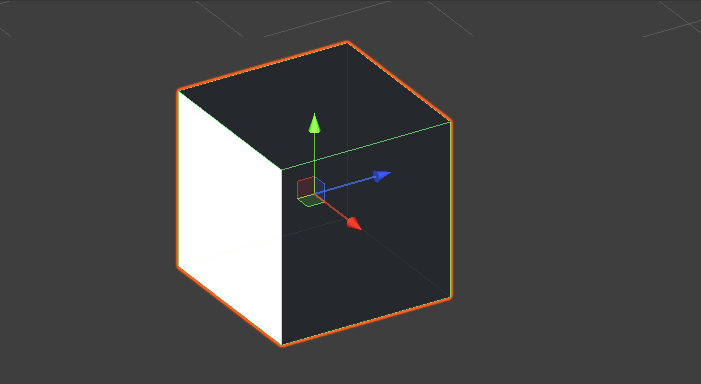

# Unity中的坐标系和Transform组件

Unity中的坐标系都是左手坐标系——左右的大拇指方向为Z轴的正方向，绕着Z轴的正方向顺时针旋转的方向为为X轴-Y轴的方向


坐标系又分为世界坐标和本地坐标。因此在Unity中一个物体的位置可以用两种坐标信息描述——本地坐标Local和世界坐标Global。Local的含义是该物体相对于父物体的Transform信息。Unity的Inspector面板上Transform组件上显示的属性`position` `rotation` `scale`都是`Local`的。以`position`属性举例：在代码中，`transform.position`属性，获得的是世界`Global`坐标系下的表示的位置信息，`transform.localPosition`属性获得的是该物体相对于父物体的`Local`坐标信息。**注意**如果一个物体在Hierarchy窗口中是根节点，那么它的Local坐标系和Global坐标系本质上一个坐标系。

另外，对于Transform组件上的Rotation属性的理解花费了我很多时间，我不理解的点有两个：1.四元数和欧拉角 2.万向锁 在后文中会对这三个概念做一些介绍。与`position`和`localPosition`类似地，在这里我只想明确`rotation`和`localRotation`属性的含义和表现效果。`rotation`是物体在全局Global坐标下的旋转信息表示。`localPosition`是物体相对于父节点的坐标系的旋转信息表示，因为父物体自身的旋转会导致父物体的x-y-z轴的方向发生变化，所以设置`localPosition`属性相同的值在父物体的不同旋转角度下会有不同的表现效果。同样的，如果一个物体在Hierarchy窗口中是根节点，那么它的Local坐标系和Global坐标系本质上是一个坐标系。当我们点击游戏场景中的一个物体时，被选中的这个物体会显示出该物体的坐标轴信息（如下图）：



**这个坐标轴信息对这个物体的旋转是没有意义的，因为该物体的旋转不是以这个坐标轴为旋转轴**，而是以这个物体的父物体（如果有，没有就是世界坐标系）上的坐标轴为旋转轴

# Unity中实现物体移动和旋转的效果

本章节的主要目的是为了明确Unity提供的一些有关移动和旋转的API的使用。

无论是移动还是旋转，都是通过修改物体的Transform组件中对应的属性实现的。移动和旋转都是过程，反映到计算机上就是在一段连续的帧内位置和角度信息持续变化，给人以运动和旋转的效果。

需要传入参数，根据不同的类型和需求，我们要实现的移动效果也是不一样的，比如： 我希望这个物体向前移动5个单位，和我希望这个物体向前移动5s，再比如，我希望在按下w键的时候物体向前移动，松开的时候停止移动。不同的需求都给出了不同的触发条件和结束条件。

有时我们希望

我们能获取到的

Unity提供的各种可以改变位置和旋转角度的API可以分成两类：一类是传入新的物体的位置和旋转信息，物体的Transform属性将直接更新为传入的值。另一类是传入基于物体当前Transform信息的基础上的相关属性的增量。在使用过程中两种方式经常混着用，导致实现的效果不是预期的，所以写下这一章节的目的是为了将这两种方式区分开形成两种完善的移动旋转效果的方案。

## 背景

我们要实现车辆在道路上行驶的效果——已知一段路径，这段路径有直行有转弯，车辆能够沿着这段路径移动，为了让转弯的效果更逼真，我们需要确保车在转弯的过程中，车头近似朝着车当前所处路径点的切线方向。在这个需求中我们近似认为车的拐弯路径是一个四分之一圆弧。

## 移动效果的实现

物体表现出移动的效果可以理解为物体在极短的时间内从一个点瞬间移动到下一个点，所以我们可以先把物体的行进路径用点描述出来，然后将物体的位置在一段时间内依次设置到这些点上，就能够形成移动的效果了。

随着行驶路径边长，我们记录的点的数量也会变多，一昧增加点的数量是不可取的，在这个需求中，骑车行进中的状态总共可以被抽象成两种：转弯和直行。先不说转弯，对于直行来说，我们只要知道了直行路段的起始点和终点我们就可以将这段路径描述出来了。以下是一种使用协程方式实现的物体移动：

```c#
private IEnumerator TickMove()
{
    yield return new WaitForSeconds(3f);
    var length = (_startPos.position - _endPos.position).magnitude;
    var curLength = 0f;
    while (curLength < length)
    {
        curLength += _speed * Time.deltaTime;
        if (curLength > length)
        {
            transform.position = _endPos.position;
            yield break;
        }
        var pos = Vector3.Lerp(_startPos.position, _endPos.position, curLength / length);
        transform.position = pos;
        yield return null;
    }
}
```

实现思路如下：需要提供物体运动起点和终点的位置、速度`_speed`，我们能够得到每一帧物体运动的距离是`_speed *  Time.deltaTime`。从物体位于起点时的第一帧开始，一直到第n帧物体移动的距离也就能得到，起点和终点的距离也能方便地得到，我们将 `物体当前移动距离/起点和终点地距离`传入Vector3.Lerp接口中，就能得到当前帧物体所处地位置了。

## 旋转效果的实现

使用欧拉角的方式控制物体的旋转这种方式会更直观和方便，但是欧拉角最好只在物体只绕着一个轴旋转的情况下使用，因为当物体绕着多个轴旋转的时候，由于欧拉角的表达式在数学上的缺陷导致它有可能会出现万向锁的现象，这时候我们最好使用四元数Quaternion的方式控制物体在多个轴上的旋转

还是要再把localRotation和rotation区分清楚

另外区分transform.Rotate方法中传入的是当前要旋转的角度

而transform.rotation = Quaternion.Eular(x,y,z); 是直接设置物体的旋转信息

### 使用欧拉角的方式实现旋转效果

使用欧拉角的方式会使得比较简单但是会造成万向锁`GimbalLock`的问题！

Unity提供了很多接口都可以实现物体移动和旋转的效果

​	几个考虑的点

​		1.如何让小车的运动流畅

​			对插值的理解 Quaternion.Lerp和Vector.Lerp

​		2.哪一种性能更好？

​			a.使用协程

​			b.使用Update

​	

​			a.将点都存储起来	

​			b.实时计算

​		3.如何控制小车的旋转？ 顺时针和逆时针是怎么控制的，和旋转轴的方向有没有关系？ forward和back分别代表z轴的正负方向，沿着这两个不同的方向旋转同样的角度 ，旋转的方向应该正好相反

3.欧拉角 四元数 万向锁产生的数学原因 向量左乘和右乘

​	俯仰角 pitch

​	翻滚角 roll

​	偏航角 yaw

4.Unity中角度的坑

​	-30度会被转换成360-30 = 330度 所以[-30,30]区间其实是[0,30]并上[330,360)

5.贝塞尔曲线相关

​	1.贝塞尔曲线的原理

​	2.在Unity中实现贝塞尔曲线

6.状态机的编写

7.将状态机结合小车运动编写一个框架

8.如何知道物体是顺时针转还是逆时针转

https://blog.csdn.net/qq_28745613/article/details/127052609


9.CMake学习记录中的坑

https://cmake.org/cmake/help/latest/guide/tutorial/A%20Basic%20Starting%20Point.html


10.LineRenderer的使用

##### https://docs.unity3d.com/cn/2021.3/ScriptReference/LineRenderer.html
