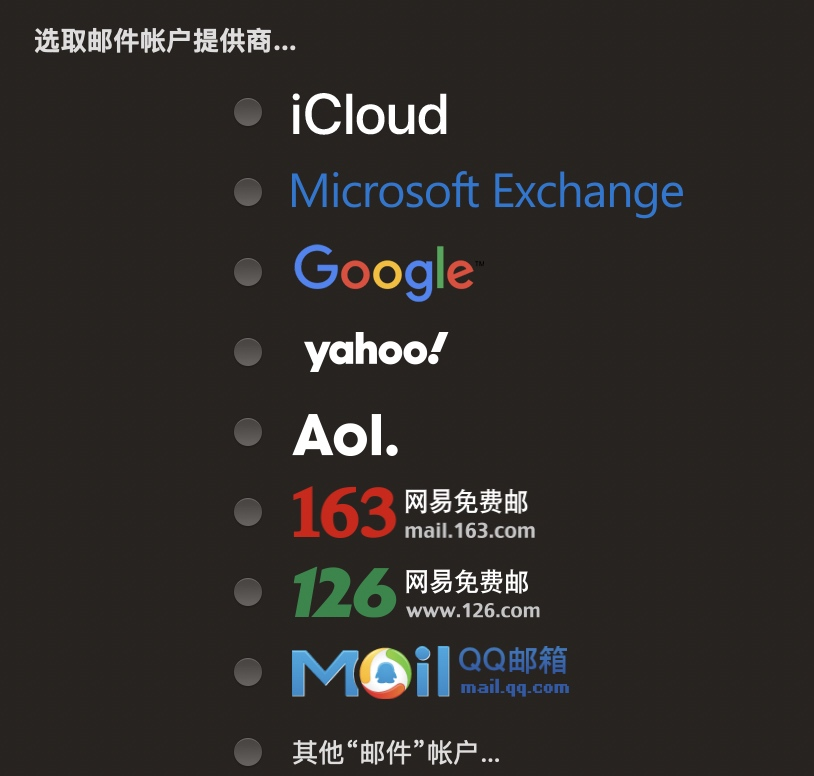
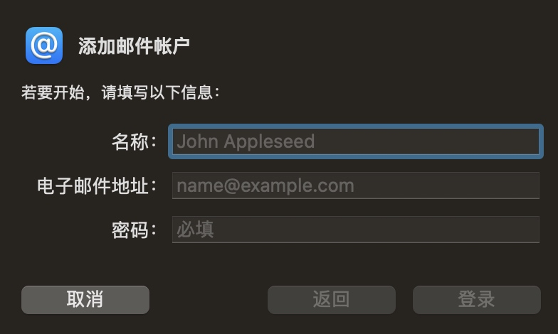
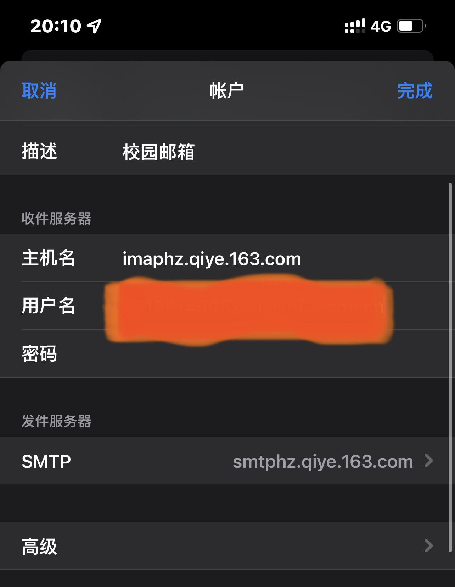

用学生邮箱可以捞到不少好处，但因为不是主邮箱，每次需要验证的时候都需要进学校的官网、输入邮箱账号密码才能查看邮件，于是我决定尝试将校园网邮箱绑定给Apple原生邮件App进行管理

首先，我们学校的邮箱用的是网易的企业邮箱

打开Apple的邮件，选择新增用户，选择其他“邮件”账户

名称随便填，电子邮件地址输入你的学生邮箱账号，密码要用授权码

填写的收件服务器和发件服务器的主机名如下

