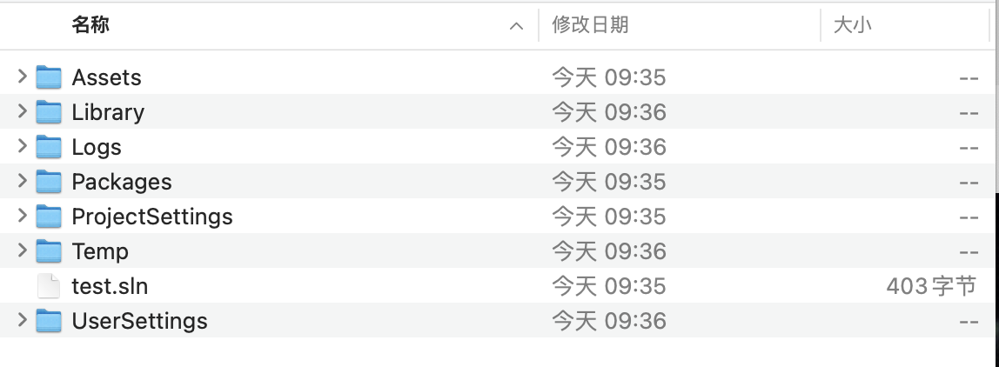

# 了解Unity的目录结构




<!--more-->

官方参考文档https://docs.unity3d.com/Manual/ExternalVersionControlSystemSupport.html

- Assets：存储所有游戏资源的文件夹，包括脚本、纹理、声音、<code>编辑器定制</code>等等。是项目中最重要的文件夹。
- Library：被导入资源的本地缓存，使用Git做版本控制时不需要管这个文件夹。如果Unity的项目文件太大，可以试试删除Library文件夹
- Logs：日志文件夹，由Unity自动生成管理，记录报错崩溃信息，随时可以删除清理
- Packages：包配置信息，由Unity自动生成管理，用于放置一些官方组件和第三方插件
- ProjectSettings：工程设置信息，由Unity自动生成管理
- UserSettings：编辑器的用户构建设置，记录用户的使用偏好，如Unity编辑器的布局方式等等。
- Temp：临时文件夹，Unity运行过程中生成的历史文件。

综上，我们只需要将Assets和ProjectSettings两个文件夹纳入版本控制即可，通过编辑<code>.gitignore</code>文件忽略不需要版本控制的文件。这里列出最近在学习的ARFoundation在github上给出的例子的<code>.gitignore</code>为例：

```shell
[Ll]ibrary/
[Ll]ogs/
[Tt]emp/
[Oo]bj/
[Bb]uild/
[Bb]uilds/
[Uu]serSettings/
Assets/AssetStoreTools*
Packages/packages-lock.json

# Visual Studio 2015 cache directory
/.vs/
.vscode

# Ignore manually added packages
com.*
upm-xr*

# Autogenerated VS/MD/Consulo solution and project files
ExportedObj/
.consulo/
*.csproj
*.unityproj
*.sln
*.suo
*.tmp
*.user
*.userprefs
*.pidb
*.booproj
*.svd
*.pdb
*.idea
.vsconfig

# Unity3D generated meta files
*.pidb.meta
*.pdb.meta

# Unity3D Generated File On Crash Reports
sysinfo.txt

# Builds
*.apk
*.unitypackage

.DS_Store
```

https://github.com/github/gitignore/blob/main/Unity.gitignore

```shell
# This .gitignore file should be placed at the root of your Unity project directory
#
# Get latest from https://github.com/github/gitignore/blob/main/Unity.gitignore
#
/[Ll]ibrary/
/[Tt]emp/
/[Oo]bj/
/[Bb]uild/
/[Bb]uilds/
/[Ll]ogs/
/[Uu]ser[Ss]ettings/

# MemoryCaptures can get excessive in size.
# They also could contain extremely sensitive data
/[Mm]emoryCaptures/

# Recordings can get excessive in size
/[Rr]ecordings/

# Uncomment this line if you wish to ignore the asset store tools plugin
# /[Aa]ssets/AssetStoreTools*

# Autogenerated Jetbrains Rider plugin
/[Aa]ssets/Plugins/Editor/JetBrains*

# Visual Studio cache directory
.vs/

# Gradle cache directory
.gradle/

# Autogenerated VS/MD/Consulo solution and project files
ExportedObj/
.consulo/
*.csproj
*.unityproj
*.sln
*.suo
*.tmp
*.user
*.userprefs
*.pidb
*.booproj
*.svd
*.pdb
*.mdb
*.opendb
*.VC.db

# Unity3D generated meta files
*.pidb.meta
*.pdb.meta
*.mdb.meta

# Unity3D generated file on crash reports
sysinfo.txt

# Builds
*.apk
*.aab
*.unitypackage
*.app

# Crashlytics generated file
crashlytics-build.properties

# Packed Addressables
/[Aa]ssets/[Aa]ddressable[Aa]ssets[Dd]ata/*/*.bin*

# Temporary auto-generated Android Assets
/[Aa]ssets/[Ss]treamingAssets/aa.meta
/[Aa]ssets/[Ss]treamingAssets/aa/*

```

