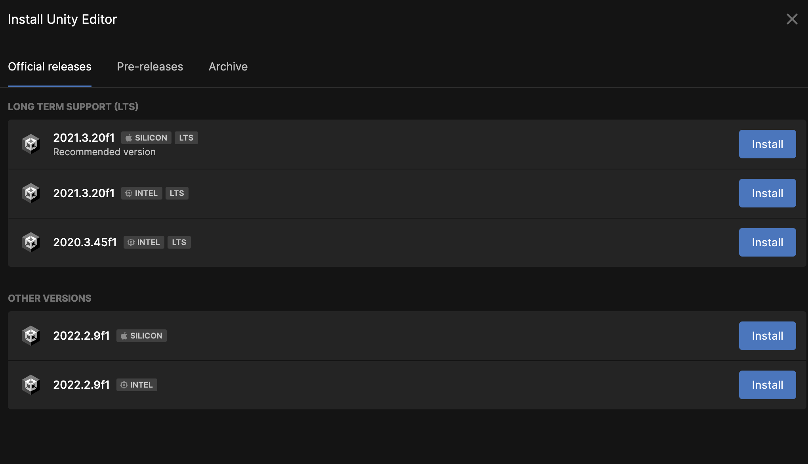
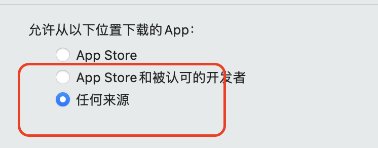
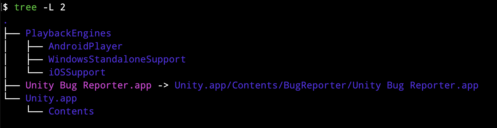
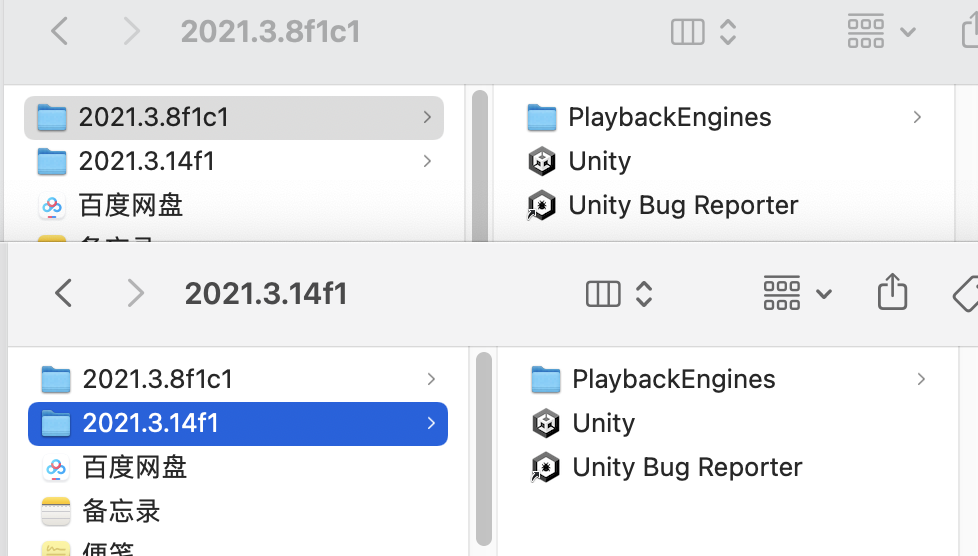
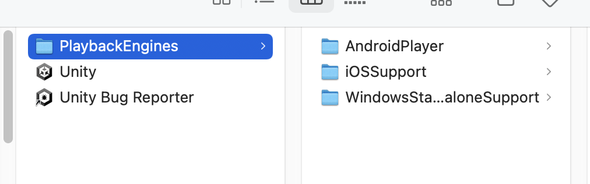

# 本文记录的问题

[解决M1Mac “无法打开应用，因为Apple无法检查其是否包含恶意软件” 的问题](#1)

[在Mac上安装多个版本的Unity，并且为每个版本安装扩展modules](#2)

如何使用Rider创建一个普通的C#工程？它的文件结构是什么？

什么是namespace？它的作用是什么？（该问题在[这篇文章]()中得到了解决）

# 背景

今天是2023年3月7号，我入职的第三天，公司强制使用Unity搭配Rider进行开发，文本会记录如何使用Rider创建简单的C#工程，并且了解项目的文件结构。

在今天的工作中也遇到了其他的问题，也将在本文中做记录。

# <span id = "2">在Mac上安装多个版本的Unity和对应的modules</span>

公司使用的Unity版本为`2021.3.14f1`，我自己做项目使用的版本是`2021.3.8f1c1`，这两个版本在UnityHub中的Installer中都是找不到的，需要去官网的`Archive`中下载。



这里是官网的归档，感谢宇哥的小TIPS：版本号中带c1的是在Unity中文官网上下载的，不带c1的是在Unity的英文官网上下载的。这是Unity的[英文版本归档地址](https://unity.com/releases/editor/archive)，这是[中文版本归档地址](https://unity.cn/releases/full/2021)。

<span id = "1">下载完成之后，在打开`pkg`包的时候会弹出“**无法打开应用，因为Apple无法检查其是否包含恶意软件**”的问题，解决方法是在终端中输入：</span>

```shell
sudo spctl --master-disable
```

然后打开`设置`->`安全性与隐私`->`通用`，选择任何来源，就可以打开刚才下载的安装包了。



下面是演示如何在Mac上安装多个版本的Unity。Mac系统会将Unity Editor安装在`Applications/Unity`这个文件目录，如果电脑中没有这个目录则会自动创建。在安装module的时候，必须首先确保`Applications/Unity`路径存在，然后确保该路径中有要安装的module对应版本的Unity Editor，否则module会安装失败。成功安装的module会放在`Applications/Unity/PlaybackEngines`目录下。这是整个目录的结构：



现在我要安装`Unity2021.3.14f1`和`Unity2021.3.8f1c1`两个版本的Editor和各自对应的`iOS`、`Android`、`MacOS`、`Windows`的module。我先安装了`2021.3.14f1`版本，系统会自动创建`Applications/Unity`路径，然后我也完成了对应版本module的安装。这时如果继续安装`2021.3.8f1c1`的话，系统会直接覆盖掉`Applications/Unity`中`2021.3.14f1`这个版本的Editor，所以我先把这个文件夹的名字改成了`2021.3.8f1c1`，然后再安装新版本的Editor，这样系统又会自动创建`Applications/Unity`这个路径，并在该路径下安装新版本的Editor和module，就不会出现覆盖的问题了。新版本的Editor和module安装完成之后最好将文件夹的名字改成Editor对应的版本号来方便管理，比如`2021.3.14f1`。如果之后需要给某一个版本安装新的module，需要先把该版本的文件夹名改回`Unity`，然后再安装module，安装成功之后将文件夹名再改回对应的版本号。现在我的Mac上就有两个版本的UnityEditor了🤤🤤🤤



最后再记录一个小问题：我每个Editor版本都下载了四个module：`iOS`、`Android`、`Windows`、`MacOS`，前三个安装完成之后都会在`PlaybackEngines`文件夹中找到对应的文件，唯独MacOS的module安装成功之后不会出现在`PlaybackEngines`的文件夹里，我认为可能是因为我的电脑本身就是MacOS，换言之，如果我的电脑是Windows，那在`Playback Engines`这个文件夹下可能就没有Windows相关的module了，这个问题可能与电脑的系统有关。



