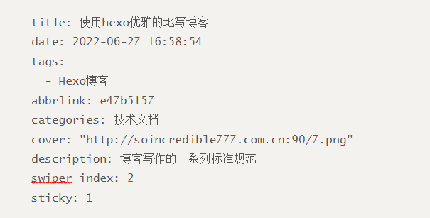

# 博客编写规范

博客头部信息解读



- title：博客的标题名称
- date：博客的编写日期
- tags：文章的标签，可以有多个标签
- abbrlink：文章永久化链接，不用管，hexo会帮助我们自动生成
- categories： 文章的归档，一般我只会归类一个
- cover： 博客文章的封面
- description： 文章的描述，如果是将文章放在了swiper中描述才会展示
- swiper_index： 博客顶部人潮汹涌那里展示的文章，数字代表展示次序
- sticky：顶置文章，数字代表顶置的顺序

# 多设备同步更新博客

我目前的方案是将我整个博客文件夹，文件夹中的`node_modules`除外，上传到GitHub上去，下面描述一个具体的场景：

我在A电脑上新建了一篇文章，并且完成了文章的编写，我要做两件事：

第一件事是使用`hexo d`部署博客到网站上去；

第二件事是使用`git push`将文件夹上传到GitHub仓库中去。


# 外挂标签的使用


# 在文章中实现页内跳转

我有的博客写的很长，有一种情况是：我在博客最开头介绍了一个知识点，然后中间写了很多其他的内容，博客最底部又出现来开头的知识点，导致我上下翻阅很不顺畅，所以我需要实现文章内部的跳转，具体方法如下：

我要跳转的目的地使用`span`标签进行包裹，我们跳转的出发地使用`[]()`进行包裹，方括号中填入的是跳转的文字内容，圆括号中填入的是span标签中id的值。

使用span标签，跳转


举个例子

```html
[点击此处跳转跳转](#jump)


<span id = jump>跳转到这里<span>
```

