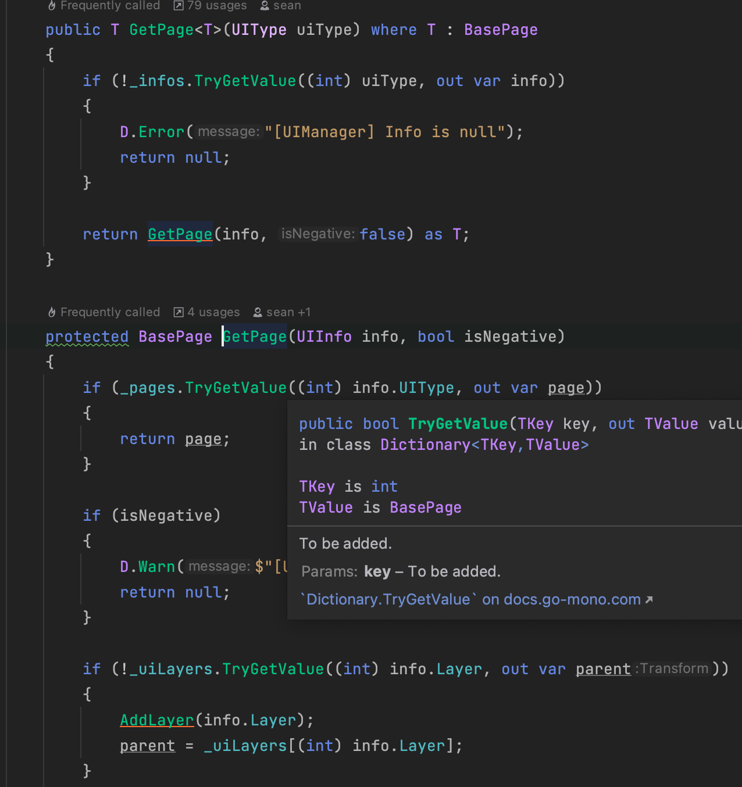
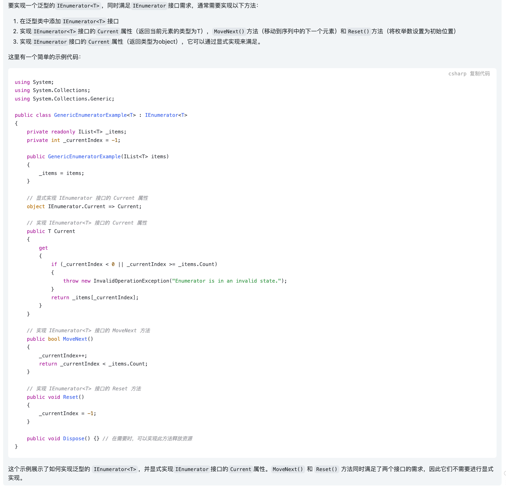
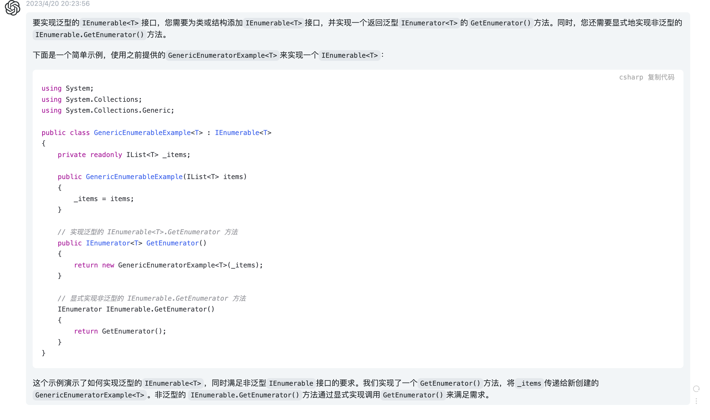

# 基本概念

协程（Coroutine）：协同程序，在主程序运行的同时，开启另外一段逻辑处理，来协同当前程序的执行。Unity的协程系统是基于C#的一个简单而强大的接口——迭代器（IEnumerator），协程并不是多线程的，只是运行的结果很像多线程而已。它们最大的区别就是多线程可以多核兵法，但是协程只能是单核按帧顺序轮转，线程可以使用多个CPU，协程不能，所以线程是真的并行。协程是在Unity主线程中运行的，每一帧中处理一次，而并不与主线程并行。这就意味着在协程之间不存在着所谓的线程间的同步和互斥问题，访问同一个值也都是安全的，不会出现死锁。

# 协程的用法：

## 开启协程：

开启协程的两种方式：

- `StartCoroutine(string methodName)`。参数是方法名（字符串类型）；此方法可以包含一个参数，形参方法可以有返回值
- `StartCoroutine(IEnumerator method)`。参数是方法名(TestMethod())，方法中可以包含多个参数；IEnumerator类型的方法不能含有ref或者out类型的参数，但是可以含有被传递的引用；必须要有返回值，并且返回值的类型为IEnumerator，返回值使用`yield return expression`或者`yield return value`，或者`yield break`语句。

## 终止协程

终止协程的两种方式

- `StopCoroutine(string methodName)`，只能终止制定的协程，在程序中调用StopCoroutine()方法只能终止以字符串形式启动的协程。
- `StopAllCoroutine()`，终止所有协程

挂起

- `yield`：挂起，程序遇到`yield`关键字的时候会被挂起，暂停执行，等待条件满足的时候从当前位置继续执行
- `yield return 0` or `yield return null`：程序在下一帧中从当前位置继续执行
- `yield return 1,2,3...`：等待程序1，2，3...帧之后从当前位置继续执行
- `yield return new WaitForSeconds(n)`:程序等待n秒之后从当前位置继续执行
- `yield new WaitForEndOfFrame()`：在所有的渲染以及GUI程序执行完成后从当前位置继续执行
- `yield new WaitForFixedUpdate()`：所有脚本中FixedUpdate()函数都被执行后从当前位置继续执行
- `yield return WWW`：等待一个协程执行完成后从当前位置继续执行
- `yield return SatrtCoroutine()`：等待一个协程执行完成后从当前位置继续执行
- `yield break`：将会导致协程的执行条件不被满足，不会从当前的位置继续执行程序，而是直接从当前位置跳出函数体回到函数的根部

# 协程的执行原理

协程函数的返回值是IEnumerator，它是一个迭代器，可以把它当成执行一个序列的某个节点的指针，它提供了两个重要的接口，分别是`Current`(返回指向当前的元素)和`MoveNext`（将指针向后移动一个单位，如果移动成功，则返回`true`）

yield关键字用来声明序列中的下一个值或者是一个无意义的值，如果用`yield return x`（x指的是一个具体的对象或者数值）的话，那么MoveNext返回为true并且Current被赋值为x，如果使用`yield break`使得`MoveNext`返回为`false`

如果`MoveNext`函数返回为`true`就意味着协程的执行条件被满足，则能够从当前位置继续往下执行，否则不能从当前位置继续往下执行。

# 理解协程的本质

我们都说协程的本质是迭代器，我在之前的博客中也对迭代器(IEnumerator)有过详细的介绍了，但是我还是没有办法把协程和迭代器联系起来，我认为问题出在了我对yield和foreach的理解上了，下面我将先试图理解foreach内部的工作原理

## 集合类的关键要素

根据定义，Microsoft .NET Framework集合是至少可以实现`IEnumerable<T>`（或非泛型IEnumerable类型）的类，此接口至关重要，因为至少必须实现`IEnumerable<T>`的方法，才支持迭代集合。

foreach语法十分简单，开发者无需知道元素数量，避免编码过于复杂。不过，运行时`Runtime`不直接支持foreach语句。C#编译器会转换代码，接下来会对此部分进行介绍：

foreach和数组：下面展示了简单的foreach循环，用于迭代整数数组，然后将每个整数打印输出到控制台中：

```C#
int[] array = new int[] {1,2,3,4,5,6};
foreach(int item in array){
	Console.WriteLine(item);
}
```

在此代码中，C#编辑器为for循环创建了等同的`CIL`：

```C#
int[] tempArray;
int[] array = new int[]{1,2,3,4,5,6};
tempArray = array;
for(int counter = 0;(counter < tempArray.Length); counter++){
	int item = tempArray[counter];
	Console.WriteLine(item);
}
```

在这个例子中，请注意，foreach依赖对Length属性和索引运算符`[]`的支持。借助Length属性，C#编译器可以使用for语句迭代数组中的每个元素。

`foreach`和`IEnumerable<T>`集合：虽然前面的代码适用于长度固定且始终支持索引运算符的数组，但并不是所有类型集合的元素数量都是已知的。此外，许多集合类（包括`Stack<T>`、`Queue<T>`和`Dictionary<TKey and TValue>`）都不支持按索引检索元素。因此，需要使用一种更为通用的方法来迭代元素集合。迭代器模式就派上用场了（迭代器模式在[这篇博客](http://soincredible777.com.cn/posts/279644bd/)中有介绍）。假设可以确定第一个、第二个和最后一个元素，那么就没有必要知道元素的数量，也就没有必要支持按索引检索元素。

`System.Collections.Generic.IEnumerator<T>`和非泛型`System.Collections.IEnumerator`接口旨在启用迭代器模式（而不是前面介绍的长度索引模式）来迭代元素集合。它们的关系类图如下：

.png)

`IEnumerator<T>`派生自IEnumerator包含三个成员。第一个成员是布尔型MoveNext。使用则中方法，可以在集合中从一个元素移动到下一个元素，同时检测是否已经枚举完所有项。第二个成员是只读属性Current，用于返回当前处理的元素。`Current在IEnumerator<T>`中进行重载，提供按类型分类的实现代码。借助集合类中的这两个成员，只需要使用while循环，即可迭代集合：

```C#
System.Collections.Generic.Stack<int> stack = new System.Collections.Generic.Stack<int>();
int number;
while(stack.MoveNext()){
  number = stack.Current;
  Console.WriteLine(number);
}
```

在此代码中，当移到集合的末尾时，MoveNext方法返回false。这样一来，便无需在循环的同时计算元素的数量。

（Reset方法通常会抛出NotImplementedException，因此不得进行调用，如果需要重新开始进行枚举，只需要新建一个枚举器就可以了。）

前面的示例展示的是C#编译器输出要点，但实际上并非按此方式进行编译，因为其中略去了两个重要的实现细节：交错和错误处理。

状态为共享：前面示例中展示的实现代码存在一个问题，即如果两个此类循环彼此交错（一个foreach在另外一个循环内，两个循环使用相同的集合），集合必须始终有当前元素的状态指示符，以便在调用MoveNext的时候，可以确定下一个元素。在这种情况下，交错的一个循环可能会影响另一个循环。（对于多个线程执行的循环也是如此）。

通过代码理解上面说的这个情况：

```C#
// stack是我们要遍历的集合，如果我们直接支持IEnumerator<T>这个接口，那我们所做的所有操作将会直接影响集合的状态
// 换个角度理解，任何要遍历这个集合的地方都是用到了同一个枚举器，所以在嵌套循环中（如下代码）一个枚举会影响到别的枚举
System.Collections.Generic.Stack<int> stack = new System.Collections.Generic.Stack<int>();
int number;
while(stack.MoveNext()){
  while(stack.MoveNext){
    number = stack.Current;
    Console.WriteLine(number);
  }
  number = stack.Current;
  Console.WriteLine(number);
}
```

为了解决这个问题，集合类不直接支持`IEnumerator<T>`和IEnumerator接口。而是直接支持另一种接口`IEnumerable<T>`，其唯一的方法是`GetEnumerator`。此方法用于返回支持`IEnumerator<T>`的对象。不必使用始终指示状态的集合类，而是可以使用另一种类，通常为嵌套类，这样便有权访问集合内部，从而支持`IEnumerator<T>`接口，并且始终指示迭代循环的状态。枚举器就像是序列中的“游标”或者“书签”。可以有多个“书签”，移动其中任何一个都可以枚举集合，与其他枚举互不影响。使用此模式就相当于有多个独立工作的枚举器在遍历这个集合，因此互不影响了，foreach循环的C#等同代码如下：

```C#
System.Collections.Generic.Stack<int> stack = new System.Collections.Generic.Stack<int>();
int number;
Syste,.Collections/Generic.Stack<int>/Enumerator enumerator;
enumerator = stack.GetEnumerator();

while(enumerator.MoveNext()){
  number = enumerator.Current;
  Console.WriteLine(number);
}
```

迭代后清除状态：由于实现`IEnumerator<T>`接口的类始终指示状态，因此有时需要在退出循环后清除状态（因为要么所有迭代均已完成，要么抛出异常）。为此，从IDisposable派生`IEnumerator<T>`接口。实现IEnumerator的枚举器不一定实现IDisposable，如果实现了，同样也会调用Dispose。这样可以在退出foreach循环后调用Dispose。因此，最终CIL的C#等同如下代码：

```C#
System.Collections.Generic.Stack<int> stack = new System.Collections.Generic.Stack<int>();
System.Collections.Generic.Stack<int>.Enumerator enumerator;
IDisposable disposable;
enumerator = stack.GetRnumerator();
try{
  int numeber;
  while(enumerator.MoveNext()){
    number = enumerator.Current;
    Console.WriteLine(number);
  }
}
finally{
  disposable = (IDisposable)enumerator;
  disposable.Dispose();
}
```

注意，由于`IEnumerator<T>`支持IDisposable接口，因此using语句可以将上面的代码简化为下面的代码：

```C#
System.Collections.Generic.Stack<int> stack = new System.Collections.Generic.Stack<int>();
int number;
using(System.Collections.Generic.Stack<int>.Enumerator enumerator = stack.GetEnumerator()){
  while(enumerator.MoveNext()){
    number = enumerator.Current;
    Console.WriteLine(number);
  }
}
```

然而，重新调用CIL并不直接支持using关键字。因此，未简化的代码实际上使用C#更精确表示的foreach CIL代码。

在*不实现* IEnumerable 的情况下使用 foreach： C# 不要求必须实现 `IEnumerable/IEnumerable<T>` 才能使用 foreach 迭代数据类型。编译器改用鸭子类型这一概念；它使用 Current 属性和 MoveNext 方法查找可返回类型的 GetEnumerator 方法。鸭子类型涉及按名称搜索，而不依赖接口或显式方法调用。（“鸭子类型”一词源自将像鸭子一样的鸟视为鸭子的怪诞想法，对象必须仅实现 Quack 方法，无需实现 IDuck 接口。） 如果鸭子类型找不到实现的合适可枚举模式，编译器便会检查集合是否实现接口。

到此为止我们算是理解了`foreach`的基本原理了，我们知道，foreach是不支持对我们遍历的元素进行修改的，我们下面尝试一下使用foreach的思想去自己实现一下对集合的遍历。

看一下下面这段代码，里面综合了比较多的知识点，多态、继承、泛型、Struct，还有我们的迭代器模式：

```C#
using System.Collections;

public struct ActivityData
{
    private string _activityName;
    private string _activityStartDate;
    private string _activityEndDate;

    public string ActivityName
    {
        get { return _activityName; }
        set { _activityName = value; }
    }

    public string ActivityStartDate
    {
        get { return _activityStartDate; }
        set { _activityStartDate = value; }
    }

    public string ActivityEndDate
    {
        get { return _activityEndDate; }
        set { _activityEndDate = value; }
    }

    public ActivityData(string activityName, string activityStartDate, string activityEndDate)
    {
        // ActivityName = activityName;
        // ActivityStartDate = activityStartDate;
        // ActivityEndDate = activityEndDate;
        _activityStartDate = activityStartDate;
        _activityEndDate = activityEndDate;
        _activityName = activityName;
    }
}

public class ConcreteEnumerator<T> : IEnumerator<T>
{
    private T[] _collection;
    private int _index;

    public ConcreteEnumerator(T[] collection)
    {
        _collection = collection;
        _index = -1;
    }

    public bool MoveNext()
    {
        _index++;
        if (_index < _collection.Length)
        {
            return true;
        }

        return false;
    }

    object IEnumerator.Current { get; } = new();

    public T Current
    {
        get => _collection[_index];
        set => _collection[_index] = value;
    }

    public void Dispose()
    {
    }

    public void Reset()
    {
        _index = 0;
    }
}

public class ConcreteCollection<T> : IEnumerable<T>
{
    private T[] _collection;

    public ConcreteCollection(T[] collection)
    {
        _collection = collection;
    }


    public IEnumerator<T> GetEnumerator()
    {
        return new ConcreteEnumerator<T>(_collection);
    }

    IEnumerator IEnumerable.GetEnumerator()
    {
        return GetEnumerator();
    }
}


public class Program
{
    public static void Main(string[] args)
    {
        int[] a = { 1, 3, 5 };

        ConcreteCollection<int> cc = new ConcreteCollection<int>(a);

        // ConcreteEnumerator<int> ce = cc.GetEnumerator<int>();

        ConcreteEnumerator<int>? ce = cc.GetEnumerator() as ConcreteEnumerator<int>;
        while (ce != null && ce.MoveNext())
        {
            Console.WriteLine(ce.Current);
            ce.Current++;
            Console.WriteLine("修改后的集合的值为：" + ce.Current);
            Console.WriteLine();
        }

        Console.WriteLine();

        ActivityData[] data =
        {
            new ActivityData("Unicorn", "2023-05-21", "2023-05-23"),
            new ActivityData("Flower", "2023-05-22", "2023-05-25")
        };

        ConcreteCollection<ActivityData> activityDataCollection = new ConcreteCollection<ActivityData>(data);
        using (ConcreteEnumerator<ActivityData>? activityDataEnumerator =
               activityDataCollection.GetEnumerator() as ConcreteEnumerator<ActivityData>)
        {
            while (activityDataEnumerator != null && activityDataEnumerator.MoveNext())
            {
                Console.WriteLine("当前活动名：" + activityDataEnumerator.Current.ActivityName);
                Console.WriteLine("当前活动开始日期：" + activityDataEnumerator.Current.ActivityStartDate);
                Console.WriteLine("当前活动结束日期：" + activityDataEnumerator.Current.ActivityEndDate);
                Console.WriteLine();
            }
        }

        Console.ReadKey();
    }
}
```

- 我们上面的代码是按照foreach的思想去遍历我们所有的元素的，但是我们实现了在遍历的过程中更改元素的内容，foreach之所以不能修改元素的值，是因为在foreach的实现中并没有暴露Current属性的set方法，因此我们没有办法在foreach遍历的时候更改集合的值。

- 关于泛型的知识在[这篇文章](http://soincredible777.com.cn/posts/f7eb93de/)中有过铺垫，此处用到了泛型的IEnumerator和IEnumerable，`IEnumerator<T>`和`IEnumerable<T>`分别继承自`IEnumerable`和`IEnumerator`，也就是说，实现泛型的IEnumerator和IEnumerable的方法，还需要实现`IEnumerable`和`IEnumerator`中的方法，因为里面涉及到方法重名的问题所以可以看一下代码中是如何解决重名问题的。

- 其他问题：在Main方法中，我使用`ConcreteEnumerator<int> ce = cc.GetEnumerator() as ConcreteEnumerator<int>;`，可以看到我必须在右侧加上as 进行显示转换，如果不加就会提示：`Cannot convert source type 'System.Collections.Generic.IEnumerator<int>' to target type 'ConcreteEnumerator<int>'`的错误，但是我们的ConcreteEnumerator是实现了IEnumerator接口的啊😂，怎么就不能隐式转换了呢？

  跟宇哥探讨了一下，我的疑问主要来自于同样是数据转换，int和float就可以隐式的转换，而有父子关系的转换却需要显示的转换，这是为什么？
  
  宇哥用实例来解释了一下，比如我们的BasePage继承自MonoBehaviour，然后上面还继承了好几层到了Component，联系[这篇开发日志]()中的`page = go.AddComponent() as BasePage`，就是这种情况，Component时BasePage的祖先，如果不加as BasePage的话，page就会是一个Component类型的变量，我们需要显示地给它转成BasePage类型，但是虽然它现在是BasePage类型，但它本质上还是Unicorn或者Flower等特定的BasePage的子类。
  
  直接看代码吧，话都在代码里了😂
  
  ```C#
  using System.Runtime.InteropServices.ComTypes;
  
  
  public class Component
  {
      public Component AddComponent()
      {
          Console.WriteLine("调用AddComponent方法添加了组件");
          return this;
      }
  }
  
  public class BasePage : Component
  {
      public virtual void print()
      {
          Console.WriteLine("我是BasePage");
      }
  }
  
  public class Unicorn : BasePage
  {
      public override void print()
      {
          Console.WriteLine("我是Unicorn");
      }
  }
  
  public class Flower : BasePage
  {
      public override void print()
      {
          Console.WriteLine("我是Flower");
      }
  }
  
  public class Program
  {
      static void Main(string[] args)
      {
          Unicorn unicorn = new Unicorn();
          Component component = unicorn;
          BasePage page = component.AddComponent() as BasePage;
          page.print();
  
          Flower flower = new Flower();
          component = flower;
          page = component.AddComponent() as BasePage;
          page.print();
      }
  }
  ```
  
  下面是我将项目中一个常规的打开界面的流程抽象了出来，里面用到了很多最近学的东西，能跑起来真的挺开心的🎉
  
  ```C#
  using System.Dynamic;
  using System.Reflection;
  using System.Runtime.InteropServices.ComTypes;
  
  
  public enum PageInfo
  {
      Unicorn,
      Flower,
      Default
  }
  
  // 这里是用class好还是struct好？
  public class UIInfo
  {
      public readonly PageInfo PageID;
      public readonly Type PageType;
  
      public UIInfo(PageInfo pageID, Type pageType)
      {
          PageID = pageID;
          PageType = pageType;
      }
  }
  
  // 需要画UML图
  
  public class Component : Object
  {
      public GameObject gameObject { set; get; }
  }
  
  public class GameObject : Object
  {
      // where关键字的作用？
      public T AddComponent<T>() where T : Component => this.AddComponent(typeof(T)) as T;
  
  
      public Component AddComponent(System.Type type)
      {
          // 使用这个方法实例化Page
          // page = new type();
          // 这里好像要用反射
          // 如果说要实例化一个带参数的构造方法的类需要反射，我们这里实例化的是一个不带参数的构造方法的类，所以还用不到反射。
          //ConstructorInfo constructorInfo = type.GetConstructor(new[] { typeof(), typeof() });
          object? instance = Activator.CreateInstance(type);
          Console.WriteLine("调用了AddComponent方法喔");
          return instance as Component ?? throw new InvalidOperationException();
      }
  }
  
  
  public abstract class AbstractUIManager : Component
  {
      protected readonly Dictionary<int, BasePage> _pages = new Dictionary<int, BasePage>(128);
  
      protected readonly Dictionary<System.Type, UIInfo> _infos = new Dictionary<System.Type, UIInfo>(128);
  
  
      public T GetPage<T>(System.Type type, PageInfo info) where T : BasePage
      {
          return GetPage(type, info) as T;
      }
  
      protected BasePage GetPage(System.Type type, PageInfo info)
      {
          if (_pages.TryGetValue((int)info, out var page))
          {
              return page;
          }
          else
          {
              GameObject gameObject = new GameObject();
              page = gameObject.AddComponent(type) as BasePage;
              _pages.Add((int)page.PageID, page);
              return page;
          }
      }
  
      public bool OpenPage(System.Type type, PageInfo info)
      {
          var page = GetPage(type, info);
          page.OnOpen();
          return true;
      }
  
      public bool ClosePage(PageInfo info)
      {
          return true;
      }
  }
  
  public class UIManager : AbstractUIManager
  {
      public static UIManager Instance;
  
      public static void Create()
      {
          Instance = new UIManager();
          Instance.LoadInfo();
      }
  
  
      private void LoadInfo()
      {
          AddInfo(typeof(Unicorn), new UIInfo(PageInfo.Unicorn, typeof(Unicorn)));
          AddInfo(typeof(Flower), new UIInfo(PageInfo.Flower, typeof(Flower)));
      }
  
      protected void AddInfo(System.Type type, UIInfo info)
      {
          if (_infos.ContainsKey(type))
          {
              return;
          }
  
          _infos.Add(info.PageType, info);
      }
  
      public bool AddToPagesDic(int id, BasePage page)
      {
          if (_pages.ContainsKey(id))
          {
              Console.WriteLine("存储数据时发生了冲突！再见👋！");
              return false;
          }
  
          _pages.Add(id, page);
          return true;
      }
  }
  
  public class BasePage : Component
  {
      protected PageInfo _pageID;
  
      public PageInfo PageID
      {
          get { return _pageID; }
          private set { _pageID = value; }
      }
  
  
      public void OnOpen()
      {
          Prepare();
      }
  
      public virtual void Prepare()
      {
          Console.WriteLine("我是BasePagePrepare方法");
      }
  }
  
  public class Unicorn : BasePage
  {
      public Unicorn()
      {
          _pageID = PageInfo.Flower;
      }
  
      public override void Prepare()
      {
          Console.WriteLine("我是UnicornPrepare方法");
      }
  }
  
  public class Flower : BasePage
  {
      public Flower()
      {
          _pageID = PageInfo.Unicorn;
      }
  
      public override void Prepare()
      {
          Console.WriteLine("我是FlowerPrepare方法");
      }
  }
  
  public class Program
  {
      static void Main(string[] args)
      {
          PageInfo pageInfo = PageInfo.Default;
          System.Type type = typeof(BasePage);
          UIManager.Create();
          // 在这里写一个输入模拟用户打开窗口的操作。
          Console.WriteLine("现在有这样几个窗口供你选择：1.独角兽 2.种花 你想要打开哪一个？");
          string? input = Console.ReadLine();
          if (input == "1")
          {
              pageInfo = PageInfo.Unicorn;
              type = typeof(Unicorn);
          }
          else if (input == "2")
          {
              pageInfo = PageInfo.Flower;
              type = typeof(Flower);
          }
          else
          {
              Console.WriteLine("输入错误！再见👋！");
          }
  
  
          UIManager.Instance.OpenPage(type, pageInfo);
      }
  }
  ```
  



下面放几张我和ChatGPT的截图，真的牛逼：







我们先来看两段代码：

```C#
public static IEnumerable<int> Fibonacci(int count)
{
    int prev1 = 0;
    int prev2 = 1;
    
    for (int i = 0; i < count; ++i)
    {
        int current = prev1 + prev2;
        yield return current; // 使用yield return返回当前值
        
        prev1 = prev2;
        prev2 = current;
    }
}
```


```

```


我们在Unity中执行如下的代码：

```C#
using System.Collections;
using System.Collections.Generic;
using UnityEngine;

public class TestCoroutine : MonoBehaviour
{
    // Start is called before the first frame update
    void Start()
    {
    }

    // Update is called once per frame
    void Update()
    {
        Debug.Log("我是Update中的方法1");
        StartCoroutine(Test());
        Debug.Log("我是Update中的方法2");
    }

    IEnumerator Test()
    {
        Debug.Log("第一次执行方法");
        yield return 0;
        Debug.Log("第二次执行方法");
        yield return 0;
        Debug.Log("第三次执行方法");
        yield return 0;
    }
}
```

我们可以看到控制台的输出结果是：

```
我是Update中的方法1
第一次执行方法
我是Update中的方法2

我是Update中的方法1
第一次执行方法
我是Update中的方法2
第二次执行方法

我是Update中的方法1
第一次执行方法
我是Update中的方法2
第二次执行方法
第三次执行方法
```

我们看第三次Update中代码执行的顺序我们可以得知：第二次Update中的Coroutine比第一次中的Coroutine先执行了，而且是在这一次Update结束了之后才调用的协程，就是在后面的Coroutine要先于前面的协程执行。

# 几种可以实现图片透明度渐变效果的方法

方法一：使用协程

```C#
using System.Collections;
using System.Collections.Generic;
using System.Net.Mime;
using Unity.Collections;
using UnityEngine;
using UnityEngine.UI;

public class TestCoroutine : MonoBehaviour
{
 
    private int a = 0;
    public Image testImg;
    private float colorAlpha = 1f;
    private bool flag = false;

    void Start()
    {
        StartCoroutine(Test());
    }
    IEnumerator Test()
    {
        while (colorAlpha >= 0.0f)
        {
            colorAlpha -= 0.02f;
            testImg.GetComponent<Image>().color = new Color(255, 255, 255, colorAlpha);
            yield return new WaitForSeconds(0.05f);
        }
    }
}
```

方法二：使用`Time.deltatime`

```C#
using System.Collections;
using System.Collections.Generic;
using System.Net.Mime;
using Unity.Collections;
using UnityEngine;
using UnityEngine.UI;

public class TestCoroutine : MonoBehaviour
{
    

    private int a = 0;
    public Image testImg;
    private float colorAlpha = 1f;
  
    void Update()
    {
        if (colorAlpha >= 0.0f)
        {
            colorAlpha -= 0.1f * Time.deltaTime;
            testImg.GetComponent<Image>().color = new Color(255, 255, 255, colorAlpha);
        }
    }
}
```

通过这个例子我有点理解Time.deltatime的含义了，在本例中，我们在`colorAlpha -= 0.1f * Time.deltaTime;`处使用了Time.deltatime，它的作用是使得`colorAlpha`变量每一秒减0.1f，如果使用打断点的方式去分步调试，每次Update的时候都会去执行这一行代码，然后可以看到每次Update后`colorAlpha`会每次减小一点点，也就是说Time.deltaTime是一个很小的数，它能够确保在1s内将colorAlpha这个变量减少0.1，而且这个过程是连续的。

使用协程的那个方式呢，它能够实现在一段时间间隔内渐变的效果是因为有`yield return new WaitForSeconds()`方法和while循环的共同配合，而且如果你WaitForSeconds方法中的数太大的话会导致变化的过程非常的生硬，不够连贯，也就是说和Time.deltatime相比，使用协程的方式实现的渐变显得像是非连续式的渐变，而且写法也不如Time.deltatime方便，所以我个人认为使用Time.deltatime的方法实现渐变效果会更好一点。

我在网上看到了这样的写法：

```C#
using System.Collections;
using System.Collections.Generic;
using System.Net.Mime;
using Unity.Collections;
using UnityEngine;
using UnityEngine.UI;

public class TestCoroutine : MonoBehaviour
{
 
    private int a = 0;
    public Image testImg;
    private float colorAlpha = 1f;
    private bool flag = false;

    void Start()
    {
        StartCoroutine(Test());
    }
    IEnumerator Test()
    {
        while (colorAlpha >= 0.0f)
        {
            colorAlpha -= 0.1f * Time.deltaTime;
            testImg.GetComponent<Image>().color = new Color(255, 255, 255, colorAlpha);
            yield return null;
        }
    }
}
```

我个人感觉这和直接写在Update中没有任何区别啊，这样写难道有什么别的好处么？🥲不过这样确实也达到了连续渐变的效果。

当然最好用的肯定还是DOTWEEN啦！
